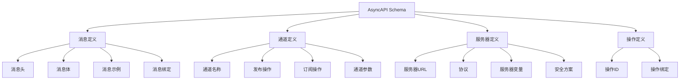

# AsyncAPI Schema概述

## 📑 目录

- [AsyncAPI Schema概述](#asyncapi-schema概述)
  - [📑 目录](#-目录)
  - [1. 核心结论](#1-核心结论)
    - [1.1 AsyncAPI Schema定义](#11-asyncapi-schema定义)
    - [1.2 标准依据](#12-标准依据)
  - [2. 概念定义](#2-概念定义)
    - [2.1 AsyncAPI Schema定义](#21-asyncapi-schema定义)
    - [2.2 核心特征](#22-核心特征)
    - [2.3 Schema分类](#23-schema分类)
  - [3. AsyncAPI Schema元素详细说明](#3-asyncapi-schema元素详细说明)
    - [3.1 消息定义Schema](#31-消息定义schema)
    - [3.2 通道Schema](#32-通道schema)
    - [3.3 服务器Schema](#33-服务器schema)
    - [3.4 操作Schema](#34-操作schema)
  - [4. 标准对标](#4-标准对标)
    - [4.1 AsyncAPI规范](#41-asyncapi规范)
    - [4.2 相关标准](#42-相关标准)
  - [5. 应用场景](#5-应用场景)
    - [5.1 事件驱动架构](#51-事件驱动架构)
    - [5.2 消息队列](#52-消息队列)
    - [5.3 微服务通信](#53-微服务通信)
    - [5.4 AsyncAPI数据存储与分析](#54-asyncapi数据存储与分析)
  - [6. 思维导图](#6-思维导图)

---

## 1. 核心结论

**AsyncAPI存在完整的Schema体系，定义了消息、通道、服务器、操作等核心元素**。

### 1.1 AsyncAPI Schema定义

```text
AsyncAPI_Schema = Message_Schema ⊕ Channel_Schema
                ⊕ Server_Schema ⊕ Operation_Schema
```

其中：
- `Message_Schema`：消息定义Schema
- `Channel_Schema`：通道定义Schema
- `Server_Schema`：服务器定义Schema
- `Operation_Schema`：操作定义Schema

### 1.2 标准依据

- **AsyncAPI 2.x**：异步API规范
- **AsyncAPI Specification**：AsyncAPI规范文档
- **OpenAPI**：与OpenAPI兼容的规范

---

## 2. 概念定义

### 2.1 AsyncAPI Schema定义

**AsyncAPI Schema**是描述异步API接口、消息格式、通道、服务器的形式化规范。

### 2.2 核心特征

1. **异步API**：专门用于异步API定义
2. **事件驱动**：支持事件驱动架构
3. **多协议**：支持多种消息协议（MQTT、Kafka、AMQP等）
4. **OpenAPI兼容**：与OpenAPI规范兼容
5. **工具丰富**：丰富的工具和库支持

### 2.3 Schema分类

- **消息Schema**：消息格式定义
- **通道Schema**：消息通道定义
- **服务器Schema**：服务器定义
- **操作Schema**：发布/订阅操作定义

---

## 3. AsyncAPI Schema元素详细说明

### 3.1 消息定义Schema

**定义**：描述AsyncAPI消息的结构。

**包含内容**：

- **消息头**：消息元数据
- **消息体**：消息内容
- **消息示例**：消息示例
- **消息绑定**：协议特定绑定

**示例**：

```yaml
asyncapi: 2.6.0
info:
  title: User Service
  version: 1.0.0

channels:
  user/signedup:
    publish:
      message:
        $ref: '#/components/messages/UserSignedUp'

components:
  messages:
    UserSignedUp:
      payload:
        type: object
        properties:
          userId:
            type: string
            format: uuid
          email:
            type: string
            format: email
          timestamp:
            type: string
            format: date-time
        required:
          - userId
          - email
          - timestamp
```

### 3.2 通道Schema

**定义**：描述AsyncAPI通道的结构。

**包含内容**：

- **通道名称**：通道标识符
- **发布操作**：发布消息操作
- **订阅操作**：订阅消息操作
- **参数**：通道参数

**示例**：

```yaml
channels:
  user/{userId}/events:
    parameters:
      userId:
        schema:
          type: string
    subscribe:
      message:
        $ref: '#/components/messages/UserEvent'
```

### 3.3 服务器Schema

**定义**：描述AsyncAPI服务器的结构。

**包含内容**：

- **服务器URL**：服务器地址
- **协议**：消息协议（MQTT、Kafka、AMQP等）
- **服务器变量**：服务器变量
- **安全方案**：安全认证方案

**示例**：

```yaml
servers:
  production:
    url: mqtt://broker.example.com:1883
    protocol: mqtt
    description: Production MQTT broker
  development:
    url: mqtt://localhost:1883
    protocol: mqtt
    description: Development MQTT broker
```

### 3.4 操作Schema

**定义**：描述AsyncAPI操作的结构。

**包含内容**：

- **发布操作**：发布消息操作
- **订阅操作**：订阅消息操作
- **操作ID**：操作标识符
- **操作绑定**：协议特定绑定

**示例**：

```yaml
channels:
  user/events:
    publish:
      operationId: publishUserEvent
      message:
        $ref: '#/components/messages/UserEvent'
      bindings:
        mqtt:
          qos: 1
          retain: false
    subscribe:
      operationId: subscribeUserEvents
      message:
        $ref: '#/components/messages/UserEvent'
```

---

## 4. 标准对标

### 4.1 AsyncAPI规范

**标准名称**：AsyncAPI Specification 2.x
**核心内容**：
- 异步API定义语法
- 消息格式定义
- 通道和服务器定义
- 协议绑定

**Schema支持**：完整支持
**参考链接**：https://www.asyncapi.com/docs/specifications/2.0.0

### 4.2 相关标准

- **OpenAPI**：RESTful API规范（与AsyncAPI兼容）
- **MQTT**：MQTT协议规范
- **Kafka**：Apache Kafka协议
- **AMQP**：AMQP协议规范

---

## 5. 应用场景

### 5.1 事件驱动架构

**场景描述**：事件驱动架构使用AsyncAPI定义事件接口。

**Schema应用**：
- 定义事件格式
- 定义事件通道
- 事件文档生成

**优势**：
- 标准化事件定义
- 自动文档生成
- 工具支持丰富

### 5.2 消息队列

**场景描述**：消息队列系统使用AsyncAPI定义消息格式。

**Schema应用**：
- 定义消息格式
- 定义主题/队列
- 消息验证

**优势**：
- 标准化消息格式
- 跨系统兼容
- 工具集成

### 5.3 微服务通信

**场景描述**：微服务使用AsyncAPI进行异步通信。

**Schema应用**：
- 定义服务接口
- 定义消息格式
- 服务文档生成

**优势**：
- 异步通信支持
- 标准化接口
- 服务发现

### 5.4 AsyncAPI数据存储与分析

**场景描述**：存储AsyncAPI Schema定义、消息实例、性能指标等数据。

**Schema应用**：
- 存储Schema定义
- 记录消息实例
- 分析性能指标

**数据库设计**：
- Schema定义表：存储AsyncAPI Schema定义
- 消息实例表：记录消息实例
- 性能指标表：存储消息处理性能数据
- 通道使用统计表：统计通道使用情况

---

## 6. 思维导图



---

**文档创建时间**：2025-01-21
**文档版本**：v1.0
**维护者**：DSL Schema研究团队

**相关文档**：
- `02_Formal_Definition.md` - 形式化定义
- `03_Standards.md` - 标准对标
- `04_Transformation.md` - 转换体系
- `05_Case_Studies.md` - 实践案例
