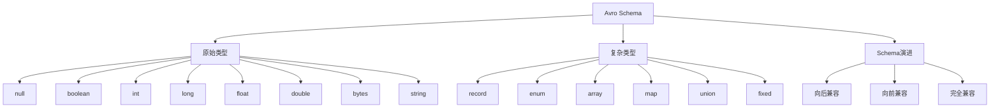

# Avro Schema概述

## 📑 目录

- [Avro Schema概述](#avro-schema概述)
  - [📑 目录](#-目录)
  - [1. 核心结论](#1-核心结论)
    - [1.1 Avro Schema定义](#11-avro-schema定义)
    - [1.2 标准依据](#12-标准依据)
  - [2. 概念定义](#2-概念定义)
    - [2.1 Avro Schema定义](#21-avro-schema定义)
    - [2.2 核心特征](#22-核心特征)
    - [2.3 Schema分类](#23-schema分类)
  - [3. Avro Schema元素详细说明](#3-avro-schema元素详细说明)
    - [3.1 原始类型Schema](#31-原始类型schema)
    - [3.2 复杂类型Schema](#32-复杂类型schema)
    - [3.3 Schema演进Schema](#33-schema演进schema)
  - [4. 标准对标](#4-标准对标)
    - [4.1 Apache Avro规范](#41-apache-avro规范)
    - [4.2 相关标准](#42-相关标准)
  - [5. 应用场景](#5-应用场景)
    - [5.1 大数据处理](#51-大数据处理)
    - [5.2 消息队列](#52-消息队列)
    - [5.3 数据存储](#53-数据存储)
    - [5.4 Avro数据存储与分析](#54-avro数据存储与分析)
  - [6. 思维导图](#6-思维导图)

---

## 1. 核心结论

**Avro存在完整的Schema体系，定义了原始类型、复杂类型、Schema演进等核心元素**。

### 1.1 Avro Schema定义

```text
Avro_Schema = Primitive_Type_Schema ⊕ Complex_Type_Schema
            ⊕ Schema_Evolution_Schema
```

其中：
- `Primitive_Type_Schema`：原始类型Schema（null、boolean、int、long、float、double、bytes、string）
- `Complex_Type_Schema`：复杂类型Schema（record、enum、array、map、union、fixed）
- `Schema_Evolution_Schema`：Schema演进Schema

### 1.2 标准依据

- **Apache Avro**：Apache数据序列化系统
- **Avro Specification**：Avro规范文档
- **Schema Registry**：Schema注册表规范

---

## 2. 概念定义

### 2.1 Avro Schema定义

**Avro Schema**是描述Avro数据类型、记录结构、Schema演进的形式化规范。

### 2.2 核心特征

1. **Schema演进**：支持Schema版本演进和兼容性
2. **动态类型**：支持动态类型解析
3. **高效序列化**：紧凑的二进制格式
4. **自描述**：Schema与数据一起存储
5. **大数据友好**：适合大数据处理场景

### 2.3 Schema分类

- **原始类型Schema**：基本数据类型
- **复杂类型Schema**：记录、数组、映射、联合类型
- **Schema演进Schema**：Schema版本管理和兼容性

---

## 3. Avro Schema元素详细说明

### 3.1 原始类型Schema

**定义**：描述Avro原始类型的结构。

**包含内容**：

- **null**：空值类型
- **boolean**：布尔类型
- **int**：32位整数
- **long**：64位整数
- **float**：32位浮点数
- **double**：64位浮点数
- **bytes**：字节数组
- **string**：UTF-8字符串

**示例**：

```json
{
  "type": "string"
}

{
  "type": "int"
}

{
  "type": "double"
}
```

### 3.2 复杂类型Schema

**定义**：描述Avro复杂类型的结构。

**包含内容**：

- **record**：记录类型（类似结构体）
- **enum**：枚举类型
- **array**：数组类型
- **map**：映射类型
- **union**：联合类型
- **fixed**：固定长度字节数组

**示例**：

```json
{
  "type": "record",
  "name": "User",
  "fields": [
    {"name": "id", "type": "string"},
    {"name": "name", "type": "string"},
    {"name": "email", "type": ["null", "string"], "default": null},
    {"name": "age", "type": ["null", "int"], "default": null},
    {"name": "tags", "type": {"type": "array", "items": "string"}}
  ]
}

{
  "type": "enum",
  "name": "UserRole",
  "symbols": ["ADMIN", "USER", "GUEST"]
}

{
  "type": "map",
  "values": "string"
}
```

### 3.3 Schema演进Schema

**定义**：描述Avro Schema演进的结构。

**包含内容**：

- **向后兼容**：新Schema可以读取旧数据
- **向前兼容**：旧Schema可以读取新数据
- **完全兼容**：双向兼容
- **字段添加**：添加可选字段
- **字段删除**：删除字段

---

## 4. 标准对标

### 4.1 Apache Avro规范

**标准名称**：Apache Avro Specification
**核心内容**：
- Schema定义语法
- 数据类型系统
- Schema演进规则
- 序列化格式

**Schema支持**：完整支持
**参考链接**：https://avro.apache.org/docs/current/spec.html

### 4.2 相关标准

- **Confluent Schema Registry**：Schema注册表实现
- **Apache Kafka**：使用Avro的消息队列
- **Apache Spark**：使用Avro的大数据处理

---

## 5. 应用场景

### 5.1 大数据处理

**场景描述**：大数据系统使用Avro进行数据序列化。

**Schema应用**：
- 定义数据格式
- 高效序列化
- Schema演进管理

**优势**：
- 高效处理
- Schema演进
- 跨语言支持

### 5.2 消息队列

**场景描述**：消息队列系统使用Avro作为消息格式。

**Schema应用**：
- 定义消息格式
- Schema注册表
- 版本兼容

**优势**：
- 紧凑格式
- Schema管理
- 版本兼容

### 5.3 数据存储

**场景描述**：数据存储系统使用Avro格式。

**Schema应用**：
- 定义存储格式
- 数据压缩
- Schema演进

**优势**：
- 高效存储
- Schema演进
- 快速查询

### 5.4 Avro数据存储与分析

**场景描述**：存储Avro Schema定义、数据实例、性能指标等数据。

**Schema应用**：
- 存储Schema定义
- 记录数据实例
- 分析性能指标

**数据库设计**：
- Schema定义表：存储Avro Schema定义
- 数据实例表：记录数据实例
- 性能指标表：存储序列化/反序列化性能数据
- Schema演进表：记录Schema演进历史

---

## 6. 思维导图



---

**文档创建时间**：2025-01-21
**文档版本**：v1.0
**维护者**：DSL Schema研究团队

**相关文档**：
- `02_Formal_Definition.md` - 形式化定义
- `03_Standards.md` - 标准对标
- `04_Transformation.md` - 转换体系
- `05_Case_Studies.md` - 实践案例
