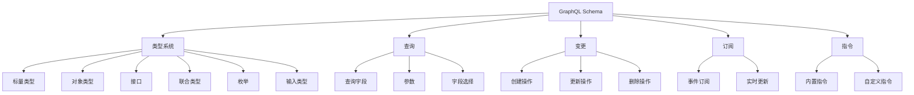

# GraphQL Schema概述

## 📑 目录

- [GraphQL Schema概述](#graphql-schema概述)
  - [📑 目录](#-目录)
  - [1. 核心结论](#1-核心结论)
    - [1.1 GraphQL Schema定义](#11-graphql-schema定义)
    - [1.2 标准依据](#12-标准依据)
  - [2. 概念定义](#2-概念定义)
    - [2.1 GraphQL Schema定义](#21-graphql-schema定义)
    - [2.2 核心特征](#22-核心特征)
    - [2.3 Schema分类](#23-schema分类)
  - [3. GraphQL Schema元素详细说明](#3-graphql-schema元素详细说明)
    - [3.1 类型系统Schema](#31-类型系统schema)
    - [3.2 查询Schema](#32-查询schema)
    - [3.3 变更Schema](#33-变更schema)
    - [3.4 订阅Schema](#34-订阅schema)
    - [3.5 指令Schema](#35-指令schema)
  - [4. 标准对标](#4-标准对标)
    - [4.1 GraphQL规范](#41-graphql规范)
      - [4.1.1 GraphQL Specification (October 2021)](#411-graphql-specification-october-2021)
      - [4.1.2 GraphQL Schema Language](#412-graphql-schema-language)
      - [4.1.3 GraphQL over HTTP](#413-graphql-over-http)
    - [4.2 相关标准](#42-相关标准)
  - [5. 应用场景](#5-应用场景)
    - [5.1 API网关](#51-api网关)
    - [5.2 微服务架构](#52-微服务架构)
    - [5.3 移动应用](#53-移动应用)
    - [5.4 GraphQL数据存储与分析](#54-graphql数据存储与分析)
  - [6. 思维导图](#6-思维导图)

---

## 1. 核心结论

**GraphQL存在完整的Schema体系，定义了类型系统、查询、变更、订阅等核心元素**。

### 1.1 GraphQL Schema定义

```text
GraphQL_Schema = Type_System ⊕ Query_Schema
               ⊕ Mutation_Schema ⊕ Subscription_Schema
               ⊕ Directive_Schema
```

其中：

- `Type_System`：GraphQL类型系统（标量类型、对象类型、接口、联合类型、枚举）
- `Query_Schema`：查询操作Schema
- `Mutation_Schema`：变更操作Schema
- `Subscription_Schema`：订阅操作Schema
- `Directive_Schema`：指令Schema

### 1.2 标准依据

- **GraphQL Specification**：GraphQL查询语言规范（2021年10月）
- **GraphQL Schema Language**：GraphQL Schema定义语言
- **GraphQL over HTTP**：GraphQL HTTP传输规范
- **GraphQL Cursor Connections**：GraphQL游标连接规范

---

## 2. 概念定义

### 2.1 GraphQL Schema定义

**GraphQL Schema**是描述GraphQL API的类型系统、查询、变更、订阅等操作的形式化规范。

### 2.2 核心特征

1. **类型安全**：强类型系统保证查询的类型安全
2. **自描述**：Schema本身包含完整的类型信息
3. **查询灵活性**：客户端可以精确指定需要的数据
4. **单一端点**：所有操作通过单一GraphQL端点
5. **实时订阅**：支持实时数据订阅

### 2.3 Schema分类

- **类型系统Schema**：标量类型、对象类型、接口、联合类型、枚举、输入类型
- **查询Schema**：查询操作定义
- **变更Schema**：变更操作定义
- **订阅Schema**：订阅操作定义
- **指令Schema**：指令定义（@deprecated、@skip、@include等）

---

## 3. GraphQL Schema元素详细说明

### 3.1 类型系统Schema

**定义**：描述GraphQL类型系统的结构。

**包含内容**：

- **标量类型**：Int、Float、String、Boolean、ID
- **对象类型**：用户定义的对象类型
- **接口**：抽象类型定义
- **联合类型**：多个类型的联合
- **枚举类型**：枚举值定义
- **输入类型**：输入参数类型
- **列表类型**：列表类型定义
- **非空类型**：非空类型定义

**示例**：

```graphql
type User {
  id: ID!
  name: String!
  email: String
  posts: [Post!]!
}

interface Node {
  id: ID!
}

union SearchResult = User | Post

enum Role {
  ADMIN
  USER
  GUEST
}

input CreateUserInput {
  name: String!
  email: String!
}
```

### 3.2 查询Schema

**定义**：描述GraphQL查询操作的结构。

**包含内容**：

- **查询字段**：查询字段定义
- **参数**：查询参数定义
- **字段选择**：客户端字段选择
- **别名**：字段别名
- **片段**：查询片段
- **变量**：查询变量

**示例**：

```graphql
type Query {
  user(id: ID!): User
  users(limit: Int, offset: Int): [User!]!
  search(query: String!): [SearchResult!]!
}
```

### 3.3 变更Schema

**定义**：描述GraphQL变更操作的结构。

**包含内容**：

- **变更字段**：变更字段定义
- **输入参数**：变更输入参数
- **返回值**：变更返回值

**示例**：

```graphql
type Mutation {
  createUser(input: CreateUserInput!): User!
  updateUser(id: ID!, input: UpdateUserInput!): User!
  deleteUser(id: ID!): Boolean!
}
```

### 3.4 订阅Schema

**定义**：描述GraphQL订阅操作的结构。

**包含内容**：

- **订阅字段**：订阅字段定义
- **事件触发**：事件触发机制
- **实时更新**：实时数据更新

**示例**：

```graphql
type Subscription {
  userCreated: User!
  userUpdated(id: ID!): User!
  postLiked(postId: ID!): Post!
}
```

### 3.5 指令Schema

**定义**：描述GraphQL指令的结构。

**包含内容**：

- **内置指令**：@deprecated、@skip、@include、@specifiedBy
- **自定义指令**：用户自定义指令
- **指令参数**：指令参数定义

**示例**：

```graphql
type User {
  id: ID!
  name: String!
  email: String @deprecated(reason: "Use contactEmail instead")
  contactEmail: String
}

directive @auth(requires: Role!) on FIELD_DEFINITION
```

---

## 4. 标准对标

### 4.1 GraphQL规范

#### 4.1.1 GraphQL Specification (October 2021)

**标准名称**：GraphQL Specification
**核心内容**：

- GraphQL查询语言规范
- GraphQL类型系统规范
- GraphQL执行规范
- GraphQL验证规范

**Schema支持**：

- 完整的类型系统定义
- 查询、变更、订阅操作定义
- 指令系统定义

**最新版本**：October 2021
**参考链接**：<https://spec.graphql.org/October2021/>

#### 4.1.2 GraphQL Schema Language

**标准名称**：GraphQL Schema Language
**核心内容**：

- Schema定义语言（SDL）
- 类型定义语法
- 指令定义语法

**Schema支持**：

- Schema文件格式
- 类型定义格式
- 指令定义格式

**参考链接**：<https://graphql.org/learn/schema/>

#### 4.1.3 GraphQL over HTTP

**标准名称**：GraphQL over HTTP
**核心内容**：

- HTTP传输规范
- 请求格式
- 响应格式

**Schema支持**：

- HTTP端点定义
- 请求Schema
- 响应Schema

**参考链接**：<https://graphql.org/learn/serving-over-http/>

### 4.2 相关标准

- **OpenAPI**：RESTful API规范（与GraphQL API相关）
- **JSON Schema**：JSON数据验证（与GraphQL响应相关）
- **OAuth 2.0**：授权标准（与GraphQL认证相关）
- **JWT**：JSON Web Token（与GraphQL认证相关）

---

## 5. 应用场景

### 5.1 API网关

**场景描述**：使用GraphQL作为统一API网关，聚合多个后端服务。

**Schema应用**：

- 定义统一的GraphQL Schema
- 聚合多个REST/gRPC服务
- 提供统一的查询接口

**优势**：

- 减少客户端请求次数
- 精确控制返回数据
- 统一API接口

### 5.2 微服务架构

**场景描述**：在微服务架构中使用GraphQL进行服务间通信。

**Schema应用**：

- 定义服务GraphQL Schema
- 服务间GraphQL查询
- 服务组合和聚合

**优势**：

- 类型安全的服务通信
- 灵活的查询能力
- 服务解耦

### 5.3 移动应用

**场景描述**：移动应用使用GraphQL API获取数据。

**Schema应用**：

- 定义移动应用GraphQL Schema
- 精确查询所需数据
- 减少数据传输量

**优势**：

- 减少网络传输
- 提高应用性能
- 灵活的查询能力

### 5.4 GraphQL数据存储与分析

**场景描述**：存储GraphQL Schema定义、查询日志、性能指标等数据，进行API分析和优化。

**Schema应用**：

- 存储GraphQL Schema定义
- 记录GraphQL查询日志
- 分析查询性能和模式

**数据库设计**：

- Schema定义表：存储GraphQL Schema定义
- 查询日志表：记录GraphQL查询历史
- 性能指标表：存储查询性能数据
- 类型使用统计表：统计类型使用情况

**分析场景**：

- Schema使用分析：分析哪些类型和字段最常用
- 查询性能分析：分析查询执行时间和复杂度
- 错误分析：分析查询错误和异常
- 客户端分析：分析不同客户端的查询模式

---

## 6. 思维导图



---

**文档创建时间**：2025-01-21
**文档版本**：v1.0
**维护者**：DSL Schema研究团队

**相关文档**：

- `02_Formal_Definition.md` - 形式化定义
- `03_Standards.md` - 标准对标
- `04_Transformation.md` - 转换体系
- `05_Case_Studies.md` - 实践案例
- `../../README.md` - 主题总览
