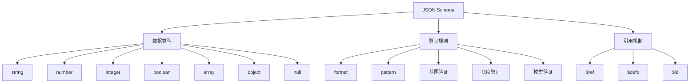

# JSON Schema概述

## 📑 目录

- [JSON Schema概述](#json-schema概述)
  - [📑 目录](#-目录)
  - [1. 核心结论](#1-核心结论)
    - [1.1 JSON Schema定义](#11-json-schema定义)
    - [1.2 标准依据](#12-标准依据)
  - [2. 概念定义](#2-概念定义)
    - [2.1 JSON Schema定义](#21-json-schema定义)
    - [2.2 核心特征](#22-核心特征)
    - [2.3 Schema分类](#23-schema分类)
  - [3. JSON Schema元素详细说明](#3-json-schema元素详细说明)
    - [3.1 数据类型Schema](#31-数据类型schema)
    - [3.2 验证规则Schema](#32-验证规则schema)
    - [3.3 引用Schema](#33-引用schema)
  - [4. 标准对标](#4-标准对标)
    - [4.1 JSON Schema规范](#41-json-schema规范)
    - [4.2 相关标准](#42-相关标准)
  - [5. 应用场景](#5-应用场景)
    - [5.1 数据验证](#51-数据验证)
    - [5.2 API文档](#52-api文档)
    - [5.3 表单验证](#53-表单验证)
    - [5.4 JSON Schema数据存储与分析](#54-json-schema数据存储与分析)
  - [6. 思维导图](#6-思维导图)

---

## 1. 核心结论

**JSON Schema存在完整的Schema体系，定义了数据类型、验证规则、引用等核心元素**。

### 1.1 JSON Schema定义

```text
JSON_Schema = Data_Type_Schema ⊕ Validation_Rule_Schema
            ⊕ Reference_Schema
```

其中：
- `Data_Type_Schema`：数据类型Schema（string、number、integer、boolean、array、object、null）
- `Validation_Rule_Schema`：验证规则Schema（format、pattern、minimum、maximum等）
- `Reference_Schema`：引用Schema（$ref、$defs）

### 1.2 标准依据

- **JSON Schema Draft 2020-12**：JSON Schema最新规范
- **JSON Schema Validation**：JSON Schema验证规范
- **JSON Schema Hyper-Schema**：JSON Schema超媒体规范

---

## 2. 概念定义

### 2.1 JSON Schema定义

**JSON Schema**是描述JSON数据结构和验证规则的形式化规范。

### 2.2 核心特征

1. **数据验证**：强大的数据验证能力
2. **自描述**：Schema本身是JSON格式
3. **可组合**：支持Schema组合和引用
4. **工具丰富**：丰富的验证工具和库
5. **广泛采用**：广泛应用于API和数据验证

### 2.3 Schema分类

- **数据类型Schema**：基本数据类型定义
- **验证规则Schema**：数据验证规则
- **引用Schema**：Schema引用和组合

---

## 3. JSON Schema元素详细说明

### 3.1 数据类型Schema

**定义**：描述JSON数据类型的结构。

**包含内容**：

- **string**：字符串类型
- **number**：数字类型
- **integer**：整数类型
- **boolean**：布尔类型
- **array**：数组类型
- **object**：对象类型
- **null**：空值类型

**示例**：

```json
{
  "type": "object",
  "properties": {
    "id": {
      "type": "string",
      "format": "uuid"
    },
    "name": {
      "type": "string",
      "minLength": 1,
      "maxLength": 100
    },
    "age": {
      "type": "integer",
      "minimum": 0,
      "maximum": 150
    },
    "email": {
      "type": "string",
      "format": "email"
    },
    "tags": {
      "type": "array",
      "items": {
        "type": "string"
      }
    }
  },
  "required": ["id", "name"]
}
```

### 3.2 验证规则Schema

**定义**：描述JSON数据验证规则的结构。

**包含内容**：

- **format**：格式验证（email、uri、date-time等）
- **pattern**：正则表达式验证
- **minimum/maximum**：数值范围验证
- **minLength/maxLength**：字符串长度验证
- **minItems/maxItems**：数组长度验证
- **enum**：枚举值验证
- **const**：常量值验证

**示例**：

```json
{
  "type": "string",
  "pattern": "^[A-Z][a-z]+$",
  "minLength": 2,
  "maxLength": 50
}

{
  "type": "number",
  "minimum": 0,
  "maximum": 100,
  "multipleOf": 0.5
}

{
  "type": "array",
  "items": {
    "type": "string"
  },
  "minItems": 1,
  "maxItems": 10,
  "uniqueItems": true
}
```

### 3.3 引用Schema

**定义**：描述JSON Schema引用的结构。

**包含内容**：

- **$ref**：Schema引用
- **$defs**：Schema定义集合
- **$id**：Schema标识符
- **$schema**：Schema版本标识

**示例**：

```json
{
  "$schema": "https://json-schema.org/draft/2020-12/schema",
  "$id": "https://example.com/user.schema.json",
  "$defs": {
    "address": {
      "type": "object",
      "properties": {
        "street": {"type": "string"},
        "city": {"type": "string"},
        "country": {"type": "string"}
      },
      "required": ["street", "city", "country"]
    }
  },
  "type": "object",
  "properties": {
    "name": {"type": "string"},
    "address": {"$ref": "#/$defs/address"}
  }
}
```

---

## 4. 标准对标

### 4.1 JSON Schema规范

**标准名称**：JSON Schema Draft 2020-12
**核心内容**：
- Schema定义语法
- 数据类型系统
- 验证规则
- 引用机制

**Schema支持**：完整支持
**参考链接**：https://json-schema.org/specification.html

### 4.2 相关标准

- **OpenAPI**：使用JSON Schema定义API
- **JSON-LD**：JSON Schema与JSON-LD集成
- **JSON API**：JSON Schema与JSON API集成

---

## 5. 应用场景

### 5.1 数据验证

**场景描述**：使用JSON Schema进行数据验证。

**Schema应用**：
- 定义数据格式
- 验证数据有效性
- 错误报告

**优势**：
- 强大验证能力
- 详细错误信息
- 工具支持丰富

### 5.2 API文档

**场景描述**：使用JSON Schema定义API文档。

**Schema应用**：
- 定义请求/响应格式
- 生成API文档
- API测试

**优势**：
- 标准化格式
- 自动文档生成
- 工具集成

### 5.3 表单验证

**场景描述**：使用JSON Schema进行表单验证。

**Schema应用**：
- 定义表单字段
- 实时验证
- 错误提示

**优势**：
- 前后端一致
- 实时验证
- 用户体验好

### 5.4 JSON Schema数据存储与分析

**场景描述**：存储JSON Schema定义、验证结果、性能指标等数据。

**Schema应用**：
- 存储Schema定义
- 记录验证结果
- 分析性能指标

**数据库设计**：
- Schema定义表：存储JSON Schema定义
- 验证结果表：记录验证结果
- 性能指标表：存储验证性能数据
- 使用统计表：统计Schema使用情况

---

## 6. 思维导图



---

**文档创建时间**：2025-01-21
**文档版本**：v1.0
**维护者**：DSL Schema研究团队

**相关文档**：
- `02_Formal_Definition.md` - 形式化定义
- `03_Standards.md` - 标准对标
- `04_Transformation.md` - 转换体系
- `05_Case_Studies.md` - 实践案例
