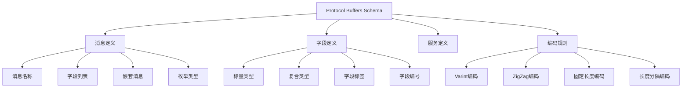

# Protocol Buffers Schema概述

## 📑 目录

- [Protocol Buffers Schema概述](#protocol-buffers-schema概述)
  - [📑 目录](#-目录)
  - [1. 核心结论](#1-核心结论)
    - [1.1 Protocol Buffers Schema定义](#11-protocol-buffers-schema定义)
    - [1.2 标准依据](#12-标准依据)
  - [2. 概念定义](#2-概念定义)
    - [2.1 Protocol Buffers Schema定义](#21-protocol-buffers-schema定义)
    - [2.2 核心特征](#22-核心特征)
    - [2.3 Schema分类](#23-schema分类)
  - [3. Protocol Buffers Schema元素详细说明](#3-protocol-buffers-schema元素详细说明)
    - [3.1 消息定义Schema](#31-消息定义schema)
    - [3.2 字段类型Schema](#32-字段类型schema)
    - [3.3 服务定义Schema](#33-服务定义schema)
    - [3.4 编码规则Schema](#34-编码规则schema)
  - [4. 标准对标](#4-标准对标)
    - [4.1 Protocol Buffers规范](#41-protocol-buffers规范)
    - [4.2 相关标准](#42-相关标准)
  - [5. 应用场景](#5-应用场景)
    - [5.1 数据序列化](#51-数据序列化)
    - [5.2 gRPC服务定义](#52-grpc服务定义)
    - [5.3 数据存储](#53-数据存储)
    - [5.4 Protocol Buffers数据存储与分析](#54-protocol-buffers数据存储与分析)
  - [6. 思维导图](#6-思维导图)

---

## 1. 核心结论

**Protocol Buffers存在完整的Schema体系，定义了消息类型、字段、服务等核心元素**。

### 1.1 Protocol Buffers Schema定义

```text
Protocol_Buffers_Schema = Message_Schema ⊕ Field_Schema
                        ⊕ Service_Schema ⊕ Encoding_Schema
```

其中：

- `Message_Schema`：消息定义Schema
- `Field_Schema`：字段定义Schema
- `Service_Schema`：服务定义Schema
- `Encoding_Schema`：编码规则Schema

### 1.2 标准依据

- **Protocol Buffers 3.x**：Google数据序列化格式规范
- **protobuf**：Protocol Buffers实现规范
- **gRPC**：使用Protocol Buffers的服务定义

---

## 2. 概念定义

### 2.1 Protocol Buffers Schema定义

**Protocol Buffers Schema**是描述Protocol Buffers消息类型、字段、服务的形式化规范。

### 2.2 核心特征

1. **高效序列化**：紧凑的二进制格式
2. **向后兼容**：支持Schema演进
3. **跨语言**：支持多种编程语言
4. **代码生成**：自动生成序列化/反序列化代码
5. **类型安全**：强类型系统

### 2.3 Schema分类

- **消息Schema**：消息类型定义
- **字段Schema**：字段类型和标签
- **服务Schema**：gRPC服务定义
- **编码Schema**：编码规则定义

---

## 3. Protocol Buffers Schema元素详细说明

### 3.1 消息定义Schema

**定义**：描述Protocol Buffers消息的结构。

**包含内容**：

- **消息名称**：消息类型标识符
- **字段列表**：消息字段定义
- **嵌套消息**：嵌套消息类型
- **枚举类型**：枚举类型定义

**示例**：

```protobuf
syntax = "proto3";

message User {
  string id = 1;
  string name = 2;
  string email = 3;
  int64 created_at = 4;
  repeated string tags = 5;

  message Address {
    string street = 1;
    string city = 2;
    string country = 3;
  }

  Address address = 6;
}

enum UserRole {
  ADMIN = 0;
  USER = 1;
  GUEST = 2;
}
```

### 3.2 字段类型Schema

**定义**：描述Protocol Buffers字段类型的结构。

**包含内容**：

- **标量类型**：int32、int64、string、bool等
- **复合类型**：message、enum
- **字段标签**：optional、repeated、required
- **字段编号**：唯一字段编号（1-536870911）

**示例**：

```protobuf
message Example {
  int32 id = 1;                    // 标量类型
  string name = 2;                  // 标量类型
  repeated int32 numbers = 3;       // repeated标签
  User user = 4;                    // 消息类型
  UserRole role = 5;                // 枚举类型
  map<string, string> metadata = 6; // Map类型
}
```

### 3.3 服务定义Schema

**定义**：描述gRPC服务定义的结构。

**包含内容**：

- **服务名称**：服务标识符
- **RPC方法**：服务方法定义
- **方法类型**：一元RPC、流式RPC

**示例**：

```protobuf
service UserService {
  rpc GetUser(GetUserRequest) returns (User);
  rpc CreateUser(CreateUserRequest) returns (User);
  rpc ListUsers(ListUsersRequest) returns (stream User);
}
```

### 3.4 编码规则Schema

**定义**：描述Protocol Buffers编码规则的结构。

**包含内容**：

- **Varint编码**：变长整数编码
- **ZigZag编码**：有符号整数编码
- **固定长度编码**：固定长度类型编码
- **长度分隔编码**：字符串、字节数组编码

---

## 4. 标准对标

### 4.1 Protocol Buffers规范

**标准名称**：Protocol Buffers 3.x
**核心内容**：

- 消息定义语法
- 字段类型系统
- 编码规则
- Schema演进规则

**Schema支持**：完整支持
**参考链接**：<https://developers.google.com/protocol-buffers>

### 4.2 相关标准

- **gRPC**：使用Protocol Buffers的服务定义
- **JSON**：Protocol Buffers与JSON的转换
- **XML**：Protocol Buffers与XML的转换

---

## 5. 应用场景

### 5.1 数据序列化

**场景描述**：使用Protocol Buffers进行高效数据序列化。

**Schema应用**：

- 定义消息类型
- 序列化/反序列化
- 跨语言数据交换

**优势**：

- 高效序列化
- 紧凑格式
- 跨语言支持

### 5.2 gRPC服务定义

**场景描述**：使用Protocol Buffers定义gRPC服务接口。

**Schema应用**：

- 定义服务接口
- 定义消息类型
- 生成代码

**优势**：

- 类型安全
- 代码生成
- 高效通信

### 5.3 数据存储

**场景描述**：使用Protocol Buffers格式存储数据。

**Schema应用**：

- 定义存储格式
- 数据压缩
- 版本兼容

**优势**：

- 紧凑存储
- 快速读写
- 版本兼容

### 5.4 Protocol Buffers数据存储与分析

**场景描述**：存储Protocol Buffers Schema定义、消息实例、性能指标等数据。

**Schema应用**：

- 存储Schema定义
- 记录消息实例
- 分析性能指标

**数据库设计**：

- Schema定义表：存储Protocol Buffers Schema定义
- 消息实例表：记录消息实例
- 性能指标表：存储序列化/反序列化性能数据

---

## 6. 思维导图



---

**文档创建时间**：2025-01-21
**文档版本**：v1.0
**维护者**：DSL Schema研究团队

**相关文档**：

- `02_Formal_Definition.md` - 形式化定义
- `03_Standards.md` - 标准对标
- `04_Transformation.md` - 转换体系
- `05_Case_Studies.md` - 实践案例
