# gRPC Schema概述

## 📑 目录

- [gRPC Schema概述](#grpc-schema概述)
  - [📑 目录](#-目录)
  - [1. 核心结论](#1-核心结论)
    - [1.1 gRPC Schema定义](#11-grpc-schema定义)
    - [1.2 标准依据](#12-标准依据)
  - [2. 概念定义](#2-概念定义)
    - [2.1 gRPC Schema定义](#21-grpc-schema定义)
    - [2.2 核心特征](#22-核心特征)
    - [2.3 Schema分类](#23-schema分类)
  - [3. gRPC Schema元素详细说明](#3-grpc-schema元素详细说明)
    - [3.1 服务定义Schema](#31-服务定义schema)
    - [3.2 消息类型Schema](#32-消息类型schema)
    - [3.3 RPC方法Schema](#33-rpc方法schema)
    - [3.4 流式RPC Schema](#34-流式rpc-schema)
  - [4. 标准对标](#4-标准对标)
    - [4.1 gRPC规范](#41-grpc规范)
    - [4.2 Protocol Buffers规范](#42-protocol-buffers规范)
    - [4.3 HTTP/2规范](#43-http2规范)
  - [5. 应用场景](#5-应用场景)
    - [5.1 微服务通信](#51-微服务通信)
    - [5.2 高性能API](#52-高性能api)
    - [5.3 流式数据处理](#53-流式数据处理)
    - [5.4 gRPC数据存储与分析](#54-grpc数据存储与分析)
  - [6. 思维导图](#6-思维导图)

---

## 1. 核心结论

**gRPC存在完整的Schema体系，定义了服务、消息类型、RPC方法等核心元素**。

### 1.1 gRPC Schema定义

```text
gRPC_Schema = Service_Definition ⊕ Message_Type_Schema
            ⊕ RPC_Method_Schema ⊕ Streaming_RPC_Schema
```

其中：
- `Service_Definition`：gRPC服务定义
- `Message_Type_Schema`：Protocol Buffers消息类型Schema
- `RPC_Method_Schema`：RPC方法Schema
- `Streaming_RPC_Schema`：流式RPC Schema

### 1.2 标准依据

- **gRPC**：Google远程过程调用框架
- **Protocol Buffers**：Google数据序列化格式（protobuf 3.x）
- **HTTP/2**：HTTP/2传输协议
- **gRPC-Web**：gRPC Web支持规范

---

## 2. 概念定义

### 2.1 gRPC Schema定义

**gRPC Schema**是描述gRPC服务接口、消息类型、RPC方法的形式化规范。

### 2.2 核心特征

1. **高性能**：基于HTTP/2和Protocol Buffers的高性能RPC框架
2. **类型安全**：强类型系统保证RPC调用的类型安全
3. **流式支持**：支持单向流、双向流等流式RPC
4. **跨语言**：支持多种编程语言
5. **代码生成**：自动生成客户端和服务器代码

### 2.3 Schema分类

- **服务定义Schema**：gRPC服务定义
- **消息类型Schema**：Protocol Buffers消息类型
- **RPC方法Schema**：一元RPC、服务器流、客户端流、双向流
- **流式RPC Schema**：流式数据传输Schema

---

## 3. gRPC Schema元素详细说明

### 3.1 服务定义Schema

**定义**：描述gRPC服务的结构。

**包含内容**：

- **服务名称**：服务标识符
- **RPC方法**：服务方法定义
- **服务选项**：服务级配置选项

**示例**：

```protobuf
service UserService {
  rpc GetUser(GetUserRequest) returns (User);
  rpc CreateUser(CreateUserRequest) returns (User);
  rpc UpdateUser(UpdateUserRequest) returns (User);
  rpc DeleteUser(DeleteUserRequest) returns (Empty);
}
```

### 3.2 消息类型Schema

**定义**：描述gRPC消息类型的结构。

**包含内容**：

- **字段定义**：消息字段
- **字段类型**：标量类型、消息类型、枚举类型
- **字段编号**：唯一字段编号
- **字段标签**：optional、repeated、required

**示例**：

```protobuf
message User {
  string id = 1;
  string name = 2;
  string email = 3;
  int64 created_at = 4;
  repeated string tags = 5;
}

message GetUserRequest {
  string user_id = 1;
}
```

### 3.3 RPC方法Schema

**定义**：描述gRPC RPC方法的结构。

**包含内容**：

- **方法名称**：RPC方法标识符
- **请求类型**：请求消息类型
- **响应类型**：响应消息类型
- **方法类型**：一元RPC、服务器流、客户端流、双向流

**示例**：

```protobuf
service ChatService {
  // 一元RPC
  rpc SendMessage(SendMessageRequest) returns (SendMessageResponse);

  // 服务器流
  rpc SubscribeMessages(SubscribeRequest) returns (stream Message);

  // 客户端流
  rpc UploadFile(stream FileChunk) returns (UploadResponse);

  // 双向流
  rpc Chat(stream ChatMessage) returns (stream ChatMessage);
}
```

### 3.4 流式RPC Schema

**定义**：描述gRPC流式RPC的结构。

**包含内容**：

- **流方向**：服务器流、客户端流、双向流
- **流控制**：流控制机制
- **错误处理**：流错误处理

---

## 4. 标准对标

### 4.1 gRPC规范

**标准名称**：gRPC
**核心内容**：
- gRPC服务定义
- RPC方法定义
- 流式RPC支持
- 错误处理机制

**Schema支持**：完整支持
**参考链接**：https://grpc.io/

### 4.2 Protocol Buffers规范

**标准名称**：Protocol Buffers 3.x
**核心内容**：
- 消息定义语法
- 字段类型系统
- 编码规则

**Schema支持**：完整支持
**参考链接**：https://developers.google.com/protocol-buffers

### 4.3 HTTP/2规范

**标准名称**：HTTP/2
**核心内容**：
- HTTP/2传输协议
- 多路复用
- 流控制

**Schema支持**：传输层支持
**参考链接**：https://http2.github.io/

---

## 5. 应用场景

### 5.1 微服务通信

**场景描述**：微服务架构中使用gRPC进行服务间通信。

**Schema应用**：
- 定义服务接口
- 定义消息类型
- 生成客户端和服务器代码

**优势**：
- 高性能通信
- 类型安全
- 跨语言支持

### 5.2 高性能API

**场景描述**：高性能API服务使用gRPC。

**Schema应用**：
- 定义API接口
- 优化数据传输
- 支持流式传输

**优势**：
- 低延迟
- 高吞吐量
- 高效序列化

### 5.3 流式数据处理

**场景描述**：实时数据处理使用gRPC流式RPC。

**Schema应用**：
- 定义流式接口
- 实时数据传输
- 流控制

**优势**：
- 实时性
- 高效传输
- 流控制

### 5.4 gRPC数据存储与分析

**场景描述**：存储gRPC服务定义、调用日志、性能指标等数据，进行API分析和优化。

**Schema应用**：
- 存储服务定义
- 记录调用日志
- 分析性能指标

**数据库设计**：
- 服务定义表：存储gRPC服务定义
- 调用日志表：记录gRPC调用历史
- 性能指标表：存储调用性能数据
- 方法使用统计表：统计方法使用情况

---

## 6. 思维导图

```mermaid
graph TB
    gRPC[gRPC Schema]

    gRPC --> Service[服务定义]
    gRPC --> Message[消息类型]
    gRPC --> RPC[RPC方法]
    gRPC --> Streaming[流式RPC]

    Service --> ServiceName[服务名称]
    Service --> RPCMethods[RPC方法列表]
    Service --> Options[服务选项]

    Message --> Fields[字段定义]
    Message --> Types[字段类型]
    Message --> Numbers[字段编号]

    RPC --> Unary[一元RPC]
    RPC --> ServerStream[服务器流]
    RPC --> ClientStream[客户端流]
    RPC --> BidirectionalStream[双向流]

    Streaming --> FlowControl[流控制]
    Streaming --> ErrorHandling[错误处理]
```



---

**文档创建时间**：2025-01-21
**文档版本**：v1.0
**维护者**：DSL Schema研究团队

**相关文档**：
- `02_Formal_Definition.md` - 形式化定义
- `03_Standards.md` - 标准对标
- `04_Transformation.md` - 转换体系
- `05_Case_Studies.md` - 实践案例
