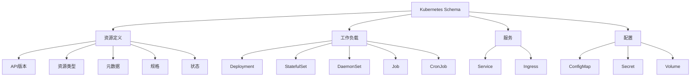

# Kubernetes Schema概述

## 📑 目录

- [Kubernetes Schema概述](#kubernetes-schema概述)
  - [📑 目录](#-目录)
  - [1. 核心结论](#1-核心结论)
    - [1.1 Kubernetes Schema定义](#11-kubernetes-schema定义)
    - [1.2 标准依据](#12-标准依据)
  - [2. 概念定义](#2-概念定义)
    - [2.1 Kubernetes Schema定义](#21-kubernetes-schema定义)
    - [2.2 核心特征](#22-核心特征)
    - [2.3 Schema分类](#23-schema分类)
  - [3. Kubernetes Schema元素详细说明](#3-kubernetes-schema元素详细说明)
    - [3.1 资源定义Schema](#31-资源定义schema)
    - [3.2 工作负载Schema](#32-工作负载schema)
    - [3.3 服务Schema](#33-服务schema)
    - [3.4 配置Schema](#34-配置schema)
  - [4. 标准对标](#4-标准对标)
    - [4.1 Kubernetes规范](#41-kubernetes规范)
    - [4.2 相关标准](#42-相关标准)
  - [5. 应用场景](#5-应用场景)
    - [5.1 容器编排](#51-容器编排)
    - [5.2 微服务部署](#52-微服务部署)
    - [5.3 云原生应用](#53-云原生应用)
    - [5.4 Kubernetes数据存储与分析](#54-kubernetes数据存储与分析)
  - [6. 思维导图](#6-思维导图)

---

## 1. 核心结论

**Kubernetes存在完整的Schema体系，定义了资源、工作负载、服务、配置等核心元素**。

### 1.1 Kubernetes Schema定义

```text
Kubernetes_Schema = Resource_Schema ⊕ Workload_Schema
                   ⊕ Service_Schema ⊕ Config_Schema
```

其中：

- `Resource_Schema`：Kubernetes资源定义Schema
- `Workload_Schema`：工作负载Schema（Deployment、StatefulSet、DaemonSet等）
- `Service_Schema`：服务Schema（Service、Ingress等）
- `Config_Schema`：配置Schema（ConfigMap、Secret等）

### 1.2 标准依据

- **Kubernetes API规范**：Kubernetes API规范
- **CNCF规范**：云原生计算基金会规范
- **OpenAPI**：Kubernetes使用OpenAPI定义API

---

## 2. 概念定义

### 2.1 Kubernetes Schema定义

**Kubernetes Schema**是描述Kubernetes资源定义、工作负载、服务、配置的形式化规范。

### 2.2 核心特征

1. **声明式配置**：声明式资源配置和管理
2. **资源抽象**：统一的资源抽象模型
3. **扩展性**：支持自定义资源（CRD）
4. **标准化**：基于OpenAPI规范
5. **云原生**：支持云原生应用架构

### 2.3 Schema分类

- **资源Schema**：Kubernetes资源定义
- **工作负载Schema**：应用部署和工作负载
- **服务Schema**：服务发现和负载均衡
- **配置Schema**：配置和密钥管理

---

## 3. Kubernetes Schema元素详细说明

### 3.1 资源定义Schema

**定义**：描述Kubernetes资源的结构。

**包含内容**：

- **apiVersion**：API版本
- **kind**：资源类型
- **metadata**：元数据（name、labels、annotations等）
- **spec**：资源规格
- **status**：资源状态

**示例**：

```yaml
apiVersion: v1
kind: Pod
metadata:
  name: my-pod
  labels:
    app: my-app
spec:
  containers:
  - name: my-container
    image: nginx:latest
    ports:
    - containerPort: 80
```

### 3.2 工作负载Schema

**定义**：描述Kubernetes工作负载的结构。

**包含内容**：

- **Deployment**：无状态应用部署
- **StatefulSet**：有状态应用部署
- **DaemonSet**：守护进程部署
- **Job**：一次性任务
- **CronJob**：定时任务

**示例**：

```yaml
apiVersion: apps/v1
kind: Deployment
metadata:
  name: my-deployment
spec:
  replicas: 3
  selector:
    matchLabels:
      app: my-app
  template:
    metadata:
      labels:
        app: my-app
    spec:
      containers:
      - name: my-container
        image: nginx:latest
```

### 3.3 服务Schema

**定义**：描述Kubernetes服务的结构。

**包含内容**：

- **Service**：服务定义
- **Ingress**：入口定义
- **Endpoint**：端点定义

**示例**：

```yaml
apiVersion: v1
kind: Service
metadata:
  name: my-service
spec:
  selector:
    app: my-app
  ports:
  - protocol: TCP
    port: 80
    targetPort: 8080
  type: LoadBalancer
```

### 3.4 配置Schema

**定义**：描述Kubernetes配置的结构。

**包含内容**：

- **ConfigMap**：配置映射
- **Secret**：密钥
- **Volume**：存储卷

---

## 4. 标准对标

### 4.1 Kubernetes规范

**标准名称**：Kubernetes API规范
**核心内容**：

- 资源定义规范
- API版本管理
- 资源验证规则

**Schema支持**：完整支持
**参考链接**：<https://kubernetes.io/docs/reference/>

### 4.2 相关标准

- **OpenAPI**：Kubernetes使用OpenAPI定义API
- **CNCF**：云原生计算基金会规范
- **OCI**：容器运行时规范

---

## 5. 应用场景

### 5.1 容器编排

**场景描述**：使用Kubernetes进行容器编排和管理。

**Schema应用**：

- 定义Pod和容器
- 定义部署策略
- 定义服务发现

### 5.2 微服务部署

**场景描述**：微服务架构使用Kubernetes部署。

**Schema应用**：

- 定义微服务部署
- 定义服务间通信
- 定义配置管理

### 5.3 云原生应用

**场景描述**：云原生应用使用Kubernetes运行。

**Schema应用**：

- 定义应用架构
- 定义资源需求
- 定义扩展策略

### 5.4 Kubernetes数据存储与分析

**场景描述**：存储Kubernetes资源定义、事件、指标等数据。

**Schema应用**：

- 存储资源定义
- 记录资源事件
- 分析资源使用情况

**数据库设计**：

- 资源定义表：存储Kubernetes资源定义
- 资源事件表：记录资源事件
- 资源指标表：存储资源使用指标
- 资源关系表：记录资源间关系

---

## 6. 思维导图



---

**文档创建时间**：2025-01-21
**文档版本**：v1.0
**维护者**：DSL Schema研究团队

**相关文档**：

- `02_Formal_Definition.md` - 形式化定义
- `03_Standards.md` - 标准对标
- `04_Transformation.md` - 转换体系
- `05_Case_Studies.md` - 实践案例
