# 云原生DevOps Schema思维导图

## 📑 目录

- [云原生DevOps Schema思维导图](#云原生devops-schema思维导图)
  - [📑 目录](#-目录)
  - [1. 思维导图概述](#1-思维导图概述)
    - [1.1 导图结构](#11-导图结构)
    - [1.2 核心概念](#12-核心概念)
    - [1.3 关联主题](#13-关联主题)
  - [2. 完整思维导图](#2-完整思维导图)
  - [3. 主要分支详解](#3-主要分支详解)
    - [3.1 容器化](#31-容器化)
    - [3.2 微服务](#32-微服务)
    - [3.3 持续交付](#33-持续交付)
    - [3.4 可观测性](#34-可观测性)
    - [3.5 基础设施](#35-基础设施)
  - [4. Mermaid可视化](#4-mermaid可视化)
    - [4.1 思维导图Mermaid图](#41-思维导图mermaid图)
    - [4.2 关联主题图](#42-关联主题图)

---

## 1. 思维导图概述

本文档以思维导图的形式展示云原生DevOps Schema
的知识体系结构，帮助理解各个子领域之间的关系。

### 1.1 导图结构

思维导图分为以下主要分支：

1. **容器化**: Docker, Kubernetes, Helm...
2. **微服务**: 服务拆分, 服务注册, 负载均衡...
3. **持续交付**: CI/CD, GitOps, 蓝绿部署...
4. **可观测性**: 日志聚合, 指标监控, 链路追踪...
5. **基础设施**: IaC, Terraform, Ansible...

### 1.2 核心概念

云原生DevOps Schema的核心概念包括：

- **Schema定义**: 领域特定的数据结构和语义规范
- **标准化**: 遵循行业标准和最佳实践
- **互操作性**: 不同系统之间的数据交换能力
- **可扩展性**: 支持业务增长和变化的能力

### 1.3 关联主题

本主题与以下主题有关联：

- **29_API_Protocol_Schemas**: API协议Schema
- **25_AI_Code_Integration**: AI代码集成Schema
- **32_Security_Compliance**: 安全合规Schema

---

## 2. 完整思维导图

```text
云原生DevOps Schema
│

├─ 1. 容器化
│   ├─ Docker
│   ├─ Kubernetes
│   ├─ Helm
│   ├─ 容器安全

├─ 2. 微服务
│   ├─ 服务拆分
│   ├─ 服务注册
│   ├─ 负载均衡
│   ├─ 熔断降级

├─ 3. 持续交付
│   ├─ CI/CD
│   ├─ GitOps
│   ├─ 蓝绿部署
│   ├─ 金丝雀发布

├─ 4. 可观测性
│   ├─ 日志聚合
│   ├─ 指标监控
│   ├─ 链路追踪
│   ├─ 告警管理

├─ 5. 基础设施
│   ├─ IaC
│   ├─ Terraform
│   ├─ Ansible
│   ├─ 多云管理
│
└─ 标准体系
    ├─ 国际标准
    │   ├─ ISO系列标准
    │   └─ IEC系列标准
    ├─ 行业标准
    │   ├─ 行业协会标准
    │   └─ 事实标准
    └─ 技术规范
        ├─ API规范
        ├─ 数据格式
        └─ 协议规范

├─ 技术架构
    │
    ├─ 数据层
    │   ├─ 数据模型
    │   ├─ 存储方案
    │   └─ 数据治理
    │
    ├─ 服务层
    │   ├─ 业务服务
    │   ├─ 集成服务
    │   └─ 公共服务
    │
    ├─ 应用层
    │   ├─ 业务应用
    │   ├─ 移动应用
    │   └─ 分析应用
    │
    └─ 接入层
        ├─ API网关
        ├─ 消息总线
        └─ 文件交换

├─ 集成模式
    │
    ├─ 系统间集成
    │   ├─ ESB总线
    │   ├─ API集成
    │   └─ 消息队列
    │
    ├─ 数据集成
    │   ├─ ETL流程
    │   ├─ 数据同步
    │   └─ 主数据管理
    │
    └─ 流程集成
        ├─ BPM编排
        ├─ 事件驱动
        └─ 微服务编排

├─ 安全体系
    │
    ├─ 身份认证
    │   ├─ 单点登录
    │   ├─ 多因素认证
    │   └─ 零信任架构
    │
    ├─ 访问控制
    │   ├─ 基于角色RBAC
    │   ├─ 基于属性ABAC
    │   └─ 最小权限原则
    │
    ├─ 数据安全
    │   ├─ 加密存储
    │   ├─ 传输加密
    │   └─ 数据脱敏
    │
    └─ 合规审计
        ├─ 日志记录
        ├─ 合规检查
        └─ 风险评估

└─ 实施方法
    │
    ├─ 方法论
    │   ├─ 敏捷开发
    │   ├─ DevOps
    │   └─ 领域驱动设计
    │
    ├─ 工具链
    │   ├─ 建模工具
    │   ├─ 开发框架
    │   └─ 测试工具
    │
    └─ 最佳实践
        ├─ 设计模式
        ├─ 代码规范
        └─ 运维规范
```

---

## 3. 主要分支详解

### 3.1 容器化

```text
容器化
    ├─ Docker
    ├─ Kubernetes
    ├─ Helm
    ├─ 容器安全
```

### 3.2 微服务

```text
微服务
    ├─ 服务拆分
    ├─ 服务注册
    ├─ 负载均衡
    ├─ 熔断降级
```

### 3.3 持续交付

```text
持续交付
    ├─ CI/CD
    ├─ GitOps
    ├─ 蓝绿部署
    ├─ 金丝雀发布
```

### 3.4 可观测性

```text
可观测性
    ├─ 日志聚合
    ├─ 指标监控
    ├─ 链路追踪
    ├─ 告警管理
```

### 3.5 基础设施

```text
基础设施
    ├─ IaC
    ├─ Terraform
    ├─ Ansible
    ├─ 多云管理
```


---

## 4. Mermaid可视化

### 4.1 思维导图Mermaid图

```mermaid
mindmap
  root((云原生DevOps Schema))
      容器化
        Docker
        Kubernetes
        Helm
      微服务
        服务拆分
        服务注册
        负载均衡
      持续交付
        CI/CD
        GitOps
        蓝绿部署
      可观测性
        日志聚合
        指标监控
        链路追踪
      基础设施
        IaC
        Terraform
        Ansible

    标准体系
      国际标准
      行业标准
      技术规范
    技术架构
      数据层
      服务层
      应用层
    安全体系
      身份认证
      访问控制
      数据安全
    关联主题
      29 API Protocol Schemas
      25 AI Code Integration
      32 Security Compliance

```



### 4.2 关联主题图

```mermaid
graph LR
    A[云原生DevOps Schema] --> B[核心技术]
    A --> C[应用领域]
    A --> D[标准规范]

    A -.-> E[29 API Protocol Schemas]
    A -.-> F[25 AI Code Integration]
    A -.-> G[32 Security Compliance]

    style A fill:#e1f5ff,stroke:#01579b,stroke-width:2px
```



---

**参考文档**：

- `../README.md` - 主题总览
- `Knowledge_Matrix.md` - 多维知识矩阵

**创建时间**：2026-02-16
**最后更新**：2026-02-16
