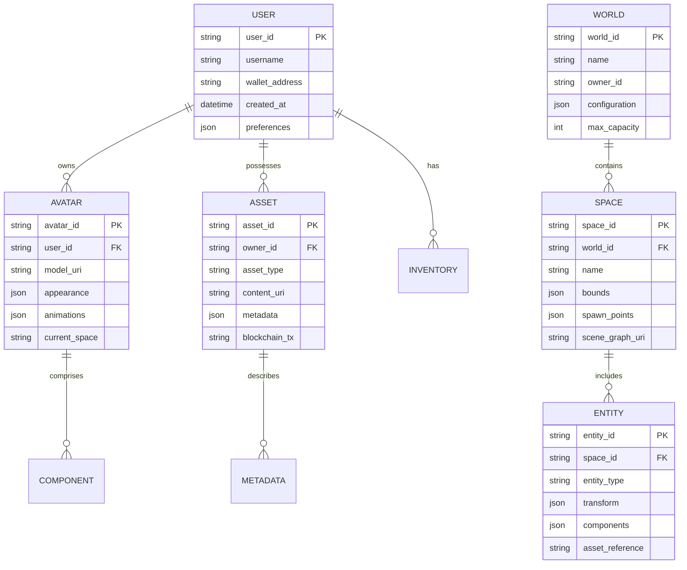

# 元宇宙Schema概述 (Metaverse Schema Overview)

## 1. 引言 (Introduction)

### 1.1 什么是元宇宙 (What is Metaverse)

元宇宙（Metaverse）是一个融合虚拟现实（VR）、增强现实（AR）、区块链、人工智能等技术的沉浸式三维虚拟世界。它提供了持久的、共享的、可交互的数字空间，用户可以在其中进行社交、工作、娱乐和经济活动。

**核心特征：**
- **沉浸性 (Immersion)**: 通过VR/AR设备提供身临其境的体验
- **持久性 (Persistence)**: 虚拟世界持续存在，不受用户登录状态影响
- **互操作性 (Interoperability)**: 资产和身份可在不同平台间转移
- **经济系统 (Economy)**: 支持虚拟资产交易和经济活动
- **社交性 (Social)**: 支持多用户实时互动和协作

### 1.2 Schema设计目标 (Schema Design Goals)

```yaml
metaverse_schema_goals:
  interoperability:
    description: "支持跨平台资产和身份互操作"
    standards: ["OpenXR", "glTF", "VRM", "USD"]
  
  scalability:
    description: "支持大规模并发用户和场景"
    target: "百万级并发用户"
  
  extensibility:
    description: "支持新技术的无缝集成"
    mechanisms: ["插件系统", "模块化架构"]
  
  security:
    description: "保障用户数据和资产安全"
    features: ["加密传输", "身份验证", "权限控制"]
```

## 2. 架构概览 (Architecture Overview)

### 2.1 分层架构 (Layered Architecture)

```
┌─────────────────────────────────────────────────────────────┐
│                    应用层 (Application Layer)                 │
│  ┌─────────┐ ┌─────────┐ ┌─────────┐ ┌─────────┐ ┌─────────┐ │
│  │ 社交应用 │ │ 游戏应用 │ │ 教育平台 │ │ 虚拟办公 │ │ 电商平台 │ │
│  └─────────┘ └─────────┘ └─────────┘ └─────────┘ └─────────┘ │
├─────────────────────────────────────────────────────────────┤
│                   服务层 (Service Layer)                      │
│  ┌─────────┐ ┌─────────┐ ┌─────────┐ ┌─────────┐ ┌─────────┐ │
│  │ 身份服务 │ │ 资产服务 │ │ 场景服务 │ │ 交互服务 │ │ 经济服务 │ │
│  └─────────┘ └─────────┘ └─────────┘ └─────────┘ └─────────┘ │
├─────────────────────────────────────────────────────────────┤
│                   核心层 (Core Layer)                         │
│  ┌─────────┐ ┌─────────┐ ┌─────────┐ ┌─────────┐ ┌─────────┐ │
│  │ 实体管理 │ │ 场景图  │ │ 物理引擎 │ │ 渲染引擎 │ │ 网络同步 │ │
│  └─────────┘ └─────────┘ └─────────┘ └─────────┘ └─────────┘ │
├─────────────────────────────────────────────────────────────┤
│                   基础设施层 (Infrastructure Layer)            │
│  ┌─────────┐ ┌─────────┐ ┌─────────┐ ┌─────────┐ ┌─────────┐ │
│  │ 云计算  │ │ 边缘计算 │ │ 区块链  │ │ 存储系统 │ │ 网络通信 │ │
│  └─────────┘ └─────────┘ └─────────┘ └─────────┘ └─────────┘ │
└─────────────────────────────────────────────────────────────┘
```

### 2.2 核心组件 (Core Components)

```yaml
metaverse_components:
  # 实体系统 (Entity System)
  entity_system:
    avatar:
      description: "用户虚拟化身"
      features: ["3D模型", "动画", "自定义外观"]
    npc:
      description: "非玩家角色"
      features: ["AI驱动", "行为树", "对话系统"]
    objects:
      description: "虚拟物体"
      features: ["物理属性", "交互能力", "状态管理"]
  
  # 场景系统 (Scene System)
  scene_system:
    world:
      description: "虚拟世界容器"
      features: ["空间划分", "LOD管理", "动态加载"]
    space:
      description: "场景空间单元"
      features: ["坐标系统", "光照", "环境效果"]
    instance:
      description: "场景实例"
      features: ["副本管理", "容量控制", "状态隔离"]
  
  # 交互系统 (Interaction System)
  interaction_system:
    input:
      description: "输入处理"
      modes: ["手柄", "手势", "语音", "眼动"]
    physics:
      description: "物理交互"
      features: ["碰撞检测", "刚体动力学", "软体模拟"]
    social:
      description: "社交交互"
      features: ["语音聊天", "文字消息", "表情动作"]
```

## 3. 数据模型 (Data Model)

### 3.1 核心实体关系 (Core Entity Relationships)



### 3.2 空间坐标系统 (Spatial Coordinate System)

```yaml
coordinate_systems:
  global:
    description: "全局坐标系"
    type: "笛卡尔坐标系"
    unit: "米"
    range: "±1,000,000"
    precision: "双精度浮点数"
  
  local:
    description: "局部坐标系"
    type: "相对坐标"
    origin: "场景原点或父实体"
    hierarchy: "支持嵌套变换"
  
  geographic:
    description: "地理坐标系"
    type: "WGS84"
    use_case: "与现实世界映射"
    components: ["纬度", "经度", "海拔"]
```

## 4. 关键技术 (Key Technologies)

### 4.1 渲染与可视化 (Rendering & Visualization)

| 技术 | 描述 | 应用场景 |
|------|------|----------|
| PBR渲染 | 基于物理的渲染 | 真实感材质 |
| 实时光追 | 光线追踪技术 | 高质量光照 |
| 云渲染 | 云端渲染串流 | 轻客户端 |
| 体积渲染 | 3D体数据渲染 | 医学、科学可视化 |
| 神经渲染 | AI驱动的渲染 | 实时高保真场景 |

### 4.2 网络与同步 (Networking & Synchronization)

```yaml
networking:
  architecture:
    type: "混合架构"
    components:
      - "权威服务器"
      - "边缘节点"
      - "P2P网络"
  
  synchronization:
    state_sync:
      method: "增量同步"
      frequency: "60Hz"
      compression: "增量压缩 + Delta编码"
    
    event_sync:
      method: "可靠UDP"
      ordering: "因果一致性"
      buffering: "100ms抖动缓冲"
```

### 4.3 区块链集成 (Blockchain Integration)

```yaml
blockchain_integration:
  asset_ownership:
    standard: "ERC-721 / ERC-1155"
    verification: "链上所有权验证"
    transfer: "智能合约自动执行"
  
  identity:
    type: "去中心化身份(DID)"
    storage: "IPFS + 区块链"
    privacy: "零知识证明"
  
  economy:
    tokens: ["平台币", "游戏币", "NFT"]
    marketplace: "去中心化交易"
    governance: "DAO投票机制"
```

## 5. 标准化挑战 (Standardization Challenges)

### 5.1 互操作性挑战 (Interoperability Challenges)

1. **格式兼容性**: 不同平台使用不同的3D格式（glTF、FBX、USD等）
2. **渲染差异**: 各渲染引擎的视觉效果不一致
3. **物理差异**: 物理引擎参数和行为不统一
4. **身份孤岛**: 用户身份无法跨平台互通

### 5.2 解决方案方向 (Solution Directions)

```yaml
standardization_solutions:
  format_conversion:
    approach: "统一中间格式"
    target_format: "glTF 2.0"
    tools: ["自动化转换管道", "格式验证器"]
  
  rendering_standardization:
    approach: "参考实现 + 一致性测试"
    specifications: ["PBR材质标准", "光照模型标准"]
  
  identity_federation:
    approach: "去中心化身份"
    standards: ["DID", "Verifiable Credentials"]
    protocols: ["OIDC", "SIWE"]
```

## 6. 应用场景 (Application Scenarios)

### 6.1 虚拟社交 (Virtual Social)

- 虚拟聚会空间
- 演唱会和演出
- 艺术展览
- 教育培训

### 6.2 虚拟办公 (Virtual Office)

- 远程协作空间
- 虚拟会议室
- 项目管理看板
- 团队建设活动

### 6.3 虚拟商业 (Virtual Commerce)

- 虚拟商店
- 品牌体验中心
- 产品展示厅
- 虚拟房地产

### 6.4 游戏娱乐 (Gaming & Entertainment)

- 大型多人在线游戏
- 虚拟主题乐园
- 沉浸式影院
- 电子竞技场馆

## 7. 发展趋势 (Development Trends)

### 7.1 技术演进 (Technology Evolution)

```yaml
tech_trends:
  short_term:
    timeline: "1-2年"
    focus:
      - "轻量化VR设备普及"
      - "5G/6G网络优化"
      - "AI生成内容(AIGC)"
  
  medium_term:
    timeline: "3-5年"
    focus:
      - "脑机接口原型"
      - "全息显示技术"
      - "通用数字身份"
  
  long_term:
    timeline: "5-10年"
    focus:
      - "完全沉浸式体验"
      - "通用互操作标准"
      - "虚实融合社会"
```

### 7.2 标准化进程 (Standardization Progress)

| 组织 | 标准 | 状态 |
|------|------|------|
| Khronos | OpenXR | 已发布1.0+ |
| Khronos | glTF | 已发布2.0 |
| VRM Consortium | VRM | 已发布1.0 |
| Pixar | USD | 活跃开发 |
| Metaverse Standards Forum | 多项标准 | 制定中 |
| IEEE | P7016 | 制定中 |

## 8. 总结 (Summary)

元宇宙Schema设计旨在建立一个标准化的数据模型和交互协议，支持跨平台的虚拟世界构建。通过采用OpenXR、glTF、VRM等开放标准，实现资产、身份和体验的互操作性。随着技术的不断演进，元宇宙将逐步从概念走向现实，成为数字经济的重要组成部分。

---

**相关文档：**
- [02_Formal_Definition.md](./02_Formal_Definition.md) - 形式化定义
- [03_Standards.md](./03_Standards.md) - 标准对标
- [04_Transformation.md](./04_Transformation.md) - 转换规则
- [05_Case_Studies.md](./05_Case_Studies.md) - 应用案例
