# 新兴技术Schema思维导图

## 📑 目录

- [新兴技术Schema思维导图](#新兴技术schema思维导图)
  - [📑 目录](#-目录)
  - [1. 思维导图概述](#1-思维导图概述)
    - [1.1 导图结构](#11-导图结构)
    - [1.2 核心概念](#12-核心概念)
    - [1.3 关联主题](#13-关联主题)
  - [2. 完整思维导图](#2-完整思维导图)
  - [3. 主要分支详解](#3-主要分支详解)
    - [3.1 区块链](#31-区块链)
    - [3.2 元宇宙](#32-元宇宙)
    - [3.3 量子计算](#33-量子计算)
    - [3.4 边缘智能](#34-边缘智能)
    - [3.5 数字孪生](#35-数字孪生)
  - [4. Mermaid可视化](#4-mermaid可视化)
    - [4.1 思维导图Mermaid图](#41-思维导图mermaid图)
    - [4.2 关联主题图](#42-关联主题图)

---

## 1. 思维导图概述

本文档以思维导图的形式展示新兴技术Schema
的知识体系结构，帮助理解各个子领域之间的关系。

### 1.1 导图结构

思维导图分为以下主要分支：

1. **区块链**: 智能合约, 共识机制, 数字身份...
2. **元宇宙**: 虚拟空间, 数字孪生, NFT...
3. **量子计算**: 量子算法, 量子加密, 量子通信...
4. **边缘智能**: 边缘AI, 联邦学习, 端侧推理...
5. **数字孪生**: 物理建模, 实时同步, 仿真分析...

### 1.2 核心概念

新兴技术Schema的核心概念包括：

- **Schema定义**: 领域特定的数据结构和语义规范
- **标准化**: 遵循行业标准和最佳实践
- **互操作性**: 不同系统之间的数据交换能力
- **可扩展性**: 支持业务增长和变化的能力

### 1.3 关联主题

本主题与以下主题有关联：

- **32_Cross_Disciplinary**: 跨学科Schema
- **30_Cloud_Native_DevOps**: 云原生DevOps Schema
- **25_AI_Code_Integration**: AI代码集成Schema

---

## 2. 完整思维导图

```text
新兴技术Schema
│

├─ 1. 区块链
│   ├─ 智能合约
│   ├─ 共识机制
│   ├─ 数字身份
│   ├─ 跨链技术

├─ 2. 元宇宙
│   ├─ 虚拟空间
│   ├─ 数字孪生
│   ├─ NFT
│   ├─ 沉浸式体验

├─ 3. 量子计算
│   ├─ 量子算法
│   ├─ 量子加密
│   ├─ 量子通信
│   ├─ 量子传感

├─ 4. 边缘智能
│   ├─ 边缘AI
│   ├─ 联邦学习
│   ├─ 端侧推理
│   ├─ 边缘协同

├─ 5. 数字孪生
│   ├─ 物理建模
│   ├─ 实时同步
│   ├─ 仿真分析
│   ├─ 预测性维护
│
└─ 标准体系
    ├─ 国际标准
    │   ├─ ISO系列标准
    │   └─ IEC系列标准
    ├─ 行业标准
    │   ├─ 行业协会标准
    │   └─ 事实标准
    └─ 技术规范
        ├─ API规范
        ├─ 数据格式
        └─ 协议规范

├─ 技术架构
    │
    ├─ 数据层
    │   ├─ 数据模型
    │   ├─ 存储方案
    │   └─ 数据治理
    │
    ├─ 服务层
    │   ├─ 业务服务
    │   ├─ 集成服务
    │   └─ 公共服务
    │
    ├─ 应用层
    │   ├─ 业务应用
    │   ├─ 移动应用
    │   └─ 分析应用
    │
    └─ 接入层
        ├─ API网关
        ├─ 消息总线
        └─ 文件交换

├─ 集成模式
    │
    ├─ 系统间集成
    │   ├─ ESB总线
    │   ├─ API集成
    │   └─ 消息队列
    │
    ├─ 数据集成
    │   ├─ ETL流程
    │   ├─ 数据同步
    │   └─ 主数据管理
    │
    └─ 流程集成
        ├─ BPM编排
        ├─ 事件驱动
        └─ 微服务编排

├─ 安全体系
    │
    ├─ 身份认证
    │   ├─ 单点登录
    │   ├─ 多因素认证
    │   └─ 零信任架构
    │
    ├─ 访问控制
    │   ├─ 基于角色RBAC
    │   ├─ 基于属性ABAC
    │   └─ 最小权限原则
    │
    ├─ 数据安全
    │   ├─ 加密存储
    │   ├─ 传输加密
    │   └─ 数据脱敏
    │
    └─ 合规审计
        ├─ 日志记录
        ├─ 合规检查
        └─ 风险评估

└─ 实施方法
    │
    ├─ 方法论
    │   ├─ 敏捷开发
    │   ├─ DevOps
    │   └─ 领域驱动设计
    │
    ├─ 工具链
    │   ├─ 建模工具
    │   ├─ 开发框架
    │   └─ 测试工具
    │
    └─ 最佳实践
        ├─ 设计模式
        ├─ 代码规范
        └─ 运维规范
```

---

## 3. 主要分支详解

### 3.1 区块链

```text
区块链
    ├─ 智能合约
    ├─ 共识机制
    ├─ 数字身份
    ├─ 跨链技术
```

### 3.2 元宇宙

```text
元宇宙
    ├─ 虚拟空间
    ├─ 数字孪生
    ├─ NFT
    ├─ 沉浸式体验
```

### 3.3 量子计算

```text
量子计算
    ├─ 量子算法
    ├─ 量子加密
    ├─ 量子通信
    ├─ 量子传感
```

### 3.4 边缘智能

```text
边缘智能
    ├─ 边缘AI
    ├─ 联邦学习
    ├─ 端侧推理
    ├─ 边缘协同
```

### 3.5 数字孪生

```text
数字孪生
    ├─ 物理建模
    ├─ 实时同步
    ├─ 仿真分析
    ├─ 预测性维护
```


---

## 4. Mermaid可视化

### 4.1 思维导图Mermaid图

```mermaid
mindmap
  root((新兴技术Schema))
      区块链
        智能合约
        共识机制
        数字身份
      元宇宙
        虚拟空间
        数字孪生
        NFT
      量子计算
        量子算法
        量子加密
        量子通信
      边缘智能
        边缘AI
        联邦学习
        端侧推理
      数字孪生
        物理建模
        实时同步
        仿真分析

    标准体系
      国际标准
      行业标准
      技术规范
    技术架构
      数据层
      服务层
      应用层
    安全体系
      身份认证
      访问控制
      数据安全
    关联主题
      32 Cross Disciplinary
      30 Cloud Native DevOps
      25 AI Code Integration

```



### 4.2 关联主题图

```mermaid
graph LR
    A[新兴技术Schema] --> B[核心技术]
    A --> C[应用领域]
    A --> D[标准规范]

    A -.-> E[32 Cross Disciplinary]
    A -.-> F[30 Cloud Native DevOps]
    A -.-> G[25 AI Code Integration]

    style A fill:#e1f5ff,stroke:#01579b,stroke-width:2px
```



---

**参考文档**：

- `../README.md` - 主题总览
- `Knowledge_Matrix.md` - 多维知识矩阵

**创建时间**：2026-02-16
**最后更新**：2026-02-16
