# 跨学科Schema思维导图

## 📑 目录

- [跨学科Schema思维导图](#跨学科schema思维导图)
  - [📑 目录](#-目录)
  - [1. 思维导图概述](#1-思维导图概述)
    - [1.1 导图结构](#11-导图结构)
    - [1.2 核心概念](#12-核心概念)
    - [1.3 关联主题](#13-关联主题)
  - [2. 完整思维导图](#2-完整思维导图)
  - [3. 主要分支详解](#3-主要分支详解)
    - [3.1 系统工程](#31-系统工程)
    - [3.2 设计思维](#32-设计思维)
    - [3.3 复杂性科学](#33-复杂性科学)
    - [3.4 认知科学](#34-认知科学)
    - [3.5 跨域融合](#35-跨域融合)
  - [4. Mermaid可视化](#4-mermaid可视化)
    - [4.1 思维导图Mermaid图](#41-思维导图mermaid图)
    - [4.2 关联主题图](#42-关联主题图)

---

## 1. 思维导图概述

本文档以思维导图的形式展示跨学科Schema
的知识体系结构，帮助理解各个子领域之间的关系。

### 1.1 导图结构

思维导图分为以下主要分支：

1. **系统工程**: SysML, 需求工程, 架构设计...
2. **设计思维**: 用户研究, 原型设计, 迭代测试...
3. **复杂性科学**: 网络科学, 混沌理论, 涌现行为...
4. **认知科学**: 人机交互, 认知心理学, 神经科学...
5. **跨域融合**: 生物信息, 计算社会学, 数字人文...

### 1.2 核心概念

跨学科Schema的核心概念包括：

- **Schema定义**: 领域特定的数据结构和语义规范
- **标准化**: 遵循行业标准和最佳实践
- **互操作性**: 不同系统之间的数据交换能力
- **可扩展性**: 支持业务增长和变化的能力

### 1.3 关联主题

本主题与以下主题有关联：

- **31_Emerging_Technologies**: 新兴技术Schema
- **32_Security_Compliance**: 安全合规Schema
- **33_Industry_Deepening**: 行业深化Schema

---

## 2. 完整思维导图

```text
跨学科Schema
│

├─ 1. 系统工程
│   ├─ SysML
│   ├─ 需求工程
│   ├─ 架构设计
│   ├─ 集成验证

├─ 2. 设计思维
│   ├─ 用户研究
│   ├─ 原型设计
│   ├─ 迭代测试
│   ├─ 服务设计

├─ 3. 复杂性科学
│   ├─ 网络科学
│   ├─ 混沌理论
│   ├─ 涌现行为
│   ├─ 自组织

├─ 4. 认知科学
│   ├─ 人机交互
│   ├─ 认知心理学
│   ├─ 神经科学
│   ├─ 人工智能

├─ 5. 跨域融合
│   ├─ 生物信息
│   ├─ 计算社会学
│   ├─ 数字人文
│   ├─ 环境计算
│
└─ 标准体系
    ├─ 国际标准
    │   ├─ ISO系列标准
    │   └─ IEC系列标准
    ├─ 行业标准
    │   ├─ 行业协会标准
    │   └─ 事实标准
    └─ 技术规范
        ├─ API规范
        ├─ 数据格式
        └─ 协议规范

├─ 技术架构
    │
    ├─ 数据层
    │   ├─ 数据模型
    │   ├─ 存储方案
    │   └─ 数据治理
    │
    ├─ 服务层
    │   ├─ 业务服务
    │   ├─ 集成服务
    │   └─ 公共服务
    │
    ├─ 应用层
    │   ├─ 业务应用
    │   ├─ 移动应用
    │   └─ 分析应用
    │
    └─ 接入层
        ├─ API网关
        ├─ 消息总线
        └─ 文件交换

├─ 集成模式
    │
    ├─ 系统间集成
    │   ├─ ESB总线
    │   ├─ API集成
    │   └─ 消息队列
    │
    ├─ 数据集成
    │   ├─ ETL流程
    │   ├─ 数据同步
    │   └─ 主数据管理
    │
    └─ 流程集成
        ├─ BPM编排
        ├─ 事件驱动
        └─ 微服务编排

├─ 安全体系
    │
    ├─ 身份认证
    │   ├─ 单点登录
    │   ├─ 多因素认证
    │   └─ 零信任架构
    │
    ├─ 访问控制
    │   ├─ 基于角色RBAC
    │   ├─ 基于属性ABAC
    │   └─ 最小权限原则
    │
    ├─ 数据安全
    │   ├─ 加密存储
    │   ├─ 传输加密
    │   └─ 数据脱敏
    │
    └─ 合规审计
        ├─ 日志记录
        ├─ 合规检查
        └─ 风险评估

└─ 实施方法
    │
    ├─ 方法论
    │   ├─ 敏捷开发
    │   ├─ DevOps
    │   └─ 领域驱动设计
    │
    ├─ 工具链
    │   ├─ 建模工具
    │   ├─ 开发框架
    │   └─ 测试工具
    │
    └─ 最佳实践
        ├─ 设计模式
        ├─ 代码规范
        └─ 运维规范
```

---

## 3. 主要分支详解

### 3.1 系统工程

```text
系统工程
    ├─ SysML
    ├─ 需求工程
    ├─ 架构设计
    ├─ 集成验证
```

### 3.2 设计思维

```text
设计思维
    ├─ 用户研究
    ├─ 原型设计
    ├─ 迭代测试
    ├─ 服务设计
```

### 3.3 复杂性科学

```text
复杂性科学
    ├─ 网络科学
    ├─ 混沌理论
    ├─ 涌现行为
    ├─ 自组织
```

### 3.4 认知科学

```text
认知科学
    ├─ 人机交互
    ├─ 认知心理学
    ├─ 神经科学
    ├─ 人工智能
```

### 3.5 跨域融合

```text
跨域融合
    ├─ 生物信息
    ├─ 计算社会学
    ├─ 数字人文
    ├─ 环境计算
```


---

## 4. Mermaid可视化

### 4.1 思维导图Mermaid图

```mermaid
mindmap
  root((跨学科Schema))
      系统工程
        SysML
        需求工程
        架构设计
      设计思维
        用户研究
        原型设计
        迭代测试
      复杂性科学
        网络科学
        混沌理论
        涌现行为
      认知科学
        人机交互
        认知心理学
        神经科学
      跨域融合
        生物信息
        计算社会学
        数字人文

    标准体系
      国际标准
      行业标准
      技术规范
    技术架构
      数据层
      服务层
      应用层
    安全体系
      身份认证
      访问控制
      数据安全
    关联主题
      31 Emerging Technologies
      32 Security Compliance
      33 Industry Deepening

```



### 4.2 关联主题图

```mermaid
graph LR
    A[跨学科Schema] --> B[核心技术]
    A --> C[应用领域]
    A --> D[标准规范]

    A -.-> E[31 Emerging Technologies]
    A -.-> F[32 Security Compliance]
    A -.-> G[33 Industry Deepening]

    style A fill:#e1f5ff,stroke:#01579b,stroke-width:2px
```



---

**参考文档**：

- `../README.md` - 主题总览
- `Knowledge_Matrix.md` - 多维知识矩阵

**创建时间**：2026-02-16
**最后更新**：2026-02-16
