# 安全合规Schema思维导图

## 📑 目录

- [安全合规Schema思维导图](#安全合规schema思维导图)
  - [📑 目录](#-目录)
  - [1. 思维导图概述](#1-思维导图概述)
    - [1.1 导图结构](#11-导图结构)
    - [1.2 核心概念](#12-核心概念)
    - [1.3 关联主题](#13-关联主题)
  - [2. 完整思维导图](#2-完整思维导图)
  - [3. 主要分支详解](#3-主要分支详解)
    - [3.1 信息安全](#31-信息安全)
    - [3.2 数据隐私](#32-数据隐私)
    - [3.3 合规管理](#33-合规管理)
    - [3.4 应用安全](#34-应用安全)
    - [3.5 云安全](#35-云安全)
  - [4. Mermaid可视化](#4-mermaid可视化)
    - [4.1 思维导图Mermaid图](#41-思维导图mermaid图)
    - [4.2 关联主题图](#42-关联主题图)

---

## 1. 思维导图概述

本文档以思维导图的形式展示安全合规Schema
的知识体系结构，帮助理解各个子领域之间的关系。

### 1.1 导图结构

思维导图分为以下主要分支：

1. **信息安全**: ISO 27001, 等级保护, 安全架构...
2. **数据隐私**: GDPR, 个人信息保护法, 数据分类...
3. **合规管理**: SOX法案, 合规框架, 审计管理...
4. **应用安全**: DevSecOps, SAST/DAST, 漏洞管理...
5. **云安全**: CASB, CWPP, CSPM...

### 1.2 核心概念

安全合规Schema的核心概念包括：

- **Schema定义**: 领域特定的数据结构和语义规范
- **标准化**: 遵循行业标准和最佳实践
- **互操作性**: 不同系统之间的数据交换能力
- **可扩展性**: 支持业务增长和变化的能力

### 1.3 关联主题

本主题与以下主题有关联：

- **30_Cloud_Native_DevOps**: 云原生DevOps Schema
- **06_Financial_Services**: 金融服务Schema
- **10_Healthcare**: 医疗健康Schema

---

## 2. 完整思维导图

```text
安全合规Schema
│

├─ 1. 信息安全
│   ├─ ISO 27001
│   ├─ 等级保护
│   ├─ 安全架构
│   ├─ 风险评估

├─ 2. 数据隐私
│   ├─ GDPR
│   ├─ 个人信息保护法
│   ├─ 数据分类
│   ├─ 隐私计算

├─ 3. 合规管理
│   ├─ SOX法案
│   ├─ 合规框架
│   ├─ 审计管理
│   ├─ 内控体系

├─ 4. 应用安全
│   ├─ DevSecOps
│   ├─ SAST/DAST
│   ├─ 漏洞管理
│   ├─ 安全测试

├─ 5. 云安全
│   ├─ CASB
│   ├─ CWPP
│   ├─ CSPM
│   ├─ 零信任架构
│
└─ 标准体系
    ├─ 国际标准
    │   ├─ ISO系列标准
    │   └─ IEC系列标准
    ├─ 行业标准
    │   ├─ 行业协会标准
    │   └─ 事实标准
    └─ 技术规范
        ├─ API规范
        ├─ 数据格式
        └─ 协议规范

├─ 技术架构
    │
    ├─ 数据层
    │   ├─ 数据模型
    │   ├─ 存储方案
    │   └─ 数据治理
    │
    ├─ 服务层
    │   ├─ 业务服务
    │   ├─ 集成服务
    │   └─ 公共服务
    │
    ├─ 应用层
    │   ├─ 业务应用
    │   ├─ 移动应用
    │   └─ 分析应用
    │
    └─ 接入层
        ├─ API网关
        ├─ 消息总线
        └─ 文件交换

├─ 集成模式
    │
    ├─ 系统间集成
    │   ├─ ESB总线
    │   ├─ API集成
    │   └─ 消息队列
    │
    ├─ 数据集成
    │   ├─ ETL流程
    │   ├─ 数据同步
    │   └─ 主数据管理
    │
    └─ 流程集成
        ├─ BPM编排
        ├─ 事件驱动
        └─ 微服务编排

├─ 安全体系
    │
    ├─ 身份认证
    │   ├─ 单点登录
    │   ├─ 多因素认证
    │   └─ 零信任架构
    │
    ├─ 访问控制
    │   ├─ 基于角色RBAC
    │   ├─ 基于属性ABAC
    │   └─ 最小权限原则
    │
    ├─ 数据安全
    │   ├─ 加密存储
    │   ├─ 传输加密
    │   └─ 数据脱敏
    │
    └─ 合规审计
        ├─ 日志记录
        ├─ 合规检查
        └─ 风险评估

└─ 实施方法
    │
    ├─ 方法论
    │   ├─ 敏捷开发
    │   ├─ DevOps
    │   └─ 领域驱动设计
    │
    ├─ 工具链
    │   ├─ 建模工具
    │   ├─ 开发框架
    │   └─ 测试工具
    │
    └─ 最佳实践
        ├─ 设计模式
        ├─ 代码规范
        └─ 运维规范
```

---

## 3. 主要分支详解

### 3.1 信息安全

```text
信息安全
    ├─ ISO 27001
    ├─ 等级保护
    ├─ 安全架构
    ├─ 风险评估
```

### 3.2 数据隐私

```text
数据隐私
    ├─ GDPR
    ├─ 个人信息保护法
    ├─ 数据分类
    ├─ 隐私计算
```

### 3.3 合规管理

```text
合规管理
    ├─ SOX法案
    ├─ 合规框架
    ├─ 审计管理
    ├─ 内控体系
```

### 3.4 应用安全

```text
应用安全
    ├─ DevSecOps
    ├─ SAST/DAST
    ├─ 漏洞管理
    ├─ 安全测试
```

### 3.5 云安全

```text
云安全
    ├─ CASB
    ├─ CWPP
    ├─ CSPM
    ├─ 零信任架构
```


---

## 4. Mermaid可视化

### 4.1 思维导图Mermaid图

```mermaid
mindmap
  root((安全合规Schema))
      信息安全
        ISO 27001
        等级保护
        安全架构
      数据隐私
        GDPR
        个人信息保护法
        数据分类
      合规管理
        SOX法案
        合规框架
        审计管理
      应用安全
        DevSecOps
        SAST/DAST
        漏洞管理
      云安全
        CASB
        CWPP
        CSPM

    标准体系
      国际标准
      行业标准
      技术规范
    技术架构
      数据层
      服务层
      应用层
    安全体系
      身份认证
      访问控制
      数据安全
    关联主题
      30 Cloud Native DevOps
      06 Financial Services
      10 Healthcare

```



### 4.2 关联主题图

```mermaid
graph LR
    A[安全合规Schema] --> B[核心技术]
    A --> C[应用领域]
    A --> D[标准规范]

    A -.-> E[30 Cloud Native DevOps]
    A -.-> F[06 Financial Services]
    A -.-> G[10 Healthcare]

    style A fill:#e1f5ff,stroke:#01579b,stroke-width:2px
```



---

**参考文档**：

- `../README.md` - 主题总览
- `Knowledge_Matrix.md` - 多维知识矩阵

**创建时间**：2026-02-16
**最后更新**：2026-02-16
