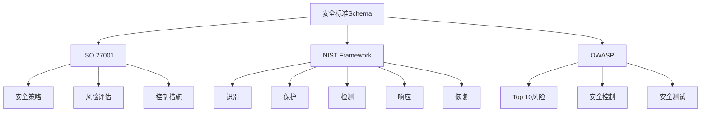

# 安全标准Schema概述

## 📑 目录

- [安全标准Schema概述](#安全标准schema概述)
  - [📑 目录](#-目录)
  - [1. 核心结论](#1-核心结论)
    - [1.1 安全标准Schema定义](#11-安全标准schema定义)
    - [1.2 标准依据](#12-标准依据)
  - [2. 概念定义](#2-概念定义)
    - [2.1 安全标准Schema定义](#21-安全标准schema定义)
    - [2.2 核心特征](#22-核心特征)
    - [2.3 Schema分类](#23-schema分类)
  - [3. 安全标准Schema元素详细说明](#3-安全标准schema元素详细说明)
    - [3.1 ISO 27001 Schema](#31-iso-27001-schema)
    - [3.2 NIST Schema](#32-nist-schema)
    - [3.3 OWASP Schema](#33-owasp-schema)
  - [4. 标准对标](#4-标准对标)
    - [4.1 ISO 27001规范](#41-iso-27001规范)
    - [4.2 NIST规范](#42-nist规范)
    - [4.3 OWASP规范](#43-owasp规范)
  - [5. 应用场景](#5-应用场景)
    - [5.1 信息安全管理](#51-信息安全管理)
    - [5.2 网络安全防护](#52-网络安全防护)
    - [5.3 安全合规审计](#53-安全合规审计)
    - [5.4 安全标准数据存储与分析](#54-安全标准数据存储与分析)
  - [6. 思维导图](#6-思维导图)

---

## 1. 核心结论

**安全标准存在完整的Schema体系，定义了ISO 27001、NIST、OWASP等安全标准的Schema**。

### 1.1 安全标准Schema定义

```text
Security_Standards_Schema = ISO27001_Schema ⊕ NIST_Schema
                          ⊕ OWASP_Schema
```

其中：

- `ISO27001_Schema`：ISO 27001信息安全管理体系Schema
- `NIST_Schema`：NIST网络安全框架Schema
- `OWASP_Schema`：OWASP安全标准Schema

### 1.2 标准依据

- **ISO 27001**：信息安全管理体系标准
- **NIST Cybersecurity Framework**：NIST网络安全框架
- **OWASP Top 10**：OWASP十大安全风险
- **CIS Controls**：CIS关键安全控制

---

## 2. 概念定义

### 2.1 安全标准Schema定义

**安全标准Schema**是描述信息安全标准、控制措施、风险评估的形式化规范。

### 2.2 核心特征

1. **标准化**：基于ISO、NIST等国际标准
2. **合规性**：支持安全合规要求
3. **风险评估**：支持安全风险评估
4. **控制措施**：定义安全控制措施
5. **审计性**：支持安全审计

### 2.3 Schema分类

- **ISO 27001 Schema**：信息安全管理体系
- **NIST Schema**：网络安全框架
- **OWASP Schema**：Web应用安全标准

---

## 3. 安全标准Schema元素详细说明

### 3.1 ISO 27001 Schema

**定义**：描述ISO 27001信息安全管理体系的结构。

**包含内容**：

- **安全策略**：信息安全策略定义
- **风险评估**：信息安全风险评估
- **控制措施**：信息安全控制措施（114个控制措施）
- **持续改进**：信息安全管理持续改进

**示例**：

```dsl
schema ISO27001 {
  security_policy: SecurityPolicy {
    policy_name: String @required
    policy_version: String @required
    policy_scope: String @required
    policy_owner: String @required
  }

  risk_assessment: RiskAssessment {
    asset_id: String @required
    threat: String @required
    vulnerability: String @required
    impact: Enum { Low, Medium, High, Critical } @required
    likelihood: Enum { Low, Medium, High } @required
    risk_level: Enum { Low, Medium, High, Critical } @computed
  }

  controls: List<Control> {
    control_id: String @required @pattern("^A\\.\\d{2}\\.\\d{2}$")
    control_name: String @required
    control_type: Enum { Preventive, Detective, Corrective } @required
    implementation_status: Enum { Implemented, PartiallyImplemented, NotImplemented } @required
  }
} @standard("ISO_27001:2022")
```

### 3.2 NIST Schema

**定义**：描述NIST网络安全框架的结构。

**包含内容**：

- **识别（Identify）**：资产识别和管理
- **保护（Protect）**：安全保护措施
- **检测（Detect）**：安全事件检测
- **响应（Respond）**：安全事件响应
- **恢复（Recover）**：安全事件恢复

**示例**：

```dsl
schema NISTFramework {
  identify: IdentifyFunction {
    asset_management: AssetManagement {
      assets: List<Asset> {
        asset_id: String @required
        asset_type: Enum { System, Data, Software, Hardware } @required
        criticality: Enum { Low, Medium, High, Critical } @required
      }
    }
  }

  protect: ProtectFunction {
    access_control: AccessControl {
      authentication: AuthenticationSchema
      authorization: AuthorizationSchema
    }
  }

  detect: DetectFunction {
    anomaly_detection: AnomalyDetectionSchema
    security_monitoring: SecurityMonitoringSchema
  }

  respond: RespondFunction {
    incident_response: IncidentResponseSchema
  }

  recover: RecoverFunction {
    recovery_planning: RecoveryPlanningSchema
  }
} @standard("NIST_CSF_1.1")
```

### 3.3 OWASP Schema

**定义**：描述OWASP安全标准的结构。

**包含内容**：

- **OWASP Top 10**：十大Web应用安全风险
- **安全控制**：OWASP安全控制措施
- **安全测试**：OWASP安全测试指南

---

## 4. 标准对标

### 4.1 ISO 27001规范

**标准名称**：ISO/IEC 27001:2022
**核心内容**：

- 信息安全管理体系要求
- 114个控制措施
- 风险评估方法

**Schema支持**：完整支持
**参考链接**：<https://www.iso.org/standard/27001>

### 4.2 NIST规范

**标准名称**：NIST Cybersecurity Framework 1.1
**核心内容**：

- 5个核心功能
- 23个类别
- 108个子类别

**Schema支持**：完整支持
**参考链接**：<https://www.nist.gov/cyberframework>

### 4.3 OWASP规范

**标准名称**：OWASP Top 10
**核心内容**：

- Web应用安全风险
- 安全控制措施
- 安全测试指南

**Schema支持**：完整支持
**参考链接**：<https://owasp.org/www-project-top-ten/>

---

## 5. 应用场景

### 5.1 信息安全管理

**场景描述**：企业使用ISO 27001建立信息安全管理体系。

**Schema应用**：

- 定义安全策略
- 进行风险评估
- 实施控制措施

### 5.2 网络安全防护

**场景描述**：使用NIST框架进行网络安全防护。

**Schema应用**：

- 识别资产和风险
- 实施保护措施
- 检测安全事件

### 5.3 安全合规审计

**场景描述**：进行安全合规审计和评估。

**Schema应用**：

- 定义审计标准
- 记录审计结果
- 生成审计报告

### 5.4 安全标准数据存储与分析

**场景描述**：存储安全标准定义、风险评估、控制措施实施等数据。

**Schema应用**：

- 存储安全标准定义
- 记录风险评估结果
- 跟踪控制措施实施

**数据库设计**：

- 安全标准表：存储安全标准定义
- 风险评估表：记录风险评估结果
- 控制措施表：存储控制措施定义和实施状态
- 审计记录表：记录安全审计历史

---

## 6. 思维导图



---

**文档创建时间**：2025-01-21
**文档版本**：v1.0
**维护者**：DSL Schema研究团队

**相关文档**：

- `02_Formal_Definition.md` - 形式化定义
- `03_Standards.md` - 标准对标
- `04_Transformation.md` - 转换体系
- `05_Case_Studies.md` - 实践案例
