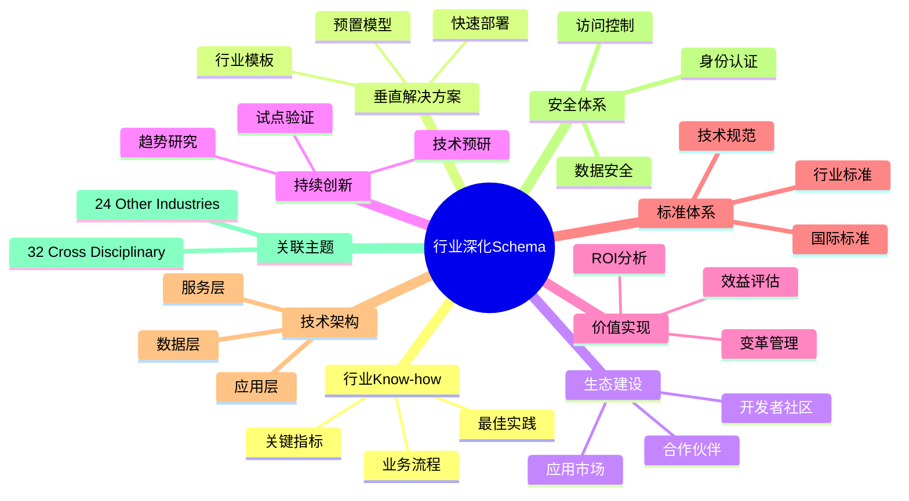
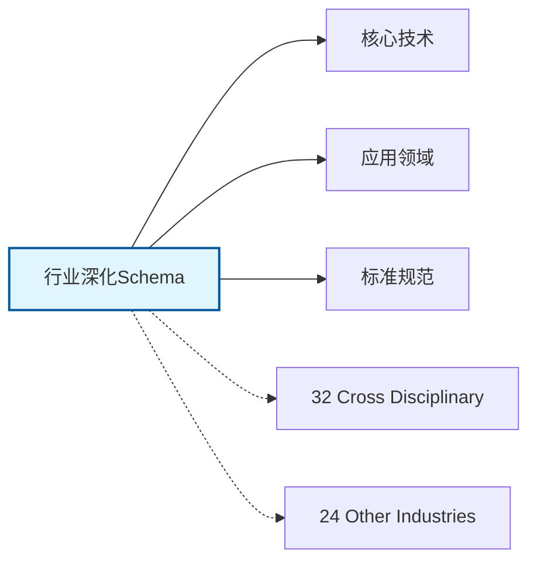

# 行业深化Schema思维导图

## 📑 目录

- [行业深化Schema思维导图](#行业深化schema思维导图)
  - [📑 目录](#-目录)
  - [1. 思维导图概述](#1-思维导图概述)
    - [1.1 导图结构](#11-导图结构)
    - [1.2 核心概念](#12-核心概念)
    - [1.3 关联主题](#13-关联主题)
  - [2. 完整思维导图](#2-完整思维导图)
  - [3. 主要分支详解](#3-主要分支详解)
    - [3.1 行业Know-how](#31-行业know-how)
    - [3.2 垂直解决方案](#32-垂直解决方案)
    - [3.3 生态建设](#33-生态建设)
    - [3.4 持续创新](#34-持续创新)
    - [3.5 价值实现](#35-价值实现)
  - [4. Mermaid可视化](#4-mermaid可视化)
    - [4.1 思维导图Mermaid图](#41-思维导图mermaid图)
    - [4.2 关联主题图](#42-关联主题图)

---

## 1. 思维导图概述

本文档以思维导图的形式展示行业深化Schema
的知识体系结构，帮助理解各个子领域之间的关系。

### 1.1 导图结构

思维导图分为以下主要分支：

1. **行业Know-how**: 最佳实践, 业务流程, 关键指标...
2. **垂直解决方案**: 行业模板, 预置模型, 快速部署...
3. **生态建设**: 合作伙伴, 应用市场, 开发者社区...
4. **持续创新**: 趋势研究, 技术预研, 试点验证...
5. **价值实现**: ROI分析, 效益评估, 变革管理...

### 1.2 核心概念

行业深化Schema的核心概念包括：

- **Schema定义**: 领域特定的数据结构和语义规范
- **标准化**: 遵循行业标准和最佳实践
- **互操作性**: 不同系统之间的数据交换能力
- **可扩展性**: 支持业务增长和变化的能力

### 1.3 关联主题

本主题与以下主题有关联：

- **32_Cross_Disciplinary**: 跨学科Schema
- **24_Other_Industries**: 其他行业Schema

---

## 2. 完整思维导图

```text
行业深化Schema
│

├─ 1. 行业Know-how
│   ├─ 最佳实践
│   ├─ 业务流程
│   ├─ 关键指标
│   ├─ 成功要素

├─ 2. 垂直解决方案
│   ├─ 行业模板
│   ├─ 预置模型
│   ├─ 快速部署
│   ├─ 定制开发

├─ 3. 生态建设
│   ├─ 合作伙伴
│   ├─ 应用市场
│   ├─ 开发者社区
│   ├─ 认证体系

├─ 4. 持续创新
│   ├─ 趋势研究
│   ├─ 技术预研
│   ├─ 试点验证
│   ├─ 规模推广

├─ 5. 价值实现
│   ├─ ROI分析
│   ├─ 效益评估
│   ├─ 变革管理
│   ├─ 持续优化
│
└─ 标准体系
    ├─ 国际标准
    │   ├─ ISO系列标准
    │   └─ IEC系列标准
    ├─ 行业标准
    │   ├─ 行业协会标准
    │   └─ 事实标准
    └─ 技术规范
        ├─ API规范
        ├─ 数据格式
        └─ 协议规范

├─ 技术架构
    │
    ├─ 数据层
    │   ├─ 数据模型
    │   ├─ 存储方案
    │   └─ 数据治理
    │
    ├─ 服务层
    │   ├─ 业务服务
    │   ├─ 集成服务
    │   └─ 公共服务
    │
    ├─ 应用层
    │   ├─ 业务应用
    │   ├─ 移动应用
    │   └─ 分析应用
    │
    └─ 接入层
        ├─ API网关
        ├─ 消息总线
        └─ 文件交换

├─ 集成模式
    │
    ├─ 系统间集成
    │   ├─ ESB总线
    │   ├─ API集成
    │   └─ 消息队列
    │
    ├─ 数据集成
    │   ├─ ETL流程
    │   ├─ 数据同步
    │   └─ 主数据管理
    │
    └─ 流程集成
        ├─ BPM编排
        ├─ 事件驱动
        └─ 微服务编排

├─ 安全体系
    │
    ├─ 身份认证
    │   ├─ 单点登录
    │   ├─ 多因素认证
    │   └─ 零信任架构
    │
    ├─ 访问控制
    │   ├─ 基于角色RBAC
    │   ├─ 基于属性ABAC
    │   └─ 最小权限原则
    │
    ├─ 数据安全
    │   ├─ 加密存储
    │   ├─ 传输加密
    │   └─ 数据脱敏
    │
    └─ 合规审计
        ├─ 日志记录
        ├─ 合规检查
        └─ 风险评估

└─ 实施方法
    │
    ├─ 方法论
    │   ├─ 敏捷开发
    │   ├─ DevOps
    │   └─ 领域驱动设计
    │
    ├─ 工具链
    │   ├─ 建模工具
    │   ├─ 开发框架
    │   └─ 测试工具
    │
    └─ 最佳实践
        ├─ 设计模式
        ├─ 代码规范
        └─ 运维规范
```

---

## 3. 主要分支详解

### 3.1 行业Know-how

```text
行业Know-how
    ├─ 最佳实践
    ├─ 业务流程
    ├─ 关键指标
    ├─ 成功要素
```

### 3.2 垂直解决方案

```text
垂直解决方案
    ├─ 行业模板
    ├─ 预置模型
    ├─ 快速部署
    ├─ 定制开发
```

### 3.3 生态建设

```text
生态建设
    ├─ 合作伙伴
    ├─ 应用市场
    ├─ 开发者社区
    ├─ 认证体系
```

### 3.4 持续创新

```text
持续创新
    ├─ 趋势研究
    ├─ 技术预研
    ├─ 试点验证
    ├─ 规模推广
```

### 3.5 价值实现

```text
价值实现
    ├─ ROI分析
    ├─ 效益评估
    ├─ 变革管理
    ├─ 持续优化
```


---

## 4. Mermaid可视化

### 4.1 思维导图Mermaid图



### 4.2 关联主题图



---

**参考文档**：

- `../README.md` - 主题总览
- `Knowledge_Matrix.md` - 多维知识矩阵

**创建时间**：2026-02-16
**最后更新**：2026-02-16
