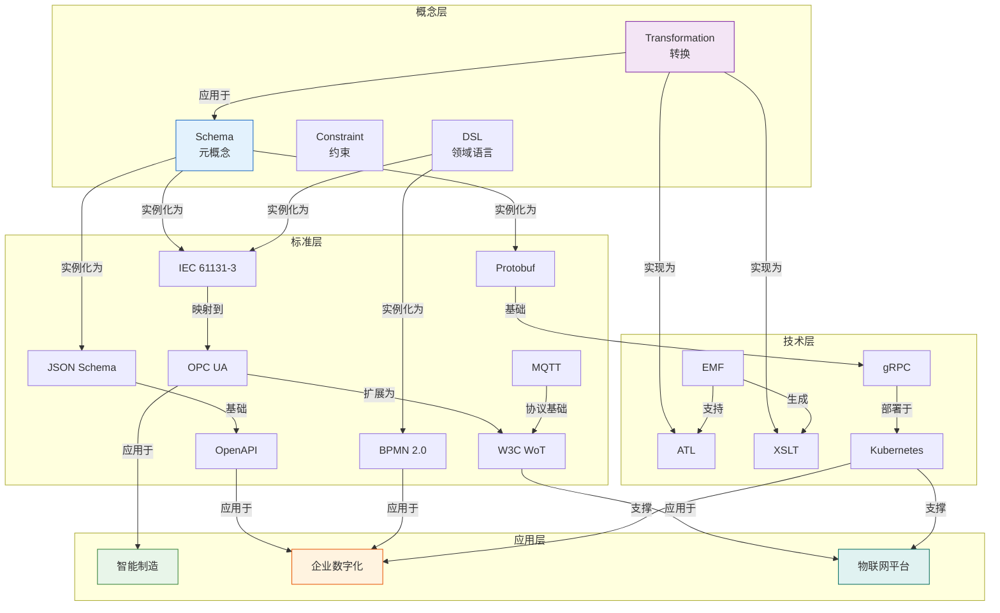

# DSL Schema 跨领域知识图谱

## 📑 目录

- [DSL Schema 跨领域知识图谱](#dsl-schema-跨领域知识图谱)
  - [📑 目录](#-目录)
  - [1. 知识图谱概述](#1-知识图谱概述)
  - [2. 核心知识实体](#2-核心知识实体)
    - [2.1 概念实体](#21-概念实体)
    - [2.2 标准实体](#22-标准实体)
    - [2.3 技术实体](#23-技术实体)
    - [2.4 应用实体](#24-应用实体)
  - [3. 实体关系网络](#3-实体关系网络)
    - [3.1 概念关系](#31-概念关系)
    - [3.2 标准关系](#32-标准关系)
    - [3.3 技术关系](#33-技术关系)
  - [4. 领域知识融合](#4-领域知识融合)
    - [4.1 工业领域知识融合](#41-工业领域知识融合)
    - [4.2 企业领域知识融合](#42-企业领域知识融合)
    - [4.3 物联网领域知识融合](#43-物联网领域知识融合)
  - [5. 知识推理路径](#5-知识推理路径)
  - [6. 可视化图谱](#6-可视化图谱)

---

## 1. 知识图谱概述

本文档通过**知识图谱**形式组织DSL Schema项目的跨领域知识：

```
┌─────────────────────────────────────────────────────────────────────────────┐
│                        知识图谱结构概览                                       │
├─────────────────────────────────────────────────────────────────────────────┤
│                                                                             │
│   ┌─────────────┐    ┌─────────────┐    ┌─────────────┐                    │
│   │  概念层     │◄──►│  标准层     │◄──►│  技术层     │                    │
│   │  (抽象)     │    │  (规范)     │    │  (实现)     │                    │
│   └──────┬──────┘    └──────┬──────┘    └──────┬──────┘                    │
│          │                  │                  │                           │
│          └──────────────────┼──────────────────┘                           │
│                             │                                              │
│                             ▼                                              │
│                      ┌─────────────┐                                       │
│                      │  应用层     │                                       │
│                      │  (场景)     │                                       │
│                      └─────────────┘                                       │
│                                                                             │
│   实体类型:                                                                  │
│   • 概念: Schema, Transformation, Constraint, DSL                           │
│   • 标准: IEC 61131-3, OPC UA, MQTT, BPMN, JSON Schema...                   │
│   • 技术: EMF, XSLT, ATL, Protobuf, gRPC, Kubernetes...                     │
│   • 应用: 智能制造, 企业数字化, 物联网平台...                                 │
│                                                                             │
│   关系类型:                                                                  │
│   • 实现关系: 标准 ──[实现]──► 技术                                         │
│   • 实例关系: 概念 ──[实例]──► 标准                                         │
│   • 应用关系: 技术 ──[应用于]──► 应用                                       │
│   • 依赖关系: 标准A ──[依赖]──► 标准B                                       │
│   • 映射关系: 标准A ──[映射到]──► 标准B                                     │
│                                                                             │
└─────────────────────────────────────────────────────────────────────────────┘
```

---

## 2. 核心知识实体

### 2.1 概念实体

```
┌─────────────────────────────────────────────────────────────────────────────┐
│                        概念实体定义                                           │
├─────────────────────────────────────────────────────────────────────────────┤
│                                                                             │
│  实体: Schema                                                                │
│  ════════════════                                                            │
│  属性:                                                                       │
│  • name: "Schema"                                                            │
│  • definition: "描述数据结构的形式化规范"                                      │
│  • abstraction_level: "元概念"                                                │
│  • dimensions: ["语法", "语义", "语用", "形式", "实现", "应用"]                  │
│  • relationships:                                                            │
│    - 实例关系 ──[实例化为]──► JSON Schema                                    │
│    - 实例关系 ──[实例化为]──► XML Schema                                     │
│    - 实例关系 ──[实例化为]──► Protobuf                                       │
│    - 泛化关系 ◄──[泛化为]─── 领域Schema                                       │
│                                                                             │
│  实体: Transformation                                                        │
│  ═════════════════════                                                       │
│  属性:                                                                       │
│  • name: "Transformation"                                                    │
│  • definition: "保持语义的数据结构映射"                                        │
│  • properties: ["正确性", "完备性", "可逆性", "保序性"]                         │
│  • dimensions: ["类型映射", "内存布局", "控制流", "错误模型",                    │
│                 "并发原语", "二进制编码", "安全边界"]                           │
│  • relationships:                                                            │
│    - 实现关系 ──[实现为]──► ATL                                              │
│    - 实现关系 ──[实现为]──► QVT                                              │
│    - 应用关系 ──[应用于]──► 模型驱动工程                                      │
│                                                                             │
│  实体: Constraint                                                            │
│  ═══════════════════                                                         │
│  属性:                                                                       │
│  • name: "Constraint"                                                        │
│  • definition: "数据必须满足的条件"                                            │
│  • types: ["类型约束", "值约束", "结构约束", "业务约束"]                        │
│  • relationships:                                                            │
│    - 组成关系 ──[构成]──► Schema                                             │
│    - 验证关系 ──[验证通过]──► ValidData                                      │
│                                                                             │
│  实体: DSL (Domain Specific Language)                                        │
│  ═══════════════════════════════════                                         │
│  属性:                                                                       │
│  • name: "DSL"                                                               │
│  • definition: "针对特定领域的专用语言"                                        │
│  • classifications:                                                          │
│    - 维度1: ["外部DSL", "内部DSL"]                                            │
│    - 维度2: ["水平DSL", "垂直DSL"]                                            │
│    - 维度3: ["声明式", "命令式", "函数式", "图形化"]                            │
│  • relationships:                                                            │
│    - 实例关系 ──[实例化为]──► PLC STL                                        │
│    - 实例关系 ──[实例化为]──► SQL                                            │
│    - 实例关系 ──[实例化为]──► Regex                                          │
│    - 实现关系 ──[实现依赖]──► 解析器                                          │
│                                                                             │
└─────────────────────────────────────────────────────────────────────────────┘
```

### 2.2 标准实体

```
┌─────────────────────────────────────────────────────────────────────────────┐
│                        标准实体定义                                           │
├─────────────────────────────────────────────────────────────────────────────┤
│                                                                             │
│  实体: IEC_61131_3                                                           │
│  ═══════════════════                                                         │
│  属性:                                                                       │
│  • name: "IEC 61131-3"                                                       │
│  • full_name: "可编程控制器 - 第3部分: 编程语言"                              │
│  • organization: "IEC"                                                       │
│  • version: "2013"                                                           │
│  • scope: "工业自动化"                                                        │
│  • languages: ["IL", "ST", "LD", "FBD", "SFC"]                               │
│  • maturity: "成熟"                                                           │
│  • adoption_rate: "95%"                                                      │
│  • relationships:                                                            │
│    - 组成关系 ──[包含]──► 数据类型系统                                        │
│    - 组成关系 ──[包含]──► 程序组织单元(POU)                                   │
│    - 实现关系 ──[实现为]──► PLCopen XML                                      │
│    - 映射关系 ──[映射到]──► IEC 61499                                        │
│    - 应用关系 ──[应用于]──► 智能制造                                          │
│                                                                             │
│  实体: OPC_UA                                                                │
│  ════════════════                                                            │
│  属性:                                                                       │
│  • name: "OPC Unified Architecture"                                          │
│  • organization: "OPC Foundation"                                            │
│  • parts: 20+                                                                │
│  • scope: "工业互操作"                                                        │
│  • key_features: ["统一数据模型", "安全传输", "Pub/Sub", "信息模型"]            │
│  • maturity: "成熟"                                                           │
│  • adoption_rate: "80%"                                                      │
│  • relationships:                                                            │
│    - 映射关系 ──[配套规范]──► FDI, MDIS, Robotics...                          │
│    - 实现关系 ──[实现为]──► 统一架构协议栈                                     │
│    - 应用关系 ──[应用于]──► MES/ERP集成                                       │
│    - 竞争关系 ──[与...竞争]──► 专有协议                                       │
│                                                                             │
│  实体: OpenAPI                                                               │
│  ═══════════════                                                             │
│  属性:                                                                       │
│  • name: "OpenAPI Specification"                                             │
│  • organization: "OpenAPI Initiative"                                        │
│  • version: "3.1.0"                                                          │
│  • scope: "REST API定义"                                                      │
│  • based_on: "JSON Schema"                                                   │
│  • maturity: "成熟"                                                           │
│  • adoption_rate: "85%"                                                      │
│  • relationships:                                                            │
│    - 依赖关系 ──[基于]──► JSON Schema                                        │
│    - 工具关系 ──[支持工具]──► Swagger UI, Postman, codegen...                 │
│    - 应用关系 ──[应用于]──► 微服务API设计                                     │
│                                                                             │
└─────────────────────────────────────────────────────────────────────────────┘
```

### 2.3 技术实体

```
┌─────────────────────────────────────────────────────────────────────────────┐
│                        技术实体定义                                           │
├─────────────────────────────────────────────────────────────────────────────┤
│                                                                             │
│  实体: EMF (Eclipse Modeling Framework)                                      │
│  ═══════════════════════════════════════                                     │
│  属性:                                                                       │
│  • name: "EMF"                                                               │
│  • type: "模型驱动开发框架"                                                   │
│  • organization: "Eclipse Foundation"                                        │
│  • components: ["ECore", "EMF Edit", "EMF Validation", "EMF Transaction"]    │
│  • relationships:                                                            │
│    - 实现关系 ◄──[实现]─── Ecore元模型                                        │
│    - 扩展关系 ──[扩展为]──► EMF Compare                                      │
│    - 扩展关系 ──[扩展为]──► OCL集成                                           │
│    - 转换关系 ──[支持]──► ATL, QVT, Xtend                                    │
│                                                                             │
│  实体: gRPC                                                                  │
│  ═══════════                                                                 │
│  属性:                                                                       │
│  • name: "gRPC"                                                              │
│  • type: "RPC框架"                                                           │
│  • organization: "Google / CNCF"                                             │
│  • transport: "HTTP/2"                                                       │
│  • serialization: "Protocol Buffers"                                         │
│  • relationships:                                                            │
│    - 依赖关系 ──[依赖]──► Protobuf                                           │
│    - 依赖关系 ──[依赖]──► HTTP/2                                             │
│    - 实现关系 ──[实现]──► 多语言RPC                                          │
│    - 应用关系 ──[应用于]──► 微服务通信                                        │
│                                                                             │
│  实体: Kubernetes                                                            │
│  ═══════════════════                                                         │
│  属性:                                                                       │
│  • name: "Kubernetes"                                                        │
│  • type: "容器编排平台"                                                       │
│  • organization: "CNCF / Google"                                             │
│  • api_version: "v1"                                                         │
│  • resource_model: "声明式配置"                                               │
│  • relationships:                                                            │
│    - 组成关系 ──[包含]──► Pod, Service, Deployment...                         │
│    - 扩展关系 ──[扩展机制]──► CRD (自定义资源)                                 │
│    - 应用关系 ──[应用于]──► 云原生部署                                        │
│    - 模式关系 ──[模式借鉴]──► 基础设施即代码                                  │
│                                                                             │
└─────────────────────────────────────────────────────────────────────────────┘
```

### 2.4 应用实体

```
┌─────────────────────────────────────────────────────────────────────────────┐
│                        应用实体定义                                           │
├─────────────────────────────────────────────────────────────────────────────┤
│                                                                             │
│  实体: 智能制造                                                               │
│  ═══════════════════                                                         │
│  属性:                                                                       │
│  • name: "智能制造"                                                           │
│  • domain: "工业4.0"                                                         │
│  • key_technologies: ["物联网", "数字孪生", "AI", "边缘计算"]                   │
│  • maturity: "发展中"                                                         │
│  • relationships:                                                            │
│    - 依赖关系 ──[依赖]──► PLC控制系统                                         │
│    - 依赖关系 ──[依赖]──► MES系统                                             │
│    - 依赖关系 ──[依赖]──► OPC UA互操作                                        │
│    - 依赖关系 ──[依赖]──► 数字孪生平台                                        │
│    - 数据关系 ──[数据源]──► 传感器网络                                        │
│                                                                             │
│  实体: 企业数字化转型                                                          │
│  ═════════════════════════                                                   │
│  属性:                                                                       │
│  • name: "企业数字化转型"                                                      │
│  • scope: "全业务流程"                                                        │
│  • components: ["ERP", "CRM", "SCM", "数据分析", "云迁移"]                       │
│  • challenges: ["数据孤岛", "系统集成", "组织变革", "安全合规"]                  │
│  • relationships:                                                            │
│    - 支撑关系 ──[技术支撑]──► API网关                                         │
│    - 支撑关系 ──[技术支撑]──► 数据中台                                        │
│    - 支撑关系 ──[技术支撑]──► 低代码平台                                      │
│    - 规范关系 ──[遵循规范]──► BPMN流程                                        │
│                                                                             │
│  实体: 物联网平台                                                             │
│  ═══════════════════                                                         │
│  属性:                                                                       │
│  • name: "物联网平台"                                                         │
│  • layers: ["设备层", "边缘层", "平台层", "应用层"]                             │
│  • protocols: ["MQTT", "CoAP", "LwM2M", "HTTP"]                              │
│  • relationships:                                                            │
│    - 接入关系 ──[接入]──► 传感器设备                                          │
│    - 协议关系 ──[使用协议]──► MQTT                                            │
│    - 描述关系 ──[设备描述]──► W3C WoT                                         │
│    - 存储关系 ──[数据存储]──► 时序数据库                                       │
│                                                                             │
└─────────────────────────────────────────────────────────────────────────────┘
```

---

## 3. 实体关系网络

### 3.1 概念关系

```
┌─────────────────────────────────────────────────────────────────────────────┐
│                        概念关系网络                                           │
├─────────────────────────────────────────────────────────────────────────────┤
│                                                                             │
│   Schema ───────────[泛化]──────────► 领域Schema                               │
│      │                                    │                                  │
│      │                                    │                                  │
│      │ [组成]                      [实例化]                                  │
│      │                                    │                                  │
│      ▼                                    ▼                                  │
│   Constraint ◄──────────[包含]────────── PLC_Schema                          │
│      │                                                                     │
│      │ [验证]                                                              │
│      ▼                                                                     │
│   ValidInstance                                                            │
│                                                                             │
│   Transformation ──────[应用于]──────► Schema                                │
│        │                                                                    │
│        │ [七维]                                                             │
│        ▼                                                                    │
│   ┌─────────────────────────────────────────────────────────────────────┐  │
│   │ 类型映射 │ 内存布局 │ 控制流 │ 错误模型 │ 并发 │ 编码 │ 安全 │      │  │
│   └─────────────────────────────────────────────────────────────────────┘  │
│                                                                             │
│   DSL ────────────────[分类]────────► 外部DSL                                │
│    │                                   │                                     │
│    │ [实现]                            │ [实现]                              │
│    ▼                                   ▼                                     │
│   解析器 ◄──────────[生成]────────── Protobuf                                │
│                                                                             │
└─────────────────────────────────────────────────────────────────────────────┘
```

### 3.2 标准关系

```
┌─────────────────────────────────────────────────────────────────────────────┐
│                        标准关系网络                                           │
├─────────────────────────────────────────────────────────────────────────────┤
│                                                                             │
│                        IEC 61131-3                                          │
│                             │                                               │
│              ┌──────────────┼──────────────┐                               │
│              │              │              │                                │
│              ▼              ▼              ▼                                │
│          IEC 61499     PLCopen XML    GB/T 33008                          │
│              │              │              │                                │
│              │ [映射]       │ [实现]       │ [等同采用]                      │
│              │              │              │                                │
│              └──────────────┼──────────────┘                               │
│                             │                                               │
│                             ▼                                               │
│                         OPC UA ◄────────── IEC 61850                       │
│                             │              │                                │
│              ┌──────────────┼──────────────┼──────────────┐                │
│              │              │              │              │                 │
│              ▼              ▼              ▼              ▼                 │
│         Companion      W3C WoT          MQTT          Protobuf              │
│         Specification       │              │              │                 │
│                             │              │              │                 │
│                             └──────────────┼──────────────┘                 │
│                                            │                                │
│                                            ▼                                │
│                                       JSON Schema ◄──────── OpenAPI         │
│                                                                             │
└─────────────────────────────────────────────────────────────────────────────┘
```

### 3.3 技术关系

```
┌─────────────────────────────────────────────────────────────────────────────┐
│                        技术关系网络                                           │
├─────────────────────────────────────────────────────────────────────────────┤
│                                                                             │
│                            EMF                                              │
│                             │                                               │
│        ┌────────────────────┼────────────────────┐                         │
│        │                    │                    │                          │
│        ▼                    ▼                    ▼                          │
│      ATL                   QVT                  Xtend                        │
│        │                    │                    │                          │
│        └────────────────────┼────────────────────┘                         │
│                             │                                               │
│                             ▼                                               │
│                         XSLT/XQuery                                         │
│                             │                                               │
│              ┌──────────────┼──────────────┐                               │
│              │              │              │                                │
│              ▼              ▼              ▼                                │
│         JSON Schema    Protobuf         gRPC                                │
│              │              │              │                                │
│              │              │              │                                │
│              ▼              ▼              ▼                                │
│         Swagger UI     protoc          Envoy                                │
│              │              │              │                                │
│              └──────────────┼──────────────┘                               │
│                             │                                               │
│                             ▼                                               │
│                         Kubernetes ◄──────── Helm                          │
│                             │                                               │
│                             ▼                                               │
│                    ┌────────────────┐                                       │
│                    │   云原生应用    │                                       │
│                    └────────────────┘                                       │
│                                                                             │
└─────────────────────────────────────────────────────────────────────────────┘
```

---

## 4. 领域知识融合

### 4.1 工业领域知识融合

```
┌─────────────────────────────────────────────────────────────────────────────┐
│                    工业领域知识融合图谱                                       │
├─────────────────────────────────────────────────────────────────────────────┤
│                                                                             │
│   ┌─────────────────────────────────────────────────────────────────────┐  │
│   │                        工业领域本体                                  │  │
│   ├─────────────────────────────────────────────────────────────────────┤  │
│   │                                                                     │  │
│   │   设备(Device) ────[组成]──── 产线(Line) ────[组成]──── 工厂(Plant) │  │
│   │      │                                                            │  │
│   │      ├───[类型]───► 传感器(Sensor) ────[测量]───► 物理量           │  │
│   │      │                                                            │  │
│   │      ├───[类型]───► 执行器(Actuator) ───[执行]───► 动作            │  │
│   │      │                                                            │  │
│   │      └───[类型]───► 控制器(Controller) ─[控制]───► 过程            │  │
│   │                              │                                     │  │
│   │                              ├───[实现]───► PLC                    │  │
│   │                              ├───[实现]───► DCS                    │  │
│   │                              └───[实现]───► SCADA                  │  │
│   │                                                                     │  │
│   │   数据流: 传感器 ──[采集]──► 控制器 ──[处理]──► 执行器               │  │
│   │              │                     │                               │  │
│   │              │                     ├───[上报]───► MES               │  │
│   │              │                     └───[上报]───► ERP               │  │
│   │              │                                                     │  │
│   │              └───[描述]───► W3C WoT Thing Description              │  │
│   │                                                                     │  │
│   │   标准映射:                                                         │  │
│   │   • PLC程序 ──[IEC 61131-3]──► 结构化文本                          │  │
│   │   • 设备数据 ──[OPC UA]─────► 统一信息模型                          │  │
│   │   • 设备描述 ──[W3C WoT]────► JSON-LD                              │  │
│   │   • 安全要求 ──[IEC 62443]──► 安全等级                             │  │
│   │                                                                     │  │
│   └─────────────────────────────────────────────────────────────────────┘  │
│                                                                             │
└─────────────────────────────────────────────────────────────────────────────┘
```

### 4.2 企业领域知识融合

```
┌─────────────────────────────────────────────────────────────────────────────┐
│                    企业领域知识融合图谱                                       │
├─────────────────────────────────────────────────────────────────────────────┤
│                                                                             │
│   ┌─────────────────────────────────────────────────────────────────────┐  │
│   │                        企业领域本体                                  │  │
│   ├─────────────────────────────────────────────────────────────────────┤  │
│   │                                                                     │  │
│   │   战略层(Strategy)                                                  │  │
│   │      │                                                              │  │
│   │      ├───[分解]───► 目标(Objective) ────[度量]───► KPI              │  │
│   │      │                                                              │  │
│   │      └───[驱动]───► 流程(Process) ────[建模]───► BPMN               │  │
│   │                              │                                     │  │
│   │   业务层(Business) ◄─────────┘                                     │  │
│   │      │                                                              │  │
│   │      ├───[支撑]───► ERP系统                                        │  │
│   │      ├───[支撑]───► CRM系统                                        │  │
│   │      ├───[支撑]───► SCM系统                                        │  │
│   │      └───[支撑]───► 财务系统 ────[报表]───► XBRL                   │  │
│   │                              │                                     │  │
│   │   数据层(Data) ◄─────────────┘                                     │  │
│   │      │                                                              │  │
│   │      ├───[存储]───► 数据仓库                                        │  │
│   │      ├───[分析]───► BI系统                                         │  │
│   │      └───[交换]───► API网关 ────[契约]───► OpenAPI                 │  │
│   │                                                                     │  │
│   │   技术映射:                                                         │  │
│   │   • 业务流程 ──[BPMN 2.0]───► 可执行模型                            │  │
│   │   • 数据模型 ──[JSON Schema]──► API契约                             │  │
│   │   • 财务数据 ──[XBRL]───────► 监管报送                              │  │
│   │   • 服务集成 ──[ESB/Microservices]──► 企业架构                      │  │
│   │                                                                     │  │
│   └─────────────────────────────────────────────────────────────────────┘  │
│                                                                             │
└─────────────────────────────────────────────────────────────────────────────┘
```

### 4.3 物联网领域知识融合

```
┌─────────────────────────────────────────────────────────────────────────────┐
│                    物联网领域知识融合图谱                                     │
├─────────────────────────────────────────────────────────────────────────────┤
│                                                                             │
│   ┌─────────────────────────────────────────────────────────────────────┐  │
│   │                        物联网领域本体                                │  │
│   ├─────────────────────────────────────────────────────────────────────┤  │
│   │                                                                     │  │
│   │   感知层(Perception)                                                │  │
│   │      │                                                              │  │
│   │      ├───[设备]───► 传感器 ────[协议]───► Zigbee/LoRaWAN             │  │
│   │      ├───[设备]───► 执行器 ────[协议]───► BLE/WiFi                  │  │
│   │      └───[设备]───► 网关 ────[协议]───► MQTT/CoAP                   │  │
│   │                              │                                     │  │
│   │   网络层(Network) ◄──────────┘                                     │  │
│   │      │                                                              │  │
│   │      ├───[边缘]───► 边缘计算 ────[框架]───► KubeEdge/EdgeX          │  │
│   │      └───[云端]───► 云平台 ────[服务]───► AWS IoT/Azure IoT         │  │
│   │                              │                                     │  │
│   │   平台层(Platform) ◄─────────┘                                     │  │
│   │      │                                                              │  │
│   │      ├───[功能]───► 设备管理 ────[描述]───► W3C WoT                │  │
│   │      ├───[功能]───► 规则引擎                                       │  │
│   │      └───[功能]───► 数据分析                                       │  │
│   │                              │                                     │  │
│   │   应用层(Application) ◄──────┘                                     │  │
│   │      │                                                              │  │
│   │      ├───[场景]───► 智能家居                                        │  │
│   │      ├───[场景]───► 智慧城市                                        │  │
│   │      └───[场景]───► 工业物联网 ────[集成]───► OPC UA               │  │
│   │                                                                     │  │
│   │   协议栈映射:                                                       │  │
│   │   • 设备接入 ──[LwM2M]───────► 轻量级管理                           │  │
│   │   • 数据上报 ──[MQTT]────────► 发布订阅                             │  │
│   │   • REST通信 ──[CoAP]────────► 受限网络                             │  │
│   │   • 语义描述 ──[W3C WoT]─────► 即插即用                             │  │
│   │                                                                     │  │
│   └─────────────────────────────────────────────────────────────────────┘  │
│                                                                             │
└─────────────────────────────────────────────────────────────────────────────┘
```

---

## 5. 知识推理路径

```
┌─────────────────────────────────────────────────────────────────────────────┐
│                        知识推理路径示例                                       │
├─────────────────────────────────────────────────────────────────────────────┤
│                                                                             │
│  推理路径1: PLC程序 → 云平台集成                                              │
│  ════════════════════════════════════                                        │
│                                                                             │
│  PLC程序 ──[IEC 61131-3]──► 结构化文本                                       │
│       │                                                                     │
│       ├───[PLCopen XML]──► 标准化表示                                        │
│       │                    │                                                │
│       │                    ├───[OPC UA]──► 统一信息模型                       │
│       │                    │              │                                 │
│       │                    │              ├───[MQTT]──► 遥测数据            │
│       │                    │              │              │                  │
│       │                    │              │              ▼                  │
│       │                    │              │           云平台 ──[REST]──► APP│
│       │                    │              │                                 │
│       │                    │              └───[W3C WoT]──► 语义描述         │
│       │                    │                             │                  │
│       │                    │                             ▼                  │
│       │                    │                          数字孪生              │
│       │                    │                                                │
│       └───[直接转换]──────► C代码 ──[gRPC]──► 微服务 ──[K8s]──► 云部署      │
│                                                                             │
├─────────────────────────────────────────────────────────────────────────────┤
│                                                                             │
│  推理路径2: 业务需求 → 可执行系统                                             │
│  ═══════════════════════════════════                                         │
│                                                                             │
│  业务需求 ──[分析]──► BPMN流程模型                                           │
│       │                                                                     │
│       ├───[BPMN引擎]──► 可执行流程                                          │
│       │                                                                     │
│       ├───[数据建模]──► ERD ──[转换]──► SQL DDL                             │
│       │                                      │                              │
│       │                                      ├───[JPA/Hibernate]──► ORM     │
│       │                                      │                              │
│       │                                      └───[Protobuf]──► gRPC API    │
│       │                                                                     │
│       └───[API设计]──► OpenAPI规范 ──[生成]──► 客户端SDK + 服务端Stub      │
│                                                      │                      │
│                                                      ▼                      │
│                                                   完整系统                  │
│                                                                             │
├─────────────────────────────────────────────────────────────────────────────┤
│                                                                             │
│  推理路径3: 传感器 → AI分析                                                   │
│  ═══════════════════════                                                     │
│                                                                             │
│  传感器 ──[W3C WoT TD]──► 语义描述                                           │
│       │                                                                     │
│       ├───[MQTT]──► 消息队列 ──[Kafka]──► 流处理                            │
│       │                    │                                                │
│       │                    ├───[Flink/Spark]──► 实时分析                     │
│       │                    │                                                │
│       │                    └───[TimescaleDB]──► 时序存储                     │
│       │                                        │                            │
│       │                                        ├───[SQL查询]──► 报表        │
│       │                                        │                            │
│       │                                        └───[ML Pipeline]──► 预测    │
│       │                                                                     │
│       └───[边缘AI]──► 本地推理 ──[gRPC]──► 云端模型更新                      │
│                                                                             │
└─────────────────────────────────────────────────────────────────────────────┘
```

---

## 6. 可视化图谱



---

**参考文档**：
- [全局思维导图](./GLOBAL_MIND_MAP_ENHANCED.md)
- [概念定义属性矩阵](./CONCEPT_DEFINITION_ATTRIBUTE_MATRIX.md)
- [标准对比论证矩阵](./STANDARDS_COMPARISON_ARGUMENTATION_MATRIX.md)
- [转换推理决策树](./SCHEMA_TRANSFORMATION_DECISION_TREE.md)

**创建时间**：2025-01-21  
**最后更新**：2025-01-21  
**维护者**：DSL Schema研究团队
