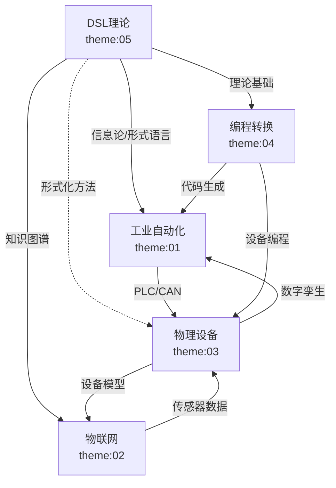
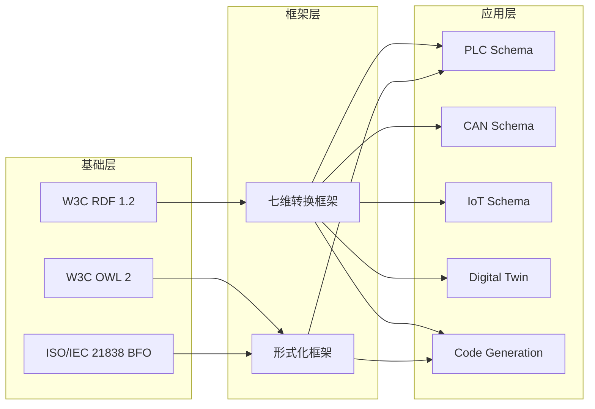
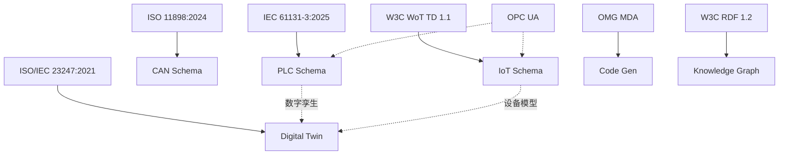

# 跨主题知识图谱

**版本**: v1.0
**创建日期**: 2026-02-15
**范围**: Themes 01-05 及后续主题

---

## 📑 目录

- [1. 知识图谱概述](#1-知识图谱概述)
- [2. 实体定义](#2-实体定义)
- [3. 关系定义](#3-关系定义)
- [4. 跨主题关联网络](#4-跨主题关联网络)
- [5. RDF/Turtle表示](#5-rdfturtle表示)
- [6. 可视化图谱](#6-可视化图谱)
- [7. 应用场景](#7-应用场景)

---

## 1. 知识图谱概述

跨主题知识图谱旨在建立Themes 01-05之间的语义关联，实现：

- 主题间概念对齐
- 标准引用关联
- 技术依赖映射
- 应用场景链接

---

## 2. 实体定义

### 2.1 主题实体 (Theme)

| 实体 | ID | 描述 | 核心概念 |
|------|-----|------|---------|
| 工业自动化 | theme:01 | PLC和CAN相关Schema | PLC五层结构、CAN三层结构 |
| 物联网 | theme:02 | IoT传感器和通信Schema | IoT五维结构 |
| 物理设备 | theme:03 | 物理设备Schema | 设备五维结构、数字孪生 |
| 编程转换 | theme:04 | 代码生成和语言转换 | 七维转换、MDA |
| DSL理论 | theme:05 | 形式化理论基础 | 信息论、形式语言、知识图谱 |

### 2.2 Schema类型实体 (SchemaType)

| 实体 | ID | 所属主题 | 描述 |
|------|-----|---------|------|
| PLC Schema | schema:plc | theme:01 | 可编程逻辑控制器Schema |
| CAN Schema | schema:can | theme:01 | 控制器局域网Schema |
| IoT Sensor Schema | schema:iot_sensor | theme:02 | IoT传感器Schema |
| Digital Twin Schema | schema:digital_twin | theme:03 | 数字孪生Schema |
| Code Generation Schema | schema:code_gen | theme:04 | 代码生成Schema |
| Knowledge Graph Schema | schema:kg | theme:05 | 知识图谱Schema |

### 2.3 标准实体 (Standard)

| 实体 | ID | 类型 | 版本 | 相关主题 |
|------|-----|------|------|---------|
| IEC 61131-3 | std:iec61131 | 国际标准 | 2025 Ed4 | theme:01 |
| ISO 11898 | std:iso11898 | 国际标准 | 2024 | theme:01 |
| W3C WoT TD | std:wot_td | W3C标准 | 1.1 | theme:02 |
| IEEE 1451 | std:ieee1451 | IEEE标准 | 2024-2025 | theme:02 |
| ISO/IEC 23247 | std:iso23247 | 国际标准 | 2021 | theme:03 |
| OMG MDA | std:omg_mda | OMG标准 | - | theme:04 |
| W3C RDF 1.2 | std:rdf12 | W3C标准 | WD 2026 | theme:05 |
| ISO/IEC 21838 | std:iso21838 | 国际标准 | 2021-2023 | theme:05 |

### 2.4 技术概念实体 (Concept)

| 实体 | ID | 描述 | 相关主题 |
|------|-----|------|---------|
| 七维转换 | concept:7d_transform | 类型/内存/控制流/错误/并发/编码/安全 | 所有主题 |
| 形式化证明 | concept:formal_proof | 存在性/完备性/正确性证明 | theme:01,02,03,04,05 |
| 信息熵 | concept:entropy | 信息量的度量 | theme:05 |
| 互操作性 | concept:interoperability | 跨系统通信能力 | 所有主题 |

---

## 3. 关系定义

### 3.1 继承关系 (rdfs:subClassOf)

```
schema:plc ⊑ schema:industrial_schema
schema:can ⊑ schema:communication_schema
schema:iot_sensor ⊑ schema:sensor_schema
schema:digital_twin ⊑ schema:virtual_schema
```

### 3.2 依赖关系 (dependsOn)

| 源实体 | 关系 | 目标实体 | 描述 |
|--------|------|---------|------|
| theme:01 | dependsOn | concept:7d_transform | 工业自动化使用七维转换 |
| theme:02 | dependsOn | concept:7d_transform | 物联网使用七维转换 |
| theme:03 | dependsOn | theme:01 | 物理设备依赖工业自动化 |
| theme:03 | dependsOn | theme:02 | 数字孪生依赖物联网 |
| theme:04 | dependsOn | theme:05 | 编程转换依赖DSL理论 |
| schema:digital_twin | dependsOn | std:iso23247 | 数字孪生依赖ISO标准 |

### 3.3 实现关系 (implements)

| 源实体 | 关系 | 目标实体 | 描述 |
|--------|------|---------|------|
| schema:plc | implements | std:iec61131 | PLC Schema实现IEC标准 |
| schema:can | implements | std:iso11898 | CAN Schema实现ISO标准 |
| schema:iot_sensor | implements | std:ieee1451 | IoT传感器实现IEEE标准 |

### 3.4 关联关系 (relatedTo)

| 源实体 | 关系 | 目标实体 | 描述 |
|--------|------|---------|------|
| theme:01 | relatedTo | theme:02 | 工业自动化与物联网相关 |
| std:opc_ua | relatedTo | theme:01 | OPC UA与工业自动化相关 |
| std:opc_ua | relatedTo | theme:02 | OPC UA与物联网相关 |

### 3.5 等价关系 (owl:equivalentTo)

```
概念等价:
- "七维转换" @theme:01 ≡ "七维转换" @theme:02 ≡ ...
- "形式化证明" @所有主题 指向同一概念
```

---

## 4. 跨主题关联网络

### 4.1 技术依赖图

```
                    DSL理论 (theme:05)
                         │
                         │ 理论基础
                         ▼
编程转换 (theme:04) ──▶ 物理设备 (theme:03)
      │                       │
      │ 代码生成              │ 数字孪生
      ▼                       ▼
工业自动化 (theme:01) ◀── 物联网 (theme:02)
      │                       │
      └──────────┬────────────┘
                 │
                 ▼
           实际应用场景
           (智能制造、智慧城市)
```

### 4.2 标准引用网络

```
IEC 61131-3 (PLC)
      │
      ├──▶ PLCopen XML
      │
      ├──▶ OPC UA (工业自动化)
      │      │
      │      └──▶ W3C WoT (物联网)
      │
      └──▶ IEC 61499 (分布式控制)

ISO/IEC 23247 (数字孪生)
      │
      ├──▶ IEC 63278
      │
      ├──▶ ISO 10303 (STEP)
      │
      └──▶ W3C RDF/OWL (知识图谱)
```

### 4.3 概念层次结构

```
Schema概念层次
├── 基础理论
│   ├── 信息论
│   │   └── 信息熵、互信息
│   ├── 形式语言理论
│   │   └── 语法、语义、转换
│   └── 类型理论
│       └── 类型系统、约束
│
├── 通用框架
│   └── 七维转换
│       ├── 类型映射
│       ├── 内存布局
│       ├── 控制流
│       ├── 错误模型
│       ├── 并发原语
│       ├── 二进制编码
│       └── 安全边界
│
└── 领域Schema
    ├── 工业自动化
    │   ├── PLC Schema (五层)
    │   └── CAN Schema (三层)
    ├── 物联网
    │   └── IoT Schema (五维)
    ├── 物理设备
    │   └── Physical Schema (五维)
    └── 编程转换
        └── Conversion Schema
```

---

## 5. RDF/Turtle表示

### 5.1 基础命名空间

```turtle
@prefix : <http://example.org/dsl-schema/> .
@prefix theme: <http://example.org/dsl-schema/theme/> .
@prefix schema: <http://example.org/dsl-schema/schema/> .
@prefix std: <http://example.org/dsl-schema/standard/> .
@prefix concept: <http://example.org/dsl-schema/concept/> .
@prefix rdfs: <http://www.w3.org/2000/01/rdf-schema#> .
@prefix owl: <http://www.w3.org/2002/07/owl#> .
@prefix dct: <http://purl.org/dc/terms/> .
```

### 5.2 主题定义

```turtle
# 主题定义
theme:01 a :Theme ;
    rdfs:label "工业自动化Schema"@zh, "Industrial Automation Schema"@en ;
    dct:description "PLC和CAN相关的Schema体系"@zh ;
    :hasSchema schema:plc, schema:can ;
    :hasStandard std:iec61131, std:iso11898 ;
    :dependsOn concept:7d_transform .

theme:02 a :Theme ;
    rdfs:label "物联网Schema"@zh, "IoT Schema"@en ;
    dct:description "IoT传感器和通信Schema"@zh ;
    :hasSchema schema:iot_sensor, schema:iot_comm ;
    :hasStandard std:wot_td, std:ieee1451 ;
    :dependsOn concept:7d_transform .

theme:03 a :Theme ;
    rdfs:label "物理设备Schema"@zh, "Physical Device Schema"@en ;
    dct:description "物理设备特性和数字孪生Schema"@zh ;
    :hasSchema schema:digital_twin, schema:electrical, schema:mechanical ;
    :hasStandard std:iso23247, std:iec63278 ;
    :dependsOn theme:01, theme:02 .

theme:04 a :Theme ;
    rdfs:label "编程语言转换"@zh, "Programming Language Conversion"@en ;
    dct:description "代码生成和语言映射Schema"@zh ;
    :hasSchema schema:code_gen, schema:lang_map ;
    :hasStandard std:omg_mda ;
    :dependsOn theme:05 .

theme:05 a :Theme ;
    rdfs:label "DSL转换理论"@zh, "DSL Transformation Theory"@en ;
    dct:description "形式化理论基础"@zh ;
    :hasSchema schema:info_theory, schema:formal_lang, schema:kg ;
    :hasStandard std:rdf12, std:iso21838 ;
    :providesFoundationFor theme:01, theme:02, theme:03, theme:04 .
```

### 5.3 Schema类型定义

```turtle
# Schema类型定义
schema:plc a :SchemaType ;
    rdfs:label "PLC Schema" ;
    dct:description "可编程逻辑控制器Schema，五层嵌套结构" ;
    :implements std:iec61131 ;
    :hasStructure :FiveLayerStructure ;
    :usedIn theme:01 .

schema:can a :SchemaType ;
    rdfs:label "CAN Schema" ;
    dct:description "控制器局域网Schema，三层分层结构" ;
    :implements std:iso11898 ;
    :hasStructure :ThreeLayerStructure ;
    :usedIn theme:01 .

schema:digital_twin a :SchemaType ;
    rdfs:label "Digital Twin Schema" ;
    dct:description "数字孪生Schema，物理到虚拟的映射" ;
    :implements std:iso23247 ;
    :dependsOn schema:plc, schema:iot_sensor ;
    :usedIn theme:03 .
```

### 5.4 标准定义

```turtle
# 标准定义
std:iec61131 a :Standard ;
    rdfs:label "IEC 61131-3" ;
    dct:description "可编程序控制器编程语言标准" ;
    :version "2025 Edition 4.0" ;
    :organization "IEC" ;
    :appliesTo theme:01 .

std:rdf12 a :Standard ;
    rdfs:label "W3C RDF 1.2" ;
    dct:description "资源描述框架1.2" ;
    :version "Working Draft 2026-01-28" ;
    :organization "W3C" ;
    :appliesTo theme:05 .
```

### 5.5 核心概念定义

```turtle
# 核心概念定义
concept:7d_transform a :CoreConcept ;
    rdfs:label "七维转换"@zh, "Seven-Dimensional Transformation"@en ;
    dct:description "Schema转换的七个分析维度" ;
    :hasDimension
        concept:type_mapping,
        concept:memory_layout,
        concept:control_flow,
        concept:error_model,
        concept:concurrency,
        concept:binary_encoding,
        concept:security_boundary ;
    :appliesTo theme:01, theme:02, theme:03, theme:04 .

concept:formal_proof a :CoreConcept ;
    rdfs:label "形式化证明"@zh, "Formal Proof"@en ;
    dct:description "存在性、完备性、正确性证明" ;
    :proofType :ExistenceProof, :CompletenessProof, :CorrectnessProof ;
    :appliesTo theme:01, theme:02, theme:03, theme:04, theme:05 .
```

---

## 6. 可视化图谱

### 6.1 主题关系图



### 6.2 Schema依赖图



### 6.3 标准引用图



---

## 7. 应用场景

### 7.1 跨主题检索

**场景**: 用户搜索"数字孪生"

**知识图谱响应**:

- 直接匹配: Digital Twin Schema (theme:03)
- 关联主题: 工业自动化 (PLC控制)、物联网 (传感器数据)
- 相关标准: ISO/IEC 23247, IEC 63278
- 依赖概念: 七维转换、形式化证明

### 7.2 学习路径推荐

**路径1: 工业自动化专家**

```
起点: theme:01 工业自动化
扩展: theme:03 物理设备 (PLC控制物理设备)
深入: theme:05 形式化证明 (验证控制系统)
应用: theme:04 代码生成 (自动生成PLC代码)
```

**路径2: 物联网架构师**

```
起点: theme:02 物联网
扩展: theme:03 物理设备 (数字孪生)
深入: theme:05 知识图谱 (设备语义建模)
应用: theme:04 编程转换 (协议转换)
```

### 7.3 标准对齐分析

**示例**: 数字孪生标准对齐

| 标准 | 适用主题 | 覆盖度 | 补充需求 |
|------|---------|-------|---------|
| ISO/IEC 23247 | theme:03 | 100% | 参考架构 |
| IEC 63278 | theme:03 | 80% | 系统实现 |
| W3C WoT | theme:02,03 | 60% | Web接口 |
| OPC UA | theme:01,03 | 70% | 工业通信 |

---

**参考文档**:

- `UNIFIED_GLOSSARY.md` - 统一术语表
- 各主题 `README.md`

**维护者**: DSL Schema研究团队
**格式**: RDF/Turtle
**查询**: SPARQL
