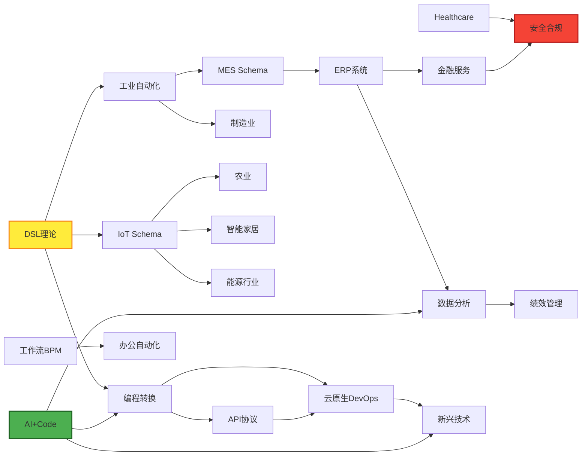
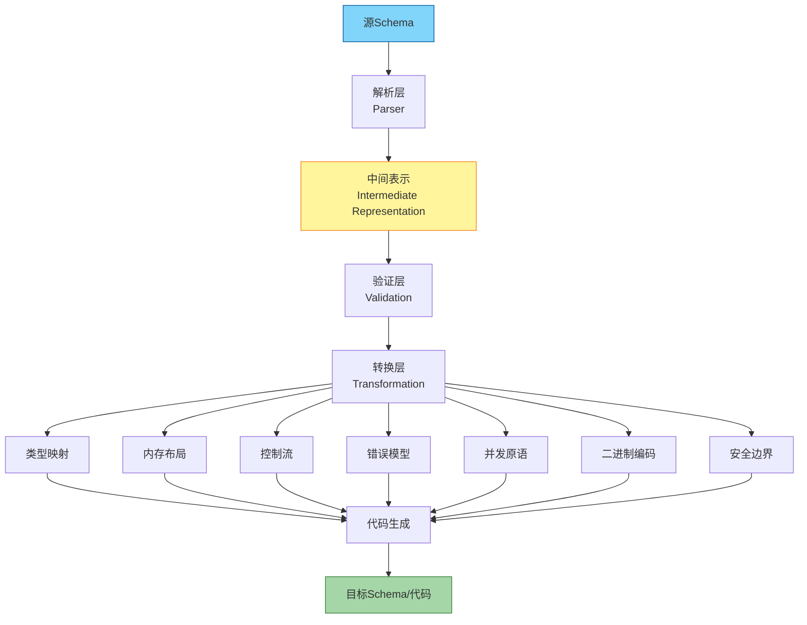
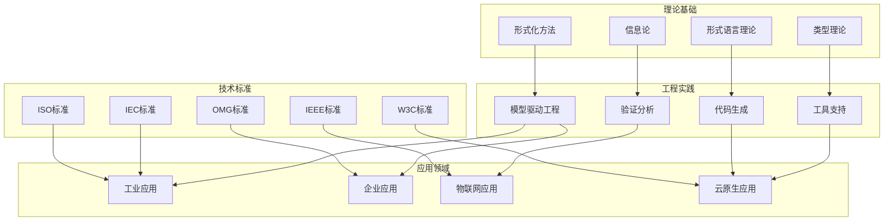
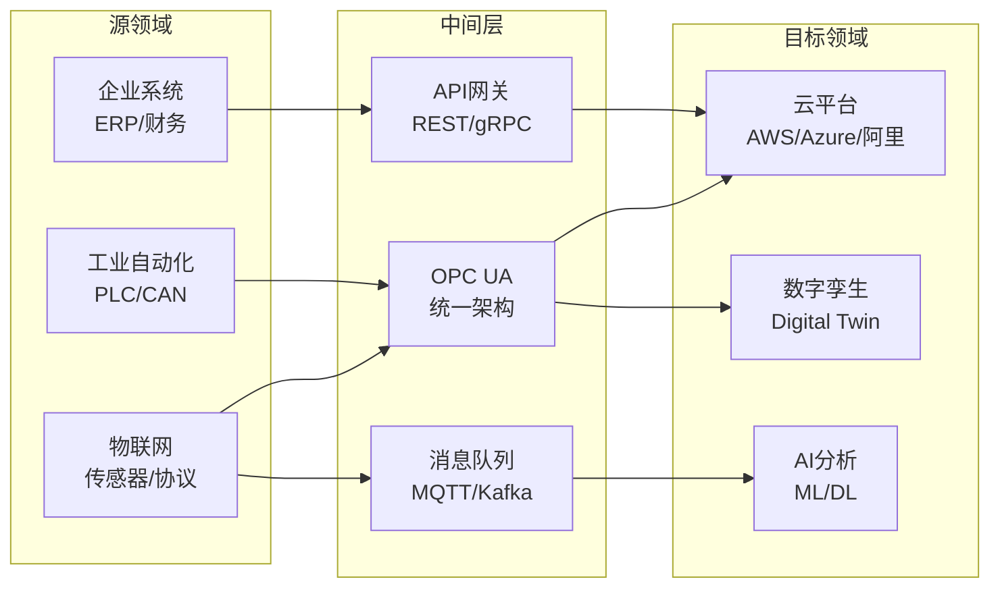

# DSL Schema 全局主题关系思维导图（增强版）

## 📑 目录

- [DSL Schema 全局主题关系思维导图（增强版）](#dsl-schema-全局主题关系思维导图增强版)
  - [📑 目录](#-目录)
  - [1. 导图概述](#1-导图概述)
  - [2. 全景思维导图（文本形式）](#2-全景思维导图文本形式)
  - [3. Mermaid可视化图表](#3-mermaid可视化图表)
    - [3.1 全局主题层次图](#31-全局主题层次图)
    - [3.2 主题依赖关系图](#32-主题依赖关系图)
    - [3.3 转换流程图](#33-转换流程图)
    - [3.4 知识领域交叉图](#34-知识领域交叉图)
  - [4. 主题分类与层次结构](#4-主题分类与层次结构)
    - [4.1 核心基础设施层](#41-核心基础设施层)
    - [4.2 行业应用层](#42-行业应用层)
    - [4.3 企业管理层](#43-企业管理层)
    - [4.4 技术支撑层](#44-技术支撑层)
  - [5. 主题间关系分析](#5-主题间关系分析)
    - [5.1 依赖关系矩阵](#51-依赖关系矩阵)
    - [5.2 转换路径图](#52-转换路径图)
  - [6. 知识维度映射](#6-知识维度映射)

---

## 1. 导图概述

本文档通过**多种思维表征方式**展示DSL Schema项目中33个主题之间的关系：

| 表征方式 | 用途 | 对应章节 |
|---------|------|---------|
| **文本树状图** | 展示层次结构 | 第2节 |
| **Mermaid流程图** | 展示流程和关系 | 第3节 |
| **分类矩阵** | 展示分类体系 | 第4节 |
| **依赖矩阵** | 展示主题间依赖 | 第5节 |
| **维度映射** | 展示多维属性 | 第6节 |

---

## 2. 全景思维导图（文本形式）

```
DSL Schema转换理论与实践
│
├─【核心基础设施层】- 数字化基础
│   │
│   ├─ 01_工业自动化
│   │   ├─ PLC Schema [IEC 61131-3] ─────┐
│   │   └─ CAN Schema [ISO 11898] ──────┤
│   │                                    │
│   ├─ 02_IoT Schema                     │ 物理↔数字
│   │   ├─ 传感器 Schema [GB/T 34068]   │ 转换桥梁
│   │   ├─ 通信 Schema [MQTT/CoAP]      │
│   │   ├─ 控制 Schema                   │
│   │   ├─ 安全 Schema                   │
│   │   ├─ 消息队列 Schema               │
│   │   └─ 可观测性 Schema [OTLP]        │
│   │                                    │
│   ├─ 03_物理设备                       │
│   │   ├─ 电气 Schema                   │
│   │   ├─ 机械 Schema                   │
│   │   ├─ 热管理 Schema                 │
│   │   ├─ 安全 Schema [IEC 61508]      │
│   │   └─ 数字孪生 [ISO/IEC 23247] ────┤
│   │                                    │
│   └─ 16_能源行业                       │
│       ├─ IEC61850 Schema ─────────────┤
│       └─ 可再生能源 Schema             │
│                                        │
├─【行业应用层】- 垂直领域               │
│   │                                    │
│   ├─ 06_金融服务 ◄────────────────────┘
│   │   ├─ ISO20022 Schema [金融消息]
│   │   ├─ SWIFT Schema
│   │   └─ 支付 Schema
│   │
│   ├─ 07_物流供应链
│   │   ├─ EDI Schema [UN/EDIFACT]
│   │   └─ GS1 Schema [条码/RFID]
│   │
│   ├─ 08_海运航运
│   │   └─ Maritime Schema [EDIFACT/IMO]
│   │
│   ├─ 10_医疗健康
│   │   ├─ FHIR Schema [HL7 FHIR]
│   │   ├─ HL7 Schema [HL7 v2/v3]
│   │   └─ 医疗设备 Schema [IEC 62304]
│   │
│   ├─ 11_食品行业
│   │   └─ 食品追溯 Schema [GS1/ISO 22000]
│   │
│   ├─ 12_智慧家居
│   │   ├─ Matter Schema [CSA]
│   │   ├─ Thread Schema
│   │   └─ 智能家居 Schema
│   │
│   ├─ 17_制造业
│   │   ├─ MES Schema [ISA-95]
│   │   └─ PLM Schema
│   │
│   ├─ 18_零售行业
│   │   ├─ POS Schema
│   │   └─ WMS Schema
│   │
│   ├─ 19_交通运输
│   │   ├─ ITS Schema
│   │   └─ 车辆追踪 Schema
│   │
│   ├─ 20_建筑行业
│   │   └─ BIM Schema [ISO 19650]
│   │
│   ├─ 21_教育行业
│   │   ├─ LMS Schema
│   │   ├─ SIS Schema
│   │   └─ 在线教育 Schema
│   │
│   ├─ 22_农业
│   │   ├─ 农业IoT Schema
│   │   ├─ 精准农业 Schema
│   │   └─ 食品溯源 Schema
│   │
│   └─ 23_电信行业
│       ├─ 5G网络 Schema
│       ├─ 网络管理 Schema
│       └─ 电信运营 Schema [eTOM]
│
├─【企业管理层】- 企业数字化
│   │
│   ├─ 13_办公自动化
│   │   └─ OA Schema [BPMN/ODF]
│   │
│   ├─ 14_工作流BPM
│   │   ├─ BPMN Schema [OMG BPMN]
│   │   ├─ BPEL Schema
│   │   └─ 工作流引擎 Schema
│   │
│   ├─ 15_ERP系统
│   │   └─ ERP Schema
│   │
│   ├─ 26_企业财务
│   │   ├─ 会计 Schema
│   │   ├─ 财务报表 Schema
│   │   ├─ 成本核算 Schema
│   │   ├─ 预算管理 Schema
│   │   ├─ 应收应付 Schema
│   │   ├─ 现金管理 Schema
│   │   ├─ 固定资产 Schema
│   │   ├─ 税务 Schema
│   │   ├─ 审计 Schema
│   │   ├─ 管理会计 Schema
│   │   ├─ 合并报表 Schema
│   │   └─ XBRL Schema
│   │
│   ├─ 27_企业数据分析
│   │   ├─ 数据仓库 Schema
│   │   ├─ 数据湖 Schema
│   │   ├─ ETL Schema
│   │   ├─ OLAP Schema
│   │   ├─ 数据挖掘 Schema
│   │   ├─ 机器学习 Schema
│   │   ├─ 数据可视化 Schema
│   │   ├─ 商业智能 Schema
│   │   └─ 数据分析 Schema
│   │
│   └─ 28_企业绩效管理
│       ├─ KPI管理 Schema
│       ├─ 平衡计分卡 Schema
│       └─ 绩效评估 Schema
│
├─【技术支撑层】- 技术底座
│   │
│   ├─ 04_编程转换
│   │   ├─ 形式化模型
│   │   ├─ 语言映射
│   │   ├─ 代码生成
│   │   ├─ 数据库 Schema
│   │   └─ 序列化 Schema
│   │
│   ├─ 05_DSL理论
│   │   ├─ 形式语言理论
│   │   ├─ 信息论
│   │   └─ 知识图谱
│   │
│   ├─ 29_API协议
│   │   ├─ OpenAPI Schema
│   │   ├─ AsyncAPI Schema
│   │   ├─ GraphQL Schema
│   │   ├─ gRPC Schema
│   │   ├─ Protocol Buffers Schema
│   │   ├─ Avro Schema
│   │   └─ JSON Schema
│   │
│   ├─ 30_云原生DevOps
│   │   ├─ Kubernetes Schema
│   │   ├─ Docker Schema
│   │   ├─ Helm Schema
│   │   ├─ Terraform Schema
│   │   ├─ CloudFormation Schema
│   │   ├─ Ansible Schema
│   │   ├─ Pulumi Schema
│   │   └─ GitOps Schema
│   │
│   ├─ 31_新兴技术
│   │   ├─ 区块链 Schema
│   │   ├─ 数字孪生 Schema
│   │   ├─ 边缘AI Schema
│   │   ├─ 元宇宙 Schema
│   │   └─ 量子计算 Schema
│   │
│   ├─ 32_安全合规
│   │   ├─ 安全标准 Schema [ISO 27001]
│   │   ├─ 合规 Schema
│   │   ├─ 身份认证 Schema
│   │   ├─ 安全审计 Schema
│   │   └─ 零信任 Schema
│   │
│   ├─ 32_跨学科
│   │   ├─ 生物信息学 Schema
│   │   ├─ 计算社会科学 Schema
│   │   └─ 数字人文学 Schema
│   │
│   ├─ 33_行业深化
│   │   ├─ 金融科技 Schema
│   │   ├─ 医疗AI Schema
│   │   └─ 智能制造 Schema
│   │
│   └─ 24_其他行业
│       ├─ CRM Schema
│       ├─ 质量管理 Schema
│       └─ 消费追溯 Schema
│
└─【AI+Code集成层】- 智能增强
    │
    └─ 25_AI_Code集成
        ├─ 领域语言转换
        ├─ DSL分类
        ├─ DSL转换
        ├─ 行业Schema分析
        ├─ IoT Schema深度分析
        ├─ 多维模型转换
        └─ 编程语言类型系统

═══════════════════════════════════════════════════════════
                    主题间核心转换关系
═══════════════════════════════════════════════════════════

【垂直转换】（领域特定 → 通用技术）
    
    工业自动化 Schema ──► 编程代码 (ST/LD/C)
           │                    ▲
           │                    │
           └──── 形式化模型 ────┘
    
    IoT Schema ────────► 数据库 Schema (SQL)
           │                    ▲
           │                    │
           └──── 协议转换 ──────┘

【水平转换】（跨领域互操作）

    PLC Schema ◄──► OPC UA ◄──► MES Schema
       │                           │
       └──────── 数字主线 ─────────┘

    FHIR Schema ◄──► HL7 ◄──► 医疗设备 Schema
       │                          │
       └────── 医疗信息互操作 ────┘

【层次转换】（抽象层之间）

    业务需求 (BPMN) ──► 系统设计 (UML) ──► 代码实现 (Java/Python)
         │                  │                  │
         └──────────────── CIM/模型驱动 ────────┘

【时序转换】（生命周期各阶段）

    设计Schema ──► 开发Schema ──► 部署Schema ──► 运维Schema
       │              │              │              │
       └────────────── 数字孪生同步 ───────────────┘
```

---

## 3. Mermaid可视化图表

### 3.1 全局主题层次图

```mermaid
graph TD
    Root[DSL Schema转换理论] --> Core[核心基础设施层]
    Root --> Industry[行业应用层]
    Root --> Enterprise[企业管理层]
    Root --> Tech[技术支撑层]
    Root --> AI[AI+Code集成层]
    
    Core --> IA[01_工业自动化]
    Core --> IoT[02_IoT Schema]
    Core --> PD[03_物理设备]
    Core --> Energy[16_能源行业]
    
    IA --> PLC[PLC Schema]
    IA --> CAN[CAN Schema]
    
    IoT --> Sensor[传感器]
    IoT --> Comm[通信]
    IoT --> Control[控制]
    IoT --> Security[安全]
    
    Industry --> FS[06_金融服务]
    Industry --> Logistics[07_物流供应链]
    Industry --> Maritime[08_海运]
    Industry --> Healthcare[10_医疗]
    Industry --> Food[11_食品]
    Industry --> SmartHome[12_智能家居]
    Industry --> Manufacturing[17_制造业]
    Industry --> Retail[18_零售]
    Industry --> Transport[19_交通]
    Industry --> Building[20_建筑]
    Industry --> Education[21_教育]
    Industry --> Agriculture[22_农业]
    Industry --> Telecom[23_电信]
    
    Enterprise --> OA[13_办公自动化]
    Enterprise --> BPM[14_工作流BPM]
    Enterprise --> ERP[15_ERP系统]
    Enterprise --> Finance[26_企业财务]
    Enterprise --> Analytics[27_数据分析]
    Enterprise --> Performance[28_绩效管理]
    
    Tech --> Programming[04_编程转换]
    Tech --> Theory[05_DSL理论]
    Tech --> API[29_API协议]
    Tech --> Cloud[30_云原生DevOps]
    Tech --> Emerging[31_新兴技术]
    Tech --> Security[32_安全合规]
    Tech --> Cross[32_跨学科]
    Tech --> Deepening[33_行业深化]
    
    AI --> Integration[25_AI_Code集成]
    
    style Root fill:#e1f5ff,stroke:#01579b,stroke-width:3px
    style Core fill:#fff3e0,stroke:#e65100,stroke-width:2px
    style Industry fill:#e8f5e9,stroke:#2e7d32,stroke-width:2px
    style Enterprise fill:#fce4ec,stroke:#c2185b,stroke-width:2px
    style Tech fill:#f3e5f5,stroke:#7b1fa2,stroke-width:2px
    style AI fill:#e0f2f1,stroke:#00695c,stroke-width:2px
```



### 3.2 主题依赖关系图



### 3.3 转换流程图



### 3.4 知识领域交叉图



---

## 4. 主题分类与层次结构

### 4.1 核心基础设施层

| 主题 | 核心标准 | 主要用途 | 技术成熟度 |
|------|---------|---------|-----------|
| PLC Schema | IEC 61131-3 | 工业控制编程 | ⭐⭐⭐⭐⭐ |
| CAN Schema | ISO 11898 | 车载/工业通信 | ⭐⭐⭐⭐⭐ |
| 传感器Schema | GB/T 34068 | 物联网感知层 | ⭐⭐⭐⭐ |
| 数字孪生 | ISO/IEC 23247 | 虚实映射 | ⭐⭐⭐ |
| IEC61850 | IEC 61850 | 变电站自动化 | ⭐⭐⭐⭐⭐ |

### 4.2 行业应用层

| 行业 | 核心Schema | 主要标准 | 数字化程度 |
|------|-----------|---------|-----------|
| 金融服务 | ISO20022 | ISO 20022 | ⭐⭐⭐⭐⭐ |
| 医疗健康 | FHIR | HL7 FHIR | ⭐⭐⭐⭐ |
| 制造业 | MES | ISA-95 | ⭐⭐⭐⭐ |
| 物流供应链 | EDI | UN/EDIFACT | ⭐⭐⭐⭐⭐ |
| 建筑行业 | BIM | ISO 19650 | ⭐⭐⭐ |

### 4.3 企业管理层

| 主题 | 核心功能 | 相关标准 | 企业采用率 |
|------|---------|---------|-----------|
| ERP系统 | 资源规划 | 各厂商标准 | ⭐⭐⭐⭐⭐ |
| 工作流BPM | 流程管理 | BPMN 2.0 | ⭐⭐⭐⭐ |
| 企业财务 | 财务核算 | XBRL/企业会计准则 | ⭐⭐⭐⭐⭐ |
| 数据分析 | 商业智能 | 各厂商标准 | ⭐⭐⭐⭐ |
| 绩效管理 | KPI管理 | 平衡计分卡 | ⭐⭐⭐ |

### 4.4 技术支撑层

| 主题 | 核心技术 | 标准/规范 | 技术热度 |
|------|---------|---------|---------|
| API协议 | REST/gRPC/GraphQL | OpenAPI/AsyncAPI | ⭐⭐⭐⭐⭐ |
| 云原生DevOps | K8s/Docker/IaC | CNCF/各厂商 | ⭐⭐⭐⭐⭐ |
| 编程转换 | 代码生成 | 各语言标准 | ⭐⭐⭐⭐ |
| 安全合规 | 零信任/身份认证 | ISO 27001/NIST | ⭐⭐⭐⭐⭐ |

---

## 5. 主题间关系分析

### 5.1 依赖关系矩阵

```
              PLC   IoT   财务   API   云    AI    安全
            ┌─────┬─────┬─────┬─────┬─────┬─────┬─────┐
    PLC     │  -  │  ○  │     │     │     │  ○  │  ●  │
            ├─────┼─────┼─────┼─────┼─────┼─────┼─────┤
    IoT     │  ○  │  -  │     │  ●  │  ●  │  ●  │  ●  │
            ├─────┼─────┼─────┼─────┼─────┼─────┼─────┤
    财务    │     │     │  -  │  ●  │  ○  │  ○  │  ●  │
            ├─────┼─────┼─────┼─────┼─────┼─────┼─────┤
    API     │     │  ○  │  ○  │  -  │  ●  │  ●  │  ○  │
            ├─────┼─────┼─────┼─────┼─────┼─────┼─────┤
    云      │     │  ●  │  ○  │  ●  │  -  │  ●  │  ●  │
            ├─────┼─────┼─────┼─────┼─────┼─────┼─────┤
    AI      │  ○  │  ●  │  ○  │  ●  │  ●  │  -  │  ○  │
            ├─────┼─────┼─────┼─────┼─────┼─────┼─────┤
    安全    │  ●  │  ●  │  ●  │  ○  │  ●  │  ○  │  -  │
            └─────┴─────┴─────┴─────┴─────┴─────┴─────┘

图例: ● 强依赖  ○ 弱依赖  空 无直接依赖
```

### 5.2 转换路径图



---

## 6. 知识维度映射

```
┌─────────────────────────────────────────────────────────────────┐
│                    知识维度全景图                                 │
├─────────────────────────────────────────────────────────────────┤
│                                                                 │
│   理论深度 ───────────────────────────────────────► 实践应用    │
│        │                                                │       │
│        │    ┌─────────────┐    ┌─────────────┐         │       │
│        │    │ 形式化方法  │────│ 模型驱动    │         │       │
│        │    │ 数学证明    │    │ 工程实践    │         │       │
│        │    └─────────────┘    └─────────────┘         │       │
│        │           │                  │                │       │
│        │    ┌─────────────┐    ┌─────────────┐         │       │
│        │    │ 信息论      │────│ 代码生成    │         │       │
│        │    │ 类型理论    │    │ 工具链      │         │       │
│        │    └─────────────┘    └─────────────┘         │       │
│        │                                                │       │
│   抽象层次 ───────────────────────────────────────► 具体实现    │
│                                                                 │
├─────────────────────────────────────────────────────────────────┤
│                                                                 │
│   通用性 ─────────────────────────────────────────► 专用性      │
│        │                                                │       │
│        │    ┌─────────────┐    ┌─────────────┐         │       │
│        │    │ 通用Schema  │────│ 行业Schema  │         │       │
│        │    │ JSON/XML    │    │ PLC/FHIR    │         │       │
│        │    └─────────────┘    └─────────────┘         │       │
│        │                                                │       │
│   标准化 ─────────────────────────────────────────► 定制化      │
│                                                                 │
└─────────────────────────────────────────────────────────────────┘
```

---

**参考文档**：
- [主题总览README](./README.md)
- [各主题README](./*/README.md)

**创建时间**：2025-01-21  
**最后更新**：2025-01-21（增加多维度思维表征）  
**维护者**：DSL Schema研究团队
