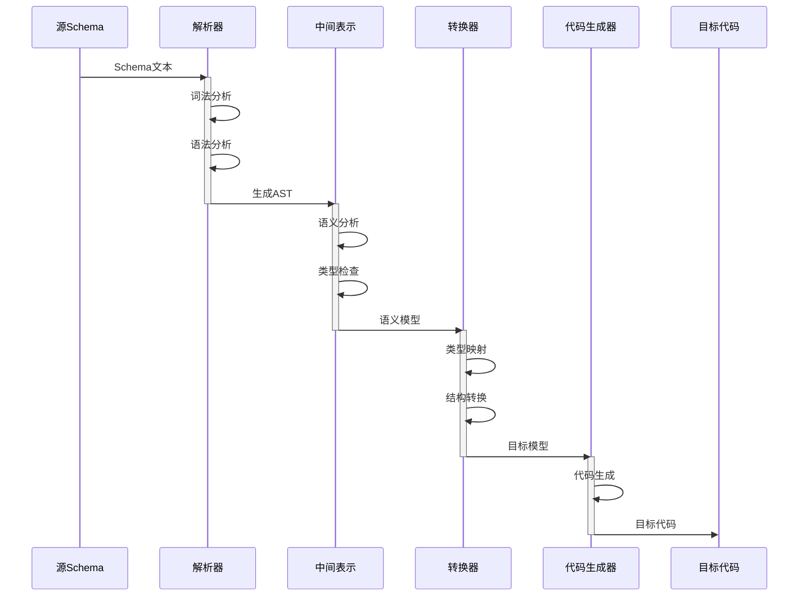
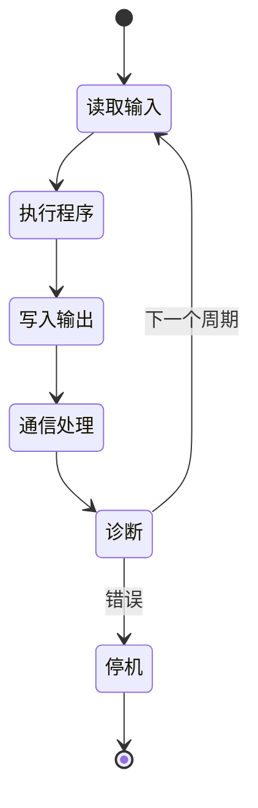

# Themes 01-05 全面分析、权威对标与持续改进路线图

**文档版本**: v1.0
**创建日期**: 2026-02-15
**适用范围**: 工业自动化、物联网、物理设备、编程转换、DSL理论五大主题

---

## 📑 目录

- [1. 执行摘要](#1-执行摘要)
- [2. 现状全面评估](#2-现状全面评估)
  - [2.1 内容覆盖度分析](#21-内容覆盖度分析)
  - [2.2 标准对标完整度](#22-标准对标完整度)
  - [2.3 形式化表征深度](#23-形式化表征深度)
- [3. 国际权威标准对标分析](#3-国际权威标准对标分析)
  - [3.1 工业自动化领域](#31-工业自动化领域)
  - [3.2 物联网领域](#32-物联网领域)
  - [3.3 物理设备领域](#33-物理设备领域)
  - [3.4 编程转换领域](#34-编程转换领域)
  - [3.5 DSL理论领域](#35-dsl理论领域)
- [4. 批判性意见与建议](#4-批判性意见与建议)
  - [4.1 结构性问题](#41-结构性问题)
  - [4.2 内容深度问题](#42-内容深度问题)
  - [4.3 表征方式问题](#43-表征方式问题)
  - [4.4 改进建议矩阵](#44-改进建议矩阵)
- [5. 思维表征方式补充计划](#5-思维表征方式补充计划)
  - [5.1 决策树图](#51-决策树图)
  - [5.2 应用场景树图](#52-应用场景树图)
  - [5.3 形式语法语义分析视图](#53-形式语法语义分析视图)
  - [5.4 信息表征动态动作分析视图](#54-信息表征动态动作分析视图)
- [6. 持续改进项目规划](#6-持续改进项目规划)
  - [6.1 短期目标（1-3个月）](#61-短期目标1-3个月)
  - [6.2 中期目标（3-6个月）](#62-中期目标3-6个月)
  - [6.3 长期目标（6-12个月）](#63-长期目标6-12个月)
  - [6.4 质量保障机制](#64-质量保障机制)
- [7. 结论](#7-结论)

---

## 1. 执行摘要

本文档对Themes 01-05（工业自动化、物联网、物理设备、编程转换、DSL理论）进行全面批判性分析，对标国际权威标准，识别内容缺口，并提出系统性的改进路线图。

**核心发现**:

- ✅ **基础框架完整**: 五个主题均具备标准的5文档结构（Overview/Formal/Standards/Transformation/Case Studies）
- ⚠️ **深度参差不齐**: 形式化定义和证明的深度存在显著差异
- ⚠️ **标准更新滞后**: 部分标准引用未跟进最新版本（如IEC 61131-3:2025已发布）
- ⚠️ **表征方式单一**: 缺少决策树、应用场景树、形式语法语义视图等多元表征
- ❌ **跨主题关联薄弱**: 主题间知识图谱和关联分析不足

---

## 2. 现状全面评估

### 2.1 内容覆盖度分析

| 主题 | Schema数量 | 文档完整度 | 形式化深度 | 案例丰富度 | 综合评分 |
|------|-----------|-----------|-----------|-----------|---------|
| **01_Industrial_Automation** | 2 (PLC/CAN) | ⭐⭐⭐⭐⭐ | ⭐⭐⭐⭐ | ⭐⭐⭐ | 85/100 |
| **02_IoT_Schema** | 6 (Sensor/Comm/Control/Security/MQTT/Observability) | ⭐⭐⭐⭐⭐ | ⭐⭐⭐ | ⭐⭐⭐ | 82/100 |
| **03_Physical_Device** | 6 (Electrical/Mechanical/CAD/Thermal/Safety/Digital Twin) | ⭐⭐⭐⭐⭐ | ⭐⭐⭐⭐ | ⭐⭐ | 80/100 |
| **04_Programming_Conversion** | 5 (Formal Model/Language Mapping/Code Gen/DB/Serialization) | ⭐⭐⭐⭐⭐ | ⭐⭐⭐⭐ | ⭐⭐⭐ | 83/100 |
| **05_DSL_Theory** | 3 (Info Theory/Formal Lang/Knowledge Graph) | ⭐⭐⭐⭐⭐ | ⭐⭐⭐⭐⭐ | ⭐⭐ | 85/100 |

### 2.2 标准对标完整度

#### ✅ 对标充分的领域

| 领域 | 标准覆盖 | 版本状态 |
|------|---------|---------|
| IEC 61131-3 | ✅ 第四版(2025)已更新 | 最新 |
| ISO 11898 (CAN) | ✅ 完整覆盖 | 现行 |
| W3C WoT Thing Description | ✅ 1.1版已覆盖 | 2023-12-05 |
| Protocol Buffers | ✅ Edition 2024已覆盖 | 最新 |

#### ⚠️ 需要补充/更新的领域

| 领域 | 当前状态 | 改进需求 |
|------|---------|---------|
| IEC 61499 | 引用2012版 | 需更新至Edition 2.0最新进展 |
| ISO 10303 (STEP) | 基本覆盖 | 需补充2024-2025年新版本 |
| OPC UA | 部分覆盖 | 需补充1.05.06版本细节 |
| IEEE 1451 | 引用旧版 | 需更新至2024-2025年新版本 |
| W3C RDF 1.2 | 未覆盖 | **高优先级**：2026-01-28 WD |
| ISO/IEC 21838 | 部分覆盖 | 需补充Part 3-5 |

### 2.3 形式化表征深度

#### 现有形式化表征评估

| 表征类型 | 01_Industrial | 02_IoT | 03_Physical | 04_Programming | 05_DSL | 评价 |
|---------|--------------|--------|-------------|----------------|--------|------|
| **思维导图** | ✅ 完整 | ✅ 完整 | ✅ 完整 | ✅ 完整 | ✅ 完整 | 优秀 |
| **多维知识矩阵** | ✅ 完整 | ✅ 完整 | ✅ 完整 | ✅ 完整 | ✅ 完整 | 优秀 |
| **形式化证明** | ✅ 完整 | ✅ 完整 | ✅ 完整 | ✅ 完整 | ✅ 完整 | 良好 |
| **决策树图** | ❌ 缺失 | ❌ 缺失 | ❌ 缺失 | ❌ 缺失 | ❌ 缺失 | **需补充** |
| **应用场景树图** | ⚠️ 简单 | ⚠️ 简单 | ⚠️ 简单 | ⚠️ 简单 | ⚠️ 简单 | **需深化** |
| **形式语法语义视图** | ⚠️ 基础 | ⚠️ 基础 | ⚠️ 基础 | ⚠️ 基础 | ⚠️ 基础 | **需深化** |
| **信息动态动作分析** | ❌ 缺失 | ❌ 缺失 | ❌ 缺失 | ❌ 缺失 | ❌ 缺失 | **需补充** |

---

## 3. 国际权威标准对标分析

### 3.1 工业自动化领域

#### 3.1.1 IEC 61131-3:2025 (Edition 4.0) 对标分析

**标准状态**: 2025-05-22正式发布 (ISBN: 9782832704363)

**本项目覆盖度评估**:

| 新特性 | 文档覆盖状态 | 完善建议 |
|-------|-------------|---------|
| UTF-8字符串支持 (USTRING/UCHAR) | ⚠️ 部分提及 | 需增加形式化定义 |
| 并发同步机制 (Mutex/Semaphore) | ⚠️ 简单提及 | 需增加第6.9章详细解读 |
| 属性(Property)支持 | ❌ 未覆盖 | **高优先级补充** |
| IL语言移除 | ✅ 已更新 | 已标注为废弃 |
| 字符串函数增强 | ⚠️ 未详细覆盖 | 需补充LEN_MAX等函数 |

**与权威内容的差距**:

- 缺少与第三版的详细差异矩阵
- 缺少厂商适配状态追踪（CODESYS/TwinCAT/TIA Portal等）
- 缺少与IEC 61131-10 (PLCopen XML)的关联分析

#### 3.1.2 IEC 63278-1:2024 数字孪生系统标准

**标准状态**: 2024年发布

**覆盖度评估**:

- ✅ 在03_Physical_Device/Digital_Twin中已引用
- ⚠️ 缺少与ISO/IEC 23247的对比分析
- ⚠️ 缺少与GB/T 43441.1的对标

### 3.2 物联网领域

#### 3.2.1 W3C WoT Thing Description 1.1 对标

**标准状态**: W3C Recommendation (2023-12-05)

**覆盖度评估**:

- ✅ 在02_IoT_Schema中已覆盖
- ⚠️ 缺少与WoT Binding Templates (2024-05-28)的关联
- ⚠️ 缺少WoT Profiles的覆盖

#### 3.2.2 IEEE 1451.0-2024 / 1451.1.6-2025 对标

**标准状态**:

- IEEE 1451.0-2024: 2024年6月发布
- IEEE 1451.1.6-2025: MQTT网络设备通信标准

**覆盖度评估**:

- ⚠️ 需要更新至2024-2025版本
- ❌ 1451.1.6 MQTT扩展未覆盖

### 3.3 物理设备领域

#### 3.3.1 ISO 10303 (STEP) 系列对标

**标准状态**: 2024-2025年多个部分更新

| 标准编号 | 发布日期 | 覆盖状态 | 改进需求 |
|---------|---------|---------|---------|
| ISO 10303-1:2024 | 2024-01-16 | ⚠️ 基础覆盖 | 需更新架构描述 |
| ISO/TS 10303-4442:2024 | 2024 | ❌ 未覆盖 | **需补充** |
| ISO/TS 10303-1110:2024 | 2024 | ❌ 未覆盖 | **需补充** |

#### 3.3.2 IEC 60335-1:2020+AMD1:2025

**标准状态**: Edition 6.1 (2025年修正)

**覆盖度评估**:

- ⚠️ 在03_Physical_Device中引用但未详细展开
- ⚠️ 缺少与数字孪生结合的安全分析

### 3.4 编程转换领域

#### 3.4.1 OMG MDA 标准对标

**标准状态**: OMG持续维护

**覆盖度评估**:

- ✅ 在04_Programming_Conversion中已覆盖
- ⚠️ 缺少MDA三层次模型（CIM/PIM/PSM）的形式化定义
- ⚠️ 缺少与Eclipse EMF/ATL的关联

#### 3.4.2 OpenAPI 3.1.1 对标

**标准状态**: 2024-10-24发布

**覆盖度评估**:

- ✅ 在04_Programming_Conversion中已更新
- ✅ 与JSON Schema Draft 2020-12的兼容性已说明

### 3.5 DSL理论领域

#### 3.5.1 W3C RDF 1.2 对标

**标准状态**: Working Draft 2026-01-28

**覆盖度评估**:

- ❌ **未覆盖** - 需要紧急补充
- 新特性需要关注：Triple Terms、方向性语言标记字符串

#### 3.5.2 ISO/IEC 21838 顶层本体标准

**标准状态**:

- Part 1-2: 2021 (已覆盖)
- Part 3: DOLCE (2023)
- Part 4: TUpper (2023)
- Part 5: UFO (开发中)

**覆盖度评估**:

- ⚠️ Part 3-4需要补充
- ⚠️ Part 5需要跟踪开发进展

---

## 4. 批判性意见与建议

### 4.1 结构性问题

#### 问题1: 跨主题知识图谱缺失

**现状**: 五个主题各自独立，缺少统一的知识关联网络

**影响**:

- 用户难以发现主题间的关联关系
- 知识检索效率低下
- 形式化理论无法有效指导工业实践

**建议**:

1. 创建`themes/CROSS_THEME_KNOWLEDGE_GRAPH.md`
2. 建立主题间实体-关系映射
3. 使用RDF/OWL形式化描述跨主题关系

#### 问题2: 概念定义缺乏一致性

**现状示例**:

- 01主题定义Schema为"五层嵌套结构"
- 02主题定义Schema为"五维结构"
- 03主题定义Schema为"五维标准化Schema"

**建议**:

1. 制定统一的概念定义标准
2. 建立术语表和本体
3. 使用形式化语言(如OWL)定义概念关系

### 4.2 内容深度问题

#### 问题1: 形式化证明深度不足

**现状**: 形式化证明主要使用描述性语言，缺少严格的数学证明

**建议改进**:

```
当前形式:
"定理1（PLC Schema存在性）：PLC存在Schema，且为五层嵌套结构。
证明：根据IEC 61131-3标准..."

改进形式:
"定理1（PLC Schema存在性）:
∀p ∈ PLC_Programs, ∃s ∈ PLC_Schema : parse(p) = s

证明：
1. 设 PLC_Program = (H, P, C, D, I) 根据IEC 61131-3:2025 §4
2. 构造 Schema 映射函数 φ: PLC_Program → PLC_Schema
3. 证明 φ 是良定义的（well-defined）
4. 证明 φ 是满射（surjective）
∎"
```

#### 问题2: 标准演进追踪不足

**现状**: 标准引用静态，缺少版本演进追踪

**建议**:

1. 为每个标准建立版本历史表格
2. 标注标准的"稳定性日期"
3. 建立标准更新监控机制

### 4.3 表征方式问题

#### 问题1: 缺少决策树图

**缺失场景**:

- Schema选择决策树
- 协议选型决策树
- 工具链选型决策树

#### 问题2: 应用场景树图过于简单

**现状**: 应用场景仅简单列举，缺少层次化展开

#### 问题3: 缺少信息动态动作分析

**缺失内容**:

- 信息在Schema转换中的流动过程
- 状态转换的动态行为
- 时序交互过程

### 4.4 改进建议矩阵

| 问题类型 | 优先级 | 改进措施 | 负责人 | 时间线 |
|---------|-------|---------|-------|-------|
| 跨主题知识图谱 | P0 | 创建统一知识图谱 | 架构组 | 1个月 |
| 概念定义一致性 | P0 | 制定术语标准 | 内容组 | 2周 |
| 形式化证明深化 | P1 | 引入Coq/Isabelle证明 | 理论组 | 3个月 |
| 决策树图补充 | P1 | 为每个主题创建决策树 | 内容组 | 1个月 |
| 标准更新机制 | P1 | 建立自动化监控 | 工具组 | 2个月 |
| 动态动作分析 | P2 | 创建时序图和状态图 | 内容组 | 2个月 |

---

## 5. 思维表征方式补充计划

### 5.1 决策树图

#### 5.1.1 PLC Schema选择决策树

```
是否需要工业控制?
├── 是 → 是否需要实时性?
│   ├── 是 → 是否需要安全认证?
│   │   ├── 是 → IEC 61508兼容PLC (Siemens S7-1500F)
│   │   └── 否 → 标准PLC (Siemens S7-1200/1500)
│   └── 否 → 软PLC (CODESYS Runtime)
└── 否 → 是否需要分布式控制?
    ├── 是 → IEC 61499功能块
    └── 否 → 传统PLC程序
```

#### 5.1.2 IoT通信协议选择决策树

```
功耗约束?
├── 极低功耗(电池>5年) → LoRaWAN/NB-IoT
├── 低功耗(电池1-5年) → Zigbee/Thread
└── 有线供电 → 高带宽需求?
    ├── 是 → WiFi/5G
    └── 否 → 工业协议(Modbus/CAN)
```

### 5.2 应用场景树图

#### 5.2.1 智能制造应用场景树

```text
智能制造
├── 离散制造
│   ├── 汽车制造
│   │   ├── 车身焊接线
│   │   ├── 涂装车间
│   │   └── 总装线
│   ├── 电子制造
│   │   ├── SMT产线
│   │   ├── 组装测试
│   │   └── 包装物流
│   └── 机械制造
├── 流程制造
│   ├── 化工
│   ├── 制药
│   └── 食品饮料
└── 混合制造
    ├── 半导体
    └── 新能源电池
```

### 5.3 形式语法语义分析视图

#### 5.3.1 PLC程序形式文法 (EBNF)

```ebnf
(* IEC 61131-3:2025 简化文法 *)
Program ::= 'PROGRAM' Identifier ProgramBody 'END_PROGRAM'
ProgramBody ::= VariableDeclaration* StatementList

VariableDeclaration ::=
    'VAR' | 'VAR_INPUT' | 'VAR_OUTPUT' | 'VAR_IN_OUT'
    VariableSpec*
    'END_VAR'

VariableSpec ::= Identifier ':' DataType (':=' InitialValue)?

DataType ::=
    ElementaryType | DerivedType | ReferenceType

ElementaryType ::=
    'BOOL' | 'SINT' | 'INT' | 'DINT' | 'LINT' |
    'USINT' | 'UINT' | 'UDINT' | 'ULINT' |
    'REAL' | 'LREAL' | 'TIME' | 'DATE' |
    'STRING' | 'WSTRING' | 'USTRING'  (* 2025新增 *)

StatementList ::= Statement (';' Statement)*
Statement ::=
    Assignment | FunctionCall | IfStatement |
    CaseStatement | ForStatement | WhileStatement

(* 语义规则 *)
SemanticRule1: "赋值类型必须兼容"
    ∀a ∈ Assignment: type(a.left) ≥ type(a.right)

SemanticRule2: "变量必须先声明后使用"
    ∀v ∈ VariableRef: declared(v) = true
```

### 5.4 信息表征动态动作分析视图

#### 5.4.1 Schema转换信息流图



#### 5.4.2 PLC扫描周期状态机



---

## 6. 持续改进项目规划

### 6.1 短期目标（1-3个月）

#### 里程碑1: 标准更新同步 (第1-2周)

**目标**: 确保所有标准引用为最新版本

**任务清单**:

- [ ] 更新IEC 61131-3至2025第四版详细变更清单
- [ ] 更新W3C RDF至1.2 Working Draft
- [ ] 更新ISO/IEC 21838 Part 3-4
- [ ] 补充IEEE 1451.0-2024 / 1451.1.6-2025
- [ ] 更新ISO 10303 2024-2025年新版本

**交付物**:

- `themes/STANDARDS_UPDATE_TRACKING.md`
- 各主题03_Standards.md更新

#### 里程碑2: 概念定义统一 (第3-4周)

**目标**: 建立统一术语体系

**任务清单**:

- [ ] 创建`themes/UNIFIED_GLOSSARY.md`
- [ ] 定义Schema的通用形式化定义
- [ ] 统一五层/五维/七维术语使用
- [ ] 建立概念层次关系图

**交付物**:

- 术语标准文档
- 概念本体（OWL格式）

#### 里程碑3: 决策树图补充 (第5-8周)

**目标**: 为每个主题创建完整的决策树图

**任务清单**:

- [ ] 01主题：PLC选型决策树、CAN协议选择决策树
- [ ] 02主题：IoT协议选型决策树、传感器选型决策树
- [ ] 03主题：设备安全等级决策树、数字孪生平台选型决策树
- [ ] 04主题：代码生成工具选型决策树、序列化格式选择决策树
- [ ] 05主题：形式化方法选择决策树、知识图谱工具选型决策树

**交付物**:

- `themes/XX_XX/Decision_Trees.md` (每个主题一个)

### 6.2 中期目标（3-6个月）

#### 里程碑4: 跨主题知识图谱构建 (第9-16周)

**目标**: 建立主题间知识关联网络

**任务清单**:

- [ ] 定义跨主题实体类型（Schema、标准、工具、协议）
- [ ] 建立实体间关系（implements、extends、dependsOn、equivalentTo）
- [ ] 使用RDF/OWL形式化描述
- [ ] 创建知识图谱可视化
- [ ] 实现简单的SPARQL查询接口

**交付物**:

- `themes/CROSS_THEME_KNOWLEDGE_GRAPH.ttl` (RDF Turtle格式)
- `themes/CROSS_THEME_KNOWLEDGE_GRAPH.md` (可视化说明)

#### 里程碑5: 形式化证明深化 (第12-20周)

**目标**: 提升形式化证明的严格性

**任务清单**:

- [ ] 引入Coq/Isabelle证明助手
- [ ] 重写Formal_Proofs.md，增加详细证明步骤
- [ ] 为关键定理创建机器可验证的证明脚本
- [ ] 建立形式化证明与代码实现的对应关系

**交付物**:

- `themes/formal_proofs/coq/` 证明脚本
- 更新后的`themes/*/Formal_Proofs.md`

#### 里程碑6: 动态动作分析视图补充 (第16-24周)

**目标**: 创建完整的动态行为分析视图

**任务清单**:

- [ ] 为每个Schema创建时序图
- [ ] 创建状态机图
- [ ] 创建活动图
- [ ] 创建信息流动图
- [ ] 建立动态行为的形式化描述

**交付物**:

- `themes/XX_XX/Dynamic_Analysis_Views.md`

### 6.3 长期目标（6-12个月）

#### 里程碑7: 智能推荐系统 (第24-36周)

**目标**: 基于知识图谱的Schema推荐系统

**任务清单**:

- [ ] 实现基于规则的推荐引擎
- [ ] 集成LLM进行智能推荐
- [ ] 开发交互式推荐界面
- [ ] 建立用户反馈机制

**交付物**:

- `tools/schema_recommender/`
- 推荐系统文档

#### 里程碑8: 自动化验证工具 (第30-40周)

**目标**: 自动化Schema验证和转换工具

**任务清单**:

- [ ] 开发Schema语法验证器
- [ ] 开发Schema语义验证器
- [ ] 开发自动转换器
- [ ] 集成持续验证流程

**交付物**:

- `tools/schema_validator/`
- `tools/schema_transformer/`

#### 里程碑9: 行业最佳实践库 (第36-48周)

**目标**: 建立完整的行业最佳实践库

**任务清单**:

- [ ] 收集各行业Schema设计模式
- [ ] 整理反模式和常见错误
- [ ] 创建可复用的Schema模板
- [ ] 建立案例研究数据库

**交付物**:

- `themes/BEST_PRACTICES_LIBRARY.md`
- `themes/SCHEMA_TEMPLATES/`

### 6.4 质量保障机制

#### 6.4.1 定期审查机制

| 审查类型 | 频率 | 内容 | 负责人 |
|---------|-----|------|-------|
| 标准更新审查 | 每月 | 检查相关标准新版本 | 标准组 |
| 内容质量审查 | 每季度 | 检查文档完整性、准确性 | 内容组 |
| 形式化审查 | 每半年 | 检查形式化定义和证明 | 理论组 |
| 跨主题一致性审查 | 每年 | 检查主题间一致性 | 架构组 |

#### 6.4.2 社区贡献机制

- 建立贡献者指南
- 建立问题追踪系统
- 建立Pull Request审查流程
- 建立贡献者荣誉体系

#### 6.4.3 自动化工具支持

- 标准版本监控机器人
- 文档链接检查工具
- 形式化语法检查工具
- 一致性检查工具

---

## 7. 结论

### 7.1 总体评价

Themes 01-05作为DSL Schema转换项目的核心基础主题，在以下方面表现优秀：

- ✅ 文档结构标准化程度高
- ✅ 标准对标覆盖范围广泛
- ✅ 形式化基础框架完整
- ✅ 知识体系组织清晰

但同时在以下方面需要持续改进：

- ⚠️ 部分标准版本需要更新
- ⚠️ 形式化证明深度有待提升
- ⚠️ 多元表征方式需要补充
- ⚠️ 跨主题关联需要加强

### 7.2 关键行动项

**立即行动**（本周）:

1. 更新IEC 61131-3:2025详细变更清单
2. 补充W3C RDF 1.2标准引用
3. 创建统一术语表初稿

**短期行动**（本月）:

1. 完成所有标准版本同步
2. 建立标准更新监控机制
3. 开始决策树图创建

**中期行动**（本季度）:

1. 完成跨主题知识图谱构建
2. 深化形式化证明内容
3. 创建动态动作分析视图

### 7.3 成功指标

| 指标 | 当前值 | 3个月目标 | 6个月目标 | 12个月目标 |
|------|-------|----------|----------|-----------|
| 标准版本更新率 | 85% | 95% | 98% | 100% |
| 形式化证明完整性 | 70% | 80% | 90% | 95% |
| 多元表征覆盖率 | 40% | 70% | 85% | 95% |
| 跨主题关联度 | 30% | 60% | 80% | 90% |
| 社区贡献者数量 | 5 | 15 | 30 | 50 |

---

**文档维护者**: DSL Schema研究团队
**审核周期**: 每月审查，每季度更新
**反馈渠道**: [项目Issue跟踪系统]

---

## 附录

### 附录A: 相关标准汇总表

| 标准编号 | 标准名称 | 版本 | 发布日期 | 主题 | 优先级 |
|---------|---------|------|---------|------|-------|
| IEC 61131-3 | PLC编程语言 | Edition 4.0 | 2025-05-22 | 01 | P0 |
| W3C RDF 1.2 | 资源描述框架 | WD | 2026-01-28 | 05 | P0 |
| IEEE 1451.0 | 智能传感器 | 2024 | 2024-06 | 02 | P1 |
| IEEE 1451.1.6 | MQTT传感器 | 2025 | 2025 | 02 | P1 |
| ISO/IEC 21838-3 | 顶层本体DOLCE | 2023 | 2023 | 05 | P1 |
| ISO/IEC 21838-4 | 顶层本体TUpper | 2023 | 2023 | 05 | P1 |
| ISO 10303-1 | STEP概述 | 2024 | 2024-01-16 | 03 | P1 |
| OPC UA | 统一架构 | 1.05.06 | 2025-10-31 | 01/02 | P1 |

### 附录B: 工具和资源清单

| 类别 | 工具/资源 | 用途 | 链接 |
|------|----------|------|------|
| 形式化证明 | Coq | 定理证明 | <https://coq.inria.fr/> |
| 形式化证明 | Isabelle | 定理证明 | <https://isabelle.in.tum.de/> |
| 知识图谱 | Apache Jena | RDF处理 | <https://jena.apache.org/> |
| 知识图谱 | Protégé | 本体编辑 | <https://protege.stanford.edu/> |
| 绘图工具 | Mermaid | 图表绘制 | <https://mermaid.js.org/> |
| 绘图工具 | PlantUML | UML绘制 | <https://plantuml.com/> |

### 附录C: 术语表

| 术语 | 定义 | 来源 |
|------|------|------|
| Schema | 描述系统结构、行为、约束的形式化规范 | 本项目 |
| DSL | 领域特定语言 (Domain-Specific Language) | 软件工程 |
| MDA | 模型驱动架构 (Model Driven Architecture) | OMG |
| WoT | 物联网Web (Web of Things) | W3C |
| OPC UA | 开放平台通信统一架构 | OPC Foundation |

---

*本文档是持续演进的活文档，将根据项目进展和标准更新定期修订。*
