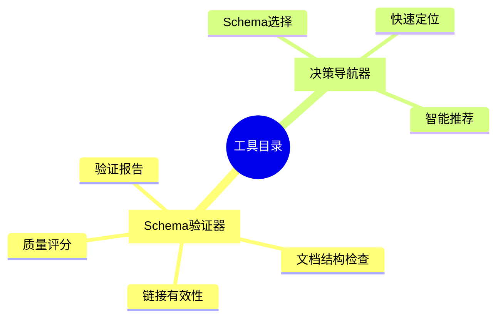
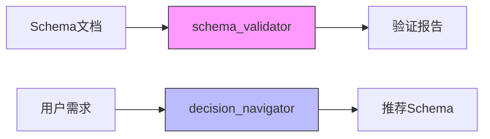

# 工具目录思维导图

## 概述

本目录包含DSL Schema项目的辅助工具和脚本。

## 思维导图

```text
工具目录 (tools)
├── schema_validator/
│   ├── 功能: Schema文档验证
│   ├── 检查: 文档结构完整性
│   ├── 检查: 链接有效性
│   └── 输出: 验证报告
│
└── decision_navigator/
    ├── 功能: 决策导航
    ├── 提供: Schema选择指导
    └── 帮助: 快速定位文档
```

## Mermaid可视化

### 思维导图



### 工具关系图



## 工具详情

### schema_validator

- **用途**: 验证Schema文档的完整性和规范性
- **输入**: Markdown文档
- **输出**: JSON格式的验证报告
- **检查项**:
  - 必需文件存在性
  - 链接有效性
  - 内容质量评分

### decision_navigator

- **用途**: 帮助用户快速找到所需的Schema文档
- **功能**:
  - 按行业筛选
  - 按标准筛选
  - 关键词搜索

## 与其他主题的关系

- **所有主题**: 工具为所有Schema主题提供支持服务

---

**创建时间**: 2026-02-16
**更新时间**: 2026-02-16
