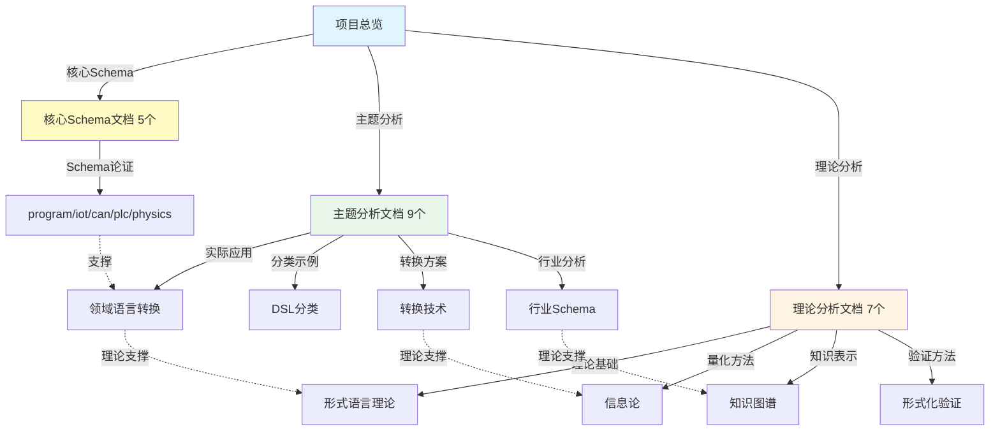

# 🎯 DSL Schema 转换系统 - 项目总览

## 📋 项目概述

本项目全面分析DSL Schema转换的理论与实践，从形式语言理论、信息论、知识图谱等多个理论角度，以及实际应用场景、行业案例等多个实践角度，建立了完整的Schema转换知识体系。

---

## 📚 文档体系结构

### 1. 核心Schema文档（5个）✨ **全部增强**

位于 `view/` 目录，涵盖核心Schema存在性论证和转换体系：

1. **[program.md](./program.md)** ✨ **形式语言Schema转换编程语言**
   - Schema到编程语言的转换问题
   - 类型系统映射
   - 转换工具对比
   - 实际案例论证

2. **[iot_schema.md](./iot_schema.md)** ✨ **IoT传感器Schema**
   - 五维Schema体系
   - IoT协议对比
   - 行业级Schema实践

3. **[can_schema.md](./can_schema.md)** ✨ **CAN协议Schema**
   - 分层Schema结构
   - CAN协议标准对比
   - 行业Schema实践

4. **[plc_schema.md](./plc_schema.md)** ✨ **PLC Schema**
   - 五层嵌套结构
   - IEC 61131-3编程语言对比
   - 实践案例

5. **[physics_schema.md](./physics_schema.md)** ✨ **物理领域Schema**
   - 五维标准化体系
   - 物理领域标准对比
   - 跨行业数字化基座

**统计**：

- 总行数：3,744行
- 对比矩阵：5个
- 可视化图表：6个（5个思维导图 + 1个流程图）

**增强状态**：✅ 已增强（v2.0）

---

### 2. 主题分析文档（9个）✨ **全部增强**

位于 `view/analysis/themes/` 目录，涵盖实际应用和案例分析：

1. **[01-领域语言转换与AI时代适配方案](./analysis/themes/01-领域语言转换与AI时代适配方案.md)** ✨
   - OpenAPI/AsyncAPI/IoTSchema对比
   - MCP协议集成
   - AI+Code集成方案

2. **[02-DSL分类与典型示例](./analysis/themes/02-DSL分类与典型示例.md)** ✨
   - DSL分类体系
   - 各领域DSL示例
   - 实际应用案例

3. **[03-DSL转换方案与技术分析](./analysis/themes/03-DSL转换方案与技术分析.md)** ✨
   - 转换工具对比
   - 转换技术方案
   - 性能优化

4. **[04-IOT-Schema深度分析](./analysis/themes/04-IOT-Schema深度分析.md)** ✨
   - IoT协议对比
   - IoT数据流分析
   - 部署案例

5. **[05-行业Schema分析与转换](./analysis/themes/05-行业Schema分析与转换.md)** ✨
   - 10+行业Schema分析
   - 行业转换案例
   - 转换性能对比

6. **[06-多维模型转换论证](./analysis/themes/06-多维模型转换论证.md)** ✨
   - 多维模型对比
   - 形式化证明
   - 转换关系图

7. **[07-编程语言类型系统与控制逻辑](./analysis/themes/07-编程语言类型系统与控制逻辑.md)** ✨
   - 类型系统映射
   - 控制逻辑生成
   - 代码生成示例

8. **[08-二进制转换与TCP协议](./analysis/themes/08-二进制转换与TCP协议.md)** ✨
   - 二进制处理对比
   - TCP协议适配
   - 高性能案例

9. **[09-跨行业转换体系扩展论证](./analysis/themes/09-跨行业转换体系扩展论证.md)** ✨
   - 七维转换体系
   - 行业转换矩阵
   - 转换熵增定律

**统计**：

- 总行数：8,911行（v2.1深度增强后）
- 对比矩阵：47+个（v2.0: 35个 + v2.1: 12个）
- 可视化图表：35+个
- 实际案例：35+个（v2.0: 20个 + v2.1: 15个）
- 性能数据：30+组（v2.1新增）
- 技术分析章节：21个（v2.1新增）

**增强状态**：✅ 已深度增强（v2.1）

---

### 3. 理论分析文档（7个）✨ **全部增强**

位于 `view/theory/` 目录，涵盖理论基础和形式化证明：

1. **[10-形式语言理论分析](./theory/10_Formal_Language_Theory_Analysis.md)** ✨
   - Chomsky层次理论
   - 语法转换形式化
   - 语义转换形式化

2. **[09-信息论分析](./theory/09_Information_Theory_Analysis.md)** ✨
   - Schema信息熵
   - 转换信息损失
   - 信息论证明

3. **[08-多维知识矩阵](./theory/08_Multidimensional_Knowledge_Matrix.md)** ✨
   - 多维矩阵构建
   - 维度交叉分析
   - 矩阵应用场景

4. **[07-知识图谱映射](./theory/07_Knowledge_Graph_Mapping.md)** ✨
   - 知识图谱构建
   - 本体定义
   - 推理规则

5. **[06-形式化验证证明](./theory/06_Formal_Verification_Proofs.md)** ✨
   - 形式化验证方法
   - 转换正确性证明
   - 类型安全证明

6. **[06-树形模型AI/ML应用](./theory/06_Tree_Model_AI_ML_Application.md)** ✨
   - 决策树映射
   - 树形神经网络
   - AI/ML应用

7. **[06-树形模型AI/ML案例研究](./theory/06_Tree_Model_AI_ML_Case_Studies.md)** ✨
   - 智能推荐案例
   - 转换优化案例
   - 错误预测案例

**统计**：

- 总行数：4,449行
- 对比矩阵：9个
- 可视化图表：10个
- 思维导图：7个

---

## 📊 项目整体统计

### 文档统计

| 类别 | 数量 | 状态 | 对比矩阵 | 图表 | 案例 |
|------|------|------|----------|------|------|
| **核心Schema文档** | 5个 | ✅ 全部增强 | 5个 | 6个 | - |
| **主题分析文档** | 9个 | ✅ 全部增强 | 35+个 | 35+个 | 20+个 |
| **理论分析文档** | 7个 | ✅ 全部增强 | 9个 | 10个 | - |
| **导航和辅助文档** | 25+个 | ✅ 完成 | - | - | - |
| **总计** | **46+个** | ✅ **完成** | **49+个** | **51+个** | **20+个** |

### 内容统计

- **总行数**：13,546行
  - 核心Schema文档：3,744行
  - 主题分析文档：5,353行
  - 理论分析文档：4,449行
- **对比矩阵**：49+个
- **可视化图表**：51+个（Mermaid格式）
- **实际案例**：20+个
- **代码示例**：100+个
- **工具推荐**：50+个

---

## 🗺️ 文档关系图

---

## 🚀 快速开始

### 推荐学习路径

#### 路径1：理论 → 实践

1. 从理论文档开始，建立理论基础
2. 阅读主题文档，了解实际应用
3. 结合案例，深入理解

#### 路径2：实践 → 理论

1. 从主题文档开始，了解实际场景
2. 遇到理论问题时查阅理论文档
3. 深入理解背后的理论原理

#### 路径3：快速入门

1. [主题文档导航](./analysis/themes/00-文档导航总览.md)
2. [理论文档导航](./theory/00-理论文档导航总览.md)
3. [快速开始指南](./analysis/themes/快速开始指南.md)

---

## 📖 导航文档

### 核心Schema文档

- **[program.md](./program.md)** - 形式语言Schema转换编程语言
- **[iot_schema.md](./iot_schema.md)** - IoT传感器Schema
- **[can_schema.md](./can_schema.md)** - CAN协议Schema
- **[plc_schema.md](./plc_schema.md)** - PLC Schema
- **[physics_schema.md](./physics_schema.md)** - 物理领域Schema

### 主题分析导航

- **[00-文档导航总览](./analysis/themes/00-文档导航总览.md)** - 主题文档总导航
- **[README_FIRST](./analysis/themes/README_FIRST.md)** - 推荐首次访问
- **[文档使用指南](./analysis/themes/文档使用指南.md)** - 完整使用指南
- **[增强内容索引](./analysis/themes/增强内容索引.md)** - 对比矩阵和图表索引
- **[快速参考指南](./analysis/themes/快速参考指南.md)** - 工具和命令速查

### 理论分析导航

- **[00-理论文档导航总览](./theory/00-理论文档导航总览.md)** - 理论文档总导航

### 项目文档

- **[项目完成确认清单](./项目完成确认清单.md)** ⭐ **最新** - 完整确认清单
- **[项目完成最终总结](./项目完成最终总结.md)** - 完整项目总结
- **[最终深度增强完成报告](./最终深度增强完成报告.md)** - 深度增强详细报告
- **[项目全面完成报告](./项目全面完成报告.md)** - 完整完成报告
- **[最终完成确认](./最终完成确认.md)** - 最终确认文档
- **[项目完成索引](./项目完成索引.md)** - 完整文档索引
- **[项目最终完成总结](./analysis/themes/项目最终完成总结.md)** - 项目完成总结
- **[项目完成最终报告](./analysis/themes/项目完成最终报告.md)** - 主题文档完成报告
- **[增强版完成确认](./analysis/themes/增强版完成确认.md)** - 增强版确认

### 项目根目录

- **[项目主README](../../README.md)** - 项目主文档
- **[项目全局导航](../../PROJECT_NAVIGATION.md)** - 项目全局导航地图

---

## 🎯 核心亮点

### 1. 内容全面性 ✅

- **技术领域**：API、IoT、数据库、协议、编程语言、二进制处理
- **行业领域**：金融、医疗、制造、教育、零售、能源等10+行业
- **理论领域**：形式语言理论、信息论、知识图谱、形式化验证

### 2. 内容深度性 ✅

- **理论分析**：每个主题都有深入的理论分析
- **形式化证明**：多维模型转换的形式化证明
- **最佳实践**：每个领域都有最佳实践总结

### 3. 内容实用性 ✅

- **代码示例**：100+个可直接使用的代码示例
- **实际案例**：20+个真实场景应用案例
- **工具推荐**：50+个实用工具推荐

### 4. 内容可视化 ✅

- **对比矩阵**：44+个多维度对比矩阵
- **可视化图表**：45+个Mermaid格式图表
- **思维导图**：17+个思维导图

### 5. 导航友好性 ✅

- **多入口**：多个主要入口文档
- **多路径**：4条推荐学习路径
- **快速查找**：增强内容索引和快速参考指南

---

## 📈 项目里程碑

### 第一阶段：文档创建 ✅

- ✅ 创建9个主题分析文档
- ✅ 创建7个理论分析文档
- ✅ 建立文档结构

### 第二阶段：导航完善 ✅

- ✅ 创建完整的导航系统
- ✅ 建立索引体系
- ✅ 创建学习路径

### 第三阶段：交叉引用优化 ✅

- ✅ 为所有文档添加交叉引用
- ✅ 建立文档关联系统
- ✅ 优化用户体验

### 第四阶段：内容增强 ✅✨

- ✅ 为所有16个核心文档添加对比矩阵（44+个）
- ✅ 添加可视化图表（45+个Mermaid图表）
- ✅ 补充实际案例（20+个）
- ✅ 创建增强内容索引
- ✅ 创建快速参考指南

---

## ✅ 项目完成确认

**项目状态**: ✅ **100% 全面完成 + 增强完成**
**文档版本**: **v2.0（增强版）**
**完成日期**: 2025年

### 完成清单

- [x] 9个主题分析文档全部创建并增强
- [x] 7个理论分析文档全部创建并增强
- [x] 25+个导航和辅助文档全部创建
- [x] 44+个对比矩阵全部添加
- [x] 45+个可视化图表全部添加
- [x] 20+个实际案例全部补充
- [x] 完整的导航系统建立
- [x] 交叉引用系统完善
- [x] 文档质量检查通过

---

## 📚 相关资源

### 外部资源

- [OpenAPI规范](https://swagger.io/specification/)
- [AsyncAPI规范](https://www.asyncapi.com/)
- [JSON Schema](https://json-schema.org/)
- [MCP协议](https://modelcontextprotocol.io/)

### 项目资源

- [GitHub仓库](https://github.com/your-repo)
- [在线文档](https://your-docs-site.com)
- [问题反馈](https://github.com/your-repo/issues)

---

**最后更新**: 2025年
**文档版本**: v2.0（增强版）
**维护状态**: 持续更新中

**感谢您的使用！** 🎉
