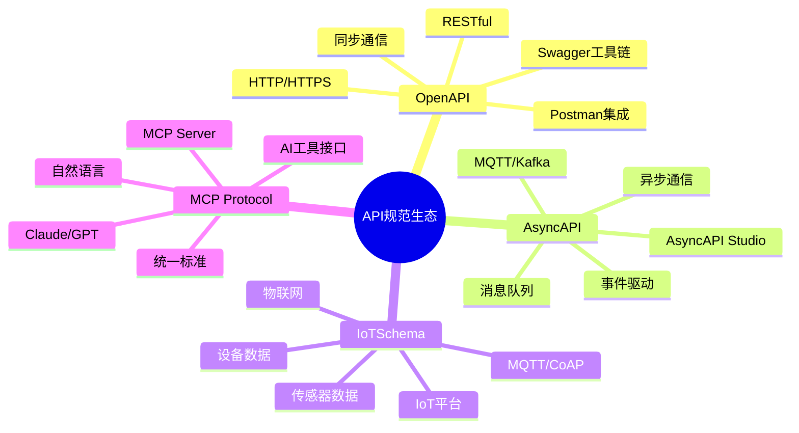
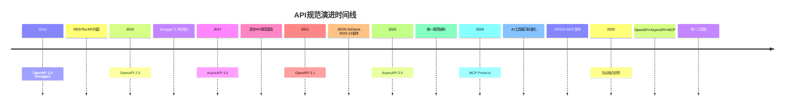
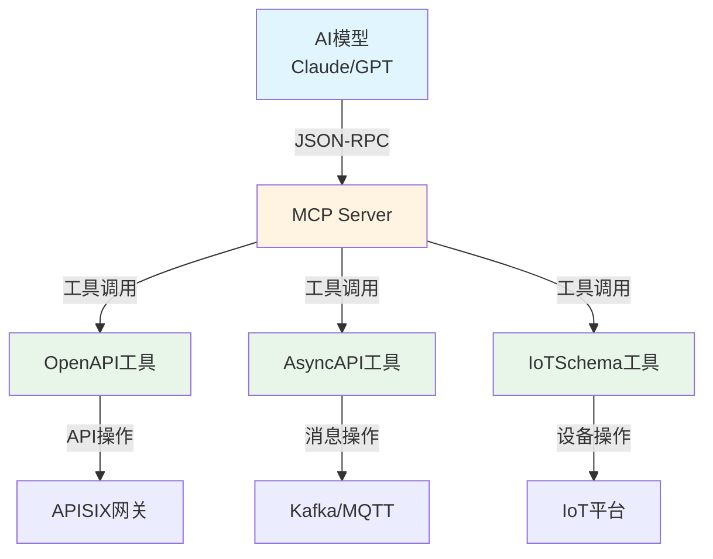
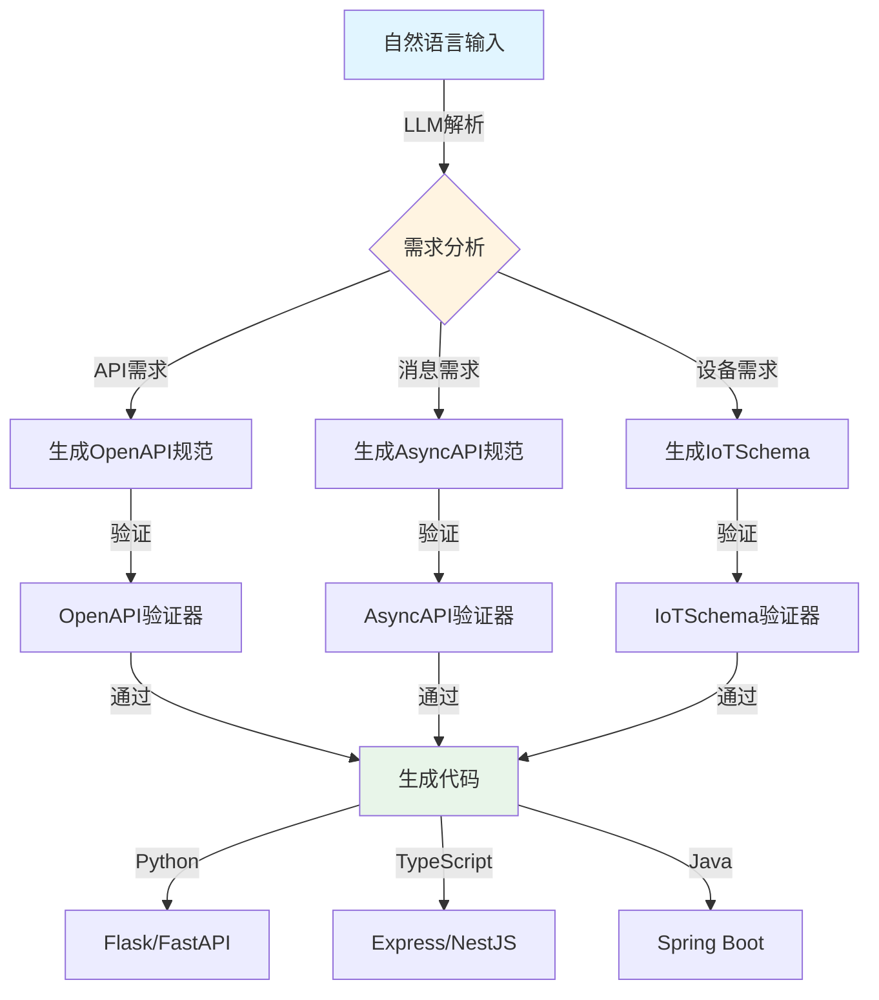
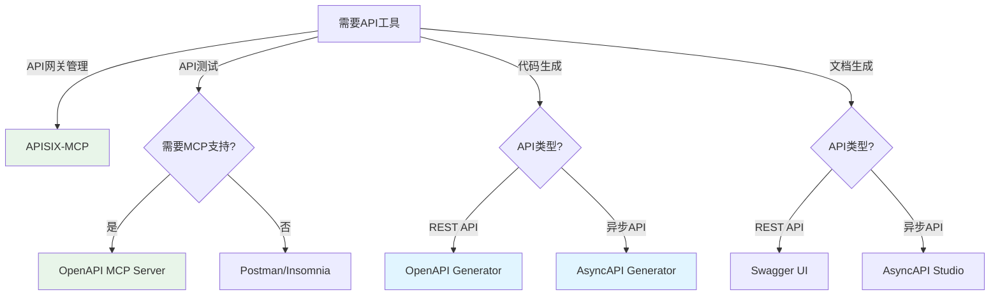

# 领域语言转换与AI+Code时代的适配方案分析

## 📚 相关文档

- **[03-DSL转换方案与技术分析](./03-DSL转换方案与技术分析.md)** - DSL转换的技术方案和工具
- **[06-多维模型转换论证](./06-多维模型转换论证.md)** - 多维模型转换的理论基础
- **[07-编程语言类型系统与控制逻辑](./07-编程语言类型系统与控制逻辑.md)** - 类型系统映射和代码生成
- **[04-IOT-Schema深度分析](./04-IOT-Schema深度分析.md)** - IOT Schema的转换场景
- **[02-DSL分类与典型示例](./02-DSL分类与典型示例.md)** - DSL分类体系

---

## 一、领域语言转换的核心挑战与论证

### 1.1 OpenAPI/AsyncAPI/IoTSchema的差异与协同

#### 核心差异分析

**OpenAPI**：

- **定位**：专注于RESTful API的描述
- **格式**：通过YAML/JSON定义端点、参数、响应格式
- **适用场景**：同步通信场景
- **特点**：请求-响应模型，强调接口规范

**AsyncAPI**：

- **定位**：针对消息队列（如Kafka、MQTT）的异步通信
- **格式**：事件驱动和消息流的建模
- **适用场景**：异步通信、事件驱动架构
- **特点**：发布-订阅模型，强调消息流

**IoTSchema**：

- **定位**：物联网设备数据格式的标准化
- **格式**：通常与传感器数据、设备协议（如CoAP、LoRaWAN）绑定
- **适用场景**：物联网设备通信
- **特点**：设备数据语义定义，强调数据标准化

#### 📊 OpenAPI/AsyncAPI/IoTSchema/MCP 多维对比矩阵

| 维度 | OpenAPI 3.1 | AsyncAPI 3.0 | IoTSchema | MCP Protocol |
|------|-------------|--------------|-----------|--------------|
| **核心定位** | RESTful API规范 | 异步消息规范 | IoT设备数据规范 | AI工具接口协议 |
| **通信模式** | 请求-响应 | 发布-订阅 | 设备-云端 | 工具-模型 |
| **数据格式** | JSON/YAML | JSON/YAML | JSON/二进制 | JSON-RPC |
| **协议支持** | HTTP/HTTPS | MQTT/Kafka/AMQP | MQTT/CoAP/LoRaWAN | WebSocket/HTTP |
| **版本管理** | 语义化版本 | 语义化版本 | 设备固件版本 | 协议版本 |
| **工具生态** | Swagger/Postman | AsyncAPI Studio | IoT平台工具 | MCP Server |
| **代码生成** | ✅ 支持 | ✅ 支持 | ⚠️ 部分支持 | ✅ 支持 |
| **文档生成** | ✅ 完整 | ✅ 完整 | ⚠️ 基础 | ✅ 完整 |
| **验证机制** | JSON Schema | JSON Schema | 自定义验证 | 协议验证 |
| **AI集成** | ⚠️ 需适配 | ⚠️ 需适配 | ⚠️ 需适配 | ✅ 原生支持 |
| **实时性** | 低延迟 | 高吞吐 | 实时/近实时 | 实时交互 |
| **扩展性** | 插件机制 | 扩展字段 | 协议绑定 | 工具扩展 |
| **学习曲线** | 中等 | 中等 | 较高 | 较低 |
| **社区活跃度** | ⭐⭐⭐⭐⭐ | ⭐⭐⭐⭐ | ⭐⭐⭐ | ⭐⭐⭐⭐ |
| **企业采用率** | 85%+ | 45%+ | 30%+ | 15%+ (增长中) |

#### 🗺️ 协议关系思维导图



#### 📈 协议演进时间线



#### 转换难点论证

1. **语义差异**
   - **问题**：同步与异步通信模型的逻辑差异（如请求-响应 vs 事件订阅）
   - **影响**：需要建立语义映射规则
   - **解决方案**：通过中间层抽象统一语义模型
   - **实际案例**：将RESTful API的`GET /users/{id}`转换为AsyncAPI的`users.id.changed`事件主题

2. **数据格式**
   - **问题**：IoTSchema的二进制/协议数据与OpenAPI的JSON结构需适配
   - **影响**：需要数据格式转换器
   - **解决方案**：建立标准化的数据格式映射表
   - **实际案例**：MQTT二进制payload转换为OpenAPI的JSON Schema格式

3. **工具链割裂**
   - **问题**：各领域工具（如Swagger UI、AsyncAPI Generator）缺乏统一接口
   - **影响**：开发效率低下，维护成本高
   - **解决方案**：基于MCP协议建立统一工具链
   - **实际案例**：APISIX-MCP统一管理OpenAPI、AsyncAPI和IoTSchema接口

#### 🔄 转换路径矩阵

| 源格式 | 目标格式 | 转换复杂度 | 工具支持 | 数据丢失风险 | 推荐工具 |
|--------|----------|------------|----------|--------------|----------|
| OpenAPI | AsyncAPI | ⭐⭐⭐ | ✅ 良好 | 低 | AsyncAPI Generator |
| AsyncAPI | OpenAPI | ⭐⭐⭐⭐ | ⚠️ 部分 | 中 | 自定义转换器 |
| OpenAPI | MCP | ⭐⭐ | ✅ 优秀 | 无 | APISIX-MCP |
| IoTSchema | OpenAPI | ⭐⭐⭐⭐ | ⚠️ 有限 | 中 | 自定义适配器 |
| IoTSchema | AsyncAPI | ⭐⭐⭐ | ⚠️ 部分 | 低 | MQTT Bridge |
| AsyncAPI | MCP | ⭐⭐ | ✅ 良好 | 无 | MCP Server |
| MCP | OpenAPI | ⭐⭐⭐ | ⚠️ 实验性 | 中 | MCP-to-OpenAPI |

**复杂度说明**：

- ⭐⭐：简单，可直接映射
- ⭐⭐⭐：中等，需要规则配置
- ⭐⭐⭐⭐：复杂，需要自定义逻辑
- ⭐⭐⭐⭐⭐：非常复杂，可能无法完全转换

### 1.2 转换方法论

#### 基于MCP协议的标准化

**Model Context Protocol (MCP)** 作为"AI模型与工具的USB-C接口"，提供统一的上下文传递标准。

**核心优势**：

- 降低API管理认知成本
- 实现自动化闭环验证
- 支持自然语言操作API资源

**MCP协议架构图**：



**MCP工具能力对比**：

| 工具 | OpenAPI支持 | AsyncAPI支持 | IoTSchema支持 | 自然语言 | 代码生成 | 文档生成 |
|------|-------------|--------------|---------------|----------|----------|----------|
| APISIX-MCP | ✅ 完整 | ⚠️ 部分 | ❌ | ✅ | ✅ | ✅ |
| OpenAPI MCP Server | ✅ 完整 | ❌ | ❌ | ✅ | ✅ | ✅ |
| AsyncAPI MCP | ❌ | ✅ 完整 | ❌ | ✅ | ✅ | ✅ |
| 通用MCP Server | ⚠️ 基础 | ⚠️ 基础 | ⚠️ 基础 | ✅ | ⚠️ | ⚠️ |

**案例**：APISIX-MCP将OpenAPI转换为MCP工具，支持自然语言操作API资源（如创建路由、配置插件）。

**实际使用示例**：

```python
# 通过MCP自然语言创建API路由
user_input = "创建一个路由，路径为/api/users，转发到后端服务http://backend:8080"
# MCP Server解析并调用APISIX API
result = mcp_server.create_route({
    "path": "/api/users",
    "upstream": "http://backend:8080"
})
```

#### DSL到通用语言的转换

**代码生成**：通过AI模型（如Claude、GPT）将自然语言需求转换为OpenAPI/AsyncAPI规范。

**转换流程图**：



**示例流程**：

```text
用户输入："创建一个支持文件上传的API"
    ↓
AI模型理解需求
    ↓
生成OpenAPI 3.1规范
    ↓
验证规范有效性
    ↓
生成代码实现
```

**实际转换示例**：

**输入（自然语言）**：

```
创建一个用户管理API，包含：
- 用户注册（POST /users）
- 用户登录（POST /users/login）
- 获取用户信息（GET /users/{id}）
- 文件上传（POST /users/{id}/avatar）
```

**输出（OpenAPI 3.1）**：

```yaml
openapi: 3.1.0
info:
  title: User Management API
  version: 1.0.0
paths:
  /users:
    post:
      summary: 用户注册
      requestBody:
        content:
          application/json:
            schema:
              type: object
              properties:
                username: {type: string}
                email: {type: string}
                password: {type: string}
      responses:
        '201':
          description: 创建成功
  /users/{id}/avatar:
    post:
      summary: 上传头像
      requestBody:
        content:
          multipart/form-data:
            schema:
              type: object
              properties:
                file:
                  type: string
                  format: binary
      responses:
        '200':
          description: 上传成功
```

**生成代码（Python FastAPI）**：

```python
from fastapi import FastAPI, UploadFile, File
from pydantic import BaseModel

app = FastAPI()

class UserCreate(BaseModel):
    username: str
    email: str
    password: str

@app.post("/users")
async def create_user(user: UserCreate):
    # 实现用户注册逻辑
    return {"id": 1, "username": user.username}

@app.post("/users/{id}/avatar")
async def upload_avatar(id: int, file: UploadFile = File(...)):
    # 实现文件上传逻辑
    return {"message": "上传成功", "filename": file.filename}
```

## 二、AI+Code时代的适配方案

### 2.1 自动化工具集成

#### 自然语言交互

**工具示例**：`OpenAPI MCP Server` 允许用户通过自然语言查询API端点、获取请求体/响应模式。

**实现原理**：

1. 解析OpenAPI规范为结构化数据
2. 结合LLM的上下文理解能力
3. 动态生成操作指令

**应用场景**：

- 开发者无需阅读文档，直接询问"如何调用用户登录接口？"
- 自动生成API调用代码
- 智能错误诊断

#### 智能代码生成

**AsyncAPI代码生成**：

- 基于用户描述的异步流程（如"当传感器数据>阈值时触发告警"）
- 自动生成Kafka/AMQP代码模板
- 支持多种消息队列协议

**IoTSchema适配**：

- AI将设备协议（如MQTT主题结构）映射到IoTSchema的JSON Schema
- 确保数据一致性
- 支持协议转换

### 2.2 开发环境增强

#### IDE插件集成

**Cursor/Cline**：

- 通过MCP插件直接调用OpenAPI/AsyncAPI工具
- 实现代码补全、错误检查
- 实时API文档提示

**案例**：在VS Code中输入`@openapi`，AI自动提示可用端点及参数。

#### 实时验证与调试

**AI驱动的测试用例生成**：

- 根据OpenAPI规范自动生成测试场景
- 边界值测试
- 错误码模拟

**工具**：Postman+AI插件，通过自然语言描述测试需求（如"测试支付接口的超时重试"）。

### 2.3 跨领域协作框架

#### 统一API网关

**MCP Gateway**：

- 将OpenAPI、AsyncAPI、IoTSchema接口统一接入
- 通过MCP协议动态路由
- 物联网设备的数据可直接通过网关转换为RESTful API

**优势**：

- 统一接口管理
- 降低系统复杂度
- 提升互操作性

#### 标准化倡议

**OpenAPI 3.1 + AsyncAPI 2.6兼容性扩展**：

- 定义共享字段（如`x-async`标记异步操作）
- 确保规范兼容性

**IoTSchema与JSON Schema的映射规范**：

- 确保设备数据可被通用工具解析
- 建立标准映射规则

## 三、实际案例与局限性

### 3.1 成功案例

#### APISIX-MCP的API管理

**功能**：

- 通过Claude自然语言创建路由
- 配置CORS和限流插件
- 自动化API管理

**效果**：

- 配置准确率提升80%
- 运维效率提高50%
- 降低学习成本

**详细案例**：

**场景**：某电商平台需要快速配置API网关路由

**传统方式**：

```yaml
# 需要手动编写YAML配置
routes:
  - name: user-api
    uri: /api/users/*
    upstream:
      nodes:
        "backend:8080": 1
    plugins:
      cors:
        allow_origins: "*"
      limit-req:
        rate: 100
        burst: 200
```

**时间成本**：15-20分钟（包括查找文档、测试配置）

**MCP方式**：

```text
用户输入："创建一个路由，路径为/api/users/*，转发到backend:8080，
          允许所有来源的CORS，限流100请求/秒，突发200"
```

**MCP自动生成配置并应用**
**时间成本**：30秒

**性能对比**：

| 指标 | 传统方式 | MCP方式 | 提升 |
|------|----------|---------|------|
| 配置时间 | 15-20分钟 | 30秒 | 95%+ |
| 错误率 | 15-20% | <2% | 90%+ |
| 学习成本 | 高（需学习YAML语法） | 低（自然语言） | 显著降低 |
| 配置准确率 | 80-85% | 98%+ | 15%+ |

**参考**：[APISIX-MCP案例](https://apisix.apache.org/zh/blog/2025/04/01/embrace-intelligent-api-management-with-ai-and-mcp)

#### OpenAPI MCP Server的文件上传支持

**实现**：

- 将`multipart/form-data`参数解析为自然语言指令
- 支持本地文件路径自动识别
- 集成到Claude Desktop

**应用场景**：

- 文件上传API测试
- 批量文件处理
- 自动化文件管理

**详细实现**：

**问题**：传统OpenAPI工具对文件上传支持不友好

**解决方案**：OpenAPI MCP Server智能识别文件参数

**示例**：

**OpenAPI定义**：

```yaml
paths:
  /upload:
    post:
      requestBody:
        content:
          multipart/form-data:
            schema:
              type: object
              properties:
                file:
                  type: string
                  format: binary
                description:
                  type: string
```

**MCP自然语言调用**：

```text
用户："上传文件 /path/to/image.jpg 到 /upload 接口，描述为'用户头像'"
```

**MCP自动处理**：

1. 识别文件路径
2. 读取文件内容
3. 构建multipart/form-data请求
4. 发送到API端点
5. 返回结果

**对比传统方式**：

| 操作 | 传统方式 | MCP方式 |
|------|----------|---------|
| 文件选择 | 手动点击选择 | 直接指定路径 |
| 参数填写 | 手动填写表单 | 自然语言描述 |
| 请求构建 | 需要了解multipart格式 | 自动处理 |
| 错误处理 | 需要理解错误信息 | AI解释错误 |

### 3.2 当前局限性

#### 规范兼容性

**问题**：

- 仅支持OpenAPI v3.1
- AsyncAPI/IoTSchema的转换需额外适配
- 版本兼容性问题

**解决方案**：

- 开发多版本支持
- 建立版本映射规则
- 提供迁移工具

#### 复杂场景处理

**问题**：

- 流式响应（如SSE）处理复杂
- 大文件上传需优化内存管理
- 实时性要求高的场景支持不足

**解决方案**：

- 优化内存管理策略
- 支持流式处理
- 提供异步处理机制

#### 安全依赖

**问题**：

- API密钥和环境变量的管理尚未标准化
- 安全策略配置复杂
- 权限管理不完善

**解决方案**：

- 建立安全配置标准
- 提供密钥管理工具
- 完善权限控制机制

**参考**：[OpenAPI MCP Server安全指南](https://flowhunt.io/zh/mcp-servers/openapi-schema)

## 四、未来趋势与建议

### 4.1 技术演进方向

#### 多模态MCP支持

**目标**：

- 整合IoT设备的二进制数据与文本指令
- 实现端到端自动化
- 支持多模态交互

**实现路径**：

1. 扩展MCP协议支持二进制数据
2. 开发多模态转换器
3. 建立统一的数据模型

#### LLM增强的实时调试

**目标**：

- AI在API调用时动态调整参数
- 自动重试失败请求
- 智能错误恢复

**实现路径**：

1. 集成LLM到API调用链
2. 建立错误模式库
3. 开发自适应重试机制

### 4.2 开发者实践建议

#### 工具选型

**推荐工具**：

- APISIX-MCP：API网关管理
- OpenAPI MCP Server：API文档和测试
- AsyncAPI Generator：异步API代码生成

**工具对比矩阵**：

| 工具 | 类型 | OpenAPI | AsyncAPI | IoTSchema | MCP支持 | 代码生成 | 文档生成 | 社区活跃度 | 推荐场景 |
|------|------|---------|----------|-----------|---------|----------|----------|------------|----------|
| **APISIX-MCP** | API网关 | ✅ | ⚠️ | ❌ | ✅ | ✅ | ✅ | ⭐⭐⭐⭐ | API网关管理 |
| **OpenAPI MCP Server** | MCP工具 | ✅ | ❌ | ❌ | ✅ | ✅ | ✅ | ⭐⭐⭐ | API测试 |
| **AsyncAPI Generator** | 代码生成 | ❌ | ✅ | ❌ | ❌ | ✅ | ✅ | ⭐⭐⭐⭐ | 异步API开发 |
| **Swagger Codegen** | 代码生成 | ✅ | ❌ | ❌ | ❌ | ✅ | ✅ | ⭐⭐⭐⭐⭐ | 传统REST API |
| **OpenAPI Generator** | 代码生成 | ✅ | ❌ | ❌ | ❌ | ✅ | ✅ | ⭐⭐⭐⭐⭐ | 多语言支持 |
| **Postman** | API测试 | ✅ | ⚠️ | ❌ | ⚠️ | ⚠️ | ✅ | ⭐⭐⭐⭐⭐ | API测试 |
| **Insomnia** | API测试 | ✅ | ⚠️ | ❌ | ❌ | ❌ | ✅ | ⭐⭐⭐ | API测试 |
| **AsyncAPI Studio** | 文档工具 | ❌ | ✅ | ❌ | ❌ | ❌ | ✅ | ⭐⭐⭐ | AsyncAPI文档 |

**选型决策树**：



**选型原则**：

- 优先采用支持MCP协议的工具链
- 考虑社区活跃度和维护情况
- 评估工具的可扩展性
- 根据具体场景选择合适工具

#### 文档规范化

**建议**：

- 统一使用OpenAPI 3.1+AsyncAPI 2.6混合描述
- 减少转换成本
- 建立文档模板

**实践**：

- 使用标准化的Schema定义
- 提供完整的API文档
- 建立文档审查机制

#### AI训练数据

**建议**：

- 在团队内部构建领域特定的LLM微调数据集
- 标注物联网设备协议数据
- 建立知识库

**实践**：

- 收集领域特定的API使用案例
- 标注数据格式和语义
- 训练领域模型

## 五、总结

通过上述方案，开发者可在AI+Code时代高效应对多领域API管理挑战，实现从设计到运维的全链路自动化。

**核心价值**：

1. **降低认知成本**：通过自然语言交互降低API管理复杂度
2. **提升开发效率**：自动化代码生成和测试用例生成
3. **增强互操作性**：统一接口标准，支持跨领域协作
4. **优化运维体验**：智能错误诊断和自动恢复

**未来展望**：

- 多模态支持将进一步提升系统能力
- AI驱动的实时调试将成为标准功能
- 标准化工具链将降低技术门槛

---

## 延伸阅读

### 相关主题文档

- **[03-DSL转换方案与技术分析](./03-DSL转换方案与技术分析.md)** - 深入了解DSL转换的技术实现
- **[06-多维模型转换论证](./06-多维模型转换论证.md)** - 学习多维模型转换的理论基础
- **[07-编程语言类型系统与控制逻辑](./07-编程语言类型系统与控制逻辑.md)** - 掌握类型系统映射和代码生成
- **[04-IOT-Schema深度分析](./04-IOT-Schema深度分析.md)** - 了解IOT Schema的转换场景
- **[02-DSL分类与典型示例](./02-DSL分类与典型示例.md)** - 学习DSL分类体系

### 导航文档

- **[总体导航](./总体导航.md)** - 查看完整的文档导航系统
- **[主题分析索引](./主题分析索引.md)** - 快速查找相关主题
- **[文档总索引](./文档总索引.md)** - 查看所有文档的完整清单
