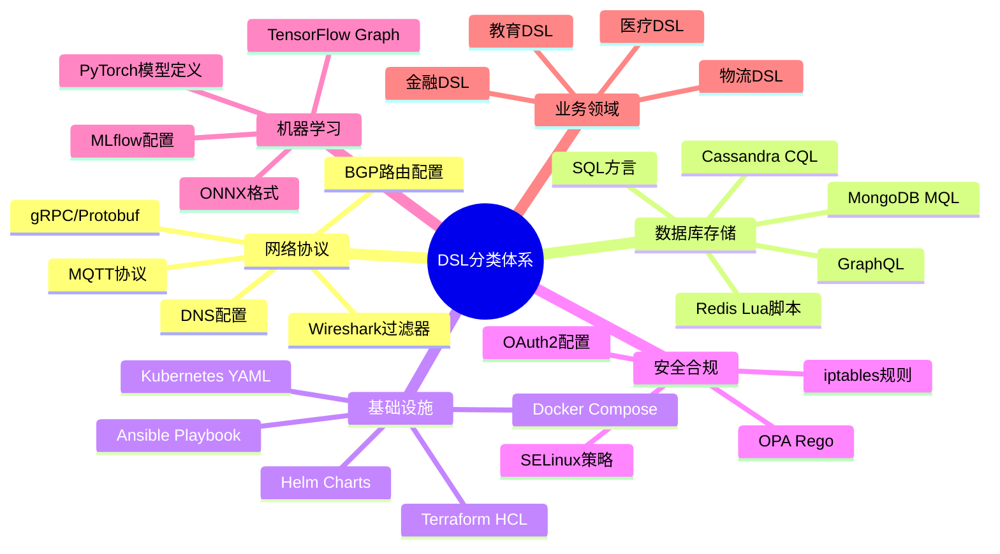
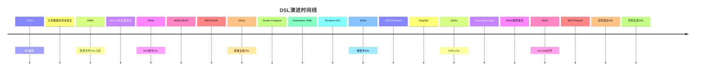
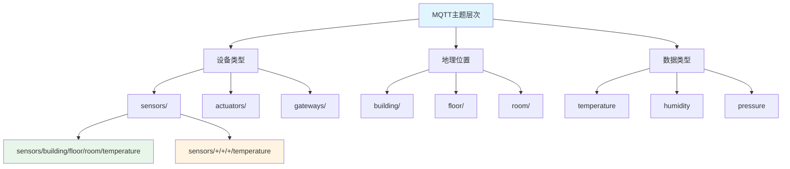
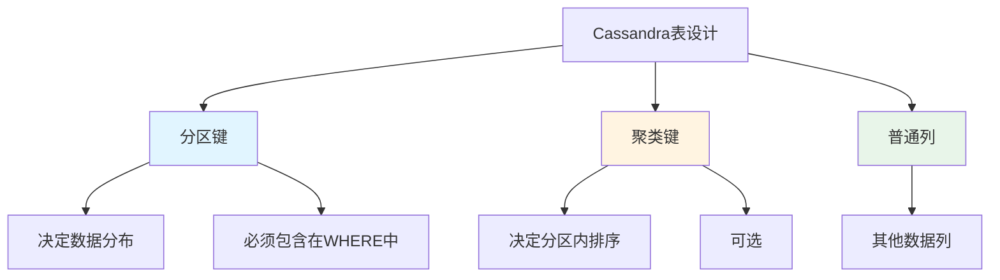
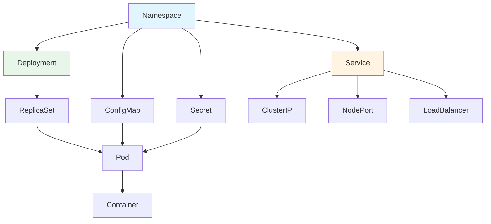

# 领域特定语言（DSL）分类与典型示例

## 📚 相关文档

- **[03-DSL转换方案与技术分析](./03-DSL转换方案与技术分析.md)** - DSL转换的技术方案和工具
- **[05-行业Schema分析与转换](./05-行业Schema分析与转换.md)** - 行业Schema的应用场景
- **[01-领域语言转换与AI时代适配方案](./01-领域语言转换与AI时代适配方案.md)** - AI+Code时代的适配方案
- **[07-编程语言类型系统与控制逻辑](./07-编程语言类型系统与控制逻辑.md)** - 类型系统映射和代码生成

---

## 一、DSL概述

DSL（Domain-Specific Language）是为特定领域设计的编程语言或配置语法，通常比通用语言（如Python/Java）更简洁。DSL的核心特点是：

- **领域聚焦**：针对特定问题域设计
- **语法简洁**：比通用语言更易读易写
- **语义明确**：直接表达领域概念
- **工具支持**：通常有专门的工具链

### 1.1 DSL分类体系

#### 🗺️ DSL分类思维导图



#### 📊 DSL分类对比矩阵

| 分类 | 典型DSL | 语法类型 | 执行方式 | 工具生态 | 学习曲线 | 应用场景 |
|------|---------|----------|----------|----------|----------|----------|
| **网络协议** | BGP, MQTT, gRPC | 声明式/配置式 | 运行时解释 | ⭐⭐⭐⭐ | 中等 | 网络配置、通信协议 |
| **数据库** | SQL, MQL, CQL | 查询式/声明式 | 数据库引擎 | ⭐⭐⭐⭐⭐ | 中等 | 数据查询、存储过程 |
| **基础设施** | Kubernetes, Terraform | 声明式YAML/HCL | 配置管理工具 | ⭐⭐⭐⭐⭐ | 较高 | 云基础设施、容器编排 |
| **安全合规** | iptables, OPA | 规则式/策略式 | 策略引擎 | ⭐⭐⭐ | 高 | 安全策略、合规检查 |
| **机器学习** | TensorFlow, ONNX | 图式/模型定义 | 训练/推理引擎 | ⭐⭐⭐⭐ | 高 | 模型定义、训练配置 |
| **业务领域** | 行业特定DSL | 领域特定 | 业务引擎 | ⭐⭐ | 中等 | 业务流程、规则引擎 |

#### 📈 DSL演进时间线



## 二、网络协议与通信领域

### 2.1 网络协议DSL对比矩阵

| DSL | 协议类型 | 配置方式 | 复杂度 | 应用场景 | 工具支持 | 学习难度 |
|-----|----------|----------|--------|----------|----------|----------|
| **BGP** | 路由协议 | 声明式配置 | ⭐⭐⭐⭐ | 大型网络路由 | Cisco/Juniper | 高 |
| **DNS (BIND)** | 域名解析 | 配置文件 | ⭐⭐⭐ | 域名管理 | BIND/Unbound | 中等 |
| **MQTT** | 消息协议 | 主题订阅 | ⭐⭐ | IoT通信 | Mosquitto/Eclipse | 低 |
| **gRPC/Protobuf** | RPC协议 | IDL定义 | ⭐⭐⭐ | 微服务通信 | gRPC工具链 | 中等 |
| **Wireshark过滤器** | 包分析 | 表达式 | ⭐⭐ | 网络调试 | Wireshark | 低 |

### 2.2 TCP/IP 配置语言

#### BGP（Border Gateway Protocol）

**用途**：用于路由管理的DSL，定义路由策略和网络拓扑。

**示例**：

```text
neighbor 192.168.1.1 remote-as 65000
route-map LOCAL_PREF permit 10
  set local-preference 200
```

**特点**：

- 声明式配置
- 支持路由策略
- 网络拓扑抽象

**实际应用案例**：

**场景**：某大型云服务提供商需要配置多区域BGP路由

**配置示例**：

```text
# 配置AS 65000与AS 65001之间的BGP邻居
router bgp 65000
  neighbor 10.0.0.1 remote-as 65001
  neighbor 10.0.0.1 route-map EXPORT_POLICY out
  neighbor 10.0.0.1 route-map IMPORT_POLICY in

# 路由策略：设置本地优先级
route-map EXPORT_POLICY permit 10
  match ip address prefix-list ALLOWED_PREFIXES
  set local-preference 200
  set community 65000:100

route-map IMPORT_POLICY permit 10
  match community 1
  set local-preference 150
```

**效果**：

- 路由策略清晰可控
- 支持复杂的路由过滤
- 网络拓扑可维护性强

#### DNS 配置（BIND）

**用途**：通过`named.conf`文件定义域名解析规则。

**示例**：

```text
zone "example.com" {
  type master;
  file "example.com.zone";
};
```

**特点**：

- 层次化配置
- 支持多种记录类型
- 安全策略配置

#### Wireshark 过滤器

**用途**：用于抓包分析的DSL。

**示例**：

```text
tcp.port == 80
http.request.method == "GET"
ip.addr == 192.168.1.1
```

**特点**：

- 表达式语法
- 支持复杂过滤条件
- 实时数据过滤

### 2.3 MQTT 协议

**用途**：物联网通信协议的DSL，定义主题（Topic）和QoS等级。

**示例**：

```text
publish "sensors/temperature" with payload {"value": 25}
subscribe "sensors/+/temperature" with QoS 1
```

**特点**：

- 主题层次结构
- QoS等级控制
- 轻量级协议

**MQTT主题设计模式**：



**实际应用案例**：

**场景**：智能楼宇IoT系统，需要管理多个楼层的传感器数据

**主题设计**：

```
sensors/building1/floor2/room101/temperature
sensors/building1/floor2/room101/humidity
sensors/building1/floor2/+/temperature  # 订阅2楼所有房间温度
sensors/building1/+/+/temperature       # 订阅整个楼宇温度
```

**QoS等级选择**：

| QoS等级 | 可靠性 | 性能 | 适用场景 |
|---------|--------|------|----------|
| 0 | 最多一次 | 最高 | 实时数据（可丢失） |
| 1 | 至少一次 | 中等 | 重要数据（可重复） |
| 2 | 恰好一次 | 最低 | 关键数据（不可重复） |

**代码示例**（Python paho-mqtt）：

```python
import paho.mqtt.client as mqtt

def on_connect(client, userdata, flags, rc):
    # 订阅所有楼层的温度数据
    client.subscribe("sensors/building1/+/+/temperature", qos=1)

def on_message(client, userdata, msg):
    topic = msg.topic
    payload = msg.payload.decode()
    # 处理温度数据
    print(f"收到温度数据: {topic} = {payload}")

client = mqtt.Client()
client.on_connect = on_connect
client.on_message = on_message
client.connect("mqtt.broker.com", 1883, 60)
client.loop_forever()
```

### 2.3 gRPC/Protobuf

**用途**：定义服务接口和数据结构的IDL（接口定义语言）。

**示例**：

```proto
service Greeter {
  rpc SayHello (HelloRequest) returns (HelloReply);
}

message HelloRequest {
  string name = 1;
}

message HelloReply {
  string message = 1;
}
```

**特点**：

- 强类型定义
- 跨语言支持
- 高效序列化

## 三、数据库与存储领域

### 3.1 数据库DSL对比矩阵

| DSL | 数据库类型 | 查询方式 | 事务支持 | 分布式 | 性能 | 适用场景 |
|-----|------------|----------|----------|--------|------|----------|
| **SQL** | 关系型 | 声明式 | ✅ ACID | ⚠️ 有限 | ⭐⭐⭐⭐ | 事务性应用 |
| **MongoDB MQL** | 文档型 | 命令式 | ⚠️ 部分 | ✅ 原生 | ⭐⭐⭐⭐ | 灵活数据结构 |
| **Cassandra CQL** | 列存储 | 类SQL | ❌ | ✅ 原生 | ⭐⭐⭐⭐⭐ | 高写入场景 |
| **Redis Lua** | 键值型 | 脚本式 | ✅ 单机 | ❌ | ⭐⭐⭐⭐⭐ | 缓存/队列 |
| **GraphQL** | 查询层 | 声明式 | ⚠️ 依赖后端 | ⚠️ 依赖后端 | ⭐⭐⭐ | API查询 |

### 3.2 SQL 方言

#### PostgreSQL PL/pgSQL

**用途**：存储过程语言，扩展SQL功能。

**示例**：

```sql
CREATE OR REPLACE FUNCTION update_modified_column()
RETURNS TRIGGER AS $$
BEGIN
  NEW.modified = NOW();
  RETURN NEW;
END;
$$ LANGUAGE plpgsql;
```

**特点**：

- 过程式编程
- 触发器支持
- 数据库内逻辑

**实际应用案例**：

**场景**：电商系统需要自动更新订单状态和库存

**存储过程示例**：

```sql
CREATE OR REPLACE FUNCTION process_order(order_id INT)
RETURNS TABLE(order_status TEXT, stock_updated BOOLEAN) AS $$
DECLARE
  product_id INT;
  quantity INT;
BEGIN
  -- 获取订单信息
  SELECT product_id, quantity INTO product_id, quantity
  FROM orders WHERE id = order_id;

  -- 更新库存
  UPDATE products
  SET stock = stock - quantity
  WHERE id = product_id AND stock >= quantity;

  -- 更新订单状态
  UPDATE orders
  SET status = 'processed', modified = NOW()
  WHERE id = order_id;

  RETURN QUERY SELECT 'processed', TRUE;
EXCEPTION
  WHEN OTHERS THEN
    RETURN QUERY SELECT 'failed', FALSE;
END;
$$ LANGUAGE plpgsql;
```

#### MongoDB Query Language (MQL)

**用途**：文档数据库查询DSL。

**示例**：

```javascript
db.users.find({ age: { $gt: 25 } })
db.users.aggregate([
  { $match: { status: "active" } },
  { $group: { _id: "$department", count: { $sum: 1 } } }
])
```

**特点**：

- JSON风格语法
- 支持复杂查询
- 聚合管道

**MongoDB聚合管道可视化**：


**实际应用案例**：

**场景**：分析用户行为数据，统计各地区的活跃用户数

**聚合查询**：

```javascript
db.user_activities.aggregate([
  // 阶段1：匹配活跃用户
  {
    $match: {
      timestamp: { $gte: ISODate("2024-01-01") },
      action: "login"
    }
  },
  // 阶段2：关联用户信息
  {
    $lookup: {
      from: "users",
      localField: "user_id",
      foreignField: "_id",
      as: "user_info"
    }
  },
  // 阶段3：展开用户信息
  {
    $unwind: "$user_info"
  },
  // 阶段4：按地区分组
  {
    $group: {
      _id: "$user_info.region",
      active_users: { $addToSet: "$user_id" },
      total_logins: { $sum: 1 }
    }
  },
  // 阶段5：计算活跃用户数
  {
    $project: {
      region: "$_id",
      active_user_count: { $size: "$active_users" },
      total_logins: 1,
      _id: 0
    }
  },
  // 阶段6：按活跃用户数排序
  {
    $sort: { active_user_count: -1 }
  }
])
```

### 3.3 Cassandra CQL

**用途**：面向列存储的查询语言，语法类似SQL但支持分布式特性。

**示例**：

```sql
CREATE TABLE users (
  user_id UUID PRIMARY KEY,
  name TEXT,
  email TEXT
);

SELECT * FROM users WHERE user_id = ?
```

**特点**：

- 类似SQL语法
- 分布式支持
- 最终一致性

**Cassandra数据模型设计**：



### 3.3 Redis 配置与脚本

**用途**：通过Lua脚本实现原子操作。

**示例**：

```lua
if redis.call("GET", KEYS[1]) == ARGV[1] then
  return redis.call("DEL", KEYS[1])
else
  return 0
end
```

**特点**：

- Lua脚本支持
- 原子操作
- 高性能

## 四、DevOps与基础设施领域

### 4.1 DevOps DSL对比矩阵

| DSL | 工具 | 配置格式 | 声明式/命令式 | 状态管理 | 多云支持 | 学习曲线 | 适用场景 |
|-----|------|----------|---------------|----------|----------|----------|----------|
| **Kubernetes YAML** | k8s | YAML | 声明式 | ✅ 内置 | ✅ | ⭐⭐⭐⭐ | 容器编排 |
| **Terraform HCL** | Terraform | HCL | 声明式 | ✅ 状态文件 | ✅ | ⭐⭐⭐⭐ | 基础设施即代码 |
| **Docker Compose** | Docker | YAML | 声明式 | ❌ | ❌ | ⭐⭐ | 本地开发 |
| **Ansible Playbook** | Ansible | YAML | 命令式 | ⚠️ 幂等性 | ✅ | ⭐⭐⭐ | 配置管理 |
| **Helm Charts** | Helm | YAML | 声明式 | ⚠️ 版本管理 | ✅ | ⭐⭐⭐ | k8s应用部署 |
| **CloudFormation** | AWS | JSON/YAML | 声明式 | ✅ 内置 | ❌ AWS only | ⭐⭐⭐⭐ | AWS资源管理 |

### 4.2 Kubernetes YAML配置

**Kubernetes资源关系图**：



### 4.1 YAML/JSON 配置文件

#### Kubernetes (K8s)

**用途**：通过YAML定义Pod、Service等资源。

**示例**：

```yaml
apiVersion: v1
kind: Pod
metadata:
  name: nginx-pod
spec:
  containers:
  - name: nginx
    image: nginx:latest
    ports:
    - containerPort: 80
```

**特点**：

- 声明式配置
- 资源抽象
- 自动化部署

#### Terraform HCL

**用途**：基础设施即代码的DSL。

**示例**：

```hcl
resource "aws_instance" "example" {
  ami           = "ami-0c55b159cbfafe1f0"
  instance_type = "t2.micro"

  tags = {
    Name = "ExampleInstance"
  }
}
```

**特点**：

- 基础设施抽象
- 状态管理
- 多云支持

### 4.2 Ansible Playbook

**用途**：基于YAML的自动化配置DSL。

**示例**：

```yaml
- name: Install Nginx
  apt:
    name: nginx
    state: present

- name: Start Nginx
  systemd:
    name: nginx
    state: started
```

**特点**：

- 幂等性
- 模块化
- 易于理解

### 4.3 Dockerfile

**用途**：定义容器镜像构建步骤的DSL。

**示例**：

```dockerfile
FROM python:3.9
WORKDIR /app
COPY requirements.txt .
RUN pip install -r requirements.txt
COPY . .
CMD ["python", "app.py"]
```

**特点**：

- 层缓存优化
- 多阶段构建
- 可重复构建

## 五、安全与合规领域

### 5.1 安全DSL对比矩阵

| DSL | 工具 | 配置方式 | 策略类型 | 实时性 | 复杂度 | 适用场景 |
|-----|------|----------|----------|--------|--------|----------|
| **iptables** | Linux防火墙 | 规则链 | 网络规则 | ✅ 实时 | ⭐⭐⭐⭐ | 网络防火墙 |
| **OPA Rego** | Open Policy Agent | 策略语言 | 通用策略 | ✅ 实时 | ⭐⭐⭐⭐ | 策略即代码 |
| **SELinux** | Security-Enhanced Linux | 安全上下文 | 访问控制 | ✅ 实时 | ⭐⭐⭐⭐⭐ | 强制访问控制 |
| **OAuth2** | 认证协议 | 配置/流程 | 授权流程 | ⚠️ 会话级 | ⭐⭐⭐ | 身份认证 |
| **RBAC** | 角色访问控制 | YAML/配置 | 权限模型 | ⚠️ 配置级 | ⭐⭐⭐ | 权限管理 |

### 5.1 防火墙规则语言

#### iptables

**用途**：Linux防火墙配置DSL。

**示例**：

```bash
iptables -A INPUT -p tcp --dport 22 -j ACCEPT
iptables -A INPUT -p tcp --dport 80 -j ACCEPT
iptables -A INPUT -j DROP
```

**特点**：

- 链式规则
- 灵活匹配
- 性能优化

#### AWS Security Groups

**用途**：通过JSON/YAML定义入站/出站规则。

**示例**：

```json
{
  "IpPermissions": [
    {
      "IpProtocol": "tcp",
      "FromPort": 80,
      "ToPort": 80,
      "IpRanges": [{"CidrIp": "0.0.0.0/0"}]
    }
  ]
}
```

**特点**：

- 云原生
- 自动应用
- 可视化配置

### 5.2 OAuth2/OpenID Connect 配置

**用途**：定义身份验证流程的DSL。

**示例**：

```json
{
  "client_id": "abc123",
  "redirect_uri": "https://app.example.com/callback",
  "scope": "openid profile email",
  "response_type": "code"
}
```

**特点**：

- 标准化协议
- 安全认证
- 授权流程

## 六、AI与机器学习领域

### 6.1 AI/ML DSL对比矩阵

| DSL | 框架 | 模型定义 | 执行方式 | 跨平台 | 性能 | 适用场景 |
|-----|------|----------|----------|--------|------|----------|
| **TensorFlow Graph** | TensorFlow | 计算图 | 图执行 | ✅ | ⭐⭐⭐⭐⭐ | 深度学习训练 |
| **PyTorch** | PyTorch | 动态图 | 即时执行 | ✅ | ⭐⭐⭐⭐ | 研究/原型 |
| **ONNX** | 标准格式 | 模型交换 | 推理引擎 | ✅ | ⭐⭐⭐⭐ | 模型部署 |
| **MLflow** | MLflow | 实验跟踪 | 元数据管理 | ✅ | ⭐⭐⭐ | MLOps |
| **Kubeflow Pipelines** | Kubeflow | 工作流 | 容器编排 | ✅ | ⭐⭐⭐⭐ | 机器学习流水线 |

### 6.1 TensorFlow/PyTorch 配置

#### TensorFlow SavedModel CLI

**用途**：定义模型导出格式。

**示例**：

```bash
saved_model_cli show --dir model/1/ --all
```

**特点**：

- 模型版本管理
- 签名定义
- 跨平台支持

#### ONNX 模型描述

**用途**：跨框架模型交换的DSL。

**示例**：

```python
import onnxruntime as ort
session = ort.InferenceSession("model.onnx")
```

**特点**：

- 框架无关
- 标准化格式
- 性能优化

### 6.2 MLflow 实验跟踪

**用途**：通过YAML定义模型训练参数。

**示例**：

```yaml
parameters:
  learning_rate: 0.01
  epochs: 10
  batch_size: 32

metrics:
  accuracy: 0.95
  loss: 0.05
```

**特点**：

- 实验管理
- 参数跟踪
- 模型版本控制

## 七、AI+Code时代的适配方案

### 7.1 自然语言生成DSL

**工具**：GitHub Copilot、Cursor

**场景**：用户输入"创建一个Kubernetes Deployment"，AI生成YAML代码。

**示例**：

```text
User: 配置一个允许HTTP访问的Nginx服务
AI生成:
apiVersion: v1
kind: Service
metadata:
  name: nginx-service
spec:
  ports:
  - port: 80
    targetPort: 80
  selector:
    app: nginx
```

**优势**：

- 降低学习成本
- 提高开发效率
- 减少语法错误

### 7.2 DSL验证与调试

**工具**：

- Kubecfg（K8s YAML验证）
- Terraform Validate
- JSON Schema Validator

**AI集成**：

- 通过LLM自动检测配置错误
- 智能错误提示
- 自动修复建议

**示例**：

```text
Error: missing required field 'spec'
AI Suggestion: Add 'spec' section with 'containers' array
```

### 7.3 跨领域DSL转换

**案例**：将PostgreSQL的SQL查询转换为MongoDB的MQL。

**工具**：AI驱动的转换器（如`sql-to-mongo`）

**示例**：

```sql
-- SQL
SELECT * FROM users WHERE age > 25;
```

转换为：

```javascript
// MongoDB
db.users.find({ age: { $gt: 25 } })
```

**优势**：

- 自动迁移
- 保持语义一致性
- 减少人工错误

## 八、总结

DSL在各领域中扮演关键角色，其设计通常围绕领域核心需求（如网络配置、数据库查询、DevOps自动化）。

### 核心价值

1. **领域聚焦**：针对特定问题域优化
2. **语法简洁**：比通用语言更易读易写
3. **工具支持**：专门的工具链和验证机制
4. **语义明确**：直接表达领域概念

### AI+Code时代的趋势

- **自然语言生成**：通过LLM自动生成配置代码
- **自动化验证**：结合AI实时检测语法/逻辑错误
- **跨领域转换**：利用AI将一种DSL映射到另一种

### 未来展望

DSL与AI的深度融合将进一步降低技术门槛，提升开发效率。未来的DSL将更加智能、易用，并支持更广泛的领域应用。

---

## 延伸阅读

### 相关主题文档

- **[03-DSL转换方案与技术分析](./03-DSL转换方案与技术分析.md)** - 深入了解DSL转换的技术实现
- **[05-行业Schema分析与转换](./05-行业Schema分析与转换.md)** - 了解行业Schema的应用场景
- **[01-领域语言转换与AI时代适配方案](./01-领域语言转换与AI时代适配方案.md)** - 学习AI+Code时代的适配方案
- **[07-编程语言类型系统与控制逻辑](./07-编程语言类型系统与控制逻辑.md)** - 掌握类型系统映射和代码生成

### 导航文档

- **[总体导航](./总体导航.md)** - 查看完整的文档导航系统
- **[主题分析索引](./主题分析索引.md)** - 快速查找相关主题
- **[文档总索引](./文档总索引.md)** - 查看所有文档的完整清单
