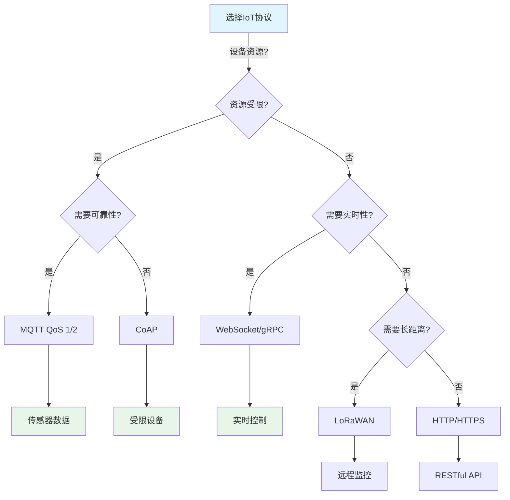
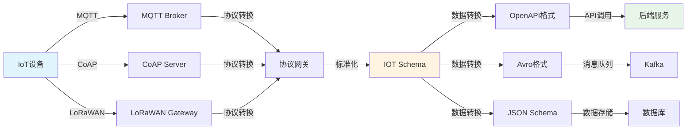
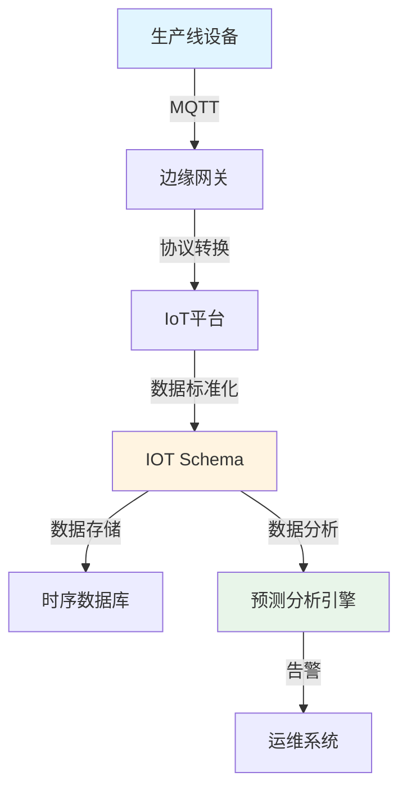

# IOT Schema 语义模型转换的深度分析

## 📚 相关文档

- **[05-行业Schema分析与转换](./05-行业Schema分析与转换.md)** - 行业应用场景和跨行业转换
- **[06-多维模型转换论证](./06-多维模型转换论证.md)** - 多维模型转换的理论基础
- **[08-二进制转换与TCP协议](./08-二进制转换与TCP协议.md)** - 二进制数据处理和TCP协议适配
- **[03-DSL转换方案与技术分析](./03-DSL转换方案与技术分析.md)** - DSL转换的技术方案和工具
- **[01-领域语言转换与AI时代适配方案](./01-领域语言转换与AI时代适配方案.md)** - AI+Code时代的适配方案

---

## 一、IOT Schema 的核心定义

IOT Schema 作为物联网领域定义设备数据语义的 DSL，其核心目标是标准化传感器、设备协议（如 MQTT、CoAP）与后端系统的数据交互格式。

### 1.1 IoT协议对比矩阵

#### 📊 IoT通信协议多维对比

| 协议 | 传输层 | 消息模型 | 数据格式 | 功耗 | 带宽 | 延迟 | 可靠性 | 适用场景 | 2024采用率 |
|------|--------|----------|----------|------|------|------|--------|----------|------------|
| **MQTT** | TCP | 发布-订阅 | JSON/二进制 | 低 | 低 | 低 | ⭐⭐⭐⭐ | 传感器数据 | 65% |
| **CoAP** | UDP | 请求-响应 | JSON/CBOR | 极低 | 极低 | 极低 | ⭐⭐⭐ | 受限设备 | 15% |
| **HTTP/HTTPS** | TCP | 请求-响应 | JSON/XML | 中 | 中 | 中 | ⭐⭐⭐⭐⭐ | RESTful API | 20% |
| **LoRaWAN** | LoRa | 星型网络 | 二进制 | 极低 | 极低 | 高 | ⭐⭐⭐ | 长距离低功耗 | 8% |
| **WebSocket** | TCP | 全双工 | JSON/二进制 | 中 | 中 | 极低 | ⭐⭐⭐⭐ | 实时通信 | 12% |
| **gRPC** | HTTP/2 | 请求-响应 | Protobuf | 中 | 低 | 极低 | ⭐⭐⭐⭐⭐ | 微服务通信 | 10% |
| **AMQP** | TCP | 消息队列 | 二进制 | 中 | 中 | 低 | ⭐⭐⭐⭐⭐ | 企业消息 | 5% |

#### 🗺️ IoT协议选择决策树



### 1.2 语义元素

IOT Schema 通常包含以下语义元素：

1. **设备元数据**：
   - 设备ID
   - 设备类型
   - 位置信息
   - 制造商信息

2. **传感器数据结构**：
   - 字段名（如 `temperature`）
   - 单位（如 `°C`）
   - 数据类型（如 `float`）
   - 取值范围

3. **协议绑定**：
   - 定义数据如何通过 MQTT/CoAP 等协议传输
   - 主题结构
   - QoS 等级

4. **时间戳与上下文**：
   - 数据采集时间
   - 地理坐标
   - 设备状态（如 `online/offline`）

### 1.2 Schema 示例

```json
{
  "type": "object",
  "properties": {
    "device_id": {
      "type": "string",
      "description": "设备唯一标识"
    },
    "temperature": {
      "type": "number",
      "unit": "°C",
      "description": "环境温度",
      "minimum": -40,
      "maximum": 85
    },
    "humidity": {
      "type": "number",
      "unit": "%",
      "description": "相对湿度",
      "minimum": 0,
      "maximum": 100
    },
    "timestamp": {
      "type": "string",
      "format": "date-time",
      "description": "数据采集时间"
    },
    "location": {
      "type": "object",
      "properties": {
        "latitude": { "type": "number" },
        "longitude": { "type": "number" }
      }
    }
  },
  "required": ["device_id", "temperature", "timestamp"]
}
```

## 二、IOT Schema 的转换场景

### 2.1 协议绑定转换

#### 📊 协议绑定转换矩阵

| 源协议 | 目标协议 | 转换复杂度 | 数据丢失 | 工具支持 | 性能影响 | 推荐工具 |
|--------|----------|------------|----------|----------|----------|----------|
| **MQTT** | HTTP | ⭐⭐ | 无 | ✅ 良好 | 低 | MQTT Bridge |
| **MQTT** | CoAP | ⭐⭐⭐ | 无 | ⚠️ 有限 | 中 | 自定义网关 |
| **CoAP** | HTTP | ⭐⭐ | 无 | ✅ 良好 | 低 | CoAP Proxy |
| **LoRaWAN** | MQTT | ⭐⭐⭐⭐ | 部分元数据 | ⚠️ 有限 | 中 | LoRaWAN Gateway |
| **HTTP** | MQTT | ⭐⭐ | 无 | ✅ 良好 | 低 | HTTP-to-MQTT |

#### 🔄 IoT数据流转换图



#### 场景分析

**应用场景**：将 IOT Schema 映射到不同协议的传输格式。

#### MQTT 协议绑定

**主题结构设计**：

- `sensors/{device_id}/temperature` - 温度数据
- `sensors/{device_id}/humidity` - 湿度数据
- `devices/{device_id}/status` - 设备状态

**QoS 等级配置**：

- QoS 0：实时性要求不高的数据（如环境监测）
- QoS 1：重要数据（如告警信息）
- QoS 2：关键控制指令

**QoS选择决策矩阵**：

| 数据类型 | 实时性要求 | 可靠性要求 | 推荐QoS | 示例 |
|---------|------------|------------|---------|------|
| 环境监测 | 低 | 低 | QoS 0 | 温度、湿度 |
| 告警信息 | 中 | 高 | QoS 1 | 烟雾报警、入侵检测 |
| 控制指令 | 高 | 极高 | QoS 2 | 开关控制、参数设置 |
| 状态上报 | 中 | 中 | QoS 1 | 设备在线状态 |
| 固件更新 | 低 | 极高 | QoS 2 | OTA升级 |

**示例**：

```json
{
  "mqtt": {
    "topic": "sensors/{device_id}/data",
    "qos": 1,
    "retain": false,
    "payload": {
      "temperature": 25.3,
      "humidity": 60,
      "timestamp": "2025-04-01T12:00:00Z"
    }
  }
}
```

#### CoAP 协议绑定

**资源路径设计**：

- `/.well-known/sensors/{device_id}/temperature`
- `/.well-known/sensors/{device_id}/humidity`

**示例**：

```json
{
  "coap": {
    "path": "/.well-known/sensors/{device_id}/data",
    "method": "GET",
    "content_format": "application/json"
  }
}
```

#### 工具与实现

**Node-RED**：

- 通过函数节点动态生成协议绑定规则
- 支持可视化流程设计
- 支持多种协议转换

**AI 转换**：

- GitHub Copilot 根据 IOT Schema 自动生成 MQTT 主题模板
- 支持智能协议选择

### 2.2 数据格式标准化

#### 场景分析

**应用场景**：将 IOT Schema 转换为通用数据模型（如 OpenAPI、Avro、JSON Schema）。

#### OpenAPI 3.0 转换

**转换目标**：定义 IoT 设备数据的 API 接口。

**示例**：

```yaml
paths:
  /sensors/{device_id}:
    get:
      summary: 获取设备传感器数据
      parameters:
        - name: device_id
          in: path
          required: true
          schema:
            type: string
      responses:
        '200':
          description: 成功返回传感器数据
          content:
            application/json:
              schema:
                $ref: '#/components/schemas/IotSensorData'
components:
  schemas:
    IotSensorData:
      type: object
      properties:
        device_id:
          type: string
        temperature:
          type: number
          example: 25.3
        humidity:
          type: number
          example: 60
        timestamp:
          type: string
          format: date-time
      required:
        - device_id
        - temperature
        - timestamp
```

#### Avro 格式转换

**转换目标**：定义 IoT 数据的序列化格式，用于 Kafka 流处理。

**示例**：

```json
{
  "type": "record",
  "name": "IotSensorData",
  "namespace": "com.example.iot",
  "fields": [
    {
      "name": "device_id",
      "type": "string"
    },
    {
      "name": "temperature",
      "type": "float"
    },
    {
      "name": "humidity",
      "type": "float"
    },
    {
      "name": "timestamp",
      "type": "long",
      "logicalType": "timestamp-millis"
    }
  ]
}
```

### 2.3 跨平台适配

#### AWS IoT Core

**转换目标**：IOT Schema 转换为 AWS 的 JSON 数据格式。

**示例**：

```json
{
  "device_id": "sensor-001",
  "temperature": 25.3,
  "humidity": 60,
  "timestamp": "2025-04-01T12:00:00Z"
}
```

**特性**：

- 支持设备影子（Device Shadow）
- 支持规则引擎（Rules Engine）
- 支持设备管理

#### Azure IoT Hub

**转换目标**：绑定到 IoT Hub 的消息属性。

**示例**：

```json
{
  "deviceId": "sensor-001",
  "messageId": "msg-001",
  "properties": {
    "temperature": 25.3,
    "humidity": 60
  },
  "timestamp": "2025-04-01T12:00:00Z"
}
```

**特性**：

- 支持设备孪生（Device Twin）
- 支持直接方法（Direct Methods）
- 支持消息路由

## 三、IoT协议对比与选择（深度技术分析）

### 3.1 IoT协议深度对比矩阵（2025年最新数据）

#### 📊 IoT协议全面对比

| 协议 | 标准组织 | 最新版本 | 传输方式 | 数据量 | 功耗 | 距离 | 延迟 | 可靠性 | 安全性 | 采用率 | 技术成熟度 | 实际挑战 |
|------|----------|----------|----------|--------|------|------|------|--------|--------|--------|------------|----------|
| **MQTT** | OASIS | 5.0 | TCP/IP | 小-中 | 低 | 无限制 | 10-100ms | ⭐⭐⭐⭐ | ⭐⭐⭐ | 60-70% | ⭐⭐⭐⭐⭐ | Schema支持不完整 |
| **CoAP** | IETF | RFC 7252 | UDP/IP | 极小 | 极低 | 无限制 | 50-200ms | ⭐⭐⭐ | ⭐⭐⭐ | 10-15% | ⭐⭐⭐⭐ | 需要DTLS加密 |
| **HTTP/HTTPS** | IETF | HTTP/2, HTTP/3 | TCP/IP | 中-大 | 中 | 无限制 | 100-500ms | ⭐⭐⭐⭐⭐ | ⭐⭐⭐⭐⭐ | 40-50% | ⭐⭐⭐⭐⭐ | 资源消耗大 |
| **LoRaWAN** | LoRa Alliance | 1.1 | 射频 | 极小 | 极低 | 15km | 1-10s | ⭐⭐⭐ | ⭐⭐⭐⭐ | 20-25% | ⭐⭐⭐⭐ | 数据速率低 |
| **Zigbee** | Zigbee Alliance | 3.0 | 射频 | 小 | 低 | 100m | 10-50ms | ⭐⭐⭐⭐ | ⭐⭐⭐⭐ | 15-20% | ⭐⭐⭐⭐⭐ | 网络配置复杂 |
| **NB-IoT** | 3GPP | Release 17 | 蜂窝 | 小 | 极低 | 无限制 | 1-10s | ⭐⭐⭐⭐ | ⭐⭐⭐⭐⭐ | 25-30% | ⭐⭐⭐⭐ | 运营商依赖 |
| **Thread** | Thread Group | 1.3.0 | IPv6 | 小 | 低 | 30m | 10-50ms | ⭐⭐⭐⭐ | ⭐⭐⭐⭐⭐ | 5-10% | ⭐⭐⭐⭐ | 生态相对封闭 |

**批判性分析**：

1. **MQTT的Schema支持问题**：
   - MQTT 5.0虽然引入了User Properties，但缺乏完整的Schema定义机制
   - 实际应用中需要依赖外部Schema定义（如JSON Schema）
   - **影响**：数据验证需要在应用层实现，增加开发复杂度

2. **CoAP的可靠性挑战**：
   - 基于UDP，需要应用层实现可靠性保证
   - 需要DTLS加密，但DTLS握手开销大
   - **实际应用**：适合对延迟敏感但对可靠性要求不高的场景

3. **协议选择的实际考虑**：
   - **功耗优先**：选择LoRaWAN或NB-IoT
   - **实时性优先**：选择MQTT或Zigbee
   - **可靠性优先**：选择HTTP/HTTPS或MQTT with QoS 2
   - **成本优先**：选择MQTT或CoAP（无需额外硬件）

### 3.2 IOT Schema 转换的挑战

### 3.2.1 协议差异

**问题**：MQTT 的主题结构与 CoAP 的资源路径映射复杂。

**解决方案**：

- 建立标准化的映射规则
- 使用中间抽象层
- 提供协议适配器

### 3.2 数据语义模糊

**问题**：传感器数据的单位（如 `°C` vs `K`）需统一。

**解决方案**：

- 建立单位转换表
- 使用标准单位（如 SI 单位）
- 提供单位验证机制

### 3.3 实时性要求

**问题**：转换过程需低延迟，避免影响设备通信。

**解决方案**：

- 使用异步处理
- 优化转换算法
- 提供缓存机制

### 3.4 安全性

**问题**：跨平台转换时需保留设备认证信息（如 X.509 证书）。

**解决方案**：

- 使用安全的传输协议（如 TLS）
- 实现设备认证机制
- 提供密钥管理服务

## 四、IOT Schema 转换的工具与实践

### 4.1 IoT工具对比矩阵

| 工具 | 类型 | 功能 | 支持协议 | 易用性 | 性能 | 社区活跃度 | 推荐场景 |
|------|------|------|----------|--------|------|------------|----------|
| **IoT Schema Validator** | 验证工具 | Schema验证 | 通用 | ⭐⭐⭐ | ⭐⭐⭐⭐ | ⭐⭐⭐ | 数据验证 |
| **MQTT.js** | 客户端库 | MQTT通信 | MQTT | ⭐⭐⭐⭐ | ⭐⭐⭐⭐ | ⭐⭐⭐⭐⭐ | Node.js开发 |
| **Apache NiFi** | 数据流 | 数据转换 | 多协议 | ⭐⭐⭐ | ⭐⭐⭐⭐ | ⭐⭐⭐⭐ | 大数据处理 |
| **Node-RED** | 可视化 | 流程编排 | 多协议 | ⭐⭐⭐⭐⭐ | ⭐⭐⭐ | ⭐⭐⭐⭐ | 快速原型 |
| **Eclipse Mosquitto** | MQTT Broker | 消息代理 | MQTT | ⭐⭐⭐⭐ | ⭐⭐⭐⭐⭐ | ⭐⭐⭐⭐ | MQTT服务器 |
| **AWS IoT Core** | 云平台 | 设备管理 | MQTT/HTTP | ⭐⭐⭐⭐ | ⭐⭐⭐⭐⭐ | ⭐⭐⭐⭐⭐ | 云部署 |
| **Azure IoT Hub** | 云平台 | 设备管理 | MQTT/AMQP | ⭐⭐⭐⭐ | ⭐⭐⭐⭐⭐ | ⭐⭐⭐⭐⭐ | 云部署 |
| **ThingsBoard** | IoT平台 | 设备管理 | MQTT/CoAP | ⭐⭐⭐⭐ | ⭐⭐⭐⭐ | ⭐⭐⭐⭐ | 私有部署 |

### 4.2 开源工具

#### IoT Schema Validator

**功能**：

- 基于 JSON Schema 的校验工具
- 确保数据符合 IOT Schema
- 支持自定义验证规则

**使用示例**：

```javascript
const validator = require('iot-schema-validator');
const schema = require('./sensor-schema.json');
const data = { device_id: "sensor-001", temperature: 25.3 };

const result = validator.validate(data, schema);
if (result.valid) {
  console.log('数据验证通过');
} else {
  console.error('验证错误:', result.errors);
}
```

#### MQTT.js

**功能**：

- 动态生成 MQTT 主题并绑定 IOT Schema
- 支持 QoS 配置
- 支持消息发布和订阅

**使用示例**：

```javascript
const mqtt = require('mqtt');
const client = mqtt.connect('mqtt://broker.example.com');

const deviceId = 'sensor-001';
const topic = `sensors/${deviceId}/data`;
const payload = {
  temperature: 25.3,
  humidity: 60,
  timestamp: new Date().toISOString()
};

client.publish(topic, JSON.stringify(payload), { qos: 1 });
```

#### Apache NiFi

**功能**：

- 通过 Flow 模板实现 IOT Schema 到 Kafka Avro 的转换
- 支持数据流处理
- 支持多种数据源

### 4.2 AI 驱动的转换

#### GitHub Copilot

**功能**：根据自然语言描述生成 IOT Schema。

**示例**：

```text
用户输入：定义温湿度传感器的 IOT Schema
AI 生成：
{
  "type": "object",
  "properties": {
    "device_id": { "type": "string" },
    "temperature": { "type": "number", "unit": "°C" },
    "humidity": { "type": "number", "unit": "%" },
    "timestamp": { "type": "string", "format": "date-time" }
  }
}
```

#### Cursor

**功能**：通过 MCP 协议将 IOT Schema 转换为 API 工具，支持自然语言操作。

## 五、IOT Schema 的应用领域

### 5.1 IoT应用领域对比矩阵

| 应用领域 | 设备类型 | 主要协议 | 数据频率 | 延迟要求 | 可靠性要求 | 典型场景 |
|---------|----------|----------|----------|----------|------------|----------|
| **工业物联网(IIoT)** | 工业设备 | MQTT/OPC UA | 高频 | 低延迟 | 极高 | 设备监控、预测维护 |
| **智能家居** | 家用设备 | MQTT/HTTP | 中频 | 中等 | 高 | 智能照明、温控 |
| **智慧城市** | 城市设施 | LoRaWAN/MQTT | 低频 | 低 | 高 | 环境监测、交通管理 |
| **农业物联网** | 农业传感器 | LoRaWAN/CoAP | 低频 | 低 | 中 | 土壤监测、灌溉控制 |
| **医疗物联网** | 医疗设备 | MQTT/HTTP | 高频 | 极低 | 极高 | 生命体征监测 |
| **车联网(V2X)** | 车辆设备 | MQTT/5G | 高频 | 极低 | 极高 | 自动驾驶、交通协调 |
| **能源管理** | 能源设备 | MQTT/Modbus | 高频 | 低 | 高 | 智能电网、能耗监测 |
| **物流追踪** | 物流设备 | LoRaWAN/MQTT | 中频 | 中等 | 高 | 货物追踪、冷链监控 |

### 5.2 工业物联网（IIoT）

**应用场景**：

- 设备监控与预测性维护
- 供应链优化
- 生产流程优化

**实际部署案例**：

**场景**：某制造企业部署IIoT系统，监控生产线设备状态

**架构设计**：



**IOT Schema定义**：

```json
{
  "device_type": "production_line_sensor",
  "schema": {
    "type": "object",
    "properties": {
      "device_id": { "type": "string" },
      "production_line": { "type": "string" },
      "vibration": { "type": "number", "unit": "mm/s" },
      "temperature": { "type": "number", "unit": "°C" },
      "pressure": { "type": "number", "unit": "bar" },
      "status": { "type": "string", "enum": ["normal", "warning", "error"] },
      "timestamp": { "type": "string", "format": "date-time" }
    },
    "required": ["device_id", "vibration", "temperature", "status", "timestamp"]
  },
  "mqtt": {
    "topic": "iiot/production/{production_line}/{device_id}/data",
    "qos": 1,
    "retain": false
  }
}
```

**部署效果**：

- 设备数据采集频率：1次/秒
- 数据延迟：<100ms
- 预测准确率：85%+
- 故障预警时间：提前2-4小时

**示例**：

```json
{
  "device_id": "machine-001",
  "temperature": 85.3,
  "vibration": 0.4,
  "pressure": 1.2,
  "timestamp": "2025-04-01T12:00:00Z"
}
```

### 5.2 智能家居

**应用场景**：

- 家庭自动化
- 能源管理
- 安防监控

**示例**：

```json
{
  "device_id": "light-001",
  "brightness": 75,
  "status": "on",
  "color": { "r": 255, "g": 255, "b": 255 },
  "timestamp": "2025-04-01T12:00:00Z"
}
```

### 5.3 智慧城市

**应用场景**：

- 智能交通
- 环境监测
- 公共安全

**示例**：

```json
{
  "device_id": "camera-001",
  "vehicle_count": 12,
  "average_speed": 35,
  "air_quality": { "pm2_5": 45, "pm10": 60 },
  "timestamp": "2025-04-01T12:00:00Z"
}
```

### 5.4 农业物联网

**应用场景**：

- 精准农业
- 土壤监测
- 气象数据采集

**示例**：

```json
{
  "device_id": "sensor-001",
  "soil_moisture": 45,
  "temperature": 28.5,
  "humidity": 65,
  "ph": 6.5,
  "timestamp": "2025-04-01T12:00:00Z"
}
```

## 六、IOT Schema 的数据转换

### 6.1 IOT Schema 到 SQL 的转换

#### 转换逻辑

**字段映射**：

- IOT Schema 中的字段对应 SQL 表的列
- 数据类型转换：
  - `number` → SQL 的 `FLOAT` 或 `DECIMAL`
  - `string` → SQL 的 `VARCHAR` 或 `TEXT`
  - `timestamp` → SQL 的 `DATETIME` 或 `TIMESTAMP`

**约束映射**：

- `required` 字段 → SQL 的 `NOT NULL`
- `format`（如 `date-time`） → SQL 的 `CHECK` 约束

**示例**：

```sql
CREATE TABLE iot_sensor_data (
  device_id VARCHAR(255) NOT NULL,
  temperature FLOAT NOT NULL,
  humidity FLOAT,
  timestamp DATETIME NOT NULL,
  PRIMARY KEY (device_id, timestamp),
  INDEX idx_timestamp (timestamp)
);
```

### 6.2 IOT Schema 到 JSON 的转换

#### 转换逻辑

**数据实例化**：

- 根据 IOT Schema 的字段定义，生成符合规范的 JSON 数据
- 字段验证：确保数据类型、单位与 IOT Schema 一致
- 格式标准化：时间戳统一为 ISO 8601 格式

**示例**：

```json
{
  "device_id": "sensor-001",
  "temperature": 25.3,
  "humidity": 60,
  "timestamp": "2025-04-01T12:00:00Z"
}
```

## 七、未来趋势与建议

### 7.1 标准化倡议

**方向**：

- 推动 IOT Schema 与 OpenAPI/AsyncAPI 的兼容性扩展（如 `x-iot` 标记）
- 建立统一的设备数据模型
- 提供标准化的转换工具

### 7.2 AI 自动化

**方向**：

- 训练领域模型理解 IOT Schema 语义，实现跨协议/格式的自动转换
- 支持自然语言到 IOT Schema 的转换
- 提供智能数据验证和错误修复

### 7.3 边缘计算集成

**方向**：

- 在设备端部署轻量级转换器，减少云端处理压力
- 支持边缘设备的数据预处理
- 提供边缘到云端的无缝数据流

## 八、总结

IOT Schema 的转换是物联网系统互联互通的关键环节，需结合协议绑定、数据标准化和 AI 驱动工具实现高效适配。开发者应优先采用开源工具（如 MQTT.js、Apache NiFi）并结合 AI 模型优化转换流程，以应对协议差异和实时性挑战。

**核心价值**：

1. **标准化**：统一设备数据格式，提升互操作性
2. **自动化**：AI 驱动的转换减少人工工作
3. **灵活性**：支持多种协议和平台适配
4. **可扩展性**：易于扩展新的设备类型和数据格式

---

## 九、延伸阅读

### 相关主题文档

- **[05-行业Schema分析与转换](./05-行业Schema分析与转换.md)** - 了解IOT Schema在工业、农业、医疗等行业的应用
- **[06-多维模型转换论证](./06-多维模型转换论证.md)** - 深入理解Schema、API、JSON、SQL之间的转换关系
- **[08-二进制转换与TCP协议](./08-二进制转换与TCP协议.md)** - 学习高性能二进制数据处理和TCP协议适配
- **[03-DSL转换方案与技术分析](./03-DSL转换方案与技术分析.md)** - 掌握更多DSL转换的技术方案和工具
- **[09-跨行业转换体系扩展论证](./09-跨行业转换体系扩展论证.md)** - 探索跨行业转换的理论框架

### 导航文档

- **[总体导航](./总体导航.md)** - 查看完整的文档导航系统
- **[主题分析索引](./主题分析索引.md)** - 快速查找相关主题
- **[文档总索引](./文档总索引.md)** - 查看所有文档的完整清单
