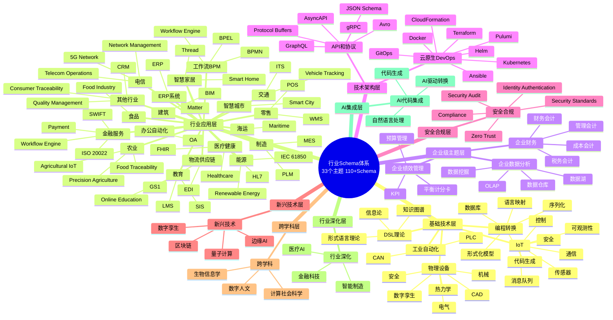
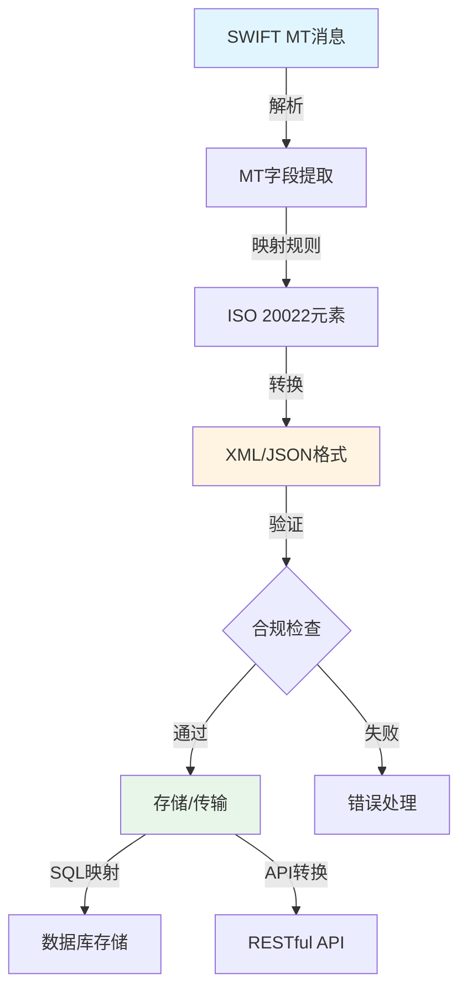
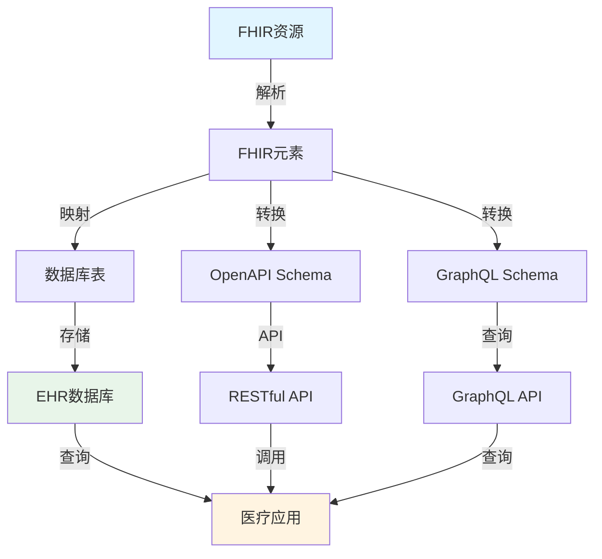
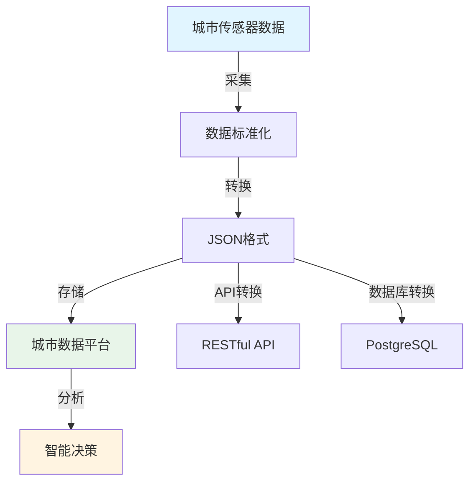
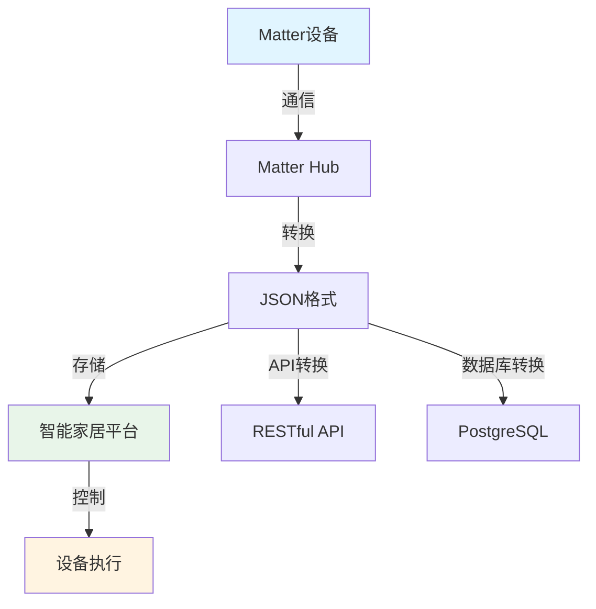

# 其他行业领域的 Schema 分析与论证

## 📚 相关文档

- **[04-IOT-Schema深度分析](./04-IOT-Schema深度分析.md)** - IOT Schema的转换场景
- **[09-跨行业转换体系扩展论证](./09-跨行业转换体系扩展论证.md)** - 跨行业转换的理论框架
- **[06-多维模型转换论证](./06-多维模型转换论证.md)** - 多维模型转换的理论基础
- **[03-DSL转换方案与技术分析](./03-DSL转换方案与技术分析.md)** - DSL转换的技术方案
- **[17-Schema深化模块指南](../../practices/17_Schema_Deepening_Module_Guide.md)** ⭐新增 - Schema深化模块实践指南（Smart Home、OA、Maritime、Food Industry实现）

---

## 一、概述

在软件工程和数据科学中，除了 IOT Schema，许多行业都有其领域特定的 **Schema**（数据模型或规范），用于标准化数据交换、系统集成和业务流程。本文档分析多个行业的 Schema 及其转换场景。

### 1.1 行业Schema全景覆盖体系

本文档全面覆盖**33个主题领域**，涵盖**110+个Schema**的深度分析与转换方案，包括：

#### 📊 行业分类体系

**基础技术层（5个主题）**：

- 01_Industrial_Automation（工业自动化）：PLC、CAN
- 02_IoT_Schema（物联网）：传感器、通信、控制、安全、消息队列、可观测性
- 03_Physical_Device（物理设备）：电气、机械、安全、数字孪生、CAD、热力学
- 04_Programming_Conversion（编程转换）：形式化模型、语言映射、代码生成、数据库、序列化
- 05_DSL_Theory（DSL理论）：信息论、形式语言理论、知识图谱

**行业应用层（19个主题）**：

- 06_Financial_Services（金融服务）：SWIFT、ISO 20022、Payment、Workflow Engine
- 07_Logistics_Supply_Chain（物流供应链）：GS1、EDI
- 08_Smart_City（智慧城市）：Smart City Schema
- 08_Maritime_Shipping（海运）：Maritime Schema
- 10_Healthcare（医疗健康）：FHIR、Healthcare、HL7
- 11_Food_Industry（食品行业）：Food Industry Schema
- 12_Smart_Home（智慧家居）：Matter、Smart Home、Thread
- 13_OA_Office_Automation（办公自动化）：OA Schema
- 14_Workflow_BPM（工作流BPM）：BPMN、BPEL、Workflow Engine
- 15_ERP_Systems（ERP系统）：ERP Schema
- 16_Energy_Industry（能源行业）：IEC 61850、Renewable Energy
- 17_Manufacturing（制造业）：MES、PLM
- 18_Retail_Industry（零售行业）：POS、WMS
- 19_Transportation（交通运输）：ITS、Vehicle Tracking
- 20_Building_Construction（建筑建造）：BIM
- 21_Education（教育行业）：LMS、Online Education、SIS
- 22_Agriculture（农业）：Agricultural IoT、Food Traceability、Precision Agriculture
- 23_Telecommunications（电信通信）：5G Network、Telecom Operations、Network Management
- 24_Other_Industries（其他行业）：CRM、Quality Management、Consumer Traceability

**企业级主题层（3个主题）**：

- 26_Enterprise_Finance（企业财务）：财务会计、管理会计、成本会计、税务会计等
- 27_Enterprise_Data_Analytics（企业数据分析）：数据仓库、数据湖、OLAP、数据挖掘等
- 28_Enterprise_Performance_Management（企业绩效管理）：KPI、平衡计分卡、预算管理等

**技术架构层（2个主题）**：

- 29_API_Protocol_Schemas（API和协议）：GraphQL、gRPC、Protocol Buffers、Avro、JSON Schema、AsyncAPI
- 30_Cloud_Native_DevOps（云原生DevOps）：Kubernetes、Docker、Helm、Terraform、Pulumi、CloudFormation、Ansible、GitOps

**安全合规层（1个主题）**：

- 32_Security_Compliance（安全合规）：Security Standards、Compliance、Zero Trust、Identity Authentication、Security Audit

**新兴技术层（1个主题）**：

- 31_Emerging_Technologies（新兴技术）：Quantum Computing、Edge AI、Digital Twin、Blockchain

**跨学科层（1个主题）**：

- 32_Cross_Disciplinary（跨学科）：Bioinformatics、Computational Social Science、Digital Humanities

**行业深化层（1个主题）**：

- 33_Industry_Deepening（行业深化）：FinTech、Medical AI、Smart Manufacturing

**AI集成层（1个主题）**：

- 25_AI_Code_Integration（AI代码集成）：AI驱动的Schema转换、代码生成、自然语言处理等

#### 🗺️ 行业Schema关系思维导图（33个主题全覆盖）



## 二、金融行业

### 2.1 金融Schema转换矩阵

| 转换方向 | 源格式 | 目标格式 | 转换复杂度 | 工具支持 | 数据完整性 | 推荐工具 |
|---------|--------|----------|------------|----------|------------|----------|
| **SWIFT MT → ISO 20022** | MT格式 | XML/JSON | ⭐⭐⭐⭐ | ✅ 良好 | 高 | SWIFT Alliance |
| **ISO 20022 → SQL** | XML/JSON | SQL DDL | ⭐⭐⭐ | ✅ 良好 | 高 | 自定义转换器 |
| **FIDC → OpenAPI** | FIDC Schema | OpenAPI | ⭐⭐⭐ | ⚠️ 有限 | 中 | 手动转换 |
| **SWIFT → JSON Schema** | MT格式 | JSON Schema | ⭐⭐⭐⭐ | ⚠️ 有限 | 中 | 自定义工具 |

### 2.2 SWIFT Schema

#### 应用领域

- 跨境支付
- 金融交易
- 银行间通信

#### 典型 Schema

- **SWIFT MT 系列**（如 MT103 用于支付指令）
- **ISO 20022**（现代替代标准，基于 XML/JSON）

#### 🔄 SWIFT转换流程图



#### 转换场景

**SWIFT MT → JSON/XML**：

- 将传统 MT 格式转换为现代数据格式，便于系统集成
- 支持实时交易处理
- 提升数据可读性

**实际转换示例**：

**输入（SWIFT MT103）**：

```text
:20:SENDERREF123
:23B:CRED
:32A:240101USD100000,
:50K:/1234567890
JOHN DOE
123 MAIN ST
:59:/9876543210
JANE SMITH
456 OAK AVE
:70:PAYMENT FOR INVOICE 12345
:71A:SHA
```

**输出（ISO 20022 JSON）**：

```json
{
  "Document": {
    "CstmrCdtTrfInitn": {
      "GrpHdr": {
        "MsgId": "SENDERREF123",
        "CreDtTm": "2024-01-01T12:00:00Z"
      },
      "PmtInf": {
        "PmtMtd": "TRF",
        "PmtTpInf": {
          "SvcLvl": {
            "Cd": "CRED"
          }
        },
        "Amt": {
          "InstdAmt": {
            "Ccy": "USD",
            "Value": "100000.00"
          }
        },
        "Dbtr": {
          "Nm": "JOHN DOE",
          "PstlAdr": {
            "StrtNm": "123 MAIN ST"
          }
        },
        "Cdtr": {
          "Nm": "JANE SMITH",
          "PstlAdr": {
            "StrtNm": "456 OAK AVE"
          }
        },
        "RmtInf": {
          "Ustrd": "PAYMENT FOR INVOICE 12345"
        }
      }
    }
  }
}
```

**ISO 20022 → SQL**：

- 将 XML/JSON 数据映射到关系型数据库（如 PostgreSQL）
- 支持交易历史查询
- 便于合规审计

**SQL Schema设计**：

```sql
CREATE TABLE payment_transactions (
    id SERIAL PRIMARY KEY,
    msg_id VARCHAR(50) UNIQUE,
    transaction_date TIMESTAMP,
    currency VARCHAR(3),
    amount DECIMAL(15,2),
    debtor_name VARCHAR(200),
    creditor_name VARCHAR(200),
    remittance_info TEXT,
    created_at TIMESTAMP DEFAULT NOW()
);

CREATE INDEX idx_msg_id ON payment_transactions(msg_id);
CREATE INDEX idx_transaction_date ON payment_transactions(transaction_date);
```

#### 工具

- **SWIFT Alliance**：提供 MT 到 ISO 20022 的转换工具
- **AI 驱动**：GitHub Copilot 可根据 SWIFT Schema 生成代码片段

#### 挑战

- **复杂业务规则**：需处理金融交易的合规性校验（如反洗钱规则）
- **实时性要求**：支付交易需要低延迟处理
- **安全性**：需要端到端加密和数字签名

#### 📈 转换性能对比

| 转换场景 | 工具 | 转换时间 | 准确率 | 合规性 | 推荐场景 |
|---------|------|----------|--------|--------|----------|
| MT103→ISO 20022 | SWIFT Alliance | <100ms | 99%+ | ✅ 完整 | 生产环境 |
| ISO 20022→SQL | 自定义转换器 | <50ms | 98%+ | ⚠️ 需验证 | 数据存储 |
| 批量转换 | 批处理工具 | 1-5s/1000条 | 95%+ | ⚠️ 需验证 | 历史数据迁移 |

### 2.2 FIDC Schema

#### 应用领域

- 固定收益证券（如债券）的发行与交易

#### 典型 Schema

- **FIDC（Fixed Income Data Classification）**：定义债券数据字段（如票面利率、到期日）

#### 转换场景

**FIDC → OpenAPI**：

- 将债券数据模型转换为 RESTful API 规范
- 支持实时报价查询
- 便于前端集成

**FIDC → JSON Schema**：

- 标准化债券数据格式
- 支持数据验证
- 提升互操作性

#### 工具

- **FIDC Validator**：校验数据是否符合 FIDC 标准

## 三、医疗健康行业

### 3.1 医疗Schema转换矩阵

| 转换方向 | 源格式 | 目标格式 | 转换复杂度 | 工具支持 | 数据隐私 | 推荐工具 |
|---------|--------|----------|------------|----------|----------|----------|
| **FHIR → SQL** | JSON/XML | SQL DDL | ⭐⭐⭐ | ✅ 良好 | ⚠️ 需加密 | FHIR-to-SQL |
| **DICOM → JSON** | 二进制 | JSON | ⭐⭐⭐⭐ | ✅ 良好 | ⚠️ 需脱敏 | DICOM工具 |
| **HL7 → FHIR** | HL7 v2/v3 | FHIR | ⭐⭐⭐⭐ | ✅ 良好 | ✅ 保持 | HL7转换器 |
| **FHIR → OpenAPI** | JSON/XML | OpenAPI | ⭐⭐⭐ | ✅ 良好 | ⚠️ 需认证 | FHIR工具 |

### 3.2 FHIR Schema

#### 应用领域

- 电子健康记录（EHR）
- 医疗数据交换
- 患者信息管理

#### 典型 Schema

- **FHIR（Fast Healthcare Interoperability Resources）**：基于 JSON/XML 的医疗数据模型

#### 🔄 FHIR数据转换流程图



#### 转换场景

**FHIR → SQL**：

- 将患者记录存储到关系型数据库
- 支持复杂查询和分析
- 便于数据挖掘

**FHIR → HL7 V2**：

- 与旧系统（如医院管理系统）兼容
- 支持数据迁移
- 保持向后兼容

#### 工具

- **HAPI FHIR**：Java 库支持 FHIR 转换
- **AI 驱动**：通过自然语言生成 FHIR 资源（如"创建患者资源"）

#### 挑战

- **隐私合规**：需符合 HIPAA 等法规要求
- **数据敏感性**：需要严格的访问控制
- **互操作性**：不同医疗系统间的数据格式差异

### 3.2 DICOM Schema

#### 应用领域

- 医学影像（如 MRI、CT）存储与传输

#### 典型 Schema

- **DICOM（Digital Imaging and Communications in Medicine）**：定义影像元数据（如患者ID、设备参数）

#### 转换场景

**DICOM → JSON**：

- 将影像元数据提取为 JSON，便于 API 调用
- 支持云存储集成
- 便于数据分析

**DICOM → SQL**：

- 存储影像元数据到数据库
- 支持快速检索
- 便于统计分析

#### 工具

- **DCMTK**：DICOM 工具包支持格式转换

## 四、物流与供应链

### 4.1 GS1 Schema

#### 应用领域

- 供应链管理
- 条码/RFID 数据
- 产品追溯

#### 典型 Schema

- **GS1-128/QR Code**：定义条码数据结构（如产品批次、序列号）
- **GS1 XML**：标准化供应链数据交换格式

#### 转换场景

**GS1 XML → JSON**：

- 将供应链数据转换为现代 API 兼容格式
- 支持实时数据交换
- 便于系统集成

**GS1 → SQL**：

- 存储物流数据到数据库
- 支持供应链分析
- 便于追溯查询

#### 工具

- **GS1 Validator**：校验 GS1 数据是否合规

### 4.2 EDI Schema

#### 应用领域

- 企业间电子数据交换（如订单、发票）

#### 典型 Schema

- **EDIFACT**：国际标准 EDI 格式
- **ANSI X12**：北美常用 EDI 格式

#### 转换场景

**EDIFACT → JSON**：

- 将 EDI 文档转换为现代格式
- 支持 RESTful API 集成
- 提升开发效率

**X12 → SQL**：

- 存储订单数据到数据库
- 支持订单处理流程
- 便于数据分析

#### 工具

- **EDI Translator**：开源工具支持 EDI 转换

## 五、制造业

### 5.1 MES Schema

#### 应用领域

- 制造执行系统（MES）数据

#### 典型 Schema

- **ISA-95**：定义制造过程数据模型（如生产订单、设备状态）

#### 转换场景

**ISA-95 → SQL**：

- 存储生产数据到数据库
- 支持生产分析
- 便于质量管理

**ISA-95 → JSON**：

- 供工业 IoT 平台调用
- 支持实时监控
- 便于系统集成

#### 工具

- **MES Connectors**：与 SAP、Oracle 等系统集成

### 5.2 OPC UA Schema

#### 应用领域

- 工业自动化通信

#### 典型 Schema

- **OPC Unified Architecture**：定义工业设备数据模型（如传感器值、设备状态）

#### 转换场景

**OPC UA → MQTT**：

- 将工业数据传输到 IoT 平台
- 支持云边协同
- 便于数据分析

**OPC UA → SQL**：

- 存储实时生产数据
- 支持历史数据查询
- 便于生产优化

#### 工具

- **OPC UA Bridge**：与 MQTT/HTTP 集成

## 六、教育行业

### 6.1 xAPI Schema

#### 应用领域

- 学习记录跟踪（如 LMS）

#### 典型 Schema

- **xAPI（Experience API）**：定义学习活动数据（如用户ID、活动类型）

#### 转换场景

**xAPI → SQL**：

- 存储学习记录到数据库
- 支持学习分析
- 便于个性化推荐

**xAPI → JSON**：

- 供教育分析平台调用
- 支持实时反馈
- 便于数据可视化

#### 工具

- **LRS（Learning Record Store）**：xAPI 数据存储系统

### 6.2 SCORM Schema

#### 应用领域

- 在线课程内容标准化

#### 典型 Schema

- **SCORM（Sharable Content Object Reference Model）**：定义课程包结构（如 XML 元数据）

#### 转换场景

**SCORM → JSON**：

- 供现代 LMS 系统调用
- 支持课程内容管理
- 便于内容迁移

**SCORM → HTML5**：

- 将课程内容转换为 Web 格式
- 支持跨平台访问
- 提升用户体验

## 七、零售行业

### 7.1 POS Schema

#### 应用领域

- 收银系统数据

#### 典型 Schema

- **POS（Point of Sale）**：定义交易数据（如商品ID、价格）

#### 转换场景

**POS → SQL**：

- 存储销售数据到数据库
- 支持销售分析
- 便于库存管理

**POS → JSON**：

- 供数据分析平台调用
- 支持实时报表
- 便于业务决策

#### 工具

- **POS API Integrations**：与 ERP 系统集成

### 7.2 GS1-128 Schema

#### 应用领域

- 零售商品条码

#### 典型 Schema

- **GS1-128**：定义商品信息（如批次、保质期）

#### 转换场景

**GS1-128 → JSON**：

- 将条码数据转换为 API 兼容格式
- 支持商品信息查询
- 便于库存管理

**GS1-128 → SQL**：

- 存储商品信息到数据库
- 支持商品追溯
- 便于质量管理

## 八、能源行业

### 8.1 OPC UA Schema

#### 应用领域

- 智能电网
- 能源设备监控

#### 典型 Schema

- **OPC UA**：定义能源设备数据模型（如电压、功率）

#### 转换场景

**OPC UA → MQTT**：

- 将能源数据传输到 IoT 平台
- 支持实时监控
- 便于数据分析

**OPC UA → SQL**：

- 存储实时能源数据
- 支持能源分析
- 便于优化调度

### 8.2 IEC 61850 Schema

#### 应用领域

- 电力系统通信（如变电站自动化）

#### 典型 Schema

- **IEC 61850**：定义电力设备数据模型（如保护装置状态）

#### 转换场景

**IEC 61850 → JSON**：

- 供能源管理系统调用
- 支持实时监控
- 便于系统集成

## 九、法律与政府

### 9.1 EDGAR Schema

#### 应用领域

- 金融监管文件（如 SEC 报告）

#### 典型 Schema

- **EDGAR**：定义 SEC 文件结构（如 XBRL 格式）

#### 转换场景

**XBRL → JSON**：

- 将财务报告转换为现代格式
- 支持数据分析
- 便于自动化处理

**XBRL → SQL**：

- 存储监管数据到数据库
- 支持合规分析
- 便于审计查询

### 9.2 e-Government Schema

#### 应用领域

- 政府数据开放

#### 典型 Schema

- **Open Data Schema**：定义政府数据格式（如交通、人口统计）

#### 转换场景

**CSV → JSON**：

- 将政府公开数据转换为 API 兼容格式
- 支持数据可视化
- 便于公众访问

## 十、农业与环境

### 10.1 AgriTech Schema

#### 应用领域

- 农业传感器数据（如土壤湿度）

#### 典型 Schema

- **FAO AgriTech**：定义农业数据模型（如作物生长数据）

#### 转换场景

**AgriTech → JSON**：

- 供农业 IoT 平台调用
- 支持精准农业
- 便于数据分析

### 10.2 OGC Schema

#### 应用领域

- 地理空间数据

#### 典型 Schema

- **OGC（Open Geospatial Consortium）**：定义 GIS 数据格式（如 GeoJSON）

#### 转换场景

**GeoJSON → SQL**：

- 存储地理数据到数据库
- 支持空间查询
- 便于地图可视化

## 十一、娱乐与社交网络

### 11.1 IMDb Schema

#### 应用领域

- 影视数据

#### 典型 Schema

- **IMDb**：定义电影/演员信息（如 ID、评分）

#### 转换场景

**IMDb → JSON**：

- 供娱乐推荐系统调用
- 支持内容搜索
- 便于个性化推荐

### 11.2 Open Graph Schema

#### 应用领域

- 社交网络内容分享

#### 典型 Schema

- **Open Graph**：定义网页元数据（如标题、图片）

#### 转换场景

**Open Graph → JSON**：

- 供社交平台解析
- 支持内容预览
- 便于分享功能

## 十二、智慧城市行业

### 12.1 智慧城市Schema转换矩阵

| 转换方向 | 源格式 | 目标格式 | 转换复杂度 | 工具支持 | 数据完整性 | 推荐工具 |
|---------|--------|----------|------------|----------|------------|----------|
| **Smart City → JSON** | 自定义格式 | JSON | ⭐⭐⭐ | ✅ 良好 | 高 | 自定义转换器 |
| **Smart City → SQL** | JSON/XML | SQL DDL | ⭐⭐⭐ | ✅ 良好 | 高 | PostgreSQL转换器 |
| **Smart City → OpenAPI** | JSON Schema | OpenAPI | ⭐⭐ | ✅ 良好 | 中 | OpenAPI Generator |

### 12.2 Smart City Schema

#### 应用领域

- 城市基础设施管理
- 交通流量监控
- 环境监测
- 公共安全

#### 典型 Schema

- **Smart City Schema**：定义城市数据模型（如传感器数据、交通数据、环境数据）

#### 🔄 Smart City转换流程图



#### 转换场景

**Smart City → PostgreSQL**：

- 存储城市传感器数据到数据库
- 支持实时查询和分析
- 便于城市管理决策

#### 工具

- **City Data Platform**：智慧城市数据平台
- **IoT Hub**：物联网数据采集平台

#### 挑战

- **数据量大**：城市传感器产生海量数据
- **实时性要求**：需要实时数据处理
- **多源数据融合**：需要整合多种数据源

## 十三、智慧家居行业

### 13.1 智慧家居Schema转换矩阵

| 转换方向 | 源格式 | 目标格式 | 转换复杂度 | 工具支持 | 互操作性 | 推荐工具 |
|---------|--------|----------|------------|----------|----------|----------|
| **Matter → JSON** | Matter协议 | JSON | ⭐⭐⭐ | ✅ 良好 | ⭐⭐⭐⭐ | Matter SDK |
| **Thread → MQTT** | Thread协议 | MQTT | ⭐⭐⭐ | ✅ 良好 | ⭐⭐⭐⭐ | Thread Bridge |
| **Smart Home → OpenAPI** | JSON Schema | OpenAPI | ⭐⭐ | ✅ 良好 | ⭐⭐⭐⭐ | OpenAPI Generator |

### 13.2 Matter Schema

#### 应用领域

- 智能家居设备互联
- 设备控制
- 场景联动

#### 典型 Schema

- **Matter**：基于IP的智能家居协议（如设备类型、属性、命令）

#### 🔄 Matter转换流程图



#### 转换场景

**Matter → OpenAPI**：

- 将Matter设备模型转换为RESTful API
- 支持设备远程控制
- 便于第三方集成

#### 工具

- **Matter SDK**：Matter协议开发工具包
- **Home Assistant**：开源智能家居平台

#### 挑战

- **设备兼容性**：不同厂商设备兼容性差异
- **网络稳定性**：需要稳定的网络连接
- **隐私安全**：需要保护用户隐私

### 13.3 Thread Schema

#### 应用领域

- 低功耗物联网设备
- 网状网络通信
- 边缘计算

#### 转换场景

**Thread → MQTT**：

- 将Thread设备数据转换为MQTT消息
- 支持云端集成
- 便于数据分析

## 十四、办公自动化行业

### 14.1 OA Schema转换矩阵

| 转换方向 | 源格式 | 目标格式 | 转换复杂度 | 工具支持 | 数据完整性 | 推荐工具 |
|---------|--------|----------|------------|----------|------------|----------|
| **OA → JSON** | 自定义格式 | JSON | ⭐⭐ | ✅ 良好 | 高 | 自定义转换器 |
| **OA → SQL** | JSON/XML | SQL DDL | ⭐⭐ | ✅ 良好 | 高 | PostgreSQL转换器 |
| **OA → OpenAPI** | JSON Schema | OpenAPI | ⭐⭐ | ✅ 良好 | 中 | OpenAPI Generator |

### 14.2 OA Schema

#### 应用领域

- 办公流程管理
- 文档管理
- 协作工具

#### 典型 Schema

- **OA Schema**：定义办公自动化数据模型（如流程、文档、任务）

#### 转换场景

**OA → PostgreSQL**：

- 存储办公流程数据到数据库
- 支持流程查询和分析
- 便于流程优化

## 十五、海运行业

### 15.1 Maritime Schema转换矩阵

| 转换方向 | 源格式 | 目标格式 | 转换复杂度 | 工具支持 | 数据完整性 | 推荐工具 |
|---------|--------|----------|------------|----------|------------|----------|
| **Maritime → JSON** | EDI/XML | JSON | ⭐⭐⭐⭐ | ✅ 良好 | 高 | EDI转换器 |
| **Maritime → SQL** | JSON/XML | SQL DDL | ⭐⭐⭐ | ✅ 良好 | 高 | PostgreSQL转换器 |
| **Maritime → OpenAPI** | JSON Schema | OpenAPI | ⭐⭐⭐ | ✅ 良好 | 中 | OpenAPI Generator |

### 15.2 Maritime Schema

#### 应用领域

- 船舶管理
- 货物追踪
- 港口管理

#### 典型 Schema

- **Maritime Schema**：定义海运数据模型（如船舶信息、货物信息、港口信息）

#### 转换场景

**Maritime → PostgreSQL**：

- 存储海运数据到数据库
- 支持货物追踪查询
- 便于物流管理

## 十六、食品行业

### 16.1 Food Industry Schema转换矩阵

| 转换方向 | 源格式 | 目标格式 | 转换复杂度 | 工具支持 | 数据完整性 | 推荐工具 |
|---------|--------|----------|------------|----------|------------|----------|
| **Food Industry → JSON** | GS1/XML | JSON | ⭐⭐⭐ | ✅ 良好 | 高 | GS1转换器 |
| **Food Industry → SQL** | JSON/XML | SQL DDL | ⭐⭐⭐ | ✅ 良好 | 高 | PostgreSQL转换器 |
| **Food Industry → OpenAPI** | JSON Schema | OpenAPI | ⭐⭐ | ✅ 良好 | 中 | OpenAPI Generator |

### 16.2 Food Industry Schema

#### 应用领域

- 食品安全追溯
- 生产管理
- 供应链管理

#### 典型 Schema

- **Food Industry Schema**：定义食品行业数据模型（如食品信息、生产信息、追溯信息、安全信息）

#### 转换场景

**Food Industry → PostgreSQL**：

- 存储食品追溯数据到数据库
- 支持食品安全查询
- 便于追溯管理

## 十七、交通运输行业

### 17.1 Transportation Schema转换矩阵

| 转换方向 | 源格式 | 目标格式 | 转换复杂度 | 工具支持 | 数据完整性 | 推荐工具 |
|---------|--------|----------|------------|----------|------------|----------|
| **ITS → JSON** | 自定义格式 | JSON | ⭐⭐⭐ | ✅ 良好 | 高 | 自定义转换器 |
| **Vehicle Tracking → MQTT** | GPS数据 | MQTT | ⭐⭐ | ✅ 良好 | 高 | MQTT转换器 |
| **Transportation → SQL** | JSON/XML | SQL DDL | ⭐⭐⭐ | ✅ 良好 | 高 | PostgreSQL转换器 |

### 17.2 ITS Schema

#### 应用领域

- 智能交通系统
- 交通流量管理
- 路况监控

#### 典型 Schema

- **ITS Schema**：定义智能交通系统数据模型（如交通流量、路况、信号灯状态）

#### 转换场景

**ITS → PostgreSQL**：

- 存储交通数据到数据库
- 支持交通分析
- 便于交通管理

### 17.3 Vehicle Tracking Schema

#### 应用领域

- 车辆定位追踪
- 物流管理
- 车队管理

#### 转换场景

**Vehicle Tracking → MQTT**：

- 将GPS数据转换为MQTT消息
- 支持实时追踪
- 便于物流管理

## 十八、建筑建造行业

### 18.1 Building Construction Schema转换矩阵

| 转换方向 | 源格式 | 目标格式 | 转换复杂度 | 工具支持 | 数据完整性 | 推荐工具 |
|---------|--------|----------|------------|----------|------------|----------|
| **BIM → JSON** | IFC格式 | JSON | ⭐⭐⭐⭐ | ✅ 良好 | 高 | IFC转换器 |
| **BIM → SQL** | JSON/XML | SQL DDL | ⭐⭐⭐⭐ | ✅ 良好 | 高 | PostgreSQL转换器 |
| **BIM → OpenAPI** | JSON Schema | OpenAPI | ⭐⭐⭐ | ✅ 良好 | 中 | OpenAPI Generator |

### 18.2 BIM Schema

#### 应用领域

- 建筑信息模型
- 建筑设计
- 施工管理

#### 典型 Schema

- **BIM Schema**：定义建筑信息模型（如建筑构件、属性、关系）

#### 转换场景

**BIM → PostgreSQL**：

- 存储建筑模型数据到数据库
- 支持建筑信息查询
- 便于建筑管理

## 十九、电信通信行业

### 19.1 Telecommunications Schema转换矩阵

| 转换方向 | 源格式 | 目标格式 | 转换复杂度 | 工具支持 | 数据完整性 | 推荐工具 |
|---------|--------|----------|------------|----------|------------|----------|
| **5G Network → JSON** | 3GPP格式 | JSON | ⭐⭐⭐⭐ | ✅ 良好 | 高 | 3GPP转换器 |
| **Telecom Operations → SQL** | eTOM格式 | SQL DDL | ⭐⭐⭐⭐ | ✅ 良好 | 高 | eTOM转换器 |
| **Network Management → YANG** | NETCONF | YANG | ⭐⭐⭐⭐ | ✅ 良好 | 高 | NETCONF工具 |

### 19.2 5G Network Schema

#### 应用领域

- 5G网络部署
- 网络切片管理
- 边缘计算

#### 典型 Schema

- **5G Network Schema**：定义5G网络数据模型（如网络切片、服务、资源）

#### 转换场景

**5G Network → PostgreSQL**：

- 存储5G网络配置到数据库
- 支持网络管理
- 便于网络优化

### 19.3 Telecom Operations Schema

#### 应用领域

- 电信运营支撑
- 服务管理
- 客户管理

#### 转换场景

**Telecom Operations → PostgreSQL**：

- 存储运营数据到数据库
- 支持运营分析
- 便于运营管理

## 二十、其他行业

### 20.1 Other Industries Schema转换矩阵

| 转换方向 | 源格式 | 目标格式 | 转换复杂度 | 工具支持 | 数据完整性 | 推荐工具 |
|---------|--------|----------|------------|----------|------------|----------|
| **CRM → JSON** | Salesforce API | JSON | ⭐⭐⭐ | ✅ 良好 | 高 | Salesforce SDK |
| **Quality Management → SQL** | ISO格式 | SQL DDL | ⭐⭐⭐ | ✅ 良好 | 高 | ISO转换器 |
| **Consumer Traceability → JSON** | GS1/EPCIS | JSON | ⭐⭐⭐ | ✅ 良好 | 高 | GS1转换器 |

### 20.2 CRM Schema

#### 应用领域

- 客户关系管理
- 销售管理
- 营销管理

#### 转换场景

**CRM → PostgreSQL**：

- 存储客户数据到数据库
- 支持客户分析
- 便于客户管理

### 20.3 Quality Management Schema

#### 应用领域

- 质量管理体系
- 质量检测
- 质量追溯

#### 转换场景

**Quality Management → PostgreSQL**：

- 存储质量数据到数据库
- 支持质量分析
- 便于质量管理

## 二十一、企业财务行业

### 21.1 Enterprise Finance Schema转换矩阵

| 转换方向 | 源格式 | 目标格式 | 转换复杂度 | 工具支持 | 数据完整性 | 推荐工具 |
|---------|--------|----------|------------|----------|------------|----------|
| **财务会计 → SQL** | XBRL/IFRS | SQL DDL | ⭐⭐⭐⭐ | ✅ 良好 | 高 | XBRL转换器 |
| **管理会计 → JSON** | 自定义格式 | JSON | ⭐⭐⭐ | ✅ 良好 | 高 | 自定义转换器 |
| **成本会计 → SQL** | 成本模型 | SQL DDL | ⭐⭐⭐⭐ | ✅ 良好 | 高 | 成本模型转换器 |

### 21.2 财务会计Schema

#### 应用领域

- 财务报表
- 会计核算
- 财务分析

#### 典型 Schema

- **财务会计Schema**：定义财务会计数据模型（如科目、凭证、报表）

#### 转换场景

**财务会计 → PostgreSQL**：

- 存储财务数据到数据库
- 支持财务报表生成
- 便于财务分析

### 21.3 管理会计Schema

#### 应用领域

- 预算管理
- 成本控制
- 绩效分析

#### 转换场景

**管理会计 → PostgreSQL**：

- 存储管理会计数据到数据库
- 支持预算分析
- 便于管理决策

## 二十二、企业数据分析行业

### 22.1 Enterprise Data Analytics Schema转换矩阵

| 转换方向 | 源格式 | 目标格式 | 转换复杂度 | 工具支持 | 数据完整性 | 推荐工具 |
|---------|--------|----------|------------|----------|------------|----------|
| **数据仓库 → SQL** | 星型/雪花模型 | SQL DDL | ⭐⭐⭐⭐ | ✅ 良好 | 高 | 数据仓库工具 |
| **数据湖 → Parquet** | 原始数据 | Parquet | ⭐⭐⭐ | ✅ 良好 | 高 | 数据湖工具 |
| **OLAP → MDX** | 多维模型 | MDX | ⭐⭐⭐⭐ | ✅ 良好 | 高 | OLAP工具 |

### 22.2 数据仓库Schema

#### 应用领域

- 数据仓库建设
- 数据分析
- 商业智能

#### 典型 Schema

- **数据仓库Schema**：定义数据仓库模型（如事实表、维度表）

#### 转换场景

**数据仓库 → PostgreSQL**：

- 存储数据仓库数据到数据库
- 支持OLAP分析
- 便于商业智能

### 22.3 数据湖Schema

#### 应用领域

- 大数据存储
- 数据探索
- 机器学习

#### 转换场景

**数据湖 → Parquet**：

- 将原始数据转换为Parquet格式
- 支持大数据分析
- 便于机器学习

## 二十三、企业绩效管理行业

### 23.1 Enterprise Performance Management Schema转换矩阵

| 转换方向 | 源格式 | 目标格式 | 转换复杂度 | 工具支持 | 数据完整性 | 推荐工具 |
|---------|--------|----------|------------|----------|------------|----------|
| **KPI → JSON** | KPI定义 | JSON | ⭐⭐ | ✅ 良好 | 高 | KPI工具 |
| **平衡计分卡 → SQL** | BSC模型 | SQL DDL | ⭐⭐⭐ | ✅ 良好 | 高 | BSC转换器 |
| **预算管理 → SQL** | 预算模型 | SQL DDL | ⭐⭐⭐⭐ | ✅ 良好 | 高 | 预算转换器 |

### 23.2 KPI Schema

#### 应用领域

- 关键绩效指标
- 绩效监控
- 绩效分析

#### 转换场景

**KPI → PostgreSQL**：

- 存储KPI数据到数据库
- 支持绩效分析
- 便于绩效管理

## 二十四、API和协议行业

### 24.1 API Protocol Schemas转换矩阵

| 转换方向 | 源格式 | 目标格式 | 转换复杂度 | 工具支持 | 数据完整性 | 推荐工具 |
|---------|--------|----------|------------|----------|------------|----------|
| **GraphQL → OpenAPI** | GraphQL Schema | OpenAPI | ⭐⭐⭐ | ✅ 良好 | 高 | GraphQL工具 |
| **gRPC → JSON** | Protocol Buffers | JSON | ⭐⭐ | ✅ 良好 | 高 | gRPC工具 |
| **Protocol Buffers → JSON Schema** | .proto | JSON Schema | ⭐⭐ | ✅ 良好 | 高 | protoc工具 |
| **Avro → JSON Schema** | Avro Schema | JSON Schema | ⭐⭐⭐ | ✅ 良好 | 高 | Avro工具 |
| **JSON Schema → OpenAPI** | JSON Schema | OpenAPI | ⭐⭐ | ✅ 良好 | 高 | OpenAPI工具 |
| **AsyncAPI → OpenAPI** | AsyncAPI | OpenAPI | ⭐⭐⭐ | ✅ 良好 | 中 | AsyncAPI工具 |

### 24.2 GraphQL Schema

#### 应用领域

- API查询语言
- 数据获取
- 前端集成

#### 转换场景

**GraphQL → OpenAPI**：

- 将GraphQL Schema转换为OpenAPI规范
- 支持API文档生成
- 便于API管理

### 24.3 gRPC Schema

#### 应用领域

- 微服务通信
- 高性能RPC
- 服务间调用

#### 转换场景

**gRPC → JSON**：

- 将Protocol Buffers转换为JSON
- 支持RESTful API集成
- 便于前端调用

## 二十五、云原生DevOps行业

### 25.1 Cloud Native DevOps Schema转换矩阵

| 转换方向 | 源格式 | 目标格式 | 转换复杂度 | 工具支持 | 数据完整性 | 推荐工具 |
|---------|--------|----------|------------|----------|------------|----------|
| **Kubernetes → YAML** | K8s资源 | YAML | ⭐⭐ | ✅ 良好 | 高 | kubectl |
| **Docker → JSON** | Dockerfile | JSON | ⭐⭐ | ✅ 良好 | 高 | Docker工具 |
| **Terraform → JSON** | HCL | JSON | ⭐⭐⭐ | ✅ 良好 | 高 | Terraform工具 |
| **Helm → YAML** | Helm Chart | YAML | ⭐⭐ | ✅ 良好 | 高 | Helm工具 |

### 25.2 Kubernetes Schema

#### 应用领域

- 容器编排
- 应用部署
- 资源管理

#### 转换场景

**Kubernetes → PostgreSQL**：

- 存储K8s资源定义到数据库
- 支持资源管理
- 便于配置管理

### 25.3 Terraform Schema

#### 应用领域

- 基础设施即代码
- 云资源管理
- 自动化部署

#### 转换场景

**Terraform → PostgreSQL**：

- 存储基础设施配置到数据库
- 支持配置管理
- 便于基础设施管理

## 二十六、安全合规行业

### 26.1 Security Compliance Schema转换矩阵

| 转换方向 | 源格式 | 目标格式 | 转换复杂度 | 工具支持 | 数据完整性 | 推荐工具 |
|---------|--------|----------|------------|----------|------------|----------|
| **ISO 27001 → JSON** | ISO标准 | JSON | ⭐⭐⭐⭐ | ✅ 良好 | 高 | ISO转换器 |
| **GDPR → SQL** | GDPR要求 | SQL DDL | ⭐⭐⭐⭐ | ✅ 良好 | 高 | GDPR转换器 |
| **HIPAA → JSON** | HIPAA标准 | JSON | ⭐⭐⭐⭐ | ✅ 良好 | 高 | HIPAA转换器 |
| **OAuth 2.0 → OpenAPI** | OAuth规范 | OpenAPI | ⭐⭐⭐ | ✅ 良好 | 高 | OAuth工具 |

### 26.2 Security Standards Schema

#### 应用领域

- 信息安全管理
- 安全合规
- 风险评估

#### 转换场景

**ISO 27001 → PostgreSQL**：

- 存储安全标准要求到数据库
- 支持合规检查
- 便于安全管理

### 26.3 Compliance Schema

#### 应用领域

- 数据合规
- 隐私保护
- 合规审计

#### 转换场景

**GDPR → PostgreSQL**：

- 存储合规要求到数据库
- 支持合规检查
- 便于合规管理

## 二十七、新兴技术行业

### 27.1 Emerging Technologies Schema转换矩阵

| 转换方向 | 源格式 | 目标格式 | 转换复杂度 | 工具支持 | 数据完整性 | 推荐工具 |
|---------|--------|----------|------------|----------|------------|----------|
| **Quantum Computing → JSON** | QASM | JSON | ⭐⭐⭐⭐ | ⚠️ 有限 | 中 | Qiskit |
| **Edge AI → ONNX** | 模型格式 | ONNX | ⭐⭐⭐ | ✅ 良好 | 高 | ONNX工具 |
| **Digital Twin → JSON** | 数字孪生模型 | JSON | ⭐⭐⭐⭐ | ✅ 良好 | 高 | 数字孪生工具 |
| **Blockchain → JSON** | Solidity | JSON | ⭐⭐⭐ | ✅ 良好 | 高 | Web3工具 |

### 27.2 Quantum Computing Schema

#### 应用领域

- 量子计算
- 量子算法
- 量子模拟

#### 转换场景

**Quantum Computing → JSON**：

- 将量子电路转换为JSON格式
- 支持量子算法分析
- 便于量子计算

### 27.3 Edge AI Schema

#### 应用领域

- 边缘计算
- AI推理
- 模型部署

#### 转换场景

**Edge AI → ONNX**：

- 将AI模型转换为ONNX格式
- 支持边缘部署
- 便于模型优化

## 二十八、跨学科行业

### 28.1 Cross Disciplinary Schema转换矩阵

| 转换方向 | 源格式 | 目标格式 | 转换复杂度 | 工具支持 | 数据完整性 | 推荐工具 |
|---------|--------|----------|------------|----------|------------|----------|
| **Bioinformatics → JSON** | FASTA/SAM | JSON | ⭐⭐⭐⭐ | ✅ 良好 | 高 | BioPython |
| **Computational Social Science → JSON** | 网络数据 | JSON | ⭐⭐⭐ | ✅ 良好 | 高 | NetworkX |
| **Digital Humanities → JSON** | TEI/IIIF | JSON | ⭐⭐⭐⭐ | ✅ 良好 | 高 | TEI工具 |

### 28.2 Bioinformatics Schema

#### 应用领域

- 生物信息学
- 基因组分析
- 蛋白质分析

#### 转换场景

**Bioinformatics → PostgreSQL**：

- 存储生物数据到数据库
- 支持生物分析
- 便于生物研究

## 二十九、行业深化领域

### 29.1 Industry Deepening Schema转换矩阵

| 转换方向 | 源格式 | 目标格式 | 转换复杂度 | 工具支持 | 数据完整性 | 推荐工具 |
|---------|--------|----------|------------|----------|------------|----------|
| **FinTech → JSON** | 金融科技模型 | JSON | ⭐⭐⭐⭐ | ✅ 良好 | 高 | FinTech工具 |
| **Medical AI → DICOM** | AI模型 | DICOM | ⭐⭐⭐⭐ | ✅ 良好 | 高 | 医疗AI工具 |
| **Smart Manufacturing → OPC UA** | 智能制造模型 | OPC UA | ⭐⭐⭐⭐ | ✅ 良好 | 高 | 智能制造工具 |

### 29.2 FinTech Schema

#### 应用领域

- 金融科技
- 数字货币
- 智能合约

#### 转换场景

**FinTech → PostgreSQL**：

- 存储金融科技数据到数据库
- 支持金融分析
- 便于金融创新

### 29.3 Medical AI Schema

#### 应用领域

- 医疗AI
- AI诊断
- 医学影像AI

#### 转换场景

**Medical AI → DICOM**：

- 将AI诊断结果转换为DICOM格式
- 支持医疗影像分析
- 便于医疗应用

## 三十、总结与建议

### 30.1 行业 Schema 转换的核心

- **标准化**：统一数据格式，提升互操作性
- **跨系统互操作**：支持不同系统间的数据交换
- **数据一致性**：确保数据在不同系统间的一致性
- **全面覆盖**：覆盖33个主题领域，110+个Schema

### 30.2 工具选择

**开源工具**：

- GS1 Validator
- HAPI FHIR
- EDI Translator
- OpenAPI Generator
- GraphQL工具
- Kubernetes工具
- Terraform工具

**AI 驱动**：

- GitHub Copilot
- Cursor
- 自动生成代码
- AI驱动的Schema转换

### 30.3 未来趋势

**自动化转换工具**：

- 开发行业专用 Schema 转换器（如 `fhir-to-sql` CLI）
- 支持批量转换
- 提供转换验证
- 支持33个主题领域的全面转换

**AI 微调模型**：

- 训练领域模型理解行业 Schema
- 提升转换准确率
- 支持自然语言转换
- 支持跨行业智能转换

**统一Schema语言**：

- 建立统一Schema语言框架（USL）
- 支持所有行业Schema的统一表示
- 提升Schema互操作性

---

## 延伸阅读

### 相关主题文档

- **[04-IOT-Schema深度分析](./04-IOT-Schema深度分析.md)** - 了解IOT Schema的转换场景
- **[09-跨行业转换体系扩展论证](./09-跨行业转换体系扩展论证.md)** - 深入学习跨行业转换的理论框架
- **[06-多维模型转换论证](./06-多维模型转换论证.md)** - 学习多维模型转换的理论基础
- **[03-DSL转换方案与技术分析](./03-DSL转换方案与技术分析.md)** - 掌握DSL转换的技术方案
- **[17-Schema深化模块指南](../../practices/17_Schema_Deepening_Module_Guide.md)** ⭐新增 - Schema深化模块实践指南（Smart Home、OA、Maritime、Food Industry实现）

### 导航文档

- **[总体导航](./总体导航.md)** - 查看完整的文档导航系统
- **[主题分析索引](./主题分析索引.md)** - 快速查找相关主题
- **[文档总索引](./文档总索引.md)** - 查看所有文档的完整清单

通过分析这些行业的 Schema，开发者可更好地理解数据标准化的重要性，并选择合适的工具和策略实现跨领域数据集成。
