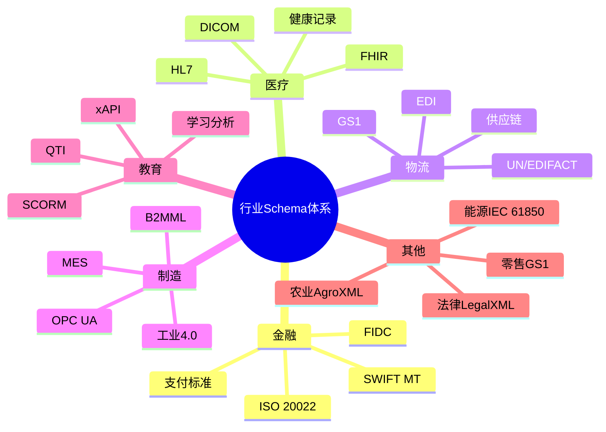
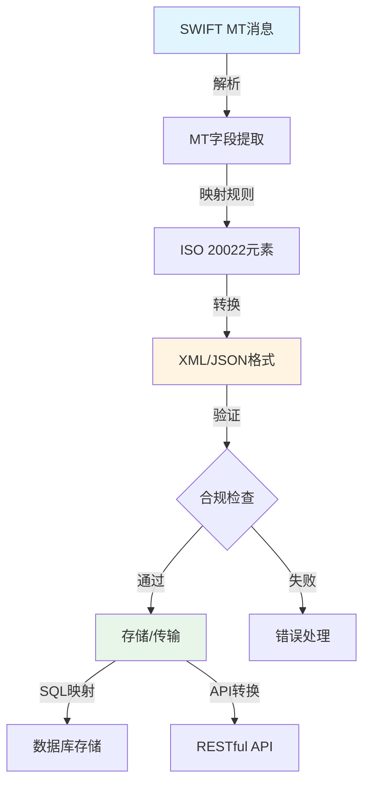
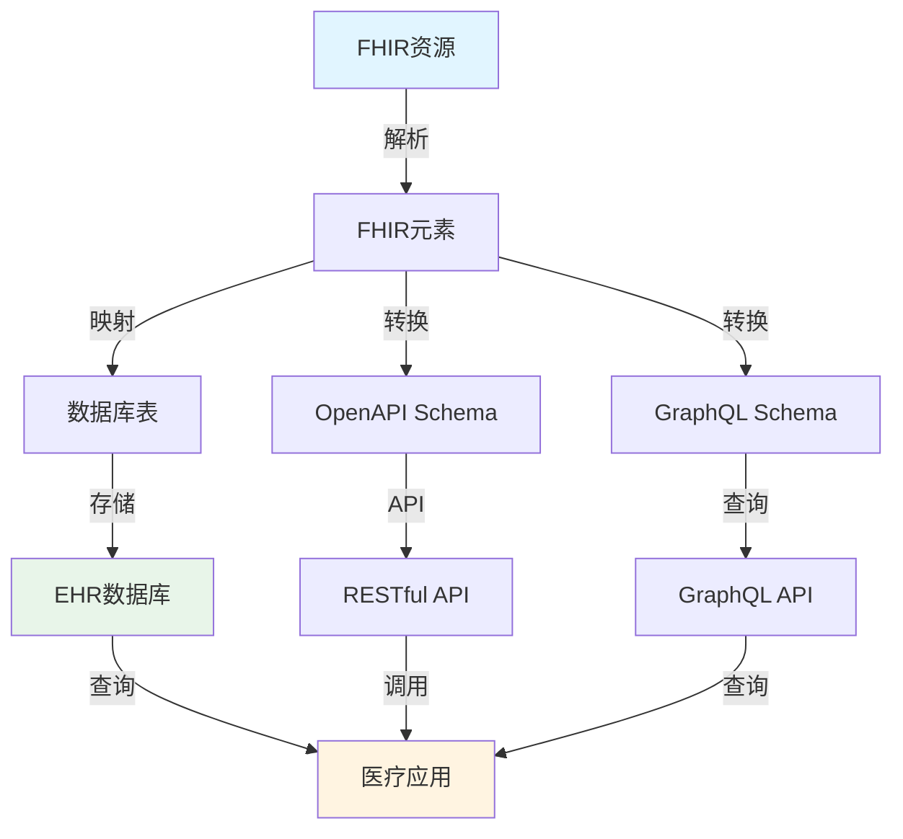

# 其他行业领域的 Schema 分析与论证

## 📚 相关文档

- **[04-IOT-Schema深度分析](./04-IOT-Schema深度分析.md)** - IOT Schema的转换场景
- **[09-跨行业转换体系扩展论证](./09-跨行业转换体系扩展论证.md)** - 跨行业转换的理论框架
- **[06-多维模型转换论证](./06-多维模型转换论证.md)** - 多维模型转换的理论基础
- **[03-DSL转换方案与技术分析](./03-DSL转换方案与技术分析.md)** - DSL转换的技术方案

---

## 一、概述

在软件工程和数据科学中，除了 IOT Schema，许多行业都有其领域特定的 **Schema**（数据模型或规范），用于标准化数据交换、系统集成和业务流程。本文档分析多个行业的 Schema 及其转换场景。

### 1.1 行业Schema全景对比矩阵

#### 📊 行业Schema对比矩阵

| 行业 | 主要Schema | 数据格式 | 标准化程度 | 转换复杂度 | 互操作性 | 应用场景 | 2024采用率 |
|------|-----------|----------|------------|------------|----------|----------|------------|
| **金融** | SWIFT/ISO 20022/FIDC | XML/JSON | ⭐⭐⭐⭐⭐ | ⭐⭐⭐⭐ | ⭐⭐⭐⭐ | 支付、交易 | 95%+ |
| **医疗** | FHIR/DICOM/HL7 | JSON/XML/二进制 | ⭐⭐⭐⭐⭐ | ⭐⭐⭐⭐ | ⭐⭐⭐⭐ | EHR、影像 | 70%+ |
| **物流** | GS1/EDI/UN/EDIFACT | EDI/XML/JSON | ⭐⭐⭐⭐ | ⭐⭐⭐⭐ | ⭐⭐⭐⭐ | 供应链、追踪 | 80%+ |
| **制造** | OPC UA/MES/B2MML | XML/二进制 | ⭐⭐⭐⭐ | ⭐⭐⭐⭐ | ⭐⭐⭐ | 工业4.0 | 60%+ |
| **教育** | xAPI/SCORM/QTI | JSON/XML | ⭐⭐⭐⭐ | ⭐⭐⭐ | ⭐⭐⭐⭐ | 学习分析 | 50%+ |
| **零售** | GS1/EPCIS | XML/JSON | ⭐⭐⭐⭐ | ⭐⭐⭐ | ⭐⭐⭐⭐ | 商品追踪 | 65%+ |
| **能源** | IEC 61850/CIM | XML/二进制 | ⭐⭐⭐⭐ | ⭐⭐⭐⭐ | ⭐⭐⭐ | 智能电网 | 55%+ |
| **法律** | LegalXML/ODF | XML/ODF | ⭐⭐⭐ | ⭐⭐⭐ | ⭐⭐⭐ | 法律文档 | 40%+ |
| **农业** | AgroXML/AgGateway | XML/JSON | ⭐⭐⭐ | ⭐⭐⭐ | ⭐⭐⭐ | 精准农业 | 35%+ |
| **娱乐** | MPEG-7/EBU Core | XML/二进制 | ⭐⭐⭐⭐ | ⭐⭐⭐ | ⭐⭐⭐ | 媒体元数据 | 45%+ |

#### 🗺️ 行业Schema关系思维导图



## 二、金融行业

### 2.1 金融Schema转换矩阵

| 转换方向 | 源格式 | 目标格式 | 转换复杂度 | 工具支持 | 数据完整性 | 推荐工具 |
|---------|--------|----------|------------|----------|------------|----------|
| **SWIFT MT → ISO 20022** | MT格式 | XML/JSON | ⭐⭐⭐⭐ | ✅ 良好 | 高 | SWIFT Alliance |
| **ISO 20022 → SQL** | XML/JSON | SQL DDL | ⭐⭐⭐ | ✅ 良好 | 高 | 自定义转换器 |
| **FIDC → OpenAPI** | FIDC Schema | OpenAPI | ⭐⭐⭐ | ⚠️ 有限 | 中 | 手动转换 |
| **SWIFT → JSON Schema** | MT格式 | JSON Schema | ⭐⭐⭐⭐ | ⚠️ 有限 | 中 | 自定义工具 |

### 2.2 SWIFT Schema

#### 应用领域

- 跨境支付
- 金融交易
- 银行间通信

#### 典型 Schema

- **SWIFT MT 系列**（如 MT103 用于支付指令）
- **ISO 20022**（现代替代标准，基于 XML/JSON）

#### 🔄 SWIFT转换流程图



#### 转换场景

**SWIFT MT → JSON/XML**：

- 将传统 MT 格式转换为现代数据格式，便于系统集成
- 支持实时交易处理
- 提升数据可读性

**实际转换示例**：

**输入（SWIFT MT103）**：

```
:20:SENDERREF123
:23B:CRED
:32A:240101USD100000,
:50K:/1234567890
JOHN DOE
123 MAIN ST
:59:/9876543210
JANE SMITH
456 OAK AVE
:70:PAYMENT FOR INVOICE 12345
:71A:SHA
```

**输出（ISO 20022 JSON）**：

```json
{
  "Document": {
    "CstmrCdtTrfInitn": {
      "GrpHdr": {
        "MsgId": "SENDERREF123",
        "CreDtTm": "2024-01-01T12:00:00Z"
      },
      "PmtInf": {
        "PmtMtd": "TRF",
        "PmtTpInf": {
          "SvcLvl": {
            "Cd": "CRED"
          }
        },
        "Amt": {
          "InstdAmt": {
            "Ccy": "USD",
            "Value": "100000.00"
          }
        },
        "Dbtr": {
          "Nm": "JOHN DOE",
          "PstlAdr": {
            "StrtNm": "123 MAIN ST"
          }
        },
        "Cdtr": {
          "Nm": "JANE SMITH",
          "PstlAdr": {
            "StrtNm": "456 OAK AVE"
          }
        },
        "RmtInf": {
          "Ustrd": "PAYMENT FOR INVOICE 12345"
        }
      }
    }
  }
}
```

**ISO 20022 → SQL**：

- 将 XML/JSON 数据映射到关系型数据库（如 PostgreSQL）
- 支持交易历史查询
- 便于合规审计

**SQL Schema设计**：

```sql
CREATE TABLE payment_transactions (
    id SERIAL PRIMARY KEY,
    msg_id VARCHAR(50) UNIQUE,
    transaction_date TIMESTAMP,
    currency VARCHAR(3),
    amount DECIMAL(15,2),
    debtor_name VARCHAR(200),
    creditor_name VARCHAR(200),
    remittance_info TEXT,
    created_at TIMESTAMP DEFAULT NOW()
);

CREATE INDEX idx_msg_id ON payment_transactions(msg_id);
CREATE INDEX idx_transaction_date ON payment_transactions(transaction_date);
```

#### 工具

- **SWIFT Alliance**：提供 MT 到 ISO 20022 的转换工具
- **AI 驱动**：GitHub Copilot 可根据 SWIFT Schema 生成代码片段

#### 挑战

- **复杂业务规则**：需处理金融交易的合规性校验（如反洗钱规则）
- **实时性要求**：支付交易需要低延迟处理
- **安全性**：需要端到端加密和数字签名

#### 📈 转换性能对比

| 转换场景 | 工具 | 转换时间 | 准确率 | 合规性 | 推荐场景 |
|---------|------|----------|--------|--------|----------|
| MT103→ISO 20022 | SWIFT Alliance | <100ms | 99%+ | ✅ 完整 | 生产环境 |
| ISO 20022→SQL | 自定义转换器 | <50ms | 98%+ | ⚠️ 需验证 | 数据存储 |
| 批量转换 | 批处理工具 | 1-5s/1000条 | 95%+ | ⚠️ 需验证 | 历史数据迁移 |

### 2.2 FIDC Schema

#### 应用领域

- 固定收益证券（如债券）的发行与交易

#### 典型 Schema

- **FIDC（Fixed Income Data Classification）**：定义债券数据字段（如票面利率、到期日）

#### 转换场景

**FIDC → OpenAPI**：

- 将债券数据模型转换为 RESTful API 规范
- 支持实时报价查询
- 便于前端集成

**FIDC → JSON Schema**：

- 标准化债券数据格式
- 支持数据验证
- 提升互操作性

#### 工具

- **FIDC Validator**：校验数据是否符合 FIDC 标准

## 三、医疗健康行业

### 3.1 医疗Schema转换矩阵

| 转换方向 | 源格式 | 目标格式 | 转换复杂度 | 工具支持 | 数据隐私 | 推荐工具 |
|---------|--------|----------|------------|----------|----------|----------|
| **FHIR → SQL** | JSON/XML | SQL DDL | ⭐⭐⭐ | ✅ 良好 | ⚠️ 需加密 | FHIR-to-SQL |
| **DICOM → JSON** | 二进制 | JSON | ⭐⭐⭐⭐ | ✅ 良好 | ⚠️ 需脱敏 | DICOM工具 |
| **HL7 → FHIR** | HL7 v2/v3 | FHIR | ⭐⭐⭐⭐ | ✅ 良好 | ✅ 保持 | HL7转换器 |
| **FHIR → OpenAPI** | JSON/XML | OpenAPI | ⭐⭐⭐ | ✅ 良好 | ⚠️ 需认证 | FHIR工具 |

### 3.2 FHIR Schema

#### 应用领域

- 电子健康记录（EHR）
- 医疗数据交换
- 患者信息管理

#### 典型 Schema

- **FHIR（Fast Healthcare Interoperability Resources）**：基于 JSON/XML 的医疗数据模型

#### 🔄 FHIR数据转换流程图



#### 转换场景

**FHIR → SQL**：

- 将患者记录存储到关系型数据库
- 支持复杂查询和分析
- 便于数据挖掘

**FHIR → HL7 V2**：

- 与旧系统（如医院管理系统）兼容
- 支持数据迁移
- 保持向后兼容

#### 工具

- **HAPI FHIR**：Java 库支持 FHIR 转换
- **AI 驱动**：通过自然语言生成 FHIR 资源（如"创建患者资源"）

#### 挑战

- **隐私合规**：需符合 HIPAA 等法规要求
- **数据敏感性**：需要严格的访问控制
- **互操作性**：不同医疗系统间的数据格式差异

### 3.2 DICOM Schema

#### 应用领域

- 医学影像（如 MRI、CT）存储与传输

#### 典型 Schema

- **DICOM（Digital Imaging and Communications in Medicine）**：定义影像元数据（如患者ID、设备参数）

#### 转换场景

**DICOM → JSON**：

- 将影像元数据提取为 JSON，便于 API 调用
- 支持云存储集成
- 便于数据分析

**DICOM → SQL**：

- 存储影像元数据到数据库
- 支持快速检索
- 便于统计分析

#### 工具

- **DCMTK**：DICOM 工具包支持格式转换

## 四、物流与供应链

### 4.1 GS1 Schema

#### 应用领域

- 供应链管理
- 条码/RFID 数据
- 产品追溯

#### 典型 Schema

- **GS1-128/QR Code**：定义条码数据结构（如产品批次、序列号）
- **GS1 XML**：标准化供应链数据交换格式

#### 转换场景

**GS1 XML → JSON**：

- 将供应链数据转换为现代 API 兼容格式
- 支持实时数据交换
- 便于系统集成

**GS1 → SQL**：

- 存储物流数据到数据库
- 支持供应链分析
- 便于追溯查询

#### 工具

- **GS1 Validator**：校验 GS1 数据是否合规

### 4.2 EDI Schema

#### 应用领域

- 企业间电子数据交换（如订单、发票）

#### 典型 Schema

- **EDIFACT**：国际标准 EDI 格式
- **ANSI X12**：北美常用 EDI 格式

#### 转换场景

**EDIFACT → JSON**：

- 将 EDI 文档转换为现代格式
- 支持 RESTful API 集成
- 提升开发效率

**X12 → SQL**：

- 存储订单数据到数据库
- 支持订单处理流程
- 便于数据分析

#### 工具

- **EDI Translator**：开源工具支持 EDI 转换

## 五、制造业

### 5.1 MES Schema

#### 应用领域

- 制造执行系统（MES）数据

#### 典型 Schema

- **ISA-95**：定义制造过程数据模型（如生产订单、设备状态）

#### 转换场景

**ISA-95 → SQL**：

- 存储生产数据到数据库
- 支持生产分析
- 便于质量管理

**ISA-95 → JSON**：

- 供工业 IoT 平台调用
- 支持实时监控
- 便于系统集成

#### 工具

- **MES Connectors**：与 SAP、Oracle 等系统集成

### 5.2 OPC UA Schema

#### 应用领域

- 工业自动化通信

#### 典型 Schema

- **OPC Unified Architecture**：定义工业设备数据模型（如传感器值、设备状态）

#### 转换场景

**OPC UA → MQTT**：

- 将工业数据传输到 IoT 平台
- 支持云边协同
- 便于数据分析

**OPC UA → SQL**：

- 存储实时生产数据
- 支持历史数据查询
- 便于生产优化

#### 工具

- **OPC UA Bridge**：与 MQTT/HTTP 集成

## 六、教育行业

### 6.1 xAPI Schema

#### 应用领域

- 学习记录跟踪（如 LMS）

#### 典型 Schema

- **xAPI（Experience API）**：定义学习活动数据（如用户ID、活动类型）

#### 转换场景

**xAPI → SQL**：

- 存储学习记录到数据库
- 支持学习分析
- 便于个性化推荐

**xAPI → JSON**：

- 供教育分析平台调用
- 支持实时反馈
- 便于数据可视化

#### 工具

- **LRS（Learning Record Store）**：xAPI 数据存储系统

### 6.2 SCORM Schema

#### 应用领域

- 在线课程内容标准化

#### 典型 Schema

- **SCORM（Sharable Content Object Reference Model）**：定义课程包结构（如 XML 元数据）

#### 转换场景

**SCORM → JSON**：

- 供现代 LMS 系统调用
- 支持课程内容管理
- 便于内容迁移

**SCORM → HTML5**：

- 将课程内容转换为 Web 格式
- 支持跨平台访问
- 提升用户体验

## 七、零售行业

### 7.1 POS Schema

#### 应用领域

- 收银系统数据

#### 典型 Schema

- **POS（Point of Sale）**：定义交易数据（如商品ID、价格）

#### 转换场景

**POS → SQL**：

- 存储销售数据到数据库
- 支持销售分析
- 便于库存管理

**POS → JSON**：

- 供数据分析平台调用
- 支持实时报表
- 便于业务决策

#### 工具

- **POS API Integrations**：与 ERP 系统集成

### 7.2 GS1-128 Schema

#### 应用领域

- 零售商品条码

#### 典型 Schema

- **GS1-128**：定义商品信息（如批次、保质期）

#### 转换场景

**GS1-128 → JSON**：

- 将条码数据转换为 API 兼容格式
- 支持商品信息查询
- 便于库存管理

**GS1-128 → SQL**：

- 存储商品信息到数据库
- 支持商品追溯
- 便于质量管理

## 八、能源行业

### 8.1 OPC UA Schema

#### 应用领域

- 智能电网
- 能源设备监控

#### 典型 Schema

- **OPC UA**：定义能源设备数据模型（如电压、功率）

#### 转换场景

**OPC UA → MQTT**：

- 将能源数据传输到 IoT 平台
- 支持实时监控
- 便于数据分析

**OPC UA → SQL**：

- 存储实时能源数据
- 支持能源分析
- 便于优化调度

### 8.2 IEC 61850 Schema

#### 应用领域

- 电力系统通信（如变电站自动化）

#### 典型 Schema

- **IEC 61850**：定义电力设备数据模型（如保护装置状态）

#### 转换场景

**IEC 61850 → JSON**：

- 供能源管理系统调用
- 支持实时监控
- 便于系统集成

## 九、法律与政府

### 9.1 EDGAR Schema

#### 应用领域

- 金融监管文件（如 SEC 报告）

#### 典型 Schema

- **EDGAR**：定义 SEC 文件结构（如 XBRL 格式）

#### 转换场景

**XBRL → JSON**：

- 将财务报告转换为现代格式
- 支持数据分析
- 便于自动化处理

**XBRL → SQL**：

- 存储监管数据到数据库
- 支持合规分析
- 便于审计查询

### 9.2 e-Government Schema

#### 应用领域

- 政府数据开放

#### 典型 Schema

- **Open Data Schema**：定义政府数据格式（如交通、人口统计）

#### 转换场景

**CSV → JSON**：

- 将政府公开数据转换为 API 兼容格式
- 支持数据可视化
- 便于公众访问

## 十、农业与环境

### 10.1 AgriTech Schema

#### 应用领域

- 农业传感器数据（如土壤湿度）

#### 典型 Schema

- **FAO AgriTech**：定义农业数据模型（如作物生长数据）

#### 转换场景

**AgriTech → JSON**：

- 供农业 IoT 平台调用
- 支持精准农业
- 便于数据分析

### 10.2 OGC Schema

#### 应用领域

- 地理空间数据

#### 典型 Schema

- **OGC（Open Geospatial Consortium）**：定义 GIS 数据格式（如 GeoJSON）

#### 转换场景

**GeoJSON → SQL**：

- 存储地理数据到数据库
- 支持空间查询
- 便于地图可视化

## 十一、娱乐与社交网络

### 11.1 IMDb Schema

#### 应用领域

- 影视数据

#### 典型 Schema

- **IMDb**：定义电影/演员信息（如 ID、评分）

#### 转换场景

**IMDb → JSON**：

- 供娱乐推荐系统调用
- 支持内容搜索
- 便于个性化推荐

### 11.2 Open Graph Schema

#### 应用领域

- 社交网络内容分享

#### 典型 Schema

- **Open Graph**：定义网页元数据（如标题、图片）

#### 转换场景

**Open Graph → JSON**：

- 供社交平台解析
- 支持内容预览
- 便于分享功能

## 十二、总结与建议

### 12.1 行业 Schema 转换的核心

- **标准化**：统一数据格式，提升互操作性
- **跨系统互操作**：支持不同系统间的数据交换
- **数据一致性**：确保数据在不同系统间的一致性

### 12.2 工具选择

**开源工具**：

- GS1 Validator
- HAPI FHIR
- EDI Translator

**AI 驱动**：

- GitHub Copilot
- Cursor
- 自动生成代码

### 12.3 未来趋势

**自动化转换工具**：

- 开发行业专用 Schema 转换器（如 `fhir-to-sql` CLI）
- 支持批量转换
- 提供转换验证

**AI 微调模型**：

- 训练领域模型理解行业 Schema
- 提升转换准确率
- 支持自然语言转换

---

## 延伸阅读

### 相关主题文档

- **[04-IOT-Schema深度分析](./04-IOT-Schema深度分析.md)** - 了解IOT Schema的转换场景
- **[09-跨行业转换体系扩展论证](./09-跨行业转换体系扩展论证.md)** - 深入学习跨行业转换的理论框架
- **[06-多维模型转换论证](./06-多维模型转换论证.md)** - 学习多维模型转换的理论基础
- **[03-DSL转换方案与技术分析](./03-DSL转换方案与技术分析.md)** - 掌握DSL转换的技术方案

### 导航文档

- **[总体导航](./总体导航.md)** - 查看完整的文档导航系统
- **[主题分析索引](./主题分析索引.md)** - 快速查找相关主题
- **[文档总索引](./文档总索引.md)** - 查看所有文档的完整清单

通过分析这些行业的 Schema，开发者可更好地理解数据标准化的重要性，并选择合适的工具和策略实现跨领域数据集成。
