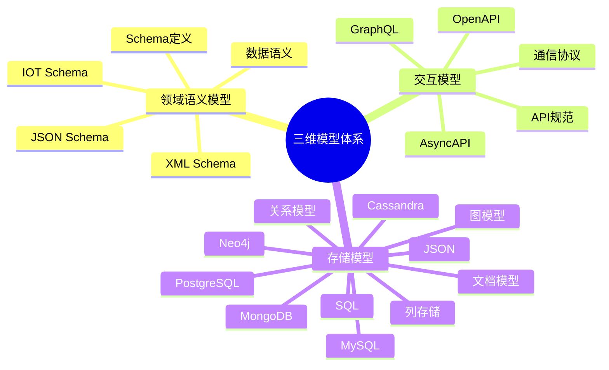
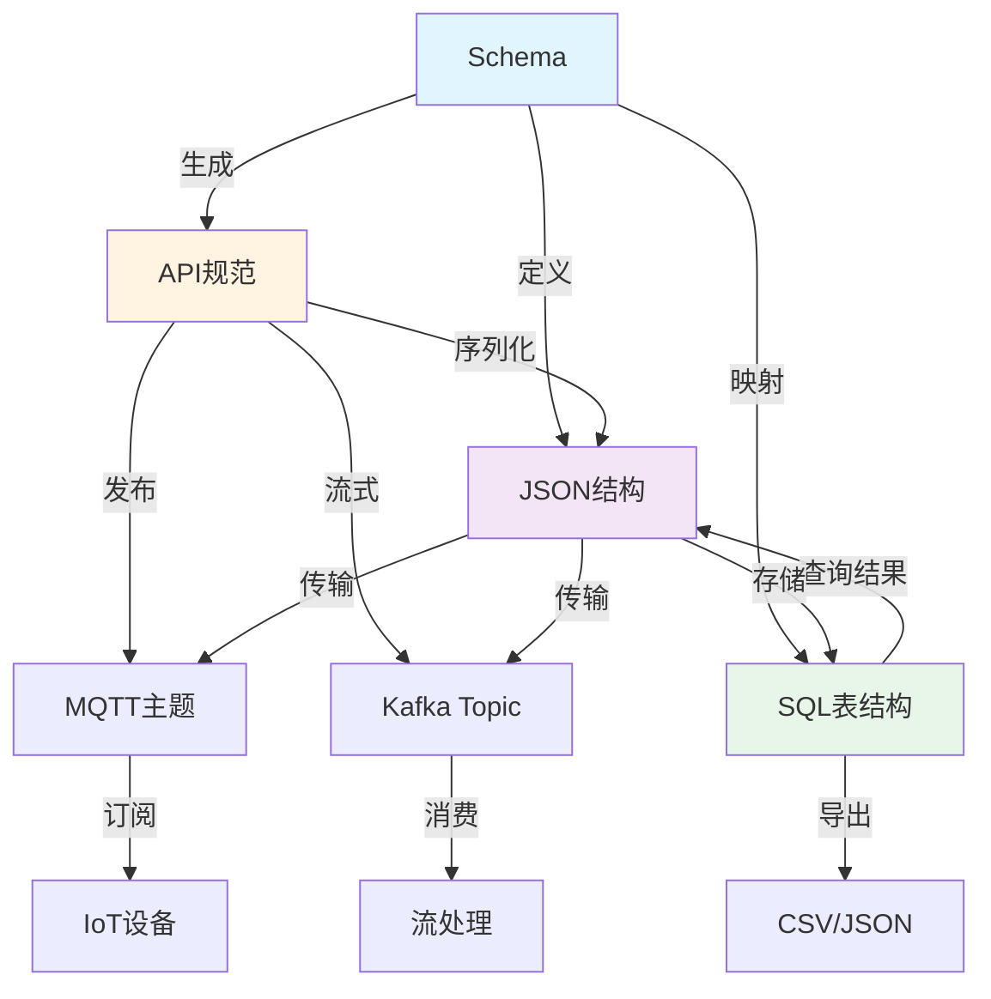

# Schema、API、SQL、JSON、MQTT、Kafka 的多维对比与转换论证

## 📚 相关文档

- **[01-领域语言转换与AI时代适配方案](./01-领域语言转换与AI时代适配方案.md)** - AI+Code时代的适配方案
- **[09-跨行业转换体系扩展论证](./09-跨行业转换体系扩展论证.md)** - 跨行业转换的理论框架
- **[04-IOT-Schema深度分析](./04-IOT-Schema深度分析.md)** - IOT Schema的转换场景
- **[03-DSL转换方案与技术分析](./03-DSL转换方案与技术分析.md)** - DSL转换的技术方案
- **[05-行业Schema分析与转换](./05-行业Schema分析与转换.md)** - 行业Schema的应用场景

---

## 一、领域语义模型、交互模型、存储模型的定义

### 1.1 三维模型体系思维导图

#### 🗺️ 模型分类体系



### 1.2 模型类型定义

| **模型类型**      | **定义**                                                                 |
|-------------------|--------------------------------------------------------------------------|
| **领域语义模型**   | 定义数据的结构、字段含义、业务规则（如 OpenAPI Schema、IOT Schema）。       |
| **交互模型**       | 定义系统间通信的协议和接口（如 REST API、MQTT、Kafka）。                    |
| **存储模型**       | 定义数据的持久化格式和结构（如 SQL 表、JSON 文件）。                        |

### 1.2 模型关系

三种模型之间存在密切的转换关系：

- **领域语义模型 → 交互模型**：Schema 定义 API 接口规范
- **交互模型 → 存储模型**：API 数据需要持久化到数据库
- **存储模型 → 交互模型**：数据库数据需要暴露为 API

## 二、转换关系论证（形式化证明）

### 2.1 Schema → API

#### 前提

Schema 定义了数据的字段、类型和业务规则（如 OpenAPI Schema）。

#### 结论

API 接口必须遵循 Schema 的语义约束。

#### 证明

1. **字段约束映射**：
   - Schema 中的 `required` 字段 → API 必须强制校验（如 `POST /users` 需包含 `name`）
   - Schema 中的 `format` 字段 → API 响应需符合格式（如 `timestamp` 必须为 ISO 8601）
   - Schema 的 `description` → API 文档需明确字段含义（如 `temperature` 单位为 `°C`）

2. **类型约束映射**：
   - Schema 的 `type: string` → API 参数类型为字符串
   - Schema 的 `type: number` → API 参数类型为数字
   - Schema 的 `type: object` → API 请求/响应体为对象

3. **验证规则映射**：
   - Schema 的 `minimum`/`maximum` → API 参数验证范围
   - Schema 的 `pattern` → API 参数格式验证
   - Schema 的 `enum` → API 参数枚举值验证

### 2.2 API → JSON

#### 前提

API 接口返回 JSON 格式数据。

#### 结论

JSON 是 API 交互的通用数据载体。

#### 证明

1. **数据格式映射**：
   - API 的 `GET /users` 响应 → JSON 格式（如 `{"id": 1, "name": "Alice"}`）
   - API 的 `POST /users` 请求体 → JSON 格式（如 `{"name": "Bob", "email": "bob@example.com"}`）

2. **嵌套结构支持**：
   - JSON 的嵌套结构 → 支持复杂数据（如 `{"user": {"id": 1, "orders": [...]}}`）
   - JSON 数组 → 支持列表数据（如 `[{"id": 1}, {"id": 2}]`）

3. **类型映射**：
   - API 的字符串类型 → JSON 的 `string`
   - API 的数字类型 → JSON 的 `number`
   - API 的布尔类型 → JSON 的 `boolean`

### 2.3 JSON → SQL

#### 前提

JSON 数据需持久化到关系型数据库。

#### 结论

SQL 表结构需映射 JSON 字段。

#### 证明

1. **字段映射**：
   - JSON 中的 `user.id` → SQL 表的 `id` 列（类型 `INT`）
   - JSON 中的 `user.name` → SQL 表的 `name` 列（类型 `VARCHAR`）
   - JSON 中的 `user.email` → SQL 表的 `email` 列（类型 `VARCHAR`）

2. **嵌套字段处理**：
   - JSON 中的嵌套字段 → SQL 表的关联表或 `JSONB` 类型（如 PostgreSQL）
   - JSON 数组 → SQL 的关联表或数组类型

3. **类型转换**：
   - JSON 的 `string` → SQL 的 `VARCHAR`/`TEXT`
   - JSON 的 `number` → SQL 的 `INT`/`FLOAT`/`DECIMAL`
   - JSON 的 `boolean` → SQL 的 `BOOLEAN`
   - JSON 的 `null` → SQL 的 `NULL`

### 2.4 SQL → JSON

#### 前提

SQL 查询结果需返回为 JSON。

#### 结论

数据库支持 JSON 格式输出。

#### 证明

1. **查询结果转换**：
   - SQL 查询 `SELECT * FROM users` → JSON 输出（如 `{"id": 1, "name": "Alice"}`）
   - SQL 的 `JSON_AGG` 函数 → 生成嵌套 JSON（如 `{"users": [{"id": 1}, ...]}`）

2. **类型转换**：
   - SQL 的 `VARCHAR` → JSON 的 `string`
   - SQL 的 `INT` → JSON 的 `number`
   - SQL 的 `BOOLEAN` → JSON 的 `boolean`
   - SQL 的 `NULL` → JSON 的 `null`

### 2.5 JSON → MQTT/Kafka

#### 前提

JSON 数据需通过消息队列传输。

#### 结论

MQTT/Kafka 支持 JSON 格式消息。

#### 证明

1. **MQTT 消息格式**：
   - MQTT 主题 `sensors/temperature` → JSON 负载（如 `{"device_id": "sensor-001", "value": 25.3}`）
   - MQTT QoS 等级 → 消息可靠性保证

2. **Kafka 消息格式**：
   - Kafka 消息体 → JSON 格式（如 `{"event": "user_login", "user_id": "123"}`）
   - Kafka 分区键 → 消息路由策略

### 2.6 MQTT/Kafka → SQL/JSON

#### 前提

消息队列数据需持久化或转发。

#### 结论

需通过消费者将消息转换为 SQL 或 JSON。

#### 证明

1. **Kafka 消费者转换**：
   - Kafka 消费者 → 写入 SQL 表（如 `INSERT INTO logs (event, user_id) VALUES ('login', '123')`）
   - Kafka 消费者 → 转发为 API 请求（如 `POST /events` 附带 JSON 负载）

2. **MQTT 消费者转换**：
   - MQTT 消费者 → 转发为 API 请求（如 `POST /sensors/data` 附带 JSON 负载）
   - MQTT 消费者 → 写入数据库（如 `INSERT INTO sensor_data (device_id, value) VALUES (?, ?)`）

## 三、多维模型转换关系图

### 3.1 模型转换关系思维导图



### 3.2 转换路径矩阵

| 源模型 | 目标模型 | 转换方向 | 复杂度 | 数据完整性 | 工具支持 | 推荐工具 |
|--------|----------|----------|--------|------------|----------|----------|
| **Schema** | API | 生成 | ⭐⭐ | 100% | ✅ 优秀 | OpenAPI Generator |
| **Schema** | SQL | 映射 | ⭐⭐⭐ | 95%+ | ✅ 良好 | Prisma/TypeORM |
| **Schema** | JSON | 定义 | ⭐ | 100% | ✅ 优秀 | JSON Schema |
| **API** | JSON | 序列化 | ⭐ | 100% | ✅ 优秀 | 原生支持 |
| **API** | MQTT | 发布 | ⭐⭐ | 95%+ | ✅ 良好 | MQTT Bridge |
| **API** | Kafka | 流式 | ⭐⭐ | 95%+ | ✅ 良好 | Kafka Connect |
| **SQL** | JSON | 查询 | ⭐ | 100% | ✅ 优秀 | ORM工具 |
| **JSON** | SQL | 存储 | ⭐⭐⭐ | 90%+ | ✅ 良好 | 自定义转换器 |
| **MQTT** | JSON | 解析 | ⭐ | 100% | ✅ 优秀 | MQTT客户端 |
| **Kafka** | JSON | 反序列化 | ⭐ | 100% | ✅ 优秀 | Kafka客户端 |

## 四、多维对比矩阵

| **维度**          | **Schema**                | **API**                   | **SQL**                   | **JSON**                  | **MQTT**                  | **Kafka**                 |
|-------------------|---------------------------|---------------------------|---------------------------|---------------------------|---------------------------|---------------------------|
| **数据格式**       | 定义结构（YAML/JSON）     | 请求/响应（HTTP）         | 表结构（DDL）             | 键值对（无模式）          | 二进制/JSON               | 二进制/JSON               |
| **通信方式**       | 无（定义规则）            | HTTP/HTTPS                | 无（持久化）              | 无（数据载体）            | TCP（轻量级）             | TCP（高吞吐）             |
| **语义约束**       | 强（字段类型、必填项）    | 强（Schema 验证）         | 强（表约束）              | 弱（动态字段）            | 弱（动态主题）            | 弱（动态分区）            |
| **典型场景**       | API 文档、数据校验        | 系统间通信                | 数据持久化                | API 响应、消息负载        | 实时传感器数据            | 批量日志、事件流          |
| **工具/协议**      | OpenAPI, IOT Schema       | REST, GraphQL             | PostgreSQL, MySQL         | JSON, XML                 | MQTT, Mosquitto           | Kafka, Kafka Connect      |
| **性能特征**       | 定义时验证 | 请求级延迟 | 查询优化 | 序列化开销 | 低延迟 | 高吞吐 |
| **扩展性**         | 版本管理 | 版本控制 | 表结构变更 | 动态字段 | 主题扩展 | 分区扩展 |
| **一致性**         | Schema版本 | API版本 | ACID事务 | 最终一致 | 消息顺序 | 分区顺序 |
| **转换策略**       | → API 定义接口            | → SQL/JSON/Kafka          | ← JSON/MQTT/Kafka         | ← SQL/→ API/MQTT/Kafka    | ← JSON/→ SQL/API          | ← JSON/→ SQL/API          |

## 五、实际案例论证

### 5.1 IOT Schema → MQTT → SQL

#### 场景

温湿度传感器数据通过 MQTT 传输到 SQL 数据库。

#### 流程

1. **Schema**：定义 `temperature`（`number`）、`humidity`（`number`）、`timestamp`（`date-time`）

2. **MQTT**：
   - 主题：`sensors/{device_id}`
   - 负载：JSON（如 `{"temperature": 25.3, "humidity": 60}`）

3. **SQL**：
   - 创建表 `iot_data`
   - 字段：`temperature FLOAT`、`humidity FLOAT`、`timestamp DATETIME`

#### 实现示例

```javascript
// MQTT 订阅
mqttClient.subscribe('sensors/+', (topic, message) => {
  const data = JSON.parse(message.toString());

  // 转换为 SQL 插入
  const sql = `INSERT INTO iot_data (device_id, temperature, humidity, timestamp)
               VALUES (?, ?, ?, ?)`;
  db.query(sql, [data.device_id, data.temperature, data.humidity, data.timestamp]);
});
```

### 5.2 OpenAPI → JSON → Kafka

#### 场景

电商订单 API 响应数据写入 Kafka。

#### 流程

1. **OpenAPI**：定义 `POST /orders` 返回 `{"order_id": "123", "status": "paid"}`

2. **JSON**：API 响应直接作为 Kafka 消息体

3. **Kafka**：消费者将 JSON 写入下游系统（如数据仓库）

#### 实现示例

```javascript
// API 响应
app.post('/orders', (req, res) => {
  const order = createOrder(req.body);

  // 发送到 Kafka
  kafkaProducer.send({
    topic: 'orders',
    messages: [{ value: JSON.stringify(order) }]
  });

  res.json(order);
});
```

## 六、转换工具与最佳实践

### 6.1 Schema → API

**工具**：

- **OpenAPI Generator**：自动生成接口代码
- **Swagger Codegen**：生成客户端和服务端代码

**最佳实践**：

- 使用 OpenAPI 3.1 规范
- 提供完整的 Schema 定义
- 自动生成 API 文档

### 6.2 JSON → SQL

**工具**：

- **JSON Schema to SQL**：自动生成 DDL
- **PostgreSQL JSONB**：原生支持 JSON 存储

**最佳实践**：

- 根据数据访问模式选择表结构
- 使用 JSONB 存储动态字段
- 建立适当的索引

### 6.3 MQTT/Kafka → SQL

**工具**：

- **Kafka Connect**：自动同步到数据库
- **MQTT Bridge**：转发到数据库

**最佳实践**：

- 使用批量插入提升性能
- 实现错误处理和重试机制
- 监控消息处理延迟

## 七、总结与建议

### 7.1 转换策略

1. **Schema → API**：使用 OpenAPI Generator 自动生成接口代码
2. **JSON → SQL**：通过 JSON Schema to SQL 工具生成 DDL
3. **MQTT/Kafka → SQL**：部署 Kafka Connect 或 MQTT 消费者写入数据库

### 7.2 工具推荐

- **Schema 工具**：Swagger UI、IOT Schema Validator
- **API 工具**：Postman、GraphQL Playground
- **消息队列**：Mosquitto（MQTT）、Kafka（Kafka Connect）

### 7.3 未来趋势

- **AI 驱动转换**：训练 LLM 理解 Schema 并自动生成 SQL/JSON/API
- **自动化管道**：通过 CI/CD 流水线实现 Schema → API → SQL/Kafka 的自动部署
- **统一标准**：推动跨领域 Schema 标准的统一

---

## 延伸阅读

### 相关主题文档

- **[01-领域语言转换与AI时代适配方案](./01-领域语言转换与AI时代适配方案.md)** - 了解AI+Code时代的适配方案
- **[09-跨行业转换体系扩展论证](./09-跨行业转换体系扩展论证.md)** - 深入学习跨行业转换的理论框架
- **[04-IOT-Schema深度分析](./04-IOT-Schema深度分析.md)** - 了解IOT Schema的转换场景
- **[03-DSL转换方案与技术分析](./03-DSL转换方案与技术分析.md)** - 掌握DSL转换的技术方案
- **[05-行业Schema分析与转换](./05-行业Schema分析与转换.md)** - 了解行业Schema的应用场景

### 导航文档

- **[总体导航](./总体导航.md)** - 查看完整的文档导航系统
- **[主题分析索引](./主题分析索引.md)** - 快速查找相关主题
- **[文档总索引](./文档总索引.md)** - 查看所有文档的完整清单

通过上述论证，开发者可系统性地设计跨领域语义模型、交互模型和存储模型的转换策略，提升系统的互操作性与数据一致性。
