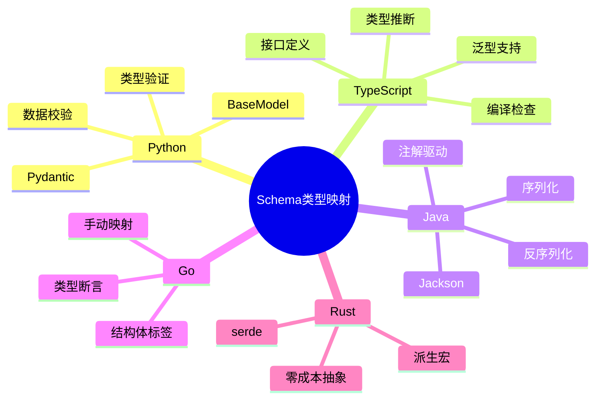

# Schema 与编程语言类型系统、控制逻辑的转换论证

## 📚 相关文档

- **[01-领域语言转换与AI时代适配方案](./01-领域语言转换与AI时代适配方案.md)** - AI+Code时代的适配方案
- **[03-DSL转换方案与技术分析](./03-DSL转换方案与技术分析.md)** - DSL转换的技术方案
- **[06-多维模型转换论证](./06-多维模型转换论证.md)** - 多维模型转换的理论基础
- **[02-DSL分类与典型示例](./02-DSL分类与典型示例.md)** - DSL分类体系

---

## 一、Schema 与编程语言类型系统的映射

### 1.1 类型系统对比矩阵

#### 📊 编程语言类型系统对比

| 语言 | 类型系统 | 类型安全 | 运行时检查 | Schema映射 | 代码生成 | 推荐工具 |
|------|----------|----------|------------|------------|----------|----------|
| **Python** | 动态/静态 | ⚠️ 可选 | ⚠️ 部分 | ✅ Pydantic | ✅ 优秀 | Pydantic |
| **TypeScript** | 静态 | ✅ 强 | ✅ 编译时 | ✅ 原生 | ✅ 优秀 | TypeScript |
| **Java** | 静态 | ✅ 强 | ✅ 运行时 | ✅ Jackson | ✅ 优秀 | Jackson |
| **Go** | 静态 | ✅ 强 | ✅ 编译时 | ⚠️ 手动 | ⚠️ 有限 | 自定义 |
| **Rust** | 静态 | ✅ 极强 | ✅ 编译时 | ⚠️ 手动 | ⚠️ 有限 | serde |
| **C#** | 静态 | ✅ 强 | ✅ 运行时 | ✅ 原生 | ✅ 优秀 | System.Text.Json |

#### 🗺️ Schema到类型系统映射思维导图



### 1.2 类型系统映射规则

| **Schema 类型**       | **Python (Pydantic)**     | **TypeScript**            | **Java (Jackson)**        |
|------------------------|---------------------------|---------------------------|---------------------------|
| `string`               | `str`                     | `string`                  | `String`                  |
| `number`               | `float`                   | `number`                  | `Double`                  |
| `integer`              | `int`                     | `integer`                 | `Integer`                 |
| `boolean`              | `bool`                    | `boolean`                 | `Boolean`                 |
| `array`                | `List[T]`                 | `Array<T>`                | `List<T>`                 |
| `object`               | `Dict[str, Any]`          | `Record<string, any>`     | `Map<String, Object>`     |
| `date-time`            | `datetime`                | `Date`                    | `LocalDateTime`           |

### 1.2 自动代码生成工具

#### OpenAPI → Pydantic (Python)

**工具**：`openapi2pydantic`

**使用示例**：

```bash
openapi2pydantic -i openapi.yaml -o models.py
```

**生成代码**：

```python
from pydantic import BaseModel
from datetime import datetime

class User(BaseModel):
    id: int
    name: str
    created_at: datetime
```

#### OpenAPI → TypeScript

**工具**：`openapi-generator-cli`

**使用示例**：

```bash
openapi-generator-cli generate -i openapi.yaml -g typescript-fetch
```

**生成代码**：

```typescript
interface User {
  id: number;
  name: string;
  createdAt: string; // ISO 8601 format
}
```

#### OpenAPI → Java (Jackson)

**工具**：`openapi-generator-cli`

**使用示例**：

```bash
openapi-generator-cli generate -i openapi.yaml -g java
```

**生成代码**：

```java
@Data
public class User {
  private Integer id;
  private String name;
  private LocalDateTime createdAt;
}
```

### 1.3 类型系统的优势

#### 编译时验证

**静态类型语言**（如 TypeScript、Java）在编译阶段捕获类型错误：

```typescript
// TypeScript - 编译时错误
const user: User = {
  id: "123", // 错误：类型不匹配
  name: "Alice"
};
```

#### 运行时验证

**动态类型语言**（如 Python）通过 Pydantic 等库进行运行时校验：

```python
# Python - 运行时验证
from pydantic import ValidationError

try:
    user = User(id="123", name="Alice")  # 错误：id 必须是 int
except ValidationError as e:
    print(e)
```

#### IDE 支持

类型提示提升代码可读性和开发效率：

- **自动补全**：IDE 可以根据类型提示提供代码补全
- **错误检测**：IDE 可以实时检测类型错误
- **重构支持**：类型信息支持安全的代码重构

## 二、Schema 与控制逻辑的映射

### 2.1 控制逻辑映射规则

| **Schema 约束**        | **Python 控制逻辑**                          | **TypeScript 控制逻辑**                  | **Java 控制逻辑**                          |
|------------------------|----------------------------------------------|------------------------------------------|--------------------------------------------|
| `required`             | `assert model.id is not None`                | `if (!user.id) throw new Error()`        | `if (user.getId() == null) throw new Exception()` |
| `format: date-time`    | `datetime.fromisoformat(model.created_at)`   | `new Date(user.createdAt)`               | `LocalDateTime.parse(user.getCreatedAt())` |
| `maximum: 100`         | `assert model.temperature <= 100`            | `if (user.age > 100) throw new Error()`  | `if (user.getAge() > 100) throw new Exception()` |

### 2.2 控制逻辑自动生成

#### OpenAPI → 控制逻辑代码

**工具**：`openapi2pydantic` with validation

**使用示例**：

```bash
openapi2pydantic -i openapi.yaml -o models.py --generate-validation
```

**生成代码**：

```python
from pydantic import BaseModel, validator

class User(BaseModel):
    id: int
    name: str

    @validator('name')
    def name_length(cls, v):
        if len(v) > 100:
            raise ValueError('name too long')
        return v
```

#### OpenAPI → Java 控制逻辑

**生成代码**：

```java
@Data
public class User {
  @NotNull
  private Integer id;

  @Size(max = 100)
  private String name;

  @Past
  private LocalDateTime createdAt;
}
```

### 2.3 控制逻辑的优势

#### 数据完整性

通过校验规则（如 `required`、`format`）确保数据合法性：

```python
# Python - Pydantic 验证
class User(BaseModel):
    id: int
    name: str = Field(..., min_length=1, max_length=100)
    email: str = Field(..., regex=r'^[\w\.-]+@[\w\.-]+\.\w+$')
```

#### 异常处理

自动抛出异常或返回错误码，避免脏数据进入系统：

```typescript
// TypeScript - 验证函数
function validateUser(user: User): void {
  if (!user.id) {
    throw new ValidationError('id is required');
  }
  if (user.name.length > 100) {
    throw new ValidationError('name too long');
  }
}
```

#### 并发控制

在多线程/异步场景中，通过锁机制或原子操作确保一致性：

```java
// Java - 并发控制
public class UserService {
  private final Lock lock = new ReentrantLock();

  public void updateUser(User user) {
    lock.lock();
    try {
      validateUser(user);
      userRepository.save(user);
    } finally {
      lock.unlock();
    }
  }
}
```

## 三、扩展多维对比矩阵

| **维度**          | **Schema**                | **API**                   | **SQL**                   | **JSON**                  | **MQTT/Kafka**            | **编程语言类型系统**      | **控制逻辑**              |
|-------------------|---------------------------|---------------------------|---------------------------|---------------------------|---------------------------|---------------------------|---------------------------|
| **数据格式**       | 定义结构（YAML/JSON）     | 请求/响应（HTTP）         | 表结构（DDL）             | 键值对（无模式）          | 二进制/JSON               | 类型定义（类/接口）       | 校验规则（required/format）|
| **通信方式**       | 无（定义规则）            | HTTP/HTTPS                | 无（持久化）              | 无（数据载体）            | TCP（轻量级）             | 类型映射（编译/运行时）   | 异常处理（try/catch）     |
| **语义约束**       | 强（字段类型、必填项）    | 强（Schema 验证）         | 强（表约束）              | 弱（动态字段）            | 弱（动态主题）            | 强（类型系统）            | 强（校验逻辑）            |
| **典型场景**       | API 文档、数据校验        | 系统间通信                | 数据持久化                | API 响应、消息负载        | 实时传感器数据            | 类型安全的代码生成        | 数据完整性保障            |
| **工具/协议**      | OpenAPI, IOT Schema       | REST, GraphQL             | PostgreSQL, MySQL         | JSON, XML                 | MQTT, Kafka               | Pydantic, Jackson, Typescript | Pydantic, Java Validation |
| **转换策略**       | → API 定义接口            | → SQL/JSON/Kafka          | ← JSON/MQTT/Kafka         | ← SQL/→ API/MQTT/Kafka    | ← JSON/→ SQL/API          | → 类型定义 → 控制逻辑     | → 校验规则 → 异常处理     |

## 四、补充案例论证

### 4.1 OpenAPI Schema → Pydantic + 控制逻辑

#### Schema 定义

```yaml
components:
  schemas:
    User:
      type: object
      properties:
        id:
          type: integer
          required: true
        name:
          type: string
          maxLength: 100
        createdAt:
          type: string
          format: date-time
```

#### Python 代码生成

```python
from pydantic import BaseModel, validator
from datetime import datetime

class User(BaseModel):
    id: int
    name: str
    created_at: datetime

    @validator('name')
    def name_length(cls, v):
        if len(v) > 100:
            raise ValueError('name too long')
        return v
```

### 4.2 JSON Schema → Java 控制逻辑

#### JSON Schema 定义

```json
{
  "type": "object",
  "properties": {
    "id": {
      "type": "integer",
      "minimum": 1
    },
    "name": {
      "type": "string",
      "maxLength": 50
    }
  },
  "required": ["id", "name"]
}
```

#### Java 代码生成

```java
@Data
public class User {
    @Min(1)
    private Integer id;

    @Size(max = 50)
    private String name;
}
```

## 五、总结与建议

### 5.1 类型系统映射

**建议**：

- 利用 Pydantic（Python）、Jackson（Java）、TypeScript 接口等工具，将 Schema 转换为强类型代码
- 提升类型安全性和开发效率
- 减少运行时错误

### 5.2 控制逻辑生成

**建议**：

- 通过校验库（如 Pydantic 的 `@validator`、Java 的 `@Size`）自动实现 Schema 约束的控制逻辑
- 减少手动编码错误
- 提升代码可维护性

### 5.3 工具推荐

**代码生成**：

- `openapi2pydantic`：Python 代码生成
- `openapi-generator`：多语言代码生成
- `swagger-codegen`：传统代码生成工具

**类型校验**：

- **Pydantic**：Python 运行时验证
- **Jackson**：Java 序列化/反序列化
- **TypeScript**：编译时类型检查
- **zod**：TypeScript 运行时验证

### 5.4 未来趋势

**AI 驱动类型映射**：

- 训练模型自动生成类型代码（如 GitHub Copilot）
- 支持自然语言到类型定义的转换
- 提升开发效率

**自动化控制逻辑**：

- 基于 Schema 自动生成异常处理逻辑（如 `try/catch`）
- 支持智能错误恢复
- 提升系统健壮性

---

## 延伸阅读

### 相关主题文档

- **[01-领域语言转换与AI时代适配方案](./01-领域语言转换与AI时代适配方案.md)** - 了解AI+Code时代的适配方案
- **[03-DSL转换方案与技术分析](./03-DSL转换方案与技术分析.md)** - 深入学习DSL转换的技术实现
- **[06-多维模型转换论证](./06-多维模型转换论证.md)** - 学习多维模型转换的理论基础
- **[02-DSL分类与典型示例](./02-DSL分类与典型示例.md)** - 了解DSL分类体系

### 导航文档

- **[总体导航](./总体导航.md)** - 查看完整的文档导航系统
- **[主题分析索引](./主题分析索引.md)** - 快速查找相关主题
- **[文档总索引](./文档总索引.md)** - 查看所有文档的完整清单

通过补充 Schema 与编程语言类型系统、控制逻辑的映射，开发者可构建更健壮的系统，确保数据一致性、类型安全性和控制完整性。
