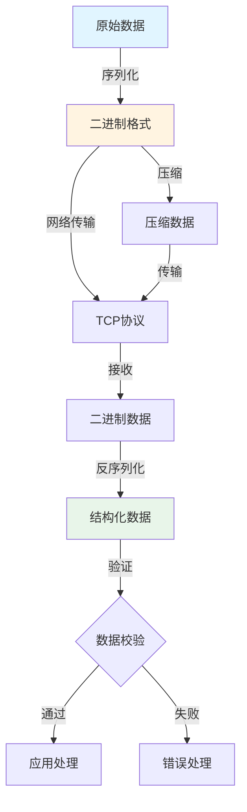

# Golang & Rust 二进制转换与 TCP 协议的补充分析

## 📚 相关文档

- **[04-IOT-Schema深度分析](./04-IOT-Schema深度分析.md)** - IOT Schema的转换场景
- **[06-多维模型转换论证](./06-多维模型转换论证.md)** - 多维模型转换的理论基础
- **[07-编程语言类型系统与控制逻辑](./07-编程语言类型系统与控制逻辑.md)** - 类型系统映射和代码生成
- **[03-DSL转换方案与技术分析](./03-DSL转换方案与技术分析.md)** - DSL转换的技术方案

---

## 一、Golang 与 Rust 的二进制转换能力

### 1.1 二进制处理语言对比矩阵

#### 📊 二进制处理能力对比

| 语言 | 二进制操作 | 性能 | 内存安全 | 并发支持 | 序列化库 | 适用场景 | 推荐度 |
|------|-----------|------|----------|----------|----------|----------|--------|
| **Golang** | `encoding/binary` | ⭐⭐⭐⭐ | ⚠️ 需注意 | ✅ 优秀 | `gob`/`protobuf` | 网络编程 | ⭐⭐⭐⭐ |
| **Rust** | `std::io`/`byteorder` | ⭐⭐⭐⭐⭐ | ✅ 保证 | ✅ 优秀 | `bincode`/`protobuf` | 系统编程 | ⭐⭐⭐⭐⭐ |
| **C/C++** | 原生指针操作 | ⭐⭐⭐⭐⭐ | ❌ 不安全 | ⚠️ 复杂 | 自定义 | 底层系统 | ⭐⭐⭐ |
| **Python** | `struct`/`array` | ⭐⭐ | ⚠️ 需注意 | ⚠️ GIL限制 | `pickle`/`protobuf` | 快速原型 | ⭐⭐⭐ |
| **Java** | `ByteBuffer` | ⭐⭐⭐ | ✅ 安全 | ✅ 优秀 | `protobuf`/`kryo` | 企业应用 | ⭐⭐⭐⭐ |

#### 🗺️ 二进制数据处理流程



### 1.2 Golang 的二进制处理

#### 核心库

- **`encoding/binary`**：二进制序列化
- **`gob`**：Go 自定义二进制格式
- **`net`**：网络通信

#### TCP 协议示例

```go
package main

import (
    "bufio"
    "fmt"
    "net"
    "os"
)

func main() {
    conn, _ := net.Dial("tcp", "127.0.0.1:8080")
    defer conn.Close()

    // 写入二进制数据
    message := []byte("Hello, TCP!")
    _, _ = conn.Write(message)

    // 读取二进制数据
    reader := bufio.NewReader(conn)
    response, _ := reader.ReadBytes('\n')
    fmt.Println(string(response))
}
```

### 1.2 Rust 的二进制处理

#### 核心库

- **`byteorder`**：字节序处理
- **`bincode`**：二进制序列化
- **`tokio`**：异步 TCP

#### TCP 协议示例

```rust
use std::net::TcpStream;
use std::io::{Read, Write};
use byteorder::{NetworkEndian, WriteBytesExt};

fn main() -> std::io::Result<()> {
    let mut stream = TcpStream::connect("127.0.0.1:8080")?;

    // 写入二进制数据
    let data = b"Hello, TCP!";
    stream.write_all(data)?;

    // 读取二进制数据
    let mut buffer = [0; 1024];
    let bytes_read = stream.read(&mut buffer)?;
    println!("Received: {}", String::from_utf8_lossy(&buffer[..bytes_read]));

    Ok(())
}
```

## 二、Golang 与 Rust 在 TCP 协议中的转换能力

### 2.1 二进制协议设计

#### Golang 实现

通过 `binary.Write`/`binary.Read` 处理固定/可变长度二进制协议：

```go
type Packet struct {
    Length  uint32
    Data    []byte
}

func (p *Packet) Marshal() ([]byte, error) {
    var b bytes.Buffer
    if err := binary.Write(&b, binary.BigEndian, p.Length); err != nil {
        return nil, err
    }
    if err := binary.Write(&b, binary.BigEndian, p.Data); err != nil {
        return nil, err
    }
    return b.Bytes(), nil
}
```

#### Rust 实现

通过 `WriteBytesExt` 和 `ReadBytesExt` 处理字节序：

```rust
use byteorder::{ReadBytesExt, WriteBytesExt, BigEndian};

struct Packet {
    length: u32,
    data: Vec<u8>,
}

impl Packet {
    fn serialize(&self) -> Vec<u8> {
        let mut buffer = Vec::new();
        buffer.write_u32::<BigEndian>(self.length).unwrap();
        buffer.extend_from_slice(&self.data);
        buffer
    }
}
```

### 2.2 TCP 协议适配

#### Golang

**特点**：

- `net.Conn` 支持同步/异步通信（通过 `goroutine`）
- 简单易用的并发模型
- 内置的缓冲机制

**示例**：

```go
func handleConnection(conn net.Conn) {
    defer conn.Close()

    // 读取数据
    buffer := make([]byte, 1024)
    n, _ := conn.Read(buffer)

    // 处理数据
    response := processData(buffer[:n])

    // 写入响应
    conn.Write(response)
}
```

#### Rust

**特点**：

- `tokio` 提供异步 TCP 通信
- 适合高并发场景
- 零成本抽象

**示例**：

```rust
use tokio::net::TcpListener;
use tokio::io::{AsyncReadExt, AsyncWriteExt};

#[tokio::main]
async fn main() -> Result<(), Box<dyn std::error::Error>> {
    let listener = TcpListener::bind("127.0.0.1:8080").await?;

    loop {
        let (mut socket, _) = listener.accept().await?;

        tokio::spawn(async move {
            let mut buffer = [0; 1024];
            let n = socket.read(&mut buffer).await.unwrap();

            let response = process_data(&buffer[..n]);
            socket.write_all(&response).await.unwrap();
        });
    }
}
```

## 三、Golang 与 Rust 的二进制转换场景

### 3.1 IoT 传感器数据

#### 场景

传感器通过 TCP 传输二进制数据（如温湿度、GPS 坐标）。

#### Golang 示例

```go
type SensorData struct {
    Temperature float32
    Humidity    uint16
}

func (s *SensorData) ToBytes() []byte {
    buf := new(bytes.Buffer)
    binary.Write(buf, binary.BigEndian, s.Temperature)
    binary.Write(buf, binary.BigEndian, s.Humidity)
    return buf.Bytes()
}
```

#### Rust 示例

```rust
struct SensorData {
    temperature: f32,
    humidity: u16,
}

impl SensorData {
    fn to_bytes(&self) -> Vec<u8> {
        let mut buffer = Vec::new();
        buffer.write_f32::<BigEndian>(self.temperature).unwrap();
        buffer.write_u16::<BigEndian>(self.humidity).unwrap();
        buffer
    }
}
```

### 3.2 高性能日志系统

#### 场景

日志记录器通过 TCP 接收二进制日志（如 Apache Avro 格式）。

#### Golang 实现

使用 `gob` 编码日志结构：

```go
type LogEntry struct {
    Level   string
    Message string
    Time    time.Time
}

func (l *LogEntry) Encode(w io.Writer) error {
    return gob.NewEncoder(w).Encode(l)
}
```

#### Rust 实现

使用 `bincode` 序列化日志：

```rust
use serde::{Serialize, Deserialize};

#[derive(Serialize, Deserialize)]
struct LogEntry {
    level: String,
    message: String,
    time: i64,
}

let log = LogEntry {
    level: "INFO".to_string(),
    message: "System started".to_string(),
    time: 1234567890,
};
let encoded: Vec<u8> = bincode::serialize(&log).unwrap();
```

## 四、多维对比矩阵（补充 Golang & Rust）

| **维度**          | **Golang**                          | **Rust**                            |
|--------------------|-------------------------------------|-------------------------------------|
| **二进制处理**     | `binary.Write`/`binary.Read`        | `byteorder`/`bincode`               |
| **TCP 协议**       | 同步 `net.Conn`，异步通过 `goroutine` | 异步 `tokio::net::TcpStream`        |
| **序列化库**       | `gob`、`json`                       | `bincode`、`serde`                  |
| **内存安全**       | 无手动内存管理（GC）                | 手动内存管理（所有权系统）          |
| **性能**           | 高（并发模型）                      | 极高（无 GC，零成本抽象）           |
| **典型场景**       | 传感器数据传输、日志系统            | 高性能网络服务、嵌入式系统          |

## 五、实际案例论证

### 5.1 Golang TCP 传感器网关

#### 场景

IoT 传感器通过 TCP 传输二进制数据到 Golang 网关。

#### 流程

1. **传感器**：发送二进制数据（如 `0x48 0x65 0x6C 0x6C 0x6F`）
2. **Golang 网关**：读取数据并解析为字符串
3. **存储**：写入 SQL 或转发到 Kafka

#### 实现示例

```go
func handleSensorData(conn net.Conn) {
    buffer := make([]byte, 1024)
    n, _ := conn.Read(buffer)

    // 解析二进制数据
    data := parseSensorData(buffer[:n])

    // 转换为 JSON
    jsonData, _ := json.Marshal(data)

    // 发送到 Kafka
    kafkaProducer.Send("sensor-data", jsonData)
}
```

### 5.2 Rust 异步 TCP 日志服务器

#### 场景

Rust 服务器接收二进制日志并实时写入磁盘。

#### 流程

1. **客户端**：通过 `tokio` 发送 `bincode` 序列化日志
2. **Rust 服务器**：异步读取数据并反序列化
3. **持久化**：写入 Parquet 文件或实时分析

#### 实现示例

```rust
async fn handle_log_entry(mut socket: TcpStream) {
    let mut buffer = [0; 4096];
    let n = socket.read(&mut buffer).await.unwrap();

    // 反序列化日志
    let log: LogEntry = bincode::deserialize(&buffer[..n]).unwrap();

    // 写入文件
    write_to_parquet(&log).await;
}
```

## 六、总结与建议

### 6.1 Golang 优势

**适用场景**：

- 适合中等规模 TCP 通信
- `goroutine` 提供简单并发模型
- `gob` 简化二进制序列化

**建议**：

- 使用 `encoding/binary` 处理固定长度协议
- 使用 `gob` 处理 Go 对象序列化
- 使用 `goroutine` 实现并发处理

### 6.2 Rust 优势

**适用场景**：

- 无 GC，适合高性能场景（如高频交易、物联网网关）
- `tokio` 提供零拷贝异步模型，降低延迟
- 内存安全保证

**建议**：

- 使用 `bincode` 进行高效序列化
- 使用 `tokio` 实现异步网络通信
- 利用所有权系统保证内存安全

### 6.3 工具推荐

**Golang**：

- `encoding/binary`：二进制数据处理
- `gob`：Go 对象序列化
- `net`：网络通信

**Rust**：

- `bincode`：高效二进制序列化
- `byteorder`：字节序处理
- `tokio`：异步运行时

### 6.4 未来趋势

**AI 驱动的二进制协议生成**：

- 训练模型自动生成 TCP 协议代码
- 支持协议自动优化
- 提升开发效率

**混合语言系统**：

- Rust 处理底层通信
- Golang 处理上层逻辑
- 通过 FFI 实现互操作

---

## 延伸阅读

### 相关主题文档

- **[04-IOT-Schema深度分析](./04-IOT-Schema深度分析.md)** - 了解IOT Schema的转换场景
- **[06-多维模型转换论证](./06-多维模型转换论证.md)** - 学习多维模型转换的理论基础
- **[07-编程语言类型系统与控制逻辑](./07-编程语言类型系统与控制逻辑.md)** - 掌握类型系统映射和代码生成
- **[03-DSL转换方案与技术分析](./03-DSL转换方案与技术分析.md)** - 了解DSL转换的技术方案

### 导航文档

- **[总体导航](./总体导航.md)** - 查看完整的文档导航系统
- **[主题分析索引](./主题分析索引.md)** - 快速查找相关主题
- **[文档总索引](./文档总索引.md)** - 查看所有文档的完整清单

通过补充 Golang 与 Rust 的二进制转换和 TCP 协议分析，开发者可针对高性能、低延迟场景选择合适语言，并构建更高效的系统架构。
