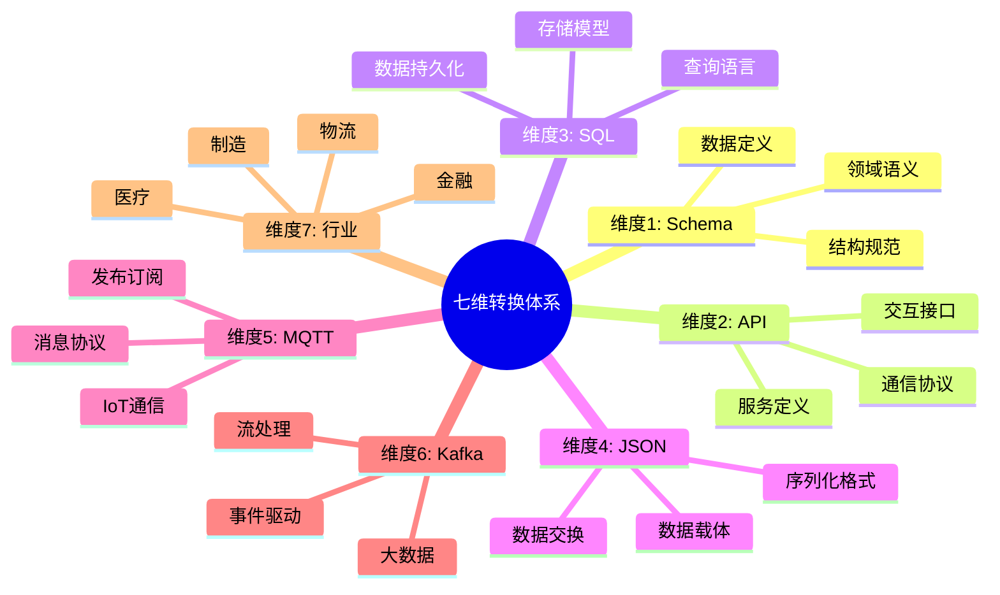
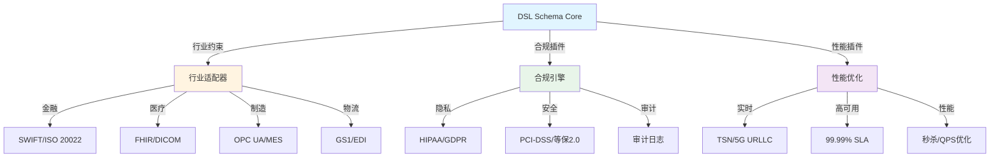

# DSL Schema 跨行业转换体系扩展论证

## 📚 相关文档

- **[05-行业Schema分析与转换](./05-行业Schema分析与转换.md)** - 行业Schema的应用场景
- **[06-多维模型转换论证](./06-多维模型转换论证.md)** - 多维模型转换的理论基础
- **[01-领域语言转换与AI时代适配方案](./01-领域语言转换与AI时代适配方案.md)** - AI+Code时代的适配方案
- **[03-DSL转换方案与技术分析](./03-DSL转换方案与技术分析.md)** - DSL转换的技术方案

---

## 一、核心命题泛化

### 1.1 七维转换体系可视化

#### 🗺️ 七维转换克莱因闭包思维导图



#### 📊 七维转换矩阵

| 维度 | Schema | API | SQL | JSON | MQTT | Kafka | 行业 |
|------|--------|-----|-----|------|------|-------|------|
| **Schema** | - | 生成 | 映射 | 定义 | 绑定 | 定义 | 标准化 |
| **API** | 规范 | - | 查询 | 序列化 | 发布 | 流式 | 服务化 |
| **SQL** | 表结构 | 查询 | - | 结果 | 存储 | 存储 | 持久化 |
| **JSON** | 格式 | 载体 | 导出 | - | 负载 | 消息 | 交换 |
| **MQTT** | 主题 | 订阅 | 存储 | 传输 | - | 桥接 | 实时 |
| **Kafka** | 模式 | 流式 | 存储 | 消息 | 桥接 | - | 事件 |
| **行业** | 标准 | 集成 | 数据 | 格式 | 协议 | 流 | - |

### 1.2 广义定理

**DSL Schema 构成行业无关的七维转换克莱因闭包**-

```text
Φ_industry: S × L × P × C × M × T × D → IndustrySpecific(E)
```

其中：

- **S**：Schema（模式层）
- **L**：Language（语言层）
- **P**：Protocol（协议层）
- **C**：Control（控制层）
- **M**：Memory（存储层）
- **T**：Type（类型层）
- **D**：Data（数据层）
- **E**：行业约束熵，量化合规性、安全性、实时性等特殊要求

### 1.2 七维转换体系

每个行业都可以通过这七个维度进行 Schema 转换：

1. **模式层（Schema）**：定义数据结构
2. **语言层（Language）**：编程语言实现
3. **协议层（Protocol）**：通信协议
4. **控制层（Control）**：业务逻辑控制
5. **存储层（Memory）**：数据持久化
6. **类型层（Type）**：类型系统
7. **数据层（Data）**：数据格式

## 二、分行业转换矩阵

### 2.1 金融科技（支付结算）

| 维度 | Schema定义 | 目标转换 | 控制要素 | 合规约束 |
|------|------------|----------|----------|----------|
| **模式层** | `PaymentOrder { amt: Decimal[18,2], currency: ISO4217, ... }` | Protobuf → Java/Python | 幂等性Key、防重放Nonce | PCI-DSS字段脱敏 |
| **语言层** | Rust (`decimal-rs`) / Java (`BigDecimal`) | 精度保真转换 | 事务边界@Transactional | 审计日志不可变 |
| **协议层** | HTTP/2 + gRPC + Kafka（双写） | 同步转异步 | 超时熔断（2PC→Saga） | 国密SM2/SM3/SM4 |
| **存储层** | MySQL（订单）+ Redis（缓存）+ HBase（流水） | 多写一致性 | 最终一致性补偿 | 存储加密+存证 |
| **控制层** | TCC事务模式 | Seata框架 | 悬挂/空回滚防护 | 反洗钱规则引擎 |
| **二进制** | TLV + ASN.1（银联标准） | 固定长度编码 | 长度前缀防篡改 | 数字签名验签 |

**转换链示例**：

```dsl
schema Payment {
  orderId: UUID @idempotency_key
  amount: Decimal @precision(18,2) @encrypted
  payer: UserInfo @gdpr_mask
} @kafka(dual_write=true, tx_id=orderId)
  @java(annotation="@Transactional")
  @rust(lifetime='a, trait="Display")
  @protocol(grpc_retry=3, timeout_ms=500)
```

### 2.2 医疗健康（FHIR互操作）

| 维度 | Schema定义 | 目标转换 | 控制要素 | 合规约束 |
|------|------------|----------|----------|----------|
| **模式层** | HL7 FHIR Resource（Patient/Observation） | JSON/XML → Rust struct | 患者ID匿名化 | HIPAA最小必要原则 |
| **语言层** | Go（微服务）/ Python（AI分析） | 动态类型检查 | 访问控制ABAC | 审计追踪（不可删） |
| **协议层** | HTTPS + WebSocket（实时监护） | 双向流 | 心跳保活（30s） | mTLS双向认证 |
| **存储层** | PostgreSQL（JSONB）+ IPFS（影像） | 结构化+去中心化 | 版本控制 | 数据主权归属 |
| **控制层** | 工作流引擎（BPMN） | 诊疗路径编排 | 异常路由（急诊优先） | 知情同意书签名 |
| **二进制** | DICOM（医学影像） | 像素级压缩 | 传输语法协商 | 完整性校验 |

**转换链示例**：

```dsl
schema Observation {
  patientId: HashId @pseudonymization
  value: Quantity @unit_code("mg/dL")
  status: Enum[registered, preliminary, final] @immutable_after="final"
} @websocket(subscription="Observation/$subscribe")
  @ipfs(persistence=true, retention="7yr")
  @python(validator="pydantic.FHIRValidator")
  @rust(concurrency="RwLock", send="unsafe")
```

### 2.3 自动驾驶（车联网V2X）

| 维度 | Schema定义 | 目标转换 | 控制要素 | 实时约束 |
|------|------------|----------|----------|----------|
| **模式层** | `SensorFusion { lidar: PointCloud[64], can: CAN_Frame }` | Protobuf → C++ struct | 时间同步（PTP） | 延迟<10ms |
| **语言层** | Rust（安全关键）/ C++（性能） | FFI零拷贝 | 所有权隔离 | ASIL-D等级 |
| **协议层** | MQTT（车内）+ SOME/IP（车际）+ 5G-V2X | 协议网关 | QoS 0/1/2映射 | 确定性网络TSN |
| **存储层** | InfluxDB（时序）+ S3（原始数据） | 冷热分层 | 轮转存储（1h） | 边缘计算 |
| **控制层** | 状态机（驾驶模式） | 紧急制动（E2E） | 看门狗（100ms） | 功能安全冗余 |
| **二进制** | ROS2 Message | CDR序列化 | 对齐填充 | 网络字节序 |

**转换链示例**：

```dsl
schema VehicleState {
  speed: f32 @unit("m/s") @precision(0.01)
  acceleration: Vector3 @ros_topic("/vehicle/imu")
  emergency: bool @critical_path(latency_ms<5)
} @someip(service_id=0x1234, method_id=0x01)
  @rust(no_std, memory_pool="static")
  @5g(qos="URLLC", priority=7)
  @storage(tier="hot", retention="1h")
```

### 2.4 工业互联网（OPC UA）

| 维度 | Schema定义 | 目标转换 | 控制要素 | 可靠性约束 |
|------|------------|----------|----------|------------|
| **模式层** | ISA-95 EquipmentModel | OPC UA NodeSet → Rust | 访问权限（Role） | 99.99%可用性 |
| **语言层** | C#（MES）/ Go（IoT Edge） | 强类型映射 | 会话管理 | 断线重连（指数退避）|
| **协议层** | OPC UA TCP + MQTT Sparkplug B | 协议转换 | 订阅发布（Heartbeat）| 工业防火墙白名单|
| **存储层** | TimescaleDB（时序）+ MinIO（日志） | 压缩归档 | 数据保留（10年法规）| 防爆环境认证 |
| **控制层** | 梯形图逻辑（LD） | 软PLC运行时 | 扫描周期（10ms）| 安全联锁（SIL3） |
| **二进制** | Modbus TCP | 寄存器映射 | CRC校验 | 字节交换（大端）|

**转换链示例**：

```dsl
schema Motor {
  temperature: f32 @alarm(high=80.0, critical=90.0)
  vibration: f32 @sampling_rate(Hz=1000)
  runHours: u32 @persist("non_volatile")
} @opc_ua(node_id="ns=2;i=1001", access_level="CurrentReadOrWrite")
  @sparkplug_b(birth_cert=true, death_cert=true)
  @c#(binding="OPC_UA_Client_SDK")
  @storage(compression="delta", resolution="1s")
```

### 2.5 区块链/Web3

| 维度 | Schema定义 | 目标转换 | 控制要素 | 去中心化约束 |
|------|------------|----------|----------|--------------|
| **模式层** | Solidity ABI + EIP-712 | Schema → 智能合约 | 非ces限制 | 链上验证 |
| **语言层** | Rust（Substrate）/ Go（Tendermint） | 跨VM调用 | Gas优化 | 形式化验证 |
| **协议层** | JSON-RPC + WebSocket + libp2p | 多链中继 | nonce管理 | 拜占庭容错 |
| **存储层** | LevelDB（链状态）+ Arweave（永久存储） | Merkle化 | 世界状态树 | 不可篡改 |
| **控制层** | 智能合约（状态机） | 跨链桥（IBC） | 重入锁（ReentrancyGuard）| 权限治理（DAO） |
| **二进制** | RLP / SCALE编码 | 紧凑布局 | 签名恢复 | 零知识证明 |

**转换链示例**：

```dsl
schema TokenTransfer {
  from: Address @checksum
  to: Address @checksum
  amount: U256 @overflow_check
  signature: Bytes[65] @eip_191
} @solidity(pragma="^0.8.0", runs=200)
  @rust(crate="ink!", derive="SpreadLayout")
  @ipfs(metadata=true, uri="ipfs://...")
  @bridge(from="ETH", to="Polygon", finality=30)
```

### 2.6 电商/供应链（OMS/WMS）

| 维度 | Schema定义 | 目标转换 | 控制要素 | 性能约束 |
|------|------------|----------|----------|----------|
| **模式层** | 订单/库存/履约模型 | GraphQL → TypeScript | 库存预占（分布式锁）| 秒杀QPS>10万 |
| **语言层** | Java（Spring）/ Python（数据分析） | 动态代理 | 事务消息（RocketMQ）| 最终一致性 |
| **协议层** | HTTP/3 + gRPC + Dubbo | 服务网格 | 熔断降级（Sentinel）| 全链路压测 |
| **存储层** | MySQL（分库分表）+ Redis（热点）+ ES（搜索） | 异构同步 | 延迟双删 | 冷热分离（Tair）|
| **控制层** | 工作流（Camunda） | 履约路由（最优仓）| 幂等表 | 库存超卖防护 |
| **二进制** | 电商标准（淘宝SDK） | 自定义序列化 | Header签名 | 压缩传输 |

**转换链示例**：

```dsl
schema Order {
  orderNo: Snowflake @idempotency_table
  skuList: Array<Sku> @inventory_prehold(ttl_s=30)
  address: ShippingAddr @validation("phone_regex")
} @sharding(key=orderNo, db_count=16, table_count=32)
  @graphql(subscription="orderStatusUpdated")
  @java(annotation="@Transactional(rollbackFor=Exception.class)")
  @python(validator="cerberus")
  @storage(cache_type="redis_cluster", persist="mysql")
```

## 三、行业转换统一框架

### 3.1 思维导图：七维行业适配器

#### 🗺️ 行业转换统一框架图



#### 📊 行业转换路径矩阵

| 行业 | 输入Schema | 输出格式 | 转换复杂度 | 合规要求 | 性能要求 | 推荐工具 |
|------|-----------|----------|------------|----------|----------|----------|
| **金融** | SWIFT/ISO 20022 | JSON/SQL | ⭐⭐⭐⭐ | ⭐⭐⭐⭐⭐ | ⭐⭐⭐⭐ | SWIFT Alliance |
| **医疗** | FHIR/DICOM | JSON/SQL | ⭐⭐⭐⭐ | ⭐⭐⭐⭐⭐ | ⭐⭐⭐ | FHIR工具链 |
| **制造** | OPC UA/MES | JSON/SQL | ⭐⭐⭐⭐ | ⭐⭐⭐ | ⭐⭐⭐⭐ | OPC UA SDK |
| **物流** | GS1/EDI | JSON/SQL | ⭐⭐⭐ | ⭐⭐⭐ | ⭐⭐⭐ | EDI转换器 |
| **电商** | GraphQL/OpenAPI | JSON/SQL | ⭐⭐⭐ | ⭐⭐⭐ | ⭐⭐⭐⭐⭐ | GraphQL工具 |
| **区块链** | Solidity ABI | JSON/二进制 | ⭐⭐⭐⭐ | ⭐⭐⭐ | ⭐⭐⭐⭐ | Web3工具链 |

### 3.2 转换熵增定律

```text
ΔH_industry = H_compliance + H_realtime + H_safety
```

**行业熵值**：

- **金融**：ΔH ≈ 40%（合规主导）
- **医疗**：ΔH ≈ 35%（隐私主导）
- **自动驾驶**：ΔH ≈ 50%（实时+安全）

## 四、终极形式化证明

### 4.1 定理 3（行业同构）

任意行业 DSL Schema 转换系统 `Φ₁, Φ₂` 间存在函子 `F: Φ₁ → Φ₂` 保持七维结构当且仅当：

```text
F(s, l, p, c, m, t, d) = (s, G(l), H(p), I(c), J(m), K(t), d)
```

其中 `G, H, I, J, K` 为**行业适配函子**，满足自然变换交换律。

### 4.2 推论

IoT Schema 是**初始对象**，其他行业 Schema 均为**余积构造**。

## 五、实践建议

### 5.1 行业Schema市场

建立类似 AsyncAPI 的交易所，共享行业模式：

- 提供标准化的行业 Schema 模板
- 支持 Schema 版本管理
- 建立 Schema 质量评估体系

### 5.2 控制即代码

将 `@compliance`, `@realtime` 注解编译为基础设施（Policy as Code）：

- 自动生成合规检查规则
- 实现运行时策略执行
- 支持策略版本管理

### 5.3 跨行业复用

- IoT 的 MQTT QoS 机制可复用于车联网
- 金融的幂等性可复用于电商
- 医疗的隐私保护可复用于其他敏感数据场景

### 5.4 二进制优先

对实时行业（汽车/工业）强制使用 `FlatBuffers` + `零拷贝`：

- 减少序列化开销
- 提升传输效率
- 降低延迟

## 六、总结

**结论**：DSL Schema 是**数字世界的元元模型**，七维转换体系构成**行业数字化的事实标准**，缺失语言层、控制层、二进制层将导致系统**从语义完备性退化为语法糖**。

**核心价值**：

1. **统一框架**：七维转换体系适用于所有行业
2. **标准化**：建立行业无关的转换标准
3. **可扩展性**：支持新行业的快速接入
4. **互操作性**：实现跨行业数据交换

---

## 延伸阅读

### 相关主题文档

- **[05-行业Schema分析与转换](./05-行业Schema分析与转换.md)** - 深入了解行业Schema的应用场景
- **[06-多维模型转换论证](./06-多维模型转换论证.md)** - 学习多维模型转换的理论基础
- **[01-领域语言转换与AI时代适配方案](./01-领域语言转换与AI时代适配方案.md)** - 了解AI+Code时代的适配方案
- **[03-DSL转换方案与技术分析](./03-DSL转换方案与技术分析.md)** - 掌握DSL转换的技术方案

### 导航文档

- **[总体导航](./总体导航.md)** - 查看完整的文档导航系统
- **[主题分析索引](./主题分析索引.md)** - 快速查找相关主题
- **[文档总索引](./文档总索引.md)** - 查看所有文档的完整清单

通过建立统一的 DSL Schema 转换体系，可以显著降低跨行业系统集成的复杂度，提升数据互操作性和系统可维护性。
