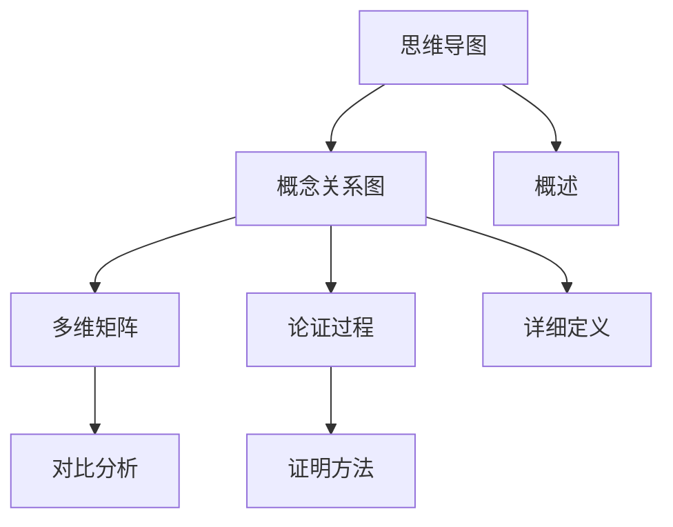

# Diagrams 目录说明

## 📑 目录

- [Diagrams 目录说明](#diagrams-目录说明)
  - [📑 目录](#-目录)
  - [1. 概述](#1-概述)
  - [2. 文档列表](#2-文档列表)
    - [2.1 核心文档（5个）](#21-核心文档5个)
  - [3. 文档关系](#3-文档关系)
  - [4. 使用指南](#4-使用指南)
    - [4.1 阅读顺序](#41-阅读顺序)
    - [4.2 查找特定信息](#42-查找特定信息)
    - [4.3 可视化工具](#43-可视化工具)

---

## 1. 概述

`view/diagrams/` 目录包含项目中所有概念关系图、思维导图、多维矩阵和论证过程总结文档。

**核心目标**：

- 全面梳理项目中所有概念的定义、属性、关系
- 提供多维矩阵对比分析
- 总结所有论证过程
- 使用多种表征方式展示概念关系

---

## 2. 文档列表

### 2.1 核心文档（5个）

1. **`mindmap_dsl_schema_transformation.md`**
   - **内容**：DSL Schema转换思维导图
   - **包含**：思维导图结构、详细分支说明、关系网络图
   - **更新**：已添加概念定义、属性、关系

2. **`comprehensive_concept_relationship.md`**
   - **内容**：项目全面概念关系图
   - **包含**：
     - 核心概念定义（Schema、转换、维度、行业、技术）
     - 概念属性关系矩阵
     - 多维矩阵对比
     - 概念关系网络（继承、组合、依赖、转换）
     - 多表征表现方式（思维导图、矩阵、网络图、层次图）

3. **`proof_process_summary.md`**
   - **内容**：论证过程全面总结
   - **包含**：
     - 论证体系架构
     - 形式化证明方法（传统方法、信息论方法、形式语言理论方法）
     - 核心论证过程（存在性、完备性、正确性、语义等价性、类型安全、约束保持性）
     - 多维度论证整合
     - 论证过程流程图
     - 论证结果总结

4. **`multi_dimensional_comparison_matrix.md`**
   - **内容**：多维矩阵对比文档
   - **包含**：
     - Schema类型多维对比矩阵
     - 行业Schema多维对比矩阵
     - 转换复杂度多维对比矩阵（含详细分析）
     - 标准成熟度多维对比矩阵
     - 工具支持多维对比矩阵
     - 应用场景多维对比矩阵
     - 维度交叉分析
     - 转换规则详细说明和代码示例

5. **`concrete_examples_and_implementations.md`**
   - **内容**：具体示例与实现细节
   - **包含**：
     - Schema具体实例（OpenAPI、IoT、SWIFT、FHIR等完整示例）
     - 转换规则详细实现（3种转换类型的完整代码）
     - 映射规则具体示例（字段、类型、语义映射）
     - 转换算法实现（AST、语义保持、类型安全算法）
     - 实际应用案例（金融、医疗、IoT完整案例）
     - 关系网络具体应用（继承、依赖、工具使用实例）

---

## 3. 文档关系

**文档关系说明**：

1. **思维导图** → **概念关系图**
   - 思维导图提供整体结构
   - 概念关系图提供详细定义和关系

2. **概念关系图** → **多维矩阵**
   - 概念关系图定义概念
   - 多维矩阵对比概念属性

3. **概念关系图** → **论证过程**
   - 概念关系图定义概念
   - 论证过程证明概念正确性

---

## 4. 使用指南

### 4.1 阅读顺序

1. **第一步**：阅读 `mindmap_dsl_schema_transformation.md`
   - 了解整体知识体系结构
   - 理解各个主题之间的关系

2. **第二步**：阅读 `comprehensive_concept_relationship.md`
   - 了解所有核心概念的定义
   - 理解概念之间的属性关系
   - 查看概念关系网络- 了解所有核心概念的定义
   - 理解概念之间的属性关系
   - 查看概念关系网络

3. **第三步**：阅读 `multi_dimensional_comparison_matrix.md`
   - 对比不同Schema类型
   - 对比不同行业Schema
   - 对比不同转换复杂度

4. **第四步**：阅读 `proof_process_summary.md`
   - 了解论证方法
   - 理解论证过程
   - 查看论证结果

5. **第五步**：阅读 `concrete_examples_and_implementations.md`
   - 查看具体Schema实例
   - 学习转换规则实现
   - 理解实际应用案例

### 4.2 查找特定信息

**查找概念定义**：
→ 查看 `comprehensive_concept_relationship.md` 第2节

**查找概念关系**：
→ 查看 `comprehensive_concept_relationship.md` 第5节

**查找对比矩阵**：
→ 查看 `multi_dimensional_comparison_matrix.md`

**查找论证方法**：
→ 查看 `proof_process_summary.md` 第3节

**查找论证过程**：
→ 查看 `proof_process_summary.md` 第4节

**查找具体示例**：
→ 查看 `concrete_examples_and_implementations.md`

**查找转换实现**：
→ 查看 `concrete_examples_and_implementations.md` 第3-5节

### 4.3 可视化工具

**思维导图工具**：

- XMind
- MindMaster
- Mermaid（Markdown支持）

**网络图工具**：

- Mermaid
- PlantUML
- Graphviz

**矩阵工具**：

- Markdown表格
- Excel
- Python pandas

---

**文档版本**：1.0
**创建时间**：2025-01-21
**最后更新**：2025-01-21
**维护者**：DSL Schema研究团队
