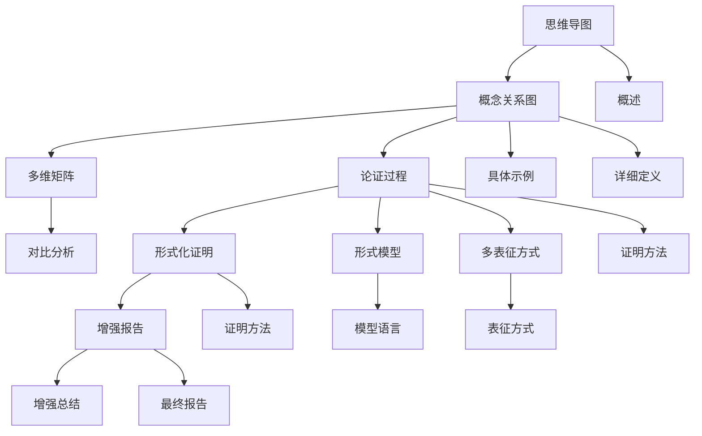

# Diagrams 目录说明

## 📑 目录

- [Diagrams 目录说明](#diagrams-目录说明)
  - [📑 目录](#-目录)
  - [1. 概述](#1-概述)
  - [2. 文档列表](#2-文档列表)
    - [2.1 核心文档（12个）✨ 全部增强](#21-核心文档12个-全部增强)
  - [3. 文档关系](#3-文档关系)
  - [4. 使用指南](#4-使用指南)
    - [4.1 阅读顺序](#41-阅读顺序)
    - [4.2 查找特定信息](#42-查找特定信息)
    - [4.3 可视化工具](#43-可视化工具)
  - [5. 文档更新历史](#5-文档更新历史)
    - [5.1 最新更新（2025-01-21）⭐ 概念体系与思维表征增强](#51-最新更新2025-01-21-概念体系与思维表征增强)
    - [5.1.1 历史更新记录](#511-历史更新记录)
    - [5.2 文档版本](#52-文档版本)

---

## 1. 概述

`view/diagrams/` 目录包含项目中所有概念关系图、思维导图、多维矩阵和论证过程总结文档。

**核心目标**：

- 全面梳理项目中所有概念的定义、属性、关系
- 提供多维矩阵对比分析
- 总结所有论证过程
- 使用多种表征方式展示概念关系

---

## 2. 文档列表

### 2.1 核心文档（12个）✨ 全部增强

**最新更新**：`transformation_formal_proofs_comprehensive.md` 已升级至 **v3.0完整增强版**

**最新更新**：`transformation_formal_proofs_comprehensive.md` 已升级至 **v2.0增强版**

1. **`mindmap_dsl_schema_transformation.md`**
   - **内容**：DSL Schema转换思维导图
   - **包含**：思维导图结构、详细分支说明、关系网络图
   - **更新**：已添加概念定义、属性、关系

2. **`comprehensive_concept_relationship.md`**
   - **内容**：项目全面概念关系图
   - **包含**：
     - 核心概念定义（Schema、转换、维度、行业、技术）
     - 概念属性关系矩阵
     - 多维矩阵对比
     - 概念关系网络（继承、组合、依赖、转换）
     - 多表征表现方式（思维导图、矩阵、网络图、层次图）
     - **新增**：缺失Schema说明（第7章，16个企业级Schema）
     - **新增**：标准成熟度对比矩阵更新（11个缺失标准）
     - **参考**：`CRITICAL_EVALUATION_AND_IMPROVEMENT_PLAN.md`

3. **`proof_process_summary.md`**
   - **内容**：论证过程全面总结
   - **包含**：
     - 论证体系架构
     - 形式化证明方法（传统方法、信息论方法、形式语言理论方法）
     - 核心论证过程（存在性、完备性、正确性、语义等价性、类型安全、约束保持性）
     - 多维度论证整合
     - 论证过程流程图
     - 论证结果总结

4. **`multi_dimensional_comparison_matrix.md`**
   - **内容**：多维矩阵对比文档
   - **包含**：
     - Schema类型多维对比矩阵
     - 行业Schema多维对比矩阵
     - 转换复杂度多维对比矩阵（含详细分析）
     - 标准成熟度多维对比矩阵
     - 工具支持多维对比矩阵
     - 应用场景多维对比矩阵
     - 维度交叉分析
     - 转换规则详细说明和代码示例

5. **`concrete_examples_and_implementations.md`**
   - **内容**：具体示例与实现细节
   - **包含**：
     - Schema具体实例（OpenAPI、IoT、SWIFT、FHIR等完整示例）
     - 转换规则详细实现（3种转换类型的完整代码）
     - 映射规则具体示例（字段、类型、语义映射）
     - 转换算法实现（AST、语义保持、类型安全算法）
     - 实际应用案例（金融、医疗、IoT完整案例）
     - 关系网络具体应用（继承、依赖、工具使用实例）

6. **`transformation_formal_proofs_comprehensive.md`** ⭐最新增强
   - **内容**：转换形式化证明综合文档（v2.0增强版）
   - **包含**：
     - **新增**：概念定义、属性与关系体系（基于语义网络和框架表示法）
     - **新增**：推理方法体系（演绎、归纳、默认推理）
     - **新增**：思维表征方式（思维导图、决策树图、证明树图）
     - **新增**：分层逻辑模型（五层抽象架构、层次化证明体系）
     - **新增**：多维矩阵对比体系（证明方法、转换类型、概念属性对比）
     - 形式化模型基础（Schema、转换函数、形式语言模型）
     - 转换正确性形式化证明（OpenAPI↔AsyncAPI、MQTT→OpenAPI、JSON Schema→SQL等）
     - 语义等价性形式化证明（语义函数定义、语义等价性定理、证明方法）
     - 类型安全形式化证明（类型系统形式化、类型安全定理、证明步骤）
     - 约束保持性形式化证明（约束系统形式化、约束保持性定理、证明步骤）
     - 信息论证明方法（信息熵定义、信息守恒定理、信息损失量化）
     - 形式语言理论证明方法（语法转换完备性、语义转换正确性、语法-语义一致性）
     - 多维度证明整合（证明方法对比矩阵、综合验证框架）
     - 实际转换案例证明（SWIFT MT103→ISO 20022、HL7 v2→FHIR、MQTT→OpenAPI、IoT Schema→AsyncAPI、MQTT→AsyncAPI）
     - **新增**：综合思维表征与逻辑模型（完整证明流程、决策树、分层证明树、概念关系网络）
     - **新增**：最新理论参考（2024-2025年最新研究成果）
     - **v2.1新增**：工具与实践指南（形式化验证工具、Schema转换工具、思维表征工具、实践指南、工具集成示例）
     - **v2.2新增**：术语表与索引（30+个核心术语、快速查找索引、交叉引用索引）
     - **v2.3新增**：快速入门指南（4个场景的完整指南、按需求和角色的快速定位）
     - **v2.4新增**：扩展常见问题（从4个增加到10个问题）、扩展参考资源（学术期刊、会议论文、在线资源）
     - **v2.5新增**：最佳实践与模式总结（5个实践模式、综合最佳实践矩阵、3个反模式）
     - **v2.6新增**：扩展实际案例（从4个增加到16个，添加12个快速参考案例和案例快速查找表）
     - **v2.7新增**：附录章节（5个附录：数学符号与公式速查、工具命令速查、常见错误与解决方案、扩展阅读推荐、术语中英文对照）
     - **v2.8新增**：快速参考卡片（6个快速参考卡片：证明方法选择、工具选择、验证流程、常见问题、案例查找、公式速查）
     - **v2.9新增**：文档使用指南（4个阅读路径、4个角色指南、4个任务指南、5个导航技巧）
     - **v3.0新增**：文档总结（核心内容总结、关键成果、应用价值、未来展望）
     - **详细报告**：请查看 [ENHANCEMENT_V2_SUMMARY.md](./ENHANCEMENT_V2_SUMMARY.md)、[COMPREHENSIVE_ENHANCEMENT_FINAL_REPORT.md](./COMPREHENSIVE_ENHANCEMENT_FINAL_REPORT.md)、[FINAL_V2_COMPLETE_REPORT.md](./FINAL_V2_COMPLETE_REPORT.md) 和 [FINAL_V24_COMPLETE_SUMMARY.md](./FINAL_V24_COMPLETE_SUMMARY.md)

7. **`formal_models_and_languages_comprehensive.md`** ⭐新增
   - **内容**：形式模型与形式语言全面梳理
   - **包含**：
     - 形式模型体系（Schema、转换、语义、类型系统、约束系统形式模型）
     - 形式语言体系（Chomsky层次结构、Schema形式语言分类、形式文法定义、语法分析理论）
     - 形式模型对比矩阵（Schema、转换、语义形式模型对比）
     - 形式语言对比矩阵（形式语言类型、形式文法复杂度、语法分析复杂度对比）
     - 形式模型关系网络（模型继承、组合、转换关系）
     - 形式语言关系网络（语言包含、转换、等价关系）
     - 形式化证明方法（模型正确性、语言等价性、转换正确性证明）
     - 实际应用案例（OpenAPI、JSON Schema、转换形式模型应用）

8. **`multi_representation_comprehensive.md`** ⭐新增
   - **内容**：多表征方式综合文档
   - **包含**：
     - 思维导图表征（Schema转换、形式模型、形式语言思维导图）
     - 矩阵对比表征（Schema类型、转换复杂度、形式模型、形式语言对比矩阵）
     - 网络图表征（概念关系、转换关系、形式模型关系网络图）
     - 层次图表征（Schema、转换、形式语言层次结构图）
     - 形式化证明表征（证明树、证明流程图、证明矩阵）
     - 多表征方式整合（表征方式对比矩阵、综合表征框架）
     - 实际应用案例（OpenAPI转换、JSON Schema转换多表征案例）

9. **`ENHANCEMENT_V2_SUMMARY.md`** ⭐新增
   - **内容**：v2.0增强版详细总结
   - **包含**：
     - 更新内容详细说明
     - 统计信息（新增章节、内容、图表、矩阵）
     - 核心亮点
     - 改进效果
     - 后续计划

10. **`COMPREHENSIVE_ENHANCEMENT_FINAL_REPORT.md`** ⭐新增
    - **内容**：全面增强最终报告
    - **包含**：
      - 完成统计
      - 核心改进
      - 质量提升
      - 使用指南
      - 理论贡献
      - 更新日志

11. **`FINAL_V2_COMPLETE_REPORT.md`** ⭐新增
    - **内容**：v2.1完整版最终报告
    - **包含**：
      - 最终统计
      - 完成工作清单
      - 核心亮点
      - 质量提升
      - 版本历史
      - 使用指南

12. **`FINAL_V24_COMPLETE_SUMMARY.md`** ⭐新增
    - **内容**：v2.4完整增强版最终总结
    - **包含**：
      - 最终统计（v2.4版本）
      - 完成工作清单（8个主要部分）
      - 核心亮点（8个维度）
      - 质量提升对比
      - 完整版本历史

---

## 3. 文档关系

**文档关系说明**：

1. **思维导图** → **概念关系图**
   - 思维导图提供整体结构
   - 概念关系图提供详细定义和关系

2. **概念关系图** → **多维矩阵**
   - 概念关系图定义概念
   - 多维矩阵对比概念属性

3. **概念关系图** → **论证过程**
   - 概念关系图定义概念
   - 论证过程证明概念正确性

4. **论证过程** → **形式化证明**
   - 论证过程提供证明框架
   - 形式化证明提供详细证明过程

5. **论证过程** → **形式模型**
   - 论证过程使用形式模型
   - 形式模型提供理论基础

6. **论证过程** → **多表征方式**
   - 论证过程使用多种表征方式
   - 多表征方式提供可视化展示

---

## 4. 使用指南

### 4.1 阅读顺序

1. **第一步**：阅读 `mindmap_dsl_schema_transformation.md`
   - 了解整体知识体系结构
   - 理解各个主题之间的关系

2. **第二步**：阅读 `comprehensive_concept_relationship.md`
   - 了解所有核心概念的定义
   - 理解概念之间的属性关系
   - 查看概念关系网络

3. **第三步**：阅读 `multi_dimensional_comparison_matrix.md`
   - 对比不同Schema类型
   - 对比不同行业Schema
   - 对比不同转换复杂度

4. **第四步**：阅读 `proof_process_summary.md`
   - 了解论证方法
   - 理解论证过程
   - 查看论证结果

5. **第五步**：阅读 `concrete_examples_and_implementations.md`
   - 查看具体Schema实例
   - 学习转换规则实现
   - 理解实际应用案例

6. **第六步**：阅读 `transformation_formal_proofs_comprehensive.md` ⭐推荐
   - **第0章**：了解概念定义、属性与关系体系
   - **第0.3节**：学习推理方法（演绎、归纳、默认推理）
   - **第0.4节**：查看思维表征方式（思维导图、决策树、证明树）
   - **第0.5节**：理解分层逻辑模型（五层抽象架构）
   - **第0.6节**：查看多维矩阵对比
   - **第2-10章**：学习形式化证明方法
   - **第11章**：查看综合思维表征与逻辑模型

7. **第七步**：阅读 `formal_models_and_languages_comprehensive.md`
   - 了解形式模型体系（17个形式模型）
   - 理解形式语言体系（5种形式语言）
   - 查看形式模型和形式语言的关系网络

8. **第八步**：阅读 `multi_representation_comprehensive.md`
   - 了解多种表征方式（思维导图、矩阵、网络图、层次图、形式化证明）
   - 理解不同表征方式的应用场景
   - 查看实际应用案例的多表征展示

### 4.2 查找特定信息

**查找概念定义**：
→ 查看 `comprehensive_concept_relationship.md` 第2节

**查找概念关系**：
→ 查看 `comprehensive_concept_relationship.md` 第5节

**查找对比矩阵**：
→ 查看 `multi_dimensional_comparison_matrix.md`

**查找论证方法**：
→ 查看 `proof_process_summary.md` 第3节

**查找论证过程**：
→ 查看 `proof_process_summary.md` 第4节

**查找具体示例**：
→ 查看 `concrete_examples_and_implementations.md`

**查找转换实现**：
→ 查看 `concrete_examples_and_implementations.md` 第3-5节

**查找形式化证明**：
→ 查看 `transformation_formal_proofs_comprehensive.md`
→ **v2.0新增**：概念定义体系（第0章）、综合思维表征（第11章）

**查找概念定义和思维表征**：
→ 查看 `transformation_formal_proofs_comprehensive.md` 第0章和第11章

**查找增强报告**：
→ 查看 `ENHANCEMENT_V2_SUMMARY.md` 和 `COMPREHENSIVE_ENHANCEMENT_FINAL_REPORT.md`

**查找形式模型和形式语言**：
→ 查看 `formal_models_and_languages_comprehensive.md`

**查找多表征方式**：
→ 查看 `multi_representation_comprehensive.md`

### 4.3 可视化工具

**思维导图工具**：

- XMind
- MindMaster
- Mermaid（Markdown支持）

**网络图工具**：

- Mermaid
- PlantUML
- Graphviz

**矩阵工具**：

- Markdown表格
- Excel
- Python pandas

---

## 5. 文档更新历史

### 5.1 最新更新（2025-01-21）⭐ 概念体系与思维表征增强

**详细报告**：请查看 [ENHANCEMENT_V2_SUMMARY.md](./ENHANCEMENT_V2_SUMMARY.md)

**v2.0增强版更新内容**：

1. **概念定义体系**
   - ✅ 基于语义网络和框架表示法的完整概念定义
   - ✅ Schema概念框架（结构、语义、约束、元数据属性）
   - ✅ 转换概念框架（映射、验证、优化规则）
   - ✅ 概念属性关系网络

2. **推理方法体系**
   - ✅ 演绎推理（Deductive Reasoning）
   - ✅ 归纳推理（Inductive Reasoning）
   - ✅ 默认推理（Default Reasoning）
   - ✅ 各推理方法的形式化定义和应用场景

3. **思维表征方式**
   - ✅ 思维导图（Mind Map）- 完整证明流程
   - ✅ 决策树图（Decision Tree）- 转换方法选择
   - ✅ 证明树图（Proof Tree）- 语义等价性证明
   - ✅ 概念关系网络（完整版）

4. **分层逻辑模型**
   - ✅ 五层抽象架构（语法层、类型层、约束层、语义层、应用层）
   - ✅ 层次化证明体系
   - ✅ 逻辑模型形式化定义
   - ✅ 层次间关系形式化

5. **多维矩阵对比**
   - ✅ 证明方法对比矩阵
   - ✅ 转换类型对比矩阵
   - ✅ 概念属性对比矩阵
   - ✅ 三维矩阵（概念-属性-关系、证明方法-层次-复杂度、思维表征-适用场景-效果）

6. **综合验证框架**
   - ✅ 五层验证流程
   - ✅ 错误处理和重试机制
   - ✅ 综合证明框架

**更新统计**：

- 新增章节：7个主要章节（第0章 + 第11章）
- 新增内容：约1,500行
- 新增图表：15+个（思维导图、决策树、证明树、关系网络、分层架构等）
- 新增矩阵：8个多维对比矩阵
- 新增文档：2个（增强总结、最终报告）
- 理论对齐：2024-2025年最新研究成果

**详细统计**：

- 概念定义体系：约300行
- 推理方法体系：约100行
- 思维表征方式：约200行
- 分层逻辑模型：约150行
- 多维矩阵对比：约100行
- 综合思维表征：约400行
- 其他内容：约250行

### 5.1.1 历史更新记录

- ✅ 添加了3个新文档的详细说明
- ✅ 更新了阅读顺序（添加了第6-8步）
- ✅ 更新了文档关系图（添加了新文档的关系）
- ✅ 更新了查找特定信息部分（添加了新文档的引用）
- ✅ 修复了重复内容

### 5.2 文档版本

**文档版本**：1.1
**创建时间**：2025-01-21
**最后更新**：2025-01-21
**维护者**：DSL Schema研究团队
