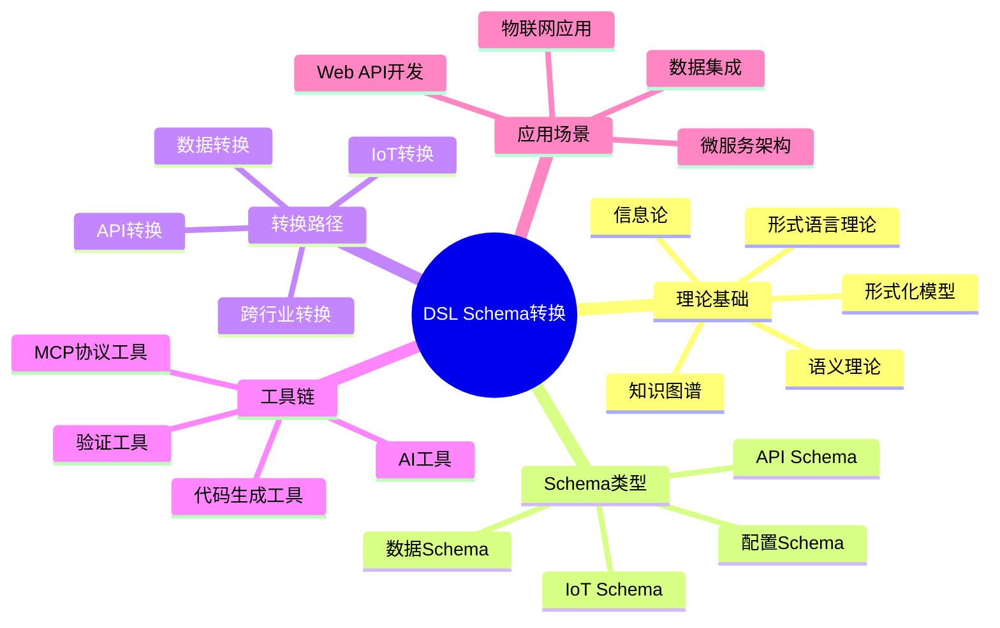
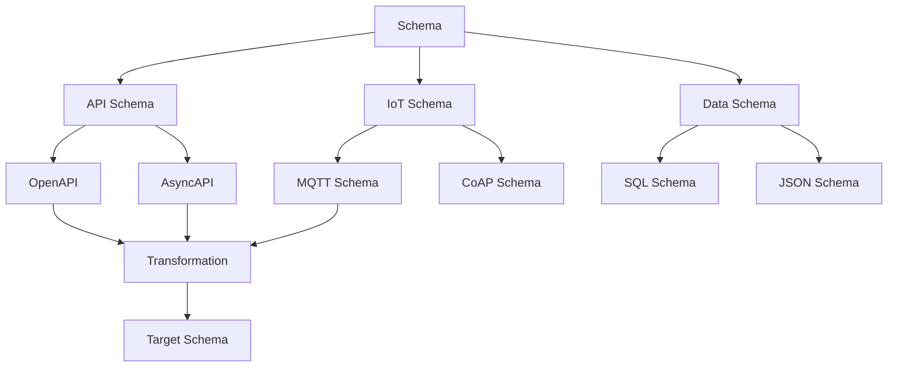

# 项目全面概念关系图

## 📑 目录

- [项目全面概念关系图](#项目全面概念关系图)
  - [📑 目录](#-目录)
  - [1. 概述](#1-概述)
  - [2. 核心概念定义](#2-核心概念定义)
    - [2.1 Schema相关概念](#21-schema相关概念)
      - [2.1.1 Schema（模式）](#211-schema模式)
      - [2.1.2 API Schema](#212-api-schema)
      - [2.1.3 IoT Schema](#213-iot-schema)
      - [2.1.4 数据Schema](#214-数据schema)
      - [2.1.5 配置Schema](#215-配置schema)
    - [2.2 转换相关概念](#22-转换相关概念)
      - [2.2.1 Transformation（转换）](#221-transformation转换)
      - [2.2.2 Mapping Rule（映射规则）](#222-mapping-rule映射规则)
      - [2.2.3 Conversion Function（转换函数）](#223-conversion-function转换函数)
    - [2.3 维度相关概念](#23-维度相关概念)
      - [2.3.1 Dimension（维度）](#231-dimension维度)
      - [2.3.2 Multi-Dimensional Model（多维模型）](#232-multi-dimensional-model多维模型)
    - [2.4 行业相关概念](#24-行业相关概念)
      - [2.4.1 Industry Schema（行业Schema）](#241-industry-schema行业schema)
      - [2.4.2 Cross-Industry Conversion（跨行业转换）](#242-cross-industry-conversion跨行业转换)
    - [2.5 技术相关概念](#25-技术相关概念)
      - [2.5.1 Protocol（协议）](#251-protocol协议)
      - [2.5.2 Standard（标准）](#252-standard标准)
      - [2.5.3 Tool（工具）](#253-tool工具)
  - [3. 概念属性关系](#3-概念属性关系)
    - [3.1 Schema属性矩阵](#31-schema属性矩阵)
    - [3.2 转换属性矩阵](#32-转换属性矩阵)
    - [3.3 维度属性矩阵](#33-维度属性矩阵)
  - [4. 多维矩阵对比](#4-多维矩阵对比)
    - [4.1 Schema类型对比矩阵](#41-schema类型对比矩阵)
    - [4.2 行业Schema对比矩阵](#42-行业schema对比矩阵)
    - [4.3 转换复杂度对比矩阵](#43-转换复杂度对比矩阵)
    - [4.4 标准成熟度对比矩阵](#44-标准成熟度对比矩阵)
  - [5. 概念关系网络](#5-概念关系网络)
    - [5.1 继承关系](#51-继承关系)
    - [5.2 组合关系](#52-组合关系)
    - [5.3 依赖关系](#53-依赖关系)
    - [5.4 转换关系](#54-转换关系)
  - [6. 多表征表现方式](#6-多表征表现方式)
    - [6.1 思维导图表征](#61-思维导图表征)
    - [6.2 矩阵表征](#62-矩阵表征)
    - [6.3 网络图表征](#63-网络图表征)
    - [6.4 层次图表征](#64-层次图表征)
  - [7. 缺失Schema说明](#7-缺失schema说明)
    - [7.1 企业级Schema缺失情况](#71-企业级schema缺失情况)
      - [7.1.1 企业财务Schema（8个）](#711-企业财务schema8个)
      - [7.1.2 数据分析Schema（5个）](#712-数据分析schema5个)
      - [7.1.3 企业绩效管理Schema（3个）](#713-企业绩效管理schema3个)
    - [7.2 改进计划](#72-改进计划)
    - [7.3 相关文档](#73-相关文档)

---

## 1. 概述

本文档全面梳理项目中所有涉及的概念关系，包括：

- **概念定义**：所有核心概念的准确定义
- **属性关系**：每个概念的属性及其关系
- **多维矩阵**：不同维度的对比矩阵
- **关系网络**：概念之间的复杂关系
- **多表征方式**：多种表现方式的可视化

---

## 2. 核心概念定义

### 2.1 Schema相关概念

#### 2.1.1 Schema（模式）

**定义**：Schema是描述数据结构、约束和语义的形式化规范。

**形式化定义**：

```text
Schema = (Structure, Constraints, Semantics, Metadata)
```

**属性**：

- `structure`：结构定义（字段、类型、嵌套）
- `constraints`：约束规则（必填、唯一、范围、格式）
- `semantics`：语义定义（业务含义、关系）
- `metadata`：元数据（版本、标准、作者）

**关系**：

- `Schema` → `Type`：包含类型定义
- `Schema` → `Constraint`：包含约束规则
- `Schema` → `Standard`：遵循标准规范

#### 2.1.2 API Schema

**定义**：描述API接口的Schema，包括请求/响应结构、参数、路径等。

**形式化定义**：

```text
API_Schema = (Paths, Components, Security, Servers, Info)
```

**属性**：

- `paths`：API路径定义
- `components`：组件定义（schemas、responses、parameters）
- `security`：安全定义
- `servers`：服务器定义
- `info`：API信息（标题、版本、描述）

**子类型**：

- `OpenAPI_Schema`：RESTful API描述
- `AsyncAPI_Schema`：异步API描述
- `GraphQL_Schema`：GraphQL查询Schema

**关系**：

- `API_Schema` → `HTTP_Method`：使用HTTP方法
- `API_Schema` → `Data_Format`：使用数据格式（JSON、XML）
- `API_Schema` → `Protocol`：使用协议（HTTP、WebSocket）

#### 2.1.3 IoT Schema

**定义**：描述物联网设备和数据的Schema，包括设备属性、传感器数据、控制命令等。

**形式化定义**：

```text
IoT_Schema = (Device_Info, Sensor_Data, Control_Commands,
              Communication_Protocol, Metadata)
```

**属性**：

- `device_info`：设备信息（ID、类型、位置）
- `sensor_data`：传感器数据（时间序列、数据类型）
- `control_commands`：控制命令（动作、参数）
- `communication_protocol`：通信协议（MQTT、CoAP、HTTP）
- `metadata`：元数据（时间戳、位置、质量）

**子类型**：

- `Sensor_Schema`：传感器数据Schema
- `Control_Schema`：控制命令Schema
- `Message_Queue_Schema`：消息队列Schema

**关系**：

- `IoT_Schema` → `Device`：描述设备
- `IoT_Schema` → `Protocol`：使用协议
- `IoT_Schema` → `Time_Series`：包含时间序列数据

**具体实例**：

```json
{
  "device_id": "sensor-001",
  "device_type": "temperature_sensor",
  "timestamp": "2025-01-21T10:30:00Z",
  "location": {
    "latitude": 39.9042,
    "longitude": 116.4074
  },
  "sensor_data": {
    "temperature": {
      "value": 25.5,
      "unit": "celsius",
      "quality": "good"
    }
  },
  "metadata": {
    "firmware_version": "1.2.3",
    "battery_level": 85
  }
}
```

**MQTT主题结构实例**：

```text
sensors/{device_type}/{device_id}/data    # 传感器数据
sensors/{device_type}/{device_id}/control # 控制命令
sensors/{device_type}/{device_id}/status  # 设备状态
```

**属性详细说明**：

- **device_info属性**：
  - `device_id`：设备唯一标识符
  - `device_type`：设备类型（温度传感器、湿度传感器等）
  - `location`：设备位置（GPS坐标、地址等）
- **sensor_data属性**：
  - `value`：传感器测量值
  - `unit`：测量单位（celsius、percent、pascal等）
  - `quality`：数据质量（good、bad、uncertain等）
  - `range`：有效范围（min、max）
- **communication_protocol属性**：
  - MQTT：发布-订阅消息协议
  - CoAP：轻量级HTTP协议
  - HTTP：RESTful API协议

#### 2.1.4 数据Schema

**定义**：描述数据存储结构的Schema，包括表结构、字段类型、索引、约束等。

**形式化定义**：

```text
Data_Schema = (Tables, Columns, Indexes, Constraints, Views)
```

**属性**：

- `tables`：表定义
- `columns`：列定义（名称、类型、约束）
- `indexes`：索引定义
- `constraints`：约束定义（主键、外键、唯一、检查）
- `views`：视图定义

**子类型**：

- `SQL_Schema`：关系型数据库Schema
- `NoSQL_Schema`：非关系型数据库Schema
- `JSON_Schema`：JSON数据验证Schema

**关系**：

- `Data_Schema` → `Database`：描述数据库结构
- `Data_Schema` → `Table`：包含表定义
- `Data_Schema` → `Type`：使用数据类型

#### 2.1.5 配置Schema

**定义**：描述配置文件的Schema，包括配置项、值类型、验证规则等。

**形式化定义**：

```text
Config_Schema = (Config_Items, Value_Types, Validation_Rules,
                 Dependencies, Defaults)
```

**属性**：

- `config_items`：配置项定义
- `value_types`：值类型定义
- `validation_rules`：验证规则
- `dependencies`：依赖关系
- `defaults`：默认值

**子类型**：

- `Kubernetes_YAML`：K8s配置Schema
- `Terraform_HCL`：Terraform配置Schema
- `Ansible_YAML`：Ansible配置Schema

**关系**：

- `Config_Schema` → `Infrastructure`：描述基础设施配置
- `Config_Schema` → `Tool`：用于工具配置

### 2.2 转换相关概念

#### 2.2.1 Transformation（转换）

**定义**：将源Schema转换为目标Schema的过程。

**形式化定义**：

```text
Transformation = (Source_Schema, Target_Schema,
                  Mapping_Rules, Conversion_Function)
```

**属性**：

- `source_schema`：源Schema
- `target_schema`：目标Schema
- `mapping_rules`：映射规则
- `conversion_function`：转换函数

**关系**：

- `Transformation` → `Schema`：转换Schema
- `Transformation` → `Mapping_Rule`：使用映射规则
- `Transformation` → `Algorithm`：使用转换算法

**具体实现示例**：

```python
class Transformation:
    """转换类实现"""
    def __init__(self, source_schema, target_schema):
        self.source_schema = source_schema
        self.target_schema = target_schema
        self.mapping_rules = []
        self.conversion_function = None

    def transform(self, source_data: dict) -> dict:
        """执行转换"""
        target_data = {}
        for rule in self.mapping_rules:
            source_value = get_value_by_path(source_data, rule.source_path)
            target_value = self.conversion_function.transform(source_value, rule)
            set_value_by_path(target_data, rule.target_path, target_value)
        return target_data
```

**实际应用案例**：

- **OpenAPI到AsyncAPI转换**：将RESTful API转换为异步消息API
- **MQTT到OpenAPI转换**：将IoT设备数据转换为RESTful API
- **JSON Schema到SQL Schema转换**：将JSON Schema转换为数据库表结构

#### 2.2.2 Mapping Rule（映射规则）

**定义**：定义源Schema到目标Schema的映射关系。

**形式化定义**：

```text
Mapping_Rule = (Source_Path, Target_Path,
                Transformation_Type, Constraints)
```

**属性**：

- `source_path`：源路径
- `target_path`：目标路径
- `transformation_type`：转换类型（直接映射、函数映射、条件映射）
- `constraints`：约束条件

**关系**：

- `Mapping_Rule` → `Field`：映射字段
- `Mapping_Rule` → `Transformation`：用于转换

**具体实现示例**：

```python
class MappingRule:
    """映射规则实现"""
    def __init__(self, source_path: str, target_path: str,
                 transformation_type: str = "direct"):
        self.source_path = source_path
        self.target_path = target_path
        self.transformation_type = transformation_type
        self.constraints = {}

    def apply(self, source_value: Any) -> Any:
        """应用映射规则"""
        if self.transformation_type == "direct":
            return source_value
        elif self.transformation_type == "function":
            return self.apply_function(source_value)
        else:
            return source_value
```

**实际应用案例**：

- **字段直接映射**：`user.email` → `user.email`（类型相同）
- **字段函数映射**：`user.birth_date` (YYYY-MM-DD) → `user.age` (计算年龄)
- **字段条件映射**：`user.status` ("active"/"inactive") → `user.is_active` (true/false)

#### 2.2.3 Conversion Function（转换函数）

**定义**：执行Schema转换的函数。

**形式化定义**：

```text
Conversion_Function: Source_Schema → Target_Schema
```

**属性**：

- `input_type`：输入类型
- `output_type`：输出类型
- `algorithm`：算法实现
- `error_handling`：错误处理

**关系**：

- `Conversion_Function` → `Transformation`：执行转换
- `Conversion_Function` → `Algorithm`：使用算法

**具体实现示例**：

```python
class ConversionFunction:
    """转换函数实现"""
    def __init__(self, algorithm: str):
        self.algorithm = algorithm

    def execute(self, source_schema: dict, target_schema: dict,
                mapping_rules: List[MappingRule]) -> dict:
        """执行转换"""
        if self.algorithm == "ast_based":
            return self.ast_based_conversion(source_schema, target_schema, mapping_rules)
        elif self.algorithm == "template_based":
            return self.template_based_conversion(source_schema, target_schema, mapping_rules)
        else:
            raise ValueError(f"Unknown algorithm: {self.algorithm}")

    def ast_based_conversion(self, source_schema, target_schema, mapping_rules):
        """基于AST的转换"""
        source_ast = parse_to_ast(source_schema)
        target_ast = transform_ast(source_ast, mapping_rules)
        return ast_to_schema(target_ast)
```

**实际应用案例**：

- **OpenAPI到AsyncAPI转换函数**：使用AST算法转换REST API到异步API
- **MQTT到OpenAPI转换函数**：使用模板算法转换MQTT消息到REST API
- **JSON Schema到SQL Schema转换函数**：使用规则算法转换JSON Schema到SQL DDL

### 2.3 维度相关概念

#### 2.3.1 Dimension（维度）

**定义**：描述数据的某个方面的属性。

**形式化定义**：

```text
Dimension = (Name, Type, Values, Constraints)
```

**属性**：

- `name`：维度名称
- `type`：维度类型（时间、空间、业务、技术）
- `values`：维度值集合
- `constraints`：约束条件

**子类型**：

- `Time_Dimension`：时间维度
- `Space_Dimension`：空间维度
- `Business_Dimension`：业务维度
- `Technical_Dimension`：技术维度

**关系**：

- `Dimension` → `Data`：描述数据属性
- `Dimension` → `Conversion`：用于维度转换

#### 2.3.2 Multi-Dimensional Model（多维模型）

**定义**：包含多个维度的数据模型。

**形式化定义**：

```text
Multi_Dimensional_Model = (Dimensions, Facts, Measures, Hierarchies)
```

**属性**：

- `dimensions`：维度集合
- `facts`：事实表
- `measures`：度量值
- `hierarchies`：层次结构

**关系**：

- `Multi_Dimensional_Model` → `Dimension`：包含维度
- `Multi_Dimensional_Model` → `Data_Warehouse`：用于数据仓库

### 2.4 行业相关概念

#### 2.4.1 Industry Schema（行业Schema）

**定义**：特定行业领域的Schema定义。

**形式化定义**：

```text
Industry_Schema = (Domain_Concepts, Business_Rules,
                   Standards, Data_Formats)
```

**属性**：

- `domain_concepts`：领域概念
- `business_rules`：业务规则
- `standards`：行业标准
- `data_formats`：数据格式

**子类型**（25个行业）：

- `Financial_Schema`：金融行业Schema
- `Healthcare_Schema`：医疗行业Schema
- `Logistics_Schema`：物流行业Schema
- `Manufacturing_Schema`：制造行业Schema
- ...（共25个行业）

**缺失的企业级Schema**（16个，详见`CRITICAL_EVALUATION_AND_IMPROVEMENT_PLAN.md`）：

**企业财务Schema**（8个）：

- `Accounting_Schema`：会计Schema（财务会计、管理会计、成本会计、税务会计）
- `Budget_Management_Schema`：预算管理Schema（预算编制、执行、控制、分析）
- `Cost_Accounting_Schema`：成本会计Schema（作业成本法、标准成本法、实际成本法）
- `Management_Accounting_Schema`：管理会计Schema（责任中心、预算差异分析、绩效评价）
- `XBRL_Schema`：XBRL Schema（分类标准、实例文档、链接库）
- `Financial_Reporting_Schema`：财务报告Schema（资产负债表、利润表、现金流量表）
- `Tax_Accounting_Schema`：税务会计Schema（税务申报、税务计算、税务合规）
- `Audit_Schema`：审计Schema（审计证据、审计程序、内部控制）

**数据分析Schema**（5个）：

- `Data_Analytics_Schema`：数据分析Schema（描述性、预测性、规范性、诊断性分析）
- `Business_Intelligence_Schema`：商业智能Schema（OLAP Cube、数据挖掘、报表生成、仪表板）
- `Data_Warehouse_Schema`：数据仓库Schema（星型模式、雪花模式、事实表、维度表）
- `ETL_Schema`：ETL Schema（数据提取、转换、加载）
- `Data_Lake_Schema`：数据湖Schema（原始数据存储、数据分区、数据目录）

**企业绩效管理Schema**（3个）：

- `EPM_Schema`：企业绩效管理Schema（预算规划、财务规划、预测分析、场景分析）
- `KPI_Schema`：关键绩效指标Schema（KPI定义、监控、分析）
- `Balanced_Scorecard_Schema`：平衡计分卡Schema（财务、客户、内部流程、学习成长维度）

**关系**：

- `Industry_Schema` → `Standard`：遵循行业标准
- `Industry_Schema` → `Domain`：描述行业领域

#### 2.4.2 Cross-Industry Conversion（跨行业转换）

**定义**：不同行业Schema之间的转换。

**形式化定义**：

```text
Cross_Industry_Conversion = (Source_Industry_Schema,
                            Target_Industry_Schema,
                            Mapping_Rules, Adapter)
```

**属性**：

- `source_industry_schema`：源行业Schema
- `target_industry_schema`：目标行业Schema
- `mapping_rules`：映射规则
- `adapter`：适配器

**关系**：

- `Cross_Industry_Conversion` → `Industry_Schema`：转换行业Schema
- `Cross_Industry_Conversion` → `Adapter`：使用适配器

### 2.5 技术相关概念

#### 2.5.1 Protocol（协议）

**定义**：定义通信规则和格式的规范。

**形式化定义**：

```text
Protocol = (Message_Format, Communication_Rules,
           Error_Handling, Security)
```

**属性**：

- `message_format`：消息格式
- `communication_rules`：通信规则
- `error_handling`：错误处理
- `security`：安全机制

**子类型**：

- `HTTP`：HTTP协议
- `MQTT`：MQTT协议
- `gRPC`：gRPC协议
- `WebSocket`：WebSocket协议

**关系**：

- `Protocol` → `Schema`：使用Schema定义消息格式
- `Protocol` → `Communication`：用于通信

#### 2.5.2 Standard（标准）

**定义**：由标准组织制定的规范。

**形式化定义**：

```text
Standard = (Name, Version, Organization, Specification,
           Compliance_Rules)
```

**属性**：

- `name`：标准名称
- `version`：版本号
- `organization`：标准组织
- `specification`：规范文档
- `compliance_rules`：合规规则

**子类型**：

- `ISO_Standard`：ISO标准
- `IEC_Standard`：IEC标准
- `IEEE_Standard`：IEEE标准
- `Industry_Standard`：行业标准

**关系**：

- `Standard` → `Schema`：定义Schema规范
- `Standard` → `Organization`：由组织制定

#### 2.5.3 Tool（工具）

**定义**：用于Schema转换、验证、生成的工具。

**形式化定义**：

```text
Tool = (Name, Type, Functionality, Input_Format,
       Output_Format, Standards_Support)
```

**属性**：

- `name`：工具名称
- `type`：工具类型（转换、验证、生成）
- `functionality`：功能列表
- `input_format`：输入格式
- `output_format`：输出格式
- `standards_support`：支持的标准

**子类型**：

- `Converter_Tool`：转换工具
- `Validator_Tool`：验证工具
- `Generator_Tool`：生成工具

**关系**：

- `Tool` → `Schema`：处理Schema
- `Tool` → `Standard`：支持标准

---

## 3. 概念属性关系

### 3.1 Schema属性矩阵

| Schema类型 | 结构属性 | 约束属性 | 语义属性 | 元数据属性 |
|-----------|---------|---------|---------|-----------|
| **API Schema** | Paths, Components | Required, Format | REST语义, HTTP语义 | Version, Title |
| **IoT Schema** | Device, Sensor | Range, Unit | 设备语义, 数据语义 | Timestamp, Location |
| **数据Schema** | Tables, Columns | Primary Key, Foreign Key | 业务语义, 关系语义 | Schema Name, Version |
| **配置Schema** | Config Items | Validation Rules | 配置语义 | Tool Name, Version |

### 3.2 转换属性矩阵

| 转换类型 | 源Schema | 目标Schema | 映射规则 | 转换函数 | 复杂度 |
|---------|---------|-----------|---------|---------|--------|
| **API转换** | OpenAPI | AsyncAPI | 路径映射 | REST→Async | 中 |
| **IoT转换** | MQTT Schema | OpenAPI | 主题映射 | MQTT→HTTP | 高 |
| **数据转换** | JSON Schema | SQL Schema | 字段映射 | JSON→SQL | 中 |
| **跨行业转换** | EDI | GS1 | 语义映射 | EDI→GS1 | 高 |

### 3.3 维度属性矩阵

| 维度类型 | 值类型 | 单位 | 精度 | 范围 | 转换规则 |
|---------|--------|------|------|------|---------|
| **时间维度** | Timestamp | UTC, Local | 秒, 毫秒 | ISO8601 | 时区转换 |
| **空间维度** | Coordinates | WGS84, UTM | 米, 度 | 经纬度范围 | 坐标转换 |
| **业务维度** | Enum, String | - | - | 业务值域 | 语义映射 |
| **技术维度** | String, Number | - | - | 技术值域 | 格式转换 |

---

## 4. 多维矩阵对比

### 4.1 Schema类型对比矩阵

| Schema类型 | 标准化程度 | 复杂度 | 应用领域 | 工具支持 | 转换难度 |
|-----------|-----------|--------|---------|---------|---------|
| **OpenAPI** | ⭐⭐⭐⭐⭐ | 中 | Web API | 高 | 低 |
| **AsyncAPI** | ⭐⭐⭐⭐ | 中 | 异步API | 中 | 中 |
| **IoT Schema** | ⭐⭐⭐ | 高 | 物联网 | 中 | 高 |
| **JSON Schema** | ⭐⭐⭐⭐⭐ | 低 | 数据验证 | 高 | 低 |
| **SQL Schema** | ⭐⭐⭐⭐⭐ | 中 | 数据库 | 高 | 中 |
| **BPMN Schema** | ⭐⭐⭐⭐ | 高 | 工作流 | 中 | 高 |

### 4.2 行业Schema对比矩阵

| 行业 | Schema数量 | 标准化程度 | 数据格式 | 转换复杂度 | 标准组织 |
|------|-----------|-----------|---------|-----------|---------|
| **金融服务** | 3 | ⭐⭐⭐⭐⭐ | XML, 文本 | 中 | ISO, SWIFT |
| **医疗健康** | 3 | ⭐⭐⭐⭐⭐ | XML, JSON | 低 | HL7, FHIR |
| **物流供应链** | 2 | ⭐⭐⭐⭐ | XML, 文本 | 中 | GS1, EDI |
| **工业自动化** | 2 | ⭐⭐⭐⭐ | 二进制, XML | 高 | IEC, ISO |
| **智慧城市** | 1 | ⭐⭐⭐ | JSON, XML | 中 | ISO, IEEE |
| **农业** | 3 | ⭐⭐⭐ | JSON, XML | 中 | ISO, GS1 |

### 4.3 转换复杂度对比矩阵

| 转换类型 | 源类型 | 目标类型 | 结构差异 | 语义差异 | 复杂度 | 成功率 |
|---------|--------|---------|---------|---------|--------|--------|
| **OpenAPI↔AsyncAPI** | REST | 异步 | 中 | 低 | 中 | 90% |
| **MQTT→OpenAPI** | IoT | REST | 高 | 高 | 高 | 70% |
| **JSON Schema→SQL** | JSON | SQL | 中 | 中 | 中 | 85% |
| **EDI→GS1** | 文本 | XML | 高 | 中 | 高 | 75% |
| **HL7→FHIR** | XML | JSON | 中 | 低 | 中 | 95% |
| **ISO20022→SWIFT** | XML | 文本 | 高 | 低 | 中 | 80% |

### 4.4 标准成熟度对比矩阵

| 标准 | 组织 | 版本 | 成熟度 | 采用率 | 工具支持 | 文档完整性 |
|------|------|------|--------|--------|---------|-----------|
| **OpenAPI 3.1** | OAI | 3.1 | ⭐⭐⭐⭐⭐ | 高 | 高 | 高 |
| **AsyncAPI 2.6** | AsyncAPI | 2.6 | ⭐⭐⭐⭐ | 中 | 中 | 中 |
| **JSON Schema** | JSON Schema | 2020-12 | ⭐⭐⭐⭐⭐ | 高 | 高 | 高 |
| **FHIR R4** | HL7 | R4 | ⭐⭐⭐⭐⭐ | 高 | 中 | 高 |
| **GS1** | GS1 | 最新 | ⭐⭐⭐⭐ | 高 | 中 | 中 |
| **ISO 20022** | ISO | 2019 | ⭐⭐⭐⭐⭐ | 高 | 中 | 高 |

---

## 5. 概念关系网络

### 5.1 继承关系

```text
Schema
├─ API_Schema
│   ├─ OpenAPI_Schema
│   ├─ AsyncAPI_Schema
│   └─ GraphQL_Schema
├─ IoT_Schema
│   ├─ Sensor_Schema
│   ├─ Control_Schema
│   └─ Message_Queue_Schema
├─ Data_Schema
│   ├─ SQL_Schema
│   ├─ NoSQL_Schema
│   └─ JSON_Schema
└─ Config_Schema
    ├─ Kubernetes_YAML
    ├─ Terraform_HCL
    └─ Ansible_YAML
```

### 5.2 组合关系

```text
Schema
├─ Structure (1..*)
│   ├─ Fields
│   ├─ Types
│   └─ Nested_Schemas
├─ Constraints (0..*)
│   ├─ Required
│   ├─ Unique
│   ├─ Range
│   └─ Pattern
├─ Semantics (1)
│   ├─ Business_Meaning
│   └─ Relationships
└─ Metadata (1)
    ├─ Version
    ├─ Standard
    └─ Author
```

### 5.3 依赖关系

```text
Transformation
    ↓ depends_on
Mapping_Rule
    ↓ depends_on
Conversion_Function
    ↓ depends_on
Algorithm
    ↓ depends_on
Tool
    ↓ depends_on
Standard
```

### 5.4 转换关系

```text
Source_Schema → [Transformation] → Target_Schema
    ↓              ↓                    ↓
OpenAPI      → [API_Converter]    → AsyncAPI
MQTT_Schema  → [IoT_Converter]     → OpenAPI
JSON_Schema  → [Data_Converter]    → SQL_Schema
EDI_Schema   → [Industry_Converter] → GS1_Schema
```

---

## 6. 多表征表现方式

### 6.1 思维导图表征



### 6.2 矩阵表征

**Schema类型×属性矩阵**：

| Schema类型 | 结构 | 约束 | 语义 | 元数据 | 标准化 | 复杂度 |
|-----------|------|------|------|--------|--------|--------|
| OpenAPI | Paths | Required | REST | Version | ⭐⭐⭐⭐⭐ | 中 |
| AsyncAPI | Channels | Required | Async | Version | ⭐⭐⭐⭐ | 中 |
| IoT Schema | Device | Range | Device | Timestamp | ⭐⭐⭐ | 高 |
| JSON Schema | Properties | Validation | Data | Schema | ⭐⭐⭐⭐⭐ | 低 |

### 6.3 网络图表征



### 6.4 层次图表征

```text
DSL Schema转换体系
│
├─ 1. 理论基础层
│   ├─ 形式化模型
│   ├─ 语义理论
│   └─ 知识图谱
│
├─ 2. Schema定义层
│   ├─ API Schema
│   ├─ IoT Schema
│   └─ 数据Schema
│
├─ 3. 转换规则层
│   ├─ 映射规则
│   ├─ 转换函数
│   └─ 转换算法
│
├─ 4. 工具实现层
│   ├─ 转换工具
│   ├─ 验证工具
│   └─ 生成工具
│
└─ 5. 应用场景层
    ├─ Web API开发
    ├─ 微服务架构
    └─ 物联网应用
```

---

## 7. 缺失Schema说明

### 7.1 企业级Schema缺失情况

根据项目全面批判性评价（详见`CRITICAL_EVALUATION_AND_IMPROVEMENT_PLAN.md`），项目识别出**16个缺失的企业级Schema**：

#### 7.1.1 企业财务Schema（8个）

这些Schema对于企业财务管理至关重要，但目前项目中仅有ERP_Schema中的基础财务模块，深度不足：

1. **Accounting_Schema**：会计Schema
2. **Budget_Management_Schema**：预算管理Schema
3. **Cost_Accounting_Schema**：成本会计Schema
4. **Management_Accounting_Schema**：管理会计Schema
5. **XBRL_Schema**：XBRL Schema
6. **Financial_Reporting_Schema**：财务报告Schema
7. **Tax_Accounting_Schema**：税务会计Schema
8. **Audit_Schema**：审计Schema

#### 7.1.2 数据分析Schema（5个）

这些Schema对于企业数据分析和决策支持至关重要：

1. **Data_Analytics_Schema**：数据分析Schema
2. **Business_Intelligence_Schema**：商业智能Schema
3. **Data_Warehouse_Schema**：数据仓库Schema
4. **ETL_Schema**：ETL Schema
5. **Data_Lake_Schema**：数据湖Schema

#### 7.1.3 企业绩效管理Schema（3个）

这些Schema对于企业绩效管理和战略管理至关重要：

1. **EPM_Schema**：企业绩效管理Schema
2. **KPI_Schema**：关键绩效指标Schema
3. **Balanced_Scorecard_Schema**：平衡计分卡Schema

### 7.2 改进计划

**优先级**：

- **P0（最高）**：企业财务Schema（8个）+ 数据分析Schema（5个）= 13个Schema
- **P1（高）**：企业绩效管理Schema（3个）

**实施时间线**：6-8个月

**参考文档**：`CRITICAL_EVALUATION_AND_IMPROVEMENT_PLAN.md`

### 7.3 相关文档

- **转换形式化证明**：`transformation_formal_proofs_comprehensive.md` - 详细的转换形式化证明
- **形式模型与形式语言**：`formal_models_and_languages_comprehensive.md` - 形式模型和形式语言的全面梳理
- **多表征方式**：`multi_representation_comprehensive.md` - 多种表征方式的综合展示
- **论证过程总结**：`proof_process_summary.md` - 论证过程的全面总结

---

**文档版本**：1.2
**创建时间**：2025-01-21
**最后更新**：2025-01-21
**维护者**：DSL Schema研究团队
