# 项目全面概念关系图

## 📑 目录

- [项目全面概念关系图](#项目全面概念关系图)
  - [📑 目录](#-目录)
  - [1. 概述](#1-概述)
  - [2. 核心概念定义](#2-核心概念定义)
    - [2.1 Schema相关概念](#21-schema相关概念)
      - [2.1.1 Schema（模式）](#211-schema模式)
      - [2.1.2 API Schema](#212-api-schema)
      - [2.1.3 IoT Schema](#213-iot-schema)
      - [2.1.4 数据Schema](#214-数据schema)
      - [2.1.5 配置Schema](#215-配置schema)
    - [2.2 转换相关概念](#22-转换相关概念)
      - [2.2.1 Transformation（转换）](#221-transformation转换)
      - [2.2.2 Mapping Rule（映射规则）](#222-mapping-rule映射规则)
      - [2.2.3 Conversion Function（转换函数）](#223-conversion-function转换函数)
    - [2.3 维度相关概念](#23-维度相关概念)
      - [2.3.1 Dimension（维度）](#231-dimension维度)
      - [2.3.2 Multi-Dimensional Model（多维模型）](#232-multi-dimensional-model多维模型)
    - [2.4 行业相关概念](#24-行业相关概念)
      - [2.4.1 Industry Schema（行业Schema）](#241-industry-schema行业schema)
      - [2.4.2 Cross-Industry Conversion（跨行业转换）](#242-cross-industry-conversion跨行业转换)
    - [2.5 技术相关概念](#25-技术相关概念)
      - [2.5.1 Protocol（协议）](#251-protocol协议)
      - [2.5.2 Standard（标准）](#252-standard标准)
      - [2.5.3 Tool（工具）](#253-tool工具)
  - [3. 概念属性关系](#3-概念属性关系)
    - [3.1 Schema属性矩阵](#31-schema属性矩阵)
    - [3.2 转换属性矩阵](#32-转换属性矩阵)
    - [3.3 维度属性矩阵](#33-维度属性矩阵)
  - [4. 多维矩阵对比](#4-多维矩阵对比)
    - [4.1 Schema类型对比矩阵](#41-schema类型对比矩阵)
    - [4.2 行业Schema对比矩阵](#42-行业schema对比矩阵)
    - [4.3 转换复杂度对比矩阵](#43-转换复杂度对比矩阵)
    - [4.4 标准成熟度对比矩阵](#44-标准成熟度对比矩阵)
  - [5. 概念关系网络](#5-概念关系网络)
    - [5.1 继承关系](#51-继承关系)
    - [5.2 组合关系](#52-组合关系)
    - [5.3 依赖关系](#53-依赖关系)
    - [5.4 转换关系](#54-转换关系)
  - [6. 多表征表现方式](#6-多表征表现方式)
    - [6.1 思维导图表征](#61-思维导图表征)
    - [6.2 矩阵表征](#62-矩阵表征)
    - [6.3 网络图表征](#63-网络图表征)
    - [6.4 层次图表征](#64-层次图表征)
  - [7. 缺失Schema说明](#7-缺失schema说明)
    - [7.1 企业级Schema缺失情况](#71-企业级schema缺失情况)
      - [7.1.1 企业财务Schema（8个）](#711-企业财务schema8个)
      - [7.1.2 数据分析Schema（5个）](#712-数据分析schema5个)
      - [7.1.3 企业绩效管理Schema（3个）](#713-企业绩效管理schema3个)
    - [7.2 改进计划](#72-改进计划)
    - [7.3 相关文档](#73-相关文档)
  - [8. 概念关系图综合应用实际示例](#8-概念关系图综合应用实际示例)
  - [📝 版本历史](#-版本历史)
    - [v1.3 (2025-01-21) - 实际应用示例增强版](#v13-2025-01-21---实际应用示例增强版)
    - [v1.2 (2025-01-21) - 初始版本](#v12-2025-01-21---初始版本)

---

## 1. 概述

本文档全面梳理项目中所有涉及的概念关系，包括：

- **概念定义**：所有核心概念的准确定义
- **属性关系**：每个概念的属性及其关系
- **多维矩阵**：不同维度的对比矩阵
- **关系网络**：概念之间的复杂关系
- **多表征方式**：多种表现方式的可视化

---

## 2. 核心概念定义

### 2.1 Schema相关概念

#### 2.1.1 Schema（模式）

**定义**：Schema是描述数据结构、约束和语义的形式化规范。

**形式化定义**：

```text
Schema = (Structure, Constraints, Semantics, Metadata)
```

**属性**：

- `structure`：结构定义（字段、类型、嵌套）
- `constraints`：约束规则（必填、唯一、范围、格式）
- `semantics`：语义定义（业务含义、关系）
- `metadata`：元数据（版本、标准、作者）

**关系**：

- `Schema` → `Type`：包含类型定义
- `Schema` → `Constraint`：包含约束规则
- `Schema` → `Standard`：遵循标准规范

#### 2.1.2 API Schema

**定义**：描述API接口的Schema，包括请求/响应结构、参数、路径等。

**形式化定义**：

```text
API_Schema = (Paths, Components, Security, Servers, Info)
```

**属性**：

- `paths`：API路径定义
- `components`：组件定义（schemas、responses、parameters）
- `security`：安全定义
- `servers`：服务器定义
- `info`：API信息（标题、版本、描述）

**子类型**：

- `OpenAPI_Schema`：RESTful API描述
- `AsyncAPI_Schema`：异步API描述
- `GraphQL_Schema`：GraphQL查询Schema

**关系**：

- `API_Schema` → `HTTP_Method`：使用HTTP方法
- `API_Schema` → `Data_Format`：使用数据格式（JSON、XML）
- `API_Schema` → `Protocol`：使用协议（HTTP、WebSocket）

#### 2.1.3 IoT Schema

**定义**：描述物联网设备和数据的Schema，包括设备属性、传感器数据、控制命令等。

**形式化定义**：

```text
IoT_Schema = (Device_Info, Sensor_Data, Control_Commands,
              Communication_Protocol, Metadata)
```

**属性**：

- `device_info`：设备信息（ID、类型、位置）
- `sensor_data`：传感器数据（时间序列、数据类型）
- `control_commands`：控制命令（动作、参数）
- `communication_protocol`：通信协议（MQTT、CoAP、HTTP）
- `metadata`：元数据（时间戳、位置、质量）

**子类型**：

- `Sensor_Schema`：传感器数据Schema
- `Control_Schema`：控制命令Schema
- `Message_Queue_Schema`：消息队列Schema

**关系**：

- `IoT_Schema` → `Device`：描述设备
- `IoT_Schema` → `Protocol`：使用协议
- `IoT_Schema` → `Time_Series`：包含时间序列数据

**具体实例**：

```json
{
  "device_id": "sensor-001",
  "device_type": "temperature_sensor",
  "timestamp": "2025-01-21T10:30:00Z",
  "location": {
    "latitude": 39.9042,
    "longitude": 116.4074
  },
  "sensor_data": {
    "temperature": {
      "value": 25.5,
      "unit": "celsius",
      "quality": "good"
    }
  },
  "metadata": {
    "firmware_version": "1.2.3",
    "battery_level": 85
  }
}
```

**MQTT主题结构实例**：

```text
sensors/{device_type}/{device_id}/data    # 传感器数据
sensors/{device_type}/{device_id}/control # 控制命令
sensors/{device_type}/{device_id}/status  # 设备状态
```

**属性详细说明**：

- **device_info属性**：
  - `device_id`：设备唯一标识符
  - `device_type`：设备类型（温度传感器、湿度传感器等）
  - `location`：设备位置（GPS坐标、地址等）
- **sensor_data属性**：
  - `value`：传感器测量值
  - `unit`：测量单位（celsius、percent、pascal等）
  - `quality`：数据质量（good、bad、uncertain等）
  - `range`：有效范围（min、max）
- **communication_protocol属性**：
  - MQTT：发布-订阅消息协议
  - CoAP：轻量级HTTP协议
  - HTTP：RESTful API协议

#### 2.1.4 数据Schema

**定义**：描述数据存储结构的Schema，包括表结构、字段类型、索引、约束等。

**形式化定义**：

```text
Data_Schema = (Tables, Columns, Indexes, Constraints, Views)
```

**属性**：

- `tables`：表定义
- `columns`：列定义（名称、类型、约束）
- `indexes`：索引定义
- `constraints`：约束定义（主键、外键、唯一、检查）
- `views`：视图定义

**子类型**：

- `SQL_Schema`：关系型数据库Schema
- `NoSQL_Schema`：非关系型数据库Schema
- `JSON_Schema`：JSON数据验证Schema

**关系**：

- `Data_Schema` → `Database`：描述数据库结构
- `Data_Schema` → `Table`：包含表定义
- `Data_Schema` → `Type`：使用数据类型

#### 2.1.5 配置Schema

**定义**：描述配置文件的Schema，包括配置项、值类型、验证规则等。

**形式化定义**：

```text
Config_Schema = (Config_Items, Value_Types, Validation_Rules,
                 Dependencies, Defaults)
```

**属性**：

- `config_items`：配置项定义
- `value_types`：值类型定义
- `validation_rules`：验证规则
- `dependencies`：依赖关系
- `defaults`：默认值

**子类型**：

- `Kubernetes_YAML`：K8s配置Schema
- `Terraform_HCL`：Terraform配置Schema
- `Ansible_YAML`：Ansible配置Schema

**关系**：

- `Config_Schema` → `Infrastructure`：描述基础设施配置
- `Config_Schema` → `Tool`：用于工具配置

### 2.2 转换相关概念

#### 2.2.1 Transformation（转换）

**定义**：将源Schema转换为目标Schema的过程。

**形式化定义**：

```text
Transformation = (Source_Schema, Target_Schema,
                  Mapping_Rules, Conversion_Function)
```

**属性**：

- `source_schema`：源Schema
- `target_schema`：目标Schema
- `mapping_rules`：映射规则
- `conversion_function`：转换函数

**关系**：

- `Transformation` → `Schema`：转换Schema
- `Transformation` → `Mapping_Rule`：使用映射规则
- `Transformation` → `Algorithm`：使用转换算法

**具体实现示例**：

```python
class Transformation:
    """转换类实现"""
    def __init__(self, source_schema, target_schema):
        self.source_schema = source_schema
        self.target_schema = target_schema
        self.mapping_rules = []
        self.conversion_function = None

    def transform(self, source_data: dict) -> dict:
        """执行转换"""
        target_data = {}
        for rule in self.mapping_rules:
            source_value = get_value_by_path(source_data, rule.source_path)
            target_value = self.conversion_function.transform(source_value, rule)
            set_value_by_path(target_data, rule.target_path, target_value)
        return target_data
```

**实际应用案例**：

- **OpenAPI到AsyncAPI转换**：将RESTful API转换为异步消息API
- **MQTT到OpenAPI转换**：将IoT设备数据转换为RESTful API
- **JSON Schema到SQL Schema转换**：将JSON Schema转换为数据库表结构

#### 2.2.2 Mapping Rule（映射规则）

**定义**：定义源Schema到目标Schema的映射关系。

**形式化定义**：

```text
Mapping_Rule = (Source_Path, Target_Path,
                Transformation_Type, Constraints)
```

**属性**：

- `source_path`：源路径
- `target_path`：目标路径
- `transformation_type`：转换类型（直接映射、函数映射、条件映射）
- `constraints`：约束条件

**关系**：

- `Mapping_Rule` → `Field`：映射字段
- `Mapping_Rule` → `Transformation`：用于转换

**具体实现示例**：

```python
class MappingRule:
    """映射规则实现"""
    def __init__(self, source_path: str, target_path: str,
                 transformation_type: str = "direct"):
        self.source_path = source_path
        self.target_path = target_path
        self.transformation_type = transformation_type
        self.constraints = {}

    def apply(self, source_value: Any) -> Any:
        """应用映射规则"""
        if self.transformation_type == "direct":
            return source_value
        elif self.transformation_type == "function":
            return self.apply_function(source_value)
        else:
            return source_value
```

**实际应用案例**：

- **字段直接映射**：`user.email` → `user.email`（类型相同）
- **字段函数映射**：`user.birth_date` (YYYY-MM-DD) → `user.age` (计算年龄)
- **字段条件映射**：`user.status` ("active"/"inactive") → `user.is_active` (true/false)

#### 2.2.3 Conversion Function（转换函数）

**定义**：执行Schema转换的函数。

**形式化定义**：

```text
Conversion_Function: Source_Schema → Target_Schema
```

**属性**：

- `input_type`：输入类型
- `output_type`：输出类型
- `algorithm`：算法实现
- `error_handling`：错误处理

**关系**：

- `Conversion_Function` → `Transformation`：执行转换
- `Conversion_Function` → `Algorithm`：使用算法

**具体实现示例**：

```python
class ConversionFunction:
    """转换函数实现"""
    def __init__(self, algorithm: str):
        self.algorithm = algorithm

    def execute(self, source_schema: dict, target_schema: dict,
                mapping_rules: List[MappingRule]) -> dict:
        """执行转换"""
        if self.algorithm == "ast_based":
            return self.ast_based_conversion(source_schema, target_schema, mapping_rules)
        elif self.algorithm == "template_based":
            return self.template_based_conversion(source_schema, target_schema, mapping_rules)
        else:
            raise ValueError(f"Unknown algorithm: {self.algorithm}")

    def ast_based_conversion(self, source_schema, target_schema, mapping_rules):
        """基于AST的转换"""
        source_ast = parse_to_ast(source_schema)
        target_ast = transform_ast(source_ast, mapping_rules)
        return ast_to_schema(target_ast)
```

**实际应用案例**：

- **OpenAPI到AsyncAPI转换函数**：使用AST算法转换REST API到异步API
- **MQTT到OpenAPI转换函数**：使用模板算法转换MQTT消息到REST API
- **JSON Schema到SQL Schema转换函数**：使用规则算法转换JSON Schema到SQL DDL

### 2.3 维度相关概念

#### 2.3.1 Dimension（维度）

**定义**：描述数据的某个方面的属性。

**形式化定义**：

```text
Dimension = (Name, Type, Values, Constraints)
```

**属性**：

- `name`：维度名称
- `type`：维度类型（时间、空间、业务、技术）
- `values`：维度值集合
- `constraints`：约束条件

**子类型**：

- `Time_Dimension`：时间维度
- `Space_Dimension`：空间维度
- `Business_Dimension`：业务维度
- `Technical_Dimension`：技术维度

**关系**：

- `Dimension` → `Data`：描述数据属性
- `Dimension` → `Conversion`：用于维度转换

#### 2.3.2 Multi-Dimensional Model（多维模型）

**定义**：包含多个维度的数据模型。

**形式化定义**：

```text
Multi_Dimensional_Model = (Dimensions, Facts, Measures, Hierarchies)
```

**属性**：

- `dimensions`：维度集合
- `facts`：事实表
- `measures`：度量值
- `hierarchies`：层次结构

**关系**：

- `Multi_Dimensional_Model` → `Dimension`：包含维度
- `Multi_Dimensional_Model` → `Data_Warehouse`：用于数据仓库

### 2.4 行业相关概念

#### 2.4.1 Industry Schema（行业Schema）

**定义**：特定行业领域的Schema定义。

**形式化定义**：

```text
Industry_Schema = (Domain_Concepts, Business_Rules,
                   Standards, Data_Formats)
```

**属性**：

- `domain_concepts`：领域概念
- `business_rules`：业务规则
- `standards`：行业标准
- `data_formats`：数据格式

**子类型**（25个行业）：

- `Financial_Schema`：金融行业Schema
- `Healthcare_Schema`：医疗行业Schema
- `Logistics_Schema`：物流行业Schema
- `Manufacturing_Schema`：制造行业Schema
- ...（共25个行业）

**缺失的企业级Schema**（16个，详见`CRITICAL_EVALUATION_AND_IMPROVEMENT_PLAN.md`）：

**企业财务Schema**（8个）：

- `Accounting_Schema`：会计Schema（财务会计、管理会计、成本会计、税务会计）
- `Budget_Management_Schema`：预算管理Schema（预算编制、执行、控制、分析）
- `Cost_Accounting_Schema`：成本会计Schema（作业成本法、标准成本法、实际成本法）
- `Management_Accounting_Schema`：管理会计Schema（责任中心、预算差异分析、绩效评价）
- `XBRL_Schema`：XBRL Schema（分类标准、实例文档、链接库）
- `Financial_Reporting_Schema`：财务报告Schema（资产负债表、利润表、现金流量表）
- `Tax_Accounting_Schema`：税务会计Schema（税务申报、税务计算、税务合规）
- `Audit_Schema`：审计Schema（审计证据、审计程序、内部控制）

**数据分析Schema**（5个）：

- `Data_Analytics_Schema`：数据分析Schema（描述性、预测性、规范性、诊断性分析）
- `Business_Intelligence_Schema`：商业智能Schema（OLAP Cube、数据挖掘、报表生成、仪表板）
- `Data_Warehouse_Schema`：数据仓库Schema（星型模式、雪花模式、事实表、维度表）
- `ETL_Schema`：ETL Schema（数据提取、转换、加载）
- `Data_Lake_Schema`：数据湖Schema（原始数据存储、数据分区、数据目录）

**企业绩效管理Schema**（3个）：

- `EPM_Schema`：企业绩效管理Schema（预算规划、财务规划、预测分析、场景分析）
- `KPI_Schema`：关键绩效指标Schema（KPI定义、监控、分析）
- `Balanced_Scorecard_Schema`：平衡计分卡Schema（财务、客户、内部流程、学习成长维度）

**关系**：

- `Industry_Schema` → `Standard`：遵循行业标准
- `Industry_Schema` → `Domain`：描述行业领域

#### 2.4.2 Cross-Industry Conversion（跨行业转换）

**定义**：不同行业Schema之间的转换。

**形式化定义**：

```text
Cross_Industry_Conversion = (Source_Industry_Schema,
                            Target_Industry_Schema,
                            Mapping_Rules, Adapter)
```

**属性**：

- `source_industry_schema`：源行业Schema
- `target_industry_schema`：目标行业Schema
- `mapping_rules`：映射规则
- `adapter`：适配器

**关系**：

- `Cross_Industry_Conversion` → `Industry_Schema`：转换行业Schema
- `Cross_Industry_Conversion` → `Adapter`：使用适配器

### 2.5 技术相关概念

#### 2.5.1 Protocol（协议）

**定义**：定义通信规则和格式的规范。

**形式化定义**：

```text
Protocol = (Message_Format, Communication_Rules,
           Error_Handling, Security)
```

**属性**：

- `message_format`：消息格式
- `communication_rules`：通信规则
- `error_handling`：错误处理
- `security`：安全机制

**子类型**：

- `HTTP`：HTTP协议
- `MQTT`：MQTT协议
- `gRPC`：gRPC协议
- `WebSocket`：WebSocket协议

**关系**：

- `Protocol` → `Schema`：使用Schema定义消息格式
- `Protocol` → `Communication`：用于通信

#### 2.5.2 Standard（标准）

**定义**：由标准组织制定的规范。

**形式化定义**：

```text
Standard = (Name, Version, Organization, Specification,
           Compliance_Rules)
```

**属性**：

- `name`：标准名称
- `version`：版本号
- `organization`：标准组织
- `specification`：规范文档
- `compliance_rules`：合规规则

**子类型**：

- `ISO_Standard`：ISO标准
- `IEC_Standard`：IEC标准
- `IEEE_Standard`：IEEE标准
- `Industry_Standard`：行业标准

**关系**：

- `Standard` → `Schema`：定义Schema规范
- `Standard` → `Organization`：由组织制定

#### 2.5.3 Tool（工具）

**定义**：用于Schema转换、验证、生成的工具。

**形式化定义**：

```text
Tool = (Name, Type, Functionality, Input_Format,
       Output_Format, Standards_Support)
```

**属性**：

- `name`：工具名称
- `type`：工具类型（转换、验证、生成）
- `functionality`：功能列表
- `input_format`：输入格式
- `output_format`：输出格式
- `standards_support`：支持的标准

**子类型**：

- `Converter_Tool`：转换工具
- `Validator_Tool`：验证工具
- `Generator_Tool`：生成工具

**关系**：

- `Tool` → `Schema`：处理Schema
- `Tool` → `Standard`：支持标准

---

## 3. 概念属性关系

### 3.1 Schema属性矩阵

| Schema类型 | 结构属性 | 约束属性 | 语义属性 | 元数据属性 |
|-----------|---------|---------|---------|-----------|
| **API Schema** | Paths, Components | Required, Format | REST语义, HTTP语义 | Version, Title |
| **IoT Schema** | Device, Sensor | Range, Unit | 设备语义, 数据语义 | Timestamp, Location |
| **数据Schema** | Tables, Columns | Primary Key, Foreign Key | 业务语义, 关系语义 | Schema Name, Version |
| **配置Schema** | Config Items | Validation Rules | 配置语义 | Tool Name, Version |

### 3.2 转换属性矩阵

| 转换类型 | 源Schema | 目标Schema | 映射规则 | 转换函数 | 复杂度 |
|---------|---------|-----------|---------|---------|--------|
| **API转换** | OpenAPI | AsyncAPI | 路径映射 | REST→Async | 中 |
| **IoT转换** | MQTT Schema | OpenAPI | 主题映射 | MQTT→HTTP | 高 |
| **数据转换** | JSON Schema | SQL Schema | 字段映射 | JSON→SQL | 中 |
| **跨行业转换** | EDI | GS1 | 语义映射 | EDI→GS1 | 高 |

### 3.3 维度属性矩阵

| 维度类型 | 值类型 | 单位 | 精度 | 范围 | 转换规则 |
|---------|--------|------|------|------|---------|
| **时间维度** | Timestamp | UTC, Local | 秒, 毫秒 | ISO8601 | 时区转换 |
| **空间维度** | Coordinates | WGS84, UTM | 米, 度 | 经纬度范围 | 坐标转换 |
| **业务维度** | Enum, String | - | - | 业务值域 | 语义映射 |
| **技术维度** | String, Number | - | - | 技术值域 | 格式转换 |

---

## 4. 多维矩阵对比

### 4.1 Schema类型对比矩阵

| Schema类型 | 标准化程度 | 复杂度 | 应用领域 | 工具支持 | 转换难度 |
|-----------|-----------|--------|---------|---------|---------|
| **OpenAPI** | ⭐⭐⭐⭐⭐ | 中 | Web API | 高 | 低 |
| **AsyncAPI** | ⭐⭐⭐⭐ | 中 | 异步API | 中 | 中 |
| **IoT Schema** | ⭐⭐⭐ | 高 | 物联网 | 中 | 高 |
| **JSON Schema** | ⭐⭐⭐⭐⭐ | 低 | 数据验证 | 高 | 低 |
| **SQL Schema** | ⭐⭐⭐⭐⭐ | 中 | 数据库 | 高 | 中 |
| **BPMN Schema** | ⭐⭐⭐⭐ | 高 | 工作流 | 中 | 高 |

### 4.2 行业Schema对比矩阵

| 行业 | Schema数量 | 标准化程度 | 数据格式 | 转换复杂度 | 标准组织 |
|------|-----------|-----------|---------|-----------|---------|
| **金融服务** | 3 | ⭐⭐⭐⭐⭐ | XML, 文本 | 中 | ISO, SWIFT |
| **医疗健康** | 3 | ⭐⭐⭐⭐⭐ | XML, JSON | 低 | HL7, FHIR |
| **物流供应链** | 2 | ⭐⭐⭐⭐ | XML, 文本 | 中 | GS1, EDI |
| **工业自动化** | 2 | ⭐⭐⭐⭐ | 二进制, XML | 高 | IEC, ISO |
| **智慧城市** | 1 | ⭐⭐⭐ | JSON, XML | 中 | ISO, IEEE |
| **农业** | 3 | ⭐⭐⭐ | JSON, XML | 中 | ISO, GS1 |

### 4.3 转换复杂度对比矩阵

| 转换类型 | 源类型 | 目标类型 | 结构差异 | 语义差异 | 复杂度 | 成功率 |
|---------|--------|---------|---------|---------|--------|--------|
| **OpenAPI↔AsyncAPI** | REST | 异步 | 中 | 低 | 中 | 90% |
| **MQTT→OpenAPI** | IoT | REST | 高 | 高 | 高 | 70% |
| **JSON Schema→SQL** | JSON | SQL | 中 | 中 | 中 | 85% |
| **EDI→GS1** | 文本 | XML | 高 | 中 | 高 | 75% |
| **HL7→FHIR** | XML | JSON | 中 | 低 | 中 | 95% |
| **ISO20022→SWIFT** | XML | 文本 | 高 | 低 | 中 | 80% |

### 4.4 标准成熟度对比矩阵

| 标准 | 组织 | 版本 | 成熟度 | 采用率 | 工具支持 | 文档完整性 |
|------|------|------|--------|--------|---------|-----------|
| **OpenAPI 3.1** | OAI | 3.1 | ⭐⭐⭐⭐⭐ | 高 | 高 | 高 |
| **AsyncAPI 2.6** | AsyncAPI | 2.6 | ⭐⭐⭐⭐ | 中 | 中 | 中 |
| **JSON Schema** | JSON Schema | 2020-12 | ⭐⭐⭐⭐⭐ | 高 | 高 | 高 |
| **FHIR R4** | HL7 | R4 | ⭐⭐⭐⭐⭐ | 高 | 中 | 高 |
| **GS1** | GS1 | 最新 | ⭐⭐⭐⭐ | 高 | 中 | 中 |
| **ISO 20022** | ISO | 2019 | ⭐⭐⭐⭐⭐ | 高 | 中 | 高 |

---

## 5. 概念关系网络

### 5.1 继承关系

```text
Schema
├─ API_Schema
│   ├─ OpenAPI_Schema
│   ├─ AsyncAPI_Schema
│   └─ GraphQL_Schema
├─ IoT_Schema
│   ├─ Sensor_Schema
│   ├─ Control_Schema
│   └─ Message_Queue_Schema
├─ Data_Schema
│   ├─ SQL_Schema
│   ├─ NoSQL_Schema
│   └─ JSON_Schema
└─ Config_Schema
    ├─ Kubernetes_YAML
    ├─ Terraform_HCL
    └─ Ansible_YAML
```

### 5.2 组合关系

```text
Schema
├─ Structure (1..*)
│   ├─ Fields
│   ├─ Types
│   └─ Nested_Schemas
├─ Constraints (0..*)
│   ├─ Required
│   ├─ Unique
│   ├─ Range
│   └─ Pattern
├─ Semantics (1)
│   ├─ Business_Meaning
│   └─ Relationships
└─ Metadata (1)
    ├─ Version
    ├─ Standard
    └─ Author
```

### 5.3 依赖关系

```text
Transformation
    ↓ depends_on
Mapping_Rule
    ↓ depends_on
Conversion_Function
    ↓ depends_on
Algorithm
    ↓ depends_on
Tool
    ↓ depends_on
Standard
```

### 5.4 转换关系

```text
Source_Schema → [Transformation] → Target_Schema
    ↓              ↓                    ↓
OpenAPI      → [API_Converter]    → AsyncAPI
MQTT_Schema  → [IoT_Converter]     → OpenAPI
JSON_Schema  → [Data_Converter]    → SQL_Schema
EDI_Schema   → [Industry_Converter] → GS1_Schema
```

---

## 6. 多表征表现方式

### 6.1 思维导图表征

```mermaid
mindmap
  root((DSL Schema转换))
    理论基础
      形式化模型
      语义理论
      知识图谱
      信息论
      形式语言理论
    Schema类型
      API Schema
      IoT Schema
      数据Schema
      配置Schema
    转换路径
      API转换
      IoT转换
      数据转换
      跨行业转换
    工具链
      代码生成工具
      MCP协议工具
      AI工具
      验证工具
    应用场景
      Web API开发
      微服务架构
      物联网应用
      数据集成
```



### 6.2 矩阵表征

**Schema类型×属性矩阵**：

| Schema类型 | 结构 | 约束 | 语义 | 元数据 | 标准化 | 复杂度 |
|-----------|------|------|------|--------|--------|--------|
| OpenAPI | Paths | Required | REST | Version | ⭐⭐⭐⭐⭐ | 中 |
| AsyncAPI | Channels | Required | Async | Version | ⭐⭐⭐⭐ | 中 |
| IoT Schema | Device | Range | Device | Timestamp | ⭐⭐⭐ | 高 |
| JSON Schema | Properties | Validation | Data | Schema | ⭐⭐⭐⭐⭐ | 低 |

### 6.3 网络图表征


### 6.4 层次图表征

```text
DSL Schema转换体系
│
├─ 1. 理论基础层
│   ├─ 形式化模型
│   ├─ 语义理论
│   └─ 知识图谱
│
├─ 2. Schema定义层
│   ├─ API Schema
│   ├─ IoT Schema
│   └─ 数据Schema
│
├─ 3. 转换规则层
│   ├─ 映射规则
│   ├─ 转换函数
│   └─ 转换算法
│
├─ 4. 工具实现层
│   ├─ 转换工具
│   ├─ 验证工具
│   └─ 生成工具
│
└─ 5. 应用场景层
    ├─ Web API开发
    ├─ 微服务架构
    └─ 物联网应用
```

---

## 7. 缺失Schema说明

### 7.1 企业级Schema缺失情况

根据项目全面批判性评价（详见`CRITICAL_EVALUATION_AND_IMPROVEMENT_PLAN.md`），项目识别出**16个缺失的企业级Schema**：

#### 7.1.1 企业财务Schema（8个）

这些Schema对于企业财务管理至关重要，但目前项目中仅有ERP_Schema中的基础财务模块，深度不足：

1. **Accounting_Schema**：会计Schema
2. **Budget_Management_Schema**：预算管理Schema
3. **Cost_Accounting_Schema**：成本会计Schema
4. **Management_Accounting_Schema**：管理会计Schema
5. **XBRL_Schema**：XBRL Schema
6. **Financial_Reporting_Schema**：财务报告Schema
7. **Tax_Accounting_Schema**：税务会计Schema
8. **Audit_Schema**：审计Schema

#### 7.1.2 数据分析Schema（5个）

这些Schema对于企业数据分析和决策支持至关重要：

1. **Data_Analytics_Schema**：数据分析Schema
2. **Business_Intelligence_Schema**：商业智能Schema
3. **Data_Warehouse_Schema**：数据仓库Schema
4. **ETL_Schema**：ETL Schema
5. **Data_Lake_Schema**：数据湖Schema

#### 7.1.3 企业绩效管理Schema（3个）

这些Schema对于企业绩效管理和战略管理至关重要：

1. **EPM_Schema**：企业绩效管理Schema
2. **KPI_Schema**：关键绩效指标Schema
3. **Balanced_Scorecard_Schema**：平衡计分卡Schema

### 7.2 改进计划

**优先级**：

- **P0（最高）**：企业财务Schema（8个）+ 数据分析Schema（5个）= 13个Schema
- **P1（高）**：企业绩效管理Schema（3个）

**实施时间线**：6-8个月

**参考文档**：`CRITICAL_EVALUATION_AND_IMPROVEMENT_PLAN.md`

### 7.3 相关文档

- **转换形式化证明**：`transformation_formal_proofs_comprehensive.md` - 详细的转换形式化证明
- **形式模型与形式语言**：`formal_models_and_languages_comprehensive.md` - 形式模型和形式语言的全面梳理
- **多表征方式**：`multi_representation_comprehensive.md` - 多种表征方式的综合展示
- **论证过程总结**：`proof_process_summary.md` - 论证过程的全面总结

---

## 8. 概念关系图综合应用实际示例

**示例：实现基于概念关系图的Schema转换决策系统**

```python
class ConceptRelationshipManager:
    """概念关系图管理器"""

    def __init__(self):
        # 核心概念定义（基于第2章）
        self.concepts = {
            'Schema': {
                'type': 'core',
                'definition': '描述数据结构、约束和语义的形式化规范',
                'attributes': ['type', 'structure', 'constraints', 'semantics'],
                'formal_definition': 'Schema = (T, V, C, M, Σ)'
            },
            'API_Schema': {
                'type': 'schema',
                'parent': 'Schema',
                'definition': '用于定义API接口的Schema',
                'instances': ['OpenAPI', 'AsyncAPI', 'GraphQL']
            },
            'IoT_Schema': {
                'type': 'schema',
                'parent': 'Schema',
                'definition': '用于定义物联网设备和数据的Schema',
                'instances': ['MQTT', 'CoAP', 'W3C_WoT']
            },
            'Transformation': {
                'type': 'core',
                'definition': '将一种Schema转换为另一种Schema的过程',
                'attributes': ['source', 'target', 'function', 'rules'],
                'formal_definition': 'T: S_source → S_target'
            },
            'MappingRule': {
                'type': 'transformation',
                'parent': 'Transformation',
                'definition': '定义Schema元素之间映射关系的规则'
            }
        }

        # 概念属性关系（基于第3章）
        self.attribute_relations = {
            'Schema': {
                'structure': {'type': 'composition', 'target': 'Elements'},
                'constraints': {'type': 'composition', 'target': 'Constraints'},
                'semantics': {'type': 'association', 'target': 'Semantics'}
            },
            'Transformation': {
                'source': {'type': 'dependency', 'target': 'Schema'},
                'target': {'type': 'dependency', 'target': 'Schema'},
                'function': {'type': 'association', 'target': 'Function'}
            }
        }

        # 概念关系网络（基于第5章）
        self.relationships = {
            'inheritance': [
                ('API_Schema', 'Schema'),
                ('IoT_Schema', 'Schema'),
                ('OpenAPI', 'API_Schema'),
                ('AsyncAPI', 'API_Schema'),
                ('MQTT', 'IoT_Schema')
            ],
            'composition': [
                ('Schema', 'Structure'),
                ('Schema', 'Constraints'),
                ('Transformation', 'MappingRule')
            ],
            'dependency': [
                ('Transformation', 'Schema'),
                ('MappingRule', 'Schema')
            ],
            'transformation': [
                ('OpenAPI', 'AsyncAPI', 'bidirectional'),
                ('MQTT', 'OpenAPI', 'unidirectional'),
                ('JSON_Schema', 'SQL_Schema', 'unidirectional')
            ]
        }

        # 转换复杂度矩阵（基于第4.3章）
        self.conversion_complexity = {
            ('OpenAPI', 'AsyncAPI'): {'complexity': 'low', 'success_rate': 0.95},
            ('AsyncAPI', 'OpenAPI'): {'complexity': 'low', 'success_rate': 0.95},
            ('MQTT', 'OpenAPI'): {'complexity': 'medium', 'success_rate': 0.85},
            ('JSON_Schema', 'SQL_Schema'): {'complexity': 'medium', 'success_rate': 0.90}
        }

    def get_concept(self, concept_name):
        """获取概念定义"""
        return self.concepts.get(concept_name, None)

    def get_concept_hierarchy(self, concept_name):
        """获取概念层次结构"""
        hierarchy = [concept_name]
        concept = self.concepts.get(concept_name)

        while concept and 'parent' in concept:
            parent = concept['parent']
            hierarchy.append(parent)
            concept = self.concepts.get(parent)

        return hierarchy[::-1]  # 从根到叶子

    def get_related_concepts(self, concept_name, relation_type=None):
        """获取相关概念"""
        related = []

        for rel_type, relations in self.relationships.items():
            if relation_type and rel_type != relation_type:
                continue

            for relation in relations:
                if concept_name in relation:
                    # 找到相关概念
                    if relation[0] == concept_name:
                        related.append({
                            'concept': relation[1],
                            'relation_type': rel_type,
                            'direction': 'outgoing' if len(relation) == 2 else relation[2]
                        })
                    else:
                        related.append({
                            'concept': relation[0],
                            'relation_type': rel_type,
                            'direction': 'incoming' if len(relation) == 2 else relation[2]
                        })

        return related

    def find_transformation_path(self, source_schema, target_schema):
        """查找转换路径"""
        # 直接转换
        direct_key = (source_schema, target_schema)
        if direct_key in self.conversion_complexity:
            return {
                'path': [source_schema, target_schema],
                'direct': True,
                'complexity': self.conversion_complexity[direct_key]
            }

        # 查找间接路径
        visited = set()
        queue = [(source_schema, [source_schema])]

        while queue:
            current, path = queue.pop(0)

            if current in visited:
                continue
            visited.add(current)

            # 检查所有可能的转换
            for (src, tgt), complexity in self.conversion_complexity.items():
                if src == current and tgt not in visited:
                    new_path = path + [tgt]

                    if tgt == target_schema:
                        return {
                            'path': new_path,
                            'direct': False,
                            'steps': len(new_path) - 1
                        }

                    queue.append((tgt, new_path))

        return {'path': None, 'message': '未找到转换路径'}

    def analyze_concept_network(self, concept_name):
        """分析概念网络"""
        analysis = {
            'concept': concept_name,
            'definition': self.get_concept(concept_name),
            'hierarchy': self.get_concept_hierarchy(concept_name),
            'related_concepts': self.get_related_concepts(concept_name),
            'attributes': self.attribute_relations.get(concept_name, {})
        }

        # 计算网络指标
        analysis['metrics'] = {
            'hierarchy_depth': len(analysis['hierarchy']),
            'related_count': len(analysis['related_concepts']),
            'attribute_count': len(analysis['attributes'])
        }

        return analysis

    def generate_concept_map(self, root_concept=None):
        """生成概念图"""
        concept_map = {
            'nodes': [],
            'edges': []
        }

        # 添加所有概念作为节点
        for name, props in self.concepts.items():
            concept_map['nodes'].append({
                'id': name,
                'type': props.get('type', 'unknown'),
                'label': name
            })

        # 添加关系作为边
        for rel_type, relations in self.relationships.items():
            for relation in relations:
                concept_map['edges'].append({
                    'from': relation[0],
                    'to': relation[1],
                    'type': rel_type,
                    'direction': relation[2] if len(relation) > 2 else 'directed'
                })

        return concept_map

    def recommend_schema_for_use_case(self, use_case):
        """根据用例推荐Schema"""
        use_case_mapping = {
            'web_api': ['OpenAPI', 'JSON_Schema'],
            'async_messaging': ['AsyncAPI', 'MQTT'],
            'iot_device': ['MQTT', 'W3C_WoT', 'CoAP'],
            'database': ['SQL_Schema', 'JSON_Schema'],
            'financial': ['SWIFT', 'ISO_20022'],
            'medical': ['FHIR', 'HL7']
        }

        recommendations = use_case_mapping.get(use_case, [])

        return {
            'use_case': use_case,
            'recommendations': recommendations,
            'details': [self.get_concept(schema) for schema in recommendations if self.get_concept(schema)]
        }

# 实际应用示例
manager = ConceptRelationshipManager()

# 示例1：获取概念定义
print("=== 示例1：获取概念定义 ===")
schema_concept = manager.get_concept('Schema')
print(f"概念: Schema")
print(f"定义: {schema_concept['definition']}")
print(f"形式化定义: {schema_concept['formal_definition']}")

# 示例2：获取概念层次结构
print("\n=== 示例2：获取概念层次结构 ===")
hierarchy = manager.get_concept_hierarchy('OpenAPI')
print(f"OpenAPI的层次结构: {' → '.join(hierarchy)}")

# 示例3：获取相关概念
print("\n=== 示例3：获取相关概念 ===")
related = manager.get_related_concepts('Schema')
print(f"Schema的相关概念:")
for rel in related[:5]:
    print(f"  {rel['concept']} ({rel['relation_type']})")

# 示例4：查找转换路径
print("\n=== 示例4：查找转换路径 ===")
path_result = manager.find_transformation_path('OpenAPI', 'AsyncAPI')
print(f"OpenAPI → AsyncAPI 转换路径:")
print(f"  路径: {' → '.join(path_result['path'])}")
print(f"  直接转换: {path_result['direct']}")

# 示例5：分析概念网络
print("\n=== 示例5：分析概念网络 ===")
analysis = manager.analyze_concept_network('Transformation')
print(f"Transformation概念分析:")
print(f"  层次深度: {analysis['metrics']['hierarchy_depth']}")
print(f"  相关概念数: {analysis['metrics']['related_count']}")
print(f"  属性数: {analysis['metrics']['attribute_count']}")

# 示例6：根据用例推荐Schema
print("\n=== 示例6：根据用例推荐Schema ===")
recommendations = manager.recommend_schema_for_use_case('web_api')
print(f"用例: {recommendations['use_case']}")
print(f"推荐的Schema: {recommendations['recommendations']}")
```

---

## 📝 版本历史

### v1.3 (2025-01-21) - 实际应用示例增强版

- ✅ 扩展第8章：为概念关系图添加综合应用实际示例（包含概念关系图管理器实现、概念定义获取、层次结构分析、相关概念查找、转换路径查找、概念网络分析、Schema推荐）
- ✅ 添加版本历史章节
- ✅ 更新文档版本号至v1.3

### v1.2 (2025-01-21) - 初始版本

- ✅ 创建文档：项目全面概念关系图
- ✅ 添加核心概念定义
- ✅ 添加概念属性关系
- ✅ 添加多维矩阵对比
- ✅ 添加概念关系网络
- ✅ 添加多表征表现方式
- ✅ 添加缺失Schema说明

---

**文档版本**：1.3（实际应用示例增强版）
**创建时间**：2025-01-21
**最后更新**：2025-01-21
**维护者**：DSL Schema研究团队
