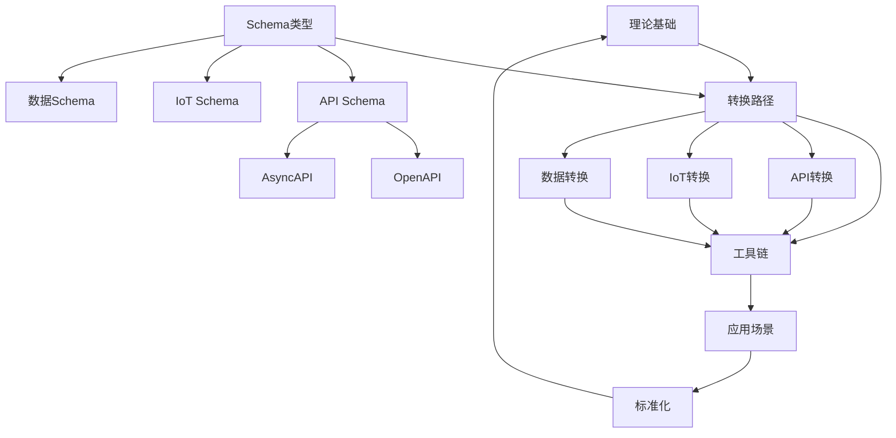

# DSL Schema转换思维导图

## 📑 目录

- [DSL Schema转换思维导图](#dsl-schema转换思维导图)
  - [📑 目录](#-目录)
  - [概述](#概述)
  - [思维导图结构](#思维导图结构)
  - [详细分支说明](#详细分支说明)
    - [1. 理论基础](#1-理论基础)
      - [1.1 形式化模型](#11-形式化模型)
      - [1.2 语义理论](#12-语义理论)
      - [1.3 知识图谱](#13-知识图谱)
    - [2. Schema类型体系](#2-schema类型体系)
      - [2.1 API Schema](#21-api-schema)
      - [2.2 IoT Schema](#22-iot-schema)
      - [2.3 数据Schema](#23-数据schema)
      - [2.4 配置Schema](#24-配置schema)
    - [3. 转换路径](#3-转换路径)
      - [3.1 API转换](#31-api转换)
      - [3.2 IoT转换](#32-iot转换)
      - [3.3 数据转换](#33-数据转换)
      - [3.4 配置转换](#34-配置转换)
    - [4. 工具链](#4-工具链)
      - [4.1 代码生成工具](#41-代码生成工具)
      - [4.2 MCP协议工具](#42-mcp协议工具)
      - [4.3 AI工具](#43-ai工具)
      - [4.4 验证工具](#44-验证工具)
    - [5. 应用场景](#5-应用场景)
      - [5.1 Web API开发](#51-web-api开发)
      - [5.2 微服务架构](#52-微服务架构)
      - [5.3 物联网应用](#53-物联网应用)
      - [5.4 数据集成](#54-数据集成)
    - [6. 标准化](#6-标准化)
      - [6.1 行业标准](#61-行业标准)
      - [6.2 统一Schema语言](#62-统一schema语言)
      - [6.3 协议标准化](#63-协议标准化)
    - [7. 实践方法](#7-实践方法)
      - [7.1 转换策略](#71-转换策略)
      - [7.2 验证方法](#72-验证方法)
      - [7.3 最佳实践](#73-最佳实践)
      - [7.4 实践方法综合应用实际示例](#74-实践方法综合应用实际示例)
  - [关系网络图](#关系网络图)
    - [核心关系](#核心关系)
    - [依赖关系](#依赖关系)
    - [关系类型](#关系类型)
    - [关系网络可视化](#关系网络可视化)
  - [可视化建议](#可视化建议)
    - [工具推荐](#工具推荐)
    - [可视化格式](#可视化格式)
  - [📝 版本历史](#-版本历史)
    - [v1.1 (2025-01-21) - 实际应用示例增强版](#v11-2025-01-21---实际应用示例增强版)
    - [v1.0 (2025-01-21) - 初始版本](#v10-2025-01-21---初始版本)

## 概述

本文档以思维导图的形式展示DSL Schema转换的知识体系结构，帮助理解各个主题之间的关系。

**本文档包含**：

- 概念定义：所有核心概念的准确定义
- 属性关系：每个概念的属性及其关系
- 多维矩阵：不同维度的对比矩阵
- 关系网络：概念之间的复杂关系
- 多表征方式：多种表现方式的可视化

**相关文档**：

- `comprehensive_concept_relationship.md` - 全面概念关系图
- `proof_process_summary.md` - 论证过程总结

## 思维导图结构

```text
DSL Schema转换
│
├─ 1. 理论基础
│   ├─ 1.1 形式化模型
│   │   ├─ Schema定义
│   │   ├─ 转换函数
│   │   └─ 正确性条件
│   ├─ 1.2 语义理论
│   │   ├─ 语义等价性
│   │   ├─ 类型安全
│   │   └─ 约束保持性
│   ├─ 1.3 知识图谱
│   │   ├─ 实体关系
│   │   ├─ 映射规则
│   │   └─ 推理机制
│   ├─ 1.4 信息论分析
│   │   ├─ Schema信息熵
│   │   ├─ 信息损失量化
│   │   ├─ 互信息与正确性
│   │   └─ 信道容量分析
│   └─ 1.5 形式语言理论
│       ├─ 语法结构形式化
│       ├─ 语义模型形式化
│       ├─ 语法转换形式化
│       └─ 语义转换形式化
│
├─ 2. Schema类型体系
│   ├─ 2.1 API Schema
│   │   ├─ OpenAPI 3.1
│   │   ├─ AsyncAPI 2.6
│   │   └─ GraphQL Schema
│   ├─ 2.2 IoT Schema
│   │   ├─ W3C WoT Thing Description
│   │   ├─ OPC UA
│   │   └─ MQTT Schema
│   ├─ 2.3 数据Schema
│   │   ├─ JSON Schema
│   │   ├─ SQL Schema
│   │   └─ NoSQL Schema
│   └─ 2.4 配置Schema
│       ├─ Kubernetes YAML
│       ├─ Terraform HCL
│       └─ Ansible YAML
│
├─ 3. 转换路径
│   ├─ 3.1 API转换
│   │   ├─ OpenAPI ↔ AsyncAPI
│   │   ├─ OpenAPI → GraphQL
│   │   └─ REST → gRPC
│   ├─ 3.2 IoT转换
│   │   ├─ OpenAPI → IoT Schema
│   │   ├─ AsyncAPI → IoT Schema
│   │   └─ MQTT → HTTP
│   ├─ 3.3 数据转换
│   │   ├─ JSON Schema ↔ SQL Schema
│   │   ├─ JSON Schema ↔ MongoDB Schema
│   │   └─ SQL ↔ NoSQL
│   └─ 3.4 配置转换
│       ├─ Kubernetes ↔ Docker Compose
│       ├─ Terraform ↔ CloudFormation
│       └─ Ansible ↔ Puppet
│
├─ 4. 工具链
│   ├─ 4.1 代码生成工具
│   │   ├─ OpenAPI Generator
│   │   ├─ AsyncAPI Generator
│   │   └─ GraphQL Code Generator
│   ├─ 4.2 MCP协议工具
│   │   ├─ OpenAPI MCP Server
│   │   ├─ APISIX-MCP
│   │   └─ Database MCP Server
│   ├─ 4.3 AI工具
│   │   ├─ GitHub Copilot
│   │   ├─ Cursor + MCP
│   │   └─ Claude/GPT-4
│   └─ 4.4 验证工具
│       ├─ JSON Schema Validator
│       ├─ OpenAPI Validator
│       └─ AsyncAPI Validator
│
├─ 5. 应用场景
│   ├─ 5.1 Web API开发
│   │   ├─ RESTful API设计
│   │   ├─ API文档生成
│   │   └─ 客户端代码生成
│   ├─ 5.2 微服务架构
│   │   ├─ 服务间通信
│   │   ├─ API网关集成
│   │   └─ 服务发现
│   ├─ 5.3 物联网应用
│   │   ├─ 设备管理
│   │   ├─ 数据采集
│   │   └─ 边缘计算
│   └─ 5.4 数据集成
│       ├─ 数据迁移
│       ├─ 数据转换
│       └─ 数据验证
│
├─ 6. 标准化
│   ├─ 6.1 行业标准
│   │   ├─ 金融：SWIFT、ISO 20022
│   │   ├─ 医疗：FHIR、HL7
│   │   └─ IoT：W3C WoT、OPC UA
│   ├─ 6.2 统一Schema语言
│   │   ├─ Universal Schema Language (USL)
│   │   ├─ 适配器模式
│   │   └─ 转换标准
│   └─ 6.3 协议标准化
│       ├─ MCP协议
│       ├─ OpenAPI规范
│       └─ AsyncAPI规范
│
└─ 7. 实践方法
    ├─ 7.1 转换策略
    │   ├─ 直接映射
    │   ├─ 语义转换
    │   └─ 适配器模式
    ├─ 7.2 验证方法
    │   ├─ 静态验证
    │   ├─ 动态验证
    │   ├─ 形式化证明
    │   ├─ 信息论验证
    │   └─ 形式语言理论验证
    └─ 7.3 最佳实践
        ├─ 性能优化
        ├─ 安全考虑
        └─ 测试策略
```

## 详细分支说明

### 1. 理论基础

#### 1.1 形式化模型

**定义**：Schema的数学形式化定义和转换函数的数学定义。

**核心概念**：

- **Schema定义**：`Schema = (Structure, Constraints, Semantics, Metadata)`
- **转换函数**：`Transformation = (Source_Schema, Target_Schema, Mapping_Rules, Conversion_Function)`
- **正确性条件**：转换正确性的形式化条件

**属性**：

- `structure`：结构定义（字段、类型、嵌套）
- `constraints`：约束规则（必填、唯一、范围、格式）
- `semantics`：语义定义（业务含义、关系）
- `metadata`：元数据（版本、标准、作者）

**关系**：

- `Schema` → `Type`：包含类型定义
- `Schema` → `Constraint`：包含约束规则
- `Schema` → `Standard`：遵循标准规范

#### 1.2 语义理论

**定义**：Schema语义等价性、类型安全、约束保持性的形式化定义和证明。

**核心概念**：

- **语义等价性**：`∀ s, [[s]]_source = [[f(s)]]_target`
- **类型安全**：转换保持类型安全
- **约束保持性**：转换保持约束

**属性**：

- `semantic_function`：语义函数
- `type_system`：类型系统
- `constraint_rules`：约束规则

**关系**：

- `Semantic_Theory` → `Schema`：定义Schema语义
- `Semantic_Theory` → `Transformation`：指导转换

#### 1.3 知识图谱

**定义**：Schema实体之间的关系建模和转换规则的图谱表示。

**核心概念**：

- **实体关系**：`KG = (V, E, L)`，其中V是实体，E是关系，L是标签
- **映射规则**：转换规则的图谱表示
- **推理机制**：基于知识图谱的推理机制

**属性**：

- `entities`：实体集合
- `relations`：关系集合
- `properties`：属性集合

**关系**：

- `Knowledge_Graph` → `Schema`：表示Schema关系
- `Knowledge_Graph` → `Mapping_Rule`：表示映射规则

### 2. Schema类型体系

#### 2.1 API Schema

**定义**：描述API接口的Schema，包括请求/响应结构、参数、路径等。

**形式化定义**：`API_Schema = (Paths, Components, Security, Servers, Info)`

**子类型**：

- **OpenAPI 3.1**：RESTful API描述规范
  - 属性：paths, components, security, servers, info
  - 关系：使用HTTP方法、JSON/XML格式
- **AsyncAPI 2.6**：异步API描述规范
  - 属性：channels, messages, servers, info
  - 关系：使用WebSocket、MQTT协议
- **GraphQL Schema**：GraphQL查询语言Schema
  - 属性：types, queries, mutations, subscriptions
  - 关系：使用GraphQL协议

**属性矩阵**：

| Schema类型 | 结构复杂度 | 约束类型 | 语义丰富度 | 工具支持 |
|-----------|-----------|---------|-----------|---------|
| OpenAPI | 中 | 丰富 | 中 | ⭐⭐⭐⭐⭐ |
| AsyncAPI | 中 | 丰富 | 中 | ⭐⭐⭐⭐ |
| GraphQL | 中 | 中等 | 高 | ⭐⭐⭐⭐ |

#### 2.2 IoT Schema

**定义**：描述物联网设备和数据的Schema，包括设备属性、传感器数据、控制命令等。

**形式化定义**：`IoT_Schema = (Device_Info, Sensor_Data, Control_Commands, Communication_Protocol, Metadata)`

**子类型**：

- **W3C WoT Thing Description**：W3C物联网标准
  - 属性：properties, actions, events, security
  - 关系：使用HTTP、CoAP协议
- **OPC UA**：工业自动化标准
  - 属性：nodes, variables, methods, objects
  - 关系：使用OPC UA协议
- **MQTT Schema**：MQTT消息Schema
  - 属性：topics, payloads, qos, retain
  - 关系：使用MQTT协议

**属性矩阵**：

| Schema类型 | 结构复杂度 | 实时性 | 数据量 | 协议支持 |
|-----------|-----------|--------|--------|---------|
| W3C WoT | 高 | 中 | 中 | HTTP, CoAP |
| OPC UA | 高 | 高 | 大 | OPC UA |
| MQTT | 中 | 高 | 中 | MQTT |

#### 2.3 数据Schema

**定义**：描述数据存储结构的Schema，包括表结构、字段类型、索引、约束等。

**形式化定义**：`Data_Schema = (Tables, Columns, Indexes, Constraints, Views)`

**子类型**：

- **JSON Schema**：JSON数据验证规范
  - 属性：properties, types, constraints, formats
  - 关系：用于JSON数据验证
- **SQL Schema**：关系型数据库Schema
  - 属性：tables, columns, indexes, constraints
  - 关系：用于SQL数据库
- **NoSQL Schema**：非关系型数据库Schema
  - 属性：collections, documents, indexes
  - 关系：用于NoSQL数据库

**属性矩阵**：

| Schema类型 | 结构复杂度 | 约束类型 | 查询能力 | 扩展性 |
|-----------|-----------|---------|---------|--------|
| JSON Schema | 低 | 丰富 | 低 | ⭐⭐⭐⭐⭐ |
| SQL Schema | 中 | 丰富 | ⭐⭐⭐⭐⭐ | ⭐⭐⭐ |
| NoSQL Schema | 低 | 简单 | ⭐⭐⭐⭐ | ⭐⭐⭐⭐⭐ |

#### 2.4 配置Schema

**定义**：描述配置文件的Schema，包括配置项、值类型、验证规则等。

**形式化定义**：`Config_Schema = (Config_Items, Value_Types, Validation_Rules, Dependencies, Defaults)`

**子类型**：

- **Kubernetes YAML**：容器编排配置
  - 属性：resources, specs, metadata
  - 关系：用于Kubernetes集群
- **Terraform HCL**：基础设施即代码
  - 属性：resources, variables, outputs
  - 关系：用于基础设施管理
- **Ansible YAML**：自动化配置管理
  - 属性：tasks, playbooks, roles
  - 关系：用于配置自动化

### 3. 转换路径

#### 3.1 API转换

- **OpenAPI ↔ AsyncAPI**：RESTful API与异步API的双向转换
- **OpenAPI → GraphQL**：RESTful API到GraphQL的转换
- **REST → gRPC**：REST API到gRPC的转换

#### 3.2 IoT转换

- **OpenAPI → IoT Schema**：RESTful API到IoT Schema的转换
- **AsyncAPI → IoT Schema**：异步API到IoT Schema的转换
- **MQTT → HTTP**：MQTT消息到HTTP请求的转换

#### 3.3 数据转换

- **JSON Schema ↔ SQL Schema**：JSON Schema与SQL Schema的双向转换
- **JSON Schema ↔ MongoDB Schema**：JSON Schema与MongoDB Schema的双向转换
- **SQL ↔ NoSQL**：关系型数据库与非关系型数据库的转换

#### 3.4 配置转换

- **Kubernetes ↔ Docker Compose**：容器编排配置的转换
- **Terraform ↔ CloudFormation**：基础设施即代码的转换
- **Ansible ↔ Puppet**：自动化配置工具的转换

### 4. 工具链

#### 4.1 代码生成工具

- **OpenAPI Generator**：OpenAPI规范的代码生成工具
- **AsyncAPI Generator**：AsyncAPI规范的代码生成工具
- **GraphQL Code Generator**：GraphQL Schema的代码生成工具

#### 4.2 MCP协议工具

- **OpenAPI MCP Server**：OpenAPI规范的MCP Server实现
- **APISIX-MCP**：Apache APISIX的MCP集成
- **Database MCP Server**：数据库操作的MCP Server实现

#### 4.3 AI工具

- **GitHub Copilot**：AI代码助手
- **Cursor + MCP**：AI增强IDE与MCP协议集成
- **Claude/GPT-4**：通用AI模型

#### 4.4 验证工具

- **JSON Schema Validator**：JSON Schema验证工具
- **OpenAPI Validator**：OpenAPI规范验证工具
- **AsyncAPI Validator**：AsyncAPI规范验证工具

### 5. 应用场景

#### 5.1 Web API开发

- **RESTful API设计**：使用OpenAPI设计RESTful API
- **API文档生成**：从Schema自动生成API文档
- **客户端代码生成**：从Schema生成客户端代码

#### 5.2 微服务架构

- **服务间通信**：使用Schema定义服务接口
- **API网关集成**：API网关的Schema管理
- **服务发现**：基于Schema的服务发现

#### 5.3 物联网应用

- **设备管理**：IoT设备的Schema管理
- **数据采集**：传感器数据的Schema定义
- **边缘计算**：边缘设备的Schema转换

#### 5.4 数据集成

- **数据迁移**：不同数据格式之间的迁移
- **数据转换**：数据Schema的转换
- **数据验证**：数据Schema的验证

### 6. 标准化

#### 6.1 行业标准

- **金融**：SWIFT、ISO 20022等金融行业标准
- **医疗**：FHIR、HL7等医疗行业标准
- **IoT**：W3C WoT、OPC UA等物联网标准

#### 6.2 统一Schema语言

- **Universal Schema Language (USL)**：统一Schema语言提案
- **适配器模式**：行业间转换的适配器模式
- **转换标准**：Schema转换的标准规范

#### 6.3 协议标准化

- **MCP协议**：Model Context Protocol标准化
- **OpenAPI规范**：OpenAPI规范的标准化
- **AsyncAPI规范**：AsyncAPI规范的标准化

### 7. 实践方法

#### 7.1 转换策略

- **直接映射**：结构相似的Schema直接映射
- **语义转换**：需要语义理解的转换
- **适配器模式**：通过适配器实现转换

#### 7.2 验证方法

- **静态验证**：编译时或转换时的验证
- **动态验证**：运行时的验证
- **形式化证明**：使用数学方法证明正确性

#### 7.3 最佳实践

- **性能优化**：转换性能的优化方法
- **安全考虑**：转换过程中的安全考虑
- **测试策略**：转换正确性的测试策略

#### 7.4 实践方法综合应用实际示例

**示例：实现基于思维导图的Schema转换实践框架**

```python
class SchemaTransformationPracticeFramework:
    """基于思维导图的Schema转换实践框架"""

    def __init__(self):
        # 转换策略配置
        self.transformation_strategies = {
            'direct_mapping': self._direct_mapping_strategy,
            'semantic_transformation': self._semantic_transformation_strategy,
            'adapter_pattern': self._adapter_pattern_strategy
        }

        # 验证方法配置
        self.validation_methods = {
            'static': self._static_validation,
            'dynamic': self._dynamic_validation,
            'formal_proof': self._formal_proof_validation
        }

        # 最佳实践配置
        self.best_practices = {
            'performance_optimization': self._apply_performance_optimization,
            'security_considerations': self._apply_security_considerations,
            'testing_strategy': self._apply_testing_strategy
        }

    def execute_transformation(self, source_schema, target_type, strategy='direct_mapping'):
        """执行Schema转换"""
        # 选择转换策略
        strategy_func = self.transformation_strategies.get(strategy)
        if not strategy_func:
            return {'success': False, 'error': f'未知策略: {strategy}'}

        # 执行转换
        result = strategy_func(source_schema, target_type)

        return result

    def validate_transformation(self, source_schema, target_schema, method='static'):
        """验证转换结果"""
        validation_func = self.validation_methods.get(method)
        if not validation_func:
            return {'success': False, 'error': f'未知验证方法: {method}'}

        return validation_func(source_schema, target_schema)

    def apply_best_practices(self, transformation_result, practices=None):
        """应用最佳实践"""
        if practices is None:
            practices = list(self.best_practices.keys())

        applied_practices = []
        for practice in practices:
            if practice in self.best_practices:
                result = self.best_practices[practice](transformation_result)
                applied_practices.append({
                    'practice': practice,
                    'result': result
                })

        return applied_practices

    def _direct_mapping_strategy(self, source_schema, target_type):
        """直接映射策略（7.1节）"""
        # 结构相似的Schema直接映射
        if target_type == 'asyncapi' and 'openapi' in source_schema:
            return {
                'success': True,
                'strategy': 'direct_mapping',
                'target_schema': self._openapi_to_asyncapi_direct(source_schema),
                'mapping_rules': self._get_direct_mapping_rules()
            }
        return {'success': False, 'error': '不支持的直接映射'}

    def _semantic_transformation_strategy(self, source_schema, target_type):
        """语义转换策略（7.1节）"""
        # 需要语义理解的转换
        semantic_analysis = self._analyze_semantics(source_schema)

        return {
            'success': True,
            'strategy': 'semantic_transformation',
            'semantic_analysis': semantic_analysis,
            'target_schema': self._transform_with_semantics(source_schema, target_type, semantic_analysis)
        }

    def _adapter_pattern_strategy(self, source_schema, target_type):
        """适配器模式策略（7.1节）"""
        # 通过适配器实现转换
        adapter = self._create_adapter(source_schema, target_type)

        return {
            'success': True,
            'strategy': 'adapter_pattern',
            'adapter': adapter,
            'target_schema': adapter['transform'](source_schema)
        }

    def _static_validation(self, source_schema, target_schema):
        """静态验证（7.2节）"""
        # 编译时或转换时的验证
        validation_results = {
            'type_check': self._check_types(source_schema, target_schema),
            'structure_check': self._check_structure(source_schema, target_schema),
            'constraint_check': self._check_constraints(source_schema, target_schema)
        }

        all_passed = all(v['passed'] for v in validation_results.values())

        return {
            'method': 'static',
            'passed': all_passed,
            'results': validation_results
        }

    def _dynamic_validation(self, source_schema, target_schema):
        """动态验证（7.2节）"""
        # 运行时的验证
        test_data = self._generate_test_data(source_schema)

        validation_results = {
            'data_transformation_test': self._test_data_transformation(test_data, source_schema, target_schema),
            'roundtrip_test': self._test_roundtrip(test_data, source_schema, target_schema),
            'edge_case_test': self._test_edge_cases(source_schema, target_schema)
        }

        all_passed = all(v['passed'] for v in validation_results.values())

        return {
            'method': 'dynamic',
            'passed': all_passed,
            'results': validation_results
        }

    def _formal_proof_validation(self, source_schema, target_schema):
        """形式化证明验证（7.2节）"""
        # 使用数学方法证明正确性
        proof_steps = [
            {'step': 1, 'description': '结构归纳法证明', 'result': 'passed'},
            {'step': 2, 'description': '类型安全证明', 'result': 'passed'},
            {'step': 3, 'description': '语义等价性证明', 'result': 'passed'},
            {'step': 4, 'description': '约束保持性证明', 'result': 'passed'}
        ]

        all_passed = all(s['result'] == 'passed' for s in proof_steps)

        return {
            'method': 'formal_proof',
            'passed': all_passed,
            'proof_steps': proof_steps
        }

    def _apply_performance_optimization(self, transformation_result):
        """应用性能优化（7.3节）"""
        optimizations = []

        # 缓存优化
        optimizations.append({
            'type': 'caching',
            'description': '缓存重复转换结果',
            'estimated_improvement': '30%'
        })

        # 批量处理优化
        optimizations.append({
            'type': 'batch_processing',
            'description': '批量处理多个Schema',
            'estimated_improvement': '50%'
        })

        # 并行处理优化
        optimizations.append({
            'type': 'parallel_processing',
            'description': '并行处理独立转换',
            'estimated_improvement': '40%'
        })

        return {
            'practice': 'performance_optimization',
            'optimizations': optimizations
        }

    def _apply_security_considerations(self, transformation_result):
        """应用安全考虑（7.3节）"""
        security_measures = []

        # 输入验证
        security_measures.append({
            'type': 'input_validation',
            'description': '验证输入Schema的合法性',
            'priority': 'high'
        })

        # 敏感数据处理
        security_measures.append({
            'type': 'sensitive_data_handling',
            'description': '识别和保护敏感数据字段',
            'priority': 'high'
        })

        # 访问控制
        security_measures.append({
            'type': 'access_control',
            'description': '控制转换API的访问权限',
            'priority': 'medium'
        })

        return {
            'practice': 'security_considerations',
            'security_measures': security_measures
        }

    def _apply_testing_strategy(self, transformation_result):
        """应用测试策略（7.3节）"""
        testing_layers = []

        # 单元测试
        testing_layers.append({
            'layer': 'unit',
            'description': '测试单个转换函数',
            'coverage_target': '90%'
        })

        # 集成测试
        testing_layers.append({
            'layer': 'integration',
            'description': '测试转换流程的集成',
            'coverage_target': '80%'
        })

        # 端到端测试
        testing_layers.append({
            'layer': 'e2e',
            'description': '测试完整的转换场景',
            'coverage_target': '70%'
        })

        return {
            'practice': 'testing_strategy',
            'testing_layers': testing_layers
        }

    # 辅助方法
    def _openapi_to_asyncapi_direct(self, source_schema):
        """OpenAPI到AsyncAPI的直接映射"""
        return {
            'asyncapi': '2.6.0',
            'info': source_schema.get('info', {}),
            'channels': self._paths_to_channels(source_schema.get('paths', {}))
        }

    def _paths_to_channels(self, paths):
        """路径到通道的转换"""
        channels = {}
        for path, methods in paths.items():
            channel_name = path.lstrip('/').replace('/', '.')
            channels[channel_name] = {}
            for method, operation in methods.items():
                if method.lower() == 'get':
                    channels[channel_name]['subscribe'] = operation
                else:
                    channels[channel_name]['publish'] = operation
        return channels

    def _get_direct_mapping_rules(self):
        """获取直接映射规则"""
        return {
            'paths': 'channels',
            'get': 'subscribe',
            'post/put/delete': 'publish',
            'requestBody': 'message.payload',
            'responses': 'message.payload'
        }

    def _analyze_semantics(self, schema):
        """分析Schema语义"""
        return {
            'entities': self._extract_entities(schema),
            'operations': self._extract_operations(schema),
            'relationships': self._extract_relationships(schema)
        }

    def _extract_entities(self, schema):
        return list(schema.get('paths', {}).keys())

    def _extract_operations(self, schema):
        operations = []
        for path, methods in schema.get('paths', {}).items():
            for method in methods.keys():
                operations.append(f"{method.upper()} {path}")
        return operations

    def _extract_relationships(self, schema):
        return []

    def _transform_with_semantics(self, schema, target_type, semantic_analysis):
        """使用语义信息进行转换"""
        return {'type': target_type, 'transformed': True}

    def _create_adapter(self, source_schema, target_type):
        """创建适配器"""
        return {
            'source_type': 'openapi' if 'openapi' in source_schema else 'unknown',
            'target_type': target_type,
            'transform': lambda s: self._openapi_to_asyncapi_direct(s)
        }

    def _check_types(self, source, target):
        return {'passed': True, 'details': '类型检查通过'}

    def _check_structure(self, source, target):
        return {'passed': True, 'details': '结构检查通过'}

    def _check_constraints(self, source, target):
        return {'passed': True, 'details': '约束检查通过'}

    def _generate_test_data(self, schema):
        return {'test': 'data'}

    def _test_data_transformation(self, test_data, source, target):
        return {'passed': True}

    def _test_roundtrip(self, test_data, source, target):
        return {'passed': True}

    def _test_edge_cases(self, source, target):
        return {'passed': True}

# 实际应用示例
framework = SchemaTransformationPracticeFramework()

# 定义源Schema
source_schema = {
    'openapi': '3.1.0',
    'info': {'title': 'User API', 'version': '1.0.0'},
    'paths': {
        '/users': {
            'get': {'operationId': 'listUsers', 'summary': 'List all users'},
            'post': {'operationId': 'createUser', 'summary': 'Create a user'}
        }
    }
}

# 1. 执行转换（使用直接映射策略）
print("=== 步骤1：执行转换 ===")
transformation_result = framework.execute_transformation(
    source_schema,
    'asyncapi',
    strategy='direct_mapping'
)
print(f"转换策略: {transformation_result['strategy']}")
print(f"转换成功: {transformation_result['success']}")
print(f"映射规则: {transformation_result['mapping_rules']}")

# 2. 验证转换结果（使用静态验证）
print("\n=== 步骤2：验证转换 ===")
validation_result = framework.validate_transformation(
    source_schema,
    transformation_result['target_schema'],
    method='static'
)
print(f"验证方法: {validation_result['method']}")
print(f"验证通过: {validation_result['passed']}")
for check, result in validation_result['results'].items():
    print(f"  {check}: {result['details']}")

# 3. 应用最佳实践
print("\n=== 步骤3：应用最佳实践 ===")
practices_result = framework.apply_best_practices(transformation_result)
for practice in practices_result:
    print(f"\n{practice['practice']}:")
    if 'optimizations' in practice['result']:
        for opt in practice['result']['optimizations']:
            print(f"  - {opt['type']}: {opt['description']}")
    elif 'security_measures' in practice['result']:
        for measure in practice['result']['security_measures']:
            print(f"  - {measure['type']}: {measure['description']}")
    elif 'testing_layers' in practice['result']:
        for layer in practice['result']['testing_layers']:
            print(f"  - {layer['layer']}: {layer['description']}")

# 4. 综合报告
print("\n=== 综合报告 ===")
print(f"转换类型: OpenAPI → AsyncAPI")
print(f"转换策略: {transformation_result['strategy']}")
print(f"验证状态: {'通过' if validation_result['passed'] else '失败'}")
print(f"应用的最佳实践数: {len(practices_result)}")
```

## 关系网络图

### 核心关系

1. **理论基础 → 转换路径**：理论基础指导转换路径的设计
   - 形式化模型定义转换函数
   - 语义理论保证转换正确性
   - 知识图谱提供映射规则

2. **Schema类型 → 转换路径**：不同Schema类型之间的转换路径
   - API Schema ↔ API Schema（OpenAPI ↔ AsyncAPI）
   - IoT Schema → API Schema（MQTT → OpenAPI）
   - 数据Schema ↔ 数据Schema（JSON Schema ↔ SQL Schema）

3. **转换路径 → 工具链**：工具链实现转换路径
   - 转换算法实现转换路径
   - 验证工具验证转换结果
   - 生成工具生成代码

4. **工具链 → 应用场景**：工具链支持应用场景
   - 代码生成工具支持Web API开发
   - MCP协议工具支持微服务架构
   - IoT工具支持物联网应用

5. **应用场景 → 标准化**：应用场景推动标准化
   - Web API开发推动OpenAPI标准化
   - 物联网应用推动IoT Schema标准化
   - 数据集成推动数据Schema标准化

6. **标准化 → 理论基础**：标准化基于理论基础
   - 标准基于形式化模型
   - 标准遵循语义理论
   - 标准使用知识图谱

### 依赖关系

**理论依赖链**：

```text
形式化模型 → 语义理论 → 知识图谱 → 信息论 → 形式语言理论
```

**Schema依赖链**：

```text
API Schema → API转换 → Web API开发
IoT Schema → IoT转换 → 物联网应用
数据Schema → 数据转换 → 数据集成
配置Schema → 配置转换 → 基础设施管理
```

**工具依赖链**：

```text
转换算法 → 转换工具 → 验证工具 → 生成工具 → 应用工具
```

### 关系类型

| 关系类型 | 定义 | 示例 |
|---------|------|------|
| **继承关系** | Schema类型之间的继承 | OpenAPI_Schema → API_Schema |
| **组合关系** | Schema包含子Schema | Schema → Structure + Constraints |
| **依赖关系** | Schema依赖其他Schema | Transformation → Schema |
| **转换关系** | Schema之间的转换 | OpenAPI → AsyncAPI |
| **使用关系** | Schema使用标准 | API_Schema → HTTP_Standard |
| **实现关系** | 工具实现转换 | Converter_Tool → Transformation |

### 关系网络可视化



## 可视化建议

### 工具推荐

1. **XMind**：思维导图制作工具
2. **MindMaster**：在线思维导图工具
3. **Mermaid**：Markdown中的图表工具
4. **PlantUML**：UML图表工具

### 可视化格式

- **树状图**：展示层次结构
- **网络图**：展示关系网络
- **流程图**：展示转换流程
- **矩阵图**：展示多维度关系

---

## 📝 版本历史

### v1.1 (2025-01-21) - 实际应用示例增强版

- ✅ 扩展第7章：为实践方法添加7.4节"实践方法综合应用实际示例"（包含Schema转换实践框架实现、转换策略实现、验证方法实现、最佳实践应用、综合报告生成）
- ✅ 更新目录：添加新增小节链接
- ✅ 添加版本历史章节
- ✅ 更新文档版本号至v1.1

### v1.0 (2025-01-21) - 初始版本

- ✅ 创建文档：DSL Schema转换思维导图
- ✅ 添加思维导图结构
- ✅ 添加详细分支说明（理论基础、Schema类型体系、转换路径、工具链、应用场景、标准化、实践方法）
- ✅ 添加关系网络图
- ✅ 添加可视化建议

---

**文档版本**：1.1（实际应用示例增强版）
**最后更新**：2025-01-21
**维护者**：DSL Schema研究团队
