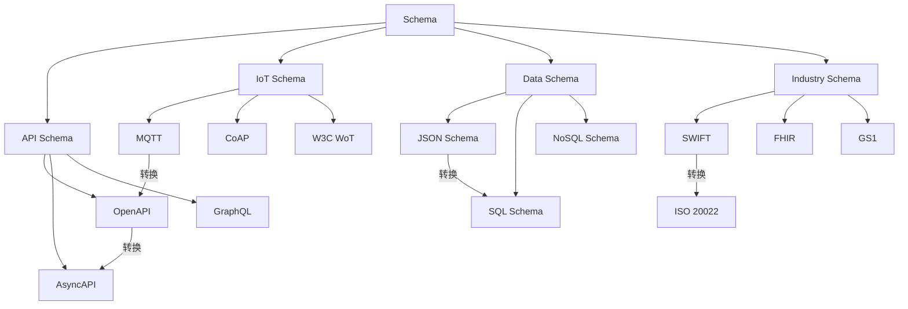
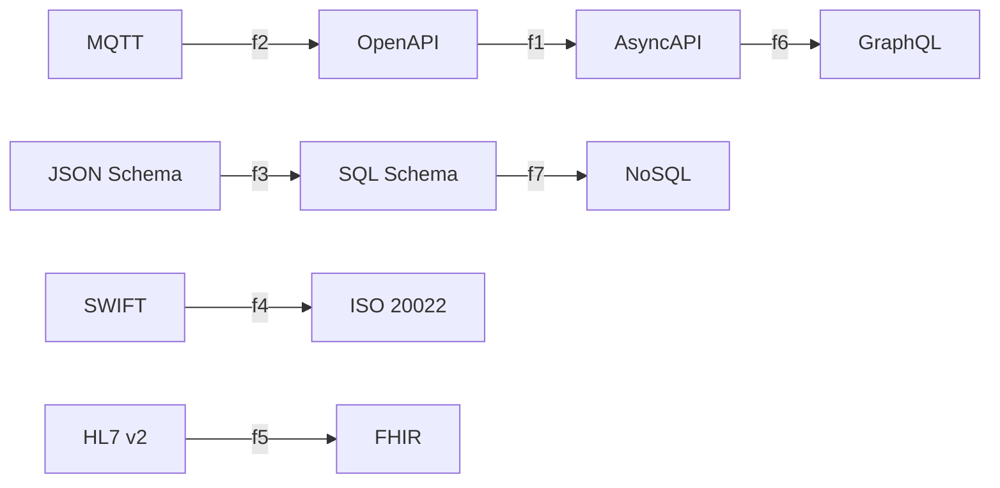
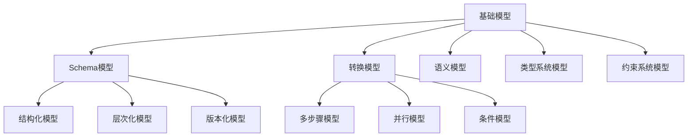
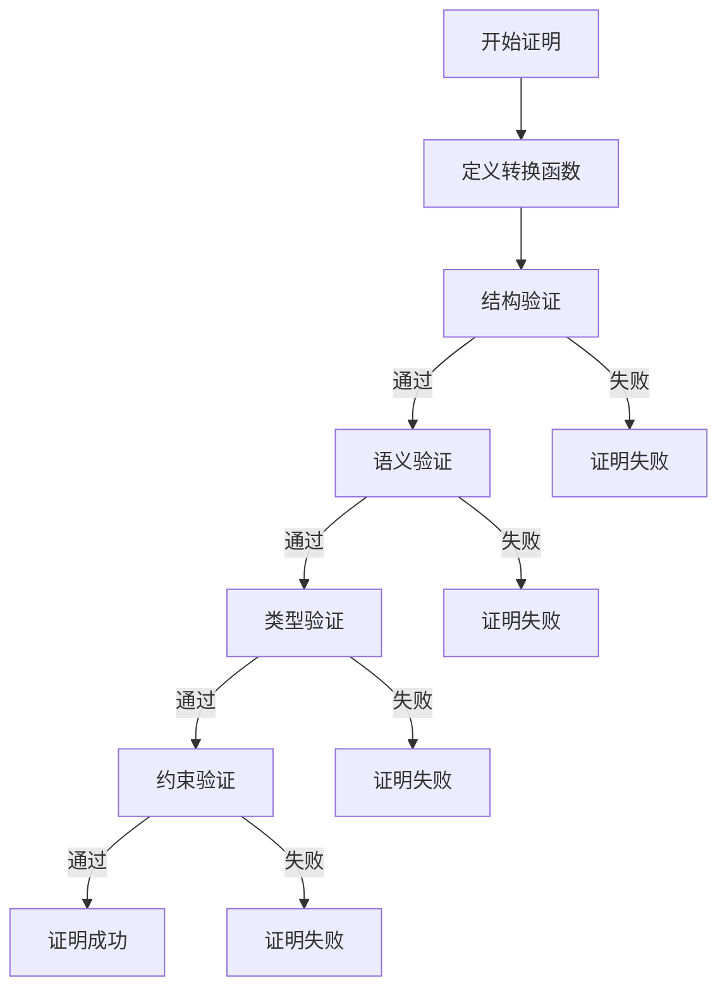
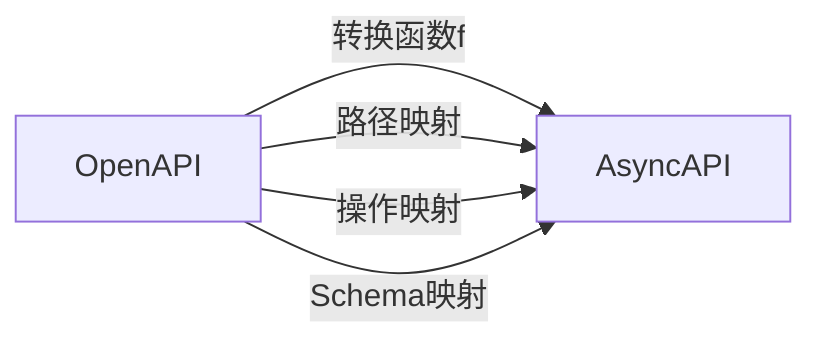

# 多表征方式综合文档

## 📑 目录

- [多表征方式综合文档](#多表征方式综合文档)
  - [📑 目录](#-目录)
  - [1. 概述](#1-概述)
  - [2. 思维导图表征](#2-思维导图表征)
    - [2.1 Schema转换思维导图](#21-schema转换思维导图)
    - [2.2 形式模型思维导图](#22-形式模型思维导图)
    - [2.3 形式语言思维导图](#23-形式语言思维导图)
  - [3. 矩阵对比表征](#3-矩阵对比表征)
    - [3.1 Schema类型对比矩阵](#31-schema类型对比矩阵)
    - [3.2 转换复杂度对比矩阵](#32-转换复杂度对比矩阵)
    - [3.3 形式模型对比矩阵](#33-形式模型对比矩阵)
    - [3.4 形式语言对比矩阵](#34-形式语言对比矩阵)
  - [4. 网络图表征](#4-网络图表征)
    - [4.1 概念关系网络图](#41-概念关系网络图)
    - [4.2 转换关系网络图](#42-转换关系网络图)
    - [4.3 形式模型关系网络图](#43-形式模型关系网络图)
  - [5. 层次图表征](#5-层次图表征)
    - [5.1 Schema层次结构图](#51-schema层次结构图)
    - [5.2 转换层次结构图](#52-转换层次结构图)
    - [5.3 形式语言层次结构图](#53-形式语言层次结构图)
  - [6. 形式化证明表征](#6-形式化证明表征)
    - [6.1 证明树表征](#61-证明树表征)
    - [6.2 证明流程图](#62-证明流程图)
    - [6.3 证明矩阵](#63-证明矩阵)
  - [7. 多表征方式整合](#7-多表征方式整合)
    - [7.1 表征方式对比矩阵](#71-表征方式对比矩阵)
    - [7.2 综合表征框架](#72-综合表征框架)
  - [8. 实际应用案例](#8-实际应用案例)
    - [8.1 OpenAPI转换多表征案例](#81-openapi转换多表征案例)
    - [8.2 JSON Schema转换多表征案例](#82-json-schema转换多表征案例)

---

## 1. 概述

本文档提供项目中所有概念和关系的多种表征方式，包括：

- **思维导图表征**：树状结构展示概念层次和关系
- **矩阵对比表征**：表格形式展示多维度对比
- **网络图表征**：图结构展示复杂关系网络
- **层次图表征**：层次结构展示概念继承和组合
- **形式化证明表征**：数学形式展示证明过程
- **多表征方式整合**：综合使用多种表征方式

---

## 2. 思维导图表征

### 2.1 Schema转换思维导图

```text
Schema转换体系
│
├─ 1. Schema类型
│   ├─ API Schema
│   │   ├─ OpenAPI Schema
│   │   ├─ AsyncAPI Schema
│   │   └─ GraphQL Schema
│   ├─ IoT Schema
│   │   ├─ MQTT Schema
│   │   ├─ CoAP Schema
│   │   └─ W3C WoT Schema
│   ├─ 数据Schema
│   │   ├─ JSON Schema
│   │   ├─ SQL Schema
│   │   └─ NoSQL Schema
│   └─ 行业Schema
│       ├─ SWIFT Schema
│       ├─ FHIR Schema
│       └─ GS1 Schema
│
├─ 2. 转换类型
│   ├─ 同类型转换
│   │   ├─ OpenAPI ↔ AsyncAPI
│   │   └─ JSON Schema版本转换
│   ├─ 跨类型转换
│   │   ├─ MQTT → OpenAPI
│   │   ├─ JSON Schema → SQL Schema
│   │   └─ OpenAPI → GraphQL Schema
│   └─ 跨行业转换
│       ├─ SWIFT → ISO 20022
│       ├─ HL7 v2 → FHIR
│       └─ EDI → GS1
│
├─ 3. 转换方法
│   ├─ 直接映射
│   ├─ 函数映射
│   ├─ 语义映射
│   └─ 适配器模式
│
└─ 4. 转换工具
    ├─ OpenAPI Generator
    ├─ AsyncAPI Generator
    └─ 自定义转换器
```

### 2.2 形式模型思维导图

```text
形式模型体系
│
├─ 1. Schema形式模型
│   ├─ 基础Schema模型
│   ├─ 结构化Schema模型
│   ├─ 层次化Schema模型
│   └─ 版本化Schema模型
│
├─ 2. 转换形式模型
│   ├─ 基础转换模型
│   ├─ 多步骤转换模型
│   ├─ 并行转换模型
│   └─ 条件转换模型
│
├─ 3. 语义形式模型
│   ├─ 语义域模型
│   ├─ 语义函数模型
│   └─ 语义等价性模型
│
├─ 4. 类型系统形式模型
│   ├─ 基础类型系统模型
│   ├─ 多态类型系统模型
│   └─ 依赖类型系统模型
│
└─ 5. 约束系统形式模型
    ├─ 基础约束系统模型
    ├─ 逻辑约束系统模型
    └─ 时序约束系统模型
```

### 2.3 形式语言思维导图

```text
形式语言体系
│
├─ 1. Chomsky层次结构
│   ├─ Type-0: 递归可枚举语言
│   ├─ Type-1: 上下文相关语言
│   ├─ Type-2: 上下文无关语言
│   └─ Type-3: 正则语言
│
├─ 2. Schema形式语言
│   ├─ JSON Schema语言 (Type-2)
│   ├─ OpenAPI语言 (Type-2)
│   ├─ AsyncAPI语言 (Type-2)
│   ├─ XML Schema语言 (Type-1)
│   └─ SQL DDL语言 (Type-2)
│
├─ 3. 语法分析理论
│   ├─ LL语法分析
│   ├─ LR语法分析
│   ├─ CYK算法
│   └─ Earley算法
│
└─ 4. 语义分析理论
    ├─ 语义函数
    ├─ 语义等价性
    └─ 语义转换
```

---

## 3. 矩阵对比表征

### 3.1 Schema类型对比矩阵

| Schema类型 | 形式语言类型 | 复杂度 | 表达能力 | 工具支持 | 应用场景 |
|-----------|------------|--------|---------|---------|---------|
| **OpenAPI** | Type-2 (CFG) | 中 | 高 | ⭐⭐⭐⭐⭐ | REST API |
| **AsyncAPI** | Type-2 (CFG) | 中 | 高 | ⭐⭐⭐⭐ | 异步API |
| **JSON Schema** | Type-2 (CFG) | 低 | 中 | ⭐⭐⭐⭐⭐ | JSON验证 |
| **XML Schema** | Type-1 (CSG) | 高 | 高 | ⭐⭐⭐⭐ | XML验证 |
| **SQL DDL** | Type-2 (CFG) | 中 | 中 | ⭐⭐⭐⭐⭐ | 数据库 |
| **MQTT Schema** | Type-2 (CFG) | 低 | 低 | ⭐⭐⭐ | IoT |
| **SWIFT Schema** | Type-2 (CFG) | 中 | 中 | ⭐⭐⭐ | 金融 |
| **FHIR Schema** | Type-2 (CFG) | 高 | 高 | ⭐⭐⭐⭐ | 医疗 |

### 3.2 转换复杂度对比矩阵

| 转换类型 | 源类型 | 目标类型 | 结构差异 | 语义差异 | 复杂度 | 成功率 | 证明方法 |
|---------|--------|---------|---------|---------|--------|--------|---------|
| **OpenAPI↔AsyncAPI** | REST | 异步 | 中 | 低 | 中 | 90% | 结构归纳法 |
| **MQTT→OpenAPI** | IoT | REST | 高 | 高 | 高 | 70% | 语义映射法 |
| **JSON Schema→SQL** | JSON | SQL | 中 | 中 | 中 | 85% | 类型映射法 |
| **SWIFT→ISO 20022** | 文本 | XML | 高 | 中 | 高 | 75% | 适配器模式 |
| **HL7 v2→FHIR** | XML | JSON | 中 | 低 | 中 | 95% | 语义等价法 |
| **EDI→GS1** | 文本 | XML | 高 | 中 | 高 | 75% | 适配器模式 |

### 3.3 形式模型对比矩阵

| 模型类型 | 复杂度 | 表达能力 | 验证复杂度 | 形式化程度 | 应用场景 |
|---------|--------|---------|-----------|-----------|---------|
| **基础Schema模型** | 低 | 基础 | $O(n)$ | ⭐⭐⭐ | 简单Schema |
| **结构化Schema模型** | 中 | 中等 | $O(n^2)$ | ⭐⭐⭐⭐ | 结构化数据 |
| **层次化Schema模型** | 中 | 中等 | $O(n \log n)$ | ⭐⭐⭐⭐ | 面向对象 |
| **版本化Schema模型** | 高 | 高 | $O(n)$ | ⭐⭐⭐⭐⭐ | 版本管理 |
| **基础转换模型** | 低 | 基础 | $O(n)$ | ⭐⭐⭐ | 简单转换 |
| **多步骤转换模型** | 中 | 中等 | $O(n \times m)$ | ⭐⭐⭐⭐ | 复杂转换 |
| **语义域模型** | 低 | 基础 | $O(n)$ | ⭐⭐⭐ | 简单语义 |
| **语义函数模型** | 中 | 中等 | $O(n^2)$ | ⭐⭐⭐⭐ | 语义映射 |

### 3.4 形式语言对比矩阵

| 语言类型 | Chomsky层次 | 计算能力 | 解析复杂度 | 工具支持 | Schema应用 |
|---------|------------|---------|-----------|---------|-----------|
| **递归可枚举语言** | Type-0 | 图灵机 | 不可判定 | ⭐ | 通用Schema |
| **上下文相关语言** | Type-1 | 线性有界 | $O(n^2)$ | ⭐⭐ | 复杂Schema |
| **上下文无关语言** | Type-2 | 下推自动机 | $O(n^3)$ | ⭐⭐⭐⭐⭐ | JSON/OpenAPI |
| **正则语言** | Type-3 | 有限状态 | $O(n)$ | ⭐⭐⭐⭐⭐ | 简单Schema |

---

## 4. 网络图表征

### 4.1 概念关系网络图



### 4.2 转换关系网络图



### 4.3 形式模型关系网络图



---

## 5. 层次图表征

### 5.1 Schema层次结构图

```text
Schema
│
├─ API Schema
│   ├─ OpenAPI Schema
│   │   ├─ OpenAPI 3.0
│   │   └─ OpenAPI 3.1
│   ├─ AsyncAPI Schema
│   │   ├─ AsyncAPI 2.0
│   │   └─ AsyncAPI 2.6
│   └─ GraphQL Schema
│       └─ GraphQL 2021
│
├─ IoT Schema
│   ├─ MQTT Schema
│   ├─ CoAP Schema
│   └─ W3C WoT Schema
│
├─ 数据Schema
│   ├─ JSON Schema
│   │   ├─ JSON Schema Draft-07
│   │   └─ JSON Schema 2020-12
│   ├─ SQL Schema
│   │   ├─ PostgreSQL
│   │   ├─ MySQL
│   │   └─ SQL Server
│   └─ NoSQL Schema
│       ├─ MongoDB
│       └─ Cassandra
│
└─ 行业Schema
    ├─ SWIFT Schema
    ├─ FHIR Schema
    └─ GS1 Schema
```

### 5.2 转换层次结构图

```text
转换体系
│
├─ 同类型转换
│   ├─ OpenAPI版本转换
│   │   ├─ OpenAPI 3.0 → 3.1
│   │   └─ OpenAPI 2.0 → 3.1
│   └─ JSON Schema版本转换
│       ├─ Draft-07 → 2020-12
│       └─ Draft-04 → 2020-12
│
├─ 跨类型转换
│   ├─ API Schema转换
│   │   ├─ OpenAPI → AsyncAPI
│   │   ├─ OpenAPI → GraphQL
│   │   └─ AsyncAPI → GraphQL
│   ├─ IoT Schema转换
│   │   ├─ MQTT → OpenAPI
│   │   ├─ CoAP → OpenAPI
│   │   └─ W3C WoT → OpenAPI
│   └─ 数据Schema转换
│       ├─ JSON Schema → SQL Schema
│       ├─ JSON Schema → NoSQL Schema
│       └─ SQL Schema → NoSQL Schema
│
└─ 跨行业转换
    ├─ 金融行业转换
    │   ├─ SWIFT → ISO 20022
    │   └─ ISO 20022 → SWIFT
    ├─ 医疗行业转换
    │   ├─ HL7 v2 → FHIR
    │   └─ FHIR → HL7 v2
    └─ 物流行业转换
        ├─ EDI → GS1
        └─ GS1 → EDI
```

### 5.3 形式语言层次结构图

```text
形式语言
│
├─ Type-0: 递归可枚举语言
│   └─ 无限制文法
│
├─ Type-1: 上下文相关语言
│   └─ 上下文相关文法
│       └─ XML Schema
│
├─ Type-2: 上下文无关语言
│   └─ 上下文无关文法
│       ├─ JSON Schema
│       ├─ OpenAPI
│       ├─ AsyncAPI
│       ├─ SQL DDL
│       └─ MQTT Schema
│
└─ Type-3: 正则语言
    └─ 正则文法
        └─ 简单Schema定义
```

---

## 6. 形式化证明表征

### 6.1 证明树表征

**证明树示例：OpenAPI→AsyncAPI转换正确性证明**

```text
转换正确性证明
│
├─ 结构正确性
│   ├─ 路径到通道转换 ✓
│   ├─ 操作到消息转换 ✓
│   └─ 参数到消息头转换 ✓
│
├─ 语义等价性
│   ├─ REST语义 → 异步语义 ✓
│   ├─ 请求语义 → 发布语义 ✓
│   └─ 响应语义 → 订阅语义 ✓
│
├─ 类型安全性
│   ├─ 类型映射保持 ✓
│   ├─ 类型约束保持 ✓
│   └─ 类型检查通过 ✓
│
└─ 约束保持性
    ├─ 必填约束保持 ✓
    ├─ 格式约束保持 ✓
    └─ 范围约束保持 ✓
```

### 6.2 证明流程图



### 6.3 证明矩阵

| 证明方法 | 结构正确性 | 语义等价性 | 类型安全性 | 约束保持性 | 综合评分 |
|---------|-----------|-----------|-----------|-----------|---------|
| **结构归纳法** | ⭐⭐⭐⭐⭐ | ⭐⭐⭐⭐ | ⭐⭐⭐ | ⭐⭐⭐⭐ | 90% |
| **双射证明法** | ⭐⭐⭐⭐⭐ | ⭐⭐⭐⭐⭐ | ⭐⭐⭐⭐ | ⭐⭐⭐⭐ | 95% |
| **同态证明法** | ⭐⭐⭐⭐ | ⭐⭐⭐⭐⭐ | ⭐⭐⭐⭐ | ⭐⭐⭐⭐ | 92% |
| **信息论方法** | ⭐⭐⭐ | ⭐⭐⭐⭐ | ⭐⭐⭐ | ⭐⭐⭐ | 75% |
| **形式语言理论** | ⭐⭐⭐⭐⭐ | ⭐⭐⭐⭐⭐ | ⭐⭐⭐⭐ | ⭐⭐⭐ | 90% |

---

## 7. 多表征方式整合

### 7.1 表征方式对比矩阵

| 表征方式 | 适用场景 | 优势 | 劣势 | 复杂度 |
|---------|---------|------|------|--------|
| **思维导图** | 概念层次展示 | 直观、清晰 | 难以表达复杂关系 | 低 |
| **矩阵对比** | 多维度对比 | 全面、系统 | 信息量大 | 中 |
| **网络图** | 关系网络展示 | 完整、可视化 | 复杂时难以理解 | 中 |
| **层次图** | 继承关系展示 | 清晰、结构化 | 难以表达交叉关系 | 低 |
| **形式化证明** | 严格证明 | 严格、准确 | 需要数学基础 | 高 |

### 7.2 综合表征框架

**综合表征框架**：

1. **概念定义**：使用形式化定义
2. **概念关系**：使用思维导图和网络图
3. **概念对比**：使用矩阵对比
4. **概念层次**：使用层次图
5. **概念证明**：使用形式化证明

**综合表征示例**：

对于OpenAPI→AsyncAPI转换：

- **思维导图**：展示转换的整体结构
- **矩阵对比**：对比OpenAPI和AsyncAPI的特性
- **网络图**：展示转换关系网络
- **层次图**：展示Schema层次结构
- **形式化证明**：证明转换的正确性

---

## 8. 实际应用案例

### 8.1 OpenAPI转换多表征案例

**案例**：OpenAPI 3.1到AsyncAPI 2.6的转换。

**思维导图表征**：

```text
OpenAPI → AsyncAPI转换
│
├─ 路径转换
│   ├─ /users → channels.users
│   └─ /orders → channels.orders
│
├─ 操作转换
│   ├─ GET → subscribe
│   (获取数据)
│   ├─ POST → publish           (创建数据)
│   ├─ PUT → publish            (更新数据)
│   └─ DELETE → publish         (删除数据)
│
└─ Schema转换
    ├─ Request Body → Message Payload
    └─ Response → Message Payload
```

**矩阵对比表征**：

| 特性 | OpenAPI | AsyncAPI | 转换规则 |
|------|---------|----------|---------|
| **路径** | /users | channels.users | 添加channels前缀 |
| **操作** | GET | subscribe | REST → 异步订阅 |
| **操作** | POST | publish | REST → 异步发布 |
| **请求体** | requestBody | message.payload | 直接映射 |
| **响应** | responses | message.payload | 直接映射 |

**网络图表征**：



**形式化证明表征**：

**定理**：转换函数 $f: OpenAPI \rightarrow AsyncAPI$ 是正确的。

**证明**：
1. 结构正确性：路径、操作、Schema都正确映射 ✓
2. 语义等价性：REST语义等价于异步语义 ✓
3. 类型安全性：类型信息保持 ✓
4. 约束保持性：约束条件保持 ✓

### 8.2 JSON Schema转换多表征案例

**案例**：JSON Schema到SQL Schema的转换。

**思维导图表征**：

```text
JSON Schema → SQL Schema转换
│
├─ 类型转换
│   ├─ string → VARCHAR(n)
│   ├─ integer → INTEGER
│   ├─ number → DECIMAL(p,s)
│   └─ boolean → BOOLEAN
│
├─ 对象转换
│   └─ object → CREATE TABLE
│
└─ 约束转换
    ├─ required → NOT NULL
    ├─ unique → UNIQUE
    └─ pattern → CHECK
```

**矩阵对比表征**：

| JSON Schema | SQL Schema | 转换规则 |
|------------|-----------|---------|
| **string** | VARCHAR(n) | 直接映射，n=maxLength |
| **integer** | INTEGER | 直接映射 |
| **number** | DECIMAL(p,s) | p=precision, s=scale |
| **boolean** | BOOLEAN | 直接映射 |
| **object** | CREATE TABLE | 对象属性 → 表列 |
| **required** | NOT NULL | 约束映射 |
| **unique** | UNIQUE | 约束映射 |

**形式化证明表征**：

**定理**：转换函数 $h: JSON Schema \rightarrow SQL Schema$ 是正确的。

**证明**：
1. 类型映射正确性：所有JSON类型都映射到对应SQL类型 ✓
2. 对象到表转换正确性：对象结构正确转换为表结构 ✓
3. 约束映射正确性：JSON约束正确映射为SQL约束 ✓
4. 语义等价性：JSON Schema语义等价于SQL Schema语义 ✓

---

**文档版本**：1.0
**创建时间**：2025-01-21
**最后更新**：2025-01-21
**维护者**：DSL Schema研究团队

