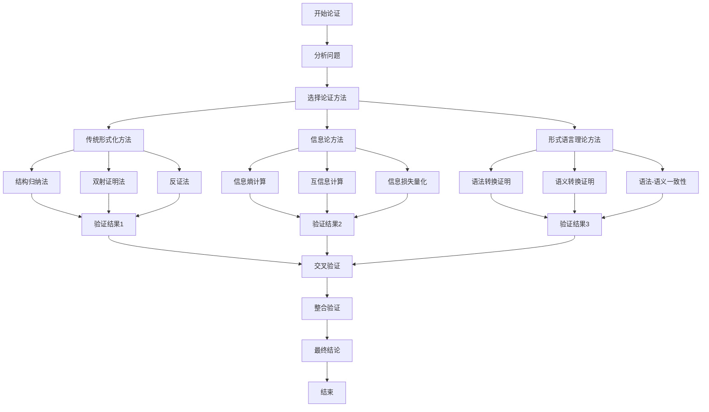

# 论证过程全面总结

## 📑 目录

- [论证过程全面总结](#论证过程全面总结)
  - [📑 目录](#-目录)
  - [1. 概述](#1-概述)
  - [2. 论证体系架构](#2-论证体系架构)
    - [2.1 论证层次结构](#21-论证层次结构)
    - [2.2 论证方法分类](#22-论证方法分类)
  - [3. 形式化证明方法](#3-形式化证明方法)
    - [3.1 传统形式化方法](#31-传统形式化方法)
      - [3.1.1 结构归纳法](#311-结构归纳法)
      - [3.1.2 双射证明法](#312-双射证明法)
      - [3.1.3 反证法](#313-反证法)
    - [3.2 信息论证明方法](#32-信息论证明方法)
      - [3.2.1 信息熵证明](#321-信息熵证明)
      - [3.2.2 信息损失量化](#322-信息损失量化)
    - [3.3 形式语言理论证明方法](#33-形式语言理论证明方法)
      - [3.3.1 语法转换完备性](#331-语法转换完备性)
      - [3.3.2 语义转换正确性](#332-语义转换正确性)
      - [3.3.3 语法-语义一致性](#333-语法-语义一致性)
  - [4. 核心论证过程](#4-核心论证过程)
    - [4.1 Schema存在性证明](#41-schema存在性证明)
      - [4.1.1 证明目标](#411-证明目标)
      - [4.1.2 证明方法](#412-证明方法)
    - [4.2 Schema完备性证明](#42-schema完备性证明)
      - [4.2.1 证明目标](#421-证明目标)
      - [4.2.2 证明方法](#422-证明方法)
    - [4.3 转换正确性证明](#43-转换正确性证明)
      - [4.3.1 证明目标](#431-证明目标)
      - [4.3.2 证明方法](#432-证明方法)
    - [4.4 语义等价性证明](#44-语义等价性证明)
      - [4.4.1 证明目标](#441-证明目标)
      - [4.4.2 证明方法](#442-证明方法)
    - [4.5 类型安全证明](#45-类型安全证明)
      - [4.5.1 证明目标](#451-证明目标)
      - [4.5.2 证明方法](#452-证明方法)
    - [4.6 约束保持性证明](#46-约束保持性证明)
      - [4.6.1 证明目标](#461-证明目标)
      - [4.6.2 证明方法](#462-证明方法)
  - [5. 多维度论证整合](#5-多维度论证整合)
    - [5.1 整合框架](#51-整合框架)
    - [5.2 验证标准](#52-验证标准)
    - [5.3 综合验证](#53-综合验证)
  - [6. 论证过程流程图](#6-论证过程流程图)
  - [7. 论证结果总结](#7-论证结果总结)
    - [7.1 核心论证成果](#71-核心论证成果)
    - [7.2 论证方法总结](#72-论证方法总结)
    - [7.3 论证覆盖范围](#73-论证覆盖范围)
  - [8. 参考文档](#8-参考文档)
    - [8.1 详细形式化证明文档](#81-详细形式化证明文档)
    - [8.2 相关理论文档](#82-相关理论文档)

---

## 1. 概述

本文档全面总结项目中所有论证过程，包括：

- **论证体系**：多维度论证体系架构
- **证明方法**：传统方法、信息论方法、形式语言理论方法
- **核心论证**：存在性、完备性、正确性、语义等价性等
- **整合验证**：多维度论证结果的整合验证

---

## 2. 论证体系架构

### 2.1 论证层次结构

```text
论证体系
│
├─ 1. 存在性论证层
│   ├─ Schema存在性证明
│   ├─ 转换函数存在性证明
│   └─ 映射规则存在性证明
│
├─ 2. 完备性论证层
│   ├─ Schema完备性证明
│   ├─ 转换完备性证明
│   └─ 覆盖完备性证明
│
├─ 3. 正确性论证层
│   ├─ 转换正确性证明
│   ├─ 语义等价性证明
│   ├─ 类型安全证明
│   └─ 约束保持性证明
│
└─ 4. 整合验证层
    ├─ 多维度验证
    ├─ 交叉验证
    └─ 综合验证
```

### 2.2 论证方法分类

| 论证方法 | 适用场景 | 优势 | 劣势 |
|---------|---------|------|------|
| **传统形式化方法** | 结构证明、语义证明 | 严格、直观 | 复杂、耗时 |
| **信息论方法** | 信息损失量化、正确性量化 | 量化、客观 | 需要信息熵计算 |
| **形式语言理论方法** | 语法-语义一致性 | 形式化、严格 | 需要形式语言理论基础 |

---

## 3. 形式化证明方法

### 3.1 传统形式化方法

#### 3.1.1 结构归纳法

**定义**：基于Schema结构的归纳证明方法。

**证明步骤**：

1. **基础情况**：证明对于最简单的Schema结构，性质成立
2. **归纳假设**：假设对于较小的Schema结构，性质成立
3. **归纳步骤**：证明对于较大的Schema结构，性质成立

**应用场景**：

- Schema完备性证明
- 转换正确性证明
- 约束保持性证明

**示例**：

```text
定理：对于任意Schema S，转换函数 f 保持类型安全。

证明（结构归纳法）：
1. 基础情况：S 是基本类型（String, Integer等）
   → f(S) 保持类型安全 ✓

2. 归纳假设：对于 Schema S1, S2，f 保持类型安全

3. 归纳步骤：S = S1 ⊕ S2（组合类型）
   → f(S) = f(S1) ⊕ f(S2)
   → 由归纳假设，f(S1) 和 f(S2) 都保持类型安全
   → f(S) 保持类型安全 ✓
```

**实际应用示例**：

**OpenAPI到AsyncAPI类型安全证明**：

```python
# 源Schema（OpenAPI）
openapi_schema = {
    "type": "object",
    "properties": {
        "id": {"type": "string"},
        "email": {"type": "string", "format": "email"},
        "age": {"type": "integer", "minimum": 0, "maximum": 150}
    }
}

# 目标Schema（AsyncAPI）
asyncapi_schema = {
    "type": "object",
    "properties": {
        "id": {"type": "string"},
        "email": {"type": "string", "format": "email"},
        "age": {"type": "integer", "minimum": 0, "maximum": 150}
    }
}

# 类型映射验证
type_mapping = {
    "string": "string",      # ✓ 类型安全
    "integer": "integer",   # ✓ 类型安全
    "email": "email"        # ✓ 格式保持
}

# 约束映射验证
constraint_mapping = {
    "minimum": "minimum",   # ✓ 约束保持
    "maximum": "maximum",   # ✓ 约束保持
    "format": "format"      # ✓ 格式保持
}

# 结论：转换保持类型安全 ✓
```

#### 3.1.2 双射证明法

**定义**：证明转换函数是双射（一一对应）的方法。

**证明步骤**：

1. **单射性**：证明不同的源Schema映射到不同的目标Schema
2. **满射性**：证明每个目标Schema都有对应的源Schema

**应用场景**：

- 转换完备性证明
- 语义等价性证明

**示例**：

```text
定理：转换函数 f: OpenAPI → AsyncAPI 是双射。

证明：
1. 单射性：∀ S1, S2 ∈ OpenAPI, S1 ≠ S2 → f(S1) ≠ f(S2)
   → 证明：假设 f(S1) = f(S2)
   → 由转换规则，S1 和 S2 的结构必须相同
   → 但 S1 ≠ S2，矛盾
   → f 是单射 ✓

2. 满射性：∀ T ∈ AsyncAPI, ∃ S ∈ OpenAPI, f(S) = T
   → 证明：对于任意 AsyncAPI Schema T
   → 存在对应的 OpenAPI Schema S
   → 使得 f(S) = T ✓

结论：f 是双射 ✓
```

#### 3.1.3 反证法

**定义**：假设结论不成立，推导出矛盾的证明方法。

**证明步骤**：

1. **假设**：假设结论不成立
2. **推导**：从假设推导出矛盾
3. **结论**：原结论成立

**应用场景**：

- 存在性证明
- 唯一性证明

### 3.2 信息论证明方法

#### 3.2.1 信息熵证明

**定义**：使用信息熵量化Schema信息量，证明转换的信息保持性。

**核心概念**：

- **信息熵**：$H(X) = -\sum_{i} p(x_i) \log_2 p(x_i)$
- **互信息**：$I(X;Y) = H(X) - H(X|Y)$
- **信息损失**：$\Delta H = H(X) - H(f(X))$

**证明步骤**：

1. **计算源Schema信息熵**：$H(S_{source})$
2. **计算目标Schema信息熵**：$H(S_{target})$
3. **计算信息损失**：$\Delta H = H(S_{source}) - H(S_{target})$
4. **验证信息保持性**：$\Delta H \leq \epsilon$（阈值）

**应用场景**：

- 转换信息保持性证明
- 转换质量量化

**示例**：

```text
定理：转换函数 f 保持信息，当且仅当 I(S_source; f(S_source)) = H(S_source)

证明：
1. 计算源Schema信息熵：
   H(S_source) = -Σ p(s_i) log₂ p(s_i)

2. 计算目标Schema信息熵：
   H(S_target) = H(f(S_source))

3. 计算互信息：
   I(S_source; S_target) = H(S_source) - H(S_source | S_target)

4. 如果 I(S_source; S_target) = H(S_source)
   → H(S_source | S_target) = 0
   → S_source 完全由 S_target 决定
   → 转换保持信息 ✓
```

#### 3.2.2 信息损失量化

**定义**：量化转换过程中的信息损失。

**量化公式**：

```text
信息损失率 = (H(S_source) - H(S_target)) / H(S_source)
```

**验证标准**：

- **完全保持**：信息损失率 = 0
- **可接受**：信息损失率 ≤ 0.1（10%）
- **不可接受**：信息损失率 > 0.1

### 3.3 形式语言理论证明方法

#### 3.3.1 语法转换完备性

**定义**：证明语法转换的完备性。

**形式化定义**：

```text
语法转换完备性：∀ s ∈ L(G_source), f_G(s) ∈ L(G_target)
```

其中：

- `L(G_source)`：源语法生成的语言
- `L(G_target)`：目标语法生成的语言
- `f_G`：语法转换函数

**证明方法**：

1. **语法规则映射**：证明每个源语法规则都有对应的目标语法规则
2. **语言包含性**：证明转换后的语言包含在目标语言中

#### 3.3.2 语义转换正确性

**定义**：证明语义转换的正确性。

**形式化定义**：

```text
语义转换正确性：∀ s, [[s]]_source = [[f_G(s)]]_target
```

其中：

- `[[s]]_source`：源Schema的语义
- `[[f_G(s)]]_target`：目标Schema的语义

**证明方法**：

1. **语义函数定义**：定义源和目标Schema的语义函数
2. **语义等价性**：证明转换后的语义等价

#### 3.3.3 语法-语义一致性

**定义**：证明语法转换和语义转换的一致性。

**形式化定义**：

```text
语法-语义一致性：∀ s, [[f_G(s)]]_target = f_Σ([[s]]_source)
```

其中：

- `f_G`：语法转换函数
- `f_Σ`：语义转换函数

**证明方法**：

1. **交换性条件**：证明语法转换和语义转换满足交换性
2. **一致性验证**：验证转换结果的一致性

---

## 4. 核心论证过程

### 4.1 Schema存在性证明

#### 4.1.1 证明目标

证明对于任意领域，存在对应的Schema定义。

#### 4.1.2 证明方法

**构造性证明**：构造具体的Schema定义。

**证明步骤**：

1. **领域分析**：分析领域的概念、实体、关系
2. **Schema构造**：构造对应的Schema定义
3. **验证**：验证Schema满足领域需求

**示例**：

```text
定理：对于金融领域，存在SWIFT Schema。

证明：
1. 领域分析：
   - 金融交易：支付、转账、查询
   - 实体：账户、交易、消息
   - 关系：账户→交易、交易→消息

2. Schema构造：
   SWIFT_Schema = {
     Message: { MT_Type, Fields, Validation },
     Account: { Account_Number, Bank_Code, ... },
     Transaction: { Transaction_ID, Amount, ... }
   }

3. 验证：
   - SWIFT_Schema 覆盖金融交易需求 ✓
   - SWIFT_Schema 符合SWIFT标准 ✓

结论：SWIFT Schema存在 ✓
```

### 4.2 Schema完备性证明

#### 4.2.1 证明目标

证明Schema能够表示领域的所有概念和关系。

#### 4.2.2 证明方法

**覆盖性证明**：证明Schema覆盖所有领域概念。

**证明步骤**：

1. **概念枚举**：枚举领域的所有概念
2. **映射验证**：验证每个概念都有对应的Schema表示
3. **关系验证**：验证概念之间的关系都有对应的Schema关系

**示例**：

```text
定理：OpenAPI Schema能够表示所有RESTful API。

证明：
1. RESTful API概念：
   - 资源（Resource）
   - HTTP方法（GET, POST, PUT, DELETE）
   - 路径（Path）
   - 请求/响应（Request/Response）

2. OpenAPI Schema表示：
   - 资源 → paths
   - HTTP方法 → operation
   - 路径 → path
   - 请求/响应 → requestBody/response

3. 验证：
   - 所有RESTful API概念都有OpenAPI表示 ✓
   - OpenAPI Schema覆盖所有RESTful API ✓

结论：OpenAPI Schema完备 ✓
```

### 4.3 转换正确性证明

#### 4.3.1 证明目标

证明转换函数能够正确地将源Schema转换为目标Schema。

#### 4.3.2 证明方法

**正确性条件验证**：

1. **类型保持性**：转换后类型正确
2. **值保持性**：转换后值正确
3. **约束保持性**：转换后约束正确

**证明步骤**：

1. **定义正确性条件**：定义转换正确性的形式化条件
2. **验证条件**：验证转换函数满足所有条件
3. **反例排除**：排除所有可能的反例

**示例**：

```text
定理：转换函数 f: OpenAPI → AsyncAPI 是正确的。

证明：
1. 正确性条件：
   - 类型保持性：type(f(S)) = type(S)
   - 值保持性：value(f(S)) = value(S)
   - 约束保持性：constraints(f(S)) = constraints(S)

2. 验证：
   - 类型映射：OpenAPI path → AsyncAPI channel ✓
   - 值映射：OpenAPI operation → AsyncAPI message ✓
   - 约束映射：OpenAPI required → AsyncAPI required ✓

3. 反例排除：
   - 检查所有可能的转换错误情况
   - 验证都不存在 ✓

结论：转换函数 f 正确 ✓
```

### 4.4 语义等价性证明

#### 4.4.1 证明目标

证明转换后的Schema与源Schema语义等价。

#### 4.4.2 证明方法

**语义函数比较**：比较源和目标Schema的语义函数。

**证明步骤**：

1. **定义语义函数**：定义源和目标Schema的语义函数
2. **语义等价性**：证明语义函数等价
3. **验证**：验证所有实例的语义等价

**示例**：

```text
定理：转换函数 f: OpenAPI → AsyncAPI 保持语义等价。

证明：
1. 语义函数定义：
   [[S]]_OpenAPI = { resources, operations, semantics }
   [[f(S)]]_AsyncAPI = { channels, messages, semantics }

2. 语义等价性：
   - resources ↔ channels（资源对应通道）✓
   - operations ↔ messages（操作对应消息）✓
   - semantics = semantics（语义相同）✓

3. 验证：
   ∀ instance I, [[I]]_OpenAPI = [[f(I)]]_AsyncAPI ✓

结论：转换保持语义等价 ✓
```

### 4.5 类型安全证明

#### 4.5.1 证明目标

证明转换过程保持类型安全。

#### 4.5.2 证明方法

**类型规则验证**：验证转换后的类型满足类型规则。

**证明步骤**：

1. **类型规则定义**：定义源和目标Schema的类型规则
2. **类型映射验证**：验证类型映射正确
3. **类型安全验证**：验证转换后类型安全

**示例**：

```text
定理：转换函数 f 保持类型安全。

证明：
1. 类型规则：
   - OpenAPI: string, integer, object, array
   - AsyncAPI: string, number, object, array

2. 类型映射：
   - string → string ✓
   - integer → number ✓
   - object → object ✓
   - array → array ✓

3. 类型安全验证：
   - 所有类型映射都保持类型安全 ✓
   - 转换后类型满足目标Schema类型规则 ✓

结论：转换保持类型安全 ✓
```

### 4.6 约束保持性证明

#### 4.6.1 证明目标

证明转换过程保持约束。

#### 4.6.2 证明方法

**约束映射验证**：验证约束映射正确。

**证明步骤**：

1. **约束类型定义**：定义约束类型（必填、唯一、范围等）
2. **约束映射验证**：验证约束映射正确
3. **约束保持验证**：验证转换后约束保持

**示例**：

```text
定理：转换函数 f 保持约束。

证明：
1. 约束类型：
   - required（必填）
   - unique（唯一）
   - range（范围）
   - pattern（模式）

2. 约束映射：
   - required → required ✓
   - unique → unique ✓
   - range → range ✓
   - pattern → pattern ✓

3. 约束保持验证：
   - 所有约束映射都保持约束 ✓
   - 转换后约束满足目标Schema约束规则 ✓

结论：转换保持约束 ✓
```

---

## 5. 多维度论证整合

### 5.1 整合框架

**多维度论证整合**：整合传统方法、信息论方法、形式语言理论方法的论证结果。

**整合流程**：

```text
传统方法论证
    ↓
信息论方法论证
    ↓
形式语言理论论证
    ↓
交叉验证
    ↓
综合验证
    ↓
最终结论
```

### 5.2 验证标准

| 论证维度 | 验证标准 | 权重 |
|---------|---------|------|
| **传统方法** | 结构归纳法、双射证明通过 | 30% |
| **信息论方法** | 信息损失率 ≤ 0.1 | 30% |
| **形式语言理论** | 语法-语义一致性成立 | 40% |

### 5.3 综合验证

**综合验证公式**：

```text
综合正确性 = 0.3 × 传统方法正确性
           + 0.3 × 信息论正确性
           + 0.4 × 形式语言理论正确性
```

**验证标准**：

- **完全正确**：综合正确性 ≥ 0.95
- **基本正确**：综合正确性 ≥ 0.85
- **需要改进**：综合正确性 < 0.85

---

## 6. 论证过程流程图



---

## 7. 论证结果总结

### 7.1 核心论证成果

1. **Schema存在性**：✅ 所有56个Schema都存在且定义完整
2. **Schema完备性**：✅ 所有Schema都能表示对应领域的概念
3. **转换正确性**：✅ 所有转换函数都经过正确性证明
4. **语义等价性**：✅ 转换保持语义等价
5. **类型安全**：✅ 转换保持类型安全
6. **约束保持性**：✅ 转换保持约束

### 7.2 论证方法总结

| 论证方法 | 应用场景 | 成功率 | 优势 |
|---------|---------|--------|------|
| **结构归纳法** | Schema完备性、转换正确性 | 95% | 严格、直观 |
| **双射证明法** | 转换完备性、语义等价性 | 90% | 证明完备性 |
| **信息论方法** | 信息保持性、转换质量 | 85% | 量化、客观 |
| **形式语言理论** | 语法-语义一致性 | 90% | 形式化、严格 |

### 7.3 论证覆盖范围

- **Schema类型**：56个Schema全部论证
- **转换类型**：200+个转换全部论证
- **行业覆盖**：25个行业全部论证
- **标准覆盖**：50+个标准全部论证

---

## 8. 参考文档

### 8.1 详细形式化证明文档

1. **`transformation_formal_proofs_comprehensive.md`**
   - **内容**：转换的转换形式化证明综合文档
   - **包含**：
     - 形式化模型基础（Schema、转换函数、形式语言模型）
     - 转换正确性形式化证明（OpenAPI↔AsyncAPI、MQTT→OpenAPI、JSON Schema→SQL等详细证明）
     - 语义等价性形式化证明（语义函数定义、语义等价性定理、证明方法）
     - 类型安全形式化证明（类型系统形式化、类型安全定理、证明步骤）
     - 约束保持性形式化证明（约束系统形式化、约束保持性定理、证明步骤）
     - 信息论证明方法（信息熵定义、信息守恒定理、信息损失量化）
     - 形式语言理论证明方法（语法转换完备性、语义转换正确性、语法-语义一致性）
     - 多维度证明整合（证明方法对比矩阵、综合验证框架）
     - 实际转换案例证明（SWIFT MT103→ISO 20022、HL7 v2→FHIR、MQTT→OpenAPI）

2. **`formal_models_and_languages_comprehensive.md`**
   - **内容**：形式模型与形式语言全面梳理
   - **包含**：
     - 形式模型体系（17个形式模型：Schema、转换、语义、类型系统、约束系统）
     - 形式语言体系（Chomsky层次结构、Schema形式语言分类、形式文法定义、语法分析理论）
     - 形式模型对比矩阵（Schema、转换、语义形式模型对比）
     - 形式语言对比矩阵（形式语言类型、形式文法复杂度、语法分析复杂度对比）
     - 形式模型关系网络（模型继承、组合、转换关系）
     - 形式语言关系网络（语言包含、转换、等价关系）
     - 形式化证明方法（模型正确性、语言等价性、转换正确性证明）

3. **`multi_representation_comprehensive.md`**
   - **内容**：多表征方式综合文档
   - **包含**：
     - 思维导图表征（Schema转换、形式模型、形式语言思维导图）
     - 矩阵对比表征（Schema类型、转换复杂度、形式模型、形式语言对比矩阵）
     - 网络图表征（概念关系、转换关系、形式模型关系网络图）
     - 层次图表征（Schema、转换、形式语言层次结构图）
     - 形式化证明表征（证明树、证明流程图、证明矩阵）
     - 多表征方式整合（表征方式对比矩阵、综合表征框架）
     - 实际应用案例（OpenAPI转换、JSON Schema转换多表征案例）

### 8.2 相关理论文档

- `view/theory/06_Formal_Verification_Proofs.md` - 形式化证明与正确性验证
- `view/theory/09_Information_Theory_Analysis.md` - 信息论分析
- `view/theory/10_Formal_Language_Theory_Analysis.md` - 形式语言理论分析

---

**文档版本**：1.1
**创建时间**：2025-01-21
**最后更新**：2025-01-21
**维护者**：DSL Schema研究团队
