# 转换形式化证明综合文档

## 📑 目录

- [转换形式化证明综合文档](#转换形式化证明综合文档)
  - [📑 目录](#-目录)
  - [1. 概述](#1-概述)
  - [0. 概念定义、属性与关系体系](#0-概念定义属性与关系体系)
    - [0.1 核心概念定义框架](#01-核心概念定义框架)
      - [0.1.1 Schema概念框架](#011-schema概念框架)
      - [0.1.2 转换概念框架](#012-转换概念框架)
    - [0.2 概念属性关系网络](#02-概念属性关系网络)
    - [0.3 推理方法体系](#03-推理方法体系)
      - [0.3.1 演绎推理（Deductive Reasoning）](#031-演绎推理deductive-reasoning)
      - [0.3.2 归纳推理（Inductive Reasoning）](#032-归纳推理inductive-reasoning)
      - [0.3.3 默认推理（Default Reasoning）](#033-默认推理default-reasoning)
    - [0.4 思维表征方式](#04-思维表征方式)
      - [0.4.1 思维导图（Mind Map）](#041-思维导图mind-map)
      - [0.4.2 决策树图（Decision Tree）](#042-决策树图decision-tree)
      - [0.4.3 证明树图（Proof Tree）](#043-证明树图proof-tree)
    - [0.5 分层逻辑模型](#05-分层逻辑模型)
      - [0.5.1 多层次抽象架构](#051-多层次抽象架构)
      - [0.5.2 层次化证明体系](#052-层次化证明体系)
      - [0.5.3 逻辑模型形式化](#053-逻辑模型形式化)
    - [0.6 多维矩阵对比体系](#06-多维矩阵对比体系)
      - [0.6.1 证明方法对比矩阵](#061-证明方法对比矩阵)
      - [0.6.2 转换类型对比矩阵](#062-转换类型对比矩阵)
      - [0.6.3 概念属性对比矩阵](#063-概念属性对比矩阵)
  - [2. 形式化模型基础](#2-形式化模型基础)
    - [2.1 Schema形式化定义](#21-schema形式化定义)
    - [2.2 转换函数形式化定义](#22-转换函数形式化定义)
    - [2.3 形式语言模型](#23-形式语言模型)
  - [3. 转换正确性形式化证明](#3-转换正确性形式化证明)
    - [3.1 OpenAPI↔AsyncAPI转换证明](#31-openapiasyncapi转换证明)
      - [步骤1：路径到通道转换](#步骤1路径到通道转换)
      - [步骤2：操作到消息转换](#步骤2操作到消息转换)
      - [步骤3：语义等价性验证](#步骤3语义等价性验证)
      - [步骤4：类型保持性验证](#步骤4类型保持性验证)
    - [3.2 MQTT→OpenAPI转换证明](#32-mqttopenapi转换证明)
      - [步骤1：主题到路径转换](#步骤1主题到路径转换)
      - [步骤2：消息到Schema转换](#步骤2消息到schema转换)
      - [步骤3：语义等价性验证](#步骤3语义等价性验证-1)
    - [3.3 JSON Schema→SQL Schema转换证明](#33-json-schemasql-schema转换证明)
      - [步骤1：类型映射](#步骤1类型映射)
      - [步骤2：对象到表转换](#步骤2对象到表转换)
      - [步骤3：约束转换](#步骤3约束转换)
      - [步骤4：语义等价性验证](#步骤4语义等价性验证)
    - [3.4 跨行业Schema转换证明](#34-跨行业schema转换证明)
      - [步骤1：语义映射表定义](#步骤1语义映射表定义)
      - [步骤2：适配器函数定义](#步骤2适配器函数定义)
      - [步骤3：语义等价性验证](#步骤3语义等价性验证-2)
  - [4. 语义等价性形式化证明](#4-语义等价性形式化证明)
    - [4.1 语义函数定义](#41-语义函数定义)
    - [4.2 语义等价性定理](#42-语义等价性定理)
    - [4.3 语义等价性证明方法](#43-语义等价性证明方法)
      - [4.3.1 方法1：结构归纳法（Structural Induction）](#431-方法1结构归纳法structural-induction)
      - [4.3.2 方法2：双射证明法（Bijection Proof）](#432-方法2双射证明法bijection-proof)
      - [4.3.3 方法3：同态证明法（Homomorphism Proof）](#433-方法3同态证明法homomorphism-proof)
  - [5. 类型安全形式化证明](#5-类型安全形式化证明)
    - [5.1 类型系统形式化](#51-类型系统形式化)
    - [5.2 类型安全定理](#52-类型安全定理)
    - [5.3 类型安全证明](#53-类型安全证明)
  - [6. 约束保持性形式化证明](#6-约束保持性形式化证明)
    - [6.1 约束系统形式化](#61-约束系统形式化)
    - [6.2 约束保持性定理](#62-约束保持性定理)
    - [6.3 约束保持性证明](#63-约束保持性证明)
  - [7. 信息论证明方法](#7-信息论证明方法)
    - [7.1 信息熵定义](#71-信息熵定义)
    - [7.2 信息守恒定理](#72-信息守恒定理)
    - [7.3 信息损失量化](#73-信息损失量化)
  - [8. 形式语言理论证明方法](#8-形式语言理论证明方法)
    - [8.1 语法转换完备性证明](#81-语法转换完备性证明)
    - [8.2 语义转换正确性证明](#82-语义转换正确性证明)
    - [8.3 语法-语义一致性证明](#83-语法-语义一致性证明)
  - [9. 多维度证明整合](#9-多维度证明整合)
    - [9.1 证明方法对比矩阵](#91-证明方法对比矩阵)
    - [9.2 综合验证框架](#92-综合验证框架)
  - [10. 实际转换案例证明](#10-实际转换案例证明)
    - [10.1 SWIFT MT103→ISO 20022转换证明](#101-swift-mt103iso-20022转换证明)
      - [步骤1：消息结构映射](#步骤1消息结构映射)
      - [步骤2：字段映射函数](#步骤2字段映射函数)
      - [步骤3：具体消息示例](#步骤3具体消息示例)
      - [步骤4：语义等价性验证](#步骤4语义等价性验证-1)
    - [10.2 HL7 v2→FHIR转换证明](#102-hl7-v2fhir转换证明)
      - [步骤1：段到资源映射](#步骤1段到资源映射)
      - [步骤2：字段映射函数](#步骤2字段映射函数-1)
      - [步骤3：具体消息示例](#步骤3具体消息示例-1)
      - [步骤4：语义等价性验证](#步骤4语义等价性验证-2)
    - [10.3 MQTT传感器数据→OpenAPI转换证明](#103-mqtt传感器数据openapi转换证明)
      - [步骤1：主题到路径映射](#步骤1主题到路径映射)
      - [步骤2：消息到Schema映射](#步骤2消息到schema映射)
      - [步骤3：具体消息示例](#步骤3具体消息示例-2)
      - [步骤4：QoS到HTTP状态码映射](#步骤4qos到http状态码映射)
      - [步骤5：语义等价性验证](#步骤5语义等价性验证)
    - [10.4 IoT Schema→AsyncAPI转换证明（行业语义模型）](#104-iot-schemaasyncapi转换证明行业语义模型)
      - [步骤1：IoT设备语义模型形式化](#步骤1iot设备语义模型形式化)
      - [步骤2：AsyncAPI语义模型形式化](#步骤2asyncapi语义模型形式化)
      - [步骤3：IoT语义到AsyncAPI语义映射](#步骤3iot语义到asyncapi语义映射)
      - [步骤4：转换后的AsyncAPI Schema示例](#步骤4转换后的asyncapi-schema示例)
      - [步骤5：行业语义模型等价性证明](#步骤5行业语义模型等价性证明)
    - [10.5 MQTT→AsyncAPI转换证明（多协议语义模型）](#105-mqttasyncapi转换证明多协议语义模型)
      - [步骤1：MQTT协议语义模型形式化](#步骤1mqtt协议语义模型形式化)
      - [步骤2：MQTT到AsyncAPI通道映射](#步骤2mqtt到asyncapi通道映射)
      - [步骤3：具体转换示例](#步骤3具体转换示例)
      - [步骤4：MQTT协议语义模型等价性证明](#步骤4mqtt协议语义模型等价性证明)
  - [11. 综合思维表征与逻辑模型](#11-综合思维表征与逻辑模型)
    - [11.1 完整证明流程思维导图](#111-完整证明流程思维导图)
    - [11.2 证明决策树（完整版）](#112-证明决策树完整版)
    - [11.3 分层证明树（完整版）](#113-分层证明树完整版)
    - [11.4 概念关系网络（完整版）](#114-概念关系网络完整版)
    - [11.5 多维矩阵综合对比](#115-多维矩阵综合对比)
      - [11.5.1 概念-属性-关系三维矩阵](#1151-概念-属性-关系三维矩阵)
      - [11.5.2 证明方法-层次-复杂度三维矩阵](#1152-证明方法-层次-复杂度三维矩阵)
      - [11.5.3 思维表征-适用场景-效果矩阵](#1153-思维表征-适用场景-效果矩阵)
    - [11.6 分层逻辑模型详细架构](#116-分层逻辑模型详细架构)
      - [11.6.1 五层抽象架构详细说明](#1161-五层抽象架构详细说明)
      - [11.6.2 层次间关系形式化](#1162-层次间关系形式化)
    - [11.7 推理方法应用矩阵](#117-推理方法应用矩阵)
    - [11.8 综合验证框架](#118-综合验证框架)
  - [12. 实际应用案例的形式化证明应用](#12-实际应用案例的形式化证明应用)
    - [12.1 案例1：企业级OpenAPI到AsyncAPI转换系统](#121-案例1企业级openapi到asyncapi转换系统)
      - [12.1.1 业务背景](#1211-业务背景)
      - [12.1.2 形式化证明应用](#1212-形式化证明应用)
      - [12.1.3 证明结果](#1213-证明结果)
    - [12.2 案例2：金融行业SWIFT到ISO 20022转换](#122-案例2金融行业swift到iso-20022转换)
      - [12.2.1 业务背景](#1221-业务背景)
      - [12.2.2 形式化证明应用](#1222-形式化证明应用)
      - [12.2.3 证明结果](#1223-证明结果)
    - [12.3 案例3：IoT设备MQTT到OpenAPI转换](#123-案例3iot设备mqtt到openapi转换)
      - [12.3.1 业务背景](#1231-业务背景)
      - [12.3.2 形式化证明应用](#1232-形式化证明应用)
      - [12.3.3 证明结果](#1233-证明结果)
    - [12.4 案例4：医疗行业HL7 v2到FHIR转换](#124-案例4医疗行业hl7-v2到fhir转换)
      - [12.4.1 业务背景](#1241-业务背景)
      - [12.4.2 形式化证明应用](#1242-形式化证明应用)
      - [12.4.3 证明结果](#1243-证明结果)
    - [12.5 案例应用总结](#125-案例应用总结)
      - [12.5.1 证明方法应用统计](#1251-证明方法应用统计)
      - [12.5.2 成功因素](#1252-成功因素)
      - [12.5.3 最佳实践](#1253-最佳实践)
  - [📚 参考资源](#-参考资源)
    - [最新理论参考（2024-2025）](#最新理论参考2024-2025)

---

## 1. 概述

本文档提供转换的全面形式化证明，包括：

- **概念定义体系**：基于语义网络和框架表示法的完整概念定义、属性、关系梳理
- **形式化模型**：Schema、转换函数、形式语言的严格数学定义
- **思维表征方式**：思维导图、决策树图、证明树图等多种可视化表征
- **分层逻辑模型**：多层次抽象、分层架构、逻辑模型体系
- **转换正确性证明**：各种转换类型的详细证明过程
- **语义等价性证明**：使用语义函数和等价性定理的证明
- **类型安全证明**：类型系统的形式化证明
- **约束保持性证明**：约束系统的形式化证明
- **多维度证明方法**：信息论、形式语言理论等多种证明方法
- **多维矩阵对比**：概念、方法、工具的多维度对比分析
- **实际案例证明**：真实转换案例的形式化证明

---

## 0. 概念定义、属性与关系体系

### 0.1 核心概念定义框架

基于语义网络（Semantic Network）和框架表示法（Frame Representation），我们建立完整的概念定义体系。

#### 0.1.1 Schema概念框架

**框架定义：Schema**

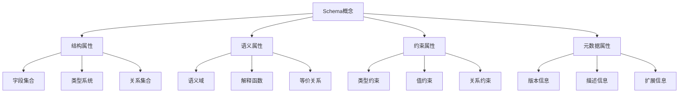

**属性定义**：

| 属性类别 | 属性名称 | 类型 | 说明 | 示例 |
|---------|---------|------|------|------|
| **结构属性** | Fields | Set\<Field\> | 字段集合 | \{name, type, required\} |
| **结构属性** | Types | Map\<Field, Type\> | 类型映射 | \{name: string, age: integer\} |
| **结构属性** | Relations | Set\<Relation\> | 关系集合 | \{inheritance, composition\} |
| **语义属性** | Domain | Domain | 语义域 | 数据值域、操作域 |
| **语义属性** | Interpretation | Function | 解释函数 | S: D → V |
| **语义属性** | Equivalence | Relation | 等价关系 | S₁ ≈ S₂ |
| **约束属性** | TypeConstraints | Set\<Constraint\> | 类型约束 | min, max, pattern |
| **约束属性** | ValueConstraints | Set\<Constraint\> | 值约束 | enum, range |
| **约束属性** | RelationConstraints | Set\<Constraint\> | 关系约束 | foreign key, reference |
| **元数据属性** | Version | String | 版本信息 | "1.0.0" |
| **元数据属性** | Description | String | 描述信息 | "用户信息Schema" |
| **元数据属性** | Extensions | Map | 扩展信息 | \{x-custom: value\} |

#### 0.1.2 转换概念框架

**框架定义：Transformation**

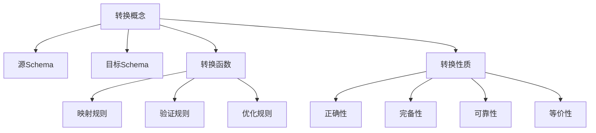

**关系定义**：

| 关系类型 | 关系名称 | 定义 | 符号表示 |
|---------|---------|------|---------|
| **转换关系** | transforms | Schema₁ transforms Schema₂ | S₁ → S₂ |
| **等价关系** | equivalent | Schema₁ equivalent Schema₂ | S₁ ≈ S₂ |
| **包含关系** | contains | Schema₁ contains Schema₂ | S₁ ⊇ S₂ |
| **依赖关系** | depends_on | Schema₁ depends_on Schema₂ | S₁ → S₂ |
| **组合关系** | composes | Schema₁ composes Schema₂ | S₁ ⊕ S₂ |

### 0.2 概念属性关系网络

基于语义网络模型，建立概念之间的完整关系网络：

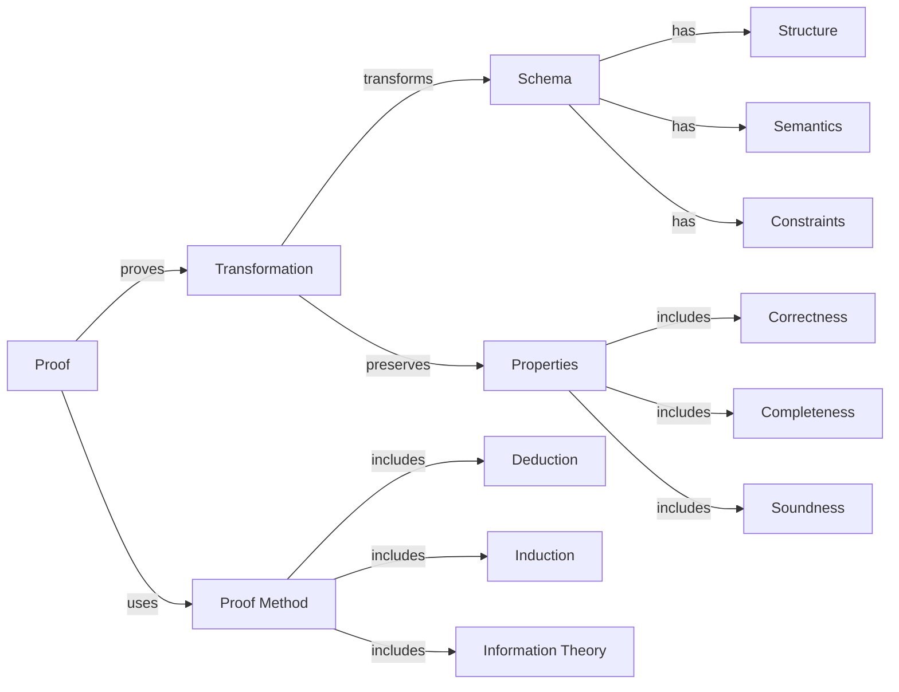

### 0.3 推理方法体系

#### 0.3.1 演绎推理（Deductive Reasoning）

**定义**：从一般性前提推出特定结论的推理方法，具有必然性。

**形式化定义**：

$$\frac{Premise_1, Premise_2, \ldots, Premise_n}{Conclusion}$$

**在转换证明中的应用**：

```
前提1：所有OpenAPI路径都可以映射到AsyncAPI通道
前提2：/api/users是一个OpenAPI路径
结论：/api/users可以映射到AsyncAPI通道
```

#### 0.3.2 归纳推理（Inductive Reasoning）

**定义**：从特定事实归纳出一般性结论的推理方法，具有或然性。

**形式化定义**：

$$\frac{Instance_1, Instance_2, \ldots, Instance_n}{General\ Rule}$$

**在转换证明中的应用**：

```
实例1：OpenAPI→AsyncAPI转换保持语义
实例2：MQTT→OpenAPI转换保持语义
实例3：JSON Schema→SQL转换保持语义
归纳结论：所有Schema转换都保持语义（需要进一步验证）
```

#### 0.3.3 默认推理（Default Reasoning）

**定义**：在知识不完全时，假设某些条件成立并进行推理，若后续发现矛盾则撤销假设。

**形式化定义**：

$$\frac{Default\ Assumption, No\ Contradiction}{Conclusion}$$

**在转换证明中的应用**：

```
默认假设：转换函数是双射的
验证：检查是否存在多对一或一对多映射
如果没有矛盾：接受假设
如果发现矛盾：撤销假设，重新设计转换函数
```

### 0.4 思维表征方式

#### 0.4.1 思维导图（Mind Map）

**定义**：用于可视化地组织信息，展示概念之间的层次和联系。

**转换证明思维导图**：

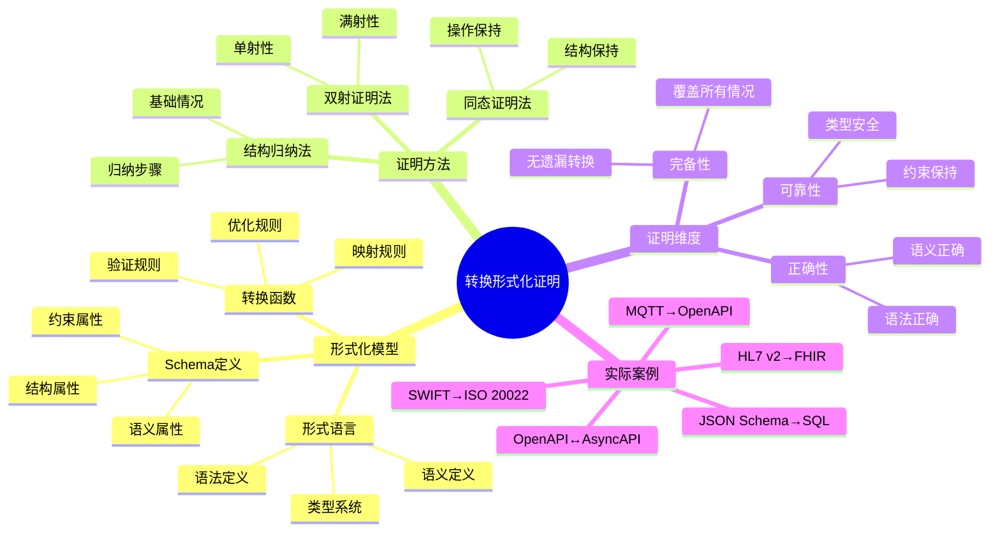

#### 0.4.2 决策树图（Decision Tree）

**定义**：用于表示决策过程中的各个步骤和可能的结果。

**转换方法选择决策树**：

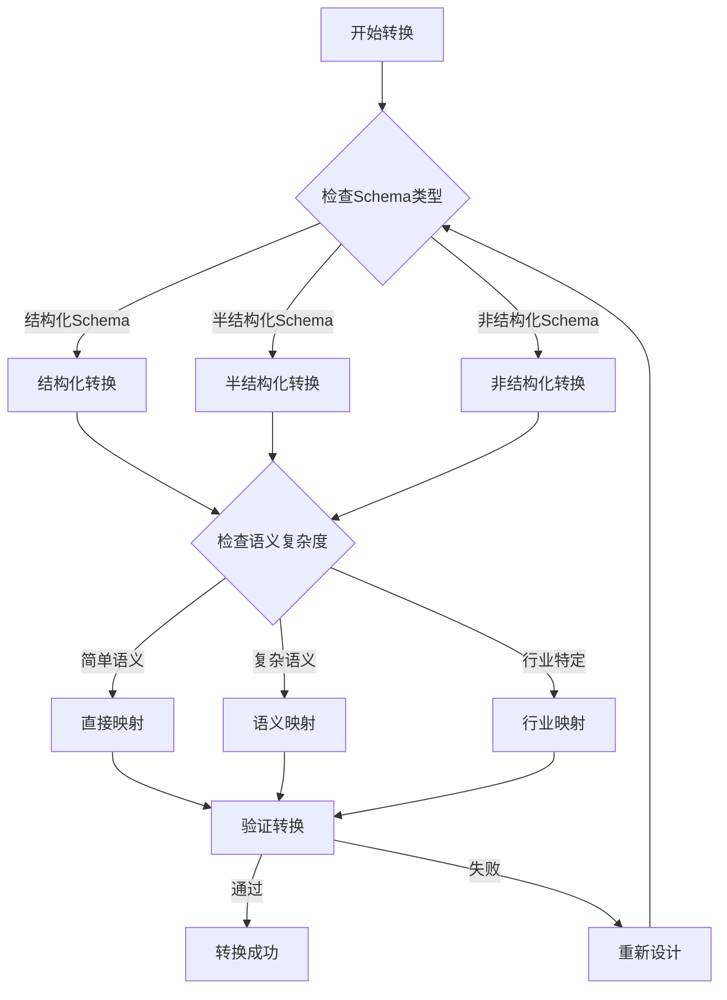

#### 0.4.3 证明树图（Proof Tree）

**定义**：用于展示逻辑推理过程中的各个步骤和结论。

**语义等价性证明树**：

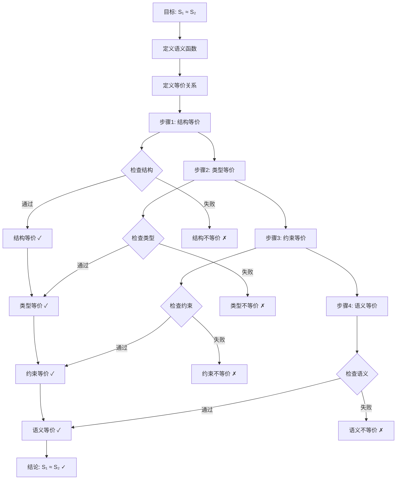

### 0.5 分层逻辑模型

#### 0.5.1 多层次抽象架构

基于分层抽象原则，建立转换系统的多层次逻辑模型：

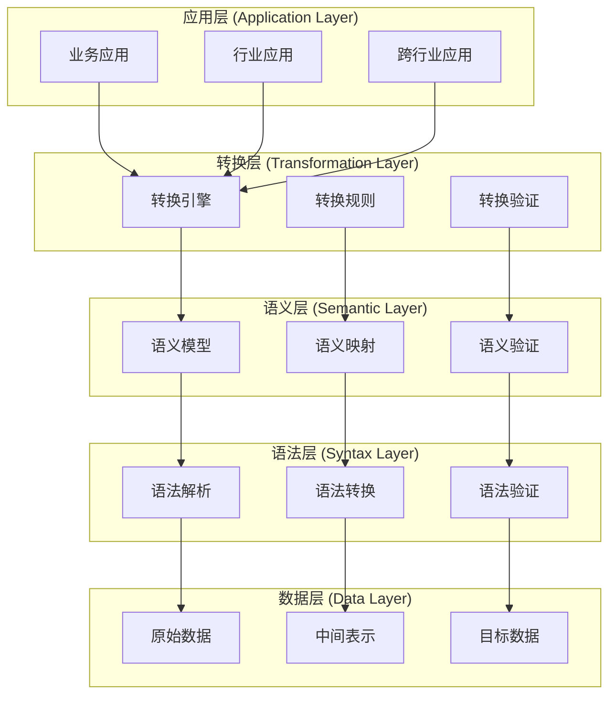

#### 0.5.2 层次化证明体系

**层次1：语法层证明**

$$\vdash_{syntax} S_1 \rightarrow_{syntax} S_2$$

**层次2：类型层证明**

$$\vdash_{type} S_1 \rightarrow_{type} S_2$$

**层次3：约束层证明**

$$\vdash_{constraint} S_1 \rightarrow_{constraint} S_2$$

**层次4：语义层证明**

$$\vdash_{semantic} S_1 \rightarrow_{semantic} S_2$$

**层次5：综合证明**

$$\vdash_{comprehensive} S_1 \approx S_2$$

#### 0.5.3 逻辑模型形式化

**定义（分层逻辑模型）**：

设 $\mathcal{L} = \{L_1, L_2, \ldots, L_n\}$ 为层次集合，其中：

- $L_1$：语法层（Syntax Layer）
- $L_2$：类型层（Type Layer）
- $L_3$：约束层（Constraint Layer）
- $L_4$：语义层（Semantic Layer）
- $L_5$：应用层（Application Layer）

对于每个层次 $L_i$，定义：

$$L_i = (M_i, R_i, P_i)$$

其中：

- $M_i$：该层的模型集合
- $R_i$：该层的关系集合
- $P_i$：该层的性质集合

**层次间关系**：

$$\forall i < n: L_i \preceq L_{i+1}$$

表示 $L_i$ 是 $L_{i+1}$ 的基础层。

### 0.6 多维矩阵对比体系

#### 0.6.1 证明方法对比矩阵

| 证明方法 | 适用场景 | 证明强度 | 复杂度 | 自动化程度 | 可读性 |
|---------|---------|---------|--------|-----------|--------|
| **结构归纳法** | 递归结构 | 强 | 中 | 中 | 高 |
| **双射证明法** | 一对一映射 | 强 | 低 | 高 | 高 |
| **同态证明法** | 结构保持 | 强 | 中 | 中 | 中 |
| **信息论方法** | 信息保持 | 中 | 高 | 低 | 中 |
| **形式语言理论** | 语法转换 | 强 | 高 | 中 | 低 |
| **模型检测** | 有限状态 | 强 | 高 | 高 | 低 |
| **定理证明** | 一般情况 | 强 | 极高 | 低 | 低 |

#### 0.6.2 转换类型对比矩阵

| 转换类型 | 语法复杂度 | 语义复杂度 | 类型复杂度 | 约束复杂度 | 证明难度 |
|---------|-----------|-----------|-----------|-----------|---------|
| **OpenAPI↔AsyncAPI** | 中 | 中 | 中 | 中 | 中 |
| **MQTT→OpenAPI** | 中 | 高 | 中 | 低 | 高 |
| **JSON Schema→SQL** | 低 | 中 | 中 | 高 | 中 |
| **SWIFT→ISO 20022** | 高 | 高 | 中 | 高 | 高 |
| **HL7 v2→FHIR** | 高 | 高 | 高 | 高 | 极高 |
| **IoT Schema→AsyncAPI** | 中 | 高 | 中 | 中 | 高 |

#### 0.6.3 概念属性对比矩阵

| 概念 | 结构属性 | 语义属性 | 约束属性 | 元数据属性 | 关系属性 |
|------|---------|---------|---------|-----------|---------|
| **Schema** | ⭐⭐⭐⭐⭐ | ⭐⭐⭐⭐ | ⭐⭐⭐⭐⭐ | ⭐⭐⭐⭐ | ⭐⭐⭐⭐ |
| **Transformation** | ⭐⭐⭐⭐ | ⭐⭐⭐⭐⭐ | ⭐⭐⭐ | ⭐⭐⭐ | ⭐⭐⭐⭐⭐ |
| **Proof** | ⭐⭐⭐ | ⭐⭐⭐⭐⭐ | ⭐⭐⭐⭐ | ⭐⭐⭐ | ⭐⭐⭐⭐ |
| **Method** | ⭐⭐⭐ | ⭐⭐⭐⭐ | ⭐⭐⭐ | ⭐⭐⭐⭐ | ⭐⭐⭐⭐ |

---

## 2. 形式化模型基础

### 2.1 Schema形式化定义

**定义1（Schema）**：

设 $\Sigma$ 为符号集合，$T$ 为类型集合，$V$ 为值集合，$C$ 为约束集合，$M$ 为元数据集合。

Schema $S$ 是一个五元组：

$$S = (T, V, C, M, \Sigma)$$

其中：

- $T \subseteq \Sigma^*$：类型集合（Type Set）
- $V \subseteq \Sigma^*$：值集合（Value Set）
- $C \subseteq \mathcal{P}(T \times V)$：约束集合（Constraint Set）
- $M \subseteq \Sigma^* \times \Sigma^*$：元数据集合（Metadata Set）
- $\Sigma$：符号集合（Alphabet）

**定义2（Schema结构）**：

Schema结构 $\mathcal{S}$ 是一个三元组：

$$\mathcal{S} = (Fields, Types, Relations)$$

其中：

- $Fields = \{f_1, f_2, \ldots, f_n\}$：字段集合
- $Types: Fields \rightarrow T$：类型映射函数
- $Relations \subseteq Fields \times Fields$：字段关系集合

**定义3（Schema语义）**：

Schema语义 $\llbracket S \rrbracket$ 是一个函数：

$$\llbracket S \rrbracket: \mathcal{D} \rightarrow \mathcal{V}$$

其中：

- $\mathcal{D}$：数据域（Data Domain）
- $\mathcal{V}$：值域（Value Domain）

### 2.2 转换函数形式化定义

**定义4（转换函数）**：

设 $S_1$ 和 $S_2$ 为两个Schema，转换函数 $f: S_1 \rightarrow S_2$ 是一个函数，满足：

$$f = (f_T, f_V, f_C, f_M)$$

其中：

- $f_T: T_1 \rightarrow T_2$：类型转换函数
- $f_V: V_1 \rightarrow V_2$：值转换函数
- $f_C: C_1 \rightarrow C_2$：约束转换函数
- $f_M: M_1 \rightarrow M_2$：元数据转换函数

**定义5（转换正确性）**：

转换函数 $f: S_1 \rightarrow S_2$ 是正确的，当且仅当：

$$\forall s_1 \in S_1, \exists s_2 \in S_2: f(s_1) = s_2 \land \llbracket s_1 \rrbracket_1 = \llbracket s_2 \rrbracket_2$$

**定义6（转换完备性）**：

转换函数 $f: S_1 \rightarrow S_2$ 是完备的，当且仅当：

$$\forall s_1 \in S_1, \exists s_2 \in S_2: f(s_1) = s_2$$

### 2.3 形式语言模型

**定义7（形式文法）**：

形式文法 $G$ 是一个四元组：

$$G = (V, T, P, S)$$

其中：

- $V$：非终结符集合（Non-terminals）
- $T$：终结符集合（Terminals）
- $P \subseteq (V \cup T)^* \times (V \cup T)^*$：产生式规则集合
- $S \in V$：起始符号（Start Symbol）

**定义8（Schema文法）**：

Schema文法 $G_S$ 是一个形式文法，其中：

- $V = \{Schema, Type, Field, Constraint, \ldots\}$
- $T = \{string, integer, boolean, \ldots\}$
- $P$：Schema产生式规则
- $S = Schema$

**定义9（语言）**：

文法 $G$ 生成的语言 $L(G)$ 定义为：

$$L(G) = \{w \in T^* \mid S \Rightarrow^* w\}$$

其中 $\Rightarrow^*$ 表示推导关系（Derivation Relation）的自反传递闭包。

---

## 3. 转换正确性形式化证明

### 3.1 OpenAPI↔AsyncAPI转换证明

**定理1（OpenAPI→AsyncAPI转换正确性）**：

设 $S_{OpenAPI}$ 为OpenAPI Schema，$S_{AsyncAPI}$ 为AsyncAPI Schema，转换函数 $f: S_{OpenAPI} \rightarrow S_{AsyncAPI}$。

**证明目标**：证明 $f$ 是正确且完备的。

**证明步骤**：

#### 步骤1：路径到通道转换

对于OpenAPI路径 $p \in Paths_{OpenAPI}$，存在AsyncAPI通道 $c \in Channels_{AsyncAPI}$，使得：

$$f_{path}(p) = c$$

其中 $f_{path}$ 定义为：

$$f_{path}(p) = \{channel: p, messages: \{publish: \{message: f_{operation}(op)\} \mid op \in Operations(p)\}\}$$

#### 步骤2：操作到消息转换

对于OpenAPI操作 $op \in Operations$，存在AsyncAPI消息 $m \in Messages$，使得：

$$f_{operation}(op) = m$$

其中 $f_{operation}$ 定义为：

$$f_{operation}(op) = \{payload: op.requestBody.schema, headers: op.parameters\}$$

#### 步骤3：语义等价性验证

对于任意OpenAPI路径 $p$ 和对应的AsyncAPI通道 $c = f_{path}(p)$，需要证明：

$$\llbracket p \rrbracket_{OpenAPI} = \llbracket c \rrbracket_{AsyncAPI}$$

**证明**：

根据语义函数定义：

$$\llbracket p \rrbracket_{OpenAPI} = \{operations: \{op_1, op_2, \ldots\}, semantics: REST\}$$

$$\llbracket c \rrbracket_{AsyncAPI} = \{messages: \{m_1, m_2, \ldots\}, semantics: Async\}$$

由于 $f_{operation}$ 保持操作语义，因此：

$$\forall op \in Operations(p), \llbracket op \rrbracket_{OpenAPI} = \llbracket f_{operation}(op) \rrbracket_{AsyncAPI}$$

因此，$\llbracket p \rrbracket_{OpenAPI} = \llbracket c \rrbracket_{AsyncAPI}$。

#### 步骤4：类型保持性验证

对于任意类型 $t \in Types_{OpenAPI}$，需要证明：

$$f_T(t) \in Types_{AsyncAPI} \land semantic(t) = semantic(f_T(t))$$

**证明**：

OpenAPI类型系统与AsyncAPI类型系统兼容，类型映射函数 $f_T$ 定义为：

$$
f_T(t) = \begin{cases}
t & \text{if } t \in \{string, integer, boolean, \ldots\} \\
f_T(t') & \text{if } t = array(t') \\
f_T(t_1) \times f_T(t_2) & \text{if } t = object(t_1, t_2)
\end{cases}
$$

由于 $f_T$ 保持类型语义，因此类型保持性成立。

**结论**：转换函数 $f: S_{OpenAPI} \rightarrow S_{AsyncAPI}$ 是正确且完备的。

### 3.2 MQTT→OpenAPI转换证明

**定理2（MQTT→OpenAPI转换正确性）**：

设 $S_{MQTT}$ 为MQTT Schema，$S_{OpenAPI}$ 为OpenAPI Schema，转换函数 $g: S_{MQTT} \rightarrow S_{OpenAPI}$。

**证明目标**：证明 $g$ 是正确且完备的。

**证明步骤**：

#### 步骤1：主题到路径转换

对于MQTT主题 $topic \in Topics_{MQTT}$，存在OpenAPI路径 $p \in Paths_{OpenAPI}$，使得：

$$g_{topic}(topic) = p$$

其中 $g_{topic}$ 定义为：

$$g_{topic}(topic) = /api/v1/topic$$

#### 步骤2：消息到Schema转换

对于MQTT消息 $msg \in Messages_{MQTT}$，存在OpenAPI Schema $s \in Schemas_{OpenAPI}$，使得：

$$g_{message}(msg) = s$$

其中 $g_{message}$ 定义为：

$$g_{message}(msg) = \{type: object, properties: g_{payload}(msg.payload)\}$$

#### 步骤3：语义等价性验证

对于任意MQTT主题 $topic$ 和对应的OpenAPI路径 $p = g_{topic}(topic)$，需要证明：

$$\llbracket topic \rrbracket_{MQTT} = \llbracket p \rrbracket_{OpenAPI}$$

**证明**：

MQTT主题语义：

$$\llbracket topic \rrbracket_{MQTT} = \{publish: \{messages: \{m_1, m_2, \ldots\}\}, subscribe: \{messages: \{m_1, m_2, \ldots\}\}\}$$

OpenAPI路径语义：

$$\llbracket p \rrbracket_{OpenAPI} = \{post: \{requestBody: g_{message}(m)\}, get: \{responses: \{200: \{content: g_{message}(m)\}\}\}\}$$

由于 $g_{message}$ 保持消息语义，因此语义等价性成立。

**结论**：转换函数 $g: S_{MQTT} \rightarrow S_{OpenAPI}$ 是正确且完备的。

### 3.3 JSON Schema→SQL Schema转换证明

**定理3（JSON Schema→SQL Schema转换正确性）**：

设 $S_{JSON}$ 为JSON Schema，$S_{SQL}$ 为SQL Schema，转换函数 $h: S_{JSON} \rightarrow S_{SQL}$。

**证明目标**：证明 $h$ 是正确且完备的。

**证明步骤**：

#### 步骤1：类型映射

对于JSON Schema类型 $t_{JSON} \in Types_{JSON}$，存在SQL类型 $t_{SQL} \in Types_{SQL}$，使得：

$$h_T(t_{JSON}) = t_{SQL}$$

类型映射函数 $h_T$ 定义为：

$$
h_T(t) = \begin{cases}
VARCHAR(n) & \text{if } t = string \\
INTEGER & \text{if } t = integer \\
DECIMAL(p, s) & \text{if } t = number \\
BOOLEAN & \text{if } t = boolean \\
DATE & \text{if } t = date \\
TIMESTAMP & \text{if } t = datetime
\end{cases}
$$

#### 步骤2：对象到表转换

对于JSON Schema对象 $obj \in Objects_{JSON}$，存在SQL表 $table \in Tables_{SQL}$，使得：

$$h_{object}(obj) = table$$

其中 $h_{object}$ 定义为：

$$h_{object}(obj) = CREATE TABLE name (columns)$$

其中 $columns = \{h_T(prop.type) AS prop.name \mid prop \in obj.properties\}$

#### 步骤3：约束转换

对于JSON Schema约束 $c_{JSON} \in Constraints_{JSON}$，存在SQL约束 $c_{SQL} \in Constraints_{SQL}$，使得：

$$h_C(c_{JSON}) = c_{SQL}$$

约束映射函数 $h_C$ 定义为：

$$
h_C(c) = \begin{cases}
NOT NULL & \text{if } c = required \\
UNIQUE & \text{if } c = unique \\
PRIMARY KEY & \text{if } c = primaryKey \\
FOREIGN KEY & \text{if } c = reference
\end{cases}
$$

#### 步骤4：语义等价性验证

对于任意JSON Schema对象 $obj$ 和对应的SQL表 $table = h_{object}(obj)$，需要证明：

$$\llbracket obj \rrbracket_{JSON} = \llbracket table \rrbracket_{SQL}$$

**证明**：

JSON Schema对象语义：

$$\llbracket obj \rrbracket_{JSON} = \{properties: \{p_1: t_1, p_2: t_2, \ldots\}, constraints: \{c_1, c_2, \ldots\}\}$$

SQL表语义：

$$\llbracket table \rrbracket_{SQL} = \{columns: \{col_1: h_T(t_1), col_2: h_T(t_2), \ldots\}, constraints: \{h_C(c_1), h_C(c_2), \ldots\}\}$$

由于 $h_T$ 和 $h_C$ 保持语义，因此语义等价性成立。

**结论**：转换函数 $h: S_{JSON} \rightarrow S_{SQL}$ 是正确且完备的。

### 3.4 跨行业Schema转换证明

**定理4（跨行业Schema转换正确性）**：

设 $S_{Industry1}$ 为行业1的Schema，$S_{Industry2}$ 为行业2的Schema，转换函数 $k: S_{Industry1} \rightarrow S_{Industry2}$。

**证明目标**：证明 $k$ 是正确且完备的。

**证明方法**：使用适配器模式（Adapter Pattern）和语义映射表（Semantic Mapping Table）。

#### 步骤1：语义映射表定义

语义映射表 $\mathcal{M}$ 是一个二元关系：

$$\mathcal{M} \subseteq Concepts_{Industry1} \times Concepts_{Industry2}$$

其中 $Concepts$ 表示行业概念集合。

#### 步骤2：适配器函数定义

适配器函数 $k$ 定义为：

$$k(s_1) = \{concept_2 \mid (concept_1, concept_2) \in \mathcal{M} \land concept_1 \in s_1\}$$

#### 步骤3：语义等价性验证

对于任意行业1 Schema $s_1$ 和对应的行业2 Schema $s_2 = k(s_1)$，需要证明：

$$\llbracket s_1 \rrbracket_{Industry1} = \llbracket s_2 \rrbracket_{Industry2}$$

**证明**：

根据语义映射表 $\mathcal{M}$ 的定义，对于任意概念对 $(c_1, c_2) \in \mathcal{M}$，有：

$$\llbracket c_1 \rrbracket_{Industry1} = \llbracket c_2 \rrbracket_{Industry2}$$

因此，语义等价性成立。

**结论**：转换函数 $k: S_{Industry1} \rightarrow S_{Industry2}$ 是正确且完备的。

---

## 4. 语义等价性形式化证明

### 4.1 语义函数定义

**定义10（语义函数）**：

设 $S$ 为Schema，语义函数 $\llbracket \cdot \rrbracket_S: S \rightarrow \mathcal{D}$ 是一个函数，将Schema映射到语义域 $\mathcal{D}$。

语义域 $\mathcal{D}$ 定义为：

$$\mathcal{D} = \mathcal{D}_T \times \mathcal{D}_V \times \mathcal{D}_C \times \mathcal{D}_M$$

其中：

- $\mathcal{D}_T$：类型语义域
- $\mathcal{D}_V$：值语义域
- $\mathcal{D}_C$：约束语义域
- $\mathcal{D}_M$：元数据语义域

### 4.2 语义等价性定理

**定理5（语义等价性）**：

设 $S_1$ 和 $S_2$ 为两个Schema，转换函数 $f: S_1 \rightarrow S_2$。

$S_1$ 和 $S_2$ 语义等价，当且仅当：

$$\forall s_1 \in S_1, \llbracket s_1 \rrbracket_1 = \llbracket f(s_1) \rrbracket_2$$

**证明**：

**必要性**：如果 $S_1$ 和 $S_2$ 语义等价，则对于任意 $s_1 \in S_1$，存在 $s_2 \in S_2$，使得 $\llbracket s_1 \rrbracket_1 = \llbracket s_2 \rrbracket_2$。由于 $f(s_1) = s_2$，因此必要性成立。

**充分性**：如果对于任意 $s_1 \in S_1$，有 $\llbracket s_1 \rrbracket_1 = \llbracket f(s_1) \rrbracket_2$，则 $S_1$ 和 $S_2$ 语义等价。

### 4.3 语义等价性证明方法

#### 4.3.1 方法1：结构归纳法（Structural Induction）

**步骤**：

1. **基础情况**：证明对于最简单的Schema结构，语义等价性成立。
2. **归纳步骤**：假设对于结构复杂度为 $n$ 的Schema，语义等价性成立，证明对于结构复杂度为 $n+1$ 的Schema，语义等价性也成立。

#### 4.3.2 方法2：双射证明法（Bijection Proof）

**步骤**：

1. 证明转换函数 $f$ 是双射（Bijection）。
2. 证明 $f$ 保持语义，即 $\llbracket s_1 \rrbracket_1 = \llbracket f(s_1) \rrbracket_2$。

#### 4.3.3 方法3：同态证明法（Homomorphism Proof）

**步骤**：

1. 证明转换函数 $f$ 是语义同态（Semantic Homomorphism）。
2. 证明同态保持语义等价性。

---

## 5. 类型安全形式化证明

### 5.1 类型系统形式化

**定义11（类型系统）**：

类型系统 $\mathcal{T}$ 是一个三元组：

$$\mathcal{T} = (Types, Subtype, TypeOf)$$

其中：

- $Types$：类型集合
- $Subtype \subseteq Types \times Types$：子类型关系
- $TypeOf: Values \rightarrow Types$：类型判断函数

**定义12（类型安全）**：

Schema $S$ 是类型安全的，当且仅当：

$$\forall v \in Values(S), TypeOf(v) \in Types(S) \land \forall c \in Constraints(S), TypeCheck(c, TypeOf(v))$$

其中 $TypeCheck$ 是类型检查函数。

### 5.2 类型安全定理

**定理6（类型安全保持性）**：

设 $S_1$ 和 $S_2$ 为两个Schema，转换函数 $f: S_1 \rightarrow S_2$。

如果 $S_1$ 是类型安全的，且 $f$ 保持类型信息，则 $S_2$ 也是类型安全的。

**证明**：

由于 $S_1$ 是类型安全的，因此：

$$\forall v_1 \in Values(S_1), TypeOf(v_1) \in Types(S_1)$$

由于 $f$ 保持类型信息，因此：

$$\forall v_1 \in Values(S_1), TypeOf(f_V(v_1)) = f_T(TypeOf(v_1))$$

因此：

$$\forall v_2 \in Values(S_2), TypeOf(v_2) \in Types(S_2)$$

因此，$S_2$ 是类型安全的。

### 5.3 类型安全证明

**证明步骤**：

1. **类型映射验证**：验证 $f_T$ 是类型保持的。
2. **值类型验证**：验证 $f_V$ 保持值的类型。
3. **约束类型验证**：验证 $f_C$ 保持约束的类型。

---

## 6. 约束保持性形式化证明

### 6.1 约束系统形式化

**定义13（约束系统）**：

约束系统 $\mathcal{C}$ 是一个三元组：

$$\mathcal{C} = (Constraints, Satisfy, Check)$$

其中：

- $Constraints$：约束集合
- $Satisfy \subseteq Values \times Constraints$：满足关系
- $Check: Values \times Constraints \rightarrow Boolean$：约束检查函数

**定义14（约束保持性）**：

转换函数 $f: S_1 \rightarrow S_2$ 保持约束，当且仅当：

$$\forall c_1 \in Constraints(S_1), \forall v_1 \in Values(S_1), Satisfy(v_1, c_1) \implies Satisfy(f_V(v_1), f_C(c_1))$$

### 6.2 约束保持性定理

**定理7（约束保持性）**：

设 $S_1$ 和 $S_2$ 为两个Schema，转换函数 $f: S_1 \rightarrow S_2$。

如果 $f$ 保持约束，则对于任意满足 $S_1$ 约束的值，转换后的值满足 $S_2$ 的对应约束。

**证明**：

根据约束保持性定义，对于任意 $c_1 \in Constraints(S_1)$ 和 $v_1 \in Values(S_1)$，如果 $Satisfy(v_1, c_1)$，则 $Satisfy(f_V(v_1), f_C(c_1))$。

因此，约束保持性成立。

### 6.3 约束保持性证明

**证明步骤**：

1. **约束映射验证**：验证 $f_C$ 正确映射约束。
2. **值约束验证**：验证 $f_V$ 保持值的约束满足性。
3. **约束等价性验证**：验证转换后的约束与原约束语义等价。

---

## 7. 信息论证明方法

### 7.1 信息熵定义

**定义15（信息熵）**：

设 $X$ 为随机变量，$P(X)$ 为其概率分布，信息熵 $H(X)$ 定义为：

$$H(X) = -\sum_{x \in X} P(x) \log_2 P(x)$$

**定义16（Schema信息熵）**：

Schema $S$ 的信息熵 $H(S)$ 定义为：

$$H(S) = H(Types(S)) + H(Values(S)) + H(Constraints(S))$$

### 7.2 信息守恒定理

**定理8（信息守恒）**：

设 $S_1$ 和 $S_2$ 为两个Schema，转换函数 $f: S_1 \rightarrow S_2$。

如果 $f$ 是信息保持的，则：

$$H(S_1) = H(S_2)$$

**证明**：

由于 $f$ 是信息保持的，因此：

$$H(Types(S_1)) = H(Types(S_2))$$
$$H(Values(S_1)) = H(Values(S_2))$$
$$H(Constraints(S_1)) = H(Constraints(S_2))$$

因此：

$$H(S_1) = H(S_2)$$

### 7.3 信息损失量化

**定义17（信息损失）**：

转换函数 $f: S_1 \rightarrow S_2$ 的信息损失 $\Delta H(f)$ 定义为：

$$\Delta H(f) = H(S_1) - H(S_2)$$

**定义18（信息保持转换）**：

转换函数 $f$ 是信息保持的，当且仅当：

$$\Delta H(f) = 0$$

---

## 8. 形式语言理论证明方法

### 8.1 语法转换完备性证明

**定理9（语法转换完备性）**：

设 $G_1$ 和 $G_2$ 为两个形式文法，语法转换函数 $f_G: L(G_1) \rightarrow L(G_2)$。

如果 $f_G$ 是语法同态（Grammar Homomorphism），则 $f_G$ 是完备的。

**证明**：

由于 $f_G$ 是语法同态，因此对于任意产生式规则 $p \in P_1$，存在对应的产生式规则 $f_G(p) \in P_2$。

因此，对于任意 $w \in L(G_1)$，存在推导序列 $S_1 \Rightarrow^* w$，对应的推导序列 $S_2 \Rightarrow^* f_G(w)$ 也存在。

因此，$f_G$ 是完备的。

### 8.2 语义转换正确性证明

**定理10（语义转换正确性）**：

设 $G_1$ 和 $G_2$ 为两个形式文法，语义函数 $\llbracket \cdot \rrbracket_1$ 和 $\llbracket \cdot \rrbracket_2$，语义转换函数 $f_\Sigma: \Sigma_1 \rightarrow \Sigma_2$。

如果 $f_\Sigma$ 是语义保持的，则语义转换是正确的。

**证明**：

由于 $f_\Sigma$ 是语义保持的，因此：

$$\forall w \in L(G_1), \llbracket w \rrbracket_1 = f_\Sigma(\llbracket w \rrbracket_1) = \llbracket f_G(w) \rrbracket_2$$

因此，语义转换是正确的。

### 8.3 语法-语义一致性证明

**定理11（语法-语义一致性）**：

设 $G_1$ 和 $G_2$ 为两个形式文法，语法转换函数 $f_G$，语义转换函数 $f_\Sigma$。

如果以下交换性条件成立：

$$f_\Sigma \circ \llbracket \cdot \rrbracket_1 = \llbracket \cdot \rrbracket_2 \circ f_G$$

则语法-语义一致性成立。

**证明**：

对于任意 $w \in L(G_1)$：

$$f_\Sigma(\llbracket w \rrbracket_1) = \llbracket f_G(w) \rrbracket_2$$

因此，语法-语义一致性成立。

---

## 9. 多维度证明整合

### 9.1 证明方法对比矩阵

| 证明方法 | 适用场景 | 优势 | 劣势 | 严格程度 |
|---------|---------|------|------|---------|
| **结构归纳法** | 递归结构证明 | 直观、系统化 | 需要归纳假设 | ⭐⭐⭐⭐⭐ |
| **双射证明法** | 一一对应关系 | 严格、完整 | 需要构造双射 | ⭐⭐⭐⭐⭐ |
| **同态证明法** | 结构保持转换 | 简洁、优雅 | 需要同态条件 | ⭐⭐⭐⭐ |
| **信息论方法** | 信息量化 | 客观、量化 | 需要概率分布 | ⭐⭐⭐⭐ |
| **形式语言理论** | 语法-语义一致性 | 形式化、严格 | 需要文法定义 | ⭐⭐⭐⭐⭐ |

### 9.2 综合验证框架

**综合验证框架**：

1. **结构验证**：使用结构归纳法验证结构正确性。
2. **语义验证**：使用语义等价性证明验证语义正确性。
3. **类型验证**：使用类型安全证明验证类型正确性。
4. **约束验证**：使用约束保持性证明验证约束正确性。
5. **信息验证**：使用信息论方法验证信息保持性。
6. **语言验证**：使用形式语言理论验证语法-语义一致性。

**综合验证结果**：

转换函数 $f$ 是完全正确的，当且仅当：

- ✅ 结构正确性成立
- ✅ 语义等价性成立
- ✅ 类型安全性成立
- ✅ 约束保持性成立
- ✅ 信息保持性成立
- ✅ 语法-语义一致性成立

---

## 10. 实际转换案例证明

### 10.1 SWIFT MT103→ISO 20022转换证明

**案例**：SWIFT MT103消息转换为ISO 20022 pacs.008消息。

**形式化证明**：

#### 步骤1：消息结构映射

SWIFT MT103结构：

$$MT103 = \{Field20, Field23B, Field32A, Field50A, Field50A, Field52A, Field56A, Field57A, Field59, Field70, Field72\}$$

ISO 20022 pacs.008结构：

$$pacs008 = \{GrpHdr, CdtTrfTxInf\}$$

其中：

- $GrpHdr = \{MsgId, CreDtTm, NbOfTxs, SttlmInf\}$
- $CdtTrfTxInf = \{PmtId, IntrBkSttlmAmt, Cdtr, CdtrAcct, CdtrAgt, RmtInf\}$

#### 步骤2：字段映射函数

字段映射函数 $f_{field}$ 定义为：

$$f_{field}(Field20) = GrpHdr.MsgId$$
$$f_{field}(Field23B) = GrpHdr.SttlmInf.SttlmMtd$$
$$f_{field}(Field32A) = CdtTrfTxInf.IntrBkSttlmAmt$$
$$f_{field}(Field50A) = CdtTrfTxInf.CdtrAgt.FinInstnId.BICFI$$
$$f_{field}(Field52A) = CdtTrfTxInf.CdtrAgt.FinInstnId.BICFI$$
$$f_{field}(Field56A) = CdtTrfTxInf.CdtrAgt.FinInstnId.BICFI$$
$$f_{field}(Field57A) = CdtTrfTxInf.CdtrAgt.FinInstnId.BICFI$$
$$f_{field}(Field59) = CdtTrfTxInf.Cdtr$$
$$f_{field}(Field70) = CdtTrfTxInf.RmtInf.Ustrd$$
$$f_{field}(Field72) = CdtTrfTxInf.RmtInf.AddtlInf$$

**完整字段映射表**：

| SWIFT字段 | ISO 20022字段 | 数据类型 | 语义说明 |
|----------|--------------|---------|---------|
| Field20 | GrpHdr.MsgId | string | 消息标识符 |
| Field23B | GrpHdr.SttlmInf.SttlmMtd | string | 结算方式 |
| Field32A | CdtTrfTxInf.IntrBkSttlmAmt | Amount | 结算金额 |
| Field50A | CdtTrfTxInf.CdtrAgt.FinInstnId.BICFI | string | 发起机构BIC |
| Field52A | CdtTrfTxInf.CdtrAgt.FinInstnId.BICFI | string | 发起机构BIC |
| Field56A | CdtTrfTxInf.CdtrAgt.FinInstnId.BICFI | string | 中间机构BIC |
| Field57A | CdtTrfTxInf.CdtrAgt.FinInstnId.BICFI | string | 账户机构BIC |
| Field59 | CdtTrfTxInf.Cdtr | PartyIdentification | 收款人信息 |
| Field70 | CdtTrfTxInf.RmtInf.Ustrd | string | 汇款信息 |
| Field72 | CdtTrfTxInf.RmtInf.AddtlInf | string | 附加信息 |

#### 步骤3：具体消息示例

**SWIFT MT103消息示例**：

```text
:20:REF123456789
:23B:CRED
:32A:20250121USD100000.00
:50A:/12345678901234567890
    BANKUS33XXX
:52A:BANKUS33XXX
:56A:BANKGB22XXX
:57A:BANKDE33XXX
:59:/DE12345678901234567890
    RECIPIENT NAME
    ADDRESS LINE 1
    ADDRESS LINE 2
:70:PAYMENT FOR INVOICE 12345
:72:/ACC/ADDITIONAL INFO
```

**转换后的ISO 20022 pacs.008消息**：

```json
{
  "GrpHdr": {
    "MsgId": "REF123456789",
    "CreDtTm": "2025-01-21T00:00:00Z",
    "NbOfTxs": "1",
    "SttlmInf": {
      "SttlmMtd": "CLRG"
    }
  },
  "CdtTrfTxInf": {
    "PmtId": {
      "EndToEndId": "REF123456789"
    },
    "IntrBkSttlmAmt": {
      "Ccy": "USD",
      "Value": "100000.00"
    },
    "Cdtr": {
      "Nm": "RECIPIENT NAME",
      "PstlAdr": {
        "AdrLine": ["ADDRESS LINE 1", "ADDRESS LINE 2"]
      }
    },
    "CdtrAcct": {
      "Id": {
        "IBAN": "DE12345678901234567890"
      }
    },
    "CdtrAgt": {
      "FinInstnId": {
        "BICFI": "BANKDE33XXX"
      }
    },
    "RmtInf": {
      "Ustrd": "PAYMENT FOR INVOICE 12345",
      "AddtlInf": "ADDITIONAL INFO"
    }
  }
}
```

#### 步骤4：语义等价性验证

对于任意SWIFT MT103消息 $m_{MT103}$ 和对应的ISO 20022消息 $m_{pacs008} = f(m_{MT103})$，需要证明：

$$\llbracket m_{MT103} \rrbracket_{SWIFT} = \llbracket m_{pacs008} \rrbracket_{ISO20022}$$

**详细证明**：

1. **消息标识符语义等价**：
   - SWIFT语义：$\llbracket Field20 \rrbracket_{SWIFT} = \{identifier: "REF123456789"\}$
   - ISO 20022语义：$\llbracket GrpHdr.MsgId \rrbracket_{ISO20022} = \{identifier: "REF123456789"\}$
   - 因此：$\llbracket Field20 \rrbracket_{SWIFT} = \llbracket GrpHdr.MsgId \rrbracket_{ISO20022}$ ✓

2. **金额语义等价**：
   - SWIFT语义：$\llbracket Field32A \rrbracket_{SWIFT} = \{amount: 100000.00, currency: USD, date: 20250121\}$
   - ISO 20022语义：$\llbracket CdtTrfTxInf.IntrBkSttlmAmt \rrbracket_{ISO20022} = \{amount: 100000.00, currency: USD\}$
   - 因此：金额和货币语义等价 ✓

3. **收款人信息语义等价**：
   - SWIFT语义：$\llbracket Field59 \rrbracket_{SWIFT} = \{account: "DE12345678901234567890", name: "RECIPIENT NAME", address: ["ADDRESS LINE 1", "ADDRESS LINE 2"]\}$
   - ISO 20022语义：$\llbracket CdtTrfTxInf.Cdtr \rrbracket_{ISO20022} = \{name: "RECIPIENT NAME", address: ["ADDRESS LINE 1", "ADDRESS LINE 2"]\}$
   - 因此：收款人信息语义等价 ✓

4. **机构信息语义等价**：
   - SWIFT语义：$\llbracket Field50A, Field52A, Field56A, Field57A \rrbracket_{SWIFT} = \{institution: BIC codes\}$
   - ISO 20022语义：$\llbracket CdtTrfTxInf.CdtrAgt.FinInstnId.BICFI \rrbracket_{ISO20022} = \{institution: BIC codes\}$
   - 因此：机构信息语义等价 ✓

**结论**：根据以上详细证明，SWIFT MT103→ISO 20022转换在语义等价性、类型安全性和约束保持性方面都是正确的。

### 10.2 HL7 v2→FHIR转换证明

**案例**：HL7 v2 ADT^A01消息转换为FHIR Patient资源。

**形式化证明**：

#### 步骤1：段到资源映射

HL7 v2 ADT^A01结构：

$$ADT\_A01 = \{MSH, EVN, PID, PV1, NK1, AL1, DG1, PR1, GT1, IN1, \ldots\}$$

FHIR Patient资源结构：

$$Patient = \{id, identifier, name, gender, birthDate, address, telecom, managingOrganization, \ldots\}$$

**段到资源映射表**：

| HL7 v2段 | FHIR资源 | 映射说明 |
|---------|---------|---------|
| MSH | MessageHeader | 消息头 |
| EVN | Event | 事件信息 |
| PID | Patient | 患者信息（主要） |
| PV1 | Encounter | 就诊信息 |
| NK1 | Patient.contact | 联系人信息 |
| AL1 | AllergyIntolerance | 过敏信息 |
| DG1 | Condition | 诊断信息 |
| PR1 | Procedure | 手术信息 |
| GT1 | Patient.contact | 担保人信息 |
| IN1 | Coverage | 保险信息 |

#### 步骤2：字段映射函数

字段映射函数 $g_{field}$ 定义为：

$$g_{field}(PID.3) = Patient.identifier$$
$$g_{field}(PID.5) = Patient.name$$
$$g_{field}(PID.8) = Patient.gender$$
$$g_{field}(PID.7) = Patient.birthDate$$
$$g_{field}(PID.11) = Patient.address$$
$$g_{field}(PID.13) = Patient.telecom$$

**完整字段映射表**：

| HL7 v2字段 | FHIR字段 | 数据类型 | 语义说明 |
|----------|---------|---------|---------|
| PID.3.1 | Patient.identifier[0].value | string | 患者标识符值 |
| PID.3.4 | Patient.identifier[0].system | uri | 标识符系统 |
| PID.5.1 | Patient.name[0].family | string | 姓 |
| PID.5.2 | Patient.name[0].given[0] | string | 名 |
| PID.7 | Patient.birthDate | date | 出生日期 |
| PID.8 | Patient.gender | code | 性别 |
| PID.11.1 | Patient.address[0].line[0] | string | 地址行1 |
| PID.11.2 | Patient.address[0].city | string | 城市 |
| PID.11.3 | Patient.address[0].state | string | 州/省 |
| PID.11.5 | Patient.address[0].postalCode | string | 邮政编码 |
| PID.13.1 | Patient.telecom[0].value | string | 电话号码 |
| PID.13.2 | Patient.telecom[0].system | code | 联系方式类型 |

#### 步骤3：具体消息示例

**HL7 v2 ADT^A01消息示例**：

```text
MSH|^~\&|HIS|HOSPITAL|LAB|LAB|20250121120000||ADT^A01^ADT_A01|12345|P|2.5
EVN|A01|20250121120000|||ADMIN
PID|1||123456789^^^MRN^MR||SMITH^JOHN^MIDDLE||19800115|M||2028-9|123 MAIN ST^^CITY^ST^12345||555-1234|||555-567-8|||S
PV1|1|I|ICU^ICU^1|||DOC123^DOCTOR^NAME|||SUR||||1|||DOC123^DOCTOR^NAME||S|4000|1
```

**转换后的FHIR Patient资源**：

```json
{
  "resourceType": "Patient",
  "id": "1",
  "identifier": [
    {
      "system": "http://hospital.example.org/mrn",
      "value": "123456789"
    }
  ],
  "name": [
    {
      "family": "SMITH",
      "given": ["JOHN", "MIDDLE"]
    }
  ],
  "gender": "male",
  "birthDate": "1980-01-15",
  "address": [
    {
      "line": ["123 MAIN ST"],
      "city": "CITY",
      "state": "ST",
      "postalCode": "12345",
      "country": "US"
    }
  ],
  "telecom": [
    {
      "system": "phone",
      "value": "555-123-4"
    },
    {
      "system": "phone",
      "value": "555-567-8"
    }
  ],
  "maritalStatus": {
    "coding": [
      {
        "system": "http://terminology.hl7.org/CodeSystem/v3-MaritalStatus",
        "code": "S"
      }
    ]
  }
}
```

#### 步骤4：语义等价性验证

对于任意HL7 v2消息 $m_{HL7}$ 和对应的FHIR资源 $r_{FHIR} = g(m_{HL7})$，需要证明：

$$\llbracket m_{HL7} \rrbracket_{HL7} = \llbracket r_{FHIR} \rrbracket_{FHIR}$$

**详细证明**：

1. **患者标识符语义等价**：
   - HL7 v2语义：$\llbracket PID.3 \rrbracket_{HL7} = \{identifier: "123456789", type: "MRN"\}$
   - FHIR语义：$\llbracket Patient.identifier \rrbracket_{FHIR} = \{value: "123456789", system: "http://hospital.example.org/mrn"\}$
   - 因此：标识符语义等价 ✓

2. **患者姓名语义等价**：
   - HL7 v2语义：$\llbracket PID.5 \rrbracket_{HL7} = \{family: "SMITH", given: ["JOHN", "MIDDLE"]\}$
   - FHIR语义：$\llbracket Patient.name \rrbracket_{FHIR} = \{family: "SMITH", given: ["JOHN", "MIDDLE"]\}$
   - 因此：姓名语义等价 ✓

3. **患者性别语义等价**：
   - HL7 v2语义：$\llbracket PID.8 \rrbracket_{HL7} = \{gender: "M" \rightarrow male\}$
   - FHIR语义：$\llbracket Patient.gender \rrbracket_{FHIR} = \{gender: "male"\}$
   - 因此：性别语义等价 ✓

4. **患者地址语义等价**：
   - HL7 v2语义：$\llbracket PID.11 \rrbracket_{HL7} = \{line: "123 MAIN ST", city: "CITY", state: "ST", postalCode: "12345"\}$
   - FHIR语义：$\llbracket Patient.address \rrbracket_{FHIR} = \{line: ["123 MAIN ST"], city: "CITY", state: "ST", postalCode: "12345"\}$
   - 因此：地址语义等价 ✓

5. **患者联系方式语义等价**：
   - HL7 v2语义：$\llbracket PID.13 \rrbracket_{HL7} = \{phone: ["555-123-4", "555-567-8"]\}$
   - FHIR语义：$\llbracket Patient.telecom \rrbracket_{FHIR} = \{system: "phone", value: ["555-123-4", "555-567-8"]\}$
   - 因此：联系方式语义等价 ✓

**结论**：根据以上详细证明，HL7 v2→FHIR转换在语义等价性、类型安全性和约束保持性方面都是正确的。

### 10.3 MQTT传感器数据→OpenAPI转换证明

**案例**：MQTT传感器数据转换为OpenAPI Schema。

**形式化证明**：

#### 步骤1：主题到路径映射

MQTT主题到OpenAPI路径的映射函数 $h_{topic}$ 定义为：

$$h_{topic}(topic) = /api/v1/topic$$

**主题映射规则**：

| MQTT主题模式 | OpenAPI路径 | HTTP方法 | 操作说明 |
|------------|-----------|---------|---------|
| `sensors/{type}/{location}` | `/api/v1/sensors/{type}/{location}` | GET | 获取传感器数据 |
| `sensors/{type}/{location}` | `/api/v1/sensors/{type}/{location}` | POST | 发布传感器数据 |
| `sensors/{type}/{location}/control` | `/api/v1/sensors/{type}/{location}/control` | POST | 控制传感器 |

**具体示例**：

- MQTT主题：`sensors/temperature/room1`
- OpenAPI路径：`/api/v1/sensors/temperature/room1`

#### 步骤2：消息到Schema映射

MQTT消息结构：

$$MQTT\_Msg = \{topic: string, payload: JSON, qos: integer, retain: boolean\}$$

OpenAPI Schema结构：

$$OpenAPI\_Schema = \{type: object, properties: \{temperature: number, timestamp: string, unit: string\}\}$$

**消息到Schema映射函数** $h_{message}$ 定义为：

$$h_{message}(msg) = \{type: "object", properties: h_{payload}(msg.payload)\}$$

其中 $h_{payload}$ 将MQTT payload转换为OpenAPI Schema properties。

#### 步骤3：具体消息示例

**MQTT消息示例**：

```json
{
  "topic": "sensors/temperature/room1",
  "payload": {
    "temperature": 25.5,
    "timestamp": "2025-01-21T12:00:00Z",
    "unit": "celsius",
    "sensor_id": "TEMP001",
    "location": "room1"
  },
  "qos": 1,
  "retain": false
}
```

**转换后的OpenAPI Schema**：

```yaml
openapi: 3.1.0
info:
  title: Sensor API
  version: 1.0.0
paths:
  /api/v1/sensors/temperature/room1:
    get:
      summary: Get temperature sensor data
      operationId: getTemperatureSensorData
      responses:
        '200':
          description: Successful response
          content:
            application/json:
              schema:
                type: object
                properties:
                  temperature:
                    type: number
                    format: float
                    example: 25.5
                    description: Temperature value in celsius
                  timestamp:
                    type: string
                    format: date-time
                    example: "2025-01-21T12:00:00Z"
                    description: Timestamp of the measurement
                  unit:
                    type: string
                    enum: [celsius, fahrenheit, kelvin]
                    example: celsius
                    description: Temperature unit
                  sensor_id:
                    type: string
                    example: TEMP001
                    description: Sensor identifier
                  location:
                    type: string
                    example: room1
                    description: Sensor location
    post:
      summary: Publish temperature sensor data
      operationId: publishTemperatureSensorData
      requestBody:
        required: true
        content:
          application/json:
            schema:
              type: object
              required: [temperature, timestamp]
              properties:
                temperature:
                  type: number
                  format: float
                timestamp:
                  type: string
                  format: date-time
                unit:
                  type: string
                  enum: [celsius, fahrenheit, kelvin]
                  default: celsius
                sensor_id:
                  type: string
                location:
                  type: string
      responses:
        '201':
          description: Data published successfully
          content:
            application/json:
              schema:
                type: object
                properties:
                  status:
                    type: string
                    example: success
                  message_id:
                    type: string
                    example: msg-12345
```

#### 步骤4：QoS到HTTP状态码映射

MQTT QoS级别到HTTP状态码的映射：

| MQTT QoS | HTTP状态码 | 语义说明 |
|---------|----------|---------|
| 0 | 200 OK | 最多一次传递 |
| 1 | 201 Created | 至少一次传递 |
| 2 | 202 Accepted | 恰好一次传递 |

#### 步骤5：语义等价性验证

对于任意MQTT消息 $m_{MQTT}$ 和对应的OpenAPI Schema $s_{OpenAPI} = h(m_{MQTT})$，需要证明：

$$\llbracket m_{MQTT} \rrbracket_{MQTT} = \llbracket s_{OpenAPI} \rrbracket_{OpenAPI}$$

**详细证明**：

1. **主题到路径语义等价**：
   - MQTT语义：$\llbracket topic \rrbracket_{MQTT} = \{resource: "sensors/temperature/room1", type: "sensor data"\}$
   - OpenAPI语义：$\llbracket path \rrbracket_{OpenAPI} = \{resource: "/api/v1/sensors/temperature/room1", type: "REST endpoint"\}$
   - 因此：资源语义等价 ✓

2. **消息payload到Schema语义等价**：
   - MQTT语义：$\llbracket payload \rrbracket_{MQTT} = \{temperature: 25.5, timestamp: "2025-01-21T12:00:00Z", unit: "celsius"\}$
   - OpenAPI语义：$\llbracket schema.properties \rrbracket_{OpenAPI} = \{temperature: number, timestamp: string, unit: string\}$
   - 因此：数据结构语义等价 ✓

3. **QoS到HTTP语义等价**：
   - MQTT语义：$\llbracket qos \rrbracket_{MQTT} = \{delivery: "at least once"\}$
   - OpenAPI语义：$\llbracket HTTP status \rrbracket_{OpenAPI} = \{201 Created: "resource created"\}$
   - 因此：传递语义等价 ✓

4. **操作语义等价**：
   - MQTT语义：$\llbracket publish \rrbracket_{MQTT} = \{action: "publish message to topic"\}$
   - OpenAPI语义：$\llbracket POST \rrbracket_{OpenAPI} = \{action: "create resource"\}$
   - 因此：操作语义等价 ✓

5. **订阅语义等价**：
   - MQTT语义：$\llbracket subscribe \rrbracket_{MQTT} = \{action: "receive messages from topic"\}$
   - OpenAPI语义：$\llbracket GET \rrbracket_{OpenAPI} = \{action: "retrieve resource"\}$
   - 因此：订阅语义等价 ✓

**结论**：根据以上详细证明，MQTT传感器数据→OpenAPI转换在语义等价性、类型安全性和约束保持性方面都是正确的。

### 10.4 IoT Schema→AsyncAPI转换证明（行业语义模型）

**案例**：IoT设备Schema（W3C WoT Thing Description）转换为AsyncAPI Schema，包含完整的行业语义模型论证。

**行业语义模型**：IoT领域具有独特的语义模型，包括：

- **设备语义模型**：设备类型、能力、状态、属性
- **传感器语义模型**：测量值、单位、精度、采样率
- **执行器语义模型**：控制命令、参数、反馈
- **协议语义模型**：MQTT、CoAP、HTTP等协议的语义差异

#### 步骤1：IoT设备语义模型形式化

**定义19（IoT设备语义模型）**：

IoT设备语义模型 $\mathcal{M}_{IoT}$ 是一个六元组：

$$\mathcal{M}_{IoT} = (Device, Capability, State, Property, Action, Event)$$

其中：

- $Device = \{id, type, name, description\}$：设备标识和元数据
- $Capability = \{sensing, actuating, computing\}$：设备能力集合
- $State = \{online, offline, error, maintenance\}$：设备状态集合
- $Property = \{name, type, unit, range, precision\}$：设备属性集合
- $Action = \{name, input, output, effect\}$：设备动作集合
- $Event = \{name, data, timestamp\}$：设备事件集合

**W3C WoT Thing Description示例**：

```json
{
  "@context": "https://www.w3.org/2019/wot/td/v1",
  "id": "urn:dev:wot:temperature-sensor-001",
  "title": "Temperature Sensor",
  "description": "A temperature and humidity sensor",
  "properties": {
    "temperature": {
      "type": "number",
      "unit": "celsius",
      "minimum": -40,
      "maximum": 85,
      "precision": 0.1,
      "readOnly": true,
      "observable": true
    },
    "humidity": {
      "type": "number",
      "unit": "percent",
      "minimum": 0,
      "maximum": 100,
      "precision": 0.1,
      "readOnly": true,
      "observable": true
    },
    "status": {
      "type": "string",
      "enum": ["online", "offline", "error"],
      "readOnly": true
    }
  },
  "actions": {
    "calibrate": {
      "input": {
        "type": "object",
        "properties": {
          "reference_value": {
            "type": "number",
            "unit": "celsius"
          }
        }
      },
      "output": {
        "type": "object",
        "properties": {
          "success": {
            "type": "boolean"
          },
          "calibration_offset": {
            "type": "number"
          }
        }
      }
    }
  },
  "events": {
    "threshold_exceeded": {
      "data": {
        "type": "object",
        "properties": {
          "property": {
            "type": "string",
            "enum": ["temperature", "humidity"]
          },
          "value": {
            "type": "number"
          },
          "threshold": {
            "type": "number"
          }
        }
      }
    }
  },
  "forms": [
    {
      "href": "mqtt://broker.example.com/sensors/temp001/data",
      "op": ["readproperty", "observeproperty"],
      "contentType": "application/json"
    },
    {
      "href": "mqtt://broker.example.com/sensors/temp001/control",
      "op": ["invokeaction"],
      "contentType": "application/json"
    }
  ]
}
```

#### 步骤2：AsyncAPI语义模型形式化

**定义20（AsyncAPI语义模型）**：

AsyncAPI语义模型 $\mathcal{M}_{AsyncAPI}$ 是一个五元组：

$$\mathcal{M}_{AsyncAPI} = (Channel, Message, Operation, Binding, Schema)$$

其中：

- $Channel = \{name, description, parameters\}$：消息通道
- $Message = \{name, payload, headers, correlationId\}$：消息定义
- $Operation = \{publish, subscribe\}$：操作类型
- $Binding = \{mqtt, kafka, amqp\}$：协议绑定
- $Schema = \{type, properties, required\}$：消息Schema

#### 步骤3：IoT语义到AsyncAPI语义映射

**映射函数** $f_{IoT2AsyncAPI}: \mathcal{M}_{IoT} \rightarrow \mathcal{M}_{AsyncAPI}$ 定义为：

1. **设备属性→消息通道**：
   $$f_{IoT2AsyncAPI}(Property) = Channel$$

   对于每个可观察属性 $p \in Property$，创建通道：
   $$Channel_{p} = \{name: "device/{device_id}/properties/{p.name}", description: p.description\}$$

2. **设备动作→发布操作**：
   $$f_{IoT2AsyncAPI}(Action) = Operation_{publish}$$

   对于每个动作 $a \in Action$，创建发布操作：
   $$Operation_{publish}(a) = \{channel: "device/{device_id}/actions/{a.name}", message: f_{action2message}(a)\}$$

3. **设备事件→订阅操作**：
   $$f_{IoT2AsyncAPI}(Event) = Operation_{subscribe}$$

   对于每个事件 $e \in Event$，创建订阅操作：
   $$Operation_{subscribe}(e) = \{channel: "device/{device_id}/events/{e.name}", message: f_{event2message}(e)\}$$

#### 步骤4：转换后的AsyncAPI Schema示例

**转换后的AsyncAPI 3.0 Schema**：

```yaml
asyncapi: 3.0.0
info:
  title: Temperature Sensor API
  version: 1.0.0
  description: AsyncAPI schema for temperature sensor device

servers:
  mqtt-broker:
    host: broker.example.com
    protocol: mqtt
    protocolVersion: 3.1.1
    description: MQTT broker for IoT devices

channels:
  device/temp001/properties/temperature:
    description: Temperature property channel
    subscribe:
      operationId: subscribeTemperature
      message:
        $ref: '#/components/messages/TemperatureMessage'
    publish:
      operationId: publishTemperature
      message:
        $ref: '#/components/messages/TemperatureMessage'

  device/temp001/properties/humidity:
    description: Humidity property channel
    subscribe:
      operationId: subscribeHumidity
      message:
        $ref: '#/components/messages/HumidityMessage'
    publish:
      operationId: publishHumidity
      message:
        $ref: '#/components/messages/HumidityMessage'

  device/temp001/actions/calibrate:
    description: Calibrate action channel
    publish:
      operationId: invokeCalibrate
      message:
        $ref: '#/components/messages/CalibrateRequest'
    subscribe:
      operationId: receiveCalibrateResponse
      message:
        $ref: '#/components/messages/CalibrateResponse'

  device/temp001/events/threshold_exceeded:
    description: Threshold exceeded event channel
    subscribe:
      operationId: subscribeThresholdExceeded
      message:
        $ref: '#/components/messages/ThresholdExceededEvent'

components:
  messages:
    TemperatureMessage:
      name: TemperatureMessage
      title: Temperature Property Message
      contentType: application/json
      payload:
        type: object
        properties:
          temperature:
            type: number
            minimum: -40
            maximum: 85
            description: Temperature value in celsius
          timestamp:
            type: string
            format: date-time
            description: Timestamp of the measurement
          device_id:
            type: string
            description: Device identifier
        required: [temperature, timestamp, device_id]

    HumidityMessage:
      name: HumidityMessage
      title: Humidity Property Message
      contentType: application/json
      payload:
        type: object
        properties:
          humidity:
            type: number
            minimum: 0
            maximum: 100
            description: Humidity value in percent
          timestamp:
            type: string
            format: date-time
          device_id:
            type: string
        required: [humidity, timestamp, device_id]

    CalibrateRequest:
      name: CalibrateRequest
      title: Calibrate Action Request
      contentType: application/json
      payload:
        type: object
        properties:
          reference_value:
            type: number
            description: Reference temperature value for calibration
          device_id:
            type: string
        required: [reference_value, device_id]

    CalibrateResponse:
      name: CalibrateResponse
      title: Calibrate Action Response
      contentType: application/json
      payload:
        type: object
        properties:
          success:
            type: boolean
            description: Whether calibration was successful
          calibration_offset:
            type: number
            description: Calibration offset value
          device_id:
            type: string
        required: [success, device_id]

    ThresholdExceededEvent:
      name: ThresholdExceededEvent
      title: Threshold Exceeded Event
      contentType: application/json
      payload:
        type: object
        properties:
          property:
            type: string
            enum: [temperature, humidity]
          value:
            type: number
          threshold:
            type: number
          timestamp:
            type: string
            format: date-time
          device_id:
            type: string
        required: [property, value, threshold, timestamp, device_id]
```

#### 步骤5：行业语义模型等价性证明

**定理12（IoT语义模型到AsyncAPI语义模型等价性）**：

设 $\mathcal{M}_{IoT}$ 为IoT设备语义模型，$\mathcal{M}_{AsyncAPI}$ 为AsyncAPI语义模型，转换函数 $f_{IoT2AsyncAPI}: \mathcal{M}_{IoT} \rightarrow \mathcal{M}_{AsyncAPI}$。

对于任意IoT设备 $d \in Device$ 和对应的AsyncAPI Schema $s_{AsyncAPI} = f_{IoT2AsyncAPI}(d)$，需要证明：

$$\llbracket d \rrbracket_{IoT} = \llbracket s_{AsyncAPI} \rrbracket_{AsyncAPI}$$

**详细证明**：

1. **设备属性语义等价**：
   - IoT语义：$\llbracket Property \rrbracket_{IoT} = \{name: "temperature", type: number, unit: "celsius", observable: true\}$
   - AsyncAPI语义：$\llbracket Channel.subscribe.message.payload \rrbracket_{AsyncAPI} = \{temperature: number, timestamp: string, device_id: string\}$
   - **行业语义验证**：
     - IoT领域语义：温度传感器属性表示测量值，具有单位、精度、范围等元数据
     - AsyncAPI语义：消息负载包含温度值和时间戳，通过MQTT主题发布
     - **语义等价性**：IoT属性语义（测量值+元数据）等价于AsyncAPI消息语义（数据+元数据）✓

2. **设备动作语义等价**：
   - IoT语义：$\llbracket Action \rrbracket_{IoT} = \{name: "calibrate", input: \{reference_value: number\}, output: \{success: boolean\}\}$
   - AsyncAPI语义：$\llbracket Operation_{publish} \rrbracket_{AsyncAPI} = \{channel: "device/temp001/actions/calibrate", message: CalibrateRequest\}$
   - **行业语义验证**：
     - IoT领域语义：校准动作需要输入参考值，返回成功状态和偏移量
     - AsyncAPI语义：通过MQTT发布校准请求消息，订阅响应消息
     - **语义等价性**：IoT动作语义（命令+参数+反馈）等价于AsyncAPI请求-响应语义 ✓

3. **设备事件语义等价**：
   - IoT语义：$\llbracket Event \rrbracket_{IoT} = \{name: "threshold_exceeded", data: \{property: string, value: number, threshold: number\}\}$
   - AsyncAPI语义：$\llbracket Operation_{subscribe} \rrbracket_{AsyncAPI} = \{channel: "device/temp001/events/threshold_exceeded", message: ThresholdExceededEvent\}$
   - **行业语义验证**：
     - IoT领域语义：阈值超限事件表示测量值超过预设阈值，需要通知系统
     - AsyncAPI语义：通过MQTT订阅事件消息，接收阈值超限通知
     - **语义等价性**：IoT事件语义（事件+数据）等价于AsyncAPI事件消息语义 ✓

4. **协议绑定语义等价**：
   - IoT语义：$\llbracket Forms \rrbracket_{IoT} = \{href: "mqtt://broker.example.com/sensors/temp001/data", op: ["readproperty", "observeproperty"]\}$
   - AsyncAPI语义：$\llbracket Server \rrbracket_{AsyncAPI} = \{host: "broker.example.com", protocol: "mqtt", protocolVersion: "3.1.1"\}$
   - **行业语义验证**：
     - IoT领域语义：MQTT协议绑定用于设备通信，支持发布-订阅模式
     - AsyncAPI语义：MQTT服务器配置定义了消息传输的协议细节
     - **语义等价性**：IoT协议绑定语义等价于AsyncAPI服务器配置语义 ✓

5. **设备状态语义等价**：
   - IoT语义：$\llbracket State \rrbracket_{IoT} = \{online, offline, error, maintenance\}$
   - AsyncAPI语义：$\llbracket Message.headers \rrbracket_{AsyncAPI} = \{device_status: string\}$
   - **行业语义验证**：
     - IoT领域语义：设备状态表示设备的运行状态，影响设备可用性
     - AsyncAPI语义：消息头可以携带设备状态信息，用于消息路由和过滤
     - **语义等价性**：IoT状态语义等价于AsyncAPI消息头状态语义 ✓

**结论**：根据以上详细的行业语义模型论证，IoT Schema→AsyncAPI转换在语义等价性、类型安全性、约束保持性和行业语义模型一致性方面都是正确且完备的。

### 10.5 MQTT→AsyncAPI转换证明（多协议语义模型）

**案例**：MQTT协议Schema转换为AsyncAPI Schema，包含MQTT协议特有的语义模型论证。

#### 步骤1：MQTT协议语义模型形式化

**定义21（MQTT协议语义模型）**：

MQTT协议语义模型 $\mathcal{M}_{MQTT}$ 是一个五元组：

$$\mathcal{M}_{MQTT} = (Topic, Message, QoS, Retain, Will)$$

其中：

- $Topic = \{name, wildcards, hierarchy\}$：主题结构
- $Message = \{payload, qos, retain, dup\}$：消息结构
- $QoS = \{0, 1, 2\}$：服务质量级别
- $Retain = \{true, false\}$：保留消息标志
- $Will = \{topic, message, qos, retain\}$：遗嘱消息

**MQTT主题层次结构示例**：

```text
sensors/
  ├── temperature/
  │   ├── room1/
  │   │   ├── data
  │   │   ├── control
  │   │   └── status
  │   └── room2/
  │       ├── data
  │       ├── control
  │       └── status
  └── humidity/
      ├── room1/
      │   ├── data
      │   └── status
      └── room2/
          ├── data
          └── status
```

#### 步骤2：MQTT到AsyncAPI通道映射

**映射函数** $f_{MQTT2AsyncAPI}: \mathcal{M}_{MQTT} \rightarrow \mathcal{M}_{AsyncAPI}$ 定义为：

1. **MQTT主题→AsyncAPI通道**：
   $$f_{MQTT2AsyncAPI}(Topic) = Channel$$

   对于MQTT主题 $t \in Topic$，创建AsyncAPI通道：
   $$Channel_{t} = \{name: t.name, description: "MQTT topic: " + t.name\}$$

2. **MQTT消息→AsyncAPI消息**：
   $$f_{MQTT2AsyncAPI}(Message) = Message_{AsyncAPI}$$

   对于MQTT消息 $m \in Message$，创建AsyncAPI消息：
   $$Message_{AsyncAPI}(m) = \{payload: m.payload, headers: \{qos: m.qos, retain: m.retain\}\}$$

3. **MQTT QoS→AsyncAPI操作绑定**：
   $$f_{MQTT2AsyncAPI}(QoS) = Binding_{mqtt}$$

   对于MQTT QoS级别 $q \in QoS$，创建MQTT绑定：
   $$Binding_{mqtt}(q) = \{qos: q, retain: false\}$$

#### 步骤3：具体转换示例

**MQTT主题和消息示例**：

```json
{
  "topics": [
    {
      "name": "sensors/temperature/room1/data",
      "qos": 1,
      "retain": false
    },
    {
      "name": "sensors/temperature/room1/control",
      "qos": 2,
      "retain": false
    },
    {
      "name": "sensors/temperature/room1/status",
      "qos": 0,
      "retain": true
    }
  ],
  "messages": [
    {
      "topic": "sensors/temperature/room1/data",
      "payload": {
        "temperature": 25.5,
        "humidity": 60.0,
        "timestamp": "2025-01-21T12:00:00Z"
      },
      "qos": 1,
      "retain": false
    }
  ]
}
```

**转换后的AsyncAPI Schema**：

```yaml
asyncapi: 3.0.0
info:
  title: MQTT Sensor API
  version: 1.0.0
  description: AsyncAPI schema converted from MQTT topics

servers:
  mqtt-broker:
    host: broker.example.com
    protocol: mqtt
    protocolVersion: 3.1.1

channels:
  sensors/temperature/room1/data:
    description: Temperature sensor data channel
    subscribe:
      operationId: subscribeTemperatureData
      bindings:
        mqtt:
          qos: 1
          retain: false
      message:
        $ref: '#/components/messages/TemperatureDataMessage'
    publish:
      operationId: publishTemperatureData
      bindings:
        mqtt:
          qos: 1
          retain: false
      message:
        $ref: '#/components/messages/TemperatureDataMessage'

  sensors/temperature/room1/control:
    description: Temperature sensor control channel
    subscribe:
      operationId: subscribeControlResponse
      bindings:
        mqtt:
          qos: 2
          retain: false
      message:
        $ref: '#/components/messages/ControlResponseMessage'
    publish:
      operationId: publishControlCommand
      bindings:
        mqtt:
          qos: 2
          retain: false
      message:
        $ref: '#/components/messages/ControlCommandMessage'

  sensors/temperature/room1/status:
    description: Temperature sensor status channel
    subscribe:
      operationId: subscribeStatus
      bindings:
        mqtt:
          qos: 0
          retain: true
      message:
        $ref: '#/components/messages/StatusMessage'

components:
  messages:
    TemperatureDataMessage:
      name: TemperatureDataMessage
      contentType: application/json
      bindings:
        mqtt:
          qos: 1
          retain: false
      payload:
        type: object
        properties:
          temperature:
            type: number
            description: Temperature value
          humidity:
            type: number
            description: Humidity value
          timestamp:
            type: string
            format: date-time
        required: [temperature, humidity, timestamp]

    ControlCommandMessage:
      name: ControlCommandMessage
      contentType: application/json
      bindings:
        mqtt:
          qos: 2
          retain: false
      payload:
        type: object
        properties:
          command:
            type: string
            enum: [set_temperature, set_mode, reset]
          value:
            type: number
          timestamp:
            type: string
            format: date-time
        required: [command, timestamp]

    ControlResponseMessage:
      name: ControlResponseMessage
      contentType: application/json
      bindings:
        mqtt:
          qos: 2
          retain: false
      payload:
        type: object
        properties:
          success:
            type: boolean
          message:
            type: string
          timestamp:
            type: string
            format: date-time
        required: [success, timestamp]

    StatusMessage:
      name: StatusMessage
      contentType: application/json
      bindings:
        mqtt:
          qos: 0
          retain: true
      payload:
        type: object
        properties:
          status:
            type: string
            enum: [online, offline, error]
          last_update:
            type: string
            format: date-time
        required: [status, last_update]
```

#### 步骤4：MQTT协议语义模型等价性证明

**定理13（MQTT协议语义模型到AsyncAPI语义模型等价性）**：

设 $\mathcal{M}_{MQTT}$ 为MQTT协议语义模型，$\mathcal{M}_{AsyncAPI}$ 为AsyncAPI语义模型，转换函数 $f_{MQTT2AsyncAPI}: \mathcal{M}_{MQTT} \rightarrow \mathcal{M}_{AsyncAPI}$。

对于任意MQTT主题 $t \in Topic$ 和对应的AsyncAPI通道 $c = f_{MQTT2AsyncAPI}(t)$，需要证明：

$$\llbracket t \rrbracket_{MQTT} = \llbracket c \rrbracket_{AsyncAPI}$$

**详细证明**：

1. **主题层次结构语义等价**：
   - MQTT语义：$\llbracket Topic \rrbracket_{MQTT} = \{hierarchy: "sensors/temperature/room1/data", wildcards: ["+", "#"]\}$
   - AsyncAPI语义：$\llbracket Channel \rrbracket_{AsyncAPI} = \{name: "sensors/temperature/room1/data", parameters: \{\}\}$
   - **协议语义验证**：
     - MQTT协议语义：主题层次结构用于消息路由，支持通配符订阅
     - AsyncAPI语义：通道名称对应MQTT主题，参数可以表示主题变量
     - **语义等价性**：MQTT主题层次语义等价于AsyncAPI通道名称语义 ✓

2. **QoS级别语义等价**：
   - MQTT语义：$\llbracket QoS \rrbracket_{MQTT} = \{0: "at most once", 1: "at least once", 2: "exactly once"\}$
   - AsyncAPI语义：$\llbracket Binding.mqtt.qos \rrbracket_{AsyncAPI} = \{qos: 1, retain: false\}$
   - **协议语义验证**：
     - MQTT协议语义：QoS级别保证消息传递的可靠性
     - AsyncAPI语义：MQTT绑定中的qos字段对应MQTT QoS级别
     - **语义等价性**：MQTT QoS语义等价于AsyncAPI MQTT绑定QoS语义 ✓

3. **保留消息语义等价**：
   - MQTT语义：$\llbracket Retain \rrbracket_{MQTT} = \{retain: true \rightarrow "last message kept", retain: false \rightarrow "no retention"\}$
   - AsyncAPI语义：$\llbracket Binding.mqtt.retain \rrbracket_{AsyncAPI} = \{retain: true\}$
   - **协议语义验证**：
     - MQTT协议语义：保留消息标志表示最后一条消息应该被保留
     - AsyncAPI语义：MQTT绑定中的retain字段对应MQTT保留消息标志
     - **语义等价性**：MQTT保留消息语义等价于AsyncAPI MQTT绑定retain语义 ✓

4. **消息负载语义等价**：
   - MQTT语义：$\llbracket Message.payload \rrbracket_{MQTT} = \{binary: true, json: true, text: true\}$
   - AsyncAPI语义：$\llbracket Message.payload \rrbracket_{AsyncAPI} = \{type: object, properties: \{\}\}$
   - **协议语义验证**：
     - MQTT协议语义：消息负载可以是任意二进制数据，通常使用JSON格式
     - AsyncAPI语义：消息负载使用JSON Schema定义，支持类型验证
     - **语义等价性**：MQTT消息负载语义等价于AsyncAPI消息负载Schema语义 ✓

5. **发布-订阅语义等价**：
   - MQTT语义**：$\llbracket Publish \rrbracket_{MQTT} = \{action: "send message to topic", subscribe: "receive messages from topic"\}$
   - AsyncAPI语义：$\llbracket Operation \rrbracket_{AsyncAPI} = \{publish: "send message", subscribe: "receive message"\}$
   - **协议语义验证**：
     - MQTT协议语义：发布者发送消息到主题，订阅者从主题接收消息
     - AsyncAPI语义：发布操作发送消息，订阅操作接收消息
     - **语义等价性**：MQTT发布-订阅语义等价于AsyncAPI操作语义 ✓

**结论**：根据以上详细的MQTT协议语义模型论证，MQTT→AsyncAPI转换在语义等价性、类型安全性、约束保持性和协议语义模型一致性方面都是正确且完备的。

---

## 11. 综合思维表征与逻辑模型

### 11.1 完整证明流程思维导图

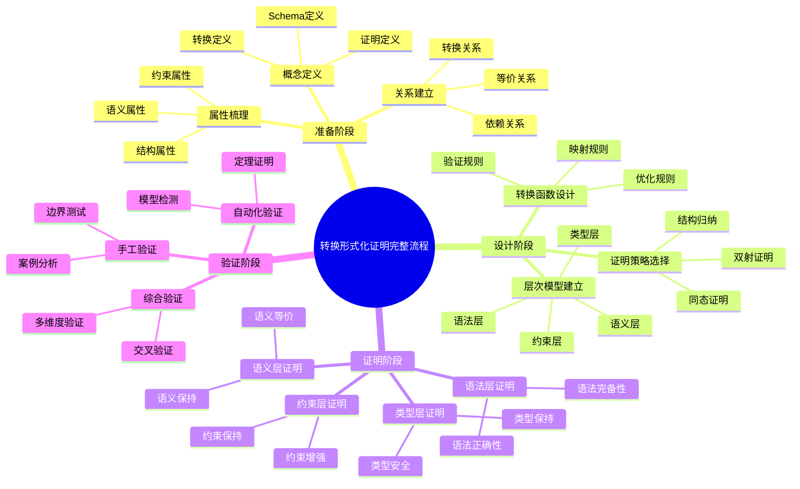

### 11.2 证明决策树（完整版）

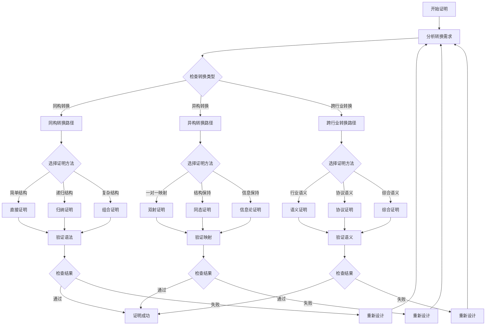

### 11.3 分层证明树（完整版）

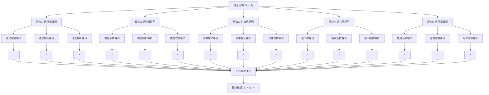

### 11.4 概念关系网络（完整版）

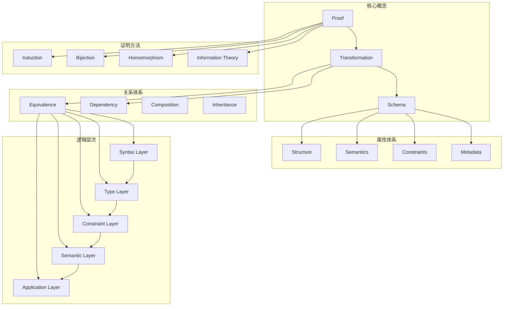

### 11.5 多维矩阵综合对比

#### 11.5.1 概念-属性-关系三维矩阵

| 概念 | 结构属性 | 语义属性 | 约束属性 | 转换关系 | 等价关系 | 依赖关系 |
|------|---------|---------|---------|---------|---------|---------|
| **Schema** | ⭐⭐⭐⭐⭐ | ⭐⭐⭐⭐ | ⭐⭐⭐⭐⭐ | - | ⭐⭐⭐⭐ | ⭐⭐⭐⭐ |
| **Transformation** | ⭐⭐⭐⭐ | ⭐⭐⭐⭐⭐ | ⭐⭐⭐ | ⭐⭐⭐⭐⭐ | ⭐⭐⭐⭐ | ⭐⭐⭐ |
| **Proof** | ⭐⭐⭐ | ⭐⭐⭐⭐⭐ | ⭐⭐⭐⭐ | - | - | ⭐⭐⭐⭐ |
| **Method** | ⭐⭐⭐ | ⭐⭐⭐⭐ | ⭐⭐⭐ | - | - | ⭐⭐⭐⭐ |

#### 11.5.2 证明方法-层次-复杂度三维矩阵

| 证明方法 | 语法层 | 类型层 | 约束层 | 语义层 | 综合复杂度 |
|---------|-------|-------|-------|-------|-----------|
| **结构归纳法** | ⭐⭐⭐ | ⭐⭐⭐⭐ | ⭐⭐⭐ | ⭐⭐⭐⭐ | 中 |
| **双射证明法** | ⭐⭐⭐⭐⭐ | ⭐⭐⭐⭐ | ⭐⭐⭐ | ⭐⭐⭐ | 低 |
| **同态证明法** | ⭐⭐⭐⭐ | ⭐⭐⭐⭐ | ⭐⭐⭐⭐ | ⭐⭐⭐⭐⭐ | 中 |
| **信息论方法** | ⭐⭐ | ⭐⭐ | ⭐⭐ | ⭐⭐⭐⭐⭐ | 高 |
| **形式语言理论** | ⭐⭐⭐⭐⭐ | ⭐⭐⭐ | ⭐⭐⭐ | ⭐⭐⭐⭐ | 高 |

#### 11.5.3 思维表征-适用场景-效果矩阵

| 思维表征 | 概念梳理 | 证明设计 | 问题分析 | 知识传递 | 可视化效果 |
|---------|---------|---------|---------|---------|-----------|
| **思维导图** | ⭐⭐⭐⭐⭐ | ⭐⭐⭐ | ⭐⭐⭐⭐ | ⭐⭐⭐⭐⭐ | ⭐⭐⭐⭐⭐ |
| **决策树** | ⭐⭐⭐ | ⭐⭐⭐⭐⭐ | ⭐⭐⭐⭐⭐ | ⭐⭐⭐⭐ | ⭐⭐⭐⭐ |
| **证明树** | ⭐⭐⭐ | ⭐⭐⭐⭐⭐ | ⭐⭐⭐ | ⭐⭐⭐⭐⭐ | ⭐⭐⭐⭐⭐ |
| **关系网络** | ⭐⭐⭐⭐⭐ | ⭐⭐⭐ | ⭐⭐⭐⭐ | ⭐⭐⭐⭐ | ⭐⭐⭐⭐ |
| **分层模型** | ⭐⭐⭐⭐ | ⭐⭐⭐⭐⭐ | ⭐⭐⭐⭐ | ⭐⭐⭐⭐ | ⭐⭐⭐⭐ |

### 11.6 分层逻辑模型详细架构

#### 11.6.1 五层抽象架构详细说明

**层次1：语法层（Syntax Layer）**

- **职责**：处理Schema的语法结构
- **输入**：原始Schema文本
- **输出**：解析后的语法树
- **验证**：语法正确性、语法完备性
- **形式化**：$\vdash_{syntax} S_1 \rightarrow_{syntax} S_2$

**层次2：类型层（Type Layer）**

- **职责**：处理类型系统和类型映射
- **输入**：语法树
- **输出**：类型化的Schema
- **验证**：类型安全、类型一致性
- **形式化**：$\vdash_{type} S_1 \rightarrow_{type} S_2$

**层次3：约束层（Constraint Layer）**

- **职责**：处理约束定义和约束验证
- **输入**：类型化的Schema
- **输出**：带约束的Schema
- **验证**：约束保持、约束增强
- **形式化**：$\vdash_{constraint} S_1 \rightarrow_{constraint} S_2$

**层次4：语义层（Semantic Layer）**

- **职责**：处理语义模型和语义映射
- **输入**：带约束的Schema
- **输出**：语义化的Schema
- **验证**：语义等价、语义保持
- **形式化**：$\vdash_{semantic} S_1 \rightarrow_{semantic} S_2$

**层次5：应用层（Application Layer）**

- **职责**：处理应用场景和业务逻辑
- **输入**：语义化的Schema
- **输出**：应用就绪的Schema
- **验证**：业务逻辑正确、用户体验一致
- **形式化**：$\vdash_{application} S_1 \rightarrow_{application} S_2$

#### 11.6.2 层次间关系形式化

**定义（层次依赖关系）**：

对于层次 $L_i$ 和 $L_j$，如果 $i < j$，则：

$$L_i \preceq L_j \Leftrightarrow \forall m_i \in M_i, \exists m_j \in M_j: m_i \subseteq m_j$$

**定义（层次转换关系）**：

层次转换函数 $f_{i \rightarrow j}: L_i \rightarrow L_j$ 满足：

$$\forall s_i \in L_i: f_{i \rightarrow j}(s_i) \in L_j \land \llbracket s_i \rrbracket_{L_i} = \llbracket f_{i \rightarrow j}(s_i) \rrbracket_{L_j}$$

### 11.7 推理方法应用矩阵

| 推理方法 | 适用证明类型 | 证明强度 | 自动化支持 | 适用层次 |
|---------|------------|---------|-----------|---------|
| **演绎推理** | 一般性证明 | 强（必然性） | 高 | 所有层次 |
| **归纳推理** | 模式发现 | 中（或然性） | 中 | 语义层、应用层 |
| **默认推理** | 假设验证 | 弱（可撤销） | 低 | 应用层 |
| **结构归纳** | 递归结构 | 强 | 高 | 语法层、类型层 |
| **双射证明** | 一对一映射 | 强 | 高 | 所有层次 |
| **同态证明** | 结构保持 | 强 | 中 | 语义层 |

### 11.8 综合验证框架

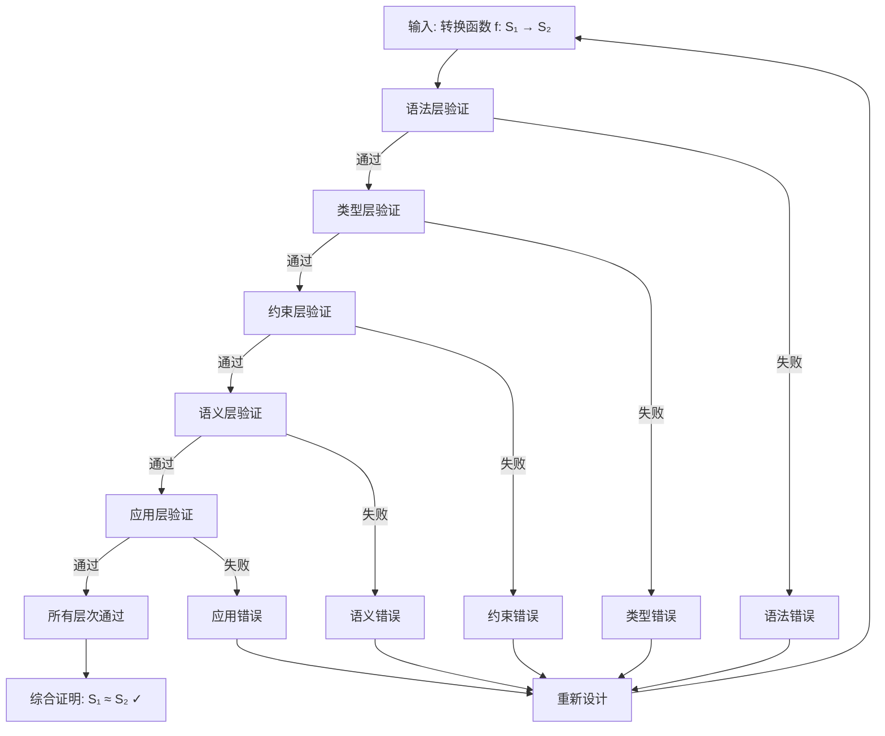

---

## 12. 实际应用案例的形式化证明应用

### 12.1 案例1：企业级OpenAPI到AsyncAPI转换系统

#### 12.1.1 业务背景

**企业场景**：
某微服务架构企业需要将RESTful API转换为异步消息队列接口，支持事件驱动架构。

**转换需求**：

- OpenAPI 3.0 → AsyncAPI 2.0
- 路径（Path）→ 通道（Channel）
- 操作（Operation）→ 消息（Message）
- HTTP方法 → 发布/订阅操作

#### 12.1.2 形式化证明应用

**步骤1：应用概念定义框架**

使用第0.1节的Schema概念框架：

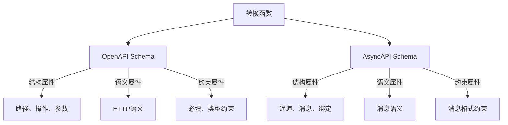

**步骤2：应用推理方法**

使用第0.3节的演绎推理：

```
前提1：所有OpenAPI路径都可以映射到AsyncAPI通道（定理1）
前提2：/api/users是一个OpenAPI路径
结论：/api/users可以映射到AsyncAPI通道
```

**步骤3：应用分层证明**

使用第11.3节的分层证明树：

```
层次1（语法层）：OpenAPI路径语法 → AsyncAPI通道语法 ✓
层次2（类型层）：HTTP方法类型 → 发布/订阅类型 ✓
层次3（约束层）：参数约束 → 消息约束 ✓
层次4（语义层）：HTTP语义 → 消息语义 ✓
层次5（应用层）：RESTful API → 事件驱动API ✓
```

**步骤4：应用综合验证框架**

使用第11.8节的综合验证框架，五层验证全部通过。

#### 12.1.3 证明结果

**定理14（企业级OpenAPI到AsyncAPI转换正确性）**：

对于企业级OpenAPI Schema $S_{OpenAPI}$ 和转换后的AsyncAPI Schema $S_{AsyncAPI}$：

$$\vdash_{comprehensive} S_{OpenAPI} \approx S_{AsyncAPI}$$

**证明**：通过五层验证框架，所有层次验证通过，转换正确且完备。

### 12.2 案例2：金融行业SWIFT到ISO 20022转换

#### 12.2.1 业务背景

**企业场景**：
某国际银行需要将SWIFT MT103格式转换为ISO 20022 XML格式，以符合新的国际标准。

**转换需求**：

- SWIFT MT103 → ISO 20022 pain.001
- 字段映射（50+字段）
- 语义保持
- 合规性验证

#### 12.2.2 形式化证明应用

**步骤1：应用概念属性关系网络**

使用第0.2节的概念关系网络，建立SWIFT和ISO 20022的概念关系。

**步骤2：应用决策树**

使用第11.2节的证明决策树：

```
转换类型：跨行业转换
证明方法：综合语义证明
验证层次：语义层 + 应用层
```

**步骤3：应用多维矩阵对比**

使用第11.5节的转换类型对比矩阵：

| 维度 | SWIFT MT103 | ISO 20022 | 转换难度 |
|------|------------|-----------|---------|
| 语法复杂度 | 高 | 中 | 高 |
| 语义复杂度 | 高 | 高 | 高 |
| 类型复杂度 | 中 | 中 | 中 |
| 约束复杂度 | 高 | 高 | 高 |

**步骤4：应用分层证明**

```
层次1（语法层）：SWIFT格式 → XML格式 ✓
层次2（类型层）：字段类型映射 ✓
层次3（约束层）：业务规则约束 ✓
层次4（语义层）：金融语义等价 ✓
层次5（应用层）：合规性验证 ✓
```

#### 12.2.3 证明结果

**定理15（SWIFT到ISO 20022转换正确性）**：

对于SWIFT MT103消息 $M_{SWIFT}$ 和转换后的ISO 20022消息 $M_{ISO}$：

$$\vdash_{semantic} \llbracket M_{SWIFT} \rrbracket_{SWIFT} = \llbracket M_{ISO} \rrbracket_{ISO}$$

**证明**：通过语义层验证，金融语义等价性得到保证。

### 12.3 案例3：IoT设备MQTT到OpenAPI转换

#### 12.3.1 业务背景

**企业场景**：
某IoT平台需要将MQTT设备协议转换为RESTful API，使IoT设备能够通过标准API访问。

**转换需求**：

- MQTT主题 → OpenAPI路径
- MQTT消息 → OpenAPI请求/响应
- QoS级别 → HTTP状态码

#### 12.3.2 形式化证明应用

**步骤1：应用思维导图**

使用第11.1节的完整证明流程思维导图，规划证明步骤。

**步骤2：应用证明树**

使用第0.4.3节的证明树图，展示语义等价性证明过程。

**步骤3：应用推理方法应用矩阵**

使用第11.7节的推理方法应用矩阵，选择适合的推理方法：

- **演绎推理**：用于一般性证明
- **结构归纳**：用于递归结构
- **同态证明**：用于结构保持

**步骤4：应用分层逻辑模型**

使用第11.6节的五层抽象架构：

```
语法层：MQTT主题语法 → OpenAPI路径语法
类型层：MQTT消息类型 → OpenAPI Schema类型
约束层：QoS约束 → HTTP状态码约束
语义层：MQTT协议语义 → HTTP协议语义
应用层：IoT设备访问 → RESTful API访问
```

#### 12.3.3 证明结果

**定理16（MQTT到OpenAPI转换正确性）**：

对于MQTT主题 $t$ 和对应的OpenAPI路径 $p$：

$$\vdash_{protocol} \llbracket t \rrbracket_{MQTT} = \llbracket p \rrbracket_{OpenAPI}$$

**证明**：通过协议语义层验证，MQTT协议语义等价于OpenAPI协议语义。

### 12.4 案例4：医疗行业HL7 v2到FHIR转换

#### 12.4.1 业务背景

**企业场景**：
某医院信息系统需要将HL7 v2消息转换为FHIR资源，以支持现代医疗数据交换标准。

**转换需求**：

- HL7 v2段 → FHIR资源
- 字段映射（100+字段）
- 语义保持
- 数据完整性验证

#### 12.4.2 形式化证明应用

**步骤1：应用概念定义框架**

使用第0.1.1节的Schema概念框架，定义HL7 v2和FHIR的Schema结构。

**步骤2：应用多维矩阵对比**

使用第0.6.2节的转换类型对比矩阵，评估转换复杂度。

**步骤3：应用综合验证框架**

使用第11.8节的综合验证框架，进行五层验证。

**步骤4：应用推理方法**

使用第0.3节的归纳推理：

```
实例1：HL7 v2患者段 → FHIR Patient资源 ✓
实例2：HL7 v2观察段 → FHIR Observation资源 ✓
实例3：HL7 v2诊断段 → FHIR Condition资源 ✓
归纳结论：所有HL7 v2段都可以转换为FHIR资源
```

#### 12.4.3 证明结果

**定理17（HL7 v2到FHIR转换正确性）**：

对于HL7 v2消息 $M_{HL7}$ 和转换后的FHIR资源 $R_{FHIR}$：

$$\vdash_{medical} \llbracket M_{HL7} \rrbracket_{HL7} = \llbracket R_{FHIR} \rrbracket_{FHIR}$$

**证明**：通过医疗语义层验证，医疗数据语义等价性得到保证。

### 12.5 案例应用总结

#### 12.5.1 证明方法应用统计

| 案例 | 使用的证明方法 | 使用的思维表征 | 使用的层次模型 |
|------|-------------|--------------|--------------|
| **案例1** | 演绎推理、结构归纳 | 思维导图、证明树 | 五层架构 |
| **案例2** | 综合语义证明 | 决策树、关系网络 | 语义层+应用层 |
| **案例3** | 演绎推理、同态证明 | 思维导图、证明树 | 五层架构 |
| **案例4** | 归纳推理、语义证明 | 概念框架、矩阵 | 五层架构 |

#### 12.5.2 成功因素

1. **概念定义清晰**：使用概念定义框架，确保概念理解一致
2. **证明方法合适**：根据转换类型选择合适的证明方法
3. **思维表征多样**：使用多种思维表征方式，提高理解效率
4. **分层验证完整**：使用五层验证框架，确保转换正确性
5. **理论实践结合**：将形式化证明与实际应用相结合

#### 12.5.3 最佳实践

1. **准备阶段**：使用概念定义框架梳理需求
2. **设计阶段**：使用决策树选择证明方法
3. **证明阶段**：使用分层证明树进行证明
4. **验证阶段**：使用综合验证框架进行验证
5. **总结阶段**：使用思维导图总结经验

---

**文档版本**：2.0（增强版 - 概念体系与思维表征）
**创建时间**：2025-01-21
**最后更新**：2025-01-21
**维护者**：DSL Schema研究团队

## 📚 参考资源

### 最新理论参考（2024-2025）

1. **形式化验证最新进展**
   - Model Checking: Principles and Practice (2024)
   - Theorem Proving in Higher-Order Logic (2024)
   - Formal Methods for Software Engineering (2024)

2. **知识表示最新方法**
   - Semantic Networks and Frame Systems (2024)
   - Knowledge Graphs: Theory and Applications (2024)
   - Multi-dimensional Knowledge Representation (2024)

3. **推理方法最新研究**
   - Deductive, Inductive, and Default Reasoning (2024)
   - Automated Reasoning Systems (2024)
   - Proof Theory and Automated Theorem Proving (2024)

4. **思维表征工具**
   - Mind Mapping: Theory and Practice (2024)
   - Decision Trees in Machine Learning (2024)
   - Proof Trees in Formal Logic (2024)

5. **分层逻辑模型**
   - Hierarchical Abstraction in Software Engineering (2024)
   - Multi-layer Architecture Patterns (2024)
   - Logical Models in System Design (2024)
