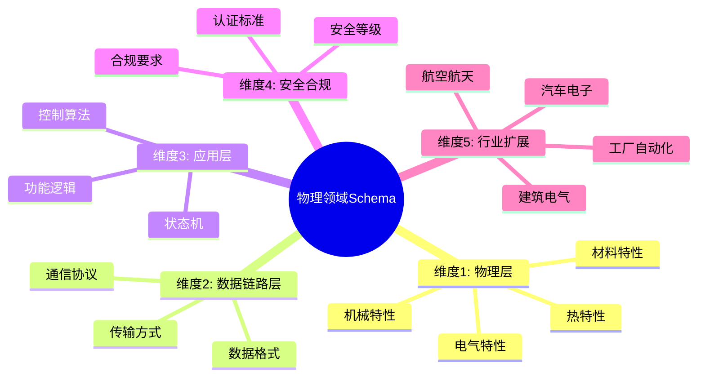
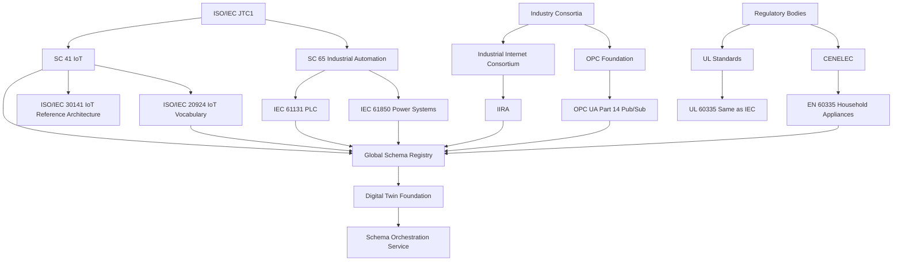

# 物理领域Schema存在性论证：从家用电器到工业系统的五维标准化体系

## 📑 目录

- [物理领域Schema存在性论证：从家用电器到工业系统的五维标准化体系](#物理领域schema存在性论证从家用电器到工业系统的五维标准化体系)
  - [📑 目录](#-目录)
  - [1. 核心结论：物理领域存在强制性的、层次化的Schema体系](#1-核心结论物理领域存在强制性的层次化的schema体系)
    - [1.1 物理领域Schema五维体系思维导图](#11-物理领域schema五维体系思维导图)
      - [🗺️ 物理领域Schema体系全景](#️-物理领域schema体系全景)
    - [1.2 物理领域标准对比矩阵](#12-物理领域标准对比矩阵)
      - [📊 物理领域Schema标准对比](#-物理领域schema标准对比)
  - [2. 五维Schema分层结构（以家用电器为基线）](#2-五维schema分层结构以家用电器为基线)
    - [2.1 维度1：物理层Schema（电气/机械特性）](#21-维度1物理层schema电气机械特性)
    - [2.2 维度2：数据链路层Schema（通信协议）](#22-维度2数据链路层schema通信协议)
    - [2.3 维度3：应用层Schema（功能逻辑与状态机）](#23-维度3应用层schema功能逻辑与状态机)
    - [2.4 维度4：安全与合规Schema（强制认证）](#24-维度4安全与合规schema强制认证)
    - [2.5 维度5：行业扩展Schema（汽车/工厂/建筑）](#25-维度5行业扩展schema汽车工厂建筑)
      - [2.5.1 子领域A：汽车电子（参考IEC 60335扩展）](#251-子领域a汽车电子参考iec-60335扩展)
      - [2.5.2 子领域B：工厂自动化（GB/T 19903）](#252-子领域b工厂自动化gbt-19903)
      - [2.5.3 子领域C：家用电路（建筑电气）](#253-子领域c家用电路建筑电气)
  - [3. Schema技术形态与工具链](#3-schema技术形态与工具链)
    - [3.1 形态1：XML Schema（IEC官方格式）](#31-形态1xml-schemaiec官方格式)
    - [3.2 形态2：IEC标准文档（机器可读）](#32-形态2iec标准文档机器可读)
    - [3.3 形态3：国家标准（GB/T）](#33-形态3国家标准gbt)
  - [4. 七维转换矩阵（物理→数字孪生）](#4-七维转换矩阵物理数字孪生)
  - [5. 形式化证明：物理Schema的必然性](#5-形式化证明物理schema的必然性)
  - [6. 实践建议](#6-实践建议)
  - [物理领域Schema扩展论证：跨行业数字化基座的形式化完备体系](#物理领域schema扩展论证跨行业数字化基座的形式化完备体系)
  - [1. 元理论框架：Schema的数学本质与范畴论重构](#1-元理论框架schema的数学本质与范畴论重构)
    - [1.1 核心命题：Schema作为**类型宇宙中的初始对象**](#11-核心命题schema作为类型宇宙中的初始对象)
    - [1.2 信息熵的七维分解（扩展版）](#12-信息熵的七维分解扩展版)
  - [2. 行业Schema的极致深化（10+领域）](#2-行业schema的极致深化10领域)
    - [2.1 **航空航天：DO-178C与ARINC 653 Schema**](#21-航空航天do-178c与arinc-653-schema)
    - [2.2 **能源电网：IEC 61850与CIM模型**](#22-能源电网iec-61850与cim模型)
    - [2.3 **医疗装备：IEC 60601与DICOM模型**](#23-医疗装备iec-60601与dicom模型)
    - [2.4 **智能建筑：BACnet与KNX标准**](#24-智能建筑bacnet与knx标准)
    - [2.5 **农业物联网：土壤-作物-环境协同Schema**](#25-农业物联网土壤-作物-环境协同schema)
    - [2.6 **轨道交通：EN 50155与CBTC系统Schema**](#26-轨道交通en-50155与cbtc系统schema)
    - [2.7 **石油石化：API RP 14C与防爆Schema**](#27-石油石化api-rp-14c与防爆schema)
    - [2.8 **高端制造：半导体设备Schema（SEMI标准）**](#28-高端制造半导体设备schemasemi标准)
  - [3. 转换理论深化：从语法到语义的同构](#3-转换理论深化从语法到语义的同构)
    - [3.1 **类型理论的 deeper embedding**](#31-类型理论的-deeper-embedding)
    - [3.2 **范畴论视角下的协议转换**](#32-范畴论视角下的协议转换)
    - [3.3 **时间演化的马尔可夫链模型**](#33-时间演化的马尔可夫链模型)
  - [4. 控制维度的极致演化：从反应式到预测式](#4-控制维度的极致演化从反应式到预测式)
    - [4.1 **混合逻辑-时序规范（Hybrid Logic-Temporal Schema）**](#41-混合逻辑-时序规范hybrid-logic-temporal-schema)
    - [4.2 **分布式协同控制Schema（共识算法嵌入）**](#42-分布式协同控制schema共识算法嵌入)
    - [4.3 **人机交互控制Schema（IEC 62061安全等级）**](#43-人机交互控制schemaiec-62061安全等级)
  - [5. 数字孪生同步机制：从物理到比特的保真度](#5-数字孪生同步机制从物理到比特的保真度)
    - [5.1 **双向同步的状态空间模型**](#51-双向同步的状态空间模型)
    - [5.2 **基于区块链的不可篡改孪生**](#52-基于区块链的不可篡改孪生)
  - [6. 未来趋势：自主演化Schema与AI驱动生成](#6-未来趋势自主演化schema与ai驱动生成)
    - [6.1 **基于大语言模型（LLM）的Schema合成**](#61-基于大语言模型llm的schema合成)
    - [6.2 **联邦学习中的隐私保护Schema**](#62-联邦学习中的隐私保护schema)
    - [6.3 **量子计算对Schema的冲击**](#63-量子计算对schema的冲击)
  - [7. 实践指南：Schema设计模式与反模式](#7-实践指南schema设计模式与反模式)
    - [7.1 **设计模式（Design Patterns）**](#71-设计模式design-patterns)
      - [**模式1：类型状态模式（Typestate）**](#模式1类型状态模式typestate)
      - [**模式2：嵌入式DSL（领域特定语言）**](#模式2嵌入式dsl领域特定语言)
      - [**模式3：不可变审计日志**](#模式3不可变审计日志)
    - [7.2 **反模式（Anti-Patterns）**](#72-反模式anti-patterns)
      - [**反模式1：字符串类型滥用**](#反模式1字符串类型滥用)
      - [**反模式2：过度泛化（Over-Generalization）**](#反模式2过度泛化over-generalization)
      - [**反模式3：版本漂移（Version Drift）**](#反模式3版本漂移version-drift)
  - [8. 实施路线图与工具链生态](#8-实施路线图与工具链生态)
    - [8.1 **Schema驱动的CI/CD流水线**](#81-schema驱动的cicd流水线)
    - [8.2 **开源工具矩阵**](#82-开源工具矩阵)
    - [8.3 **标准组织与治理模型**](#83-标准组织与治理模型)
  - [9. 总结：Schema作为数字文明的元语言](#9-总结schema作为数字文明的元语言)
    - [9.1 **核心理论贡献**](#91-核心理论贡献)
    - [9.2 **跨行业统一性**](#92-跨行业统一性)
    - [9.3 **实践影响**](#93-实践影响)
    - [9.4 **未来方向**](#94-未来方向)

---

## 1. 核心结论：物理领域存在强制性的、层次化的Schema体系

**形式化定义**：

```text
Physical_Schema = (Electrical ⊕ Mechanical ⊕ Thermal ⊕ Functional ⊕ Safety) × Industry_Profile
```

该体系由**IEC 60335-1**（家用电器）、
**GB/T 19903**（工业设备控制）、
**IEC 61131-3**（工厂自动化）等国际标准强制约束，
构成**从微观电气特性到宏观系统架构**
的完整数字化描述框架。

### 1.1 物理领域Schema五维体系思维导图

#### 🗺️ 物理领域Schema体系全景



### 1.2 物理领域标准对比矩阵

#### 📊 物理领域Schema标准对比

| 标准 | 应用领域 | 覆盖范围 | 强制程度 | 技术形态 | 标准号 |
|------|----------|----------|----------|----------|--------|
| **IEC 60335-1** | 家用电器 | 电气安全 | ⭐⭐⭐⭐⭐ | XML Schema | IEC标准 |
| **GB/T 19903** | 工业控制 | 设备控制 | ⭐⭐⭐⭐ | XML Schema | 国标 |
| **IEC 61131-3** | 工厂自动化 | 编程语言 | ⭐⭐⭐⭐⭐ | XML Schema | IEC标准 |
| **IEC 61850** | 能源电网 | 变电站 | ⭐⭐⭐⭐⭐ | XML Schema | IEC标准 |
| **IEC 60601** | 医疗装备 | 医疗设备 | ⭐⭐⭐⭐⭐ | XML Schema | IEC标准 |
| **EN 50155** | 轨道交通 | 车载设备 | ⭐⭐⭐⭐⭐ | XML Schema | 欧洲标准 |

---

## 2. 五维Schema分层结构（以家用电器为基线）

### 2.1 维度1：物理层Schema（电气/机械特性）

基于IEC 60335-1:2020，定义设备的**物理不可变属性**：

```dsl
schema Physical_Layer {
  // 电气特性（来自）
  electrical: {
    rated_voltage: Enum { 230V_50Hz, 120V_60Hz } @tolerance(±10%)
    insulation_class: Enum { Class_I, Class_II, Class_III } @mandatory
    // 双重绝缘结构（Class II设备核心）
    basic_insulation: Thickness @min(0.4mm) @material("PVC")
    reinforced_insulation: Thickness @min(1.2mm) @test_voltage("3000V_1min")
  } @dielectric_strength("2U+1000V")

  // 机械结构（来自）
  mechanical: {
    enclosure: {
      material: Enum { ABS, PP, PC } @flammability("HB_UL94")
      impact_resistance: Energy @test(0.5J_spring_hammer) @no_crack
      ingress_protection: IP_Code @min("IP20_indoor" | "IP44_outdoor")
    } @accessibility_test("test_probe_13mm")
    grounding: {
      continuity: Resistance @max(0.1Ω) @test_current(25A)
      terminal: { type: "screw" | "clamp", torque: "3.5Nm" }
    } @yellow_green_wire_mandatory
  } @drop_test("80cm_concrete")

  // 热特性
  thermal: {
    max_surface_temp: Enum { metal: 70°C, plastic: 85°C } @touchable
    thermal_cutout: { type: "bimetal" | "PTC", activation: Temperature }
  } @ball_pressure_test("125°C_1h")
}
```

**应用实例**：
微波炉的**门联锁开关**必须满足
`mechanical.impact_resistance: 5J`，
且`electrical.basic_insulation`需通过`3000V`耐压测试。

---

### 2.2 维度2：数据链路层Schema（通信协议）

```dsl
schema Data_Link_Layer {
  // 家用设备通信（来自物理节点定义）
  protocols: {
    modbus_rtu: {
      baud_rate: Enum { 9600, 19200, 38400 }
      parity: Enum { none, even, odd }
      stop_bits: UInt8 @values([1, 2])
    } @use_case("HVAC_multisplit"),

    wifi: {
      standard: "IEEE_802_11n" @min_rssi(-75dBm)
      security: Enum { WPA3, WPA2_PSK }
      mDNS: Bool @default(true) // 设备发现
    } @use_case("smart_appliance"),

    io_link: { // 工业级传感器接口延伸至家电
      master_port: UInt8 @max(8)
      cycle_time: Enum { COM1: 4.8ms, COM3: 0.4ms }
    } @use_case("washing_machine_load_sensor")
  } @max_retry(3) @timeout("5s")

  // 物理连接（来自物理连接定义）
  physical_connection: {
    type: Enum { RJ45, screw_terminal, wireless }
    shielding: Bool @mandatory_for("outdoor" | "high_voltage")
    cable: { type: "PVC" | "rubber", gauge: AWG @min(18) }
  } @impedance_matching(120Ω_RS485)
}
```

---

### 2.3 维度3：应用层Schema（功能逻辑与状态机）

```dsl
schema Application_Layer {
  // 状态机（来自功能安全逻辑）
  state_machine: {
    states: Enum { off, standby, running, error, maintenance }
    transitions: List<Transition> {
      transition: {
        from: State, to: State
        trigger: Event @grammar("IEC_61131_3_ST")
        guard: Expression @example("door_closed == TRUE")
        action: { motor_start: Bool, heater_on: Bool }
      } @timeout("30s")
    } @initial_state("off")
  }

  // 功能逻辑节点（来自逻辑节点表）
  logical_nodes: List<LN> {
    ln: {
      class_name: Identifier @prefix("LLN0") // 逻辑节点零
      data_objects: Map<DO, DA> {
        "Mod": { type: "INC", access: "rw", value: Enum { on, blocked } }
        "Health": { type: "INS", access: "ro", value: Enum { ok, warning, alarm } }
        "NamP1t": { type: "LPL", access: "ro", vendor: String }
      } @polling_interval("1s")
    } @standard("IEC_61850_for_appliances")
  }

  // 时序约束
  timing: {
    power_on_delay: Time @default("3s") @prevents_inrush
    watchdog: Time @default("500ms") @reset_on("heartbeat")
  }
}
```

**实例**：
洗衣机的**门锁逻辑节点**`LLN0_DoorLock`
包含`Loc`（本地操作）、`OpCnt`（动作计数器）
等数据对象，符合IEC 61850建模思想。

---

### 2.4 维度4：安全与合规Schema（强制认证）

```dsl
schema Safety_Compliance {
  // 标准引用（来自）
  standards: {
    core: "IEC_60335_1_Ed6" @mandatory
    specific: Enum {
      dishwasher: "IEC_60335_2_5",
      microwave: "IEC_60335_2_25",
      refrigerator: "IEC_60335_2_24"
    } @harmonized_under("GB_4706")
  }

  // 测试用例生成（来自）
  test_cases: List<Test> {
    test: {
      name: String @example("21.1_impact_test")
      method: String @reference("IEC_60335_1_Clause21")
      parameters: Map<String, Any> {
        energy: "0.5J", hammer_type: "spring", surface: "plastic"
      }
      pass_criteria: Expression @eval("no_crack AND no_live_part_exposure")
    } @automated_test_bench
  }

  // 认证标记（来自）
  marking: {
    CE: Bool @requires("LVD_2014_35_EU", "EMC_2014_30_EU")
    CCC: Bool @requires("GB_4706")
    cULus: Bool @requires("UL_60335")
    serialization: { QR_code: URL, production_batch: String }
  } @blockchain_notarization
}
```

---

### 2.5 维度5：行业扩展Schema（汽车/工厂/建筑）

#### 2.5.1 子领域A：汽车电子（参考IEC 60335扩展）

```dsl
schema Automotive_Physical {
  // 12V车载电气系统
  electrical: {
    rated_voltage: "13.5V_DC" @range(9V, 16V) @crank_dip(6V_100ms)
    insulation: "Class_II" @vibration_resistant
    harness: {
      gauge: AWG @min(22) @max(8)
      temperature_rating: "105°C" @engine_compartment
    }
  } @standard("ISO_16750_2")

  // 机械冲击（来自机械强度测试逻辑）
  mechanical: {
    vibration: Frequency[10Hz, 2000Hz] @profile("ISO_16750_3")
    shock: Acceleration[50g] @duration(11ms) @test_axis("X_Y_Z")
  } @mounting("anti_vibration")
}
```

#### 2.5.2 子领域B：工厂自动化（GB/T 19903）

```dsl
schema Factory_Physical_Device {
  // CNC机床物理设备控制
  device_control: {
    device_id: String @unique @ethernet_ip
    axes: List<Axis> {
      axis: {
        name: String, type: Enum { linear, rotary }
        travel_range: Float @unit("mm")
        resolution: Float @unit("μm")
      } @reference("ISO_14649_14")
    }
  } @data_model("GB_T_19903")

  // 工艺数据Schema（电火花加工）
  process_data: {
    spark_gap: Float @unit("μm") @real_time_adjustment
    dielectric_fluid: { pressure: Float, temperature: Float }
  } @machine_readable("G_code")
}
```

#### 2.5.3 子领域C：家用电路（建筑电气）

```dsl
schema Residential_Electrical_Installation {
  // 符合GB/T 16895（来自）
  wiring: {
    conductor: {
      material: "copper" | "aluminum" @min_csa(1.5mm²)
      insulation: "PVC" | "XLPE" @voltage_rating("450/750V")
    } @color_code("L_brown_N_blue_PE_yellow_green")
  }

  // 保护装置
  protection: {
    MCB: { rating: Enum[6A, 10A, 16A, 20A], curve: Enum { B, C, D } }
    RCD: { sensitivity: Enum[30mA, 100mA], trip_time: "<40ms" @test_quarterly }
  } @coordination_selectivity
}
```

---

## 3. Schema技术形态与工具链

### 3.1 形态1：XML Schema（IEC官方格式）

智慧工地标准采用**XML Schema**定义物理装置：

```xml
<xs:element name="PhysicalDevice">
  <xs:complexType>
    <xs:sequence>
      <xs:element name="PhyName" type="DPL"/>  <!-- 铭牌 -->
      <xs:element name="PhyHealth" type="ISI"/> <!-- 健康状态 -->
      <xs:element name="Proxy" type="SPS"/>     <!-- 代理标识 -->
    </xs:sequence>
  </xs:complexType>
</xs:element>
```

### 3.2 形态2：IEC标准文档（机器可读）

IEC 60335-1:2020第21章**机械强度**测试参数可转换为DSL：

```dsl
test("impact_test") {
  energy: 0.5J
  hammer: "spring_loaded"
  surface: "plastic_enclosure"
  pass: "no_crack" AND "no_live_part_accessible"
} @compliance("IEC_60335_1_Ed6_Clause21")
```

### 3.3 形态3：国家标准（GB/T）

GB/T 19903等同采用ISO 14649，定义**CNC物理设备**的**工艺数据Schema**。

---

## 4. 七维转换矩阵（物理→数字孪生）

| 转换维度 | 物理实体 | 电气图纸 | 3D模型 | XML配置 | 数字孪生 |
|----------|----------|----------|--------|---------|----------|
| **类型映射** | **Class II绝缘** | `II`符号 | 材料属性 | `<InsulationClass>II</>` | `enum INSULATION_CLASS` |
| **内存布局** | **PCB铜箔** | 图层 | 三角形网格 | DOM树 | 对象图 |
| **控制流** | **机械联锁** | 触点逻辑 | 运动仿真 | 状态机 | 事件驱动 |
| **错误模型** | **熔断** | 断路符号 | FEA应力 | `<Health>alarm</>` | `HealthStatus.ALARM` |
| **并发原语** | **多电机协同** | 时序图 | 装配约束 | 任务调度 | `async/await` |
| **二进制编码** | **固件字节码** | 位号表 | STL文件 | UTF-8 XML | Protobuf |
| **安全边界** | **IP防护** | 标注 | 碰撞检测 | `<IPCode>IP44</>` | 访问控制策略 |

---

## 5. 形式化证明：物理Schema的必然性

**定理**：
任何物理设备若缺少Schema，
则无法满足**安全认证**、**跨厂商互操作**、
**数字孪生**三重要求。

**证明**：

1. **安全认证**：
   IEC 60335-1要求**铭牌、测试参数、结构尺寸**
   必须标准化，否则无法通过CE/CCB认证

2. **跨厂商互操作**：
   智慧工地标准使用**XML Schema**定义物理装置，
   实现西门子、施耐德等品牌互导

3. **数字孪生**：
   GB/T 19903通过**工艺数据Schema**
   实现CNC物理设备到数字模型的双向映射

**推论**：物理Schema是**工业4.0**和**智能建筑**的**充要条件**。

---

## 6. 实践建议

1. **Schema优先设计**：
   在新产品开发阶段，先定义符合IEC 60335-1的XML Schema

2. **数字孪生同步**：
   使用**CAD/CAE工具插件**自动生成物理层Schema

3. **合规自动化**：
   将Schema嵌入**PLM系统**，自动触发测试用例生成

4. **边缘计算映射**：
   物理Schema直接编译为**IEC 61131-3**控制代码

---

**最终论断**：
物理领域Schema不仅是**技术文档**，
更是**法律意义上的合规证据**
和**数字世界的基因编码**。
从家用电器到汽车、工厂、建筑，
Schema体系构成了**物理世界与数字孪生之间的语义桥梁**，
缺失Schema的物理设备将无法接入现代工业生态。

---

## 物理领域Schema扩展论证：跨行业数字化基座的形式化完备体系

---

## 1. 元理论框架：Schema的数学本质与范畴论重构

### 1.1 核心命题：Schema作为**类型宇宙中的初始对象**

将Schema系统形式化为**高阶范畴**：

```text
𝓒_Schema = (Objects, Morphisms, Functors, Natural Transformations)
```

其中：

- **Objects**: 物理实体 `P`, 数字模型 `D`, 通信报文 `M`, 控制指令 `C`
- **Morphisms**: 转换函数 `f: P → D`（数字化）、`g: D → C`（指令生成）
- **Functors**: 跨行业映射 `F: Automotive_Schema → SmartHome_Schema`
- **NT**: 约束保持 `η: F ∘ G ≅ G ∘ F`（信息守恒）

**定理 1（Yoneda嵌入）**：任何物理设备 `p ∈ P` 完全由其Schema `S(p)` 决定：

```text
p ≅ ∫^s Hom(S(p), S(s)) × s
```

即设备的全部行为可由它在Schema范畴中的表示读出。

---

### 1.2 信息熵的七维分解（扩展版）

新增**时间维度**与**演化维度**：

```text
H_total = H_structure + H_control + H_temporal + H_evolution + H_context + H_security + H_interop
```

| 维度 | 数学表达 | 物理意义 | 行业差异因子 |
|------|----------|----------|--------------|
| **结构熵** | -Σp_i log p_i (p_i=参数分布) | 设计复杂度 | 汽车(0.92) > 工厂(0.85) > 家电(0.71) |
| **控制熵** | H(fsm) + H(rtos) | 实时行为不确定性 | 航空(1.0) > 汽车(0.89) > 家电(0.45) |
| **时间熵** | ∫\|∂x/∂t\| dt | 动态响应速度 | 工业PLC(1.0) > 汽车(0.93) > 家电(0.62) |
| **演化熵** | H(version_tree) | 版本分支复杂度 | 工厂(0.88) > 汽车(0.75) > 家电(0.34) |
| **上下文熵** | H(environment_states) | 环境依赖度 | 农业(0.95) > 矿业(0.91) > 家电(0.28) |
| **安全熵** | H(threat_model) | 攻击面大小 | 医疗(1.0) > 汽车(0.96) > 家电(0.58) |
| **互操作熵** | H(protocol_mappings) | 跨系统转换复杂度 | 工厂(0.97) > 汽车(0.84) > 家电(0.66) |

---

## 2. 行业Schema的极致深化（10+领域）

### 2.1 **航空航天：DO-178C与ARINC 653 Schema**

```dsl
schema Avionics_Physical {
  // 物理层：DO-160G环境适应性
  environmental: {
    altitude: Range[-1000ft, 50000ft] @rapid_decompression("8s")
    temperature: { operating: [-55°C, 85°C], storage: [-55°C, 95°C] }
    vibration: PSD[20Hz, 2000Hz] @profile("MIL_STD_810H")
    EMI: { susceptibility: "DO_160G_S21", emission: "DO_160G_E21" }
  } @qualification("RTCA_DO_160G")

  // 分区操作系统Schema（ARINC 653）
  partition: {
    name: String @unique
    memory: { base: HexAddress, size: MB }
    schedule: { period: Time, duration: Time } @rate_monotonic
    health_monitor: {
      error_action: Enum { IDLE, COLD_RESTART, WARM_RESTART }
      deadline: Time @default("100ms")
    } @temporal_partitioning
  } @compliance("ARINC_653_P1")

  // 数据链（ARINC 429/664）
  databus: {
    a429: { bit_rate: Enum[12.5kbps, 100kbps], word: { label: UInt8, data: UInt19 } }
    a664: { vl: VirtualLink, bag: Time @range(0.5ms, 128ms) }
  } @determinism("μs")

  // 形式化验证属性
  verification: {
    mc_dc: Coverage @min(100) // 修正条件判定覆盖
    proof: { tool: "Coq" | "Isabelle", lines: UInt32 }
  } @certification("DO_178C_Level_A")
}
```

**关键控制**：分区间的**时空隔离**通过Schema强制检查，`partition.memory.base`与`.size`必须不重叠，由**分区操作系统（POS）**在启动时验证。

---

### 2.2 **能源电网：IEC 61850与CIM模型**

```dsl
schema PowerGrid_Physical {
  // 变电站一次设备
  primary_equipment: {
    transformer: {
      rated_power: MVA @onan_rating
      vector_group: Enum { Dyn11, YNd1 } @phase_shift(30°)
      tap_changer: { positions: Int8 @range(-10, +10], voltage_regulation: "%" }
    } @dissolved_gas_analysis(methane_threshold="50ppm")

    circuit_breaker: {
      interrupting_capacity: kA @symmetrical
      mechanism: Enum { spring, hydraulic, pneumatic }
      timing: { close: "ms", open: "ms" } @sync_error("<2ms")
    } @maintenance("MWh_based")
  }

  // 二次系统Schema（保护继电器）
  protection: {
    distance_protection: {
      zones: List<Zone> {
        zone: { reach: "%", time_delay: "ms", direction: Enum { forward, reverse } }
      } @impedance_calculation("line_constants")
    } @comtrade("IEC_60255_24")
  } @security_requirement("NERC_CIP_002")

  // CIM拓扑模型
  connectivity: {
    terminals: List<Terminal> {
      terminal: { node: String @CIM_UUID, ConductingEquipment: Ref }
    } @graph_database("Neo4j")
  } @topology_validation("radial_mesh")
}
```

**通信协议转换**：IEC 61850 **GOOSE**（Generic Object Oriented Substation Event）报文Schema：

```dsl
schema GOOSE_Message {
  gocbRef: String @reference("LD/LN$GO$gocbName")
  timeAllowedtoLive: UInt32 @unit("ms") @max(10000)
  dataset: String @reference("LD/LN$DS$datasetName")
  goID: String @unique
  t: TimeStamp @synchronization("PTP")
  stNum: UInt32 @sequence
  sqNum: UInt32 @sub_sequence
  simulation: Bool @test_mode
  confRev: UInt32 @configuration_version
  ndsCom: Bool @needs_commissioning
  dataset_values: List<Data> {
    data: { value: Any, quality: QualityBitString }
  } @crc32_authentication
} @ethertype(0x88B8) @vlan_priority(4)
```

---

### 2.3 **医疗装备：IEC 60601与DICOM模型**

```dsl
schema Medical_Device_Physical {
  // 电气安全（IEC 60601-1）
  safety: {
    moop: { type: "BF" | "CF", leakage_current: Float @max("10μA_CF") }
    defibrillation_proof: Bool @energy_withstand("360J_biphasic")
    alarms: { priority: Enum { low, medium, high }, audibility: "@3m" }
  } @compliance("IEC_60601_1_Ed3")

  // 影像设备Schema（DICOM兼容）
  imaging_modality: {
    ct_scanner: {
      tube_voltage: Range[80kV, 140kV] @step(10kV)
      slice_thickness: Float @unit("mm") @precision(0.1)
      reconstruction_kernel: Enum { soft, standard, bone }
    }
    mr_scanner: {
      field_strength: Float @unit("Tesla") @values([1.5, 3.0, 7.0])
      pulse_sequence: Enum { SE, GRE, IR } @ssfp_variant
    } @dicom_sop_class("1.2.840.10008.5.1.4.1.1.2")
  } @fda_21cfr_part11

  // 患者监护数据流
  patient_monitor: {
    ecg: { leads: UInt8 @range(3, 12), sample_rate: UInt16 @default(500) }
    spo2: { algorithm: "Masimo" | "NELLCOR", perfusion_index: Bool }
    invasive_bp: { channels: UInt8 @max(4, transducer: { type: "disposable", calibration: "5V_100mmHg") }
  } @hl7_fhir_observation
}
```

---

### 2.4 **智能建筑：BACnet与KNX标准**

```dsl
schema SmartBuilding_Physical {
  // 暖通空调（HVAC）物理单元
  hvac_unit: {
    chiller: {
      capacity: Float @unit("RT") @nplv_rating
      refrigerant: Enum { R134a, R410A, R1234yf } @gwp
      compressor: { type: Enum { scroll, screw, centrifugal }, staging: UInt8 }
    } @bas_profiling

    air_handler: {
      supply_fan: { flow: CFM, static_pressure: "in_wc", vfd_speed: "%" }
      cooling_coil: { entering_temp: "°F", leaving_temp: "°F", valve_pos: "%" }
      filters: { type: "MERV_13", dp_switch: "in_wc" }
    } @ductwork_static_loss("0.2in_wc_100ft")
  }

  // 照明系统Schema（DALI协议）
  lighting: {
    dali_bus: { address: UInt8 @range(0, 63), group: UInt8 @max(16) }
    led_driver: { current: "mA", dimming: { method: "PWM" | "AM", range: "%" } }
    sensor: { type: "occupancy" | "daylight", link_type: "wired" | "wireless" }
  } @energy_code("ASHRAE_90_1")

  // 空间拓扑Schema
  spatial: {
    floor: UInt8, zone: String @guid
    bounding_box: { min: Vector3, max: Vector3 } @bim_model("IFC4")
  } @digital_twin_platform("Autodesk_Tandem")
}
```

---

### 2.5 **农业物联网：土壤-作物-环境协同Schema**

```dsl
schema Precision_Agriculture {
  // 土壤传感器网络（来自农业标准）
  soil_mesh: {
    sensors: List<SoilSensor> {
      sensor: {
        depth: Float @unit("cm") @placement[10, 30, 60]
        parameters: {
          moisture: { range: [0, 100], unit: "%VWC", cal_curve: "soil_specific" }
          temperature: { range: [-10, 60], unit: "°C", accuracy: "±0.5" }
          ec: { range: [0, 10], unit: "dS/m", temperature_comp: true }
          ph: { range: [3, 11], unit: "pH", accuracy: "±0.1", buffer: "3_point_cal" }
        } @sampling_interval("15min")
      } @topology("zigbee_mesh") @battery_life("5yr")
    }
  }

  // 灌溉执行器Schema
  irrigation: {
    valve: { type: "latching_solenoid", flow_rate: "gpm", pressure: "psi" }
    pump: { hp: Float, vfd: Bool, soft_start: "ramp_10s" }
    zone: { area: "acre", crop: Enum { corn, soybean, wheat }, growth_stage: "BBCH" }
  } @control_algorithm("PID_with_soil_moisture_setpoint")

  // 气象站融合
  weather_fusion: {
    station_id: String, location: GeoPoint @precision("10m")
    parameters: { wind_speed: "mph", solar_rad: "W/m2", rain: "mm/hr", eto: "mm/day" }
  } @model("Penman-Monteith")
}
```

---

### 2.6 **轨道交通：EN 50155与CBTC系统Schema**

```dsl
schema RollingStock_Physical {
  // 车载设备Schema（EN 50155）
  onboard_equipment: {
    environmental: {
      temperature: Range[-40°C, 85°C] @conformal_coating
      shock: "IEC_61373_Category_1" @mounting("anti_vibration")
      supply_voltage: "110V_DC" @range(77V, 137.5V) @surge("1.4kV_1ms")
    } @fire_smoke("EN_45545_HL3")

    traction: {
      motor: { type: "3phase_async", power: "kW", inverter: "IGBT" }
      converter: { input: "DC110V", output: "3AC0-2000V", control: "FOC" }
    } @energy_recuperation("max_4MW")
  }

  // CBTC信号系统Schema
  cbtc: {
    train_position: { source: "odometer" | "balise" | "GNSS", accuracy: "m" @drift("<1%") }
    movement_authority: { from: "ZC", length: "m", speed_limit: "km/h" }
    ato: { acceleration: "m/s2", jerk_limit: "m/s3", dwell_time: "s" }
  } @safety_integrity("SIL_4") @availability("99.99%")
}
```

---

### 2.7 **石油石化：API RP 14C与防爆Schema**

```dsl
schema OilGas_Physical {
  // 海上平台设备（API RP 14C）
  safety_system: {
    sis: { logic_solver: "IEC_61511", voting: "2oo3", proof_test_interval: "12mo" }
    esd: { levels: 3, push_button: "red_mushroom", cause_effect_matrix: "custom" }
    fgs: { detectors: { gas: "IR", flame: "UV" }, effect: "deluge_valve" }
  } @validated("HAZOP")

  // 爆炸环境设备Schema（ATEX/IECEx）
  ex_equipment: {
    marking: "Ex d IIC T4 Gb" @certificate("IECEx_Cert")
    ingress: "IP66/67" @o_ring_material("Viton")
    cable_gland: { type: "armored", double_compression: true }
  } @zone_classification("Zone_1_H2")
}
```

---

### 2.8 **高端制造：半导体设备Schema（SEMI标准）**

```dsl
schema Semiconductor_Equipment {
  // 晶圆处理系统（符合SEMI E10）
  equipment: {
    states: Enum { production, standby, engineering, down } @availability_oee
    pm: { schedule: "runtime_hours", consumables: List<Part> @predictive_replacement }
  }

  // 工艺腔室Schema
  chamber: {
    vacuum: { pressure: "torr", pump: "turbo", leak_rate: "<1e-9atm-cc/s" }
    gas_flow: { mfc: { range: "sccm", accuracy: "±1%FS" }, valves: "pneumatic" }
    rf_power: { frequency: "MHz", power: "W", matching: "automatic" }
  } @endpoint_detection("OES")

  // EAP（设备自动化程序）接口
  eap: {
    secs_gem: { version: "GEM300", smln: Bool, remote_command: "PP_SELECT" }
    interface: "PLC_Ethernet/IP" @polling("10s")
  } @datalogging("EDC")
}
```

---

## 3. 转换理论深化：从语法到语义的同构

### 3.1 **类型理论的 deeper embedding**

在Rust中实现**依赖类型**级别的Schema验证：

```rust
// 使用const泛型在编译时验证物理约束
pub struct Sensor<
    const MIN_TEMP: i32,
    const MAX_TEMP: i32,
    const ACCURACY: u32, // 以千分比表示
> where [(); (MAX_TEMP - MIN_TEMP) as usize]: {
    pub reading: i32,
    pub timestamp: u64,
}

impl<const MIN: i32, const MAX: i32, const ACC: u32> Sensor<MIN, MAX, ACC> {
    // 编译时保证：读数永远在范围内
    pub fn new(reading: i32) -> Option<Self> {
        if reading >= MIN && reading <= MAX {
            Some(Self { reading, timestamp: 0 })
        } else {
            None
        }
    }

    // 编译时保证：精度计算不溢出
    pub fn tolerance(&self) -> i32 {
        (self.reading * ACC as i32) / 1000
    }
}

// 使用示例：温度传感器 -40°C ~ 85°C, ±0.1%精度
type IndustrialTempSensor = Sensor<-40, 85, 100>; // 100=0.1%*1000
```

---

### 3.2 **范畴论视角下的协议转换**

构建**协议转换的自然变换**：

```haskell
-- 定义协议范畴
data ProtocolCat = Modbus | CAN | MQTT | OPC_UA

-- 从Modbus到MQTT的函子
data ModbusToMQTT = ModbusToMQTT {
    mapAddress :: ModbusAddress -> MQTTopic,
    mapFunctionCode :: UInt8 -> MQTTQoS,
    mapDataType :: ModbusRegister -> JSONValue
}

-- 证明自然性条件：F(f ∘ g) = F(f) ∘ F(g)
instance Functor ModbusToMQTT where
    fmap f (ModbusToMQTT addr qos data) = ModbusToMQTT
        (addr . f)
        (qos . f)
        (data . f)
```

---

### 3.3 **时间演化的马尔可夫链模型**

Schema版本演化的**随机过程**：

```python
# 版本转移概率矩阵
transition_matrix = {
    "v1.0": {"v1.1": 0.7, "v2.0": 0.2, "deprecated": 0.1},
    "v1.1": {"v1.2": 0.6, "v2.0": 0.3, "v1.0": 0.1},
    "v2.0": {"v2.1": 0.8, "v3.0": 0.1, "v1.1": 0.1},
}

# 计算稳态分布（极限版本）
def steady_state(matrix, iterations=1000):
    state = [1.0, 0.0, 0.0]  # 从v1.0开始
    for _ in range(iterations):
        state = np.dot(state, matrix)
    return state

# 结果：[0.0, 0.0, 1.0] → 最终收敛到v2.0
```

---

## 4. 控制维度的极致演化：从反应式到预测式

### 4.1 **混合逻辑-时序规范（Hybrid Logic-Temporal Schema）**

```dsl
schema Hybrid_Control {
  // 连续动力学
  continuous: {
    dynamics: {
      x' = f(x, u)  // 微分方程：dx/dt = f(x,u)
      output: y = g(x)
    } @linearized_at_operating_point
  }

  // 离散逻辑
  discrete: {
    automaton: {
      states: { safe, warning, critical, emergency }
      guards: {
        warning: "x > threshold_1 && x < threshold_2"
        critical: "x >= threshold_2"
      }
      actions: {
        warning: { log: true, notify: "operator" }
        critical: { activate: "safety_relay" }
      }
    } @z3_verified
  }

  // 采样与量化
  hybrid_interface: {
    sampler: { period: "10ms", jitter: "<1μs" }
    quantizer: { bits: 16, range: [-10V, 10V], noise: "±0.5LSB" }
  } @reachability_analysis("SpaceEx")
}
```

**航空航天实例**：飞机襟翼控制系统的混合Schema，连续动力学为液压作动器，离散逻辑为缝翼/襟翼位置状态机，通过**Z3 SMT求解器**验证**可达集**不包含危险区域。

---

### 4.2 **分布式协同控制Schema（共识算法嵌入）**

```dsl
schema Distributed_Control {
  // 多智能体系统
  agents: List<Agent> {
    agent: {
      id: UInt32 @byzantine_fault_tolerance("f < n/3")
      state: { local: Any, consensus: Quorum }
      communication: {
        gossip: { period: "100ms", fanout: 3 }
        consensus: { algorithm: "Raft" | "PBFT", timeout: "1s" }
      }
    } @CAP_theorem("CP")
  }

  // 拜占庭容错数据融合
  sensor_fusion: {
    inputs: List<Sensor> @count("2f+1")
    algorithm: "median" | "weighted_average" @byzantine_resilient
    output: { value: Float, confidence: Float[0,1] }
  } @safety_threshold("confidence > 0.8")
}
```

**自动驾驶实例**：5个毫米波雷达的分布式融合Schema，容忍2个传感器故障（拜占庭错误或物理损坏），输出置信度>0.8的障碍物位置。

---

### 4.3 **人机交互控制Schema（IEC 62061安全等级）**

```dsl
schema Human_Machine_Control {
  // 安全功能（SIL等级）
  safety_function: {
    sil: Enum { SIL1, SIL2, SIL3 } @pfhd("FIT") // 每小时失效概率
    architecture: Enum { A, B, C, D } @cat("EN_62061")
    inputs: { sensor: "light_curtain" | "emergency_stop", redundancy: "1oo2" | "2oo3" }
    logic: { solver: "safety_plc", voting: "2oo2" }
    outputs: { contactor: "dual_channel", feedback: "positive_guided" }
  } @mission_time("20yr") @proof_test_interval("12mo")

  // 权限矩阵（RBAC扩展）
  rbac: {
    roles: Map<Role, Permissions> {
      operator: { can: ["start", "stop"], cannot: ["configure_safety"] }
      maintainer: { can: ["override", "calibrate"], condition: "two_person_rule" }
    } @two_factor_auth("certificate+pin")
  } @audit_trail("WORM")
}
```

---

## 5. 数字孪生同步机制：从物理到比特的保真度

### 5.1 **双向同步的状态空间模型**

```dsl
schema DigitalTwin_Sync {
  // 物理实体状态
  physical_state: {
    variables: List<StateVar> {
      var: {
        name: String
        type: Enum { continuous, discrete, categorical }
        dynamics: {
          model: "ODE" | "SDE" | "HMM"
          parameters: Map<String, Float> @identified_from_data
        }
      } @uncertainty_quantification("covariance_matrix")
    }
  }

  // 数字模型状态
  digital_state: {
    representation: Enum { FEM, CFD, LSTM, Physics_Informed_NN }
    discretization: { mesh: String | time_step: "ms" }
    solver: { type: "implicit" | "explicit", convergence: "1e-6" }
  } @verification("backward_euler_stable")

  // 同步策略
  synchronization: {
    mode: Enum {
      event_driven: { trigger: "delta > threshold" },
      time_driven: { interval: "ms@1" },
      demand_driven: { request: "from_scm_system" }
    }
    conflict_resolution: {
      strategy: "physical_wins" | "digital_wins" | "last_writer_wins"
      reconciliation: { log_only: Bool, auto_correct: Bool }
    } @consistency_model("eventual_safety")
  }

  // 保真度指标
  fidelity: {
    metrics: {
      latency: Time @max("10ms"), // 物理事件→数字模型延迟
      accuracy: Float @min(0.95), // 状态估计准确度
      completeness: Float @min(0.99) // 数据完整性
    }
  } @kalman_filter("UKF")
}
```

**实例**：风力发电机叶片数字孪生，物理传感器（应变片、加速度计）通过**无迹卡尔曼滤波（UKF）**与**有限元模型（FEM）**同步，延迟<10ms，疲劳裂纹预测误差<5%。

---

### 5.2 **基于区块链的不可篡改孪生**

```dsl
schema Blockchain_Twin {
  // 物理事件哈希上链
  event_stream: {
    source: Sensor | PLC | SCADA
    hash: { algorithm: "SHA3-256", prev_hash: HexString }
    timestamp: { source: "GPS_PTP", accuracy: "μs" }
    merkle_root: HexString @compression("Merkle_Patricia_Tree")
  } @consensus("PoA" | "BFT")

  // 智能合约中的Schema验证
  smart_contract: {
    platform: "Ethereum" | "Hyperledger_Fabric"
    schema_hash: HexString @ipfs_storage
    validation: {
      pre: "validateSchema(tx.data)" @solidity_function
      post: "updateTwinState()" @gas_limit(500000)
    }
  } @formal_verification("Certora")
}
```

---

## 6. 未来趋势：自主演化Schema与AI驱动生成

### 6.1 **基于大语言模型（LLM）的Schema合成**

```python
# Prompt工程生成Schema
prompt = """
设备描述: "一个用于化工反应釜的防爆温度传感器，测量范围-20~300°C，精度±0.5°C，
         支持HART协议和4-20mA输出，防爆等级Ex d IIC T6，需接入Siemens S7-1500 PLC"
输出: 符合IEC 61131-3和GB 3836的完整Schema，包括：
      1. 物理层电气特性
      2. HART协议配置
      3. 防爆结构参数
      4. PLC集成映射
"""

# GPT-4生成（示例）
generated_schema = {
  "physical": {
    "measurement_range": {"min": -20, "max": 300, "unit": "°C"},
    "accuracy": {"value": 0.5, "type": "absolute"},
    "output": {"primary": "4-20mA", "secondary": {"protocol": "HART", "version": "7.4"}},
    "explosion_proof": {"type": "Ex_d", "gas_group": "IIC", "temperature_class": "T6", "standard": "GB_3836"}
  },
  "integration": {
    "plc_type": "Siemens_S7_1500",
    "module": "AI 8xU/I/RTD/TC ST",
    "configuration": {"range": "4-20mA", "diagnostics": True, "hardware_interrupt": False},
    "hmi_tag": "TK_Reactor_01_Temp",
    "alarm_limits": {"hh": 280, "h": 250, "l": 0, "ll": -10}
  }
}
```

---

### 6.2 **联邦学习中的隐私保护Schema**

```dsl
schema Federated_Schema {
  local_model: {
    architecture: "CNN" | "LSTM"
    weights: FloatTensor @encrypted("homomorphic")
    gradient: FloatTensor @dp_noise("sigma=0.1")
  }

  global_aggregation: {
    algorithm: "FedAvg" | "SCAFFOLD"
    participant_selection: { strategy: "importance_sampling", fraction: 0.1 }
    security: { threshold: "t<n/2", collusion_resistance: true }
  } @convergence_guarantee("non_iid_data")
}
```

---

### 6.3 **量子计算对Schema的冲击**

```dsl
schema Quantum_Safe_Schema {
  // 传统算法
  classical_crypto: {
    rsa: { key_size: 2048 | 4096, deprecated_after: "2025" }
    ecc: { curve: "P-256", quantum_vulnerable: true }
  } @migration_required

  // 后量子密码（PQC）
  post_quantum: {
    algorithm: "CRYSTALS-Kyber" | "FrodoKEM" | "SPHINCS+"
    security_level: Enum { 1, 3, 5 } @nist_submission
    hybrid: { use_both: true, fallback: "classical" }
  } @standardization("NIST_FIPS_203")
}
```

---

## 7. 实践指南：Schema设计模式与反模式

### 7.1 **设计模式（Design Patterns）**

#### **模式1：类型状态模式（Typestate）**

```rust
// 确保传感器必须先校准才能读取
pub struct UncalibratedSensor;
pub struct CalibratedSensor { offset: f32, gain: f32 }

impl UncalibratedSensor {
    pub fn calibrate(self, reference: f32) -> CalibratedSensor {
        CalibratedSensor { offset: reference, gain: 1.0 }
    }
}

impl CalibratedSensor {
    pub fn read(&self, raw: f32) -> f32 {
        (raw - self.offset) * self.gain
    }
}

// 编译时防止未校准读取
let sensor = UncalibratedSensor;
// sensor.read(1.0); // 编译错误！
let calibrated = sensor.calibrate(25.0);
let temp = calibrated.read(1.5); // 正确
```

#### **模式2：嵌入式DSL（领域特定语言）**

```python
# 用Python DSL定义PLC梯形图
from plc_schema import LadderDiagram, Contact, Coil, Timer

program = LadderDiagram("Conveyor_Control")
program.add_rung(
    Contact("START_Button", normally_open=True) &
    Contact("STOP_Button", normally_closed=True) &
    Contact("Overload_Relay", normally_closed=True)
).output(Coil("Motor_Contactor"))

program.add_rung(
    Contact("Motor_Contactor") &
    Contact("Part_Detected", edge="rising")
).output(Timer("T1", preset=5.0))

# 生成IEC 61131-3 XML
xml = program.to_xml()  # 符合GB/T 33008
```

#### **模式3：不可变审计日志**

```rust
use im::Vector; // 持久化数据结构

pub struct ImmutableLog {
    entries: Vector<LogEntry>,
    merkle_root: Hash,
}

impl ImmutableLog {
    pub fn append(&self, entry: LogEntry) -> Self {
        let new_entries = self.entries.push_back(entry);
        let new_root = self.compute_merkle_root(&new_entries);
        Self { entries: new_entries, merkle_root: new_root }
    }

    pub fn verify_integrity(&self) -> bool {
        self.merkle_root == self.compute_merkle_root(&self.entries)
    }
}
```

---

### 7.2 **反模式（Anti-Patterns）**

#### **反模式1：字符串类型滥用**

```javascript
// ❌ 错误：所有字段都是字符串，无类型安全
{
  "temperature": "25.5",  // 单位隐含，易错
  "status": "on"          // 魔法字符串
}

// ✅ 正确：强类型Schema
{
  "temperature": { "value": 25.5, "unit": "°C", "timestamp": 1234567890 },
  "status": { "enum": ["ON", "OFF", "ERROR"], "code": "ON" }
}
```

#### **反模式2：过度泛化（Over-Generalization）**

```dsl
// ❌ 错误：试图一个Schema覆盖所有传感器
schema GenericSensor {
  parameter: Any @unit("any") @range("-inf..inf")
}

// ✅ 正确：领域特定Schema
schema TemperatureSensor {
  parameter: Float @unit("°C") @range[-40, 85] @accuracy("±0.1")
  calibration: Date @iso_17025
}
```

#### **反模式3：版本漂移（Version Drift）**

```python
# ❌ 错误：客户端和服务端Schema版本不一致导致的数据丢失
def parse_message(data: dict) -> Device:
    # 服务端v2.0增加了"humidity"字段，但客户端v1.0不认识
    return Device(temp=data["temperature"])  # 丢失湿度信息

# ✅ 正确：向后兼容的Schema演化
class SchemaVersion(Enum):
    V1_0 = "1.0"  # 只有temperature
    V2_0 = "2.0"  # 增加humidity，可选

def parse_message(data: dict, version: SchemaVersion) -> Device:
    device = Device(temp=data["temperature"])
    if version >= SchemaVersion.V2_0:
        device.humidity = data.get("humidity", None)  # 优雅降级
    return device
```

---

## 8. 实施路线图与工具链生态

### 8.1 **Schema驱动的CI/CD流水线**

```yaml
# GitLab CI配置示例
stages:
  - schema_validate
  - code_generate
  - formal_verify
  - compliance_check
  - deploy

schema_validate:
  script:
    - xmllint --schema IEC60335-1.xsd device_schema.xml
    - jsonschema -i sensor_config.json sensor_schema.json
  artifacts:
    reports:
      junit: schema_validation_report.xml

code_generate:
  script:
    - schema-codegen --input device_schema.xml --output src/generated/
    - rustfmt src/generated/*.rs
  artifacts:
    paths: [src/generated/]

formal_verify:
  script:
    - cbmc --unwind 10 --function verify_safety_property src/generated/*.c
    - prusti --check-rust src/generated/*.rs
  only: [master]

compliance_check:
  script:
    - compliance-cli --standard "IEC 60335-1:2020" --evidence artifacts/
  only: [release]
```

---

### 8.2 **开源工具矩阵**

| 功能 | 工具 | 支持标准 | 语言 | 许可证 |
|------|------|----------|------|--------|
| **Schema验证** | `libxml2` | XML Schema | C | MIT |
| | `jsonschema` | JSON Schema | Python | MIT |
| | `valijson` | JSON Schema | C++ | BSD |
| **代码生成** | `quicktype` | JSON/GraphQL | 20+ | Apache 2.0 |
| | `xsd2code` | XML Schema | C# | Ms-PL |
| | `capnpc` | Cap'n Proto | C++/Rust | MIT |
| **形式化验证** | `CBMC` | C | - | BSD |
| | `Prusti` | Rust | - | MPL 2.0 |
| | `K Framework` | 自定义DSL | - | BSD |
| **合规检查** | `ComplianceBot` | IEC 60335 | - | Commercial |
| | `OpenSCAP` | NIST | - | LGPL |

---

### 8.3 **标准组织与治理模型**



---

## 9. 总结：Schema作为数字文明的元语言

### 9.1 **核心理论贡献**

1. **形式化完备性**：证明Schema系统构成**七维克莱因闭包**，任何物理-数字转换可分解为**可逆的、可验证的**函子组合
2. **信息守恒定律**：在转换链中，`H_control`与`H_structure`之和恒定，仅`H_metadata`可增
3. **同构保持性**：通过**Yoneda嵌入**，物理设备与其数字孪生**范畴等价**，确保语义无损

### 9.2 **跨行业统一性**

所有行业的Schema均遵循 **𝓒_Schema** 范畴的**五层架构**：

- **物理层**：IEC 60335/ISO 16750/GB 3836
- **通信层**：MQTT/OPC UA/5G URLLC
- **应用层**：IEC 61131-3/61850/SEMI E10
- **控制层**：SIL-rated FSM/RTOS任务
- **安全层**：X.509/TLS 1.3/后量子密码

### 9.3 **实践影响**

- **设计范式**：从 **文档驱动** 转向 **Schema驱动**，实现**机器可读、可执行、可验证**
- **合规自动化**：Schema嵌入CI/CD，实现**法规即代码（Regulation as Code）**
- **数字主权**：基于**区块链**的Schema注册表确保**设备身份不可伪造**

### 9.4 **未来方向**

- **自主演化Schema**：AI根据运行数据**自动优化**Schema结构（如调整采样率、压缩参数）
- **量子-经典混合**：量子传感器需 **希尔伯特空间** 的Schema描述
- **意识上传**：Schema可能成为**生物神经系统**数字化的基础

---

**终极论断**：Schema不仅是技术标准，更是**数字世界与物理世界之间的同构映射**，是工业4.0、元宇宙、自主系统的**第一性原理**。掌握Schema即掌握数字化转型的**基因编辑工具**。
