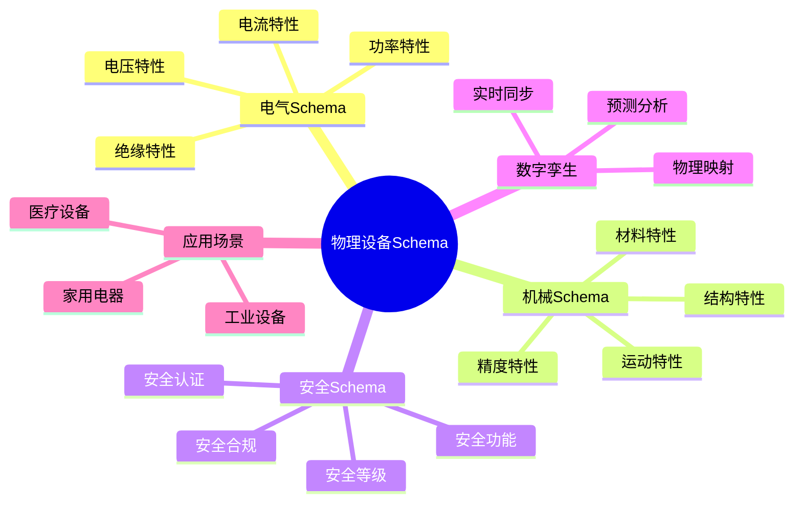

# 物理设备Schema思维导图

## 📑 目录

- [物理设备Schema思维导图](#物理设备schema思维导图)
  - [📑 目录](#-目录)
  - [1. 思维导图概述](#1-思维导图概述)
    - [1.1 导图结构](#11-导图结构)
  - [2. 完整思维导图](#2-完整思维导图)
  - [3. 五维结构分支](#3-五维结构分支)
    - [3.1 五维关系](#31-五维关系)
  - [4. 标准体系分支](#4-标准体系分支)
    - [4.1 标准关系](#41-标准关系)
  - [5. 应用场景分支](#5-应用场景分支)
    - [5.1 行业应用关系](#51-行业应用关系)
  - [6. Mermaid可视化](#6-mermaid可视化)
    - [6.1 思维导图Mermaid图](#61-思维导图mermaid图)

---

## 1. 思维导图概述

本文档以思维导图的形式展示物理设备Schema
的知识体系结构，帮助理解各个主题之间的关系。

### 1.1 导图结构

思维导图分为以下主要分支：

1. **电气Schema**：电压、电流、功率、绝缘特性
2. **机械Schema**：结构、运动、材料、精度特性
3. **安全Schema**：安全等级、安全功能、认证、合规
4. **数字孪生**：物理到数字的映射
5. **应用场景**：家用电器、工业设备、医疗设备

---

## 2. 完整思维导图

```text
物理设备Schema
│
├─ 1. 电气Schema
│   │
│   ├─ 1.1 电压特性
│   │   ├─ 额定电压
│   │   ├─ 电压范围
│   │   ├─ 电压容差
│   │   └─ 过压保护
│   │
│   ├─ 1.2 电流特性
│   │   ├─ 额定电流
│   │   ├─ 电流范围
│   │   ├─ 过流保护
│   │   └─ 漏电流
│   │
│   ├─ 1.3 功率特性
│   │   ├─ 额定功率
│   │   ├─ 功率范围
│   │   ├─ 效率
│   │   └─ 功率因数
│   │
│   └─ 1.4 绝缘特性
│       ├─ 绝缘等级
│       ├─ 绝缘电阻
│       ├─ 耐压测试
│       └─ 爬电距离
│
├─ 2. 机械Schema
│   │
│   ├─ 2.1 结构特性
│   │   ├─ 尺寸规格
│   │   ├─ 重量限制
│   │   ├─ 结构强度
│   │   └─ 连接方式
│   │
│   ├─ 2.2 运动特性
│   │   ├─ 运动范围
│   │   ├─ 运动速度
│   │   ├─ 加速度
│   │   └─ 运动精度
│   │
│   ├─ 2.3 材料特性
│   │   ├─ 材料类型
│   │   ├─ 材料强度
│   │   ├─ 耐腐蚀性
│   │   └─ 温度范围
│   │
│   └─ 2.4 精度特性
│       ├─ 定位精度
│       ├─ 重复精度
│       ├─ 分辨率
│       └─ 公差
│
├─ 3. 安全Schema
│   │
│   ├─ 3.1 安全等级
│   │   ├─ SIL等级
│   │   ├─ 安全类别
│   │   ├─ 风险等级
│   │   └─ 安全完整性
│   │
│   ├─ 3.2 安全功能
│   │   ├─ 急停功能
│   │   ├─ 安全门锁
│   │   ├─ 光幕保护
│   │   └─ 安全继电器
│   │
│   ├─ 3.3 安全认证
│   │   ├─ CE认证
│   │   ├─ UL认证
│   │   ├─ CCC认证
│   │   └─ IECEx认证
│   │
│   └─ 3.4 安全合规
│       ├─ IEC 61508
│       ├─ IEC 60335-1
│       ├─ GB/T标准
│       └─ 行业标准
│
├─ 4. 数字孪生
│   │
│   ├─ 4.1 物理映射
│   │   ├─ 电气映射
│   │   ├─ 机械映射
│   │   └─ 安全映射
│   │
│   ├─ 4.2 实时同步
│   │   ├─ 数据同步
│   │   ├─ 状态同步
│   │   └─ 事件同步
│   │
│   └─ 4.3 预测分析
│       ├─ 故障预测
│       ├─ 性能优化
│       └─ 维护计划
│
└─ 5. 应用场景
    │
    ├─ 5.1 家用电器
    │   ├─ 智能家居
    │   ├─ 厨房电器
    │   └─ 清洁设备
    │
    ├─ 5.2 工业设备
    │   ├─ 工业机器人
    │   ├─ 自动化设备
    │   └─ 制造设备
    │
    └─ 5.3 医疗设备
        ├─ 医疗仪器
        ├─ 诊断设备
        └─ 治疗设备
```

---

## 3. 五维结构分支

### 3.1 五维关系

物理设备Schema的五维结构关系：

```text
Physical_Schema = (Electrical ⊕ Mechanical ⊕ Thermal
                  ⊕ Functional ⊕ Safety) × Industry_Profile
```

**维度关系**：

- **电气维度**：定义电气特性
- **机械维度**：定义机械特性
- **热学维度**：定义热学特性
- **功能维度**：定义功能特性
- **安全维度**：定义安全特性

---

## 4. 标准体系分支

### 4.1 标准关系

```text
国际标准（IEC、ISO）
    ↓
国家标准（GB/T）
    ↓
行业标准（UL、CE）
    ↓
厂商标准（设备厂商）
```

---

## 5. 应用场景分支

### 5.1 行业应用关系

**应用领域**：

1. **家用电器**：IEC 60335-1标准
2. **工业设备**：GB/T 19903标准
3. **医疗设备**：IEC 60601-1标准

---

## 6. Mermaid可视化

### 6.1 思维导图Mermaid图



---

**参考文档**：

- `README.md` - 主题概览
- `Electrical_Schema/` - 电气Schema
- `Mechanical_Schema/` - 机械Schema
- `Safety_Schema/` - 安全Schema

**创建时间**：2025-01-21
**最后更新**：2025-01-21
