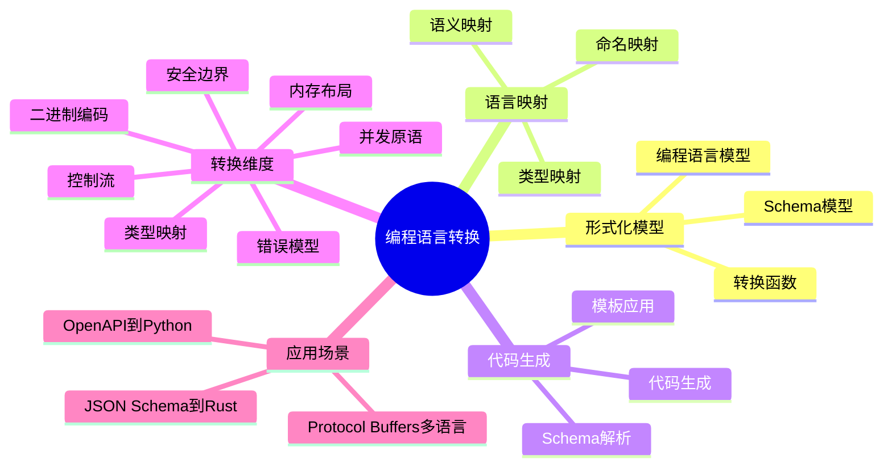

# 编程语言转换思维导图

## 📑 目录

- [编程语言转换思维导图](#编程语言转换思维导图)
  - [📑 目录](#-目录)
  - [1. 思维导图概述](#1-思维导图概述)
    - [1.1 导图结构](#11-导图结构)
  - [2. 完整思维导图](#2-完整思维导图)
  - [3. 形式化模型分支](#3-形式化模型分支)
    - [3.1 模型关系](#31-模型关系)
  - [4. 语言映射分支](#4-语言映射分支)
    - [4.1 映射关系](#41-映射关系)
  - [5. 代码生成分支](#5-代码生成分支)
    - [5.1 生成流程](#51-生成流程)
  - [6. Mermaid可视化](#6-mermaid可视化)
    - [6.1 思维导图Mermaid图](#61-思维导图mermaid图)

---

## 1. 思维导图概述

本文档以思维导图的形式展示编程语言转换
的知识体系结构，帮助理解各个主题之间的关系。

### 1.1 导图结构

思维导图分为以下主要分支：

1. **形式化模型**：Schema和语言的形式化定义
2. **语言映射**：类型映射和语义映射
3. **代码生成**：代码生成流程和工具
4. **转换维度**：七维转换体系
5. **应用场景**：实际应用案例

---

## 2. 完整思维导图

```text
编程语言转换
│
├─ 1. 形式化模型
│   │
│   ├─ 1.1 Schema模型
│   │   ├─ 类型系统
│   │   ├─ 约束条件
│   │   ├─ 结构定义
│   │   └─ 语义定义
│   │
│   ├─ 1.2 编程语言模型
│   │   ├─ 类型系统
│   │   ├─ 语法规则
│   │   ├─ 语义规则
│   │   └─ 运行时环境
│   │
│   └─ 1.3 转换函数
│       ├─ 类型转换
│       ├─ 约束转换
│       ├─ 结构转换
│       └─ 语义转换
│
├─ 2. 语言映射
│   │
│   ├─ 2.1 类型映射
│   │   ├─ 基本类型映射
│   │   ├─ 复合类型映射
│   │   └─ 类型约束映射
│   │
│   ├─ 2.2 语义映射
│   │   ├─ 操作语义映射
│   │   └─ 约束语义映射
│   │
│   └─ 2.3 命名映射
│       ├─ Python命名
│       ├─ Rust命名
│       ├─ Java命名
│       └─ Go命名
│
├─ 3. 代码生成
│   │
│   ├─ 3.1 Schema解析
│   │   ├─ JSON Schema解析
│   │   ├─ OpenAPI解析
│   │   └─ Protocol Buffers解析
│   │
│   ├─ 3.2 模板应用
│   │   ├─ Mustache模板
│   │   ├─ Jinja2模板
│   │   └─ Handlebars模板
│   │
│   └─ 3.3 代码生成
│       ├─ Python代码生成
│       ├─ Rust代码生成
│       ├─ Java代码生成
│       └─ Go代码生成
│
├─ 4. 转换维度
│   │
│   ├─ 4.1 类型映射维度
│   ├─ 4.2 内存布局维度
│   ├─ 4.3 控制流维度
│   ├─ 4.4 错误模型维度
│   ├─ 4.5 并发原语维度
│   ├─ 4.6 二进制编码维度
│   └─ 4.7 安全边界维度
│
└─ 5. 应用场景
    │
    ├─ 5.1 OpenAPI到Python
    ├─ 5.2 JSON Schema到Rust
    └─ 5.3 Protocol Buffers多语言
```

---

## 3. 形式化模型分支

### 3.1 模型关系

```text
Schema模型
    ↓
转换函数
    ↓
编程语言模型
```

---

## 4. 语言映射分支

### 4.1 映射关系

```text
Schema类型
    ↓
类型映射
    ↓
语言类型
```

---

## 5. 代码生成分支

### 5.1 生成流程

```text
Schema定义
    ↓
Schema解析
    ↓
模板应用
    ↓
代码生成
```

---

## 6. Mermaid可视化

### 6.1 思维导图Mermaid图



---

**参考文档**：

- `README.md` - 主题概览
- `Formal_Model/` - 形式化模型
- `Language_Mapping/` - 语言映射
- `Code_Generation/` - 代码生成

**创建时间**：2025-01-21
**最后更新**：2025-01-21
