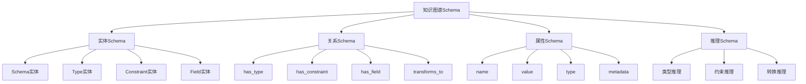

# 知识图谱Schema概述

## 📑 目录

- [知识图谱Schema概述](#知识图谱schema概述)
  - [📑 目录](#-目录)
  - [1. 核心结论](#1-核心结论)
    - [1.1 知识图谱Schema定义](#11-知识图谱schema定义)
    - [1.2 标准依据](#12-标准依据)
  - [2. 概念定义](#2-概念定义)
    - [2.1 知识图谱Schema定义](#21-知识图谱schema定义)
    - [2.2 核心特征](#22-核心特征)
    - [2.3 Schema与知识图谱的关系](#23-schema与知识图谱的关系)
  - [3. 知识图谱Schema结构](#3-知识图谱schema结构)
    - [3.1 实体Schema](#31-实体schema)
    - [3.2 关系Schema](#32-关系schema)
    - [3.3 属性Schema](#33-属性schema)
    - [3.4 推理Schema](#34-推理schema)
  - [4. 标准对标](#4-标准对标)
    - [4.1 国际标准](#41-国际标准)
    - [4.2 行业标准](#42-行业标准)
  - [5. 应用场景](#5-应用场景)
    - [5.1 Schema转换指导](#51-schema转换指导)
    - [5.2 知识推理](#52-知识推理)
    - [5.3 质量评估](#53-质量评估)
  - [6. 思维导图](#6-思维导图)

---

## 1. 核心结论

**知识图谱存在完整的Schema体系，用于表示和
推理DSL Schema转换中的知识**。

### 1.1 知识图谱Schema定义

```text
Knowledge_Graph_Schema = Entity_Schema ⊕ Relation_Schema
                       ⊕ Property_Schema ⊕ Inference_Schema
```

### 1.2 标准依据

- **W3C RDF**：资源描述框架标准
- **W3C OWL**：Web本体语言标准
- **ISO/IEC 21838**：知识图谱标准

---

## 2. 概念定义

### 2.1 知识图谱Schema定义

**知识图谱Schema**是描述知识图谱中实体、关系、
属性、推理规则的形式化规范，用于表示和推理
DSL Schema转换中的知识。

### 2.2 核心特征

1. **结构化表示**：结构化知识表示
2. **语义化**：语义化知识描述
3. **可推理**：支持知识推理
4. **可扩展**：支持知识扩展
5. **形式化**：数学形式化定义

### 2.3 Schema与知识图谱的关系

- **Schema**：描述知识结构（What）
- **知识图谱**：实现知识表示（How）
- **推理**：基于图谱的知识推理（Reasoning）

---

## 3. 知识图谱Schema结构

### 3.1 实体Schema

**定义**：描述知识图谱中的实体类型。

**包含内容**：

- Schema实体：Schema定义实体
- Type实体：类型实体
- Constraint实体：约束实体
- Field实体：字段实体

### 3.2 关系Schema

**定义**：描述知识图谱中的关系类型。

**包含内容**：

- has_type：Schema有类型
- has_constraint：类型有约束
- has_field：Schema有字段
- transforms_to：Schema转换到

### 3.3 属性Schema

**定义**：描述知识图谱中的属性类型。

**包含内容**：

- name：名称属性
- value：值属性
- type：类型属性
- metadata：元数据属性

### 3.4 推理Schema

**定义**：描述知识图谱中的推理规则。

**包含内容**：

- 类型推理：推断类型关系
- 约束推理：推断约束关系
- 转换推理：推断转换关系

---

## 4. 标准对标

### 4.1 国际标准

- **W3C RDF**：资源描述框架
- **W3C OWL**：Web本体语言
- **ISO/IEC 21838**：知识图谱标准
- **RDF Schema**：RDF Schema标准

### 4.2 行业标准

- **Schema.org**：结构化数据标准
- **JSON-LD**：JSON链接数据标准
- **Neo4j Cypher**：图查询语言标准

---

## 5. 应用场景

### 5.1 Schema转换指导

**场景描述**：

- 转换路径推荐
- 转换规则匹配
- 转换质量评估

**价值**：

- 提高转换效率
- 保证转换质量
- 优化转换路径

### 5.2 知识推理

**场景描述**：

- 类型关系推理
- 约束关系推理
- 转换关系推理

**价值**：

- 发现隐含知识
- 验证知识一致性
- 补全缺失知识

### 5.3 质量评估

**场景描述**：

- 信息损失评估
- 语义等价性评估
- 类型安全性评估

**价值**：

- 评估转换质量
- 发现转换问题
- 优化转换策略

---

## 6. 思维导图



---

**参考文档**：

- `../README.md` - 主题概览
- `02_Formal_Definition.md` - 形式化定义
- `03_Standards.md` - 标准对标
- `04_Transformation.md` - 转换体系
- `05_Case_Studies.md` - 实践案例

**创建时间**：2025-01-21
**最后更新**：2025-01-21
