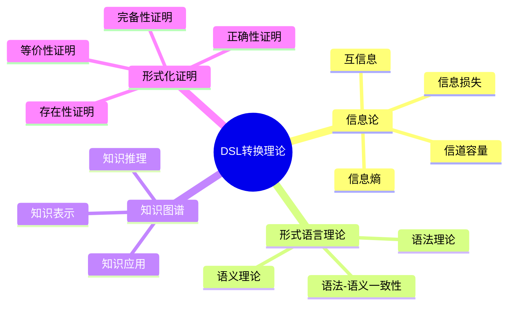

# DSL转换理论思维导图

## 📑 目录

- [DSL转换理论思维导图](#dsl转换理论思维导图)
  - [📑 目录](#-目录)
  - [1. 思维导图概述](#1-思维导图概述)
    - [1.1 导图结构](#11-导图结构)
  - [2. 完整思维导图](#2-完整思维导图)
  - [3. 信息论分支](#3-信息论分支)
  - [4. 形式语言理论分支](#4-形式语言理论分支)
  - [5. 知识图谱分支](#5-知识图谱分支)
  - [6. Mermaid可视化](#6-mermaid可视化)

---

## 1. 思维导图概述

本文档以思维导图的形式展示DSL转换理论
的知识体系结构，帮助理解各个主题之间的关系。

### 1.1 导图结构

思维导图分为以下主要分支：

1. **信息论**：信息熵、互信息、信道容量
2. **形式语言理论**：语法、语义、转换
3. **知识图谱**：知识表示和推理
4. **形式化证明**：存在性、完备性、正确性

---

## 2. 完整思维导图

```text
DSL转换理论
│
├─ 1. 信息论
│   │
│   ├─ 1.1 信息熵
│   │   ├─ Schema信息熵
│   │   ├─ 信息熵分解
│   │   └─ 七维信息熵
│   │
│   ├─ 1.2 互信息
│   │   ├─ Schema互信息
│   │   ├─ 转换互信息
│   │   └─ 正确性条件
│   │
│   ├─ 1.3 信息损失
│   │   ├─ 信息损失定义
│   │   ├─ 信息损失量化
│   │   └─ 信息损失优化
│   │
│   └─ 1.4 信道容量
│       ├─ 信道容量定义
│       ├─ Schema转换信道容量
│       └─ 容量优化
│
├─ 2. 形式语言理论
│   │
│   ├─ 2.1 语法理论
│   │   ├─ Schema文法
│   │   ├─ 语法规则
│   │   └─ 语法转换
│   │
│   ├─ 2.2 语义理论
│   │   ├─ 语义模型
│   │   ├─ 语义规则
│   │   └─ 语义转换
│   │
│   └─ 2.3 语法-语义一致性
│       ├─ 一致性定义
│       ├─ 一致性定理
│       └─ 一致性证明
│
├─ 3. 知识图谱
│   │
│   ├─ 3.1 知识表示
│   │   ├─ 实体定义
│   │   ├─ 关系定义
│   │   └─ 属性定义
│   │
│   ├─ 3.2 知识推理
│   │   ├─ 规则推理
│   │   ├─ 图推理
│   │   └─ 语义推理
│   │
│   └─ 3.3 知识应用
│       ├─ 转换指导
│       ├─ 质量评估
│       └─ 优化建议
│
└─ 4. 形式化证明
    │
    ├─ 4.1 存在性证明
    ├─ 4.2 完备性证明
    ├─ 4.3 正确性证明
    └─ 4.4 等价性证明
```

---

## 3. 信息论分支

### 3.1 信息熵关系

```text
Schema信息熵
    ↓
七维分解
    ↓
各维度信息熵
```

---

## 4. 形式语言理论分支

### 4.1 语法-语义关系

```text
Schema语法
    ↓
语法转换
    ↓
目标语法
    ↓
语义转换
    ↓
目标语义
```

---

## 5. 知识图谱分支

### 5.1 知识表示关系

```text
Schema实体
    ↓
关系定义
    ↓
知识图谱
    ↓
知识推理
```

---

## 6. Mermaid可视化

### 6.1 思维导图Mermaid图



---

**参考文档**：

- `README.md` - 主题概览
- `Information_Theory/` - 信息论分析
- `Formal_Language_Theory/` - 形式语言理论
- `Knowledge_Graph/` - 知识图谱

**创建时间**：2025-01-21
**最后更新**：2025-01-21

