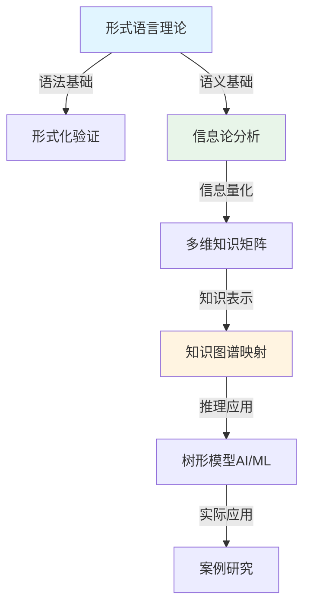

# 📚 理论分析文档导航总览

## 🎯 文档概述

本目录包含DSL Schema转换的理论分析文档，从形式语言理论、信息论、知识图谱等多个理论角度深入分析Schema转换的本质和规律。

---

## 📖 核心理论文档（7个）

### 1. **[10-形式语言理论分析.md](./10_Formal_Language_Theory_Analysis.md)** ✨ **已增强**

**内容概述**：

- 形式语言理论基础（Chomsky层次、语法类型）
- Schema语法结构的形式化定义
- 语法转换和语义转换的形式化
- 转换正确性的形式语言证明

**增强内容**：

- ✅ 形式语言理论体系思维导图
- ✅ Chomsky层次与Schema语法类型对比矩阵
- ✅ 语义理论对比矩阵
- ✅ Schema语法类型对比矩阵
- ✅ Schema语法层次结构图
- ✅ 语法转换流程图
- ✅ 语义转换方法对比矩阵
- ✅ 转换验证方法对比矩阵

**行数**: 823行（增强后）

---

### 2. **[09-信息论分析.md](./09_Information_Theory_Analysis.md)** ✨ **已增强**

**内容概述**：

- 信息论基础（熵、互信息、信道容量）
- Schema信息熵的量化
- 转换过程中的信息损失分析
- 转换正确性的信息论证明

**增强内容**：

- ✅ 信息论在Schema转换中的应用思维导图
- ✅ Schema熵类型对比矩阵
- ✅ Schema信息熵计算流程图
- ✅ 信息损失类型对比矩阵
- ✅ 信息损失分析流程图

**行数**: 597行（增强后）

---

### 3. **[08-多维知识矩阵.md](./08_Multidimensional_Knowledge_Matrix.md)** ✨ **已增强**

**内容概述**：

- 多维知识矩阵的构建方法
- Schema类型、转换方向、应用领域等维度分析
- 矩阵应用场景和实际案例

**增强内容**：

- ✅ 多维知识矩阵体系思维导图

**行数**: 602行（增强后）

---

### 4. **[07-知识图谱映射.md](./07_Knowledge_Graph_Mapping.md)** ✨ **已增强**

**内容概述**：

- 知识图谱基础（图结构、实体、关系）
- Schema映射知识图谱构建
- 本体定义和推理规则
- 知识图谱应用和工具

**增强内容**：

- ✅ Schema转换知识图谱体系思维导图

**行数**: 682行

---

### 5. **[06-形式化验证证明.md](./06_Formal_Verification_Proofs.md)** ✨ **已增强**

**内容概述**：

- 形式化验证方法
- 转换正确性的形式化证明
- 类型安全和约束保持性证明

**增强内容**：

- ✅ 形式化验证体系思维导图
- ✅ 验证方法对比矩阵
- ✅ 形式化验证流程图

**行数**: 706行（增强后）

---

### 6. **[06-树形模型AI/ML应用.md](./06_Tree_Model_AI_ML_Application.md)** ✨ **已增强**

**内容概述**：

- 树形模型在AI/ML中的应用
- 决策树映射和树形神经网络
- Schema转换中的树形模型应用

**增强内容**：

- ✅ 树形模型应用思维导图
- ✅ 树形模型类型对比矩阵
- ✅ 树形模型转换流程图

**行数**: 513行（增强后）

---

### 7. **[06-树形模型AI/ML案例研究.md](./06_Tree_Model_AI_ML_Case_Studies.md)** ✨ **已增强**

**内容概述**：

- 树形模型的实际应用案例
- 智能Schema推荐
- 自动转换优化

**增强内容**：

- ✅ 案例研究体系思维导图
- ✅ 树形模型案例对比矩阵
- ✅ 案例研究流程图

**行数**: 526行（增强后）

---

## 📊 理论文档统计

| 文档 | 行数 | 增强状态 | 对比矩阵 | 图表 |
|------|------|----------|----------|------|
| 10-形式语言理论 | 823 | ✅ 已增强 | 4个 | 3个 |
| 09-信息论分析 | 597 | ✅ 已增强 | 2个 | 2个 |
| 08-多维知识矩阵 | 602 | ✅ 已增强 | 0个 | 1个 |
| 07-知识图谱映射 | 682 | ✅ 已增强 | 0个 | 1个 |
| 06-形式化验证证明 | 706 | ✅ 已增强 | 1个 | 1个 |
| 06-树形模型应用 | 513 | ✅ 已增强 | 1个 | 1个 |
| 06-树形模型案例 | 526 | ✅ 已增强 | 1个 | 1个 |
| **总计** | **4,449** | **7/7已增强** | **9个** | **10个** |

---

## 🗺️ 理论文档关系图

---

## 📚 推荐阅读路径

### 路径1：理论基础 → 应用实践

1. 10-形式语言理论分析（理论基础）
2. 09-信息论分析（量化方法）
3. 08-多维知识矩阵（知识体系）
4. 07-知识图谱映射（知识表示）
5. 06-形式化验证证明（验证方法）
6. 06-树形模型应用（AI/ML应用）
7. 06-树形模型案例（实际案例）

### 路径2：快速入门

1. 10-形式语言理论分析（核心理论）
2. 09-信息论分析（量化工具）
3. 07-知识图谱映射（知识表示）

### 路径3：应用导向

1. 06-树形模型案例（实际案例）
2. 06-树形模型应用（AI/ML应用）
3. 07-知识图谱映射（知识表示）

---

## 🔗 相关文档

### 主题分析文档

- [主题分析文档导航](../analysis/themes/00-文档导航总览.md)
- [领域语言转换与AI时代适配方案](../analysis/themes/01-领域语言转换与AI时代适配方案.md)
- [多维模型转换论证](../analysis/themes/06-多维模型转换论证.md)

### 项目文档

- [项目README](../../README.md)
- [项目完成总结](../analysis/themes/项目最终完成总结.md)

---

## 📝 文档使用说明

1. **理论文档**：深入的理论分析和形式化证明
2. **主题文档**：实际应用和案例分析
3. **结合使用**：理论指导实践，实践验证理论

---

**最后更新**: 2025年
**文档版本**: v1.0
**维护状态**: 持续更新中
