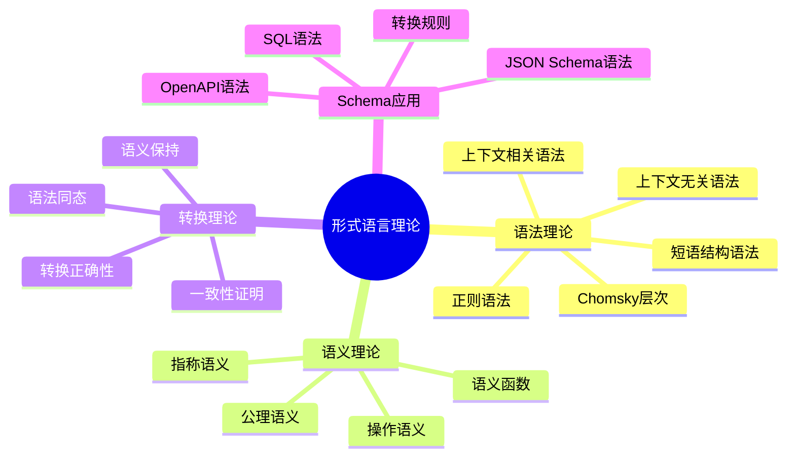
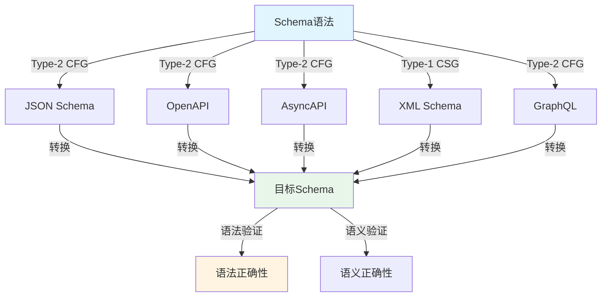
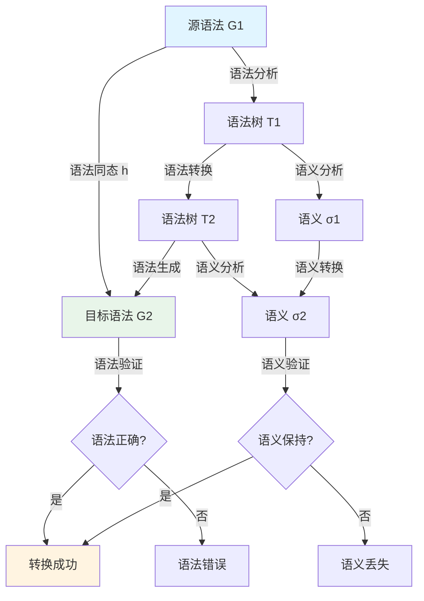

# Schema转换的形式语言理论分析

## 📑 目录

- [Schema转换的形式语言理论分析](#schema转换的形式语言理论分析)
  - [📑 目录](#-目录)
  - [1. 概述](#1-概述)
    - [1.1 研究目标](#11-研究目标)
    - [1.2 形式语言理论体系思维导图](#12-形式语言理论体系思维导图)
      - [🗺️ 形式语言理论在Schema转换中的应用](#️-形式语言理论在schema转换中的应用)
    - [1.3 核心问题](#13-核心问题)
    - [1.3 形式语言理论在Schema转换中的意义](#13-形式语言理论在schema转换中的意义)
  - [2. 形式语言理论基础](#2-形式语言理论基础)
    - [2.1 基本概念](#21-基本概念)
      - [2.1.1 形式语法（Formal Grammar）](#211-形式语法formal-grammar)
      - [2.1.2 语言（Language）](#212-语言language)
      - [2.1.3 语法类型（Chomsky Hierarchy）](#213-语法类型chomsky-hierarchy)
      - [2.1.4 语义函数（Semantic Function）](#214-语义函数semantic-function)
  - [3. Schema的语法结构](#3-schema的语法结构)
    - [3.1 Schema语法类型对比矩阵](#31-schema语法类型对比矩阵)
      - [📊 Schema语法类型与Chomsky层次映射](#-schema语法类型与chomsky层次映射)
      - [🗺️ Schema语法层次结构](#️-schema语法层次结构)
    - [3.2 Schema语法定义](#32-schema语法定义)
      - [3.1.1 OpenAPI Schema语法](#311-openapi-schema语法)
      - [3.1.2 AsyncAPI Schema语法](#312-asyncapi-schema语法)
      - [3.1.3 JSON Schema语法](#313-json-schema语法)
    - [3.2 语法类型分析](#32-语法类型分析)
      - [3.2.1 Schema语法的类型](#321-schema语法的类型)
      - [3.2.2 语法复杂度](#322-语法复杂度)
  - [4. Schema的语义模型](#4-schema的语义模型)
    - [4.1 语义域定义](#41-语义域定义)
      - [4.1.1 类型语义域](#411-类型语义域)
      - [4.1.2 值语义域](#412-值语义域)
      - [4.1.3 约束语义域](#413-约束语义域)
      - [4.1.4 Schema语义域](#414-schema语义域)
    - [4.2 语义函数定义](#42-语义函数定义)
      - [4.2.1 类型语义函数](#421-类型语义函数)
      - [4.2.2 值语义函数](#422-值语义函数)
      - [4.2.3 约束语义函数](#423-约束语义函数)
      - [4.2.4 Schema语义函数](#424-schema语义函数)
    - [4.3 语义等价性](#43-语义等价性)
      - [4.3.1 语义等价定义](#431-语义等价定义)
      - [4.3.2 语义等价性判定](#432-语义等价性判定)
  - [5. 语法转换的形式化](#5-语法转换的形式化)
    - [5.1 语法转换类型对比矩阵](#51-语法转换类型对比矩阵)
      - [📊 语法转换方法对比](#-语法转换方法对比)
      - [🗺️ 语法转换流程图](#️-语法转换流程图)
    - [5.2 语法转换定义](#52-语法转换定义)
      - [5.1.1 语法同态（Grammar Homomorphism）](#511-语法同态grammar-homomorphism)
      - [5.1.2 语法转换函数](#512-语法转换函数)
    - [5.2 语法转换规则](#52-语法转换规则)
      - [5.2.1 类型转换规则](#521-类型转换规则)
      - [5.2.2 结构转换规则](#522-结构转换规则)
    - [5.3 语法转换的正确性](#53-语法转换的正确性)
      - [5.3.1 语法正确性定义](#531-语法正确性定义)
      - [5.3.2 语法正确性证明](#532-语法正确性证明)
  - [6. 语义转换的形式化](#6-语义转换的形式化)
    - [6.1 语义转换方法对比矩阵](#61-语义转换方法对比矩阵)
      - [📊 语义转换方法对比](#-语义转换方法对比)
    - [6.2 语义转换定义](#62-语义转换定义)
      - [6.1.1 语义转换函数](#611-语义转换函数)
      - [6.1.2 语义保持性](#612-语义保持性)
    - [6.2 语义转换规则](#62-语义转换规则)
      - [6.2.1 类型语义转换](#621-类型语义转换)
      - [6.2.2 值语义转换](#622-值语义转换)
      - [6.2.3 约束语义转换](#623-约束语义转换)
    - [6.3 语义转换的正确性](#63-语义转换的正确性)
      - [6.3.1 语义正确性定义](#631-语义正确性定义)
      - [6.3.2 语义正确性证明](#632-语义正确性证明)
  - [7. 语法-语义一致性证明](#7-语法-语义一致性证明)
    - [7.1 一致性定义](#71-一致性定义)
      - [7.1.1 语法-语义一致性](#711-语法-语义一致性)
    - [7.2 一致性证明](#72-一致性证明)
      - [7.2.1 一致性定理](#721-一致性定理)
      - [7.2.2 一致性证明方法](#722-一致性证明方法)
  - [8. 转换正确性的形式语言证明](#8-转换正确性的形式语言证明)
    - [8.1 转换正确性定义](#81-转换正确性定义)
      - [8.1.1 完全正确性](#811-完全正确性)
      - [8.1.2 部分正确性](#812-部分正确性)
    - [8.2 转换正确性证明](#82-转换正确性证明)
      - [8.2.1 语法正确性证明](#821-语法正确性证明)
      - [8.2.2 语义正确性证明](#822-语义正确性证明)
      - [8.2.3 一致性证明](#823-一致性证明)
    - [8.3 转换正确性的组合证明](#83-转换正确性的组合证明)
      - [8.3.1 组合定理](#831-组合定理)
  - [9. 实际应用](#9-实际应用)
    - [9.1 转换验证](#91-转换验证)
      - [9.1.1 语法验证](#911-语法验证)
      - [9.1.2 语义验证](#912-语义验证)
    - [9.2 转换生成](#92-转换生成)
      - [9.2.1 语法转换生成](#921-语法转换生成)
      - [9.2.2 语义转换生成](#922-语义转换生成)
    - [9.3 案例研究](#93-案例研究)
      - [9.3.1 OpenAPI → AsyncAPI转换](#931-openapi--asyncapi转换)
      - [9.3.2 JSON Schema → SQL Schema转换](#932-json-schema--sql-schema转换)
  - [10. 总结](#10-总结)
    - [10.1 关键成果](#101-关键成果)
    - [10.2 未来工作](#102-未来工作)


---

## 1. 概述

### 1.1 研究目标

从形式语言理论的角度分析DSL Schema转换，建立语法和语义的形式化模型，证明转换的正确性和一致性。

### 1.2 形式语言理论体系思维导图

#### 🗺️ 形式语言理论在Schema转换中的应用



### 1.3 核心问题

- **语法结构**：如何形式化定义Schema的语法结构？
- **语义模型**：如何建立Schema的语义模型？
- **语法转换**：如何形式化定义语法转换？
- **语义转换**：如何形式化定义语义转换？
- **一致性证明**：如何证明语法转换和语义转换的一致性？

### 1.3 形式语言理论在Schema转换中的意义

形式语言理论为Schema转换提供了：

- **严格定义**：语法和语义的严格数学定义
- **证明方法**：基于形式语言理论的证明方法
- **一致性保证**：语法和语义一致性的理论保证

---

## 2. 形式语言理论基础

### 2.1 基本概念

#### 2.1.1 形式语法（Formal Grammar）

**定义**：形式语法 $G$ 是一个四元组：

$$G = (N, T, P, S)$$

其中：

- $N$：非终结符集合（Non-terminals）
- $T$：终结符集合（Terminals）
- $P$：产生式规则集合（Productions）
- $S$：起始符号（Start symbol）

#### 2.1.2 语言（Language）

**定义**：语法 $G$ 生成的语言 $L(G)$ 定义为：

$$L(G) = \{w \in T^* | S \xRightarrow{*} w\}$$

其中 $\xRightarrow{*}$ 表示推导关系。

#### 2.1.3 语法类型（Chomsky Hierarchy）

根据产生式规则的形式，语法分为四个层次：

1. **类型0（无限制语法）**：$P \subseteq (N \cup T)^* \times (N \cup T)^*$
2. **类型1（上下文相关语法）**：$\alpha A \beta \rightarrow \alpha \gamma \beta$
3. **类型2（上下文无关语法）**：$A \rightarrow \alpha$
4. **类型3（正则语法）**：$A \rightarrow aB$ 或 $A \rightarrow a$

#### 2.1.4 语义函数（Semantic Function）

**定义**：语义函数 $[\![\cdot]\!]: L(G) \rightarrow \Sigma$ 将语法生成的字符串映射到语义域 $\Sigma$。

---

## 3. Schema的语法结构

### 3.1 Schema语法类型对比矩阵

#### 📊 Schema语法类型与Chomsky层次映射

| Schema类型 | Chomsky类型 | 语法复杂度 | 解析复杂度 | 转换复杂度 | 工具支持 |
|-----------|-------------|------------|------------|------------|----------|
| **JSON Schema** | Type-2 (CFG) | ⭐⭐⭐ | ⭐⭐⭐ | ⭐⭐⭐ | ⭐⭐⭐⭐⭐ |
| **OpenAPI Schema** | Type-2 (CFG) | ⭐⭐⭐ | ⭐⭐⭐ | ⭐⭐⭐ | ⭐⭐⭐⭐⭐ |
| **AsyncAPI Schema** | Type-2 (CFG) | ⭐⭐⭐ | ⭐⭐⭐ | ⭐⭐⭐ | ⭐⭐⭐⭐ |
| **XML Schema** | Type-1 (CSG) | ⭐⭐⭐⭐ | ⭐⭐⭐⭐ | ⭐⭐⭐⭐ | ⭐⭐⭐⭐ |
| **SQL DDL** | Type-2 (CFG) | ⭐⭐⭐ | ⭐⭐⭐ | ⭐⭐⭐ | ⭐⭐⭐⭐⭐ |
| **GraphQL Schema** | Type-2 (CFG) | ⭐⭐⭐ | ⭐⭐⭐ | ⭐⭐⭐ | ⭐⭐⭐⭐ |
| **Protobuf** | Type-2 (CFG) | ⭐⭐⭐ | ⭐⭐⭐ | ⭐⭐⭐ | ⭐⭐⭐⭐⭐ |

#### 🗺️ Schema语法层次结构



### 3.2 Schema语法定义

#### 3.1.1 OpenAPI Schema语法

**定义**：OpenAPI Schema语法 $G_{OpenAPI} = (N, T, P, S)$：

**非终结符**：

- $N = \{Schema, Type, Property, Constraint, ...\}$

**终结符**：

- $T = \{string, integer, object, array, required, ...\}$

**产生式规则**（简化示例）：

```text
Schema → Type Property* Constraint*
Type → string | integer | object | array
Property → name: Type
Constraint → required | minLength | maxLength | ...
```

#### 3.1.2 AsyncAPI Schema语法

**定义**：AsyncAPI Schema语法 $G_{AsyncAPI} = (N, T, P, S)$：

**产生式规则**（简化示例）：

```text
Schema → Message Property* Constraint*
Message → publish | subscribe
Property → name: Type
Type → string | integer | object | array
```

#### 3.1.3 JSON Schema语法

**定义**：JSON Schema语法 $G_{JSON} = (N, T, P, S)$：

**产生式规则**（简化示例）：

```text
Schema → { Properties Constraints }
Properties → Property*
Property → "name": Type
Type → "string" | "number" | "object" | "array"
Constraints → "required": [String*]
```

### 3.2 语法类型分析

#### 3.2.1 Schema语法的类型

**定理**：大多数Schema语法属于**上下文无关语法**（类型2）。

**证明**：

- Schema的结构可以用递归结构表示
- 产生式规则形式为 $A \rightarrow \alpha$，其中 $A$ 是非终结符
- 因此属于上下文无关语法

**示例**：OpenAPI Schema的递归结构：

```text
Object → { Property* }
Property → name: Type
Type → Object | Array | Primitive
```

#### 3.2.2 语法复杂度

**定义**：语法的复杂度用产生式规则数量衡量：

$$Complexity(G) = |P|$$

**示例**：

- OpenAPI Schema：$Complexity(G_{OpenAPI}) \approx 50$
- AsyncAPI Schema：$Complexity(G_{AsyncAPI}) \approx 40$
- JSON Schema：$Complexity(G_{JSON}) \approx 30$

---

## 4. Schema的语义模型

### 4.1 语义域定义

#### 4.1.1 类型语义域

**定义**：类型语义域 $\Sigma_T$ 定义为：

$$\Sigma_T = \{String, Integer, Object, Array, ...\}$$

**语义函数**：
$$[\![string]\!] = String$$
$$[\![integer]\!] = Integer$$
$$[\![object]\!] = Object$$
$$[\![array]\!] = Array$$

#### 4.1.2 值语义域

**定义**：值语义域 $\Sigma_V$ 定义为：

$$\Sigma_V = \{v | v \text{ 是符合类型语义的值}\}$$

**示例**：

- $[\!["Hello"]\!] = "Hello" \in String$
- $[\![42]\!] = 42 \in Integer$

#### 4.1.3 约束语义域

**定义**：约束语义域 $\Sigma_C$ 定义为：

$$\Sigma_C = \{c | c \text{ 是约束条件}\}$$

**示例**：

- $[\![required]\!] = \{v | v \text{ 必须存在}\}$
- $[\![minLength: 5]\!] = \{v | |v| \geq 5\}$

#### 4.1.4 Schema语义域

**定义**：Schema语义域 $\Sigma$ 定义为：

$$\Sigma = \Sigma_T \times \Sigma_V \times \Sigma_C \times \Sigma_M$$

其中 $\Sigma_M$ 是元数据语义域。

### 4.2 语义函数定义

#### 4.2.1 类型语义函数

**定义**：类型语义函数 $[\![\cdot]\!]_T: Type \rightarrow \Sigma_T$：

$$
[\![t]\!]_T = \begin{cases}
String & \text{if } t = string \\
Integer & \text{if } t = integer \\
Object & \text{if } t = object \\
Array & \text{if } t = array
\end{cases}
$$

#### 4.2.2 值语义函数

**定义**：值语义函数 $[\![\cdot]\!]_V: Value \rightarrow \Sigma_V$：

$$[\![v]\!]_V = v' \text{ where } v' \in [\![type(v)]\!]_T$$

#### 4.2.3 约束语义函数

**定义**：约束语义函数 $[\![\cdot]\!]_C: Constraint \rightarrow \Sigma_C$：

$$[\![c]\!]_C = \{v | v \text{ satisfies } c\}$$

#### 4.2.4 Schema语义函数

**定义**：Schema语义函数 $[\![\cdot]\!]: Schema \rightarrow \Sigma$：

$$[\![s]\!] = ([\![s.type]\!]_T, [\![s.value]\!]_V, [\![s.constraint]\!]_C, [\![s.metadata]\!]_M)$$

### 4.3 语义等价性

#### 4.3.1 语义等价定义

**定义**：两个Schema $s_1$ 和 $s_2$ 语义等价，当且仅当：

$$[\![s_1]\!] = [\![s_2]\!]$$

#### 4.3.2 语义等价性判定

**算法**：判定两个Schema是否语义等价：

```text
function SemanticEquivalence(s1, s2):
    return [s1.type]_T == [s2.type]_T &&
           [s1.value]_V == [s2.value]_V &&
           [s1.constraint]_C == [s2.constraint]_C &&
           [s1.metadata]_M == [s2.metadata]_M
```

---

## 5. 语法转换的形式化

### 5.1 语法转换类型对比矩阵

#### 📊 语法转换方法对比

| 转换方法 | 理论基础 | 保持性 | 复杂度 | 适用场景 | 工具支持 |
|---------|----------|--------|--------|----------|----------|
| **语法同态** | 形式语言理论 | 语法结构 | ⭐⭐⭐⭐ | 结构相似转换 | 理论工具 |
| **语法嵌入** | 形式语言理论 | 语法结构 | ⭐⭐⭐⭐⭐ | 语法扩展 | 理论工具 |
| **语法投影** | 形式语言理论 | 部分结构 | ⭐⭐⭐ | 语法简化 | 理论工具 |
| **语法变换** | 形式语言理论 | 语法结构 | ⭐⭐⭐⭐ | 语法重构 | 理论工具 |

#### 🗺️ 语法转换流程图



### 5.2 语法转换定义

#### 5.1.1 语法同态（Grammar Homomorphism）

**定义**：语法同态 $h: G_1 \rightarrow G_2$ 是一个映射：

$$h: (N_1 \cup T_1)^* \rightarrow (N_2 \cup T_2)^*$$

满足：

- $h(N_1) \subseteq N_2^*$
- $h(T_1) \subseteq T_2^*$
- 对于产生式 $A \rightarrow \alpha$，有 $h(A) \xRightarrow{*} h(\alpha)$

#### 5.1.2 语法转换函数

**定义**：语法转换函数 $f_G: L(G_1) \rightarrow L(G_2)$ 定义为：

$$f_G(w) = h(w) \text{ where } w \in L(G_1)$$

其中 $h$ 是语法同态。

### 5.2 语法转换规则

#### 5.2.1 类型转换规则

**定义**：类型转换规则 $f_T: Type_1 \rightarrow Type_2$：

$$f_T(t_1) = t_2 \text{ where } [\![t_1]\!]_T = [\![t_2]\!]_T$$

**示例**：OpenAPI → AsyncAPI类型转换：

- $f_T(string) = string$
- $f_T(integer) = integer$
- $f_T(object) = object$

#### 5.2.2 结构转换规则

**定义**：结构转换规则 $f_S: Structure_1 \rightarrow Structure_2$：

$$f_S(s_1) = s_2 \text{ where } structure(s_1) \sim structure(s_2)$$

其中 $\sim$ 表示结构相似性。

**示例**：OpenAPI → AsyncAPI结构转换：

- REST路径 → 消息主题
- GET操作 → subscribe操作
- POST操作 → publish操作

### 5.3 语法转换的正确性

#### 5.3.1 语法正确性定义

**定义**：语法转换函数 $f_G$ 是语法正确的，当且仅当：

$$\forall w \in L(G_1), f_G(w) \in L(G_2)$$

**含义**：源语法的所有合法字符串都能转换为目标语法的合法字符串。

#### 5.3.2 语法正确性证明

**定理**：如果语法同态 $h$ 保持产生式规则，则语法转换函数 $f_G$ 是语法正确的。

**证明**：

- 对于 $w \in L(G_1)$，存在推导 $S_1 \xRightarrow{*} w$
- 由于 $h$ 保持产生式规则，有 $h(S_1) \xRightarrow{*} h(w)$
- 因此 $h(w) \in L(G_2)$
- 因此 $f_G(w) = h(w) \in L(G_2)$

---

## 6. 语义转换的形式化

### 6.1 语义转换方法对比矩阵

#### 📊 语义转换方法对比

| 转换方法 | 理论基础 | 保持性 | 复杂度 | 适用场景 | 验证难度 |
|---------|----------|--------|--------|----------|----------|
| **语义同态** | 指称语义 | 完全语义 | ⭐⭐⭐⭐⭐ | 语义等价转换 | ⭐⭐⭐⭐⭐ |
| **语义嵌入** | 指称语义 | 部分语义 | ⭐⭐⭐⭐ | 语义扩展 | ⭐⭐⭐⭐ |
| **语义投影** | 指称语义 | 部分语义 | ⭐⭐⭐ | 语义简化 | ⭐⭐⭐ |
| **语义变换** | 操作语义 | 操作语义 | ⭐⭐⭐⭐ | 执行语义转换 | ⭐⭐⭐⭐ |

### 6.2 语义转换定义

#### 6.1.1 语义转换函数

**定义**：语义转换函数 $f_\Sigma: \Sigma_1 \rightarrow \Sigma_2$ 定义为：

$$f_\Sigma(\sigma_1) = \sigma_2 \text{ where } \sigma_1 \in \Sigma_1, \sigma_2 \in \Sigma_2$$

#### 6.1.2 语义保持性

**定义**：语义转换函数 $f_\Sigma$ 保持语义，当且仅当：

$$\forall s_1, s_2: [\![s_1]\!]_1 = [\![s_2]\!]_1 \implies [\![f_G(s_1)]\!]_2 = [\![f_G(s_2)]\!]_2$$

**含义**：语义等价的源Schema转换为语义等价的目标Schema。

### 6.2 语义转换规则

#### 6.2.1 类型语义转换

**定义**：类型语义转换规则 $f_{\Sigma_T}: \Sigma_{T1} \rightarrow \Sigma_{T2}$：

$$f_{\Sigma_T}(\sigma_{T1}) = \sigma_{T2} \text{ where } \sigma_{T1} = \sigma_{T2}$$

**示例**：OpenAPI → AsyncAPI类型语义转换：

- $f_{\Sigma_T}(String) = String$
- $f_{\Sigma_T}(Integer) = Integer$

#### 6.2.2 值语义转换

**定义**：值语义转换规则 $f_{\Sigma_V}: \Sigma_{V1} \rightarrow \Sigma_{V2}$：

$$f_{\Sigma_V}(\sigma_{V1}) = \sigma_{V2} \text{ where } \sigma_{V1} \in \sigma_{V2}$$

**示例**：OpenAPI → AsyncAPI值语义转换：

- REST方法值转换为消息操作值
- $f_{\Sigma_V}(GET) = subscribe$
- $f_{\Sigma_V}(POST) = publish$

#### 6.2.3 约束语义转换

**定义**：约束语义转换规则 $f_{\Sigma_C}: \Sigma_{C1} \rightarrow \Sigma_{C2}$：

$$f_{\Sigma_C}(\sigma_{C1}) = \sigma_{C2} \text{ where } \sigma_{C1} \subseteq \sigma_{C2}$$

**含义**：目标约束包含源约束，确保约束保持性。

### 6.3 语义转换的正确性

#### 6.3.1 语义正确性定义

**定义**：语义转换函数 $f_\Sigma$ 是语义正确的，当且仅当：

$$\forall s_1: [\![s_1]\!]_1 = [\![f_G(s_1)]\!]_2$$

**含义**：源Schema的语义等于转换后Schema的语义。

#### 6.3.2 语义正确性证明

**定理**：如果语义转换函数 $f_\Sigma$ 保持语义等价性，则语义转换是正确的。

**证明**：

- 对于 $s_1$，有 $[\![s_1]\!]_1 = \sigma_1$
- 由于 $f_\Sigma$ 保持语义等价性，有 $f_\Sigma(\sigma_1) = \sigma_2$ 且 $[\![f_G(s_1)]\!]_2 = \sigma_2$
- 因此 $[\![s_1]\!]_1 = [\![f_G(s_1)]\!]_2$

---

## 7. 语法-语义一致性证明

### 7.1 一致性定义

#### 7.1.1 语法-语义一致性

**定义**：语法转换函数 $f_G$ 和语义转换函数 $f_\Sigma$ 是一致的，当且仅当：

$$\forall s_1: [\![f_G(s_1)]\!]_2 = f_\Sigma([\![s_1]\!]_1)$$

**含义**：先进行语法转换再求语义，等于先求语义再进行语义转换。

**图示**：

```text
s_1 --[f_G]--> f_G(s_1)
 |              |
[·]_1          [·]_2
 |              |
σ_1 --[f_Σ]--> σ_2
```

### 7.2 一致性证明

#### 7.2.1 一致性定理

**定理**：如果语法转换函数 $f_G$ 和语义转换函数 $f_\Sigma$ 满足交换性条件，则它们是一致的。

**交换性条件**：
$$\forall s_1: f_\Sigma([\![s_1]\!]_1) = [\![f_G(s_1)]\!]_2$$

**证明**：

- 对于 $s_1$，有 $[\![s_1]\!]_1 = \sigma_1$
- 由于交换性条件，有 $f_\Sigma(\sigma_1) = [\![f_G(s_1)]\!]_2$
- 因此 $[\![f_G(s_1)]\!]_2 = f_\Sigma([\![s_1]\!]_1)$

#### 7.2.2 一致性证明方法

**方法1：结构归纳法**:

1. **基础情况**：证明基本类型的语法-语义一致性
2. **归纳步骤**：假设复合类型的子结构一致，证明复合类型一致
3. **结论**：所有Schema结构语法-语义一致

**方法2：同态证明法**:

证明语法转换函数 $f_G$ 和语义转换函数 $f_\Sigma$ 构成同态：

$$f_\Sigma \circ [\![\cdot]\!]_1 = [\![\cdot]\!]_2 \circ f_G$$

---

## 8. 转换正确性的形式语言证明

### 8.1 转换正确性定义

#### 8.1.1 完全正确性

**定义**：转换函数 $f = (f_G, f_\Sigma)$ 是完全正确的，当且仅当：

1. **语法正确性**：$\forall s_1 \in L(G_1), f_G(s_1) \in L(G_2)$
2. **语义正确性**：$\forall s_1, [\![s_1]\!]_1 = [\![f_G(s_1)]\!]_2$
3. **一致性**：$[\![f_G(s_1)]\!]_2 = f_\Sigma([\![s_1]\!]_1)$

#### 8.1.2 部分正确性

**定义**：转换函数 $f$ 是部分正确的，当且仅当满足语法正确性或语义正确性之一。

### 8.2 转换正确性证明

#### 8.2.1 语法正确性证明

**定理**：如果语法同态 $h$ 保持产生式规则，则语法转换函数 $f_G$ 是语法正确的。

**证明**：见5.3.2节。

#### 8.2.2 语义正确性证明

**定理**：如果语义转换函数 $f_\Sigma$ 保持语义等价性，则语义转换是正确的。

**证明**：见6.3.2节。

#### 8.2.3 一致性证明

**定理**：如果语法转换函数 $f_G$ 和语义转换函数 $f_\Sigma$ 满足交换性条件，则它们是一致的。

**证明**：见7.2.1节。

### 8.3 转换正确性的组合证明

#### 8.3.1 组合定理

**定理**：如果转换函数 $f_1: G_1 \rightarrow G_2$ 和 $f_2: G_2 \rightarrow G_3$ 都是完全正确的，则组合转换函数 $f_2 \circ f_1$ 也是完全正确的。

**证明**：

1. **语法正确性**：
   - $\forall s_1 \in L(G_1), f_1(s_1) \in L(G_2)$
   - $\forall s_2 \in L(G_2), f_2(s_2) \in L(G_3)$
   - 因此 $\forall s_1 \in L(G_1), f_2(f_1(s_1)) \in L(G_3)$

2. **语义正确性**：
   - $[\![s_1]\!]_1 = [\![f_1(s_1)]\!]_2$
   - $[\![f_1(s_1)]\!]_2 = [\![f_2(f_1(s_1))]\!]_3$
   - 因此 $[\![s_1]\!]_1 = [\![f_2(f_1(s_1))]\!]_3$

3. **一致性**：类似证明。

---

## 9. 实际应用

### 9.1 转换验证

#### 9.1.1 语法验证

使用形式语言理论验证转换的语法正确性：

```python
def validate_syntax(s1, f_G, G2):
    s2 = f_G(s1)
    return parse(s2, G2) is not None
```

#### 9.1.2 语义验证

使用语义函数验证转换的语义正确性：

```python
def validate_semantics(s1, f_G, f_Sigma):
    sigma1 = semantic_function_1(s1)
    s2 = f_G(s1)
    sigma2 = semantic_function_2(s2)
    return sigma2 == f_Sigma(sigma1)
```

### 9.2 转换生成

#### 9.2.1 语法转换生成

基于语法同态生成语法转换规则：

```python
def generate_syntax_transformation(G1, G2):
    h = find_homomorphism(G1, G2)
    return lambda s: apply_homomorphism(s, h)
```

#### 9.2.2 语义转换生成

基于语义等价性生成语义转换规则：

```python
def generate_semantic_transformation(Sigma1, Sigma2):
    f_Sigma = find_semantic_mapping(Sigma1, Sigma2)
    return f_Sigma
```

### 9.3 案例研究

#### 9.3.1 OpenAPI → AsyncAPI转换

**语法转换**：

- REST路径语法 → 消息主题语法
- HTTP方法语法 → 消息操作语法

**语义转换**：

- REST操作语义 → 消息操作语义
- 请求/响应语义 → 消息负载语义

**正确性证明**：

- 语法正确性：通过语法同态证明
- 语义正确性：通过语义等价性证明
- 一致性：通过交换性条件证明

#### 9.3.2 JSON Schema → SQL Schema转换

**语法转换**：

- JSON对象语法 → SQL表语法
- JSON数组语法 → SQL关联表语法

**语义转换**：

- JSON值语义 → SQL值语义
- JSON约束语义 → SQL约束语义

**正确性证明**：类似OpenAPI → AsyncAPI转换。

---

## 10. 总结

### 10.1 关键成果

1. **语法形式化**：建立了Schema语法的形式化模型
2. **语义形式化**：建立了Schema语义的形式化模型
3. **转换形式化**：形式化了语法转换和语义转换
4. **正确性证明**：从形式语言理论角度证明了转换正确性

### 10.2 未来工作

1. **自动化证明**：开发自动化证明工具
2. **工具集成**：将形式语言理论集成到转换工具中
3. **扩展应用**：应用到更多Schema转换场景
4. **性能优化**：优化形式化验证的性能

---

**文档版本**：1.0
**最后更新**：2025-01-21
**维护者**：DSL Schema研究团队
